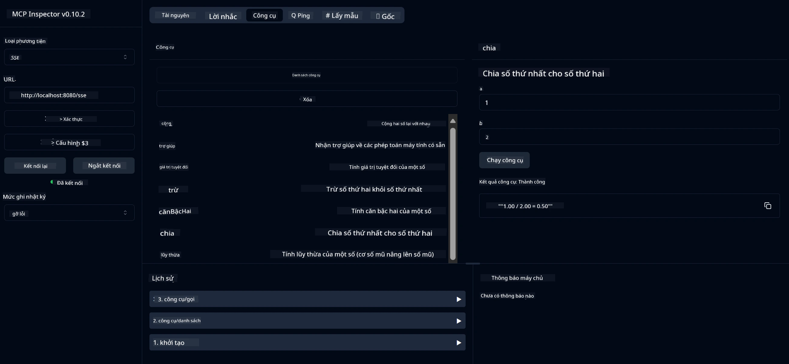

# Dịch vụ Máy tính Cơ bản MCP

> [!NOTE]
> Ví dụ này sử dụng giao thức truyền tải HTTP+SSE cũ và hướng đến một SDK tương thích
> với MCP `2025-11-25`. Các máy chủ từ xa mới nên sử dụng hỗ trợ HTTP Streamable
> `2026-07-28`.

Dịch vụ này cung cấp các phép tính cơ bản qua Giao thức Ngữ cảnh Mô hình (MCP) sử dụng Spring Boot với giao thức WebFlux. Nó được thiết kế như một ví dụ đơn giản cho người mới bắt đầu tìm hiểu về triển khai MCP.

Để biết thêm thông tin, xem tài liệu tham khảo [MCP Server Boot Starter](https://docs.spring.io/spring-ai/reference/api/mcp/mcp-server-boot-starter-docs.html).

## Tổng quan

Dịch vụ trình diễn:
- Hỗ trợ SSE (Sự kiện do máy chủ gửi)
- Đăng ký công cụ tự động sử dụng chú thích `@Tool` của Spring AI
- Các chức năng máy tính cơ bản:
  - Cộng, trừ, nhân, chia
  - Tính lũy thừa và căn bậc hai
  - Phép lấy phần dư (modulus) và giá trị tuyệt đối
  - Hàm trợ giúp mô tả các phép toán

## Tính năng

Dịch vụ máy tính này cung cấp các khả năng sau:

1. **Các phép toán số học cơ bản**:
   - Cộng hai số
   - Trừ số thứ hai từ số thứ nhất
   - Nhân hai số
   - Chia số thứ nhất cho số thứ hai (có kiểm tra chia cho 0)

2. **Phép toán nâng cao**:
   - Tính lũy thừa (nâng cơ số lên mũ)
   - Tính căn bậc hai (có kiểm tra số âm)
   - Tính phần dư (modulus)
   - Tính giá trị tuyệt đối

3. **Hệ thống trợ giúp**:
   - Hàm trợ giúp tích hợp giải thích tất cả các phép toán có sẵn

## Sử dụng Dịch vụ

Dịch vụ cung cấp các điểm cuối API sau qua giao thức MCP:

- `add(a, b)`: Cộng hai số lại với nhau
- `subtract(a, b)`: Trừ số thứ hai từ số thứ nhất
- `multiply(a, b)`: Nhân hai số
- `divide(a, b)`: Chia số thứ nhất cho số thứ hai (có kiểm tra số 0)
- `power(base, exponent)`: Tính lũy thừa của một số
- `squareRoot(number)`: Tính căn bậc hai (có kiểm tra số âm)
- `modulus(a, b)`: Tính phần dư khi chia
- `absolute(number)`: Tính giá trị tuyệt đối
- `help()`: Lấy thông tin về các phép toán có sẵn

## Khách hàng Thử nghiệm

Một khách hàng thử nghiệm đơn giản được bao gồm trong gói `com.microsoft.mcp.sample.client`. Lớp `SampleCalculatorClient` trình bày các phép toán có sẵn của dịch vụ máy tính.

## Sử dụng Khách hàng LangChain4j

Dự án bao gồm một khách hàng LangChain4j ví dụ trong `com.microsoft.mcp.sample.client.LangChain4jClient` minh họa cách tích hợp dịch vụ máy tính với LangChain4j và các mô hình GitHub:

### Yêu cầu Trước

1. **Cài đặt Token GitHub**:
   
   Để sử dụng các mô hình AI của GitHub (như phi-4), bạn cần một token truy cập cá nhân GitHub:

   a. Vào phần cài đặt tài khoản GitHub của bạn: https://github.com/settings/tokens
   
   b. Nhấn "Generate new token" → "Generate new token (classic)"
   
   c. Đặt tên mô tả cho token
   
   d. Chọn các phạm vi sau:
      - `repo` (Quản lý đầy đủ kho riêng tư)
      - `read:org` (Đọc tổ chức và thành viên nhóm, đọc dự án tổ chức)
      - `gist` (Tạo gists)
      - `user:email` (Truy cập địa chỉ email người dùng (chỉ đọc))
   
   e. Nhấn "Generate token" và sao chép token mới
   
   f. Đặt nó làm biến môi trường:
      
      Trên Windows:
      ```
      set GITHUB_TOKEN=your-github-token
      ```
      
      Trên macOS/Linux:
      ```bash
      export GITHUB_TOKEN=your-github-token
      ```

   g. Để thiết lập lâu dài, thêm vào biến môi trường qua cài đặt hệ thống

2. Thêm phụ thuộc LangChain4j GitHub vào dự án của bạn (đã có trong pom.xml):
   ```xml
   <dependency>
       <groupId>dev.langchain4j</groupId>
       <artifactId>langchain4j-github</artifactId>
       <version>${langchain4j.version}</version>
   </dependency>
   ```

3. Đảm bảo máy chủ máy tính đang chạy tại `localhost:8080`

### Chạy Khách hàng LangChain4j

Ví dụ này trình bày:
- Kết nối với máy chủ MCP máy tính qua giao thức SSE
- Sử dụng LangChain4j để tạo chatbot tận dụng các phép toán máy tính
- Tích hợp với các mô hình AI của GitHub (hiện dùng mô hình phi-4)

Khách hàng gửi các truy vấn ví dụ sau để minh họa chức năng:
1. Tính tổng hai số
2. Tìm căn bậc hai của một số
3. Lấy thông tin trợ giúp về các phép toán máy tính có sẵn

Chạy ví dụ và xem đầu ra console để thấy cách mô hình AI sử dụng các công cụ máy tính để trả lời truy vấn.

### Cấu hình Mô hình GitHub

Khách hàng LangChain4j được cấu hình sử dụng mô hình phi-4 của GitHub với các thiết lập sau:

```java
ChatLanguageModel model = GitHubChatModel.builder()
    .apiKey(System.getenv("GITHUB_TOKEN"))
    .timeout(Duration.ofSeconds(60))
    .modelName("phi-4")
    .logRequests(true)
    .logResponses(true)
    .build();
```

Để dùng các mô hình GitHub khác, chỉ cần thay đổi tham số `modelName` sang mô hình được hỗ trợ khác (ví dụ: "claude-3-haiku-20240307", "llama-3-70b-8192", v.v.).

## Phụ thuộc

Dự án yêu cầu các phụ thuộc chính sau:

```xml
<!-- For MCP Server -->
<dependency>
    <groupId>org.springframework.ai</groupId>
    <artifactId>spring-ai-starter-mcp-server-webflux</artifactId>
</dependency>

<!-- For LangChain4j integration -->
<dependency>
    <groupId>dev.langchain4j</groupId>
    <artifactId>langchain4j-mcp</artifactId>
    <version>${langchain4j.version}</version>
</dependency>

<!-- For GitHub models support -->
<dependency>
    <groupId>dev.langchain4j</groupId>
    <artifactId>langchain4j-github</artifactId>
    <version>${langchain4j.version}</version>
</dependency>
```

## Xây dựng Dự án

Xây dựng dự án bằng Maven:
```bash
./mvnw clean install -DskipTests
```

## Chạy Máy chủ

### Sử dụng Java

```bash
java -jar target/calculator-server-0.0.1-SNAPSHOT.jar
```

### Sử dụng MCP Inspector

MCP Inspector là công cụ hữu ích để tương tác với các dịch vụ MCP. Để sử dụng nó với dịch vụ máy tính này:

1. **Cài đặt và chạy MCP Inspector** trong cửa sổ terminal mới:
   ```bash
   npx @modelcontextprotocol/inspector
   ```

2. **Truy cập giao diện web** bằng cách nhấp vào URL được ứng dụng hiển thị (thông thường là http://localhost:6274)

3. **Cấu hình kết nối**:
   - Đặt loại giao thức truyền tải thành "SSE"
   - Đặt URL đến điểm cuối SSE của máy chủ đang chạy: `http://localhost:8080/sse`
   - Nhấn "Connect"

4. **Sử dụng các công cụ**:
   - Nhấn "List Tools" để xem các phép toán máy tính sẵn có
   - Chọn một công cụ và nhấn "Run Tool" để thực thi phép toán



### Sử dụng Docker

Dự án bao gồm Dockerfile để triển khai đóng gói:

1. **Xây dựng ảnh Docker**:
   ```bash
   docker build -t calculator-mcp-service .
   ```

2. **Chạy container Docker**:
   ```bash
   docker run -p 8080:8080 calculator-mcp-service
   ```

Việc này sẽ:
- Xây dựng ảnh Docker đa giai đoạn với Maven 3.9.9 và Eclipse Temurin 24 JDK
- Tạo ảnh container tối ưu hóa
- Mở cổng dịch vụ trên 8080
- Khởi động dịch vụ máy tính MCP bên trong container

Bạn có thể truy cập dịch vụ tại `http://localhost:8080` sau khi container chạy.

## Khắc phục sự cố

### Các vấn đề thường gặp với Token GitHub

1. **Vấn đề quyền Token**: Nếu bạn nhận lỗi 403 Forbidden, hãy kiểm tra token của bạn có quyền đúng như yêu cầu trong phần cài đặt trước hay không.

2. **Không tìm thấy Token**: Nếu bạn nhận lỗi "No API key found", đảm bảo biến môi trường GITHUB_TOKEN đã được thiết lập đúng.

3. **Giới hạn tốc độ**: API của GitHub có giới hạn tốc độ. Nếu gặp lỗi giới hạn (mã trạng thái 429), hãy chờ vài phút rồi thử lại.

4. **Token hết hạn**: Token GitHub có thể hết hạn. Nếu nhận lỗi xác thực sau một thời gian, hãy tạo token mới và cập nhật biến môi trường.

Nếu cần thêm trợ giúp, hãy xem [tài liệu LangChain4j](https://github.com/langchain4j/langchain4j) hoặc [tài liệu API GitHub](https://docs.github.com/en/rest).

---

<!-- CO-OP TRANSLATOR DISCLAIMER START -->
**Tuyên bố miễn trừ trách nhiệm**:
Tài liệu này đã được dịch bằng dịch vụ dịch thuật AI [Co-op Translator](https://github.com/Azure/co-op-translator). Mặc dù chúng tôi cố gắng đảm bảo độ chính xác, xin lưu ý rằng bản dịch tự động có thể chứa lỗi hoặc sai sót. Tài liệu gốc bằng ngôn ngữ gốc nên được coi là nguồn tin chính thức. Đối với thông tin quan trọng, nên sử dụng dịch vụ dịch thuật chuyên nghiệp bởi con người. Chúng tôi không chịu trách nhiệm về bất kỳ hiểu lầm hoặc giải thích sai nào phát sinh từ việc sử dụng bản dịch này.
<!-- CO-OP TRANSLATOR DISCLAIMER END -->