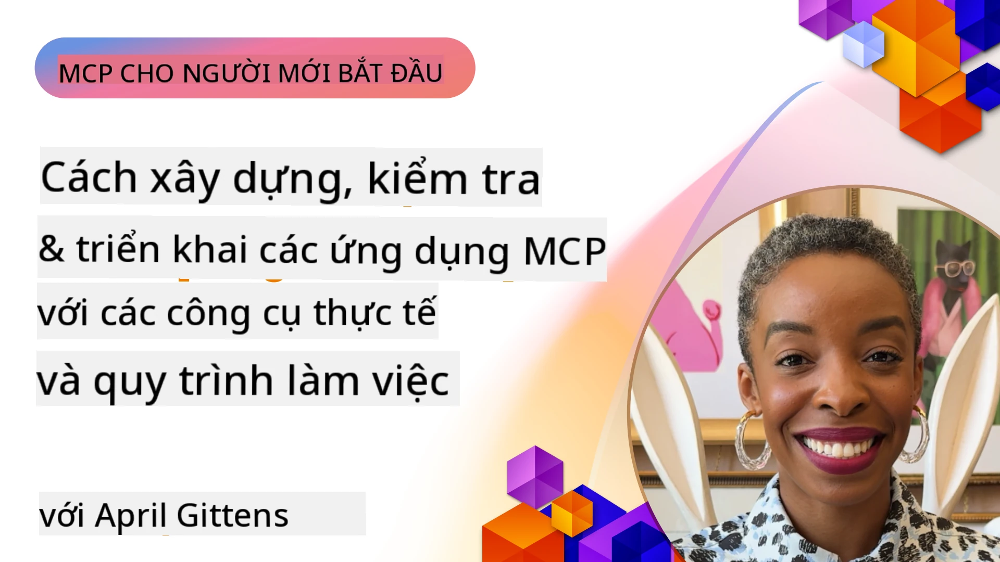
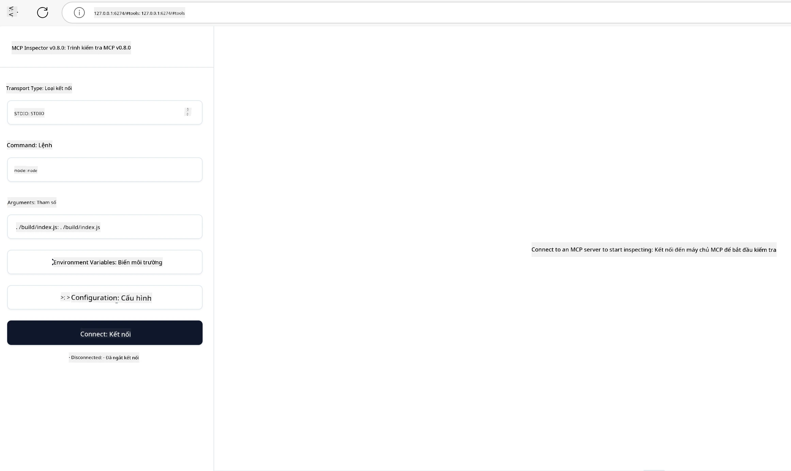

# Triển khai Thực tế

[](https://youtu.be/vCN9-mKBDfQ)

_(Nhấp vào hình ảnh trên để xem video bài học này)_

Triển khai thực tế là nơi mà sức mạnh của Model Context Protocol (MCP) trở nên hữu hình. Trong khi việc hiểu lý thuyết và kiến trúc phía sau MCP rất quan trọng, giá trị thực sự xuất hiện khi bạn áp dụng các khái niệm này để xây dựng, kiểm thử và triển khai các giải pháp giải quyết vấn đề thực tế. Chương này sẽ kết nối khoảng cách giữa kiến thức khái niệm và phát triển thực hành, hướng dẫn bạn qua quá trình biến các ứng dụng dựa trên MCP thành hiện thực.

Dù bạn đang phát triển trợ lý thông minh, tích hợp AI vào quy trình làm việc doanh nghiệp, hay xây dựng các công cụ tùy chỉnh để xử lý dữ liệu, MCP cung cấp một nền tảng linh hoạt. Thiết kế không phụ thuộc ngôn ngữ và các SDK chính thức cho các ngôn ngữ lập trình phổ biến làm cho nó dễ tiếp cận với nhiều nhà phát triển khác nhau. Bằng cách tận dụng các SDK này, bạn có thể nhanh chóng tạo mẫu, lặp lại và mở rộng giải pháp của mình trên các nền tảng và môi trường khác nhau.

Trong các phần tiếp theo, bạn sẽ tìm thấy các ví dụ thực tế, mã mẫu và chiến lược triển khai minh họa cách thực hiện MCP trong C#, Java với Spring, TypeScript, JavaScript và Python. Bạn cũng sẽ học cách gỡ lỗi và kiểm thử máy chủ MCP, quản lý API, và triển khai giải pháp lên đám mây bằng Azure. Các tài nguyên thực hành này được thiết kế để tăng tốc việc học của bạn và giúp bạn tự tin xây dựng các ứng dụng MCP mạnh mẽ, sẵn sàng cho sản xuất.

## Tổng quan

Bài học này tập trung vào các khía cạnh thực tiễn của việc triển khai MCP trên nhiều ngôn ngữ lập trình. Chúng ta sẽ khám phá cách sử dụng các SDK MCP trong C#, Java với Spring, TypeScript, JavaScript và Python để xây dựng các ứng dụng vững chắc, gỡ lỗi và kiểm thử máy chủ MCP, và tạo các tài nguyên, lời nhắc và công cụ có thể tái sử dụng.

## Mục tiêu học tập

Kết thúc bài học, bạn sẽ có thể:

- Triển khai các giải pháp MCP sử dụng SDK chính thức trên nhiều ngôn ngữ lập trình
- Gỡ lỗi và kiểm thử máy chủ MCP một cách hệ thống
- Tạo và sử dụng các tính năng máy chủ (Tài nguyên, Lời nhắc và Công cụ)
- Thiết kế các quy trình làm việc MCP hiệu quả cho các nhiệm vụ phức tạp
- Tối ưu hóa triển khai MCP về hiệu năng và độ tin cậy

## Tài nguyên SDK Chính thức

Model Context Protocol cung cấp các SDK chính thức cho nhiều ngôn ngữ (theo [Đặc tả MCP 2025-11-25](https://spec.modelcontextprotocol.io/specification/2025-11-25/)):

- [C# SDK](https://github.com/modelcontextprotocol/csharp-sdk)
- [Java với Spring SDK](https://github.com/modelcontextprotocol/java-sdk) **Lưu ý:** yêu cầu phụ thuộc vào [Project Reactor](https://projectreactor.io). (Xem [thảo luận issue 246](https://github.com/orgs/modelcontextprotocol/discussions/246).)
- [TypeScript SDK](https://github.com/modelcontextprotocol/typescript-sdk)
- [Python SDK](https://github.com/modelcontextprotocol/python-sdk)
- [Kotlin SDK](https://github.com/modelcontextprotocol/kotlin-sdk)
- [Go SDK](https://github.com/modelcontextprotocol/go-sdk)

## Làm việc với SDK MCP

Phần này cung cấp các ví dụ thực tế về triển khai MCP trên nhiều ngôn ngữ lập trình. Bạn có thể tìm mã mẫu trong thư mục `samples` được tổ chức theo ngôn ngữ.

### Mẫu Có Sẵn

Kho lưu trữ bao gồm [các mẫu triển khai](../../../04-PracticalImplementation/samples) ở các ngôn ngữ sau:

- [C#](./samples/csharp/README.md)
- [Java với Spring](./samples/java/containerapp/README.md)
- [TypeScript](./samples/typescript/README.md)
- [JavaScript](./samples/javascript/README.md)
- [Python](./samples/python/README.md)

Mỗi mẫu minh họa các khái niệm chính và mẫu triển khai MCP cho ngôn ngữ và hệ sinh thái cụ thể đó.

### Hướng dẫn Thực tế

Các hướng dẫn bổ sung để triển khai MCP thực tế:

- [Phân trang và Bộ Kết quả Lớn](./pagination/README.md) - Xử lý phân trang dựa trên con trỏ cho công cụ, tài nguyên và bộ dữ liệu lớn

## Tính năng cốt lõi của Máy chủ

Máy chủ MCP có thể thực hiện bất kỳ kết hợp nào các tính năng sau:

### Tài nguyên

Tài nguyên cung cấp ngữ cảnh và dữ liệu cho người dùng hoặc mô hình AI sử dụng:

- Kho tài liệu
- Cơ sở kiến thức
- Nguồn dữ liệu có cấu trúc
- Hệ thống tệp

### Lời nhắc

Lời nhắc là các mẫu tin nhắn và quy trình làm việc dành cho người dùng:

- Mẫu hội thoại đã định sẵn
- Mẫu tương tác được hướng dẫn
- Cấu trúc đối thoại chuyên biệt

### Công cụ

Công cụ là các chức năng để mô hình AI thực thi:

- Tiện ích xử lý dữ liệu
- Tích hợp API bên ngoài
- Khả năng tính toán
- Chức năng tìm kiếm

## Mẫu Triển khai: Triển khai C#

Kho lưu trữ SDK C# chính thức chứa nhiều mẫu triển khai thể hiện các khía cạnh khác nhau của MCP:

- **Khách hàng MCP cơ bản**: ví dụ đơn giản minh họa cách tạo khách hàng MCP và gọi công cụ
- **Máy chủ MCP cơ bản**: triển khai máy chủ tối thiểu với đăng ký công cụ cơ bản
- **Máy chủ MCP nâng cao**: máy chủ đầy đủ tính năng với đăng ký công cụ, xác thực và xử lý lỗi
- **Tích hợp ASP.NET**: ví dụ minh họa tích hợp với ASP.NET Core
- **Mẫu triển khai Công cụ**: các mẫu khác nhau để triển khai công cụ với các mức độ phức tạp khác nhau

SDK MCP C# đang trong giai đoạn xem trước và API có thể thay đổi. Chúng tôi sẽ liên tục cập nhật blog này khi SDK phát triển.

### Tính năng chính

- [Nuget MCP C# ModelContextProtocol](https://www.nuget.org/packages/ModelContextProtocol)
- Xây dựng [Máy chủ MCP đầu tiên của bạn](https://devblogs.microsoft.com/dotnet/build-a-model-context-protocol-mcp-server-in-csharp/).

Để xem các mẫu triển khai C# đầy đủ, hãy truy cập kho mẫu SDK C# chính thức tại [https://github.com/modelcontextprotocol/csharp-sdk](https://github.com/modelcontextprotocol/csharp-sdk)

## Mẫu triển khai: Triển khai Java với Spring

SDK Java với Spring cung cấp các tùy chọn triển khai MCP mạnh mẽ với tính năng cấp doanh nghiệp.

### Tính năng chính

- Tích hợp Spring Framework
- An toàn kiểu mạnh mẽ
- Hỗ trợ lập trình phản ứng
- Xử lý lỗi toàn diện

Để xem một mẫu triển khai Java với Spring đầy đủ, xem [mẫu Java với Spring](samples/java/containerapp/README.md) trong thư mục samples.

## Mẫu triển khai: Triển khai JavaScript

SDK JavaScript cung cấp một cách tiếp cận nhẹ nhàng và linh hoạt để triển khai MCP.

### Tính năng chính

- Hỗ trợ Node.js và trình duyệt
- API dựa trên Promise
- Dễ dàng tích hợp với Express và các framework khác
- Hỗ trợ WebSocket cho streaming

Để xem một mẫu triển khai JavaScript đầy đủ, xem [mẫu JavaScript](samples/javascript/README.md) trong thư mục samples.

## Mẫu triển khai: Triển khai Python

SDK Python cung cấp một cách tiếp cận Python đặc trưng để triển khai MCP với tích hợp các framework ML xuất sắc.

### Tính năng chính

- Hỗ trợ async/await với asyncio
- Tích hợp FastAPI``
- Đăng ký công cụ đơn giản
- Tích hợp bản địa với các thư viện ML phổ biến

Để xem một mẫu triển khai Python đầy đủ, xem [mẫu Python](samples/python/README.md) trong thư mục samples.

## Quản lý API

Azure API Management là một câu trả lời tuyệt vời cho câu hỏi làm thế nào để bảo mật máy chủ MCP. Ý tưởng là đặt một thể hiện Azure API Management trước máy chủ MCP của bạn và để nó xử lý các tính năng bạn có thể muốn như:

- giới hạn tần suất
- quản lý token
- giám sát
- cân bằng tải
- bảo mật

### Mẫu Azure

Dưới đây là một mẫu Azure làm đúng điều đó, tức là [tạo một máy chủ MCP và bảo mật nó với Azure API Management](https://github.com/Azure-Samples/remote-mcp-apim-functions-python).

Xem cách luồng ủy quyền diễn ra trong hình dưới đây:


Trong hình ảnh trên, các bước sau diễn ra:

- Xác thực/Ủy quyền diễn ra bằng Microsoft Entra.
- Azure API Management đóng vai trò cửa ngõ và sử dụng các chính sách để điều khiển và quản lý luồng truy cập.
- Azure Monitor ghi lại tất cả các yêu cầu để phân tích thêm.

#### Luồng Ủy quyền

Hãy xem chi tiết hơn về luồng ủy quyền:


#### Đặc tả Ủy quyền MCP

Tìm hiểu thêm về [Đặc tả Ủy quyền MCP](https://spec.modelcontextprotocol.io/specification/2025-11-25/basic/authorization/)

## Triển khai Máy chủ MCP từ xa lên Azure

Hãy xem liệu chúng ta có thể triển khai mẫu đã đề cập trước đó hay không:

1. Clone repo

    ```bash
    git clone https://github.com/Azure-Samples/remote-mcp-apim-functions-python.git
    cd remote-mcp-apim-functions-python
    ```

1. Đăng ký nhà cung cấp tài nguyên `Microsoft.App`.

   - Nếu bạn sử dụng Azure CLI, chạy `az provider register --namespace Microsoft.App --wait`.
   - Nếu bạn sử dụng Azure PowerShell, chạy `Register-AzResourceProvider -ProviderNamespace Microsoft.App`. Sau đó chạy `(Get-AzResourceProvider -ProviderNamespace Microsoft.App).RegistrationState` sau một thời gian để kiểm tra xem đăng ký đã hoàn tất chưa.

1. Chạy lệnh [azd](https://aka.ms/azd) này để cấp phát dịch vụ quản lý API, ứng dụng hàm (kèm mã) và tất cả các tài nguyên Azure cần thiết khác

    ```shell
    azd up
    ```

    Lệnh này sẽ triển khai tất cả các tài nguyên đám mây trên Azure

### Kiểm tra máy chủ của bạn với MCP Inspector

1. Trong **cửa sổ terminal mới**, cài đặt và chạy MCP Inspector

    ```shell
    npx @modelcontextprotocol/inspector
    ```

    Bạn sẽ thấy giao diện tương tự như:

    

1. Nhấn CTRL click để tải ứng dụng web MCP Inspector từ URL hiển thị bởi app (ví dụ [http://127.0.0.1:6274/#resources](http://127.0.0.1:6274/#resources))
1. Đặt loại truyền tải là `SSE`
1. Đặt URL đến điểm cuối API Management SSE đang chạy của bạn hiển thị sau khi chạy `azd up` và **Kết nối**:

    ```shell
    https://<apim-servicename-from-azd-output>.azure-api.net/mcp/sse
    ```

1. **Danh sách Công cụ**. Nhấp vào một công cụ và **Chạy Công cụ**.

Nếu tất cả các bước đã thành công, bạn hiện đã kết nối được với máy chủ MCP và có thể gọi một công cụ.

## Máy chủ MCP cho Azure

[Remote-mcp-functions](https://github.com/Azure-Samples/remote-mcp-functions-dotnet): Bộ kho lưu trữ này là mẫu khởi động nhanh để xây dựng và triển khai các máy chủ MCP từ xa tùy chỉnh sử dụng Azure Functions với Python, C# .NET hoặc Node/TypeScript.

Các mẫu cung cấp giải pháp hoàn chỉnh cho phép nhà phát triển:

- Xây dựng và chạy cục bộ: Phát triển và gỡ lỗi máy chủ MCP trên máy tính cá nhân
- Triển khai lên Azure: Triển khai dễ dàng lên đám mây chỉ với lệnh azd up đơn giản
- Kết nối từ các client: Kết nối đến máy chủ MCP từ nhiều client khác nhau bao gồm VS Code ở chế độ agent Copilot và công cụ MCP Inspector

### Tính năng chính

- Bảo mật theo thiết kế: Máy chủ MCP được bảo vệ sử dụng khóa và HTTPS
- Tùy chọn xác thực: Hỗ trợ OAuth với xác thực tích hợp và/hoặc API Management
- Cô lập mạng: Cho phép cô lập mạng sử dụng Azure Virtual Networks (VNET)
- Kiến trúc không máy chủ: Tận dụng Azure Functions cho thực thi có thể mở rộng, dựa trên sự kiện
- Phát triển cục bộ: Hỗ trợ phát triển và gỡ lỗi cục bộ toàn diện
- Triển khai đơn giản: Quy trình triển khai Azure tinh gọn

Kho lưu trữ bao gồm tất cả các tệp cấu hình cần thiết, mã nguồn và định nghĩa hạ tầng để nhanh chóng bắt đầu với triển khai máy chủ MCP sẵn sàng cho sản xuất.

- [Azure Remote MCP Functions Python](https://github.com/Azure-Samples/remote-mcp-functions-python) - Mẫu triển khai MCP sử dụng Azure Functions với Python

- [Azure Remote MCP Functions .NET](https://github.com/Azure-Samples/remote-mcp-functions-dotnet) - Mẫu triển khai MCP sử dụng Azure Functions với C# .NET

- [Azure Remote MCP Functions Node/Typescript](https://github.com/Azure-Samples/remote-mcp-functions-typescript) - Mẫu triển khai MCP sử dụng Azure Functions với Node/TypeScript.

## Những điểm chính cần nhớ

- SDK MCP cung cấp các công cụ đặc trưng theo ngôn ngữ để triển khai các giải pháp MCP mạnh mẽ
- Quá trình gỡ lỗi và kiểm thử rất quan trọng để đảm bảo ứng dụng MCP tin cậy
- Mẫu lời nhắc có thể tái sử dụng giúp tương tác AI nhất quán
- Quy trình làm việc được thiết kế tốt có thể điều phối các tác vụ phức tạp sử dụng nhiều công cụ
- Triển khai giải pháp MCP cần xem xét vấn đề bảo mật, hiệu năng và xử lý lỗi

## Bài tập

Thiết kế một quy trình làm việc MCP thực tế giải quyết một vấn đề thực tế trong lĩnh vực của bạn:

1. Xác định 3-4 công cụ sẽ hữu ích để giải quyết vấn đề này
2. Tạo sơ đồ quy trình làm việc cho thấy cách các công cụ này tương tác
3. Triển khai phiên bản cơ bản của một trong các công cụ bằng ngôn ngữ bạn ưa thích
4. Tạo mẫu lời nhắc giúp mô hình sử dụng công cụ của bạn hiệu quả

## Tài nguyên Bổ sung

---

## Tiếp theo

Tiếp: [Chủ đề Nâng cao](../05-AdvancedTopics/README.md)

---

<!-- CO-OP TRANSLATOR DISCLAIMER START -->
**Tuyên bố miễn trách**:  
Tài liệu này đã được dịch bằng dịch vụ dịch thuật AI [Co-op Translator](https://github.com/Azure/co-op-translator). Mặc dù chúng tôi nỗ lực đảm bảo độ chính xác, xin lưu ý rằng bản dịch tự động có thể chứa lỗi hoặc không chính xác. Tài liệu gốc bằng ngôn ngữ bản địa nên được xem là nguồn tham khảo chính thức. Đối với các thông tin quan trọng, chúng tôi khuyến nghị sử dụng dịch vụ dịch thuật chuyên nghiệp của con người. Chúng tôi không chịu trách nhiệm về bất kỳ hiểu lầm hay cách diễn giải sai nào phát sinh từ việc sử dụng bản dịch này.
<!-- CO-OP TRANSLATOR DISCLAIMER END -->