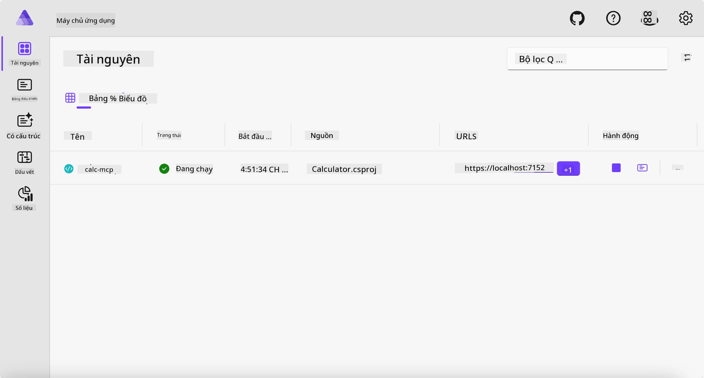
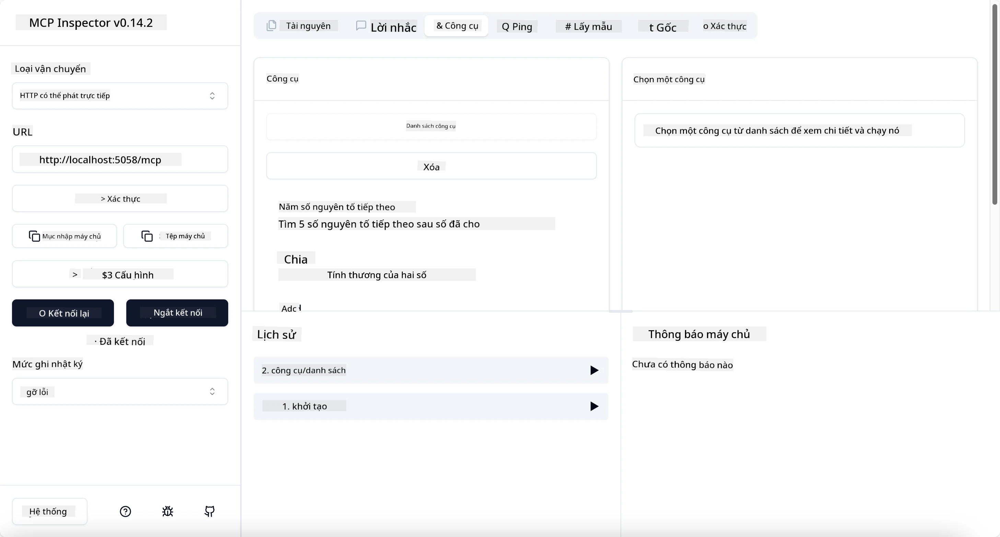
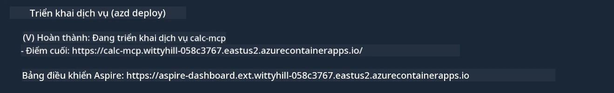

# Ví dụ mẫu

Ví dụ trước cho thấy cách sử dụng một dự án .NET cục bộ với loại `stdio`. Và cách chạy máy chủ cục bộ trong một container. Đây là một giải pháp tốt trong nhiều tình huống. Tuy nhiên, có thể hữu ích khi máy chủ chạy từ xa, như trong môi trường đám mây. Đây là lúc loại `http` phát huy tác dụng.

Xem giải pháp trong thư mục `04-PracticalImplementation`, nó có thể trông phức tạp hơn nhiều so với ví dụ trước. Nhưng thực tế không phải vậy. Nếu bạn nhìn kỹ vào dự án `src/Calculator`, bạn sẽ thấy hầu hết mã giống như ví dụ trước. Điểm khác biệt duy nhất là chúng ta sử dụng thư viện khác `ModelContextProtocol.AspNetCore` để xử lý các yêu cầu HTTP. Và chúng ta thay đổi phương thức `IsPrime` thành private, chỉ để cho thấy bạn có thể có các phương thức private trong mã của mình. Phần còn lại của mã giống như trước.

Các dự án khác đến từ [Aspire](https://aspire.dev/get-started/what-is-aspire/). Việc có Aspire trong giải pháp sẽ cải thiện trải nghiệm của nhà phát triển khi phát triển và thử nghiệm cũng như hỗ trợ khả năng quan sát. Không cần thiết để chạy máy chủ, nhưng đây là một thực hành tốt khi có nó trong giải pháp của bạn.

## Khởi động máy chủ cục bộ

1. Từ VS Code (với tiện ích mở rộng C# DevKit), điều hướng đến thư mục `04-PracticalImplementation/samples/csharp`.
1. Thực thi lệnh sau để khởi động máy chủ:

   ```bash
    dotnet watch run --project ./src/AppHost
   ```

1. Khi trình duyệt web mở bảng điều khiển Aspire, chú ý URL `http`. Nó nên là một thứ gì đó như `http://localhost:5058/`.

   

## Kiểm tra Streamable HTTP với MCP Inspector

Nếu bạn có Node.js 22.7.5 hoặc cao hơn, bạn có thể sử dụng MCP Inspector để kiểm tra máy chủ của mình.

Khởi động máy chủ và chạy lệnh sau trong terminal:

```bash
npx @modelcontextprotocol/inspector http://localhost:5058
```



- Chọn `Streamable HTTP` làm loại Transport.
- Trong trường Url, nhập URL của máy chủ đã ghi trước đó, và thêm `/mcp`. Nó nên là `http` (không phải `https`) kiểu như `http://localhost:5058/mcp`.
- Chọn nút Connect.

Một điều hay về Inspector là nó cung cấp tầm nhìn rõ ràng về những gì đang diễn ra.

- Thử liệt kê các công cụ có sẵn
- Thử một số trong đó, nó sẽ hoạt động như trước.

## Kiểm tra MCP Server với GitHub Copilot Chat trong VS Code

Để sử dụng Streamable HTTP transport với GitHub Copilot Chat, thay đổi cấu hình của máy chủ `calc-mcp` đã tạo trước thành như sau:

```jsonc
// .vscode/mcp.json
{
  "servers": {
    "calc-mcp": {
      "type": "http",
      "url": "http://localhost:5058/mcp"
    }
  }
}
```

Thực hiện một số kiểm tra:

- Hỏi "3 số nguyên tố sau 6780". Xem cách Copilot sẽ sử dụng công cụ mới `NextFivePrimeNumbers` và chỉ trả về 3 số nguyên tố đầu tiên.
- Hỏi "7 số nguyên tố sau 111", để xem điều gì xảy ra.
- Hỏi "John có 24 viên kẹo và muốn phân phát hết cho 3 đứa con của mình. Mỗi đứa con có bao nhiêu viên?", để xem điều gì xảy ra.

## Triển khai máy chủ lên Azure

Hãy triển khai máy chủ lên Azure để nhiều người có thể sử dụng nó hơn.

Từ terminal, điều hướng tới thư mục `04-PracticalImplementation/samples/csharp` và chạy lệnh sau:

```bash
azd up
```

Khi triển khai xong, bạn sẽ thấy một thông báo như sau:



Lấy URL và sử dụng nó trong MCP Inspector và trong GitHub Copilot Chat.

```jsonc
// .vscode/mcp.json
{
  "servers": {
    "calc-mcp": {
      "type": "http",
      "url": "https://calc-mcp.gentleriver-3977fbcf.australiaeast.azurecontainerapps.io/mcp"
    }
  }
}
```

## Tiếp theo là gì?

Chúng ta thử các loại transport khác nhau và công cụ kiểm tra. Chúng ta cũng triển khai máy chủ MCP của bạn lên Azure. Nhưng nếu máy chủ của chúng ta cần truy cập vào tài nguyên riêng tư thì sao? Ví dụ, cơ sở dữ liệu hoặc API riêng? Trong chương tiếp theo, chúng ta sẽ xem cách cải thiện bảo mật máy chủ của mình.

---

<!-- CO-OP TRANSLATOR DISCLAIMER START -->
**Tuyên bố miễn trừ trách nhiệm**:
Tài liệu này đã được dịch bằng dịch vụ dịch thuật AI [Co-op Translator](https://github.com/Azure/co-op-translator). Mặc dù chúng tôi cố gắng đảm bảo độ chính xác, xin lưu ý rằng bản dịch tự động có thể chứa lỗi hoặc sai sót. Tài liệu gốc bằng ngôn ngữ gốc nên được coi là nguồn tin chính thức. Đối với thông tin quan trọng, nên sử dụng dịch vụ dịch thuật chuyên nghiệp bởi con người. Chúng tôi không chịu trách nhiệm về bất kỳ hiểu lầm hoặc giải thích sai nào phát sinh từ việc sử dụng bản dịch này.
<!-- CO-OP TRANSLATOR DISCLAIMER END -->