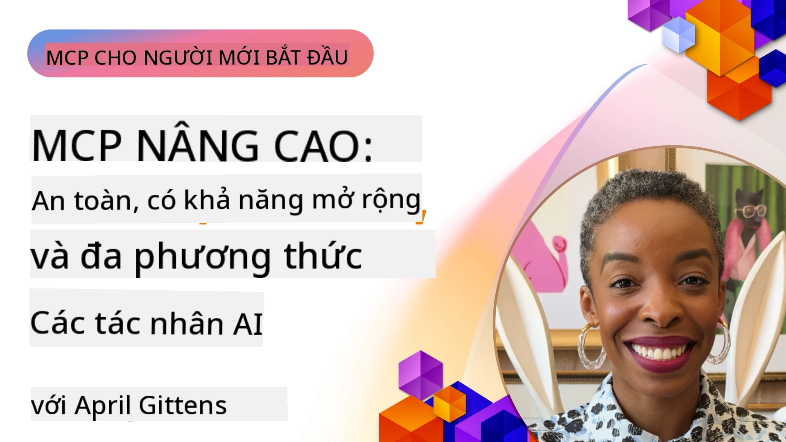

# Chủ đề nâng cao trong MCP

_(Nhấn vào hình ảnh trên để xem video bài học này)_

Chương này bao gồm một loạt các chủ đề nâng cao về triển khai Giao thức Ngữ cảnh Mô hình (MCP), bao gồm tích hợp đa phương thức, khả năng mở rộng, các thực tiễn bảo mật tốt nhất và tích hợp doanh nghiệp. Những chủ đề này rất quan trọng để xây dựng các ứng dụng MCP mạnh mẽ và sẵn sàng cho sản xuất, đáp ứng được các yêu cầu của hệ thống AI hiện đại.

## Tổng quan

Bài học này khám phá các khái niệm nâng cao trong triển khai Giao thức Ngữ cảnh Mô hình, tập trung vào tích hợp đa phương thức, khả năng mở rộng, các thực tiễn bảo mật tốt nhất và tích hợp doanh nghiệp. Những chủ đề này rất cần thiết để xây dựng các ứng dụng MCP cấp sản xuất có thể xử lý các yêu cầu phức tạp trong môi trường doanh nghiệp.

> **Lưu ý về đặc tả hiện tại:** MCP `2026-07-28` loại bỏ các nguyên thủy Roots và
> Sampling được đề cập trong các bài học 5.4 và 5.6. Nó cũng chuyển
> tính năng Tasks thử nghiệm được tham chiếu trong Tính năng Giao thức (5.16) sang
> phần mở rộng Tasks riêng biệt. Các bài học đó được giữ lại cho các triển khai kế thừa
> `2025-11-25` và bao gồm hướng dẫn di trú. Xem
> [Có gì thay đổi trong MCP: Đặc tả 2026-07-28](../01-CoreConcepts/mcp-2026-07-28.md).

## Mục tiêu học tập

Vào cuối bài học này, bạn sẽ có thể:

- Triển khai các khả năng đa phương thức trong khung MCP
- Thiết kế kiến trúc MCP có khả năng mở rộng cho các kịch bản yêu cầu cao
- Áp dụng các thực tiễn bảo mật tốt nhất phù hợp với các nguyên tắc bảo mật của MCP
- Tích hợp MCP với các hệ thống và khung AI doanh nghiệp
- Tối ưu hiệu suất và độ tin cậy trong môi trường sản xuất

## Bài học và dự án mẫu

| Liên kết | Tiêu đề | Mô tả |
|------|-------|-------------|
| [5.1 Integration with Azure](./mcp-integration/README.md) | Tích hợp với Azure | Tìm hiểu cách tích hợp MCP Server của bạn trên Azure |
| [5.2 Multi modal sample](./mcp-multi-modality/README.md) | Mẫu đa phương thức MCP  | Mẫu cho âm thanh, hình ảnh và phản hồi đa phương thức |
| [5.3 MCP OAuth2 sample](../../../05-AdvancedTopics/mcp-oauth2-demo) | Demo MCP OAuth2 | Ứng dụng Spring Boot tối giản trình bày OAuth2 với MCP, vừa như Authorization vừa là Resource Server. Minh họa cấp phát token bảo mật, các điểm cuối được bảo vệ, triển khai Azure Container Apps, và tích hợp Quản lý API. |
| [5.4 Root Contexts](./mcp-root-contexts/README.md) | Ngữ cảnh gốc | Tìm hiểu nguyên thủy Roots kế thừa `2025-11-25` và các tùy chọn di trú hiện tại (bị loại bỏ trong `2026-07-28`) |
| [5.5 Routing](./mcp-routing/README.md) | Định tuyến | Tìm hiểu các loại định tuyến khác nhau |
| [5.6 Sampling](./mcp-sampling/README.md) | Sampling | Tìm hiểu nguyên thủy Sampling kế thừa `2025-11-25` và các tùy chọn di trú hiện tại (bị loại bỏ trong `2026-07-28`) |
| [5.7 Scaling](./mcp-scaling/README.md) | Mở rộng  | Tìm hiểu về mở rộng |
| [5.8 Security](./mcp-security/README.md) | Bảo mật  | Bảo mật MCP Server của bạn |
| [5.9 Web Search sample](./web-search-mcp/README.md) | Tìm kiếm web MCP | MCP server và client Python tích hợp với SerpAPI để tìm kiếm web, tin tức, sản phẩm và hỏi đáp theo thời gian thực. Minh họa điều phối đa công cụ, tích hợp API bên ngoài, và xử lý lỗi mạnh mẽ. |
| [5.10 Realtime Streaming](./mcp-realtimestreaming/README.md) | Streaming  | Streaming dữ liệu thời gian thực đã trở thành thiết yếu trong thế giới dữ liệu ngày nay, nơi doanh nghiệp và ứng dụng cần truy cập thông tin ngay lập tức để đưa ra quyết định kịp thời.|
| [5.11 Realtime Web Search](./mcp-realtimesearch/README.md) | Tìm kiếm Web | Tìm kiếm web thời gian thực và cách MCP thay đổi tìm kiếm web thời gian thực bằng việc cung cấp phương pháp chuẩn hóa quản lý ngữ cảnh giữa các mô hình AI, công cụ tìm kiếm và ứng dụng.| 
| [5.12  Entra ID Authentication for Model Context Protocol Servers](./mcp-security-entra/README.md) | Xác thực Entra ID | Microsoft Entra ID cung cấp giải pháp quản lý danh tính và truy cập dựa trên đám mây mạnh mẽ, giúp đảm bảo chỉ người dùng và ứng dụng được ủy quyền mới có thể tương tác với MCP server của bạn.|
| [5.13 Microsoft Foundry Agent Integration](./mcp-foundry-agent-integration/README.md) | Tích hợp Microsoft Foundry | Tìm hiểu cách tích hợp MCP server với các agent Microsoft Foundry, cho phép điều phối công cụ mạnh mẽ và khả năng AI doanh nghiệp với các kết nối nguồn dữ liệu bên ngoài chuẩn hóa.|
| [5.14 Context Engineering](./mcp-contextengineering/README.md) | Kỹ thuật ngữ cảnh | Cơ hội tương lai của các kỹ thuật kỹ thuật ngữ cảnh cho MCP server, bao gồm tối ưu ngữ cảnh, quản lý ngữ cảnh động và các chiến lược kỹ thuật prompt hiệu quả trong khung MCP.|
| [5.15 MCP Custom Transport](./mcp-transport/README.md) | Giao thức tùy chỉnh | Tìm hiểu cách triển khai các cơ chế truyền tải tùy chỉnh cho các kịch bản giao tiếp MCP chuyên biệt.|
| [5.16 Protocol Features Deep Dive](./mcp-protocol-features/README.md) | Tính năng giao thức | Làm chủ các tính năng giao thức nâng cao bao gồm thông báo tiến trình, huỷ yêu cầu, mẫu tài nguyên, và các mô hình xử lý lỗi.|
| [5.17 Adversarial Multi-Agent Reasoning](./mcp-adversarial-agents/README.md) | Tư duy nhiều tác nhân đối kháng | Sử dụng hai tác nhân với quan điểm đối nghịch, chia sẻ một bộ công cụ MCP duy nhất, để phát hiện ảo giác, nổi bật các trường hợp biên và tạo ra kết quả cân chỉnh tốt hơn qua tranh luận có cấu trúc.|

> **Lưu ý lịch sử `2025-11-25`:** bản sửa đổi đó giới thiệu Tasks thử nghiệm
> và mở rộng nhiều tính năng giao thức. Trong `2026-07-28`, Tasks chuyển sang
> phần mở rộng chính thức và Roots bị loại bỏ. Không sử dụng trạng thái tính năng
> `2025-11-25` làm hướng dẫn hiện tại; xem
> [nhật ký thay đổi 2026-07-28](https://modelcontextprotocol.io/specification/2026-07-28/changelog).

## Tài liệu tham khảo bổ sung

Để có thông tin cập nhật nhất về các chủ đề MCP nâng cao, tham khảo:
- [Tài liệu MCP](https://modelcontextprotocol.io/)
- [Đặc tả MCP (2026-07-28)](https://modelcontextprotocol.io/specification/2026-07-28/)
- [Kho GitHub](https://github.com/modelcontextprotocol)
- [OWASP MCP Top 10](https://microsoft.github.io/mcp-azure-security-guide/mcp/) - Rủi ro bảo mật và các biện pháp giảm thiểu
- [Hội thảo MCP Security Summit (Sherpa)](https://azure-samples.github.io/sherpa/) - Đào tạo bảo mật thực hành

## Những điểm chính cần nhớ

- Triển khai MCP đa phương thức mở rộng khả năng AI vượt ra ngoài xử lý văn bản
- Khả năng mở rộng là yếu tố thiết yếu cho triển khai doanh nghiệp và có thể được giải quyết qua mở rộng theo chiều ngang và chiều dọc
- Các biện pháp bảo mật toàn diện bảo vệ dữ liệu và đảm bảo kiểm soát truy cập hợp lệ
- Tích hợp doanh nghiệp với các nền tảng như Azure OpenAI và Microsoft AI Foundry nâng cao khả năng MCP
- Triển khai MCP nâng cao có lợi từ kiến trúc tối ưu và quản lý tài nguyên cẩn thận

## Bài tập

Thiết kế một triển khai MCP cấp doanh nghiệp cho một trường hợp sử dụng cụ thể:

1. Xác định các yêu cầu đa phương thức cho trường hợp sử dụng của bạn
2. Phác thảo các kiểm soát bảo mật cần thiết để bảo vệ dữ liệu nhạy cảm
3. Thiết kế kiến trúc có khả năng mở rộng có thể xử lý tải biến đổi
4. Lập kế hoạch các điểm tích hợp với hệ thống AI doanh nghiệp
5. Ghi chép các nút thắt hiệu suất tiềm năng và các chiến lược giảm thiểu

## Tài nguyên bổ sung

- [Tài liệu Azure OpenAI](https://learn.microsoft.com/en-us/azure/ai-services/openai/)
- [Tài liệu Microsoft AI Foundry](https://learn.microsoft.com/en-us/ai-services/)

---

## Tiếp theo là gì

Khám phá các bài học trong mô-đun này bắt đầu với: [5.1 MCP Integration](./mcp-integration/README.md)

Sau khi hoàn thành mô-đun này, tiếp tục với: [Mô-đun 6: Đóng góp Cộng đồng](../06-CommunityContributions/README.md)

---

<!-- CO-OP TRANSLATOR DISCLAIMER START -->
**Tuyên bố miễn trừ trách nhiệm**:
Tài liệu này đã được dịch bằng dịch vụ dịch thuật AI [Co-op Translator](https://github.com/Azure/co-op-translator). Mặc dù chúng tôi cố gắng đảm bảo độ chính xác, xin lưu ý rằng bản dịch tự động có thể chứa lỗi hoặc sai sót. Tài liệu gốc bằng ngôn ngữ gốc nên được coi là nguồn tin chính thức. Đối với thông tin quan trọng, nên sử dụng dịch vụ dịch thuật chuyên nghiệp bởi con người. Chúng tôi không chịu trách nhiệm về bất kỳ hiểu lầm hoặc giải thích sai nào phát sinh từ việc sử dụng bản dịch này.
<!-- CO-OP TRANSLATOR DISCLAIMER END -->