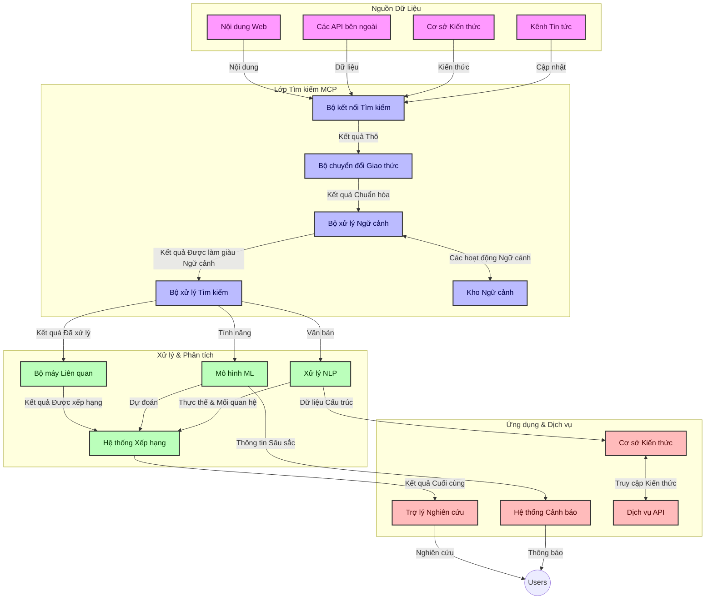
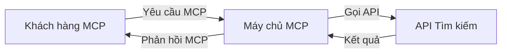
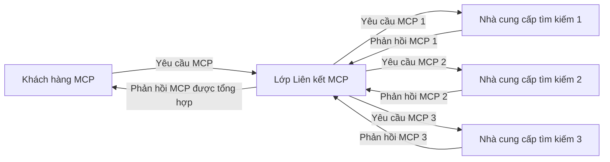
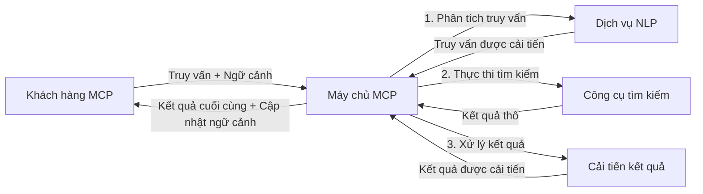

# Giao Thức Ngữ Cảnh Mô Hình cho Tìm Kiếm Web Thời Gian Thực

## Tổng quan

Tìm kiếm web thời gian thực đã trở nên thiết yếu trong môi trường thông tin ngày nay, nơi các ứng dụng cần truy cập ngay lập tức vào thông tin cập nhật trên Internet để cung cấp phản hồi chính xác và kịp thời. Giao Thức Ngữ Cảnh Mô Hình (MCP) đại diện cho một bước tiến đáng kể trong việc tối ưu hóa các quy trình tìm kiếm thời gian thực này, nâng cao hiệu quả tìm kiếm, duy trì tính nguyên vẹn của ngữ cảnh và cải thiện hiệu suất tổng thể của hệ thống.

Mô-đun này khám phá cách MCP biến đổi tìm kiếm web thời gian thực bằng cách cung cấp một phương pháp tiêu chuẩn để quản lý ngữ cảnh giữa các mô hình AI, công cụ tìm kiếm và ứng dụng.

### Những gì bạn sẽ học

Trong hướng dẫn toàn diện này, bạn sẽ khám phá:

- Cách MCP tạo cầu nối liền mạch giữa các mô hình AI và khả năng tìm kiếm web thời gian thực
- Các mẫu kiến trúc để triển khai giải pháp tìm kiếm hiệu quả và có thể mở rộng với MCP
- Kỹ thuật duy trì ngữ cảnh tìm kiếm qua nhiều truy vấn và tương tác
- Triển khai mã thực tế trong Python và JavaScript cho nhiều kịch bản tìm kiếm khác nhau
- Phương pháp cân bằng giữa tính liên quan, tính mới và hiệu suất trong hệ thống tìm kiếm sử dụng MCP

## Giới thiệu về Tìm kiếm Web Thời gian Thực

Tìm kiếm web thời gian thực là một phương pháp công nghệ cho phép truy vấn, xử lý và phân tích thông tin trên web liên tục khi thông tin được đăng tải hoặc cập nhật, giúp các hệ thống cung cấp thông tin mới và liên quan với độ trễ tối thiểu. Khác với hệ thống tìm kiếm truyền thống hoạt động trên dữ liệu đã được lập chỉ mục có thể đã cũ vài giờ hoặc vài ngày, tìm kiếm thời gian thực xử lý dữ liệu trực tiếp từ web, cung cấp những góc nhìn và thông tin phản ánh trạng thái hiện tại của nội dung trực tuyến.

### Các khái niệm cốt lõi của Tìm kiếm Web Thời gian Thực:

- **Xử lý truy vấn liên tục**: Truy vấn tìm kiếm được xử lý dựa trên nguồn dữ liệu liên tục cập nhật
- **Ưu tiên tính mới**: Hệ thống được thiết kế để ưu tiên thông tin mới nhất
- **Cân bằng tính liên quan**: Duy trì sự cân bằng giữa tính liên quan và tính mới
- **Kiến trúc có thể mở rộng**: Hệ thống phải xử lý được tải truy vấn và khối lượng dữ liệu biến đổi
- **Hiểu ngữ cảnh**: Duy trì ngữ cảnh người dùng qua các lượt tìm kiếm là rất quan trọng để có kết quả có ý nghĩa
- **Điều chỉnh truy vấn động**: Thay đổi truy vấn một cách linh hoạt dựa trên ngữ cảnh và kết quả trước đó
- **Tích hợp đa nguồn**: Kết hợp kết quả từ nhiều nhà cung cấp tìm kiếm và nguồn web
- **Hiểu ngữ nghĩa**: Xử lý truy vấn và nội dung dựa trên nghĩa, thay vì chỉ từ khóa
- **Xếp hạng thời gian thực**: Điều chỉnh liên tục thứ hạng kết quả khi có thông tin mới

### Giao Thức Ngữ Cảnh Mô Hình và Tìm kiếm Web Thời gian Thực

Giao Thức Ngữ Cảnh Mô Hình (MCP) giải quyết nhiều thách thức then chốt trong môi trường tìm kiếm web thời gian thực:

1. **Duy trì ngữ cảnh tìm kiếm**: MCP chuẩn hóa cách thức duy trì ngữ cảnh trên các thành phần tìm kiếm phân tán, đảm bảo các mô hình AI và nút xử lý truy cập được lịch sử truy vấn và sở thích người dùng có liên quan.

2. **Quản lý truy vấn hiệu quả**: Bằng cách cung cấp các cơ chế có cấu trúc để truyền ngữ cảnh, MCP giảm thiểu gánh nặng việc phải lặp lại ngữ cảnh trong mỗi lượt tìm kiếm.

3. **Tính tương tác**: MCP tạo ra ngôn ngữ chung cho việc chia sẻ ngữ cảnh giữa các công nghệ tìm kiếm đa dạng và mô hình AI, cho phép kiến trúc linh hoạt và có thể mở rộng hơn.

4. **Ngữ cảnh tối ưu cho tìm kiếm**: Các triển khai MCP có thể ưu tiên các yếu tố ngữ cảnh quan trọng nhất cho tìm kiếm hiệu quả, tối ưu hóa cả về hiệu năng và độ chính xác.

5. **Xử lý tìm kiếm thích ứng**: Với quản lý ngữ cảnh phù hợp qua MCP, hệ thống tìm kiếm có thể tự động điều chỉnh xử lý dựa trên nhu cầu người dùng và tình hình thông tin thay đổi.

Trong các ứng dụng hiện đại, từ tổng hợp tin tức đến trợ lý nghiên cứu, việc tích hợp MCP với công nghệ tìm kiếm web giúp tạo ra các trải nghiệm tìm kiếm thông minh, có nhận thức ngữ cảnh và cung cấp kết quả ngày càng phù hợp hơn khi tương tác với người dùng tiếp tục.

## Mục tiêu học tập

Vào cuối bài học này, bạn sẽ có khả năng:

- Hiểu được các nguyên lý cơ bản của tìm kiếm web thời gian thực và những thách thức trong ứng dụng hiện đại
- Giải thích cách Giao Thức Ngữ Cảnh Mô Hình (MCP) nâng cao khả năng tìm kiếm web thời gian thực
- Triển khai các giải pháp tìm kiếm dựa trên MCP bằng các framework và API phổ biến
- Thiết kế và triển khai kiến trúc tìm kiếm có thể mở rộng, hiệu suất cao với MCP
- Áp dụng các khái niệm MCP cho các trường hợp sử dụng khác nhau bao gồm tìm kiếm ngữ nghĩa, trợ giúp nghiên cứu, và duyệt web tăng cường AI
- Đánh giá các xu hướng mới nổi và các đổi mới tương lai trong các công nghệ tìm kiếm dựa trên MCP
- Phát triển hệ thống tìm kiếm có nhận thức ngữ cảnh học hỏi từ tương tác người dùng
- Tích hợp khả năng tìm kiếm web vào trợ lý AI sử dụng giao thức MCP tiêu chuẩn
- Tạo các pipeline tìm kiếm đa giai đoạn được cải tiến dần dựa trên ngữ cảnh
- Tối ưu hiệu suất tìm kiếm trong khi duy trì nhận thức ngữ cảnh toàn diện

### Định nghĩa và Ý nghĩa

Tìm kiếm web thời gian thực liên quan đến việc truy vấn, truy xuất và cung cấp thông tin web liên tục với độ trễ tối thiểu. Khác với công cụ tìm kiếm truyền thống quét và lập chỉ mục web theo chu kỳ, tìm kiếm thời gian thực nhằm đưa thông tin ra ngay khi nó có sẵn, cho phép truy cập tức thì vào nội dung mới nhất.

Các đặc điểm chính của tìm kiếm web thời gian thực bao gồm:

- **Tính mới**: Ưu tiên nội dung và cập nhật mới nhất
- **Xử lý liên tục**: Liên tục theo dõi thông tin mới
- **Thích nghi truy vấn**: Tinh chỉnh truy vấn dựa trên ngữ cảnh và phản hồi
- **Cung cấp tức thì**: Đưa ra kết quả tìm kiếm với độ trễ tối thiểu
- **Giữ ngữ cảnh**: Xây dựng dựa trên truy vấn trước để cải thiện tính liên quan

### Thách thức trong Tìm kiếm Web Truyền thống

Các phương pháp tìm kiếm web truyền thống gặp phải nhiều hạn chế khi áp dụng vào các tình huống thời gian thực:

1. **Phân mảnh ngữ cảnh**: Khó duy trì ngữ cảnh tìm kiếm qua nhiều truy vấn
2. **Tính mới của thông tin**: Thách thức trong việc truy cập và ưu tiên thông tin mới nhất
3. **Độ phức tạp tích hợp**: Vấn đề tương tác giữa các hệ thống và ứng dụng tìm kiếm
4. **Vấn đề độ trễ**: Cân bằng giữa tìm kiếm toàn diện và yêu cầu thời gian phản hồi
5. **Chỉnh độ liên quan**: Đảm bảo độ chính xác và liên quan khi ưu tiên tính mới

## Hiểu Về Giao Thức Ngữ Cảnh Mô Hình (MCP) cho Tìm kiếm

### MCP là gì trong bối cảnh tìm kiếm?

Giao Thức Ngữ Cảnh Mô Hình (MCP) là một giao thức truyền thông tiêu chuẩn được thiết kế để tạo điều kiện cho tương tác hiệu quả giữa các mô hình AI và ứng dụng. Trong bối cảnh tìm kiếm web thời gian thực, MCP cung cấp một khung cho:

- Duy trì ngữ cảnh tìm kiếm xuyên suốt chuỗi truy vấn
- Chuẩn hóa định dạng truy vấn và kết quả tìm kiếm
- Tối ưu hóa việc truyền tham số truy vấn và kết quả
- Nâng cao giao tiếp giữa mô hình và công cụ tìm kiếm

### Các thành phần và kiến trúc cốt lõi

Kiến trúc MCP cho tìm kiếm web thời gian thực bao gồm một số thành phần chính:

1. **Bộ xử lý ngữ cảnh truy vấn**: Quản lý và duy trì ngữ cảnh tìm kiếm qua nhiều truy vấn
2. **Bộ xử lý tìm kiếm**: Xử lý các yêu cầu tìm kiếm đến bằng kỹ thuật có nhận thức ngữ cảnh
3. **Bộ chuyển đổi giao thức**: Chuyển đổi giữa các API tìm kiếm khác nhau trong khi giữ nguyên ngữ cảnh
4. **Kho lưu trữ ngữ cảnh**: Lưu trữ và truy xuất lịch sử tìm kiếm và sở thích một cách hiệu quả
5. **Kết nối tìm kiếm**: Kết nối với nhiều công cụ tìm kiếm và API web khác nhau



### MCP cải thiện việc Tìm kiếm Web Thời gian Thực như thế nào

MCP giải quyết các thách thức của tìm kiếm web truyền thống thông qua:

- **Tính liên tục của ngữ cảnh**: Duy trì mối quan hệ giữa các truy vấn trong toàn bộ phiên tìm kiếm
- **Truyền tải tối ưu**: Giảm lặp lại tham số truy vấn thông qua quản lý ngữ cảnh thông minh
- **Giao diện tiêu chuẩn**: Cung cấp API nhất quán cho các thành phần tìm kiếm
- **Giảm độ trễ**: Tối thiểu hóa tải xử lý qua quản lý ngữ cảnh hiệu quả
- **Cải thiện tính liên quan**: Nâng cao độ liên quan bằng cách giữ nguyên ý định người dùng qua nhiều truy vấn

## Tích hợp và Triển khai

Các hệ thống tìm kiếm web thời gian thực đòi hỏi thiết kế kiến trúc và triển khai cẩn thận để duy trì hiệu suất và tính toàn vẹn ngữ cảnh. Giao Thức Ngữ Cảnh Mô Hình cung cấp cách tiếp cận tiêu chuẩn để tích hợp mô hình AI và công nghệ tìm kiếm, cho phép các pipeline tìm kiếm tinh vi, có nhận thức ngữ cảnh hơn.

### Tổng quan về Tích hợp MCP trong Kiến trúc Tìm kiếm

Việc triển khai MCP trong môi trường tìm kiếm web thời gian thực cần chú ý một số điều chính:

1. **Tuần tự hóa ngữ cảnh tìm kiếm**: MCP cung cấp cơ chế hiệu quả để mã hóa thông tin ngữ cảnh trong yêu cầu tìm kiếm, đảm bảo ngữ cảnh cần thiết đi theo truy vấn trong toàn bộ quy trình xử lý. Điều này bao gồm các định dạng tuần tự hóa tiêu chuẩn được tối ưu cho siêu dữ liệu liên quan tới tìm kiếm.

2. **Xử lý tìm kiếm có trạng thái**: MCP cho phép xử lý thông minh có trạng thái bằng cách duy trì biểu diễn ngữ cảnh nhất quán qua các lượt tìm kiếm. Điều này đặc biệt hữu ích trong các pipeline tìm kiếm đa giai đoạn nơi việc tinh chỉnh ngữ cảnh cải thiện kết quả.

3. **Mở rộng và tinh chỉnh truy vấn**: Các triển khai MCP trong hệ thống tìm kiếm có thể hỗ trợ mở rộng và tinh chỉnh truy vấn phức tạp dựa trên ngữ cảnh tích lũy, cho phép kết quả ngày càng phù hợp hơn khi phiên tìm kiếm tiến triển.

4. **Bộ nhớ đệm và ưu tiên kết quả**: Bằng cách chuẩn hóa xử lý ngữ cảnh, MCP giúp quản lý bộ nhớ đệm kết quả và ưu tiên, cho phép các thành phần thích ứng dựa trên ngữ cảnh tìm kiếm thay đổi.

5. **Liên kết và Tập hợp tìm kiếm**: MCP tạo điều kiện cho việc liên kết tìm kiếm tinh vi hơn trên nhiều backend bằng cách cung cấp các biểu diễn ngữ cảnh tìm kiếm có cấu trúc, giúp tổng hợp kết quả từ các nguồn đa dạng có ý nghĩa hơn.

Việc triển khai MCP trên các công nghệ tìm kiếm khác nhau tạo ra một phương pháp thống nhất để quản lý ngữ cảnh, giảm thiểu nhu cầu viết mã tích hợp tùy chỉnh đồng thời nâng cao khả năng của hệ thống trong việc duy trì ngữ cảnh có ý nghĩa khi các truy vấn phát triển.

### MCP trong các Triển khai Tìm kiếm Web Khác nhau

Các ví dụ này tuân theo đặc tả MCP hiện tại tập trung vào giao thức dựa trên JSON-RPC với các cơ chế vận chuyển khác biệt. Mã minh họa cách bạn có thể triển khai tích hợp tìm kiếm tùy chỉnh trong khi vẫn duy trì tương thích hoàn toàn với giao thức MCP.


<details>
<summary>Triển khai Python với API Tìm kiếm Chung</summary>

```python
import asyncio
import json
import aiohttp
from typing import Dict, Any, Optional, List
from contextlib import asynccontextmanager
from collections.abc import AsyncIterator

# Nhập các thư viện MCP chuẩn
from mcp.client.session import ClientSession
from mcp.client.streamable_http import streamablehttp_client
from mcp.types import TextContent, CreateMessageRequestParams, CreateMessageResult
from mcp.server.fastmcp import FastMCP

# Tạo một máy chủ FastMCP cho tìm kiếm web
search_server = FastMCP("WebSearch")

# Lớp để xử lý các thao tác tìm kiếm web
class WebSearchHandler:
    def __init__(self, api_endpoint: str, api_key: str):
        self.api_endpoint = api_endpoint
        self.api_key = api_key
        self.session = None
        
    async def initialize(self):
        """Initialize the HTTP session"""
        self.session = aiohttp.ClientSession(
            headers={"Authorization": f"Bearer {self.api_key}"}
        )
    
    async def close(self):
        """Close the HTTP session"""
        if self.session:
            await self.session.close()
            
    async def perform_search(self, query: str, max_results: int = 5, 
                           include_domains: List[str] = None, 
                           exclude_domains: List[str] = None,
                           time_period: str = "any") -> Dict[str, Any]:
        """Perform web search using the search API"""
        # Xây dựng các tham số tìm kiếm
        search_params = {
            "q": query,
            "limit": max_results,
            "time": time_period
        }
        
        if include_domains:
            search_params["site"] = ",".join(include_domains)
            
        if exclude_domains:
            search_params["exclude_site"] = ",".join(exclude_domains)
        
        # Thực hiện yêu cầu tìm kiếm
        try:
            async with self.session.get(
                self.api_endpoint,
                params=search_params
            ) as response:
                if response.status != 200:
                    error_text = await response.text()
                    raise Exception(f"Search API error: {response.status} - {error_text}")
                
                search_data = await response.json()
                
                # Chuyển đổi phản hồi đặc thù API thành định dạng chuẩn
                results = []
                for item in search_data.get("results", []):
                    results.append({
                        "title": item.get("title", ""),
                        "url": item.get("url", ""),
                        "snippet": item.get("snippet", ""),
                        "date": item.get("published_date", ""),
                        "source": item.get("source", "")
                    })
                
                return {
                    "query": query,
                    "totalResults": len(results),
                    "results": results
                }
        except Exception as e:
            print(f"Search API request error: {e}")
            raise

# Khởi tạo bộ xử lý tìm kiếm
search_handler = WebSearchHandler(
    api_endpoint="https://api.search-service.example/search",
    api_key="your-api-key-here"
)

# Thiết lập lifespan để quản lý bộ xử lý tìm kiếm
@asyncio.asynccontextmanager
async def app_lifespan(server: FastMCP):
    """Manage application lifecycle"""
    await search_handler.initialize()
    try:
        yield {"search_handler": search_handler}
    finally:
        await search_handler.close()

# Thiết lập lifespan cho máy chủ
search_server = FastMCP("WebSearch", lifespan=app_lifespan)

# Đăng ký một công cụ tìm kiếm web
@search_server.tool()
async def web_search(query: str, max_results: int = 5, 
                   include_domains: List[str] = None,
                   exclude_domains: List[str] = None,
                   time_period: str = "any") -> Dict[str, Any]:
    """
    Search the web for information
    
    Args:
        query: The search query
        max_results: Maximum number of results to return (default: 5)
        include_domains: List of domains to include in search results
        exclude_domains: List of domains to exclude from search results
        time_period: Time period for results ("day", "week", "month", "any")
        
    Returns:
        Dictionary containing search results
    """
    ctx = search_server.get_context()
    search_handler = ctx.request_context.lifespan_context["search_handler"]
    
    results = await search_handler.perform_search(
        query=query,
        max_results=max_results,
        include_domains=include_domains,
        exclude_domains=exclude_domains,
        time_period=time_period
    )
    
    return results

# Ví dụ sử dụng client
async def client_example():
    # Kết nối với máy chủ tìm kiếm bằng giao thức Streamable HTTP
    async with streamablehttp_client("http://localhost:8000/mcp") as (read, write, _):
        async with ClientSession(read, write) as session:
            # Khởi tạo kết nối
            await session.initialize()
            
            # Gọi công cụ web_search
            search_results = await session.call_tool(
                "web_search", 
                {
                    "query": "latest developments in AI and Model Context Protocol",
                    "max_results": 5,
                    "time_period": "day",
                    "include_domains": ["github.com", "microsoft.com"]
                }
            )
            
            print(f"Search results: {search_results}")

# Ví dụ chạy máy chủ
if __name__ == "__main__":
    # Chạy máy chủ với giao thức Streamable HTTP
    search_server.run(transport="streamable-http")
```
</details> 

<details>
<summary>Triển khai JavaScript với Tìm kiếm trên Trình duyệt</summary>


```javascript
// Triển khai máy chủ MCP cho tìm kiếm web
import { McpServer, ResourceTemplate } from '@modelcontextprotocol/sdk/server/mcp.js';
import { StreamableHTTPServerTransport } from '@modelcontextprotocol/sdk/server/streamableHttp.js';
import { z } from 'zod';

// Tạo một máy chủ MCP cho tìm kiếm web
const searchServer = new McpServer({
    name: "BrowserSearch",
    description: "A server that provides web search capabilities"
});

// Lớp dịch vụ tìm kiếm
class SearchService {
    constructor(searchApiUrl, apiKey) {
        this.searchApiUrl = searchApiUrl;
        this.apiKey = apiKey;
    }

    async performSearch(parameters) {
        const {
            query = '',
            maxResults = 5,
            includeDomains = [],
            excludeDomains = [],
            timePeriod = 'any'
        } = parameters;
        
        // Xây dựng URL tìm kiếm với các tham số
        const url = new URL(this.searchApiUrl);
        url.searchParams.append('q', query);
        url.searchParams.append('limit', maxResults);
        url.searchParams.append('time', timePeriod);
        
        if (includeDomains.length > 0) {
            url.searchParams.append('site', includeDomains.join(','));
        }
        
        if (excludeDomains.length > 0) {
            url.searchParams.append('exclude_site', excludeDomains.join(','));
        }
        
        try {
            const response = await fetch(url.toString(), {
                method: 'GET',
                headers: {
                    'Authorization': `Bearer ${this.apiKey}`,
                    'Content-Type': 'application/json'
                }
            });
            
            if (!response.ok) {
                const errorText = await response.text();
                throw new Error(`Search API error: ${response.status} - ${errorText}`);
            }
            
            const searchData = await response.json();
            
            // Chuyển đổi phản hồi cụ thể của API sang định dạng chuẩn
            const results = searchData.results?.map(item => ({
                title: item.title || '',
                url: item.url || '',
                snippet: item.snippet || '',
                date: item.published_date || '',
                source: item.source || ''
            })) || [];
            
            return {
                query,
                totalResults: results.length,
                results
            };
        } catch (error) {
            console.error('Search API request error:', error);
            throw error;
        }
    }
}

// Khởi tạo dịch vụ tìm kiếm
const searchService = new SearchService(
    'https://api.search-service.example/search',
    'your-api-key-here'
);

// Thiết lập nhà cung cấp ngữ cảnh cho máy chủ
searchServer.setContextProvider(() => {
    return {
        searchService
    };
});

// Đăng ký công cụ tìm kiếm web
searchServer.tool({
    name: 'web_search',
    description: 'Search the web for information',
    parameters: {
        type: 'object',
        properties: {
            query: {
                type: 'string',
                description: 'The search query'
            },
            maxResults: {
                type: 'integer',
                description: 'Maximum number of results to return',
                default: 5
            },
            includeDomains: {
                type: 'array',
                items: { type: 'string' },
                description: 'List of domains to include in search results'
            },
            excludeDomains: {
                type: 'array',
                items: { type: 'string' },
                description: 'List of domains to exclude from search results'
            },
            timePeriod: {
                type: 'string',
                description: 'Time period for results',
                enum: ['day', 'week', 'month', 'any'],
                default: 'any'
            }
        },
        required: ['query']
    },
    handler: async (params, context) => {
        const { searchService } = context;
        return await searchService.performSearch(params);
    }
});

// Ví dụ mã khách kết nối tới máy chủ tìm kiếm
import { Client } from '@modelcontextprotocol/sdk/client/index.js';
import { StreamableHTTPClientTransport } from '@modelcontextprotocol/sdk/client/streamableHttp.js';

async function connectToSearchServer() {
    // Kết nối đến máy chủ tìm kiếm
    const transport = new StreamableHTTPClientTransport(
        new URL('http://localhost:8000/mcp')
    );
    
    const client = new Client({
        name: 'search-client',
        version: '1.0.0'
    });
    
    await client.connect(transport);
    
    // Thực thi công cụ tìm kiếm
    const searchResults = await client.callTool({
        name: 'web_search',
        arguments: {
            query: 'Model Context Protocol implementation examples',
            maxResults: 10,
            timePeriod: 'week',
            includeDomains: ['github.com', 'docs.microsoft.com']
        }
    });
    
    console.log('Search results:', searchResults);
    
    // Dọn dẹp
    await client.disconnect();
}

// Khởi động máy chủ
const transport = new StreamableHTTPServerTransport();
await searchServer.connect(transport);
console.log('Search server running at http://localhost:8000/mcp');

// Trong một tiến trình riêng hoặc sau khi máy chủ được khởi động
// connectToSearchServer().catch(console.error);
```
</details> 


## Tuyên bố về Ví dụ Mã

> **Lưu ý Quan trọng**: Các ví dụ mã dưới đây minh họa việc tích hợp Giao Thức Ngữ Cảnh Mô Hình (MCP) với chức năng tìm kiếm web. Mặc dù chúng tuân theo các mẫu và cấu trúc của SDK chính thức MCP, chúng đã được đơn giản hóa cho mục đích giáo dục.
> 
> Các ví dụ này trình bày:
> 
> 1. **Triển khai Python**: Một máy chủ FastMCP cung cấp công cụ tìm kiếm web và kết nối với API tìm kiếm bên ngoài. Ví dụ này minh họa quản lý vòng đời đúng cách, xử lý ngữ cảnh và triển khai công cụ theo mẫu của [SDK Python MCP chính thức](https://github.com/modelcontextprotocol/python-sdk). Máy chủ sử dụng phương thức vận chuyển HTTP Streamable được khuyến nghị, thay thế phương thức SSE cũ hơn trong triển khai thực tế.
> 
> 2. **Triển khai JavaScript**: Một triển khai TypeScript/JavaScript sử dụng mẫu FastMCP từ [SDK TypeScript MCP chính thức](https://github.com/modelcontextprotocol/typescript-sdk) để tạo máy chủ tìm kiếm với định nghĩa công cụ và kết nối khách hàng thích hợp. Nó tuân theo các mẫu được khuyến nghị mới nhất cho quản lý phiên và duy trì ngữ cảnh.
> 
> Các ví dụ này cần bổ sung thêm xử lý lỗi, xác thực và mã tích hợp API cụ thể cho việc sử dụng trong sản xuất. Các điểm cuối API tìm kiếm được hiển thị (`https://api.search-service.example/search`) là chỗ giữ chỗ và cần được thay thế bằng các điểm cuối dịch vụ tìm kiếm thực tế.
> 
> Để biết chi tiết triển khai đầy đủ và các phương pháp cập nhật nhất, vui lòng tham khảo [đặc tả MCP chính thức](https://spec.modelcontextprotocol.io/) và tài liệu SDK.

## Các Khái Niệm Cốt Lõi

### Khung Giao Thức Ngữ Cảnh Mô Hình (MCP)

Ở nền tảng cơ bản, Giao Thức Ngữ Cảnh Mô Hình cung cấp cách chuẩn hóa cho các mô hình AI, ứng dụng và dịch vụ trao đổi ngữ cảnh. Trong tìm kiếm web thời gian thực, khung này là thiết yếu để tạo ra trải nghiệm tìm kiếm mạch lạc qua nhiều lượt. Các thành phần chính bao gồm:

1. **Kiến trúc Khách hàng - Máy chủ**: MCP thiết lập sự phân tách rõ ràng giữa các khách hàng tìm kiếm (bên yêu cầu) và các máy chủ tìm kiếm (bên cung cấp), cho phép các mô hình triển khai linh hoạt.

2. **Truyền thông JSON-RPC**: Giao thức sử dụng JSON-RPC để trao đổi thông điệp, làm cho nó tương thích với công nghệ web và dễ dàng triển khai trên các nền tảng khác nhau.

3. **Quản lý ngữ cảnh**: MCP định nghĩa các phương pháp có cấu trúc để duy trì, cập nhật và khai thác ngữ cảnh tìm kiếm qua nhiều tương tác.

4. **Định nghĩa công cụ**: Khả năng tìm kiếm được phơi bày như các công cụ tiêu chuẩn với các tham số và giá trị trả về được định nghĩa rõ ràng.

5. **Hỗ trợ streaming**: Giao thức hỗ trợ streaming kết quả, cần thiết cho tìm kiếm thời gian thực nơi kết quả có thể đến dần dần.

### Mẫu tích hợp Tìm kiếm Web

Khi tích hợp MCP với tìm kiếm web, một số mẫu xuất hiện:

#### 1. Tích hợp trực tiếp nhà cung cấp tìm kiếm



Trong mẫu này, máy chủ MCP giao tiếp trực tiếp với một hoặc nhiều API tìm kiếm, chuyển đổi yêu cầu MCP thành các cuộc gọi API đặc thù và định dạng kết quả như các phản hồi MCP.

#### 2. Tìm kiếm liên kết với duy trì ngữ cảnh



Mẫu này phân phối các truy vấn tìm kiếm qua nhiều nhà cung cấp tìm kiếm tương thích MCP, mỗi nhà có thể chuyên về các loại nội dung hoặc khả năng tìm kiếm khác nhau, đồng thời duy trì ngữ cảnh thống nhất.

#### 3. Chuỗi tìm kiếm tăng cường ngữ cảnh



Trong mẫu này, quá trình tìm kiếm được chia thành nhiều giai đoạn, với ngữ cảnh được làm phong phú tại mỗi bước, dẫn đến kết quả ngày càng liên quan hơn.

### Thành phần ngữ cảnh tìm kiếm

Trong tìm kiếm web dựa trên MCP, ngữ cảnh thường bao gồm:

- **Lịch sử truy vấn**: Các truy vấn tìm kiếm trước đó trong phiên
- **Sở thích người dùng**: Ngôn ngữ, khu vực, các thiết lập tìm kiếm an toàn
- **Lịch sử tương tác**: Kết quả nào được nhấp, thời gian dành cho kết quả
- **Tham số tìm kiếm**: Bộ lọc, thứ tự sắp xếp, và các bộ điều chỉnh tìm kiếm khác
- **Kiến thức chuyên ngành**: Ngữ cảnh liên quan đến chủ đề tìm kiếm
- **Ngữ cảnh theo thời gian**: Các yếu tố liên quan theo thời gian
- **Sở thích nguồn tin**: Nguồn thông tin đáng tin cậy hoặc ưu tiên

## Trường hợp sử dụng và Ứng dụng

### Nghiên cứu và Thu thập Thông tin

MCP nâng cao quy trình nghiên cứu bằng cách:

- Duy trì ngữ cảnh nghiên cứu qua các phiên tìm kiếm
- Cho phép truy vấn tinh vi và phù hợp ngữ cảnh hơn
- Hỗ trợ liên kết tìm kiếm đa nguồn
- Hỗ trợ trích xuất kiến thức từ kết quả tìm kiếm

### Giám sát Tin tức và Xu hướng Thời gian Thực

Tìm kiếm sử dụng MCP mang lại lợi thế trong giám sát tin tức:

- Khám phá tin tức mới nổi gần như thời gian thực
- Lọc thông tin có liên quan dựa trên ngữ cảnh
- Theo dõi chủ đề và thực thể trên nhiều nguồn
- Cảnh báo tin tức cá nhân hóa dựa trên ngữ cảnh người dùng

### Duyệt web và Nghiên cứu Tăng cường AI

MCP tạo ra các khả năng mới cho duyệt web tăng cường AI:

- Đề xuất tìm kiếm theo ngữ cảnh dựa trên hoạt động trình duyệt hiện tại
- Tích hợp mượt mà tìm kiếm web với trợ lý AI dựa trên LLM
- Tinh chỉnh tìm kiếm đa lượt với ngữ cảnh được duy trì
- Cải thiện kiểm chứng sự thật và xác minh thông tin

## Xu hướng và Đổi mới tương lai

### Sự phát triển của MCP trong Tìm kiếm Web

Nhìn về phía trước, chúng ta kỳ vọng MCP sẽ phát triển để giải quyết:


- **Tìm kiếm đa phương thức**: Tích hợp tìm kiếm văn bản, hình ảnh, âm thanh và video với ngữ cảnh được bảo toàn
- **Tìm kiếm phi tập trung**: Hỗ trợ hệ sinh thái tìm kiếm phân tán và liên kết
- **Bảo mật tìm kiếm**: Cơ chế tìm kiếm bảo vệ quyền riêng tư dựa trên ngữ cảnh
- **Hiểu truy vấn**: Phân tích ngữ nghĩa sâu sắc các truy vấn tìm kiếm bằng ngôn ngữ tự nhiên

### Tiến bộ tiềm năng trong công nghệ

Các công nghệ mới nổi sẽ định hình tương lai của tìm kiếm MCP:

1. **Kiến trúc Tìm kiếm Thần kinh**: Hệ thống tìm kiếm dựa trên nhúng tối ưu cho MCP
2. **Ngữ cảnh tìm kiếm cá nhân hóa**: Học các mẫu tìm kiếm của người dùng theo thời gian
3. **Tích hợp Đồ thị Tri thức**: Tìm kiếm có ngữ cảnh được nâng cao bằng đồ thị tri thức chuyên ngành
4. **Ngữ cảnh đa phương thức**: Duy trì ngữ cảnh xuyên suốt các phương thức tìm kiếm khác nhau

## Bài tập thực hành

### Bài tập 1: Thiết lập quy trình tìm kiếm MCP cơ bản

Trong bài tập này, bạn sẽ học cách:
- Cấu hình môi trường tìm kiếm MCP cơ bản
- Triển khai các trình xử lý ngữ cảnh cho tìm kiếm web
- Kiểm tra và xác thực việc bảo toàn ngữ cảnh qua các lần tìm kiếm

### Bài tập 2: Xây dựng trợ lý nghiên cứu với tìm kiếm MCP

Tạo một ứng dụng hoàn chỉnh mà:
- Xử lý các câu hỏi nghiên cứu ngôn ngữ tự nhiên
- Thực hiện tìm kiếm web có nhận thức ngữ cảnh
- Tổng hợp thông tin từ nhiều nguồn
- Trình bày các kết quả nghiên cứu được tổ chức

### Bài tập 3: Triển khai liên kết tìm kiếm đa nguồn với MCP

Bài tập nâng cao bao gồm:
- Phân phối truy vấn có ngữ cảnh tới nhiều công cụ tìm kiếm
- Xếp hạng và tổng hợp kết quả
- Loại bỏ kết quả trùng lặp có ngữ cảnh
- Xử lý siêu dữ liệu đặc thù nguồn

## Tài nguyên bổ sung

- [Model Context Protocol Specification](https://spec.modelcontextprotocol.io/) - Tài liệu chính thức về MCP và hướng dẫn chi tiết giao thức
- [Model Context Protocol Documentation](https://modelcontextprotocol.io/) - Hướng dẫn chi tiết và tài liệu triển khai
- [MCP Python SDK](https://github.com/modelcontextprotocol/python-sdk) - Triển khai chính thức MCP bằng Python
- [MCP TypeScript SDK](https://github.com/modelcontextprotocol/typescript-sdk) - Triển khai chính thức MCP bằng TypeScript
- [MCP Reference Servers](https://github.com/modelcontextprotocol/servers) - Các triển khai tham chiếu máy chủ MCP
- [Bing Web Search API Documentation](https://learn.microsoft.com/en-us/bing/search-apis/bing-web-search/overview) - API tìm kiếm web của Microsoft
- [Google Custom Search JSON API](https://developers.google.com/custom-search/v1/overview) - Công cụ tìm kiếm lập trình của Google
- [SerpAPI Documentation](https://serpapi.com/search-api) - API trang kết quả công cụ tìm kiếm
- [Meilisearch Documentation](https://www.meilisearch.com/docs) - Công cụ tìm kiếm mã nguồn mở
- [Elasticsearch Documentation](https://www.elastic.co/guide/index.html) - Công cụ tìm kiếm và phân tích phân tán
- [LangChain Documentation](https://python.langchain.com/docs/get_started/introduction) - Xây dựng ứng dụng với LLM

## Kết quả học tập

Khi hoàn thành module này, bạn sẽ có khả năng:

- Hiểu các nguyên tắc cơ bản của tìm kiếm web thời gian thực và các thách thức liên quan
- Giải thích cách Model Context Protocol (MCP) nâng cao khả năng tìm kiếm web thời gian thực
- Triển khai các giải pháp tìm kiếm dựa trên MCP bằng các framework và API phổ biến
- Thiết kế và triển khai kiến trúc tìm kiếm có khả năng mở rộng, hiệu suất cao với MCP
- Ứng dụng các khái niệm MCP vào các trường hợp sử dụng đa dạng như tìm kiếm ngữ nghĩa, trợ lý nghiên cứu, và duyệt web tăng cường AI
- Đánh giá các xu hướng nổi bật và đổi mới tương lai trong công nghệ tìm kiếm dựa trên MCP


### Các cân nhắc về Độ tin cậy và An toàn

Khi triển khai các giải pháp tìm kiếm web dựa trên MCP, hãy nhớ các nguyên tắc quan trọng sau đây từ tài liệu MCP:

1. **Sự đồng ý và kiểm soát của người dùng**: Người dùng phải đồng ý rõ ràng và hiểu tất cả các quyền truy cập và thao tác dữ liệu. Điều này đặc biệt quan trọng với triển khai tìm kiếm web có thể truy cập các nguồn dữ liệu bên ngoài.

2. **Bảo mật dữ liệu**: Đảm bảo xử lý phù hợp các truy vấn và kết quả tìm kiếm, nhất là khi chứa thông tin nhạy cảm. Triển khai kiểm soát truy cập thích hợp để bảo vệ dữ liệu người dùng.

3. **An toàn công cụ**: Triển khai cấp phép và xác thực đúng đắn cho các công cụ tìm kiếm, vì chúng có thể gây rủi ro bảo mật qua việc thực thi mã tùy ý. Mô tả hành vi công cụ nên được coi là không tin cậy trừ khi lấy từ máy chủ tin cậy.

4. **Tài liệu rõ ràng**: Cung cấp tài liệu rõ ràng về khả năng, giới hạn và các cân nhắc bảo mật của triển khai tìm kiếm MCP, tuân theo hướng dẫn triển khai từ tài liệu MCP.

5. **Luồng đồng ý chắc chắn**: Xây dựng các luồng đồng ý và ủy quyền chắc chắn giải thích rõ ràng công cụ làm gì trước khi được cấp phép, đặc biệt với các công cụ tương tác với tài nguyên web bên ngoài.

Để biết chi tiết đầy đủ về bảo mật và các cân nhắc độ tin cậy MCP, tham khảo [tài liệu chính thức](https://modelcontextprotocol.io/specification/2025-11-25/basic/security_best_practices).

## Tiếp theo là gì

- [5.12 Xác thực Entra ID cho máy chủ Model Context Protocol](../mcp-security-entra/README.md)

---

<!-- CO-OP TRANSLATOR DISCLAIMER START -->
**Tuyên bố miễn trừ trách nhiệm**:
Tài liệu này đã được dịch bằng dịch vụ dịch thuật AI [Co-op Translator](https://github.com/Azure/co-op-translator). Mặc dù chúng tôi cố gắng đảm bảo độ chính xác, xin lưu ý rằng bản dịch tự động có thể chứa lỗi hoặc sai sót. Tài liệu gốc bằng ngôn ngữ gốc nên được coi là nguồn tin chính thức. Đối với thông tin quan trọng, nên sử dụng dịch vụ dịch thuật chuyên nghiệp bởi con người. Chúng tôi không chịu trách nhiệm về bất kỳ hiểu lầm hoặc giải thích sai nào phát sinh từ việc sử dụng bản dịch này.
<!-- CO-OP TRANSLATOR DISCLAIMER END -->