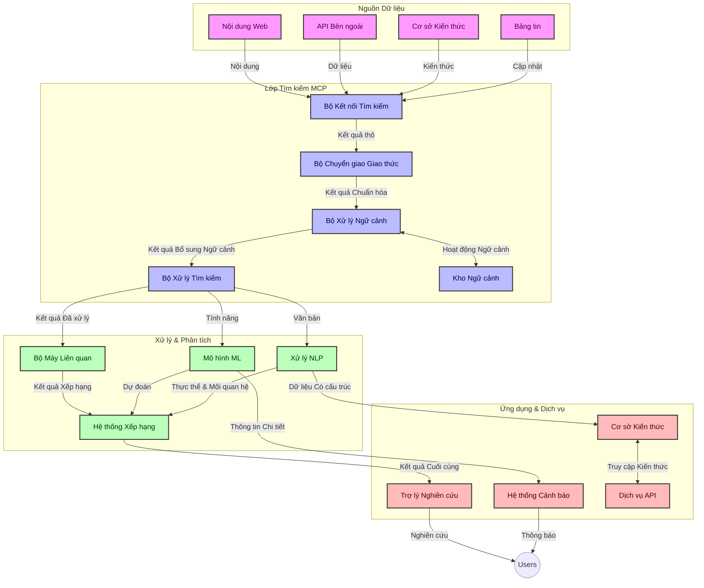
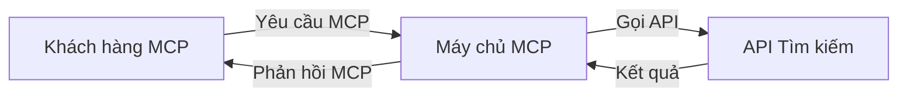
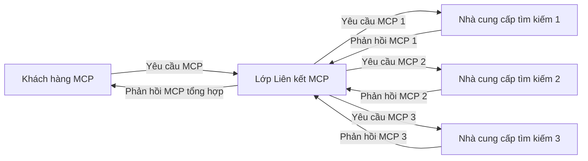
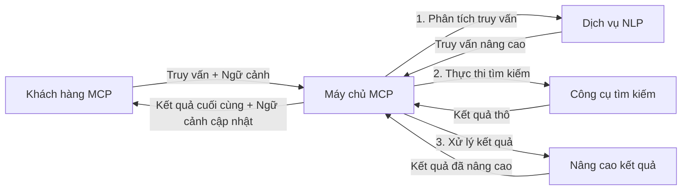

# Giao thức Ngữ cảnh Mô hình cho Tìm kiếm Web Thời gian Thực

## Tổng quan

Tìm kiếm web thời gian thực đã trở nên thiết yếu trong môi trường thông tin ngày nay, nơi các ứng dụng cần truy cập ngay lập tức đến thông tin cập nhật trên internet để cung cấp các phản hồi liên quan và kịp thời. Giao thức Ngữ cảnh Mô hình (MCP) đại diện cho một bước tiến đáng kể trong việc tối ưu hóa quy trình tìm kiếm thời gian thực này, nâng cao hiệu quả tìm kiếm, duy trì tính toàn vẹn ngữ cảnh và cải thiện hiệu suất tổng thể của hệ thống.

Mô-đun này khám phá cách MCP biến đổi tìm kiếm web thời gian thực bằng cách cung cấp một phương pháp tiêu chuẩn để quản lý ngữ cảnh giữa các mô hình AI, công cụ tìm kiếm và ứng dụng.

### Bạn sẽ học gì

Trong hướng dẫn toàn diện này, bạn sẽ khám phá:

- MCP xây dựng cầu nối liền mạch giữa các mô hình AI và khả năng tìm kiếm web thời gian thực như thế nào
- Các mẫu kiến trúc để triển khai giải pháp tìm kiếm hiệu quả và mở rộng với MCP
- Kỹ thuật giữ gìn ngữ cảnh tìm kiếm qua nhiều truy vấn và tương tác
- Các ví dụ mã thực tế bằng Python và JavaScript cho nhiều kịch bản tìm kiếm khác nhau
- Phương pháp cân bằng giữa mức độ liên quan, tính mới và hiệu năng trong hệ thống tìm kiếm dùng MCP

## Giới thiệu về Tìm kiếm Web Thời gian Thực

Tìm kiếm web thời gian thực là một phương thức công nghệ cho phép truy vấn, xử lý và phân tích liên tục thông tin dựa trên web ngay khi nó được công bố hoặc cập nhật, giúp hệ thống cung cấp thông tin mới nhất và liên quan với độ trễ tối thiểu. Khác với các hệ thống tìm kiếm truyền thống hoạt động trên dữ liệu được lập chỉ mục có thể đã cũ hàng giờ hoặc hàng ngày, tìm kiếm thời gian thực xử lý dữ liệu trực tiếp từ web, cung cấp những thông tin và hiểu biết phản ánh trạng thái hiện tại của nội dung trực tuyến.

### Các Khái niệm Cốt lõi của Tìm kiếm Web Thời gian Thực:

- **Xử lý Truy vấn Liên tục**: Các truy vấn tìm kiếm được xử lý trên các nguồn dữ liệu thay đổi liên tục
- **Ưu tiên Tính Mới**: Hệ thống được thiết kế để ưu tiên thông tin mới nhất
- **Cân bằng Liên quan**: Duy trì sự cân bằng giữa mức độ liên quan và tính mới
- **Kiến trúc Mở rộng**: Hệ thống phải xử lý khối lượng truy vấn và dữ liệu thay đổi
- **Hiểu biết Ngữ cảnh**: Giữ ngữ cảnh người dùng qua các lượt tìm kiếm là điều cần thiết cho kết quả có ý nghĩa
- **Điều chỉnh Truy vấn Động**: Thay đổi truy vấn dựa trên ngữ cảnh và kết quả trước đó một cách linh hoạt
- **Tích hợp Nguồn Đa Dạng**: Kết hợp kết quả từ nhiều nhà cung cấp tìm kiếm và nguồn web khác nhau
- **Hiểu biết Ngữ nghĩa**: Xử lý truy vấn và nội dung dựa trên ý nghĩa thay vì chỉ từ khóa
- **Xếp hạng Thời gian Thực**: Điều chỉnh liên tục thứ hạng kết quả khi có thông tin mới

### Giao thức Ngữ cảnh Mô hình và Tìm kiếm Web Thời gian Thực

Giao thức Ngữ cảnh Mô hình (MCP) giải quyết nhiều thách thức quan trọng trong môi trường tìm kiếm web thời gian thực:

1. **Bảo tồn Ngữ cảnh Tìm kiếm**: MCP chuẩn hóa cách giữ ngữ cảnh ở các thành phần tìm kiếm phân tán, đảm bảo các mô hình AI và các nút xử lý có quyền truy cập vào lịch sử truy vấn và sở thích người dùng liên quan.

2. **Quản lý Truy vấn Hiệu quả**: Bằng cách cung cấp cơ chế có cấu trúc cho việc truyền tải ngữ cảnh, MCP giảm thiểu chi phí lặp lại ngữ cảnh trong mỗi vòng truy vấn.

3. **Tương tác Liên hệ**: MCP tạo ra ngôn ngữ chung để chia sẻ ngữ cảnh giữa các công nghệ tìm kiếm và mô hình AI đa dạng, giúp kiến trúc linh hoạt và mở rộng hơn.

4. **Ngữ cảnh Tối ưu cho Tìm kiếm**: Triển khai MCP có thể tập trung ưu tiên các thành phần ngữ cảnh quan trọng nhất để tìm kiếm hiệu quả, tối ưu hiệu suất và độ chính xác.

5. **Xử lý Tìm kiếm Thích nghi**: Với quản lý ngữ cảnh thích hợp thông qua MCP, hệ thống tìm kiếm có thể điều chỉnh động quá trình xử lý dựa trên nhu cầu người dùng và cảnh quan thông tin đang thay đổi.

Trong các ứng dụng hiện đại từ tổng hợp tin tức đến trợ lý nghiên cứu, việc tích hợp MCP với công nghệ tìm kiếm web giúp tạo ra tìm kiếm thông minh hơn, nhận thức ngữ cảnh, có thể cung cấp kết quả ngày càng phù hợp khi các tương tác người dùng tiếp tục.

## Mục tiêu Học tập

Đến cuối bài học này, bạn sẽ có khả năng:

- Hiểu những nguyên lý cơ bản của tìm kiếm web thời gian thực và các thách thức trong các ứng dụng hiện đại
- Giải thích cách Giao thức Ngữ cảnh Mô hình (MCP) nâng cao khả năng tìm kiếm web thời gian thực
- Triển khai các giải pháp tìm kiếm dựa trên MCP với các framework và API phổ biến
- Thiết kế và triển khai kiến trúc tìm kiếm có khả năng mở rộng và hiệu suất cao với MCP
- Áp dụng các khái niệm MCP trong nhiều trường hợp sử dụng bao gồm tìm kiếm ngữ nghĩa, trợ giúp nghiên cứu và duyệt web được hỗ trợ AI
- Đánh giá các xu hướng mới nổi và đổi mới tương lai trong công nghệ tìm kiếm dựa trên MCP
- Phát triển hệ thống tìm kiếm nhận thức ngữ cảnh học từ tương tác người dùng
- Tích hợp khả năng tìm kiếm web vào trợ lý AI sử dụng giao thức MCP tiêu chuẩn
- Tạo pipeline tìm kiếm đa giai đoạn tinh chỉnh kết quả dần dựa trên ngữ cảnh
- Tối ưu hiệu suất tìm kiếm đồng thời duy trì nhận thức toàn diện về ngữ cảnh

### Định nghĩa và Ý nghĩa

Tìm kiếm web thời gian thực liên quan đến truy vấn liên tục, truy xuất và cung cấp thông tin dựa trên web với độ trễ tối thiểu. Khác với các công cụ tìm kiếm truyền thống định kỳ thu thập dữ liệu và lập chỉ mục web, tìm kiếm thời gian thực nhằm đưa thông tin lên ngay khi nó có sẵn, cho phép truy cập ngay lập tức đến nội dung mới nhất.

Đặc điểm chính của tìm kiếm web thời gian thực bao gồm:

- **Tính mới**: Ưu tiên nội dung và cập nhật gần đây
- **Xử lý Liên tục**: Theo dõi liên tục thông tin mới
- **Điều chỉnh Truy vấn**: Tinh chỉnh truy vấn tìm kiếm dựa trên ngữ cảnh và phản hồi
- **Cung cấp Ngay lập tức**: Cung cấp kết quả tìm kiếm với độ trễ tối thiểu
- **Giữ Ngữ cảnh**: Xây dựng dựa trên các truy vấn trước để tăng tính liên quan

### Thách thức trong Tìm kiếm Web Truyền thống

Các phương pháp tìm kiếm web truyền thống đối mặt với nhiều giới hạn khi áp dụng cho kịch bản thời gian thực:

1. **Phân mảnh Ngữ cảnh**: Khó khăn trong việc giữ ngữ cảnh tìm kiếm qua nhiều truy vấn
2. **Tính mới của Thông tin**: Thách thức trong việc truy cập và ưu tiên thông tin mới nhất
3. **Phức tạp trong Tích hợp**: Vấn đề tương tác giữa các hệ thống và ứng dụng tìm kiếm
4. **Vấn đề Độ trễ**: Cân bằng giữa tìm kiếm toàn diện và yêu cầu thời gian phản hồi
5. **Điều chỉnh Mức độ Liên quan**: Đảm bảo độ chính xác và liên quan đồng thời ưu tiên tính mới

## Hiểu về Giao thức Ngữ cảnh Mô hình (MCP) cho Tìm kiếm

### MCP là gì trong Ngữ cảnh Tìm kiếm?

Giao thức Ngữ cảnh Mô hình (MCP) là một giao thức truyền thông tiêu chuẩn được thiết kế để tạo điều kiện tương tác hiệu quả giữa các mô hình AI và ứng dụng. Trong bối cảnh tìm kiếm web thời gian thực, MCP cung cấp một khuôn khổ cho:

- Giữ gìn ngữ cảnh tìm kiếm suốt chuỗi truy vấn
- Chuẩn hóa định dạng truy vấn và kết quả tìm kiếm
- Tối ưu việc truyền tải các tham số và kết quả tìm kiếm
- Nâng cao giao tiếp giữa mô hình và công cụ tìm kiếm

### Các thành phần cốt lõi và Kiến trúc

Kiến trúc MCP cho tìm kiếm web thời gian thực bao gồm nhiều thành phần chính:

1. **Bộ Xử lý Ngữ cảnh Truy vấn**: Quản lý và duy trì ngữ cảnh tìm kiếm qua nhiều truy vấn
2. **Bộ Xử lý Tìm kiếm**: Xử lý các yêu cầu tìm kiếm đầu vào sử dụng kỹ thuật nhận thức ngữ cảnh
3. **Bộ Chuyển Giao thức**: Chuyển đổi giữa các API tìm kiếm khác nhau đồng thời giữ nguyên ngữ cảnh
4. **Kho Ngữ cảnh**: Lưu trữ và truy xuất hiệu quả lịch sử tìm kiếm và sở thích
5. **Kết nối Tìm kiếm**: Kết nối với nhiều công cụ tìm kiếm và API web



### MCP cải thiện Tìm kiếm Web Thời gian Thực như thế nào

MCP giải quyết các thách thức của tìm kiếm web truyền thống thông qua:

- **Tính Liên tục Ngữ cảnh**: Duy trì mối quan hệ giữa các truy vấn trong toàn bộ phiên tìm kiếm
- **Truyền tải Tối ưu**: Giảm sự lặp lại các tham số tìm kiếm nhờ quản lý ngữ cảnh thông minh
- **Giao diện Chuẩn hóa**: Cung cấp API thống nhất cho các thành phần tìm kiếm
- **Giảm Độ trễ**: Giảm tải xử lý nhờ quản lý ngữ cảnh hiệu quả
- **Cải thiện Mức độ Liên quan**: Nâng cao độ liên quan nhờ giữ ý định người dùng qua nhiều truy vấn

## Tích hợp và Triển khai

Hệ thống tìm kiếm web thời gian thực yêu cầu thiết kế kiến trúc và triển khai cẩn trọng để duy trì cả hiệu suất lẫn tính toàn vẹn ngữ cảnh. Giao thức Ngữ cảnh Mô hình cung cấp một phương pháp tiêu chuẩn để tích hợp các mô hình AI và công nghệ tìm kiếm, cho phép xây dựng các pipeline tìm kiếm tinh vi, nhận thức ngữ cảnh.

### Tổng quan về Tích hợp MCP trong Kiến trúc Tìm kiếm

Triển khai MCP trong môi trường tìm kiếm web thời gian thực bao gồm nhiều điểm cần lưu ý:

1. **Tuần tự hóa Ngữ cảnh Tìm kiếm**: MCP cung cấp cơ chế hiệu quả để mã hóa thông tin ngữ cảnh trong các yêu cầu tìm kiếm, đảm bảo ngữ cảnh thiết yếu đi theo truy vấn trong suốt pipeline xử lý. Điều này bao gồm các định dạng tuần tự hóa tiêu chuẩn tối ưu cho siêu dữ liệu liên quan đến tìm kiếm.

2. **Xử lý Tìm kiếm Có trạng thái**: MCP cho phép xử lý có trạng thái thông minh hơn bằng cách duy trì biểu diễn ngữ cảnh nhất quán qua các lượt tìm kiếm. Đây là giá trị đặc biệt trong các pipeline tìm kiếm đa giai đoạn nơi việc tinh chỉnh ngữ cảnh cải thiện kết quả.

3. **Mở rộng và Tinh chỉnh Truy vấn**: Các triển khai MCP trong hệ thống tìm kiếm có thể hỗ trợ mở rộng và tinh chỉnh truy vấn phức tạp dựa trên ngữ cảnh tích lũy, cho phép kết quả ngày càng liên quan hơn khi phiên tìm kiếm tiến triển.

4. **Bộ nhớ Đệm và Ưu tiên Kết quả**: Nhờ chuẩn hóa xử lý ngữ cảnh, MCP giúp quản lý bộ nhớ đệm kết quả và ưu tiên, cho phép các thành phần thích ứng dựa trên ngữ cảnh tìm kiếm đang phát triển.

5. **Liên kết và Tổng hợp Tìm kiếm**: MCP tạo điều kiện cho việc liên kết tinh vi hơn giữa nhiều backend tìm kiếm bằng cách cung cấp thể hiện cấu trúc của ngữ cảnh tìm kiếm, giúp tổng hợp kết quả có ý nghĩa hơn từ nhiều nguồn đa dạng.

Việc triển khai MCP trên các công nghệ tìm kiếm khác nhau tạo ra một cách tiếp cận thống nhất trong quản lý ngữ cảnh, giảm nhu cầu code tích hợp riêng và nâng cao khả năng duy trì ngữ cảnh có ý nghĩa khi truy vấn tìm kiếm phát triển.

### MCP trong Các Triển khai Tìm kiếm Web Khác nhau

Các ví dụ này theo đặc tả MCP hiện tại tập trung vào giao thức dựa trên JSON-RPC với các cơ chế truyền tải riêng biệt. Mã nguồn minh họa cách bạn có thể triển khai tích hợp tìm kiếm tùy chỉnh đồng thời giữ tương thích đầy đủ với giao thức MCP.


<details>
<summary>Triển khai Python với API Tìm kiếm Tổng quát</summary>

```python
import asyncio
import json
import aiohttp
from typing import Dict, Any, Optional, List
from contextlib import asynccontextmanager
from collections.abc import AsyncIterator

# Nhập các thư viện MCP tiêu chuẩn
from mcp.client.session import ClientSession
from mcp.client.streamable_http import streamablehttp_client
from mcp.types import TextContent, CreateMessageRequestParams, CreateMessageResult
from mcp.server.fastmcp import FastMCP

# Tạo một server FastMCP cho tìm kiếm web
search_server = FastMCP("WebSearch")

# Lớp để xử lý các thao tác tìm kiếm web
class WebSearchHandler:
    def __init__(self, api_endpoint: str, api_key: str):
        self.api_endpoint = api_endpoint
        self.api_key = api_key
        self.session = None
        
    async def initialize(self):
        """Initialize the HTTP session"""
        self.session = aiohttp.ClientSession(
            headers={"Authorization": f"Bearer {self.api_key}"}
        )
    
    async def close(self):
        """Close the HTTP session"""
        if self.session:
            await self.session.close()
            
    async def perform_search(self, query: str, max_results: int = 5, 
                           include_domains: List[str] = None, 
                           exclude_domains: List[str] = None,
                           time_period: str = "any") -> Dict[str, Any]:
        """Perform web search using the search API"""
        # Xây dựng các tham số tìm kiếm
        search_params = {
            "q": query,
            "limit": max_results,
            "time": time_period
        }
        
        if include_domains:
            search_params["site"] = ",".join(include_domains)
            
        if exclude_domains:
            search_params["exclude_site"] = ",".join(exclude_domains)
        
        # Thực hiện yêu cầu tìm kiếm
        try:
            async with self.session.get(
                self.api_endpoint,
                params=search_params
            ) as response:
                if response.status != 200:
                    error_text = await response.text()
                    raise Exception(f"Search API error: {response.status} - {error_text}")
                
                search_data = await response.json()
                
                # Chuyển đổi phản hồi đặc thù API sang định dạng chuẩn
                results = []
                for item in search_data.get("results", []):
                    results.append({
                        "title": item.get("title", ""),
                        "url": item.get("url", ""),
                        "snippet": item.get("snippet", ""),
                        "date": item.get("published_date", ""),
                        "source": item.get("source", "")
                    })
                
                return {
                    "query": query,
                    "totalResults": len(results),
                    "results": results
                }
        except Exception as e:
            print(f"Search API request error: {e}")
            raise

# Khởi tạo bộ xử lý tìm kiếm
search_handler = WebSearchHandler(
    api_endpoint="https://api.search-service.example/search",
    api_key="your-api-key-here"
)

# Thiết lập vòng đời để quản lý bộ xử lý tìm kiếm
@asyncio.asynccontextmanager
async def app_lifespan(server: FastMCP):
    """Manage application lifecycle"""
    await search_handler.initialize()
    try:
        yield {"search_handler": search_handler}
    finally:
        await search_handler.close()

# Đặt vòng đời cho server
search_server = FastMCP("WebSearch", lifespan=app_lifespan)

# Đăng ký một công cụ tìm kiếm web
@search_server.tool()
async def web_search(query: str, max_results: int = 5, 
                   include_domains: List[str] = None,
                   exclude_domains: List[str] = None,
                   time_period: str = "any") -> Dict[str, Any]:
    """
    Search the web for information
    
    Args:
        query: The search query
        max_results: Maximum number of results to return (default: 5)
        include_domains: List of domains to include in search results
        exclude_domains: List of domains to exclude from search results
        time_period: Time period for results ("day", "week", "month", "any")
        
    Returns:
        Dictionary containing search results
    """
    ctx = search_server.get_context()
    search_handler = ctx.request_context.lifespan_context["search_handler"]
    
    results = await search_handler.perform_search(
        query=query,
        max_results=max_results,
        include_domains=include_domains,
        exclude_domains=exclude_domains,
        time_period=time_period
    )
    
    return results

# Ví dụ sử dụng của client
async def client_example():
    # Kết nối đến server tìm kiếm sử dụng giao thức HTTP Streamable
    async with streamablehttp_client("http://localhost:8000/mcp") as (read, write, _):
        async with ClientSession(read, write) as session:
            # Khởi tạo kết nối
            await session.initialize()
            
            # Gọi công cụ web_search
            search_results = await session.call_tool(
                "web_search", 
                {
                    "query": "latest developments in AI and Model Context Protocol",
                    "max_results": 5,
                    "time_period": "day",
                    "include_domains": ["github.com", "microsoft.com"]
                }
            )
            
            print(f"Search results: {search_results}")

# Ví dụ thực thi server
if __name__ == "__main__":
    # Chạy server với giao thức HTTP Streamable
    search_server.run(transport="streamable-http")
```
</details> 

<details>
<summary>Triển khai JavaScript với Tìm kiếm Trên Trình duyệt</summary>


```javascript
// Triển khai máy chủ MCP cho tìm kiếm web
import { McpServer, ResourceTemplate } from '@modelcontextprotocol/sdk/server/mcp.js';
import { StreamableHTTPServerTransport } from '@modelcontextprotocol/sdk/server/streamableHttp.js';
import { z } from 'zod';

// Tạo một máy chủ MCP cho tìm kiếm web
const searchServer = new McpServer({
    name: "BrowserSearch",
    description: "A server that provides web search capabilities"
});

// Lớp dịch vụ tìm kiếm
class SearchService {
    constructor(searchApiUrl, apiKey) {
        this.searchApiUrl = searchApiUrl;
        this.apiKey = apiKey;
    }

    async performSearch(parameters) {
        const {
            query = '',
            maxResults = 5,
            includeDomains = [],
            excludeDomains = [],
            timePeriod = 'any'
        } = parameters;
        
        // Xây dựng URL tìm kiếm với các tham số
        const url = new URL(this.searchApiUrl);
        url.searchParams.append('q', query);
        url.searchParams.append('limit', maxResults);
        url.searchParams.append('time', timePeriod);
        
        if (includeDomains.length > 0) {
            url.searchParams.append('site', includeDomains.join(','));
        }
        
        if (excludeDomains.length > 0) {
            url.searchParams.append('exclude_site', excludeDomains.join(','));
        }
        
        try {
            const response = await fetch(url.toString(), {
                method: 'GET',
                headers: {
                    'Authorization': `Bearer ${this.apiKey}`,
                    'Content-Type': 'application/json'
                }
            });
            
            if (!response.ok) {
                const errorText = await response.text();
                throw new Error(`Search API error: ${response.status} - ${errorText}`);
            }
            
            const searchData = await response.json();
            
            // Chuyển đổi phản hồi cụ thể của API sang định dạng chuẩn
            const results = searchData.results?.map(item => ({
                title: item.title || '',
                url: item.url || '',
                snippet: item.snippet || '',
                date: item.published_date || '',
                source: item.source || ''
            })) || [];
            
            return {
                query,
                totalResults: results.length,
                results
            };
        } catch (error) {
            console.error('Search API request error:', error);
            throw error;
        }
    }
}

// Khởi tạo dịch vụ tìm kiếm
const searchService = new SearchService(
    'https://api.search-service.example/search',
    'your-api-key-here'
);

// Cài đặt nhà cung cấp ngữ cảnh cho máy chủ
searchServer.setContextProvider(() => {
    return {
        searchService
    };
});

// Đăng ký công cụ tìm kiếm web
searchServer.tool({
    name: 'web_search',
    description: 'Search the web for information',
    parameters: {
        type: 'object',
        properties: {
            query: {
                type: 'string',
                description: 'The search query'
            },
            maxResults: {
                type: 'integer',
                description: 'Maximum number of results to return',
                default: 5
            },
            includeDomains: {
                type: 'array',
                items: { type: 'string' },
                description: 'List of domains to include in search results'
            },
            excludeDomains: {
                type: 'array',
                items: { type: 'string' },
                description: 'List of domains to exclude from search results'
            },
            timePeriod: {
                type: 'string',
                description: 'Time period for results',
                enum: ['day', 'week', 'month', 'any'],
                default: 'any'
            }
        },
        required: ['query']
    },
    handler: async (params, context) => {
        const { searchService } = context;
        return await searchService.performSearch(params);
    }
});

// Ví dụ mã khách hàng để kết nối với máy chủ tìm kiếm
import { Client } from '@modelcontextprotocol/sdk/client/index.js';
import { StreamableHTTPClientTransport } from '@modelcontextprotocol/sdk/client/streamableHttp.js';

async function connectToSearchServer() {
    // Kết nối với máy chủ tìm kiếm
    const transport = new StreamableHTTPClientTransport(
        new URL('http://localhost:8000/mcp')
    );
    
    const client = new Client({
        name: 'search-client',
        version: '1.0.0'
    });
    
    await client.connect(transport);
    
    // Thực thi công cụ tìm kiếm
    const searchResults = await client.callTool({
        name: 'web_search',
        arguments: {
            query: 'Model Context Protocol implementation examples',
            maxResults: 10,
            timePeriod: 'week',
            includeDomains: ['github.com', 'docs.microsoft.com']
        }
    });
    
    console.log('Search results:', searchResults);
    
    // Dọn dẹp
    await client.disconnect();
}

// Khởi động máy chủ
const transport = new StreamableHTTPServerTransport();
await searchServer.connect(transport);
console.log('Search server running at http://localhost:8000/mcp');

// Trong một tiến trình riêng biệt hoặc sau khi máy chủ đã khởi động
// connectToSearchServer().catch(console.error);
```
</details> 


## Tuyên bố về Ví dụ Mã

> **Chú ý Quan trọng**: Các ví dụ mã dưới đây minh họa việc tích hợp Giao thức Ngữ cảnh Mô hình (MCP) với chức năng tìm kiếm web. Mặc dù tuân theo mẫu và cấu trúc của SDK MCP chính thức, chúng được đơn giản hóa cho mục đích giáo dục.
> 
> Các ví dụ này thể hiện:
> 
> 1. **Triển khai Python**: Một máy chủ FastMCP cung cấp công cụ tìm kiếm web và kết nối với API tìm kiếm bên ngoài. Ví dụ này thể hiện việc quản lý vòng đời đúng cách, xử lý ngữ cảnh, và triển khai công cụ theo mẫu của [SDK Python MCP chính thức](https://github.com/modelcontextprotocol/python-sdk). Máy chủ sử dụng phương thức truyền tải HTTP Streamable được khuyến nghị thay thế cho SSE cũ trong triển khai thực tế.
> 
> 2. **Triển khai JavaScript**: Một triển khai TypeScript/JavaScript dùng mẫu FastMCP từ [SDK TypeScript MCP chính thức](https://github.com/modelcontextprotocol/typescript-sdk) để tạo máy chủ tìm kiếm với định nghĩa công cụ và kết nối khách hàng hợp lý. Nó theo mẫu mới nhất cho quản lý phiên và giữ ngữ cảnh.
> 
> Các ví dụ này cần thêm xử lý lỗi, xác thực và mã tích hợp API riêng biệt cho sử dụng sản xuất. Các điểm cuối API tìm kiếm (`https://api.search-service.example/search`) chỉ là chỗ giữ chỗ và cần được thay thế bằng địa chỉ dịch vụ tìm kiếm thực tế.
> 
> Để xem chi tiết triển khai đầy đủ và các cách tiếp cận cập nhật nhất,
> vui lòng tham khảo [đặc tả MCP chính thức](https://modelcontextprotocol.io/specification/2026-07-28/)
> và tài liệu SDK.

## Các Khái niệm Cốt lõi

### Khung Giao thức Ngữ cảnh Mô hình (MCP)

Về cơ bản, Giao thức Ngữ cảnh Mô hình cung cấp cách tiêu chuẩn để các mô hình AI, ứng dụng và dịch vụ trao đổi ngữ cảnh. Trong tìm kiếm web thời gian thực, khung này rất cần thiết để tạo trải nghiệm tìm kiếm mạch lạc qua nhiều lượt tương tác. Các thành phần chính bao gồm:

1. **Kiến trúc Khách – Máy chủ**: MCP thiết lập sự phân tách rõ ràng giữa khách tìm kiếm (bên yêu cầu) và máy chủ tìm kiếm (bên cung cấp), cho phép các mô hình triển khai linh hoạt.

2. **Giao tiếp JSON-RPC**: Giao thức sử dụng JSON-RPC để trao đổi thông điệp, tương thích với công nghệ web và dễ triển khai trên nhiều nền tảng khác nhau.

3. **Quản lý Ngữ cảnh**: MCP định nghĩa phương pháp có cấu trúc để duy trì, cập nhật và khai thác ngữ cảnh tìm kiếm qua nhiều lần tương tác.

4. **Định nghĩa Công cụ**: Khả năng tìm kiếm được phơi bày như các công cụ tiêu chuẩn với các tham số và giá trị trả về rõ ràng.

5. **Hỗ trợ Streaming**: Giao thức hỗ trợ truyền kết quả theo luồng, cần thiết cho tìm kiếm thời gian thực khi kết quả có thể đến dần dần.

### Các Mẫu Tích hợp Tìm kiếm Web

Khi tích hợp MCP với tìm kiếm web, một số mẫu phổ biến xuất hiện:

#### 1. Tích hợp Nhà cung cấp Tìm kiếm Trực tiếp



Trong mẫu này, máy chủ MCP giao tiếp trực tiếp với một hay nhiều API tìm kiếm, chuyển đổi các yêu cầu MCP thành các cuộc gọi API cụ thể và định dạng kết quả thành phản hồi MCP.

#### 2. Tìm kiếm Liên kết với Giữ Ngữ cảnh



Mẫu này phân phối các truy vấn tìm kiếm đến nhiều nhà cung cấp tìm kiếm tương thích MCP, mỗi nhà cung cấp có thể chuyên về loại nội dung hoặc khả năng tìm kiếm khác nhau, đồng thời duy trì ngữ cảnh thống nhất.

#### 3. Chuỗi Tìm kiếm Tăng cường Ngữ cảnh



Trong mẫu này, quá trình tìm kiếm chia thành nhiều giai đoạn, ngữ cảnh được làm giàu ở mỗi bước, mang lại kết quả ngày càng phù hợp hơn.

### Các Thành phần Ngữ cảnh Tìm kiếm

Trong tìm kiếm web dựa trên MCP, ngữ cảnh thường bao gồm:

- **Lịch sử Truy vấn**: Các truy vấn tìm kiếm trước đó trong phiên làm việc
- **Sở thích Người dùng**: Ngôn ngữ, vùng miền, thiết lập tìm kiếm an toàn
- **Lịch sử Tương tác**: Các kết quả đã được nhấp, thời gian dành cho kết quả
- **Tham số Tìm kiếm**: Bộ lọc, thứ tự sắp xếp và các bộ điều chỉnh khác
- **Kiến thức Chuyên ngành**: Ngữ cảnh chuyên môn liên quan đến tìm kiếm
- **Ngữ cảnh Thời gian**: Yếu tố liên quan theo thời gian
- **Sở thích Nguồn**: Các nguồn thông tin đáng tin cậy hoặc ưu tiên

## Các Trường hợp Sử dụng và Ứng dụng

### Nghiên cứu và Thu thập Thông tin

MCP nâng cao quy trình nghiên cứu bằng cách:

- Giữ ngữ cảnh nghiên cứu qua các phiên tìm kiếm
- Cho phép truy vấn phức tạp và phù hợp ngữ cảnh hơn
- Hỗ trợ liên kết tìm kiếm đa nguồn
- Tạo điều kiện trích xuất kiến thức từ kết quả tìm kiếm

### Giám sát Tin tức và Xu hướng Thời gian Thực

Tìm kiếm dùng MCP mang lại lợi thế cho việc giám sát tin tức:

- Khám phá gần như thời gian thực các câu chuyện tin tức mới nổi
- Lọc thông tin liên quan theo ngữ cảnh
- Theo dõi chủ đề và thực thể qua nhiều nguồn
- Cảnh báo tin tức cá nhân hóa dựa trên ngữ cảnh người dùng

### Duyệt và Nghiên cứu Hỗ trợ AI

MCP mở ra khả năng mới cho duyệt web hỗ trợ AI:

- Gợi ý tìm kiếm theo ngữ cảnh dựa trên hoạt động trình duyệt hiện tại
- Tích hợp liền mạch giữa tìm kiếm web và trợ lý hỗ trợ LLM
- Tinh chỉnh tìm kiếm đa lượt khi giữ ngữ cảnh
- Cải thiện kiểm chứng sự thật và xác minh thông tin

## Xu hướng và Đổi mới trong Tương lai

### Sự Phát triển của MCP trong Tìm kiếm Web

Nhìn về phía trước, chúng ta dự kiến MCP sẽ phát triển để giải quyết:


- **Tìm kiếm Đa phương thức**: Tích hợp tìm kiếm văn bản, hình ảnh, âm thanh và video với việc bảo toàn ngữ cảnh
- **Tìm kiếm Phi tập trung**: Hỗ trợ hệ sinh thái tìm kiếm phân tán và liên kết
- **Bảo mật Tìm kiếm**: Cơ chế tìm kiếm bảo vệ quyền riêng tư dựa trên ngữ cảnh
- **Hiểu truy vấn**: Phân tích ngữ nghĩa sâu sắc các truy vấn tìm kiếm bằng ngôn ngữ tự nhiên

### Tiến bộ Công nghệ Tiềm năng

Các công nghệ mới nổi sẽ định hình tương lai của tìm kiếm MCP:

1. **Kiến trúc Tìm kiếm Thần kinh**: Hệ thống tìm kiếm dựa trên nhúng được tối ưu hóa cho MCP
2. **Ngữ cảnh Tìm kiếm Cá nhân hóa**: Học các mẫu tìm kiếm cá nhân người dùng theo thời gian
3. **Tích hợp Đồ thị Kiến thức**: Tìm kiếm theo ngữ cảnh được cải thiện bởi đồ thị kiến thức chuyên ngành
4. **Ngữ cảnh Đa phương thức**: Bảo toàn ngữ cảnh qua các phương thức tìm kiếm khác nhau

## Bài Tập Thực hành

### Bài tập 1: Cài đặt một dòng tìm kiếm MCP cơ bản

Trong bài tập này, bạn sẽ học cách:
- Cấu hình môi trường tìm kiếm MCP cơ bản
- Triển khai bộ xử lý ngữ cảnh cho tìm kiếm web
- Kiểm tra và xác nhận việc bảo toàn ngữ cảnh qua các lần tìm kiếm

### Bài tập 2: Xây dựng Trợ lý Nghiên cứu với Tìm kiếm MCP

Tạo một ứng dụng hoàn chỉnh mà:
- Xử lý các câu hỏi nghiên cứu bằng ngôn ngữ tự nhiên
- Thực hiện các tìm kiếm web theo ngữ cảnh
- Tổng hợp thông tin từ nhiều nguồn
- Trình bày kết quả nghiên cứu được tổ chức

### Bài tập 3: Triển khai Liên kết Tìm kiếm đa nguồn với MCP

Bài tập nâng cao bao gồm:
- Phân chia truy vấn theo ngữ cảnh đến nhiều công cụ tìm kiếm
- Xếp hạng và tổng hợp kết quả
- Loại bỏ trùng lặp kết quả dựa trên ngữ cảnh
- Xử lý siêu dữ liệu đặc thù nguồn

## Tài nguyên Bổ sung

- [Model Context Protocol Specification](https://modelcontextprotocol.io/specification/2026-07-28/) - Tài liệu chính thức về MCP và tài liệu giao thức chi tiết
- [Model Context Protocol Documentation](https://modelcontextprotocol.io/) - Hướng dẫn chi tiết và tài liệu triển khai
- [MCP Python SDK](https://github.com/modelcontextprotocol/python-sdk) - Triển khai MCP chính thức bằng Python
- [MCP TypeScript SDK](https://github.com/modelcontextprotocol/typescript-sdk) - Triển khai MCP chính thức bằng TypeScript
- [MCP Reference Servers](https://github.com/modelcontextprotocol/servers) - Các ví dụ triển khai máy chủ MCP
- [Bing Web Search API Documentation](https://learn.microsoft.com/en-us/bing/search-apis/bing-web-search/overview) - API tìm kiếm web của Microsoft
- [Google Custom Search JSON API](https://developers.google.com/custom-search/v1/overview) - Công cụ tìm kiếm có thể lập trình của Google
- [SerpAPI Documentation](https://serpapi.com/search-api) - API trang kết quả công cụ tìm kiếm
- [Meilisearch Documentation](https://www.meilisearch.com/docs) - Công cụ tìm kiếm mã nguồn mở
- [Elasticsearch Documentation](https://www.elastic.co/guide/index.html) - Công cụ tìm kiếm và phân tích phân tán
- [LangChain Documentation](https://python.langchain.com/docs/get_started/introduction) - Xây dựng ứng dụng với các LLM

## Kết quả học tập

Sau khi hoàn thành mô-đun này, bạn sẽ có khả năng:

- Hiểu các nguyên lý cơ bản của tìm kiếm web theo thời gian thực và những thách thức liên quan
- Giải thích cách Model Context Protocol (MCP) nâng cao khả năng tìm kiếm web theo thời gian thực
- Triển khai các giải pháp tìm kiếm dựa trên MCP sử dụng các framework và API phổ biến
- Thiết kế và triển khai kiến trúc tìm kiếm mở rộng, hiệu suất cao với MCP
- Áp dụng các khái niệm MCP vào nhiều trường hợp sử dụng khác nhau bao gồm tìm kiếm ngữ nghĩa, trợ giúp nghiên cứu và duyệt web được tăng cường AI
- Đánh giá các xu hướng mới nổi và đổi mới tương lai trong công nghệ tìm kiếm dựa trên MCP


### Các Cân nhắc về Tin cậy và An toàn

Khi triển khai các giải pháp tìm kiếm web dựa trên MCP, hãy nhớ các nguyên tắc quan trọng này từ tài liệu MCP:

1. **Sự đồng ý và Kiểm soát của Người dùng**: Người dùng phải đồng ý rõ ràng và hiểu tất cả các thao tác và truy cập dữ liệu. Điều này đặc biệt quan trọng với các triển khai tìm kiếm web có thể truy cập các nguồn dữ liệu bên ngoài.

2. **Bảo mật Dữ liệu**: Đảm bảo xử lý thích hợp các truy vấn tìm kiếm và kết quả, đặc biệt khi chúng có thể chứa thông tin nhạy cảm. Thi hành kiểm soát truy cập thích hợp để bảo vệ dữ liệu người dùng.

3. **An toàn Công cụ**: Triển khai xác thực và kiểm tra hợp lệ cho các công cụ tìm kiếm vì chúng là mối nguy cơ bảo mật tiềm tàng thông qua việc thực thi mã tùy ý. Mô tả hành vi công cụ được coi là không đáng tin cậy trừ khi lấy từ máy chủ đáng tin cậy.

4. **Tài liệu Rõ ràng**: Cung cấp tài liệu rõ ràng về khả năng, giới hạn và các cân nhắc bảo mật của triển khai tìm kiếm dựa trên MCP của bạn, theo hướng dẫn triển khai trong tài liệu MCP.

5. **Luồng Đồng ý Mạnh mẽ**: Xây dựng luồng đồng ý và ủy quyền vững chắc, giải thích rõ công cụ làm gì trước khi cho phép sử dụng, đặc biệt với các công cụ tương tác với tài nguyên web bên ngoài.

Để biết chi tiết đầy đủ về bảo mật và cân nhắc tin cậy MCP, tham khảo
[tài liệu chính thức](https://modelcontextprotocol.io/specification/2026-07-28/basic/security_best_practices).

## Tiếp theo là gì 

- [5.12 Xác thực Entra ID cho Máy chủ Model Context Protocol](../mcp-security-entra/README.md)

---

<!-- CO-OP TRANSLATOR DISCLAIMER START -->
**Tuyên bố miễn trừ trách nhiệm**:
Tài liệu này đã được dịch bằng dịch vụ dịch thuật AI [Co-op Translator](https://github.com/Azure/co-op-translator). Mặc dù chúng tôi cố gắng đảm bảo độ chính xác, xin lưu ý rằng bản dịch tự động có thể chứa lỗi hoặc sai sót. Tài liệu gốc bằng ngôn ngữ gốc nên được coi là nguồn tin chính thức. Đối với thông tin quan trọng, nên sử dụng dịch vụ dịch thuật chuyên nghiệp bởi con người. Chúng tôi không chịu trách nhiệm về bất kỳ hiểu lầm hoặc giải thích sai nào phát sinh từ việc sử dụng bản dịch này.
<!-- CO-OP TRANSLATOR DISCLAIMER END -->