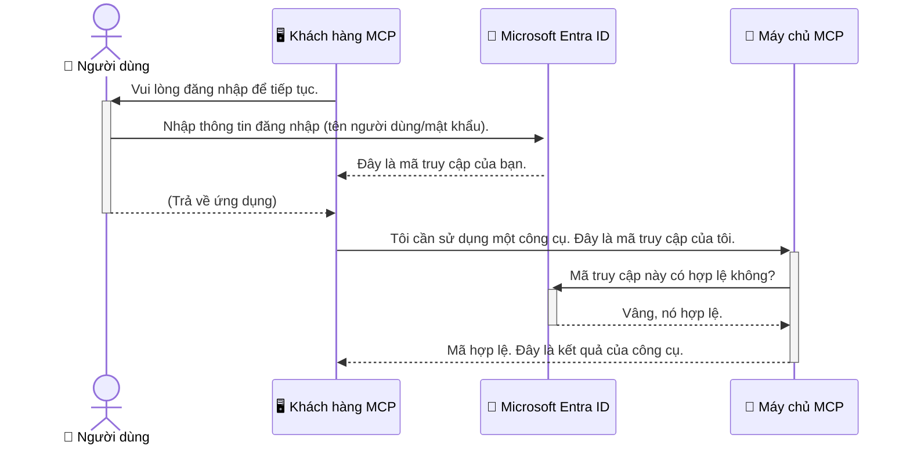

# Bảo mật Quy trình AI: Xác thực Entra ID cho Máy chủ Giao thức Ngữ cảnh Mô hình

> [!NOTE]
> Mã máy chủ từ xa trong bài học này bảo vệ các điểm cuối `/sse` và `/message` kế thừa
> và nhắm tới MCP `2025-11-25`. Giữ các thực hành xác định danh tính và xác thực token của nó,
> nhưng sử dụng giao thức HTTP Streamable tương thích với `2026-07-28` cho các triển khai mới.


## Giới thiệu
Việc bảo mật máy chủ Giao thức Ngữ cảnh Mô hình (MCP) của bạn quan trọng như việc khóa cửa chính nhà bạn vậy. Việc để máy chủ MCP của bạn mở sẽ khiến các công cụ và dữ liệu của bạn dễ bị truy cập trái phép, dẫn đến các vi phạm bảo mật. Microsoft Entra ID cung cấp một giải pháp quản lý danh tính và truy cập dựa trên đám mây mạnh mẽ, giúp đảm bảo rằng chỉ những người dùng và ứng dụng được ủy quyền mới có thể tương tác với máy chủ MCP của bạn. Trong phần này, bạn sẽ học cách bảo vệ quy trình AI của mình bằng xác thực Entra ID.

## Mục tiêu Học tập
Đến cuối phần này, bạn sẽ có thể:

- Hiểu tầm quan trọng của việc bảo mật máy chủ MCP.
- Giải thích các kiến thức cơ bản về Microsoft Entra ID và xác thực OAuth 2.0.
- Nhận biết sự khác biệt giữa các khách hàng công khai và khách hàng bí mật.
- Triển khai xác thực Entra ID trong các kịch bản máy chủ MCP cục bộ (khách hàng công khai) và máy chủ MCP từ xa (khách hàng bí mật).
- Áp dụng các thực tiễn bảo mật tốt nhất khi phát triển quy trình AI.

## Bảo mật và MCP

Giống như bạn sẽ không để cửa chính nhà mình mở không khóa, bạn cũng không nên để máy chủ MCP của mình mở cho bất kỳ ai truy cập. Bảo mật quy trình AI là điều thiết yếu để xây dựng các ứng dụng mạnh mẽ, đáng tin cậy và an toàn. Chương này sẽ giới thiệu cho bạn cách sử dụng Microsoft Entra ID để bảo vệ máy chủ MCP của bạn, đảm bảo rằng chỉ những người dùng và ứng dụng được ủy quyền mới có thể tương tác với công cụ và dữ liệu của bạn.

## Tại sao bảo mật lại quan trọng đối với máy chủ MCP

Hãy tưởng tượng máy chủ MCP của bạn có một công cụ có thể gửi email hoặc truy cập cơ sở dữ liệu khách hàng. Một máy chủ không được bảo mật sẽ khiến bất kỳ ai cũng có thể sử dụng công cụ đó, dẫn đến truy cập dữ liệu trái phép, spam hoặc các hoạt động độc hại khác.

Bằng cách thực hiện xác thực, bạn đảm bảo rằng mọi yêu cầu đến máy chủ đều được xác thực, xác nhận danh tính của người dùng hoặc ứng dụng gửi yêu cầu. Đây là bước đầu tiên và quan trọng nhất để bảo mật quy trình AI của bạn.

## Giới thiệu về Microsoft Entra ID

[**Microsoft Entra ID**](https://adoption.microsoft.com/microsoft-security/entra/) là một dịch vụ quản lý danh tính và truy cập dựa trên đám mây. Hãy coi nó như một bảo vệ an ninh toàn cầu cho các ứng dụng của bạn. Nó xử lý quá trình phức tạp xác thực danh tính người dùng và xác định quyền được phép thực hiện hành động gì (ủy quyền).

Bằng cách sử dụng Entra ID, bạn có thể:

- Cho phép người dùng đăng nhập an toàn.
- Bảo vệ API và các dịch vụ.
- Quản lý chính sách truy cập từ một vị trí trung tâm.

Đối với máy chủ MCP, Entra ID cung cấp một giải pháp mạnh mẽ và được tin cậy rộng rãi để quản lý ai có thể truy cập các khả năng của máy chủ.

---

## Hiểu Phép màu: Cách Xác thực Entra ID Hoạt động

Entra ID sử dụng các tiêu chuẩn mở như **OAuth 2.0** để xử lý xác thực. Mặc dù chi tiết có thể phức tạp, ý tưởng cốt lõi rất đơn giản và có thể được hiểu qua một phép ẩn dụ.

### Giới thiệu nhẹ nhàng về OAuth 2.0: Chìa khóa valet

Hãy tưởng tượng OAuth 2.0 như một dịch vụ valet cho chiếc xe của bạn. Khi bạn đến nhà hàng, bạn không đưa cho valet chìa khóa chính. Thay vào đó, bạn cung cấp một **chìa khóa valet** có quyền hạn giới hạn — nó có thể khởi động xe và khóa cửa, nhưng không thể mở cốp hay ngăn đựng găng tay.

Trong phép ẩn dụ này:

- **Bạn** là **Người dùng**.
- **Chiếc xe của bạn** là **Máy chủ MCP** với các công cụ và dữ liệu quý giá.
- **Người valet** là **Microsoft Entra ID**.
- **Nhân viên giữ xe** là **Khách hàng MCP** (ứng dụng cố gắng truy cập máy chủ).
- **Chìa khóa valet** là **Token truy cập**.

Token truy cập là một chuỗi văn bản bảo mật mà khách hàng MCP nhận được từ Entra ID sau khi bạn đăng nhập. Khách hàng sau đó trình token này cho máy chủ MCP mỗi khi thực hiện yêu cầu. Máy chủ có thể xác thực token để đảm bảo yêu cầu hợp lệ và khách hàng có quyền cần thiết, tất cả mà không cần xử lý trực tiếp thông tin đăng nhập thực của bạn (như mật khẩu).

### Dòng chảy Xác thực

Đây là cách quy trình hoạt động thực tế:



### Giới thiệu Thư viện Xác thực Microsoft (MSAL)

Trước khi đi vào mã, quan trọng là giới thiệu một thành phần chính mà bạn sẽ thấy trong các ví dụ: **Thư viện Xác thực Microsoft (MSAL)**.

MSAL là một thư viện được Microsoft phát triển giúp các nhà phát triển dễ dàng xử lý xác thực. Thay vì bạn phải viết tất cả mã phức tạp để xử lý token bảo mật, quản lý đăng nhập và làm mới phiên, MSAL lo phần nặng nhọc đó.

Sử dụng một thư viện như MSAL được khuyến khích cao vì:

- **Nó An Toàn:** Triển khai các giao thức chuẩn ngành và thực hành bảo mật tốt nhất, giảm rủi ro lỗ hổng trong mã của bạn.
- **Nó Giúp Đơn giản hóa phát triển:** Trừu tượng hóa sự phức tạp của các giao thức OAuth 2.0 và OpenID Connect, cho phép bạn thêm xác thực mạnh mẽ vào ứng dụng chỉ bằng vài dòng mã.
- **Nó được Bảo trì:** Microsoft duy trì và cập nhật MSAL tích cực để xử lý các mối đe dọa bảo mật mới và thay đổi nền tảng.

MSAL hỗ trợ nhiều ngôn ngữ và framework ứng dụng khác nhau, bao gồm .NET, JavaScript/TypeScript, Python, Java, Go, và các nền tảng di động như iOS và Android. Điều này có nghĩa là bạn có thể sử dụng các mẫu xác thực đồng nhất trên toàn bộ hệ công nghệ.

Để tìm hiểu thêm về MSAL, bạn có thể xem tài liệu chính thức [tổng quan MSAL](https://learn.microsoft.com/entra/identity-platform/msal-overview).

---

## Bảo mật Máy chủ MCP với Entra ID: Hướng dẫn Từng bước

Bây giờ, chúng ta hãy cùng đi qua cách bảo mật máy chủ MCP cục bộ (giao tiếp qua `stdio`) bằng Entra ID. Ví dụ này sử dụng **khách hàng công khai**, phù hợp với ứng dụng chạy trên máy người dùng, như ứng dụng desktop hoặc máy chủ phát triển cục bộ.

### Kịch bản 1: Bảo mật Máy chủ MCP Cục bộ (với Khách hàng Công khai)

Trong kịch bản này, chúng ta xem xét máy chủ MCP chạy cục bộ, giao tiếp qua `stdio`, và dùng Entra ID xác thực người dùng trước khi cho phép truy cập công cụ của nó. Máy chủ sẽ có một công cụ duy nhất lấy thông tin hồ sơ người dùng từ Microsoft Graph API.

#### 1. Thiết lập Ứng dụng trong Entra ID

Trước khi viết mã, bạn cần đăng ký ứng dụng của mình trong Microsoft Entra ID. Việc này thông báo cho Entra ID về ứng dụng của bạn và cấp quyền sử dụng dịch vụ xác thực.

1. Truy cập **[cổng Microsoft Entra](https://entra.microsoft.com/)**.
2. Vào mục **Đăng ký ứng dụng** và nhấp **Đăng ký mới**.
3. Đặt tên cho ứng dụng của bạn (ví dụ: "Máy chủ MCP Cục bộ của Tôi").
4. Với **Loại tài khoản được hỗ trợ**, chọn **Tài khoản trong thư mục tổ chức này**.
5. Bạn có thể để trống **URI chuyển hướng** cho ví dụ này.
6. Nhấn **Đăng ký**.

Sau khi đăng ký, ghi lại **ID Ứng dụng (client)** và **ID Thư mục (tenant)**. Bạn sẽ cần những thông tin này trong mã của mình.

#### 2. Mã: Phân tích

Hãy xem các phần chính trong mã xử lý xác thực. Toàn bộ mã ví dụ có trong thư mục [Entra ID - Local - WAM](https://github.com/Azure-Samples/mcp-auth-servers/tree/main/src/entra-id-local-wam) trong [kho lưu trữ GitHub mcp-auth-servers](https://github.com/Azure-Samples/mcp-auth-servers).

**`AuthenticationService.cs`**

Lớp này chịu trách nhiệm xử lý tương tác với Entra ID.

- **`CreateAsync`**: Phương thức này khởi tạo `PublicClientApplication` từ MSAL (Thư viện Xác thực Microsoft). Nó được cấu hình với `clientId` và `tenantId` của ứng dụng bạn.
- **`WithBroker`**: Cho phép sử dụng một broker (như Windows Web Account Manager), cung cấp trải nghiệm đăng nhập một lần an toàn và liền mạch hơn.
- **`AcquireTokenAsync`**: Phương thức chính. Ban đầu cố lấy token một cách thầm lặng (nghĩa là người dùng không cần đăng nhập lại nếu đã có phiên hợp lệ). Nếu không có token thầm lặng, nó sẽ yêu cầu người dùng đăng nhập tương tác.

```csharp
// Simplified for clarity
public static async Task<AuthenticationService> CreateAsync(ILogger<AuthenticationService> logger)
{
    var msalClient = PublicClientApplicationBuilder
        .Create(_clientId) // Your Application (client) ID
        .WithAuthority(AadAuthorityAudience.AzureAdMyOrg)
        .WithTenantId(_tenantId) // Your Directory (tenant) ID
        .WithBroker(new BrokerOptions(BrokerOptions.OperatingSystems.Windows))
        .Build();

    // ... cache registration ...

    return new AuthenticationService(logger, msalClient);
}

public async Task<string> AcquireTokenAsync()
{
    try
    {
        // Try silent authentication first
        var accounts = await _msalClient.GetAccountsAsync();
        var account = accounts.FirstOrDefault();

        AuthenticationResult? result = null;

        if (account != null)
        {
            result = await _msalClient.AcquireTokenSilent(_scopes, account).ExecuteAsync();
        }
        else
        {
            // If no account, or silent fails, go interactive
            result = await _msalClient.AcquireTokenInteractive(_scopes).ExecuteAsync();
        }

        return result.AccessToken;
    }
    catch (Exception ex)
    {
        _logger.LogError(ex, "An error occurred while acquiring the token.");
        throw; // Optionally rethrow the exception for higher-level handling
    }
}
```

**`Program.cs`**

Đây là nơi thiết lập máy chủ MCP và tích hợp dịch vụ xác thực.

- **`AddSingleton<AuthenticationService>`**: Đăng ký `AuthenticationService` với bộ chứa tiêm phụ thuộc để các phần khác của ứng dụng (như công cụ của chúng ta) có thể sử dụng.
- **Công cụ `GetUserDetailsFromGraph`**: Công cụ này cần một thể hiện của `AuthenticationService`. Trước khi làm gì, nó gọi `authService.AcquireTokenAsync()` để lấy token truy cập hợp lệ. Nếu xác thực thành công, sử dụng token để gọi Microsoft Graph API và lấy thông tin người dùng.

```csharp
// Simplified for clarity
[McpServerTool(Name = "GetUserDetailsFromGraph")]
public static async Task<string> GetUserDetailsFromGraph(
    AuthenticationService authService)
{
    try
    {
        // This will trigger the authentication flow
        var accessToken = await authService.AcquireTokenAsync();

        // Use the token to create a GraphServiceClient
        var graphClient = new GraphServiceClient(
            new BaseBearerTokenAuthenticationProvider(new TokenProvider(authService)));

        var user = await graphClient.Me.GetAsync();

        return System.Text.Json.JsonSerializer.Serialize(user);
    }
    catch (Exception ex)
    {
        return $"Error: {ex.Message}";
    }
}
```

#### 3. Cách Tất cả Hoạt động cùng nhau

1. Khi khách hàng MCP cố sử dụng công cụ `GetUserDetailsFromGraph`, công cụ gọi `AcquireTokenAsync` đầu tiên.
2. `AcquireTokenAsync` kích hoạt thư viện MSAL kiểm tra token hợp lệ.
3. Nếu không tìm thấy token, MSAL thông qua broker sẽ yêu cầu người dùng đăng nhập với tài khoản Entra ID.
4. Khi người dùng đăng nhập, Entra ID cấp token truy cập.
5. Công cụ nhận token và dùng nó để gọi bảo mật Microsoft Graph API.
6. Thông tin người dùng được trả về cho khách hàng MCP.

Quá trình này đảm bảo chỉ người dùng đã xác thực mới dùng được công cụ, bảo vệ hiệu quả máy chủ MCP cục bộ của bạn.

### Kịch bản 2: Bảo mật Máy chủ MCP Từ xa (với Khách hàng Bí mật)

Khi máy chủ MCP của bạn chạy trên máy từ xa (như máy chủ đám mây) và giao tiếp qua giao thức như Streaming HTTP, yêu cầu bảo mật có khác. Trong trường hợp này, bạn nên dùng **khách hàng bí mật** và **Luồng Mã Ủy quyền**. Đây là phương pháp an toàn hơn vì bí mật ứng dụng không bao giờ bị lộ ra trình duyệt.

Ví dụ này sử dụng máy chủ MCP dựa trên TypeScript với Express.js để xử lý các yêu cầu HTTP.

#### 1. Thiết lập Ứng dụng trong Entra ID

Thiết lập trong Entra ID tương tự khách hàng công khai, nhưng khác một điểm quan trọng: bạn cần tạo **bí mật khách hàng (client secret)**.

1. Truy cập **[cổng Microsoft Entra](https://entra.microsoft.com/)**.
2. Trong đăng ký ứng dụng của bạn, vào tab **Chứng chỉ & bí mật**.
3. Nhấn **Bí mật khách hàng mới**, đặt mô tả và nhấn **Thêm**.
4. **Quan trọng:** Sao chép ngay giá trị bí mật. Bạn sẽ không thể xem lại.
5. Bạn cũng cần cấu hình **URI chuyển hướng**. Vào tab **Xác thực**, nhấn **Thêm nền tảng**, chọn **Web**, và nhập URI chuyển hướng cho ứng dụng (ví dụ: `http://localhost:3001/auth/callback`).

> **⚠️ Lưu ý Bảo mật Quan trọng:** Với các ứng dụng sản xuất, Microsoft khuyến nghị mạnh mẽ sử dụng các phương pháp xác thực không bí mật như **Managed Identity** hoặc **Workload Identity Federation** thay vì bí mật khách hàng. Bí mật khách hàng có nguy cơ bị lộ hoặc đánh cắp. Managed identity cung cấp cách tiếp cận bảo mật hơn bằng cách loại bỏ việc lưu trữ thông tin xác thực trong mã hoặc cấu hình.
>
> Để biết thêm thông tin về managed identities và cách triển khai, xem [Tổng quan về managed identities cho tài nguyên Azure](https://learn.microsoft.com/entra/identity/managed-identities-azure-resources/overview).

#### 2. Mã: Phân tích

Ví dụ này sử dụng phương pháp dựa trên phiên (session). Khi người dùng xác thực, máy chủ lưu token truy cập và token làm mới trong phiên và cấp cho người dùng một token phiên. Token phiên này được dùng cho các yêu cầu tiếp theo. Toàn bộ mã ví dụ có trong thư mục [Entra ID - Confidential client](https://github.com/Azure-Samples/mcp-auth-servers/tree/main/src/entra-id-cca-session) trong [kho lưu trữ GitHub mcp-auth-servers](https://github.com/Azure-Samples/mcp-auth-servers).

**`Server.ts`**

Tệp này thiết lập máy chủ Express và lớp giao thức MCP.

- **`requireBearerAuth`**: Đây là middleware bảo vệ các điểm cuối `/sse` và `/message`. Nó kiểm tra token bearer hợp lệ trong header `Authorization` của yêu cầu.
- **`EntraIdServerAuthProvider`**: Đây là lớp tùy chỉnh thực hiện giao diện `McpServerAuthorizationProvider`. Nó chịu trách nhiệm xử lý luồng OAuth 2.0.
- **`/auth/callback`**: Điểm cuối này xử lý chuyển hướng từ Entra ID sau khi người dùng xác thực. Nó trao đổi mã ủy quyền để lấy token truy cập và token làm mới.

```typescript
// Đơn giản hóa để rõ ràng
const app = express();
const { server } = createServer();
const provider = new EntraIdServerAuthProvider();

// Bảo vệ điểm cuối SSE
app.get("/sse", requireBearerAuth({
  provider,
  requiredScopes: ["User.Read"]
}), async (req, res) => {
  // ... kết nối với phương tiện truyền tải ...
});

// Bảo vệ điểm cuối tin nhắn
app.post("/message", requireBearerAuth({
  provider,
  requiredScopes: ["User.Read"]
}), async (req, res) => {
  // ... xử lý tin nhắn ...
});

// Xử lý callback OAuth 2.0
app.get("/auth/callback", (req, res) => {
  provider.handleCallback(req.query.code, req.query.state)
    .then(result => {
      // ... xử lý thành công hoặc thất bại ...
    });
});
```

**`Tools.ts`**

Tệp này định nghĩa các công cụ mà máy chủ MCP cung cấp. Công cụ `getUserDetails` tương tự như trong ví dụ trước, nhưng lấy token truy cập từ phiên.

```typescript
// Đơn giản hóa để rõ ràng hơn
server.setRequestHandler(CallToolRequestSchema, async (request) => {
  const { name } = request.params;
  const context = request.params?.context as { token?: string } | undefined;
  const sessionToken = context?.token;

  if (name === ToolName.GET_USER_DETAILS) {
    if (!sessionToken) {
      throw new AuthenticationError("Authentication token is missing or invalid. Ensure the token is provided in the request context.");
    }

    // Lấy mã thông báo Entra ID từ bộ nhớ phiên
    const tokenData = tokenStore.getToken(sessionToken);
    const entraIdToken = tokenData.accessToken;

    const graphClient = Client.init({
      authProvider: (done) => {
        done(null, entraIdToken);
      }
    });

    const user = await graphClient.api('/me').get();

    // ... trả về thông tin người dùng ...
  }
});
```

**`auth/EntraIdServerAuthProvider.ts`**

Lớp này xử lý logic cho:

- Chuyển hướng người dùng tới trang đăng nhập Entra ID.
- Trao đổi mã ủy quyền lấy token truy cập.
- Lưu token trong `tokenStore`.
- Làm mới token truy cập khi hết hạn.


#### 3. Cách Tất Cả Hoạt Động Cùng Nhau

1. Khi người dùng lần đầu tiên cố gắng kết nối với máy chủ MCP, middleware `requireBearerAuth` sẽ phát hiện họ không có phiên hợp lệ và sẽ chuyển hướng họ đến trang đăng nhập Entra ID.
2. Người dùng đăng nhập bằng tài khoản Entra ID của họ.
3. Entra ID chuyển hướng người dùng trở lại điểm kết `/auth/callback` với mã ủy quyền.
4. Máy chủ trao đổi mã lấy mã truy cập và mã làm mới, lưu trữ chúng, và tạo một token phiên được gửi đến phía khách.
5. Phía khách bây giờ có thể sử dụng token phiên này trong tiêu đề `Authorization` cho tất cả các yêu cầu sau tới máy chủ MCP.
6. Khi gọi công cụ `getUserDetails`, nó sử dụng token phiên để tra cứu token truy cập Entra ID và sau đó dùng token đó gọi Microsoft Graph API.

Quy trình này phức tạp hơn so với quy trình khách công khai, nhưng cần thiết cho các điểm kết nối hướng ra internet. Vì các máy chủ MCP từ xa có thể truy cập qua internet công cộng, họ cần các biện pháp bảo mật mạnh mẽ hơn để bảo vệ chống truy cập trái phép và các cuộc tấn công tiềm ẩn.


## Các Thực Tiễn Bảo Mật Tốt Nhất

- **Luôn sử dụng HTTPS**: Mã hóa giao tiếp giữa khách và máy chủ để bảo vệ token không bị chặn.
- **Thực hiện Kiểm Soát Truy Cập Theo Vai Trò (RBAC)**: Đừng chỉ kiểm tra *nếu* người dùng đã xác thực; hãy kiểm tra *họ* được phép làm gì. Bạn có thể định nghĩa các vai trò trong Entra ID và kiểm tra chúng trong máy chủ MCP của bạn.
- **Giám sát và kiểm toán**: Ghi lại tất cả các sự kiện xác thực để có thể phát hiện và phản ứng với các hoạt động đáng ngờ.
- **Xử lý giới hạn tần suất và kiểm soát tốc độ**: Microsoft Graph và các API khác áp dụng giới hạn tần suất để ngăn ngừa lạm dụng. Thực hiện lùi lại theo cấp số nhân và logic thử lại trong máy chủ MCP của bạn để xử lý khéo léo các phản hồi HTTP 429 (Quá Nhiều Yêu Cầu). Cân nhắc lưu trữ bộ nhớ đệm các dữ liệu truy cập thường xuyên để giảm các cuộc gọi API.
- **Lưu trữ token an toàn**: Lưu giữ token truy cập và token làm mới một cách an toàn. Đối với ứng dụng cục bộ, sử dụng cơ chế lưu trữ bảo mật của hệ thống. Đối với ứng dụng máy chủ, cân nhắc sử dụng lưu trữ mã hóa hoặc dịch vụ quản lý khóa an toàn như Azure Key Vault.
- **Xử lý hết hạn token**: Token truy cập có thời hạn giới hạn. Triển khai làm mới token tự động bằng token làm mới để duy trì trải nghiệm người dùng liên tục mà không yêu cầu đăng nhập lại.
- **Cân nhắc sử dụng Azure API Management**: Mặc dù việc triển khai bảo mật trực tiếp trong máy chủ MCP cung cấp kiểm soát chi tiết, các Cổng API như Azure API Management có thể tự động xử lý nhiều mối quan ngại về bảo mật này, bao gồm xác thực, ủy quyền, giới hạn tần suất và giám sát. Chúng cung cấp một lớp bảo mật tập trung ngồi giữa khách và máy chủ MCP của bạn. Để biết thêm chi tiết về sử dụng Cổng API với MCP, xem bài viết [Azure API Management Your Auth Gateway For MCP Servers](https://techcommunity.microsoft.com/blog/integrationsonazureblog/azure-api-management-your-auth-gateway-for-mcp-servers/4402690).


## Những Điểm Chính Cần Nhớ

- Bảo vệ máy chủ MCP của bạn là rất quan trọng để bảo vệ dữ liệu và công cụ của bạn.
- Microsoft Entra ID cung cấp giải pháp mạnh mẽ và có khả năng mở rộng cho xác thực và ủy quyền.
- Sử dụng **khách công khai** cho ứng dụng cục bộ và **khách bảo mật** cho máy chủ từ xa.
- **Luồng Mã Ủy Quyền** là tùy chọn bảo mật nhất cho các ứng dụng web.


## Bài Tập

1. Hãy nghĩ về một máy chủ MCP mà bạn có thể xây dựng. Nó sẽ là máy chủ cục bộ hay máy chủ từ xa?
2. Dựa trên câu trả lời của bạn, bạn sẽ sử dụng khách công khai hay khách bảo mật?
3. Máy chủ MCP của bạn sẽ yêu cầu quyền gì để thực hiện các hành động trên Microsoft Graph?


## Bài Tập Thực Hành

### Bài Tập 1: Đăng ký Ứng Dụng trong Entra ID
Truy cập cổng Microsoft Entra.
Đăng ký một ứng dụng mới cho máy chủ MCP của bạn.
Ghi lại ID Ứng Dụng (client) và ID Thư Mục (tenant).

### Bài Tập 2: Bảo Mật Máy Chủ MCP Cục Bộ (Khách Công Khai)
- Làm theo ví dụ mã để tích hợp MSAL (Thư Viện Xác Thực Microsoft) cho xác thực người dùng.
- Kiểm tra luồng xác thực bằng cách gọi công cụ MCP lấy thông tin người dùng từ Microsoft Graph.

### Bài Tập 3: Bảo Mật Máy Chủ MCP Từ Xa (Khách Bảo Mật)
- Đăng ký một khách bảo mật trong Entra ID và tạo một bí mật khách.
- Cấu hình máy chủ MCP Express.js của bạn để sử dụng Luồng Mã Ủy Quyền.
- Kiểm tra các điểm kết nối được bảo vệ và xác nhận truy cập dựa trên token.

### Bài Tập 4: Áp Dụng Các Thực Tiễn Bảo Mật Tốt Nhất
- Kích hoạt HTTPS cho máy chủ cục bộ hoặc từ xa của bạn.
- Thực hiện kiểm soát truy cập dựa trên vai trò (RBAC) trong logic máy chủ của bạn.
- Thêm xử lý hết hạn token và lưu trữ token an toàn.

## Tài Nguyên

1. **Tài liệu Tổng quan MSAL**  
   Tìm hiểu cách Thư Viện Xác Thực Microsoft (MSAL) hỗ trợ lấy token an toàn trên các nền tảng:  
   [MSAL Overview on Microsoft Learn](https://learn.microsoft.com/en-gb/entra/msal/overview)

2. **Kho GitHub Azure-Samples/mcp-auth-servers**  
   Các ví dụ triển khai máy chủ MCP minh họa các luồng xác thực:  
   [Azure-Samples/mcp-auth-servers on GitHub](https://github.com/Azure-Samples/mcp-auth-servers)

3. **Tổng quan về Managed Identities cho Tài nguyên Azure**  
   Hiểu cách loại bỏ bí mật bằng cách sử dụng managed identities được hệ thống hoặc người dùng chỉ định:  
   [Managed Identities Overview on Microsoft Learn](https://learn.microsoft.com/en-us/entra/identity/managed-identities-azure-resources/)

4. **Azure API Management: Cổng Xác Thực của Bạn cho Máy Chủ MCP**  
   Tìm hiểu sâu về việc sử dụng APIM làm cổng OAuth2 bảo mật cho máy chủ MCP:  
   [Azure API Management Your Auth Gateway For MCP Servers](https://techcommunity.microsoft.com/blog/integrationsonazureblog/azure-api-management-your-auth-gateway-for-mcp-servers/4402690)

5. **Tham khảo Quyền Microsoft Graph**  
   Danh sách đầy đủ các quyền được đại diện và của ứng dụng cho Microsoft Graph:  
   [Microsoft Graph Permissions Reference](https://learn.microsoft.com/zh-tw/graph/permissions-reference)


## Kết Quả Học Tập
Sau khi hoàn thành phần này, bạn sẽ có thể:

- Giải thích tại sao xác thực lại quan trọng đối với máy chủ MCP và các quy trình AI.
- Thiết lập và cấu hình xác thực Entra ID cho cả kịch bản máy chủ MCP cục bộ và từ xa.
- Lựa chọn loại khách phù hợp (công khai hoặc bảo mật) dựa trên triển khai máy chủ của bạn.
- Thực hiện các thực hành mã hóa an toàn, bao gồm lưu trữ token và ủy quyền theo vai trò.
- Bảo vệ máy chủ MCP và công cụ của bạn khỏi truy cập trái phép một cách tự tin.

## Bước tiếp theo

- [5.13 Giao Thức Ngữ Cảnh Mô Hình (MCP) Tích Hợp với Microsoft Foundry](../mcp-foundry-agent-integration/README.md)

---

<!-- CO-OP TRANSLATOR DISCLAIMER START -->
**Tuyên bố miễn trừ trách nhiệm**:
Tài liệu này đã được dịch bằng dịch vụ dịch thuật AI [Co-op Translator](https://github.com/Azure/co-op-translator). Mặc dù chúng tôi cố gắng đảm bảo độ chính xác, xin lưu ý rằng bản dịch tự động có thể chứa lỗi hoặc sai sót. Tài liệu gốc bằng ngôn ngữ gốc nên được coi là nguồn tin chính thức. Đối với thông tin quan trọng, nên sử dụng dịch vụ dịch thuật chuyên nghiệp bởi con người. Chúng tôi không chịu trách nhiệm về bất kỳ hiểu lầm hoặc giải thích sai nào phát sinh từ việc sử dụng bản dịch này.
<!-- CO-OP TRANSLATOR DISCLAIMER END -->