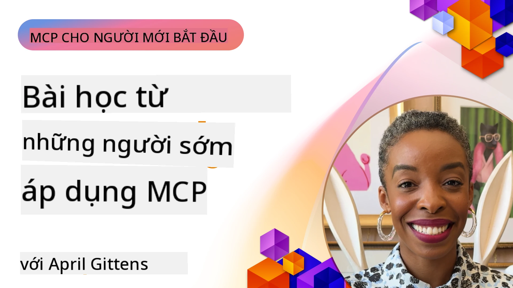

# 🌟 Bài học từ những người áp dụng sớm

[](https://youtu.be/jds7dSmNptE)

_(Nhấn vào hình trên để xem video bài học này)_

## 🎯 Nội dung của mô-đun này

Mô-đun này khám phá cách các tổ chức và nhà phát triển thực tế đang tận dụng Model Context Protocol (MCP) để giải quyết các thách thức thực tế và thúc đẩy đổi mới. Qua các nghiên cứu trường hợp chi tiết, các dự án thực hành và ví dụ thực tế, bạn sẽ khám phá cách MCP cho phép tích hợp AI bảo mật, mở rộng quy mô, kết nối các mô hình ngôn ngữ, công cụ và dữ liệu doanh nghiệp.

### 📚 Xem MCP trong thực tế

Muốn thấy các nguyên tắc này được áp dụng vào các công cụ sẵn sàng sản xuất? Xem [**10 Máy chủ MCP Microsoft đang thay đổi năng suất phát triển**](microsoft-mcp-servers.md), trình bày các máy chủ MCP Microsoft thực tế mà bạn có thể sử dụng ngay hôm nay.

## Tổng quan

Bài học này khám phá cách các người áp dụng sớm đã sử dụng Model Context Protocol (MCP) để giải quyết các thách thức thế giới thực và thúc đẩy đổi mới trong các ngành khác nhau. Qua các nghiên cứu trường hợp chi tiết và các dự án thực hành, bạn sẽ thấy cách MCP cho phép tích hợp AI chuẩn hóa, bảo mật và mở rộng quy mô — kết nối các mô hình ngôn ngữ lớn, công cụ và dữ liệu doanh nghiệp trong một khung thống nhất. Bạn sẽ có kinh nghiệm thực tiễn trong việc thiết kế và xây dựng các giải pháp dựa trên MCP, học hỏi từ các mẫu triển khai đã được chứng minh và khám phá các thực hành tốt nhất để triển khai MCP trong môi trường sản xuất. Bài học cũng nêu bật các xu hướng mới nổi, hướng phát triển tương lai và tài nguyên mã nguồn mở giúp bạn luôn đi đầu trong công nghệ MCP và hệ sinh thái đang phát triển của nó.

## Mục tiêu học tập

- Phân tích các triển khai MCP trong thực tế trên các ngành khác nhau
- Thiết kế và xây dựng các ứng dụng hoàn chỉnh dựa trên MCP
- Khám phá các xu hướng mới nổi và hướng đi tương lai trong công nghệ MCP
- Áp dụng các thực hành tốt nhất trong các kịch bản phát triển thực tế

## Triển khai MCP trong thực tế

### Nghiên cứu trường hợp 1: Tự động hóa hỗ trợ khách hàng doanh nghiệp

Một tập đoàn đa quốc gia đã triển khai giải pháp dựa trên MCP để chuẩn hóa tương tác AI trong các hệ thống hỗ trợ khách hàng của họ. Điều này cho phép họ:

- Tạo giao diện thống nhất cho nhiều nhà cung cấp LLM
- Duy trì quản lý prompt nhất quán giữa các phòng ban
- Triển khai kiểm soát bảo mật và tuân thủ chặt chẽ
- Dễ dàng chuyển đổi giữa các mô hình AI khác nhau dựa trên nhu cầu cụ thể

**Triển khai kỹ thuật:**

```python
# Triển khai máy chủ MCP bằng Python cho hỗ trợ khách hàng
import logging
import asyncio
from modelcontextprotocol import create_server, ServerConfig
from modelcontextprotocol.server import MCPServer
from modelcontextprotocol.transports import create_http_transport
from modelcontextprotocol.resources import ResourceDefinition
from modelcontextprotocol.prompts import PromptDefinition
from modelcontextprotocol.tool import ToolDefinition

# Cấu hình ghi log
logging.basicConfig(level=logging.INFO)

async def main():
    # Tạo cấu hình máy chủ
    config = ServerConfig(
        name="Enterprise Customer Support Server",
        version="1.0.0",
        description="MCP server for handling customer support inquiries"
    )
    
    # Khởi tạo máy chủ MCP
    server = create_server(config)
    
    # Đăng ký tài nguyên cơ sở tri thức
    server.resources.register(
        ResourceDefinition(
            name="customer_kb",
            description="Customer knowledge base documentation"
        ),
        lambda params: get_customer_documentation(params)
    )
    
    # Đăng ký mẫu nhắc nhở
    server.prompts.register(
        PromptDefinition(
            name="support_template",
            description="Templates for customer support responses"
        ),
        lambda params: get_support_templates(params)
    )
    
    # Đăng ký công cụ hỗ trợ
    server.tools.register(
        ToolDefinition(
            name="ticketing",
            description="Create and update support tickets"
        ),
        handle_ticketing_operations
    )
    
    # Khởi động máy chủ với giao thức HTTP
    transport = create_http_transport(port=8080)
    await server.run(transport)

if __name__ == "__main__":
    asyncio.run(main())
```

**Kết quả:** Giảm 30% chi phí mô hình, cải thiện tính nhất quán phản hồi 45%, và tăng cường tuân thủ trong toàn bộ hoạt động toàn cầu.

### Nghiên cứu trường hợp 2: Trợ lý chẩn đoán chăm sóc sức khỏe

Một nhà cung cấp dịch vụ chăm sóc sức khỏe đã phát triển hạ tầng MCP để tích hợp nhiều mô hình AI y tế chuyên ngành trong khi đảm bảo dữ liệu bệnh nhân nhạy cảm vẫn được bảo vệ:

- Chuyển đổi linh hoạt giữa các mô hình y tế tổng quát và chuyên sâu
- Kiểm soát quyền riêng tư và theo dõi kiểm toán nghiêm ngặt
- Tích hợp với các hệ thống Hồ sơ Sức khỏe Điện tử (EHR) hiện có
- Kỹ thuật prompt nhất quán cho thuật ngữ y học

**Triển khai kỹ thuật:**

```csharp
// C# MCP host application implementation in healthcare application
using Microsoft.Extensions.DependencyInjection;
using ModelContextProtocol.SDK.Client;
using ModelContextProtocol.SDK.Security;
using ModelContextProtocol.SDK.Resources;

public class DiagnosticAssistant
{
    private readonly MCPHostClient _mcpClient;
    private readonly PatientContext _patientContext;
    
    public DiagnosticAssistant(PatientContext patientContext)
    {
        _patientContext = patientContext;
        
        // Configure MCP client with healthcare-specific settings
        var clientOptions = new ClientOptions
        {
            Name = "Healthcare Diagnostic Assistant",
            Version = "1.0.0",
            Security = new SecurityOptions
            {
                Encryption = EncryptionLevel.Medical,
                AuditEnabled = true
            }
        };
        
        _mcpClient = new MCPHostClientBuilder()
            .WithOptions(clientOptions)
            .WithTransport(new HttpTransport("https://healthcare-mcp.example.org"))
            .WithAuthentication(new HIPAACompliantAuthProvider())
            .Build();
    }
    
    public async Task<DiagnosticSuggestion> GetDiagnosticAssistance(
        string symptoms, string patientHistory)
    {
        // Create request with appropriate resources and tool access
        var resourceRequest = new ResourceRequest
        {
            Name = "patient_records",
            Parameters = new Dictionary<string, object>
            {
                ["patientId"] = _patientContext.PatientId,
                ["requestingProvider"] = _patientContext.ProviderId
            }
        };
        
        // Request diagnostic assistance using appropriate prompt
        var response = await _mcpClient.SendPromptRequestAsync(
            promptName: "diagnostic_assistance",
            parameters: new Dictionary<string, object>
            {
                ["symptoms"] = symptoms,
                patientHistory = patientHistory,
                relevantGuidelines = _patientContext.GetRelevantGuidelines()
            });
            
        return DiagnosticSuggestion.FromMCPResponse(response);
    }
}
```

**Kết quả:** Cải thiện đề xuất chẩn đoán cho bác sĩ trong khi duy trì tuân thủ đầy đủ HIPAA và giảm đáng kể việc chuyển đổi ngữ cảnh giữa các hệ thống.

### Nghiên cứu trường hợp 3: Phân tích rủi ro dịch vụ tài chính

Một tổ chức tài chính đã triển khai MCP để chuẩn hóa quy trình phân tích rủi ro của họ giữa các phòng ban khác nhau:

- Tạo giao diện thống nhất cho các mô hình rủi ro tín dụng, phát hiện gian lận và rủi ro đầu tư
- Triển khai kiểm soát truy cập chặt chẽ và quản lý phiên bản mô hình
- Đảm bảo kiểm toán được tất cả các khuyến nghị AI
- Duy trì định dạng dữ liệu nhất quán trên các hệ thống đa dạng

**Triển khai kỹ thuật:**

```java
// Máy chủ MCP Java cho đánh giá rủi ro tài chính
import org.mcp.server.*;
import org.mcp.security.*;

public class FinancialRiskMCPServer {
    public static void main(String[] args) {
        // Tạo máy chủ MCP với các tính năng tuân thủ tài chính
        MCPServer server = new MCPServerBuilder()
            .withModelProviders(
                new ModelProvider("risk-assessment-primary", new AzureOpenAIProvider()),
                new ModelProvider("risk-assessment-audit", new LocalLlamaProvider())
            )
            .withPromptTemplateDirectory("./compliance/templates")
            .withAccessControls(new SOCCompliantAccessControl())
            .withDataEncryption(EncryptionStandard.FINANCIAL_GRADE)
            .withVersionControl(true)
            .withAuditLogging(new DatabaseAuditLogger())
            .build();
            
        server.addRequestValidator(new FinancialDataValidator());
        server.addResponseFilter(new PII_RedactionFilter());
        
        server.start(9000);
        
        System.out.println("Financial Risk MCP Server running on port 9000");
    }
}
```

**Kết quả:** Tăng cường tuân thủ quy định, rút ngắn chu kỳ triển khai mô hình 40%, và cải thiện tính nhất quán của đánh giá rủi ro giữa các phòng ban.

### Nghiên cứu trường hợp 4: Máy chủ MCP Playwright Microsoft cho tự động hóa trình duyệt

Microsoft đã phát triển [máy chủ MCP Playwright](https://github.com/microsoft/playwright-mcp) để cho phép tự động hóa trình duyệt bảo mật, chuẩn hóa qua Model Context Protocol. Máy chủ sẵn sàng sản xuất này cho phép các tác nhân AI và LLM tương tác với trình duyệt web theo cách có kiểm soát, có thể kiểm toán và mở rộng — hỗ trợ các trường hợp sử dụng như kiểm thử web tự động, trích xuất dữ liệu và quy trình làm việc đầu-cuối.

> **🎯 Công cụ sẵn sàng sản xuất**
>
> Nghiên cứu trường hợp này trình bày một máy chủ MCP thực tế bạn có thể sử dụng ngay hôm nay! Tìm hiểu thêm về Máy chủ MCP Playwright và 9 máy chủ MCP Microsoft sẵn sàng sản xuất khác trong [**Hướng dẫn máy chủ MCP Microsoft**](microsoft-mcp-servers.md#8--playwright-mcp-server).

**Tính năng chính:**
- Cung cấp khả năng tự động hóa trình duyệt (điều hướng, điền biểu mẫu, chụp ảnh màn hình, v.v.) dưới dạng công cụ MCP
- Triển khai kiểm soát truy cập nghiêm ngặt và sandbox để ngăn hành động trái phép
- Cung cấp nhật ký kiểm toán chi tiết cho tất cả tương tác trình duyệt
- Hỗ trợ tích hợp với Azure OpenAI và các nhà cung cấp LLM khác để tự động hóa do tác nhân điều khiển
- Cung cấp sức mạnh cho Tác nhân Coding của GitHub Copilot với khả năng duyệt web

**Triển khai kỹ thuật:**

```typescript
// TypeScript: Đăng ký các công cụ tự động hóa trình duyệt Playwright trong một máy chủ MCP
import { createServer, ToolDefinition } from 'modelcontextprotocol';
import { launch } from 'playwright';

const server = createServer({
  name: 'Playwright MCP Server',
  version: '1.0.0',
  description: 'MCP server for browser automation using Playwright'
});

// Đăng ký một công cụ để điều hướng đến URL và chụp ảnh màn hình
server.tools.register(
  new ToolDefinition({
    name: 'navigate_and_screenshot',
    description: 'Navigate to a URL and capture a screenshot',
    parameters: {
      url: { type: 'string', description: 'The URL to visit' }
    }
  }),
  async ({ url }) => {
    const browser = await launch();
    const page = await browser.newPage();
    await page.goto(url);
    const screenshot = await page.screenshot();
    await browser.close();
    return { screenshot };
  }
);

// Khởi động máy chủ MCP
server.listen(8080);
```

**Kết quả:**

- Cho phép tự động hóa trình duyệt an toàn, có lập trình cho các tác nhân AI và LLM
- Giảm nỗ lực kiểm thử thủ công và cải thiện phạm vi kiểm thử cho ứng dụng web
- Cung cấp khung tái sử dụng và mở rộng cho việc tích hợp công cụ dựa trên trình duyệt trong môi trường doanh nghiệp
- Cung cấp sức mạnh cho khả năng duyệt web của GitHub Copilot

**Tài liệu tham khảo:**

- [Kho lưu trữ GitHub Máy chủ MCP Playwright](https://github.com/microsoft/playwright-mcp)
- [Giải pháp AI và Tự động hóa Microsoft](https://azure.microsoft.com/en-us/products/ai-services/)

### Nghiên cứu trường hợp 5: Azure MCP – Model Context Protocol cấp doanh nghiệp như một dịch vụ

Máy chủ Azure MCP ([https://aka.ms/azmcp](https://aka.ms/azmcp)) là triển khai MCP cấp doanh nghiệp được Microsoft quản lý, thiết kế để cung cấp khả năng máy chủ MCP mở rộng, bảo mật và tuân thủ như một dịch vụ đám mây. Azure MCP giúp các tổ chức nhanh chóng triển khai, quản lý và tích hợp các máy chủ MCP với các dịch vụ AI, dữ liệu và bảo mật của Azure, giảm gánh nặng vận hành và thúc đẩy ứng dụng AI.

> **🎯 Công cụ sẵn sàng sản xuất**
>
> Đây là máy chủ MCP thực tế bạn có thể sử dụng ngay hôm nay! Tìm hiểu thêm về Máy chủ MCP Microsoft Foundry trong [**Hướng dẫn máy chủ MCP Microsoft**](microsoft-mcp-servers.md).


- Máy chủ MCP được quản lý hoàn toàn với khả năng mở rộng, giám sát và bảo mật tích hợp
- Tích hợp gốc với Azure OpenAI, Azure AI Search và các dịch vụ Azure khác
- Xác thực và ủy quyền doanh nghiệp qua Microsoft Entra ID
- Hỗ trợ công cụ tùy chỉnh, mẫu prompt và kết nối tài nguyên
- Tuân thủ các yêu cầu bảo mật và quy định doanh nghiệp

**Triển khai kỹ thuật:**

```yaml
# Example: Azure MCP server deployment configuration (YAML)
apiVersion: mcp.microsoft.com/v1
kind: McpServer
metadata:
  name: enterprise-mcp-server
spec:
  modelProviders:
    - name: azure-openai
      type: AzureOpenAI
      endpoint: https://<your-openai-resource>.openai.azure.com/
      apiKeySecret: <your-azure-keyvault-secret>
  tools:
    - name: document_search
      type: AzureAISearch
      endpoint: https://<your-search-resource>.search.windows.net/
      apiKeySecret: <your-azure-keyvault-secret>
  authentication:
    type: EntraID
    tenantId: <your-tenant-id>
  monitoring:
    enabled: true
    logAnalyticsWorkspace: <your-log-analytics-id>
```

**Kết quả:**  
- Rút ngắn thời gian đưa giá trị vào dự án AI doanh nghiệp nhờ cung cấp nền tảng máy chủ MCP sẵn sàng sử dụng và tuân thủ
- Đơn giản hóa tích hợp LLM, công cụ và nguồn dữ liệu doanh nghiệp
- Tăng cường bảo mật, khả năng quan sát và hiệu quả vận hành cho các khối lượng công việc MCP
- Cải thiện chất lượng mã với các thực hành tốt nhất của Azure SDK và mẫu xác thực hiện hành

**Tài liệu tham khảo:**  
- [Tài liệu Azure MCP](https://aka.ms/azmcp)
- [Kho lưu trữ máy chủ Azure MCP trên GitHub](https://github.com/Azure/azure-mcp)
- [Dịch vụ AI Azure](https://azure.microsoft.com/en-us/products/ai-services/)
- [Trung tâm MCP Microsoft](https://mcp.azure.com)

## Nghiên cứu trường hợp 6: NLWeb 
MCP (Model Context Protocol) là một giao thức mới nổi dành cho Chatbot và trợ lý AI tương tác với các công cụ. Mỗi phiên bản NLWeb cũng là một máy chủ MCP, hỗ trợ một phương thức cốt lõi, ask, được sử dụng để hỏi một trang web một câu hỏi bằng ngôn ngữ tự nhiên. Phản hồi trả về tận dụng schema.org, một từ vựng được sử dụng rộng rãi để mô tả dữ liệu web. Nói một cách đơn giản, MCP là NLWeb như Http là với HTML. NLWeb kết hợp các giao thức, định dạng Schema.org và mã mẫu giúp các trang web nhanh chóng tạo ra các điểm cuối này, mang lại lợi ích cho cả con người qua giao diện trò chuyện và máy móc qua tương tác tác nhân-tác nhân tự nhiên.

Có hai thành phần riêng biệt trong NLWeb.
- Một giao thức, rất đơn giản để bắt đầu, để giao tiếp với một trang web bằng ngôn ngữ tự nhiên và một định dạng, tận dụng json và schema.org cho câu trả lời trả về. Xem tài liệu về REST API để biết thêm chi tiết.
- Một triển khai đơn giản của (1) tận dụng đánh dấu hiện có, dành cho các trang có thể được trừu tượng như danh sách các mục (sản phẩm, công thức nấu ăn, điểm tham quan, nhận xét, v.v.). Kết hợp với một bộ widget giao diện người dùng, các trang có thể dễ dàng cung cấp giao diện trò chuyện cho nội dung của họ. Xem tài liệu về Life of a chat query để biết thêm chi tiết về cách hoạt động này.
 
**Tài liệu tham khảo:**  
- [Tài liệu Azure MCP](https://aka.ms/azmcp)
- [NLWeb](https://github.com/microsoft/NlWeb)

### Nghiên cứu trường hợp 7: Máy chủ MCP Microsoft Foundry – Tích hợp tác nhân AI doanh nghiệp

Máy chủ MCP Microsoft Foundry cho thấy cách MCP có thể được sử dụng để điều phối và quản lý các tác nhân AI và quy trình làm việc trong môi trường doanh nghiệp. Bằng cách tích hợp MCP với Microsoft Foundry, các tổ chức có thể chuẩn hóa tương tác tác nhân, tận dụng quản lý quy trình làm việc của Foundry, và đảm bảo triển khai bảo mật, mở rộng quy mô.

> **🎯 Công cụ sẵn sàng sản xuất**
>
> Đây là máy chủ MCP thực tế bạn có thể sử dụng ngay hôm nay! Tìm hiểu thêm về Máy chủ MCP Microsoft Foundry trong [**Hướng dẫn máy chủ MCP Microsoft**](microsoft-mcp-servers.md#9--microsoft-foundry-mcp-server).

**Tính năng chính:**
- Truy cập toàn diện vào hệ sinh thái AI của Azure, bao gồm danh mục mô hình và quản lý triển khai
- Lập chỉ mục kiến thức với Azure AI Search cho các ứng dụng RAG
- Công cụ đánh giá hiệu suất mô hình AI và đảm bảo chất lượng
- Tích hợp với Microsoft Foundry Catalog và Labs cho các mô hình nghiên cứu tiên tiến
- Quản lý và đánh giá tác nhân cho các kịch bản sản xuất

**Kết quả:**
- Prototype nhanh và giám sát quy trình tác nhân AI hiệu quả
- Tích hợp liền mạch với các dịch vụ AI Azure cho các kịch bản nâng cao
- Giao diện thống nhất để xây dựng, triển khai và giám sát pipeline tác nhân
- Cải thiện bảo mật, tuân thủ và hiệu quả vận hành cho doanh nghiệp
- Thúc đẩy ứng dụng AI nhanh chóng trong khi kiểm soát các quy trình phức tạp do tác nhân điều khiển

**Tài liệu tham khảo:**
- [Kho lưu trữ GitHub Máy chủ MCP Microsoft Foundry](https://github.com/azure-ai-foundry/mcp-foundry)
- [Tích hợp Azure AI Agents với MCP (Blog Microsoft Foundry)](https://devblogs.microsoft.com/foundry/integrating-azure-ai-agents-mcp/)

### Nghiên cứu trường hợp 8: Foundry MCP Playground – Thử nghiệm và chế tạo nguyên mẫu

Foundry MCP Playground cung cấp môi trường sẵn sàng sử dụng để thử nghiệm với các máy chủ MCP và tích hợp Microsoft Foundry. Các nhà phát triển có thể nhanh chóng chế tạo nguyên mẫu, kiểm thử và đánh giá mô hình AI và quy trình tác nhân sử dụng tài nguyên từ Microsoft Foundry Catalog và Labs. Playground đơn giản hóa việc thiết lập, cung cấp các dự án mẫu và hỗ trợ phát triển hợp tác, giúp dễ dàng khám phá các thực hành tốt nhất và kịch bản mới với chi phí thấp. Nó đặc biệt hữu ích cho các nhóm muốn xác thực ý tưởng, chia sẻ thử nghiệm và tăng tốc học hỏi mà không cần hạ tầng phức tạp. Bằng cách hạ thấp rào cản gia nhập, playground giúp thúc đẩy đổi mới và đóng góp cộng đồng trong hệ sinh thái MCP và Microsoft Foundry.

**Tài liệu tham khảo:**

- [Kho lưu trữ GitHub Foundry MCP Playground](https://github.com/azure-ai-foundry/foundry-mcp-playground)

### Nghiên cứu trường hợp 9: Máy chủ MCP Microsoft Learn Docs – Truy cập tài liệu hỗ trợ AI

Máy chủ MCP Microsoft Learn Docs là dịch vụ đám mây cung cấp trợ lý AI truy cập thời gian thực vào tài liệu chính thức của Microsoft qua Model Context Protocol. Máy chủ sẵn sàng sản xuất này kết nối với hệ sinh thái Microsoft Learn toàn diện và cho phép tìm kiếm ngữ nghĩa trên tất cả các nguồn chính thức của Microsoft.

> **🎯 Công cụ sẵn sàng sản xuất**
>
> Đây là máy chủ MCP thực tế bạn có thể sử dụng ngay hôm nay! Tìm hiểu thêm về Máy chủ MCP Microsoft Learn Docs trong [**Hướng dẫn máy chủ MCP Microsoft**](microsoft-mcp-servers.md#1--microsoft-learn-docs-mcp-server).

**Tính năng chính:**
- Truy cập thời gian thực vào tài liệu chính thức của Microsoft, tài liệu Azure và tài liệu Microsoft 365
- Năng lực tìm kiếm ngữ nghĩa nâng cao hiểu được ngữ cảnh và ý định
- Thông tin luôn cập nhật khi nội dung Microsoft Learn được xuất bản
- Bao phủ toàn diện Microsoft Learn, tài liệu Azure và nguồn Microsoft 365
- Trả về tối đa 10 đoạn nội dung chất lượng cao cùng tiêu đề bài viết và URL

**Tại sao nó quan trọng:**
- Giải quyết vấn đề "kiến thức AI lỗi thời" cho các công nghệ Microsoft
- Đảm bảo trợ lý AI có quyền truy cập vào các tính năng mới nhất của .NET, C#, Azure và Microsoft 365
- Cung cấp thông tin chính thống, từ nguồn đầu tiên cho việc tạo mã chính xác
- Quan trọng với các nhà phát triển làm việc với công nghệ Microsoft phát triển nhanh

**Kết quả:**
- Cải thiện rõ rệt độ chính xác của mã do AI tạo ra cho các công nghệ Microsoft
- Giảm thời gian tìm kiếm tài liệu và thực tiễn tốt nhất hiện hành
- Tăng năng suất nhà phát triển với truy xuất tài liệu có nhận thức ngữ cảnh
- Tích hợp liền mạch với quy trình phát triển mà không rời khỏi IDE

**Tài liệu tham khảo:**
- [Kho lưu trữ GitHub Máy chủ MCP Microsoft Learn Docs](https://github.com/MicrosoftDocs/mcp)
- [Tài liệu Microsoft Learn](https://learn.microsoft.com/)

## Các dự án thực hành

### Dự án 1: Xây dựng máy chủ MCP đa nhà cung cấp

**Mục tiêu:** Tạo một máy chủ MCP có thể chuyển hướng yêu cầu đến nhiều nhà cung cấp mô hình AI dựa trên tiêu chí cụ thể.

**Yêu cầu:**

- Hỗ trợ ít nhất ba nhà cung cấp mô hình khác nhau (ví dụ: OpenAI, Anthropic, mô hình cục bộ)
- Triển khai cơ chế định tuyến dựa trên siêu dữ liệu yêu cầu
- Tạo hệ thống cấu hình quản lý thông tin đăng nhập nhà cung cấp
- Thêm bộ nhớ đệm để tối ưu hiệu suất và chi phí
- Xây dựng bảng điều khiển đơn giản để giám sát sử dụng

**Các bước triển khai:**

1. Thiết lập hạ tầng máy chủ MCP cơ bản
2. Triển khai adapter nhà cung cấp cho mỗi dịch vụ mô hình AI
3. Tạo logic định tuyến dựa trên thuộc tính yêu cầu
4. Thêm cơ chế bộ nhớ đệm cho các yêu cầu thường xuyên
5. Phát triển bảng điều khiển giám sát
6. Kiểm thử với các mẫu yêu cầu khác nhau

**Công nghệ:** Chọn từ Python (.NET/Java/Python tùy theo sở thích), Redis cho bộ nhớ đệm và khung web đơn giản cho bảng điều khiển.

### Dự án 2: Hệ thống quản lý prompt doanh nghiệp

**Mục tiêu:** Phát triển hệ thống dựa trên MCP để quản lý, phiên bản hóa và triển khai các mẫu prompt trong toàn tổ chức.

**Yêu cầu:**


- Tạo một kho lưu trữ tập trung cho các mẫu lệnh nhắc
- Triển khai hệ thống phiên bản và quy trình phê duyệt
- Xây dựng khả năng kiểm thử mẫu với các đầu vào mẫu
- Phát triển các kiểm soát truy cập dựa trên vai trò
- Tạo API để truy xuất và triển khai mẫu

**Các bước triển khai:**

1. Thiết kế sơ đồ cơ sở dữ liệu cho việc lưu trữ mẫu
2. Tạo API cốt lõi cho các thao tác CRUD với mẫu
3. Triển khai hệ thống quản lý phiên bản
4. Xây dựng quy trình phê duyệt
5. Phát triển khung kiểm thử
6. Tạo giao diện web đơn giản để quản lý
7. Tích hợp với máy chủ MCP

**Công nghệ:** Lựa chọn framework backend, cơ sở dữ liệu SQL hoặc NoSQL, và framework frontend cho giao diện quản lý của bạn.

### Dự án 3: Nền tảng Tạo Nội dung Dựa trên MCP

**Mục tiêu:** Xây dựng nền tảng tạo nội dung tận dụng MCP để cung cấp kết quả nhất quán cho các loại nội dung khác nhau.

**Yêu cầu:**

- Hỗ trợ nhiều định dạng nội dung (bài blog, mạng xã hội, bản sao marketing)
- Triển khai tạo nội dung dựa trên mẫu với các tùy chọn tùy chỉnh
- Tạo hệ thống đánh giá và phản hồi nội dung
- Theo dõi các chỉ số hiệu suất nội dung
- Hỗ trợ quản lý phiên bản và lặp lại nội dung

**Các bước triển khai:**

1. Thiết lập cơ sở hạ tầng khách MCP
2. Tạo mẫu cho từng loại nội dung khác nhau
3. Xây dựng luồng tạo nội dung
4. Triển khai hệ thống đánh giá
5. Phát triển hệ thống theo dõi các chỉ số
6. Tạo giao diện người dùng cho quản lý mẫu và tạo nội dung

**Công nghệ:** Ngôn ngữ lập trình bạn ưa thích, framework web và hệ thống cơ sở dữ liệu.

## Hướng Đi Tương Lai cho Công Nghệ MCP

### Xu Hướng Mới Nổi

1. **MCP Đa phương thức**
   - Mở rộng MCP để chuẩn hóa tương tác với mô hình hình ảnh, âm thanh và video
   - Phát triển năng lực suy luận đa phương thức
   - Định dạng lệnh nhắc tiêu chuẩn cho các phương thức khác nhau

2. **Cơ sở hạ tầng MCP Liên kết**
   - Mạng MCP phân phối có thể chia sẻ tài nguyên giữa các tổ chức
   - Giao thức tiêu chuẩn để chia sẻ mô hình an toàn
   - Kỹ thuật tính toán bảo vệ quyền riêng tư

3. **Chợ MCP**
   - Hệ sinh thái chia sẻ và thương mại hóa các mẫu và plugin MCP
   - Quy trình đảm bảo chất lượng và chứng nhận
   - Tích hợp với các chợ mô hình

4. **MCP cho Edge Computing**
   - Điều chỉnh tiêu chuẩn MCP cho các thiết bị edge hạn chế tài nguyên
   - Giao thức tối ưu cho môi trường băng thông thấp
   - Triển khai MCP chuyên biệt cho hệ sinh thái IoT

5. **Khung Pháp lý**
   - Phát triển các tiện ích MCP cho tuân thủ quy định
   - Sổ kiểm toán tiêu chuẩn và giao diện giải thích
   - Tích hợp với các khung quản trị AI mới nổi

### Giải Pháp MCP từ Microsoft

Microsoft và Azure đã phát triển một số kho mã nguồn mở để hỗ trợ nhà phát triển triển khai MCP trong nhiều kịch bản:

#### Tổ chức Microsoft

1. [playwright-mcp](https://github.com/microsoft/playwright-mcp) - Máy chủ MCP Playwright cho tự động hóa và kiểm thử trình duyệt
2. [files-mcp-server](https://github.com/microsoft/files-mcp-server) - Triển khai máy chủ MCP OneDrive để kiểm thử cục bộ và đóng góp cộng đồng
3. [NLWeb](https://github.com/microsoft/NlWeb) - NLWeb là tập hợp các giao thức mở và công cụ nguồn mở liên quan, tập trung chủ yếu vào việc thiết lập lớp nền tảng cho Web AI

#### Tổ chức Azure-Samples

1. [mcp](https://github.com/Azure-Samples/mcp) - Liên kết đến các mẫu, công cụ và tài nguyên để xây dựng và tích hợp máy chủ MCP trên Azure với nhiều ngôn ngữ
2. [mcp-auth-servers](https://github.com/Azure-Samples/mcp-auth-servers) - Máy chủ MCP tham khảo minh họa xác thực theo đặc tả Model Context Protocol hiện hành
3. [remote-mcp-functions](https://github.com/Azure-Samples/remote-mcp-functions) - Trang đích cho triển khai máy chủ MCP từ xa trong Azure Functions với liên kết tới các kho mã theo ngôn ngữ
4. [remote-mcp-functions-python](https://github.com/Azure-Samples/remote-mcp-functions-python) - Mẫu khởi động nhanh để xây dựng và triển khai máy chủ MCP từ xa tùy chỉnh sử dụng Azure Functions với Python
5. [remote-mcp-functions-dotnet](https://github.com/Azure-Samples/remote-mcp-functions-dotnet) - Mẫu khởi động nhanh để xây dựng và triển khai máy chủ MCP từ xa tùy chỉnh sử dụng Azure Functions với .NET/C#
6. [remote-mcp-functions-typescript](https://github.com/Azure-Samples/remote-mcp-functions-typescript) - Mẫu khởi động nhanh để xây dựng và triển khai máy chủ MCP từ xa tùy chỉnh sử dụng Azure Functions với TypeScript
7. [remote-mcp-apim-functions-python](https://github.com/Azure-Samples/remote-mcp-apim-functions-python) - Azure API Management như Cổng AI đến máy chủ MCP từ xa sử dụng Python
8. [AI-Gateway](https://github.com/Azure-Samples/AI-Gateway) - Thí nghiệm APIM ❤️ AI bao gồm các khả năng MCP, tích hợp với Azure OpenAI và AI Foundry

Các kho mã này cung cấp các triển khai, mẫu, và tài nguyên khác nhau để làm việc với Model Context Protocol trên nhiều ngôn ngữ lập trình và dịch vụ Azure khác nhau. Chúng bao phủ nhiều trường hợp dùng từ các triển khai máy chủ cơ bản đến xác thực, triển khai đám mây và tình huống tích hợp doanh nghiệp.

#### Thư mục Tài nguyên MCP

Thư mục [MCP Resources](https://github.com/microsoft/mcp/tree/main/Resources) trong kho chính thức Microsoft MCP cung cấp bộ sưu tập chọn lọc các tài nguyên mẫu, mẫu lệnh nhắc, và định nghĩa công cụ để sử dụng với các máy chủ Model Context Protocol. Thư mục này được thiết kế để giúp các nhà phát triển nhanh chóng bắt đầu với MCP bằng cách cung cấp các khối xây dựng tái sử dụng và ví dụ thực hành tốt nhất cho:

- **Mẫu Lệnh Nhắc:** Mẫu lệnh nhắc sẵn sàng sử dụng cho các tác vụ và kịch bản AI phổ biến, có thể điều chỉnh cho các triển khai máy chủ MCP của bạn.
- **Định nghĩa Công Cụ:** Ví dụ sơ đồ công cụ và siêu dữ liệu để chuẩn hóa tích hợp và gọi công cụ trên các máy chủ MCP khác nhau.
- **Mẫu Tài Nguyên:** Định nghĩa tài nguyên ví dụ để kết nối với nguồn dữ liệu, API và dịch vụ bên ngoài trong khung MCP.
- **Triển khai Tham Chiếu:** Các mẫu thực tế minh họa cách cấu trúc và tổ chức tài nguyên, lệnh nhắc và công cụ trong các dự án MCP thực tế.

Các tài nguyên này tăng tốc phát triển, thúc đẩy tiêu chuẩn hóa, và giúp đảm bảo thực hành tốt nhất khi xây dựng và triển khai giải pháp dựa trên MCP.

#### Thư mục Tài nguyên MCP

- [MCP Resources (Mẫu Lệnh Nhắc, Công Cụ và Định nghĩa Tài Nguyên)](https://github.com/microsoft/mcp/tree/main/Resources)

### Cơ Hội Nghiên Cứu

- Kỹ thuật tối ưu lệnh nhắc hiệu quả trong khung MCP
- Mô hình bảo mật cho triển khai MCP đa thuê
- Đánh giá hiệu năng trên các triển khai MCP khác nhau
- Phương pháp xác minh chính thức cho máy chủ MCP

## Kết luận

Model Context Protocol (MCP) đang nhanh chóng định hình tương lai của tích hợp AI chuẩn hóa, an toàn và có khả năng tương tác trên nhiều ngành công nghiệp. Qua các nghiên cứu điển hình và dự án thực hành trong bài học này, bạn đã thấy cách những người đi đầu—bao gồm Microsoft và Azure—đang tận dụng MCP để giải quyết các thách thức thực tế, thúc đẩy ứng dụng AI nhanh hơn, và đảm bảo tuân thủ, an ninh và khả năng mở rộng. Cách tiếp cận mô-đun của MCP cho phép các tổ chức kết nối các mô hình ngôn ngữ lớn, công cụ và dữ liệu doanh nghiệp trong một khung thống nhất, có thể kiểm tra. Khi MCP tiếp tục phát triển, giữ liên kết với cộng đồng, khám phá tài nguyên mã nguồn mở và áp dụng thực hành tốt nhất sẽ là chìa khóa để xây dựng giải pháp AI vững chắc, sẵn sàng cho tương lai.

## Tài nguyên bổ sung

- [Kho GitHub MCP Foundry](https://github.com/azure-ai-foundry/mcp-foundry)
- [Foundry MCP Playground](https://github.com/azure-ai-foundry/foundry-mcp-playground)
- [Tích hợp Azure AI Agents với MCP (Blog Microsoft Foundry)](https://devblogs.microsoft.com/foundry/integrating-azure-ai-agents-mcp/)
- [Kho GitHub MCP (Microsoft)](https://github.com/microsoft/mcp)
- [Thư mục Tài nguyên MCP (Mẫu Lệnh Nhắc, Công Cụ và Định nghĩa Tài Nguyên)](https://github.com/microsoft/mcp/tree/main/Resources)
- [Cộng đồng & Tài liệu MCP](https://modelcontextprotocol.io/introduction)
- [Đặc tả MCP (2026-07-28)](https://modelcontextprotocol.io/specification/2026-07-28/)
- [Tài liệu Azure MCP](https://aka.ms/azmcp)
- [OWASP MCP Top 10](https://microsoft.github.io/mcp-azure-security-guide/mcp/) - Thực hành bảo mật tốt nhất
- [Kho GitHub Máy chủ Playwright MCP](https://github.com/microsoft/playwright-mcp)
- [Máy chủ Files MCP (OneDrive)](https://github.com/microsoft/files-mcp-server)
- [Azure-Samples MCP](https://github.com/Azure-Samples/mcp)
- [Máy chủ MCP Xác thực (Azure-Samples)](https://github.com/Azure-Samples/mcp-auth-servers)
- [Hàm MCP từ xa (Azure-Samples)](https://github.com/Azure-Samples/remote-mcp-functions)
- [Hàm MCP từ xa bằng Python (Azure-Samples)](https://github.com/Azure-Samples/remote-mcp-functions-python)
- [Hàm MCP từ xa bằng .NET (Azure-Samples)](https://github.com/Azure-Samples/remote-mcp-functions-dotnet)
- [Hàm MCP từ xa bằng TypeScript (Azure-Samples)](https://github.com/Azure-Samples/remote-mcp-functions-typescript)
- [Hàm APIM MCP từ xa Python (Azure-Samples)](https://github.com/Azure-Samples/remote-mcp-apim-functions-python)
- [AI-Gateway (Azure-Samples)](https://github.com/Azure-Samples/AI-Gateway)
- [Giải pháp AI và Tự động hóa Microsoft](https://azure.microsoft.com/en-us/products/ai-services/)

## Bài tập

1. Phân tích một trong các nghiên cứu điển hình và đề xuất cách triển khai thay thế.
2. Chọn một ý tưởng dự án và tạo một bản đặc tả kỹ thuật chi tiết.
3. Nghiên cứu một ngành không được đề cập trong các nghiên cứu điển hình và phác thảo cách MCP có thể giải quyết các thách thức cụ thể của ngành đó.
4. Khám phá một trong các hướng đi tương lai và tạo ra một khái niệm cho tiện ích MCP mới để hỗ trợ hướng đó.

## Tiếp theo là gì

Khám phá thêm: [Microsoft MCP Servers](./microsoft-mcp-servers.md)

Tiếp tục tới: [Module 8: Best Practices](../08-BestPractices/README.md)

---

<!-- CO-OP TRANSLATOR DISCLAIMER START -->
**Tuyên bố miễn trừ trách nhiệm**:
Tài liệu này đã được dịch bằng dịch vụ dịch thuật AI [Co-op Translator](https://github.com/Azure/co-op-translator). Mặc dù chúng tôi cố gắng đảm bảo độ chính xác, xin lưu ý rằng bản dịch tự động có thể chứa lỗi hoặc sai sót. Tài liệu gốc bằng ngôn ngữ gốc nên được coi là nguồn tin chính thức. Đối với thông tin quan trọng, nên sử dụng dịch vụ dịch thuật chuyên nghiệp bởi con người. Chúng tôi không chịu trách nhiệm về bất kỳ hiểu lầm hoặc giải thích sai nào phát sinh từ việc sử dụng bản dịch này.
<!-- CO-OP TRANSLATOR DISCLAIMER END -->