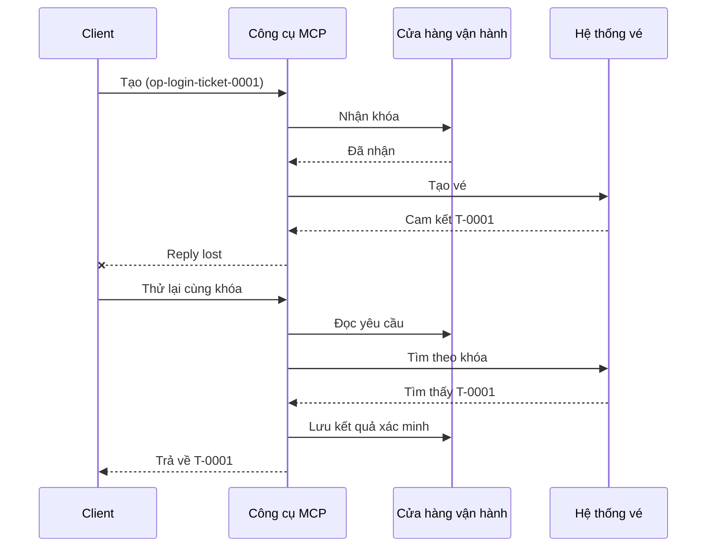
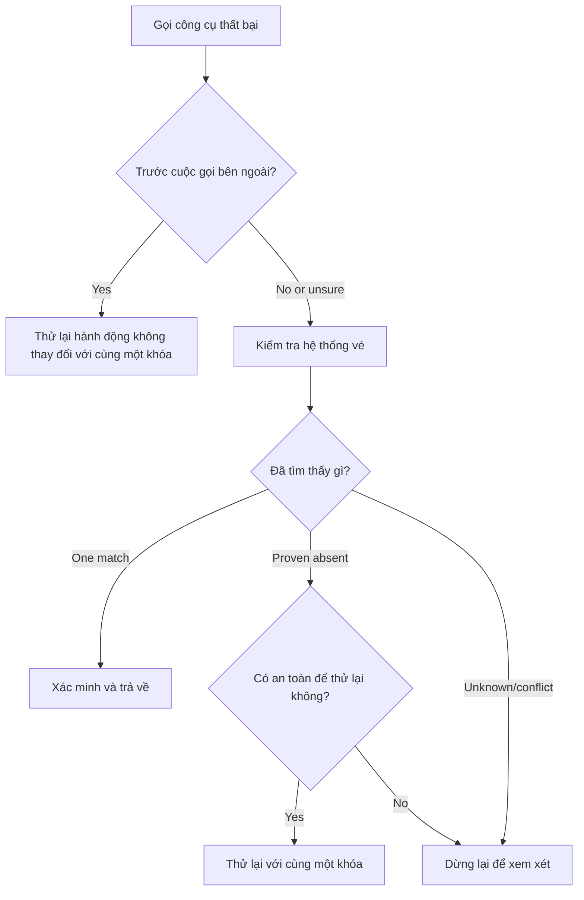

# Khả năng Thử lại An toàn cho Công cụ MCP: Mẫu Reliability Sidecar

Một phản hồi bị mất không có nghĩa là hành động bị mất. Một công cụ hỗ trợ
có thể tạo vé `T-0001` và sau đó mất kết nối trước khi khách hàng nhìn thấy
kết quả. Nếu khách hàng thử lại một cách mù quáng, có thể tạo ra `T-0002`.

Bài học này chỉ ra cách nhận biết kết quả không chắc chắn đó, giữ một định danh
ổn định cho hành động dự định, và kiểm tra hệ thống vé trước khi thử
lại. Bài tập Python kèm theo chạy cục bộ với thư viện chuẩn
và SQLite.

## Tại sao Timeout Có Nghĩa Là "Kết Quả Không Rõ"

Giả sử khách hàng gọi `create_support_ticket` với khóa thao tác
`op-login-ticket-0001`:



Kết nối thất bại sau khi vé được cam kết nhưng trước khi kết quả được gửi đến.
Khách hàng chỉ biết là phản hồi bị mất. Nó không biết liệu vé có bị mất hay không.
Tái sử dụng khóa thao tác cho phép công cụ tìm và trả về
`T-0001` thay vì tạo `T-0002`.

## Mục Đích của Reliability Sidecar

Reliability sidecar là mã ứng dụng giữ trạng thái phục hồi xung quanh
một công cụ. Nó có thể là một thư viện, middleware, dịch vụ có cơ sở dữ liệu, hoặc đơn giản là
một phần của việc triển khai công cụ. Nó không cần phải là một tiến trình riêng biệt,
và nó không phải là tính năng giao thức MCP.

Sidecar có bốn nhiệm vụ:

1. lưu lại hành động dự định trước khi gọi hệ thống bên ngoài;
2. chỉ cho phép một người làm việc đảm nhận hành động đó;
3. ghi nhớ đủ trạng thái để phục hồi sau sự cố; và
4. kiểm tra hệ thống bên ngoài khi kết quả không chắc chắn.

Bài học này tập trung vào đặc tả MCP cuối cùng `2026-07-28`. MCP không có
phiên giao thức cấp cao, nên khóa thao tác chỉ là một tham số công cụ thông thường
được hỗ trợ bằng trạng thái ứng dụng bền vững. Mẫu này cũng hoạt động với các phiên bản MCP
trước đó.

## Bốn Định Danh Giải Quyết Các Vấn Đề Khác Nhau

Các định danh này có liên quan nhưng không thể thay thế cho nhau:

| Định danh | Xác định cái gì | Có tồn tại qua thử lại? |
| --- | --- | --- |
| ID JSON-RPC | Một yêu cầu và phản hồi | Không; sử dụng một ID yêu cầu mới |
| ID Công việc MCP | Một tác vụ chạy dài | Có; giữ nó để polling |
| Khóa thao tác | Một hành động dự định | Có; tái sử dụng nó cho hành động đó |
| ID Vé | Kết quả được lưu trữ | Có; trả về sau khi xác minh |

Thông báo tiến trình và ngữ cảnh theo dõi giúp quan sát yêu cầu.
Hủy bỏ yêu cầu dừng công việc. Không có cái nào ngăn chặn trùng vé.

## Xây Dựng Bộ Bảo Vệ

Tạo khóa thao tác trước lần gọi công cụ đầu tiên và lưu nó cùng
quy trình công việc. Mỗi lần cố gắng tạo cùng một vé dự định sẽ dùng cùng một khóa:

```json
{
  "operation_key": "op-login-ticket-0001",
  "title": "Cannot sign in"
}
```

Một vé dự định khác sẽ có khóa mới. Trong môi trường sản xuất, tạo một giá trị mờ,
khó đoán thay vì đưa dữ liệu khách hàng vào khóa.

Dưới đây là sơ đồ công cụ MCP đầy đủ được sử dụng trong bài học này:

```json
{
  "name": "create_support_ticket",
  "title": "Create support ticket",
  "description": "Creates or recovers one support ticket for an operation key.",
  "inputSchema": {
    "$schema": "https://json-schema.org/draft/2020-12/schema",
    "type": "object",
    "properties": {
      "operation_key": {
        "type": "string",
        "minLength": 16,
        "maxLength": 128,
        "description": "Stable key reused for the same intended action."
      },
      "title": {
        "type": "string",
        "minLength": 1,
        "maxLength": 200
      }
    },
    "required": ["operation_key", "title"],
    "additionalProperties": false
  },
  "outputSchema": {
    "$schema": "https://json-schema.org/draft/2020-12/schema",
    "type": "object",
    "properties": {
      "ticket_id": {
        "type": "string"
      },
      "operation_key": {
        "type": "string"
      },
      "status": {
        "type": "string",
        "const": "verified"
      }
    },
    "required": ["ticket_id", "operation_key", "status"],
    "additionalProperties": false
  }
}
```

Định danh người gọi xác thực đến từ ngữ cảnh máy chủ, không phải
từ đầu vào công cụ do mô hình cung cấp. Phạm vi từng thao tác lưu trữ bao gồm:

- người gọi đó, người thuê, hoặc tài khoản dịch vụ;
- tên công cụ và phiên bản; và
- một hàm băm của các đầu vào chuẩn hóa xác định hành động bên ngoài.

Hàm băm đầu vào trả lời một câu hỏi đơn giản: "Lần thử lại này có yêu cầu cùng
một vé không?" Nếu khóa đã thuộc về tiêu đề khác, từ chối cuộc gọi.

Việc trả về kết quả trước cho dữ liệu đầu vào đã thay đổi sẽ che giấu lỗi hợp đồng.

Lưu yêu cầu với một thao tác cơ sở dữ liệu nguyên tử. "Nguyên tử" có nghĩa là hai công nhân
không thể đều quan sát một bản ghi trống và đều trở thành chủ sở hữu. Khóa cục bộ
trong tiến trình không đủ khi một phiên bản máy chủ khác có thể nhận được thử lại.

Luồng công việc tạo khóa trong khi hành động là `planned`. Mẫu sau đó
lưu giữ các trạng thái này:

- `claimed`: một công nhân đã đặt giữ thao tác;
- `completed`: hệ thống vé trả về kết quả; và
- `verified`: một lần đọc từ hệ thống vé xác nhận kết quả.

Một sự cố có thể để lại trạng thái lưu dưới dạng `claimed` ngay cả sau khi vé đã
được tạo. Xử lý mọi yêu cầu không kết thúc là không chắc chắn cho đến khi có bằng chứng
bên ngoài xác định. Không giả định rằng `claimed` có nghĩa là "không có gì xảy ra."

## Phục hồi Trước Khi Thử Lại

Khi một cuộc gọi công cụ thất bại, hãy quyết định những gì đã biết trước khi gửi một
lần ghi ra ngoài khác:



Việc xác thực thất bại trước khi gọi API vé là một lỗi đã biết.
Thử lại hành động không đổi với cùng khoá thao tác. Nếu sửa đầu vào
thay đổi vé định hướng, tạo một khoá mới cho hành động mới đó.

Nếu yêu cầu có thể đã đến hệ thống vé, đối chiếu nó trước.
Đối chiếu có nghĩa là so sánh yêu cầu đã lưu với bản ghi vé có thẩm quyền.
Trả về vé hiện có khi tìm thấy đúng một bản ghi phù hợp.
Chỉ thử lại khi vé chắc chắn không tồn tại và hợp đồng hạ nguồn
làm cho lần thử lại khác an toàn.

"Không tìm thấy" không phải lúc nào cũng kết luận. Một nhà cung cấp với tìm kiếm nhất quán cuối cùng
có thể cần đợi giới hạn và kiểm tra thêm. Nếu hệ thống không thể được
tìm kiếm, đưa ra kết quả mâu thuẫn, hoặc không thể an toàn loại bỏ trùng lặp lần
thử khác, dừng lại và báo cáo `kết quả không rõ`. Dừng lại ở đây đôi khi được gọi là
"thất bại đóng": luồng công việc từ chối phỏng đoán.

## Bằng chứng, Nhiệm vụ và Hủy bỏ

Phản hồi công cụ nói lên những gì công cụ báo cáo. Điểm kiểm tra được lưu nói lên những gì
luồng công việc ghi nhận. Bằng chứng mạnh nhất đến từ hệ thống sở hữu
kết quả: trong ví dụ này, một lần đọc từ hệ thống vé tìm thấy đúng một
vé khớp.

Ghép bằng chứng với rủi ro. Một ID tin nhắn nhà cung cấp có thể đủ cho
một thông báo rủi ro thấp. Thanh toán, triển khai, và các hành động phá hủy có thể
cần bằng chứng trạng thái nhà cung cấp, sổ cái, hoặc xem xét thủ công.

Phần mở rộng MCP Tasks bổ sung cho mẫu này cho công việc chạy dài. Một ID
Nhiệm vụ cho phép khách hàng tiếp tục thăm dò sau khi mất kết nối, nhưng nó không định danh
hoặc loại trùng vé chính nó. Khi sử dụng Tasks, các định danh kết nối
như sau:

```text
operation key -> Task ID -> ticket ID -> verification evidence
```

Hủy bỏ mang tính hợp tác, không phải cuộn lại. Vé vẫn có thể được tạo
sau khi xác nhận hủy bỏ, vì vậy một kết quả không chắc chắn vẫn cần
đối chiếu.

## Chạy Bài Tập Tiêm Lỗi

Mẫu sử dụng hai tập tin SQLite: một đại diện cho kho lưu trữ thao tác và
tập còn lại đại diện cho hệ thống vé bên ngoài. Không có giao dịch nào bao trùm
cả hai tập tin. Lỗi được tiêm sau khi vé cam kết nhưng trước
khi sidecar ghi nhận hoàn thành.

Phương pháp Python trực tiếp chấp nhận `caller_id` như một đại diện cho ngữ cảnh
máy chủ đã xác thực. Không thêm `caller_id` vào lược đồ đầu vào MCP do mô hình điều khiển.


Dự đoán kết quả trước khi chạy các bài kiểm tra:

| Đường dẫn | Kết quả sau khi thử lại | Số lượng vé |
| --- | --- | --- |
| Thử lại mù | Tạo `T-0002` sau khi mất phản hồi cho `T-0001` | 2 |

| Thử lại có bảo vệ | Tìm và trả về `T-0001` | 1 |

Chạy:

```bash
cd 08-BestPractices/reliability-sidecars/python
python -m unittest discover -p "test_*.py" -v
```

Sáu bài kiểm tra cho thấy rằng:

1. một lần thử lại mù tạo ra bản sao;
2. mất phản hồi cộng với khởi động lại phục hồi một vé từ một yêu cầu bền vững;
3. một lần thử lại đã xác minh tái sử dụng kết quả đã lưu;
4. đầu vào thay đổi hoặc bằng chứng bên ngoài mâu thuẫn bị từ chối;
5. một yêu cầu hiện có không có bằng chứng bên ngoài dừng an toàn; và
6. các yêu cầu đồng thời cho phép một chủ sở hữu mà không giảm kết quả đã xác minh.

Mở mẫu:

- [Triển khai Python](../../../../08-BestPractices/reliability-sidecars/python/reliability_sidecar.py)
- [Kiểm tra xác định](../../../../08-BestPractices/reliability-sidecars/python/test_reliability_sidecar.py)

Mẫu này cố ý bỏ qua việc cho thuê yêu cầu đã cũ. Chính sách tiếp quản sản xuất
cần một hợp đồng cho thuê giới hạn, chuyển giao quyền sở hữu nguyên tử và một
kiểm tra bên ngoài khác trước khi thực thi.

## Triển khai cộng đồng tùy chọn

Agent Enhancer Utilities là một triển khai cộng đồng của mẫu cấp ứng dụng này.
Bộ lập kế hoạch của nó chọn một phương pháp phục hồi, trong khi bản ghi điểm kiểm tra của nó ghi lại trạng thái yêu cầu và kết quả không chắc chắn. Công cụ miền hoặc máy chủ MCP vẫn thực hiện và xác minh hành động thực sự. Dịch vụ này không phải là một phần của đặc tả MCP và không bắt buộc cho bài học này.
checkpoint ghi lại trạng thái yêu cầu và kết quả không chắc chắn. Công cụ miền hoặc máy chủ MCP vẫn thực hiện và xác minh hành động thực sự. Dịch vụ này không phải là một phần của đặc tả MCP và không bắt buộc cho bài học này.


| Khái niệm bài học | Thành phần Agent Enhancer | Giới hạn quan trọng |
| --- | --- | --- |
| Kế hoạch phục hồi | `workflow-guard-planner` | Không gọi công cụ miền |
| Yêu cầu và phục hồi | `workflow-checkpoint` | `external_proof` vẫn là `false` |
| Phát lại sidecar chính xác | `lab.invoke_tool` | Dùng khóa idempotency riêng biệt |
| Xác minh hành động thực sự | Tìm kiếm/đọc ngược điểm đến | MCP miền sở hữu |

Để thử lại chính xác một cuộc gọi sidecar, `lab.invoke_tool` chấp nhận một `idempotency_key` bên ngoài. Khóa đó định danh cuộc gọi sidecar; nó không phải là `operation_key` kinh doanh dùng cho vé.


Hợp đồng công khai có gắn thẻ và một ví dụ mạng tùy chọn có sẵn ở đây:


- [Mẫu lập kế hoạch và miền giả lập](https://github.com/artiehinz/Agent-Enhancer-Utilities/tree/v1.6.0/examples/reliability-sidecar)


## Danh sách kiểm tra sản xuất

- [ ] Tạo và lưu khóa thao tác trước lần thử bên ngoài đầu tiên.
- [ ] Liên kết khóa với caller, phiên bản công cụ và băm đầu vào chuẩn hóa.
- [ ] Từ chối đầu vào thay đổi dưới một khóa đã tồn tại.
- [ ] Cho phép một chủ sở hữu với thao tác lưu trữ chia sẻ nguyên tử.
- [ ] Chuyển tiếp khóa đến nhà cung cấp hạ nguồn khi họ hỗ trợ idempotency.
- [ ] Hòa giải các kết quả không chắc chắn trước một lần ghi khác.
- [ ] Giữ kết quả và bằng chứng đã xác minh trong toàn bộ cửa sổ thử lại.
- [ ] Dừng để xem xét khi kết quả bên ngoài không thể thiết lập an toàn.

## Tài liệu tham khảo

- [Đặc tả MCP `2026-07-28`](https://modelcontextprotocol.io/specification/2026-07-28)
- [Hướng dẫn công cụ MCP `2026-07-28`](https://modelcontextprotocol.io/specification/2026-07-28/server/tools)
- [Mở rộng tác vụ MCP](https://modelcontextprotocol.io/extensions/tasks/overview)
- [Đặc tả JSON-RPC 2.0](https://www.jsonrpc.org/specification)

---

<!-- CO-OP TRANSLATOR DISCLAIMER START -->
**Tuyên bố miễn trừ trách nhiệm**:
Tài liệu này đã được dịch bằng dịch vụ dịch thuật AI [Co-op Translator](https://github.com/Azure/co-op-translator). Mặc dù chúng tôi cố gắng đảm bảo độ chính xác, xin lưu ý rằng bản dịch tự động có thể chứa lỗi hoặc sai sót. Tài liệu gốc bằng ngôn ngữ gốc nên được coi là nguồn tin chính thức. Đối với thông tin quan trọng, nên sử dụng dịch vụ dịch thuật chuyên nghiệp bởi con người. Chúng tôi không chịu trách nhiệm về bất kỳ hiểu lầm hoặc giải thích sai nào phát sinh từ việc sử dụng bản dịch này.
<!-- CO-OP TRANSLATOR DISCLAIMER END -->