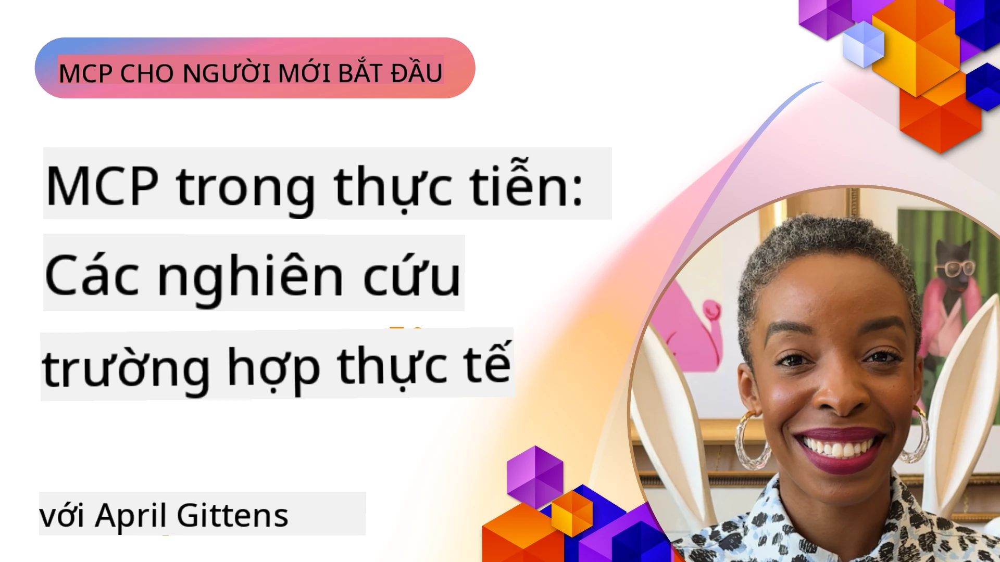

# MCP trong Thực Tiễn: Các Nghiên Cứu Tình Huống Thế Giới Thực

_(Nhấn vào hình trên để xem video của bài học này)_

Giao thức Ngữ cảnh Mô hình (MCP) đang biến đổi cách các ứng dụng AI tương tác với dữ liệu, công cụ và dịch vụ. Phần này trình bày các nghiên cứu tình huống thực tế minh họa các ứng dụng thực tiễn của MCP trong các kịch bản doanh nghiệp khác nhau.

## Tổng Quan

Phần này trình bày các ví dụ cụ thể về việc triển khai MCP, nhấn mạnh cách các tổ chức đang tận dụng giao thức này để giải quyết các thách thức kinh doanh phức tạp. Bằng việc xem xét các nghiên cứu tình huống này, bạn sẽ có được cái nhìn sâu sắc về tính linh hoạt, khả năng mở rộng và lợi ích thực tiễn của MCP trong các kịch bản thực tế.

## Mục Tiêu Học Tập Chính

Qua việc khám phá các nghiên cứu tình huống này, bạn sẽ:

- Hiểu cách MCP có thể được áp dụng để giải quyết các vấn đề kinh doanh cụ thể
- Tìm hiểu về các mẫu tích hợp và phương pháp kiến trúc khác nhau
- Nhận biết các thực tiễn tốt nhất khi triển khai MCP trong môi trường doanh nghiệp
- Có được cái nhìn về các thách thức và giải pháp gặp phải trong các triển khai thực tế
- Xác định cơ hội áp dụng các mẫu tương tự trong dự án của bạn

## Các Nghiên Cứu Tình Huống Nổi Bật

### 1. [Đại Lý Du Lịch AI Azure – Triển Khai Tham Chiếu](./travelagentsample.md)

Nghiên cứu tình huống này xem xét giải pháp tham chiếu toàn diện của Microsoft, minh họa cách xây dựng ứng dụng lập kế hoạch du lịch đa đại lý, sử dụng AI với MCP, Azure OpenAI và Azure AI Search. Dự án trình bày:

- Điều phối đa đại lý thông qua MCP
- Tích hợp dữ liệu doanh nghiệp với Azure AI Search
- Kiến trúc bảo mật, có khả năng mở rộng sử dụng các dịch vụ Azure
- Công cụ có thể mở rộng với các thành phần MCP tái sử dụng được
- Trải nghiệm người dùng hội thoại được hỗ trợ bởi Azure OpenAI

Kiến trúc và chi tiết triển khai cung cấp cái nhìn giá trị về cách xây dựng hệ thống đa đại lý phức tạp với MCP làm lớp điều phối.

### 2. [Cập Nhật Mục Azure DevOps Từ Dữ Liệu YouTube](./UpdateADOItemsFromYT.md)

Nghiên cứu tình huống này minh họa ứng dụng thực tiễn của MCP để tự động hóa quy trình làm việc. Nó cho thấy cách các công cụ MCP có thể được sử dụng để:

- Trích xuất dữ liệu từ các nền tảng trực tuyến (YouTube)
- Cập nhật mục công việc trong hệ thống Azure DevOps
- Tạo các quy trình tự động lặp lại
- Tích hợp dữ liệu giữa các hệ thống khác biệt

Ví dụ này minh chứng cách các triển khai MCP tương đối đơn giản cũng có thể mang lại lợi ích lớn về hiệu suất bằng cách tự động hóa các tác vụ thường xuyên và cải thiện tính nhất quán dữ liệu trên các hệ thống.

### 3. [Truy Xuất Tài Liệu Thời Gian Thực với MCP](./docs-mcp/README.md)

Nghiên cứu tình huống này hướng dẫn bạn kết nối một client console Python với server MCP để truy xuất và ghi nhận tài liệu Microsoft theo ngữ cảnh, thời gian thực. Bạn sẽ học được cách:

- Kết nối đến server MCP bằng Python client và SDK MCP chính thức
- Sử dụng các client HTTP streaming để truy xuất dữ liệu hiệu quả, thời gian thực
- Gọi các công cụ tài liệu trên server và ghi nhận phản hồi trực tiếp vào console
- Tích hợp tài liệu Microsoft cập nhật vào quy trình làm việc mà không cần rời khỏi terminal

Chương này bao gồm một bài tập thực hành, mã ví dụ tối giản và liên kết đến tài nguyên bổ sung để học sâu hơn. Xem toàn bộ hướng dẫn và mã trong chương liên kết để hiểu rõ cách MCP có thể biến đổi việc truy cập tài liệu và năng suất nhà phát triển trong môi trường console.

### 4. [Ứng Dụng Web Tạo Kế Hoạch Học Tương Tác với MCP](./docs-mcp/README.md)

Nghiên cứu tình huống này trình bày cách xây dựng một ứng dụng web tương tác sử dụng Chainlit và MCP để tạo kế hoạch học cá nhân cho bất kỳ chủ đề nào. Người dùng có thể chọn một môn học (ví dụ "chứng chỉ AI-900") và thời gian học (ví dụ 8 tuần), ứng dụng sẽ cung cấp chi tiết nội dung theo tuần. Chainlit cung cấp giao diện trò chuyện tương tác, mang lại trải nghiệm hấp dẫn và thích ứng.

- Ứng dụng web hội thoại do Chainlit hỗ trợ
- Lời nhắc do người dùng điều khiển chủ đề và thời lượng
- Khuyến nghị nội dung từng tuần sử dụng MCP
- Phản hồi thích ứng thời gian thực trong giao diện chat

Dự án minh họa cách kết hợp AI hội thoại và MCP để tạo ra công cụ giáo dục năng động, do người dùng điều khiển trong môi trường web hiện đại.

### 5. [Tài Liệu Trong Trình Soạn Thảo với Server MCP trong VS Code](./docs-mcp/README.md)

Nghiên cứu tình huống này cho thấy cách bạn có thể đưa Microsoft Learn Docs trực tiếp vào môi trường VS Code bằng server MCP — không phải chuyển đổi tab trình duyệt nữa! Bạn sẽ thấy cách:

- Tìm kiếm và đọc tài liệu ngay trong VS Code qua bảng MCP hoặc command palette
- Tham khảo tài liệu và chèn liên kết trực tiếp vào README hoặc file markdown khoá học
- Sử dụng GitHub Copilot cùng MCP cho quy trình tài liệu và mã tự động, AI-hóa liền mạch
- Xác thực và nâng cao tài liệu với phản hồi thời gian thực và độ chính xác từ Microsoft
- Tích hợp MCP với quy trình GitHub để kiểm tra tài liệu liên tục

Việc triển khai có bao gồm:

- Cấu hình ví dụ `.vscode/mcp.json` để thiết lập dễ dàng
- Hướng dẫn qua ảnh chụp màn hình trải nghiệm trong trình soạn thảo
- Mẹo kết hợp Copilot và MCP để tối đa năng suất

Kịch bản này lý tưởng cho tác giả khoá học, người viết tài liệu và nhà phát triển muốn tập trung làm việc trong trình soạn thảo trong khi sử dụng tài liệu, Copilot và công cụ kiểm tra — tất cả được hỗ trợ bởi MCP.

### 6. [Tạo Server MCP APIM](./apimsample.md)

Nghiên cứu tình huống này cung cấp hướng dẫn từng bước về cách tạo server MCP sử dụng Azure API Management (APIM). Nó bao gồm:

- Thiết lập server MCP trong Azure API Management
- Phơi bày các thao tác API dưới dạng công cụ MCP
- Cấu hình chính sách giới hạn tốc độ và bảo mật
- Thử nghiệm server MCP bằng Visual Studio Code và GitHub Copilot

Ví dụ này minh họa cách tận dụng khả năng của Azure để tạo server MCP mạnh mẽ có thể sử dụng trong các ứng dụng khác nhau, nâng cao tích hợp hệ thống AI với API doanh nghiệp.

### 7. [GitHub MCP Registry — Thúc Đẩy Tích Hợp Đại Lý](https://github.com/mcp)

Nghiên cứu tình huống này xem xét cách GitHub MCP Registry, ra mắt tháng 9 năm 2025, giải quyết một thách thức quan trọng trong hệ sinh thái AI: việc phân mảnh trong việc phát hiện và triển khai server Model Context Protocol (MCP).

#### Tổng Quan
**MCP Registry** giải quyết vấn đề ngày càng tăng của việc server MCP bị phân tán khắp các kho lưu trữ và registry trước đây dẫn đến quá trình tích hợp chậm và dễ sai sót. Các server này cho phép các đại lý AI tương tác với các hệ thống bên ngoài như API, cơ sở dữ liệu và nguồn tài liệu.

#### Vấn Đề Cần Giải Quyết
Các nhà phát triển xây dựng luồng công việc đại lý gặp phải nhiều thách thức:
- **Khó tìm kiếm** các server MCP trên các nền tảng khác nhau
- **Các câu hỏi thiết lập thừa thãi** phân tán trên diễn đàn và tài liệu
- **Rủi ro bảo mật** từ các nguồn chưa được xác minh và không đáng tin cậy
- **Thiếu chuẩn hóa** về chất lượng và khả năng tương thích của server

#### Kiến Trúc Giải Pháp
GitHub MCP Registry tập trung các server MCP được tin cậy với các tính năng chính:
- **Cài đặt một lần nhấp** tích hợp qua VS Code để thiết lập nhanh chóng
- **Sắp xếp tín hiệu trên tiếng ồn** theo số sao, hoạt động và xác nhận cộng đồng
- **Tích hợp trực tiếp** với GitHub Copilot và các công cụ tương thích MCP khác
- **Mô hình đóng góp mở** cho phép cộng đồng và đối tác doanh nghiệp đóng góp

#### Tác Động Kinh Doanh
Registry đã mang lại những cải tiến đo lường được:
- **Gia nhập nhanh hơn** cho các nhà phát triển sử dụng các công cụ như Microsoft Learn MCP Server, truyền tài liệu chính thức trực tiếp vào đại lý
- **Tăng năng suất** thông qua các server chuyên biệt như `github-mcp-server`, cho phép tự động hóa ngôn ngữ tự nhiên trên GitHub (tạo PR, chạy lại CI, quét mã)
- **Niềm tin hệ sinh thái mạnh mẽ hơn** thông qua danh sách được tuyển chọn và tiêu chuẩn cấu hình minh bạch

#### Giá Trị Chiến Lược
Đối với các chuyên gia chuyên về quản lý vòng đời đại lý và các luồng công việc có thể tái tạo, MCP Registry cung cấp:
- **Triển khai đại lý mô-đun** với các thành phần chuẩn hóa
- **Các luồng đánh giá dựa trên registry** cho kiểm thử và xác nhận nhất quán
- **Tương tác công cụ chéo** cho phép tích hợp liền mạch trên các nền tảng AI khác nhau

Nghiên cứu tình huống này chứng minh MCP Registry không chỉ là một thư mục — mà còn là nền tảng cơ bản cho việc tích hợp mô hình mở rộng và triển khai hệ thống đại lý trong thực tế.

### 8. [Xuất bản lên Mạng Xã Hội từ một Đại Lý](./publora-social-publishing.md)

Nghiên cứu tình huống này hướng dẫn qua một **server MCP từ xa có khả năng ghi**, tức là công cụ có thể thực hiện các hành động không thể đảo ngược thay mặt người dùng — sử dụng xuất bản xã hội làm ví dụ minh họa. Một đại lý soạn bài đăng, người dùng duyệt, và server lên lịch phát hành trên các mạng xã hội.

Phần thú vị là các ràng buộc thiết kế mà việc xuất bản áp đặt, áp dụng cho bất kỳ server nào ghi dữ liệu thay vì chỉ đọc:

- **Khám phá mở, thực thi xác thực** — `tools/list` trả lời không cần thông tin xác thực để các registry và client có thể quét, trong khi mọi `tools/call` yêu cầu token và trả về `401` kèm header `WWW-Authenticate` nếu thiếu
- **Đăng ký OAuth không cần bước ngoài luồng** — đăng ký client động hiện nay, với Tài liệu Metadata Client ID được chỉ hướng bởi đặc tả `2026-07-28`
- **Chú thích công cụ** (`readOnlyHint`, `destructiveHint`, `idempotentHint`) mà client sử dụng để quyết định cần xác nhận gì — chỉ là gợi ý chứ không bắt buộc, điều mà thư mục kết nối giờ đây yêu cầu khi duyệt
- **Định danh không thể phát minh**, để giá trị ảo bị báo lỗi rõ ràng thay vì hành động trên một giá trị có vẻ hợp lý
- **Khóa idempotency trên công cụ tạo bài đăng**, để việc thử lại từ runtime đại lý không tạo ra xuất bản trùng lặp
- **Mục tiêu không hoạt động mô tả trong schema công cụ** thử nghiệm đầy đủ đường dẫn ghi mà không xuất bản gì, dành cho người duyệt và CI

Chương kết thúc với danh sách kiểm tra ngắn bạn có thể áp dụng cho server bạn đang xây dựng.

## Kết Luận

Tám nghiên cứu tình huống đầy đủ này chứng minh sự đa năng đáng kinh ngạc và các ứng dụng thực tiễn của Giao thức Ngữ cảnh Mô hình trong các kịch bản thực tế đa dạng. Từ hệ thống lập kế hoạch du lịch đa đại lý phức tạp và quản lý API doanh nghiệp đến quy trình tài liệu hiệu quả và MCP Registry cách mạng của GitHub, các ví dụ này cho thấy MCP cung cấp cách tiêu chuẩn, có thể mở rộng để kết nối các hệ thống AI với công cụ, dữ liệu và dịch vụ họ cần để đem lại giá trị vượt trội.

Các nghiên cứu tình huống bao quát nhiều khía cạnh triển khai MCP:
- **Tích hợp Doanh nghiệp**: Azure API Management và tự động hóa Azure DevOps
- **Điều phối Đa Đại Lý**: Lập kế hoạch du lịch với các đại lý AI phối hợp
- **Năng suất Nhà Phát Triển**: Tích hợp VS Code và truy cập tài liệu thời gian thực
- **Phát Triển Hệ Sinh Thái**: MCP Registry của GitHub làm nền tảng cơ bản
- **Ứng Dụng Giáo Dục**: Tạo kế hoạch học tương tác và giao diện hội thoại

Qua việc nghiên cứu các triển khai này, bạn sẽ có được cái nhìn quan trọng về:
- **Mẫu kiến trúc** cho các quy mô và trường hợp sử dụng khác nhau
- **Chiến lược triển khai** cân bằng giữa chức năng và khả năng bảo trì
- **Xem xét bảo mật và khả năng mở rộng** cho các triển khai sản xuất
- **Thực tiễn tốt nhất** cho phát triển server MCP và tích hợp client
- **Tư duy hệ sinh thái** để xây dựng các giải pháp AI kết nối liên hoàn

Các ví dụ này cùng nhau chứng minh MCP không chỉ là khuôn khổ lý thuyết mà là giao thức trưởng thành, sẵn sàng sản xuất, thúc đẩy các giải pháp thực tiễn cho các thách thức kinh doanh phức tạp. Dù bạn xây dựng công cụ tự động hóa đơn giản hay hệ thống đa đại lý tinh vi, các mẫu và phương pháp được minh họa ở đây cung cấp nền tảng vững chắc cho dự án MCP của bạn.

## Tài Nguyên Bổ Sung

- [Kho GitHub Azure AI Travel Agents](https://github.com/Azure-Samples/azure-ai-travel-agents)
- [Công Cụ MCP Azure DevOps](https://github.com/microsoft/azure-devops-mcp)
- [Công Cụ MCP Playwright](https://github.com/microsoft/playwright-mcp)
- [Server MCP Microsoft Docs](https://github.com/MicrosoftDocs/mcp)
- [GitHub MCP Registry — Thúc Đẩy Tích Hợp Đại Lý](https://github.com/mcp)
- [Ví Dụ Cộng Đồng MCP](https://github.com/microsoft/mcp)

## Tiếp Theo Là Gì

- Trước: [Module 8: Thực Tiễn Tốt Nhất](../08-BestPractices/README.md)
- Tiếp: [Module 10: Tinh Giản Quy Trình AI: Xây Dựng Server MCP Với Bộ Công Cụ AI](../10-StreamliningAIWorkflowsBuildingAnMCPServerWithAIToolkit/README.md)

---

<!-- CO-OP TRANSLATOR DISCLAIMER START -->
**Tuyên bố miễn trừ trách nhiệm**:
Tài liệu này đã được dịch bằng dịch vụ dịch thuật AI [Co-op Translator](https://github.com/Azure/co-op-translator). Mặc dù chúng tôi cố gắng đảm bảo độ chính xác, xin lưu ý rằng bản dịch tự động có thể chứa lỗi hoặc sai sót. Tài liệu gốc bằng ngôn ngữ gốc nên được coi là nguồn tin chính thức. Đối với thông tin quan trọng, nên sử dụng dịch vụ dịch thuật chuyên nghiệp bởi con người. Chúng tôi không chịu trách nhiệm về bất kỳ hiểu lầm hoặc giải thích sai nào phát sinh từ việc sử dụng bản dịch này.
<!-- CO-OP TRANSLATOR DISCLAIMER END -->