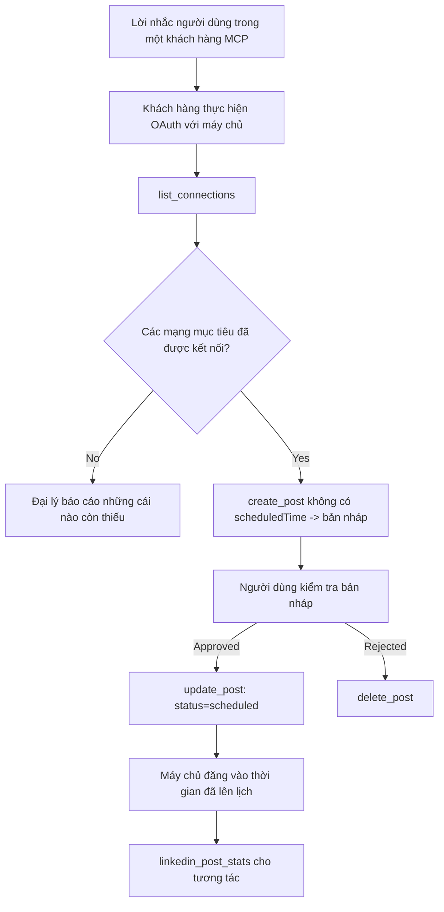

# Nghiên cứu trường hợp: Đăng lên mạng xã hội từ một Đại lý với máy chủ MCP từ xa

> **Tuyên bố từ chối trách nhiệm:** Có nhiều dịch vụ và dự án mã nguồn mở có thể đăng lên mạng xã hội, và một nhóm cũng có thể tích hợp trực tiếp API của từng mạng. Kịch bản dưới đây được cung cấp như một ví dụ thao tác về cách một **máy chủ MCP từ xa có khả năng ghi** có thể được thiết kế và sử dụng. Publora là một dịch vụ thương mại với một tầng miễn phí; các mẫu mô tả ở đây áp dụng cho bất kỳ máy chủ MCP nào thực hiện các hành động không thể đảo ngược thay mặt người dùng.

## Tổng quan

Đại lý giỏi trong việc soạn thảo nội dung nhưng kém trong việc phân phối nó. Một mô hình có thể viết thông báo phát hành trong vài giây, rồi công việc dừng lại: đăng tải có nghĩa là một API cho mỗi mạng, một ứng dụng OAuth cho mỗi mạng và một bộ quy tắc truyền thông khác nhau cho từng mạng. Hầu hết các nhóm giải quyết vấn đề này bằng cách sao chép văn bản vào trình duyệt thủ công.

Nghiên cứu trường hợp này xem xét cách bước cuối cùng đó được kết thúc với một máy chủ MCP từ xa duy nhất, và — hữu ích hơn cho bất cứ ai xây dựng — các quyết định thiết kế mà một máy chủ **có khả năng ghi** phải làm đúng. Đọc dữ liệu thì dễ tha thứ. Đăng thì không: một lời gọi công cụ sai có thể thấy được với khán giả và không thể hoàn tác.

## Kịch bản

Một nhóm quan hệ nhà phát triển nhỏ soạn thảo bài đăng bên trong một đại lý (Claude, VS Code, Cursor — phía khách hàng không quan trọng). Họ muốn đại lý có thể:

- xem những tài khoản mạng xã hội mà nhóm đã kết nối,
- soạn thảo bài đăng và giữ nó như một bản nháp để con người phê duyệt,
- đính kèm hình ảnh,
- lên lịch đăng vào các mạng xã hội vào thời điểm được chọn,
- và sau đó báo cáo hiệu quả của nó.

Quan trọng là, họ muốn đại lý *không thể* đăng tải một cách vô tình trong khi họ vẫn đang thử nghiệm.

## Công cụ sử dụng

- [Máy chủ MCP Publora](https://github.com/publora/mcp-server) — một máy chủ MCP từ xa (`streamable-http`) cung cấp các công cụ đăng tải, lên lịch, truyền thông và phân tích LinkedIn. Đăng ký trong danh mục MCP chính thức với tên `com.publora/mcp-server`.

## Quy trình làm việc từng bước

1. **Kết nối máy chủ.** Các khách hàng dùng OAuth hoàn thành luồng mã ủy quyền với PKCE thông qua màn hình cho phép của máy chủ; các khách hàng không hỗ trợ, như CLI không đầu, dùng khóa API Publora trong header. Cả hai cách đều được hỗ trợ, và bạn có cách nào là do phía khách hàng quyết định, không phải máy chủ.
2. **Liệt kê kết nối.** Đại lý gọi `list_connections` và nhận về các tài khoản đã kết nối cùng định danh.
3. **Soạn thảo.** Đại lý gọi `create_post` *không có* thời gian lên lịch. Bài đăng được lưu dưới dạng nháp — không có gì được đăng.
4. **Đính kèm phương tiện.** URL ảnh công khai được gửi trong cùng một lần gọi; máy chủ tải xuống và kiểm tra hợp lệ.
5. **Lên lịch.** Sau khi con người phê duyệt, `update_post` cập nhật trạng thái thành đã lên lịch với thời gian theo chuẩn ISO 8601.
6. **Đo lường.** Đối với LinkedIn, `linkedin_post_stats` trả về tương tác sau khi bài đăng được công khai.

## Ví dụ gợi ý

```text
Which social accounts do I have connected?
Draft a post announcing our new changelog page, attach the screenshot at
https://example.com/changelog.png, and keep it as a draft — do not publish it.
Once I approve, schedule it to LinkedIn and Bluesky for tomorrow at 09:00 UTC.
```

## Biểu đồ luồng Mermaid



## Triển khai kỹ thuật

Những bài học dưới đây là phần có thể chuyển giao của nghiên cứu trường hợp này.

### Khám phá mở, thực thi có xác thực

`tools/list` được phục vụ không cần chứng thực; mọi `tools/call` yêu cầu token và nếu không trả về `401` kèm header `WWW-Authenticate` chỉ ra metadata tài nguyên được bảo vệ. (Máy chủ cũng trả lời `initialize` không xác thực, chỉ quan trọng với khách hàng dùng các phiên bản giao thức trước `2026-07-28`; lần sửa đổi đó đã loại bỏ hoàn toàn handshake.)

Sự phân chia này quan trọng trong thực tế. Các danh mục, thư mục và khách hàng có thể xem xét bề mặt công cụ — tên, sơ đồ, chú giải — mà không cần giữ bí mật, trong khi không có gì có thể *thực thi* ẩn danh. Máy chủ yêu cầu token cho `initialize` gần như vô hình với công cụ; máy chủ cho phép `tools/call` ẩn danh là một rủi ro.

### Đăng ký: đăng ký khách hàng động, và thay thế nó là gì

Máy chủ quảng bá `/.well-known/oauth-protected-resource` và `/.well-known/oauth-authorization-server`, và hỗ trợ luồng mã ủy quyền với PKCE (`S256`), token làm mới, và **đăng ký khách hàng động**.

Đăng ký động loại bỏ bước thủ công: nếu không có nó, mỗi khách hàng cần một `client_id` cấp trước, nghĩa là phải gửi yêu cầu qua kênh ngoài với nhà cung cấp cho mỗi khách hàng mới.

Hãy coi đây là hành vi tương thích chứ không phải một thiết kế để sao chép. Lần sửa đổi `2026-07-28` của đặc tả loại bỏ đăng ký khách hàng động để chuyển sang Tài liệu Metadata ID Khách hàng, nơi khách hàng giữ tài liệu metadata tại một URL HTTPS ổn định và URL đó *là* `client_id`. DCR vẫn còn hoạt động hiện nay, nhưng máy chủ xây dựng hôm nay nên lên kế hoạch cho CIMD và giữ lại DCR chỉ cho khách hàng cũ.

### Chú giải công cụ không phải trang trí

Mỗi công cụ mang theo `title` và các gợi ý áp dụng: `readOnlyHint`, `destructiveHint`, `idempotentHint`, `openWorldHint`.

Hai lý do để đầu tư vào chúng. Trước tiên, khách hàng dùng gợi ý để quyết định điều gì cần xác nhận với người dùng — khách hàng có thể tự động chạy tra cứu chỉ đọc và dừng lại chờ phê duyệt trước khi xóa. Đặc tả rõ ràng chú giải chỉ là gợi ý không tin cậy, không phải cơ chế phân quyền: chúng định hình những gì khách hàng đề nghị làm, không ngăn gì ở máy chủ, và máy chủ vẫn phải thi hành luật riêng. Thứ hai, các thư mục kết nối lớn hiện *bắt buộc* có chúng để duyệt; máy chủ không có tiêu đề và gợi ý sẽ bị trả lại dù làm việc tốt đến đâu.

### Làm cho định danh không thể đoán trước

Định danh nền tảng là các chuỗi mờ do `list_connections` trả về, và mô tả sơ đồ nói rõ chúng phải được sao chép chính xác và không bao giờ đoán. Máy chủ từ chối mọi thứ khác.

Mô hình rất giỏi đoán mò. Bất kỳ máy chủ có khả năng ghi nào cũng nên giả định định danh sẽ bị tạo ảo giác và khiến đường đi đó thất bại rõ ràng và sớm, thay vì hành động dựa trên giá trị trông có vẻ hợp lý.

### Thất bại trước khi đăng, với thông điệp hành động

Một số mạng từ chối bài đăng chỉ có văn bản và yêu cầu phải có hình ảnh hoặc video. Điều này được kiểm tra khi bài đăng được lên lịch, và lỗi chỉ rõ nền tảng và yêu cầu thiếu.

Đại lý có thể phục hồi từ "Instagram yêu cầu phương tiện — đính kèm hình hoặc video" mà không cần vòng lặp đi lại nữa. Nó không thể phục hồi từ lỗi `400` chung chung.

### Làm cho thử lại an toàn

Hai công cụ tạo nội dung, `create_post` và `update_post`, chấp nhận khóa hiệu đếm (idempotency key): sử dụng lại nó với yêu cầu giống hệt sẽ trả lại phản hồi gốc thay vì tạo bài đăng thứ hai. Môi trường thời gian chạy của đại lý thử lại khi hết thời gian; không có tính hiệu đếm, phản hồi chậm trở thành đăng bài trùng lặp. Các công cụ ghi khác — xóa, xử lý phương tiện, phản ứng và bình luận LinkedIn — không dùng khóa đó, nên thử lại ở đó không tự động an toàn. Cần biết rõ thao tác của mình được bảo vệ thế nào.

### Cung cấp cách kiểm tra mà không đăng gì cả

Máy chủ chấp nhận mục tiêu dành riêng, `publora-playground`, được kiểm tra và xác nhận như đích thực sự rồi bị loại bỏ — không gì đến tài khoản thật. Nó được mô tả trong sơ đồ công cụ, mọi khách hàng đều có thể đọc không cần chứng thực: trường `platforms` trong `create_post` mô tả nó là "một mục tiêu kiểm tra kết nối không cần kết nối thật — bài đăng được xác nhận và loại bỏ, không đăng gì cả". Gọi nó bằng cách truyền nó làm phần tử duy nhất: `platforms: ["publora-playground"]`.

Điều này hóa ra là một trong những chi tiết hữu ích nhất trong toàn bộ bề mặt. Người duyệt thư mục kết nối, người đóng góp và CI có thể thử toàn bộ đường đi ghi từ đầu đến cuối mà không rủi ro cho khán giả thật. Bất kỳ máy chủ MCP nào có hành động không đảo ngược đều được lợi từ mục tiêu không hoạt động có tài liệu.

## Kết quả và tác động

- Bước đăng tải chuyển từ trình duyệt sang cuộc trò chuyện cùng nơi viết nội dung, và thói quen ưu tiên bản nháp giữ người thật trong chu trình. Hãy chính xác về điều đó: một bản nháp là quy ước, không phải ranh giới. Cùng một chứng thực có thể lên lịch hoặc đăng, nên ai cần cửa phê duyệt thật sự phải thực thi ở ngoài bề mặt công cụ — chứng thực riêng, hoặc lớp chính sách phía trước máy chủ.
- Sự khác biệt trên từng mạng — yêu cầu truyền thông, xâu chuỗi, điều khiển trả lời — được xử lý một lần ở máy chủ thay vì mỗi đại lý giao tiếp với nó.
- Cùng một máy chủ hỗ trợ nhiều khách hàng MCP mà không cần làm riêng từng khách hàng, vì khám phá mở và đăng ký động.
- Các ràng buộc thiết kế trên được hình thành bởi đánh giá thư mục kết nối cũng như người dùng: chú giải, OAuth và mục tiêu thử an toàn đều được ít nhất một trong số họ yêu cầu.

## Tài liệu tham khảo

- [Máy chủ MCP Publora (mã nguồn)](https://github.com/publora/mcp-server)
- [Tài liệu API và MCP Publora](https://docs.publora.com)
- [Mục đăng ký MCP: `com.publora/mcp-server`](https://registry.modelcontextprotocol.io/v0/servers?search=com.publora/mcp-server)
- [Đặc tả MCP — Phân quyền](https://modelcontextprotocol.io/specification/draft/basic/authorization)
- [Đặc tả MCP — Chú giải công cụ](https://modelcontextprotocol.io/docs/concepts/tools)

## Tiếp theo là gì

- Lấy một máy chủ MCP bạn đang xây dựng và kiểm tra ba cải tiến có chi phí thấp nhất ở đây: chú giải trên mỗi công cụ, khóa hiệu đếm trên mỗi thao tác ghi, và mục tiêu không hoạt động có tài liệu.
- Thử phân chia khám phá mở: gọi `tools/list` tới máy chủ từ xa công khai không cần chứng thực, rồi gọi một công cụ và quan sát thách thức `401`.
- Cân nhắc "hoàn tác" nghĩa là gì trong lĩnh vực bạn. Đăng tải có nháp và xóa; nếu hành động của bạn không có tương đương, xác nhận thuộc thiết kế công cụ, không phải gợi ý.

---

<!-- CO-OP TRANSLATOR DISCLAIMER START -->
**Tuyên bố miễn trừ trách nhiệm**:
Tài liệu này đã được dịch bằng dịch vụ dịch thuật AI [Co-op Translator](https://github.com/Azure/co-op-translator). Mặc dù chúng tôi cố gắng đảm bảo độ chính xác, xin lưu ý rằng bản dịch tự động có thể chứa lỗi hoặc sai sót. Tài liệu gốc bằng ngôn ngữ gốc nên được coi là nguồn tin chính thức. Đối với thông tin quan trọng, nên sử dụng dịch vụ dịch thuật chuyên nghiệp bởi con người. Chúng tôi không chịu trách nhiệm về bất kỳ hiểu lầm hoặc giải thích sai nào phát sinh từ việc sử dụng bản dịch này.
<!-- CO-OP TRANSLATOR DISCLAIMER END -->