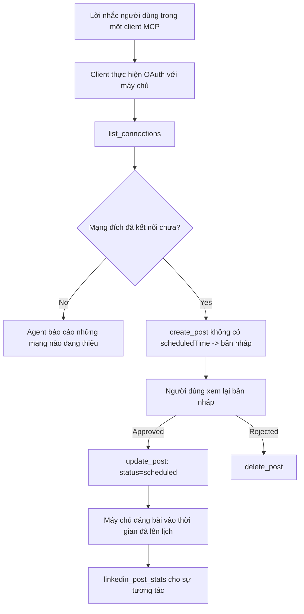

# Nghiên cứu trường hợp: Đăng bài lên mạng xã hội từ một Agent với máy chủ MCP từ xa

> **Lời từ chối trách nhiệm:** Có nhiều dịch vụ và dự án mã nguồn mở có thể đăng bài lên mạng xã hội, và một nhóm cũng có thể tích hợp trực tiếp API của từng mạng xã hội. Kịch bản dưới đây được cung cấp như một ví dụ cụ thể về cách một **máy chủ MCP từ xa có khả năng ghi** có thể được thiết kế và sử dụng. Publora là một dịch vụ thương mại có gói miễn phí; các mô hình được mô tả ở đây áp dụng cho bất kỳ máy chủ MCP nào thực hiện các hành động không thể đảo ngược thay mặt người dùng.

## Tổng quan

Agent có thế mạnh trong việc soạn thảo nội dung nhưng kém trong việc phát hành. Một mô hình có thể viết một thông báo phát hành trong vài giây, và sau đó công việc dừng lại: việc đăng bài nghĩa là phải có một API cho mỗi mạng xã hội, một ứng dụng OAuth cho mỗi mạng, và một bộ quy tắc về phương tiện khác nhau cho từng mạng. Hầu hết các nhóm giải quyết việc này bằng cách sao chép văn bản thủ công vào trình duyệt.

Nghiên cứu trường hợp này xem xét cách bước cuối cùng đó được khép lại với một máy chủ MCP từ xa duy nhất, và — hữu ích hơn cho bất kỳ ai xây dựng một máy chủ — các quyết định thiết kế mà một máy chủ **có khả năng ghi** phải làm đúng. Việc đọc dữ liệu thì khoan dung. Việc đăng bài thì không: một lệnh gọi nhầm tới công cụ sẽ hiển thị với khán giả và không thể hoàn tác.

## Kịch bản

Một nhóm nhỏ mảng quan hệ nhà phát triển soạn thảo bài đăng bên trong một agent (Claude, VS Code, Cursor — client không quan trọng). Họ muốn agent:

- xem tài khoản mạng xã hội nào mà nhóm đã kết nối,
- soạn bài đăng và giữ dưới dạng bản nháp để người dùng phê duyệt,
- đính kèm một hình ảnh,
- lên lịch đăng cho một số mạng xã hội vào thời gian đã chọn,
- và sau đó báo cáo hiệu suất.

Quan trọng là họ muốn agent *không thể* đăng bài một cách vô tình trong khi họ vẫn đang thử nghiệm.

## Công cụ sử dụng

- [Publora MCP Server](https://github.com/publora/mcp-server) — một máy chủ MCP từ xa (`streamable-http`) cung cấp các công cụ đăng bài, lên lịch, phương tiện và phân tích LinkedIn. Được đăng ký trong danh mục MCP chính thức dưới tên `com.publora/mcp-server`.

## Quy trình từng bước

1. **Kết nối với máy chủ.** Các client dùng OAuth hoàn thành luồng authorization-code với PKCE qua màn hình đồng ý của máy chủ; các client không dùng OAuth, như CLI không có giao diện, sử dụng khoá API Publora trong header. Cả hai cách đều được hỗ trợ, việc dùng cách nào phụ thuộc vào client, không phải máy chủ.
2. **Liệt kê kết nối.** Agent gọi `list_connections` và nhận về các tài khoản đã kết nối cùng định danh của chúng.
3. **Soạn thảo.** Agent gọi `create_post` *không kèm* thời gian lên lịch. Bài đăng được lưu dưới dạng bản nháp — chưa có gì được đăng.
4. **Đính kèm phương tiện.** URL ảnh công khai được đưa trong cùng gọi; máy chủ tải về và xác thực chúng.
5. **Lên lịch.** Sau khi con người phê duyệt, `update_post` đặt trạng thái thành đã lên lịch với thời gian theo chuẩn ISO 8601.
6. **Đo lường.** Với LinkedIn, `linkedin_post_stats` trả về số liệu tương tác khi bài đăng được phát hành.

## Ví dụ Prompt

```text
Which social accounts do I have connected?
Draft a post announcing our new changelog page, attach the screenshot at
https://example.com/changelog.png, and keep it as a draft — do not publish it.
Once I approve, schedule it to LinkedIn and Bluesky for tomorrow at 09:00 UTC.
```

## Sơ đồ Mermaid



## Triển khai kỹ thuật

Những bài học dưới đây là phần có thể áp dụng được từ nghiên cứu trường hợp này.

### Khám phá mở, thực thi có xác thực

`tools/list` được phục vụ mà không cần chứng thực; mọi `tools/call` yêu cầu một token
và nếu không có thì trả về `401` kèm header `WWW-Authenticate` chỉ tới
metadata của tài nguyên được bảo vệ. Endpoint kế thừa của máy chủ cũng trả lời `initialize` không xác thực
cho client trên các phiên bản giao thức trước
`2026-07-28`; client hiện tại không dùng handshake đó.

Sự phân chia đặc trưng cho máy chủ này cho phép các registry, catalog, và client có thể kiểm tra tên công cụ,
sơ đồ và chú thích mà không cần bí mật trong khi ngăn chặn thực thi ẩn danh.
Khám phá mở là một lựa chọn triển khai, không phải yêu cầu MCP; trong một
triển khai được bảo vệ có thể yêu cầu xác thực cho `tools/list`.

### Đăng ký: đăng ký client động và những gì thay thế nó

Máy chủ công bố `/.well-known/oauth-protected-resource` và `/.well-known/oauth-authorization-server`, hỗ trợ luồng authorization-code với PKCE (`S256`), refresh tokens, và **đăng ký client động**.

Đăng ký động loại bỏ bước thủ công cho các client kế thừa: nếu không có nó,
mỗi client cần một `client_id` đã được cấp từ nhà cung cấp.

Xem đây là hành vi tương thích hơn là thiết kế để sao chép. Phiên bản `2026-07-28` của đặc tả bỏ đăng ký client động để ủng hộ Tài liệu Metadata ID Client, nơi client lưu trữ tài liệu metadata tại một URL HTTPS ổn định và URL đó *là* `client_id`. DCR vẫn hoạt động hiện tại, nhưng một máy chủ xây dựng hôm nay nên lên kế hoạch cho CIMD và giữ DCR chỉ cho các client cũ hơn.

### Chú thích công cụ không phải để trang trí

Mỗi công cụ mang theo một `title` và các gợi ý áp dụng: `readOnlyHint`, `destructiveHint`, `idempotentHint`, `openWorldHint`.

Có hai lý do để đầu tư vào chúng. Thứ nhất, client dùng các gợi ý để quyết định phải xác nhận với người dùng gì — client có thể tự động chạy truy vấn chỉ đọc và dừng lại để chờ phê duyệt trước khi xóa. Đặc tả rõ rằng chú thích là gợi ý không tin cậy, không phải cơ chế ủy quyền: chúng định hình những gì client đề xuất làm, không ngăn chặn gì trên máy chủ, và máy chủ vẫn phải thi hành quy tắc riêng. Thứ hai, các thư mục kết nối lớn nay *bắt buộc* chúng cho việc duyệt; máy chủ không có tiêu đề và gợi ý cho công cụ sẽ bị từ chối bất kể hoạt động tốt thế nào.

### Đặt định danh không thể bịa đặt

Định danh nền tảng là chuỗi không minh bạch trả về từ `list_connections`, và mô tả sơ đồ nêu rõ phải sao chép nguyên văn và không bao giờ đoán. Máy chủ từ chối mọi thứ khác.

Mô hình rất giỏi đoán mò. Bất kỳ máy chủ có khả năng ghi nào cũng nên giả định rằng định danh cuối cùng sẽ bị ảo tưởng và làm cho đường đi đó lỗi ngay và rõ, thay vì hành động dựa trên một giá trị có vẻ hợp lý.

### Lỗi trước khi đăng bài, với thông báo có thể xử lý

Một số mạng xã hội từ chối bài đăng chỉ có văn bản và yêu cầu có hình ảnh hay video. Điều này được xác thực khi bài đăng được lên lịch, và lỗi nêu tên nền tảng cũng như yêu cầu bị thiếu.

Agent có thể xử lý lại khi nhận được "Instagram yêu cầu có phương tiện — đính kèm một hình ảnh hay video" mà không cần chuyến đi vòng lại. Nó không thể xử lý lại với lỗi `400` chung chung.

### Làm cho việc thử lại an toàn

Hai công cụ tạo nội dung, `create_post` và `update_post`, chấp nhận một khoá idempotency: tái sử dụng khoá đó với cùng một yêu cầu thì trả lại phản hồi gốc thay vì tạo bài đăng thứ hai. Runtime của agent sẽ thử lại khi hết thời gian chờ; không có idempotency, phản hồi chậm trở thành bài đăng kép. Các công cụ ghi khác — xóa, bước phương tiện, tương tác và bình luận LinkedIn — không có khoá này, nên thử lại không tự động an toàn. Cần biết thao tác chỉnh sửa nào của bạn được bảo vệ và thao tác nào không.

### Cung cấp cách để thử mà không đăng gì

Máy chủ chấp nhận một mục tiêu dành riêng, `publora-playground`, được xác thực và công nhận như một đích thực tế rồi bỏ qua — không có gì đến tài khoản thật. Nó được mô tả trong sơ đồ công cụ, mà client nào cũng có thể đọc không cần chứng thực: trường `platforms` của `create_post` mô tả nó như "một mục tiêu kiểm thử kết nối không cần kết nối thật — bài đăng được công nhận và bỏ qua, không có gì được đăng". Gọi nó bằng cách truyền nó làm mục duy nhất: `platforms: ["publora-playground"]`.

Điều này hóa ra là một trong những chi tiết hữu ích nhất toàn bộ bề mặt. Người xét duyệt thư mục kết nối, người đóng góp và CI có thể chạy toàn bộ đường đi ghi bài từ đầu tới cuối mà không có rủi ro với khán giả thật. Bất kỳ máy chủ MCP nào có hành động không thể đảo ngược đều được lợi từ một mục tiêu không thao tác được tài liệu hóa.

## Kết quả và tác động

- Bước đăng bài được chuyển từ trình duyệt sang cùng cuộc trò chuyện nơi nội dung được soạn, và thói quen ưu tiên bản nháp giữ con người trong vòng lặp. Cần chính xác về cái này: bản nháp là một quy ước, không phải biên giới. Cùng một thông tin đăng nhập có thể lên lịch hoặc đăng bài, nên ai cần cổng phê duyệt thật phải thực thi ngoài bề mặt công cụ — thông tin đăng nhập riêng, hoặc lớp chính sách phía trước máy chủ.
- Sự khác biệt từng mạng — yêu cầu về phương tiện, luồng chủ đề, kiểm soát trả lời — được xử lý một lần trong máy chủ thay vì trong mọi agent gọi tới nó.
- Cùng một máy chủ hỗ trợ nhiều client MCP không cần thông tin đăng nhập cấp trước.
    Client hiện tại có thể dùng Tài liệu Metadata ID Client; DCR vẫn là phương án dự phòng
    cho các client cũ hơn.
- Các ràng buộc thiết kế trên được hình thành bởi xét duyệt thư mục kết nối cũng như người dùng: chú thích, OAuth và mục tiêu thử an toàn đều được ít nhất một trong số họ yêu cầu.

## Tài liệu tham khảo

- [Publora MCP Server (mã nguồn)](https://github.com/publora/mcp-server)
- [Tài liệu Publora API và MCP](https://docs.publora.com)
- [Mục đăng ký MCP: `com.publora/mcp-server`](https://registry.modelcontextprotocol.io/v0/servers?search=com.publora/mcp-server)
- [Đặc tả MCP — Ủy quyền](https://modelcontextprotocol.io/specification/2026-07-28/basic/authorization)
- [Đặc tả MCP — Chú thích công cụ](https://modelcontextprotocol.io/docs/concepts/tools)

## Tiếp theo

- Lấy một máy chủ MCP bạn đang xây dựng và kiểm tra ba cải tiến rẻ nhất ở đây: chú thích trên mọi công cụ, khoá idempotency trên mọi ghi, và mục tiêu không thao tác được có tài liệu.
- Thử phân chia khám phá mở: gọi `tools/list` trên máy chủ từ xa công khai không cần chứng thực, rồi gọi một công cụ và kiểm tra thử thách `401`.
- Xem xét "hoàn tác" nghĩa là gì với lĩnh vực của bạn. Đăng bài có bản nháp và xoá; nếu hành động của bạn không có tương đương, xác nhận nên nằm trong thiết kế công cụ, không nằm trong prompt.

---

<!-- CO-OP TRANSLATOR DISCLAIMER START -->
**Tuyên bố miễn trừ trách nhiệm**:
Tài liệu này đã được dịch bằng dịch vụ dịch thuật AI [Co-op Translator](https://github.com/Azure/co-op-translator). Mặc dù chúng tôi cố gắng đảm bảo độ chính xác, xin lưu ý rằng bản dịch tự động có thể chứa lỗi hoặc sai sót. Tài liệu gốc bằng ngôn ngữ gốc nên được coi là nguồn tin chính thức. Đối với thông tin quan trọng, nên sử dụng dịch vụ dịch thuật chuyên nghiệp bởi con người. Chúng tôi không chịu trách nhiệm về bất kỳ hiểu lầm hoặc giải thích sai nào phát sinh từ việc sử dụng bản dịch này.
<!-- CO-OP TRANSLATOR DISCLAIMER END -->