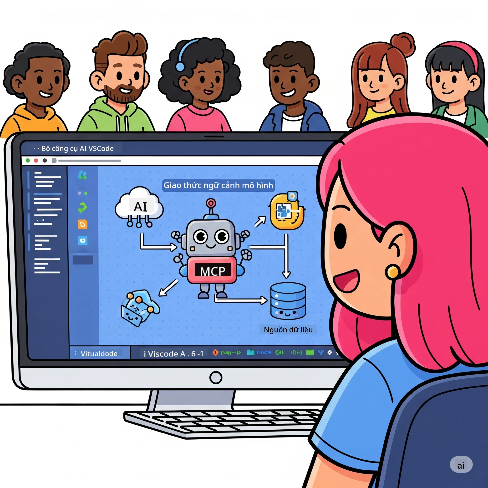
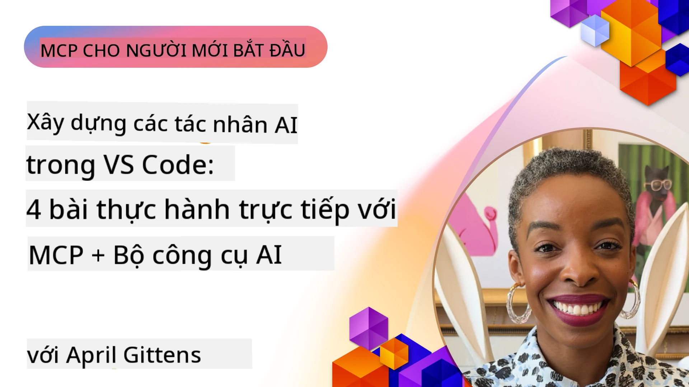

# Tinh giản Quy trình AI: Xây dựng Máy chủ MCP với Bộ công cụ Microsoft Foundry

## 🎯 Tổng quan

_(Nhấn vào hình ảnh trên để xem video bài học này)_

Chào mừng bạn đến với **Hội thảo Model Context Protocol (MCP)**! Hội thảo thực hành toàn diện này kết hợp hai công nghệ tiên tiến để cách mạng hóa phát triển ứng dụng AI:

> **Lưu ý về tương thích:** mã hội thảo được xây dựng và thử nghiệm với MCP
> `2025-11-25`, như được thể hiện trên huy hiệu ở trên. Sử dụng
> [đặc tả `2026-07-28` hiện tại](https://modelcontextprotocol.io/specification/2026-07-28/)
> để triển khai giao thức mới và xem trước ghi chú phát hành SDK trước khi
> di chuyển các phòng thí nghiệm.

- **🔗 Model Context Protocol (MCP)**: Một tiêu chuẩn mở cho tích hợp công cụ AI liền mạch
- **🛠️ Phần mở rộng Microsoft Foundry Toolkit cho VS Code**: Phần mở rộng phát triển AI mạnh mẽ của Microsoft

### 🎓 Bạn sẽ học được gì

Cuối hội thảo, bạn sẽ thành thạo xây dựng các ứng dụng thông minh kết nối các mô hình AI với công cụ và dịch vụ thực tế. Từ kiểm thử tự động đến tích hợp API tùy chỉnh, bạn sẽ có kỹ năng thực tế để giải quyết các thách thức kinh doanh phức tạp.

## 🏗️ Ngăn xếp Công nghệ

### 🔌 Model Context Protocol (MCP)

MCP là **"USB-C cho AI"** - một tiêu chuẩn phổ quát kết nối mô hình AI với các công cụ và nguồn dữ liệu bên ngoài.

**✨ Tính năng chính:**

- 🔄 **Tích hợp Chuẩn hóa**: Giao diện phổ quát cho kết nối công cụ AI
- 🏛️ **Kiến trúc Linh hoạt**: Máy chủ cục bộ & từ xa qua giao thức stdio/SSE
- 🧰 **Hệ sinh thái Phong phú**: Công cụ, prompt, và tài nguyên trong một giao thức
- 🔒 **Sẵn sàng Doanh nghiệp**: Bảo mật và độ tin cậy tích hợp sẵn

**🎯 Vì sao MCP quan trọng:**
Giống như USB-C đã loại bỏ sự rối rắm của cáp, MCP đơn giản hóa sự phức tạp của tích hợp AI. Một giao thức, vô hạn khả năng.

### 🤖 Phần mở rộng Microsoft Foundry Toolkit cho VS Code

Phần mở rộng phát triển AI chủ lực của Microsoft biến VS Code thành trung tâm AI mạnh mẽ.

**🚀 Khả năng cốt lõi:**

- 📦 **Danh mục Mô hình**: Truy cập mô hình từ Azure AI, GitHub, Hugging Face, Ollama
- ⚡ **Suy luận cục bộ**: Thực thi CPU/GPU/NPU tối ưu ONNX
- 🏗️ **Trình tạo Agent**: Phát triển agent AI trực quan với tích hợp MCP
- 🎭 **Đa phương thức**: Hỗ trợ văn bản, thị giác, và đầu ra cấu trúc

**💡 Lợi ích phát triển:**

- Triển khai mô hình không cần cấu hình
- Kỹ thuật prompt trực quan
- Sân chơi kiểm thử thời gian thực
- Tích hợp máy chủ MCP liền mạch

## 📚 Hành trình học tập

### [🚀 Module 1: Cơ bản Microsoft Foundry Toolkit](./lab1/README.md)

**Thời lượng**: 15 phút

- 🛠️ Cài đặt và cấu hình Microsoft Foundry Toolkit cho VS Code
- 🗂️ Khám phá Danh mục Mô hình (100+ mô hình từ GitHub, ONNX, OpenAI, Anthropic, Google)
- 🎮 Thành thạo Sân chơi Tương tác kiểm thử mô hình thời gian thực
- 🤖 Xây dựng agent AI đầu tiên với Trình tạo Agent
- 📊 Đánh giá hiệu suất mô hình với các chỉ số tích hợp (F1, liên quan, tương đồng, mạch lạc)
- ⚡ Học xử lý theo lô và khả năng đa phương thức

**🎯 Kết quả học tập**: Tạo agent AI chức năng với hiểu biết toàn diện về khả năng Microsoft Foundry Toolkit

### [🌐 Module 2: MCP với Cơ bản Microsoft Foundry Toolkit](./lab2/README.md)

**Thời lượng**: 20 phút

- 🧠 Thành thạo kiến trúc và khái niệm Model Context Protocol (MCP)
- 🌐 Khám phá hệ sinh thái máy chủ MCP của Microsoft
- 🤖 Xây dựng agent tự động trình duyệt sử dụng máy chủ MCP Playwright
- 🔧 Tích hợp máy chủ MCP với Trình tạo Agent Microsoft Foundry Toolkit
- 📊 Cấu hình và kiểm thử công cụ MCP trong agent của bạn
- 🚀 Xuất và triển khai agent tích hợp MCP cho sản xuất

**🎯 Kết quả học tập**: Triển khai agent AI được tăng cường với công cụ bên ngoài qua MCP

### [🔧 Module 3: Phát triển MCP Nâng cao với Microsoft Foundry Toolkit](./lab3/README.md)

**Thời lượng**: 20 phút

- 💻 Tạo máy chủ MCP tùy chỉnh bằng Microsoft Foundry Toolkit
- 🐍 Cấu hình và sử dụng SDK Python MCP mới nhất (v1.9.3)
- 🔍 Thiết lập và sử dụng MCP Inspector để gỡ lỗi
- 🛠️ Xây dựng Máy chủ MCP Thời tiết với quy trình gỡ lỗi chuyên nghiệp
- 🧪 Gỡ lỗi máy chủ MCP trong cả môi trường Trình tạo Agent và Inspector

**🎯 Kết quả học tập**: Phát triển và gỡ lỗi máy chủ MCP tùy chỉnh với công cụ hiện đại

### [🐙 Module 4: Phát triển MCP Thực tiễn - Máy chủ GitHub Clone Tùy chỉnh](./lab4/README.md)

**Thời lượng**: 30 phút

- 🏗️ Xây dựng Máy chủ MCP GitHub Clone thực tế cho quy trình phát triển
- 🔄 Triển khai nhân bản kho thông minh với xác thực và xử lý lỗi
- 📁 Tạo quản lý thư mục thông minh và tích hợp VS Code
- 🤖 Sử dụng Chế độ Agent GitHub Copilot với công cụ MCP tùy chỉnh
- 🛡️ Áp dụng độ tin cậy sản xuất và tương thích đa nền tảng

**🎯 Kết quả học tập**: Triển khai máy chủ MCP sẵn sàng sản xuất tinh giản quy trình phát triển thực tế

## 💡 Ứng dụng Thực tế & Tác động

### 🏢 Trường hợp sử dụng Doanh nghiệp

#### 🔄 Tự động hóa DevOps

Chuyển đổi quy trình phát triển của bạn với tự động hóa thông minh:

- **Quản lý Kho thông minh**: Đánh giá và hợp nhất mã bằng AI
- **CI/CD Thông minh**: Tối ưu hóa pipeline tự động dựa trên thay đổi mã
- **Phân loại Lỗi**: Phân loại và phân công lỗi tự động

#### 🧪 Cách mạng Đảm bảo Chất lượng

Nâng cao kiểm thử với tự động hóa AI:

- **Tạo kiểm thử Thông minh**: Tạo bộ kiểm thử toàn diện tự động
- **Kiểm thử Tái hồi trực quan**: Phát hiện thay đổi UI bằng AI
- **Giám sát Hiệu suất**: Phát hiện và xử lý vấn đề chủ động

#### 📊 Tính thông minh Chu trình Dữ liệu

Xây dựng quy trình xử lý dữ liệu thông minh hơn:

- **Quy trình ETL Thích nghi**: Biến đổi dữ liệu tự tối ưu
- **Phát hiện Dị thường**: Giám sát chất lượng dữ liệu theo thời gian thực
- **Định tuyến Thông minh**: Quản lý luồng dữ liệu thông minh

#### 🎧 Nâng cao Trải nghiệm Khách hàng

Tạo trải nghiệm khách hàng xuất sắc:

- **Hỗ trợ Nhận biết ngữ cảnh**: Agent AI truy cập lịch sử khách hàng
- **Giải quyết Vấn đề Chủ động**: Dịch vụ khách hàng dự đoán
- **Tích hợp Đa kênh**: Trải nghiệm AI thống nhất trên các nền tảng

## 🛠️ Yêu cầu & Cài đặt

### 💻 Yêu cầu Hệ thống

| Thành phần | Yêu cầu | Ghi chú |
|-----------|-------------|-------|
| **Hệ điều hành** | Windows 10+, macOS 10.15+, Linux | Bất kỳ hệ điều hành hiện đại nào |
| **Visual Studio Code** | Phiên bản ổn định mới nhất | Cần cho Microsoft Foundry Toolkit |
| **Node.js** | v18.0+ và npm | Dùng cho phát triển máy chủ MCP |
| **Python** | 3.10+ | Tùy chọn cho máy chủ MCP Python |
| **Bộ nhớ** | Tối thiểu 8GB RAM | Khuyến nghị 16GB cho mô hình cục bộ |

### 🔧 Môi trường Phát triển

#### Các phần mở rộng VS Code được khuyến nghị

- **Microsoft Foundry Toolkit** (ms-windows-ai-studio.windows-ai-studio)
- **Python** (ms-python.python)
- **Python Debugger** (ms-python.debugpy)
- **GitHub Copilot** (GitHub.copilot) - Tùy chọn nhưng hữu ích

#### Công cụ Tùy chọn

- **uv**: Trình quản lý gói Python hiện đại
- **MCP Inspector**: Công cụ gỡ lỗi trực quan cho máy chủ MCP
- **Playwright**: Cho các ví dụ tự động hóa web

## 🎖️ Kết quả Học tập & Lộ trình Chứng nhận

### 🏆 Danh sách Thành thạo Kỹ năng

Hoàn thành hội thảo này, bạn sẽ thành thạo:

#### 🎯 Năng lực cốt lõi

- [ ] **Thành thạo Giao thức MCP**: Hiểu sâu kiến trúc và mẫu triển khai
- [ ] **Thành thạo Microsoft Foundry Toolkit**: Sử dụng thành thạo cho phát triển nhanh
- [ ] **Phát triển Máy chủ Tùy chỉnh**: Xây dựng, triển khai và duy trì máy chủ MCP sản xuất
- [ ] **Tích hợp Công cụ Xuất sắc**: Kết nối AI với quy trình phát triển hiện có liền mạch
- [ ] **Ứng dụng Giải quyết Vấn đề**: Áp dụng kỹ năng đã học vào thách thức kinh doanh thực tế

#### 🔧 Kỹ năng Kỹ thuật

- [ ] Cài đặt và cấu hình Microsoft Foundry Toolkit trong VS Code
- [ ] Thiết kế và triển khai máy chủ MCP tùy chỉnh
- [ ] Tích hợp Mô hình GitHub với kiến trúc MCP
- [ ] Xây dựng quy trình kiểm thử tự động với Playwright
- [ ] Triển khai agent AI cho sử dụng sản xuất
- [ ] Gỡ lỗi và tối ưu hiệu năng máy chủ MCP

#### 🚀 Khả năng Nâng cao

- [ ] Kiến trúc tích hợp AI quy mô doanh nghiệp
- [ ] Triển khai thực hành bảo mật tốt nhất cho ứng dụng AI
- [ ] Thiết kế kiến trúc máy chủ MCP mở rộng
- [ ] Tạo chuỗi công cụ tùy chỉnh cho lĩnh vực cụ thể
- [ ] Hướng dẫn người khác phát triển AI nguyên sinh

## 📖 Tài nguyên Bổ sung

- [MCP Specification (2026-07-28)](https://modelcontextprotocol.io/specification/2026-07-28/)
- [Microsoft Foundry Toolkit GitHub Repository](https://github.com/microsoft/vscode-ai-toolkit)
- [Sample MCP Servers Collection](https://github.com/modelcontextprotocol/servers)
- [Best Practices Guide](https://modelcontextprotocol.io/docs/best-practices)
- [OWASP MCP Top 10](https://microsoft.github.io/mcp-azure-security-guide/mcp/) - Thực hành bảo mật tốt nhất

---

**🚀 Sẵn sàng cách mạng hóa quy trình phát triển AI của bạn?**

Cùng xây dựng tương lai ứng dụng thông minh với MCP và Microsoft Foundry Toolkit!

## Tiếp theo là gì

Tiếp tục đến: [Module 11: Các phòng thí nghiệm thực hành máy chủ MCP](../11-MCPServerHandsOnLabs/README.md)

---

<!-- CO-OP TRANSLATOR DISCLAIMER START -->
**Tuyên bố miễn trừ trách nhiệm**:
Tài liệu này đã được dịch bằng dịch vụ dịch thuật AI [Co-op Translator](https://github.com/Azure/co-op-translator). Mặc dù chúng tôi cố gắng đảm bảo độ chính xác, xin lưu ý rằng bản dịch tự động có thể chứa lỗi hoặc sai sót. Tài liệu gốc bằng ngôn ngữ gốc nên được coi là nguồn tin chính thức. Đối với thông tin quan trọng, nên sử dụng dịch vụ dịch thuật chuyên nghiệp bởi con người. Chúng tôi không chịu trách nhiệm về bất kỳ hiểu lầm hoặc giải thích sai nào phát sinh từ việc sử dụng bản dịch này.
<!-- CO-OP TRANSLATOR DISCLAIMER END -->