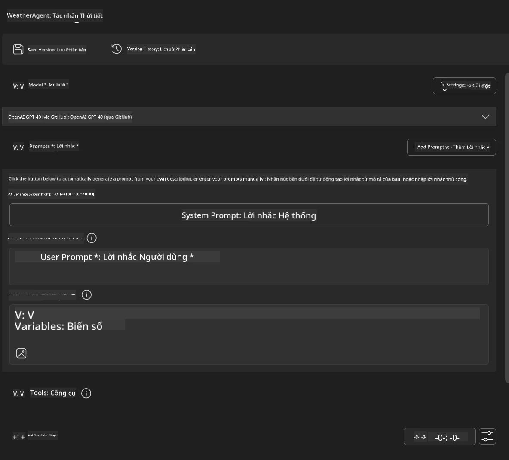
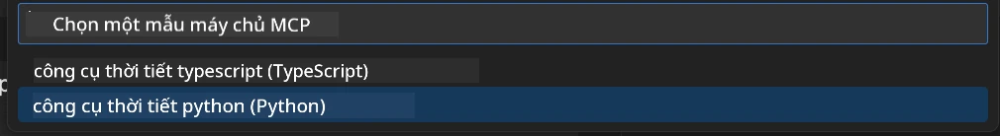
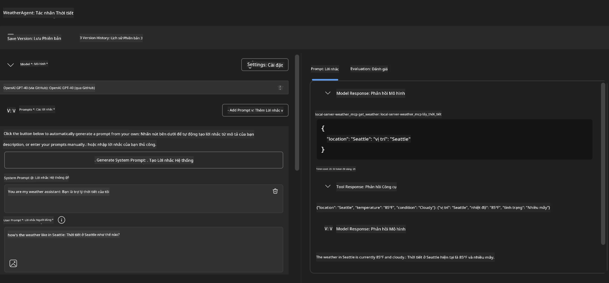
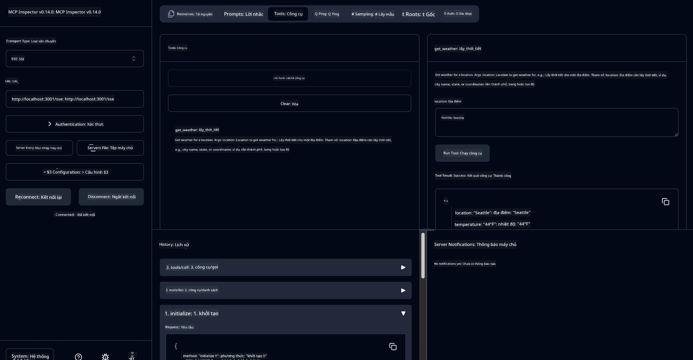

# 🔧 Mô-đun 3: Phát Triển MCP Nâng Cao với Microsoft Foundry Toolkit

> [!NOTE]
> Các URL Inspector trong phòng thí nghiệm này sử dụng điểm cuối `/sse` cũ và nhắm vào
> các phụ thuộc MCP SDK `1.9.3` và Inspector `0.14.0` đã được cố định. Đây không phải là
> ví dụ HTTP Streamable `2026-07-28` hiện tại.


## 🎯 Mục Tiêu Học Tập

Sau khi hoàn thành phòng thí nghiệm này, bạn sẽ có thể:

- ✅ Tạo máy chủ MCP tùy chỉnh sử dụng Microsoft Foundry Toolkit
- ✅ Cấu hình và sử dụng MCP Python SDK mới nhất (v1.9.3)
- ✅ Thiết lập và sử dụng MCP Inspector để gỡ lỗi
- ✅ Gỡ lỗi máy chủ MCP trong cả môi trường Agent Builder và Inspector
- ✅ Hiểu các quy trình phát triển máy chủ MCP nâng cao

## 📋 Yêu Cầu Tiền Đề

- Hoàn thành Lab 2 (Cơ Bản về MCP)
- VS Code với phần mở rộng Microsoft Foundry Toolkit đã cài đặt
- Môi trường Python 3.10+
- Node.js và npm để thiết lập Inspector

## 🏗️ Bạn Sẽ Xây Dựng Gì

Trong phòng thí nghiệm này, bạn sẽ tạo một **Weather MCP Server** minh họa:
- Triển khai máy chủ MCP tùy chỉnh
- Tích hợp với Microsoft Foundry Toolkit Agent Builder
- Quy trình gỡ lỗi chuyên nghiệp
- Các mẫu sử dụng MCP SDK hiện đại

---

## 🔧 Tổng Quan Các Thành Phần Chính

### 🐍 MCP Python SDK
MCP Python SDK cung cấp nền tảng để xây dựng các máy chủ MCP tùy chỉnh. Bạn sẽ dùng phiên bản 1.9.3 với các tính năng gỡ lỗi nâng cao.

### 🔍 MCP Inspector
Một công cụ gỡ lỗi mạnh mẽ cung cấp:
- Giám sát máy chủ thời gian thực
- Trực quan hóa việc thực thi công cụ
- Kiểm tra yêu cầu/phản hồi mạng
- Môi trường thử nghiệm tương tác

---

## 📖 Triển Khai Từng Bước

### Bước 1: Tạo WeatherAgent trong Agent Builder

1. **Khởi chạy Agent Builder** trong VS Code thông qua phần mở rộng Microsoft Foundry Toolkit
2. **Tạo một agent mới** với cấu hình sau:
   - Tên agent: `WeatherAgent`



### Bước 2: Khởi Tạo Dự Án MCP Server

1. **Đi đến Tools** → **Add Tool** trong Agent Builder
2. **Chọn "MCP Server"** từ các tùy chọn có sẵn
3. **Chọn "Create A new MCP Server"**
4. **Chọn mẫu `python-weather`**
5. **Đặt tên cho server của bạn:** `weather_mcp`



### Bước 3: Mở và Xem Xét Dự Án

1. **Mở dự án đã tạo** trong VS Code
2. **Xem cấu trúc dự án:**
   ```
   weather_mcp/
   ├── src/
   │   ├── __init__.py
   │   └── server.py
   ├── inspector/
   │   ├── package.json
   │   └── package-lock.json
   ├── .vscode/
   │   ├── launch.json
   │   └── tasks.json
   ├── pyproject.toml
   └── README.md
   ```

### Bước 4: Nâng Cấp Lên MCP SDK Mới Nhất

> **🔍 Tại Sao Nâng Cấp?** Chúng ta muốn dùng MCP SDK mới nhất (v1.9.3) và dịch vụ Inspector (0.14.0) để có các tính năng nâng cao và khả năng gỡ lỗi tốt hơn.

#### 4a. Cập Nhật Phụ Thuộc Python

**Chỉnh sửa `pyproject.toml`:** cập nhật [./code/weather_mcp/pyproject.toml](../../../../10-StreamliningAIWorkflowsBuildingAnMCPServerWithAIToolkit/lab3/code/weather_mcp/pyproject.toml)


#### 4b. Cập Nhật Cấu Hình Inspector

**Chỉnh sửa `inspector/package.json`:** cập nhật [./code/weather_mcp/inspector/package.json](../../../../10-StreamliningAIWorkflowsBuildingAnMCPServerWithAIToolkit/lab3/code/weather_mcp/inspector/package.json)

#### 4c. Cập Nhật Phụ Thuộc Inspector

**Chỉnh sửa `inspector/package-lock.json`:** cập nhật [./code/weather_mcp/inspector/package-lock.json](../../../../10-StreamliningAIWorkflowsBuildingAnMCPServerWithAIToolkit/lab3/code/weather_mcp/inspector/package-lock.json)

> **📝 Lưu Ý:** Tệp này chứa định nghĩa phụ thuộc rộng lớn. Dưới đây là cấu trúc thiết yếu - nội dung đầy đủ đảm bảo việc xác định phụ thuộc chính xác.


> **⚡ Toàn Bộ Package Lock:** Tệp package-lock.json đầy đủ chứa ~3000 dòng định nghĩa phụ thuộc. Mẫu trên thể hiện cấu trúc chính - hãy dùng tệp được cung cấp để giải quyết phụ thuộc hoàn chỉnh.

### Bước 5: Cấu Hình Gỡ Lỗi VS Code

*Lưu ý: Vui lòng sao chép tệp trong đường dẫn chỉ định để thay thế tệp tương ứng ở máy local*

#### 5a. Cập Nhật Cấu Hình Khởi Chạy

**Chỉnh sửa `.vscode/launch.json`:**

```json
{
  "version": "0.2.0",
  "configurations": [
    {
      "name": "Attach to Local MCP",
      "type": "debugpy",
      "request": "attach",
      "connect": {
        "host": "localhost",
        "port": 5678
      },
      "presentation": {
        "hidden": true
      },
      "internalConsoleOptions": "neverOpen",
      "postDebugTask": "Terminate All Tasks"
    },
    {
      "name": "Launch Inspector (Edge)",
      "type": "msedge",
      "request": "launch",
      "url": "http://localhost:6274?timeout=60000&serverUrl=http://localhost:3001/sse#tools",
      "cascadeTerminateToConfigurations": [
        "Attach to Local MCP"
      ],
      "presentation": {
        "hidden": true
      },
      "internalConsoleOptions": "neverOpen"
    },
    {
      "name": "Launch Inspector (Chrome)",
      "type": "chrome",
      "request": "launch",
      "url": "http://localhost:6274?timeout=60000&serverUrl=http://localhost:3001/sse#tools",
      "cascadeTerminateToConfigurations": [
        "Attach to Local MCP"
      ],
      "presentation": {
        "hidden": true
      },
      "internalConsoleOptions": "neverOpen"
    }
  ],
  "compounds": [
    {
      "name": "Debug in Agent Builder",
      "configurations": [
        "Attach to Local MCP"
      ],
      "preLaunchTask": "Open Agent Builder",
    },
    {
      "name": "Debug in Inspector (Edge)",
      "configurations": [
        "Launch Inspector (Edge)",
        "Attach to Local MCP"
      ],
      "preLaunchTask": "Start MCP Inspector",
      "stopAll": true
    },
    {
      "name": "Debug in Inspector (Chrome)",
      "configurations": [
        "Launch Inspector (Chrome)",
        "Attach to Local MCP"
      ],
      "preLaunchTask": "Start MCP Inspector",
      "stopAll": true
    }
  ]
}
```

**Chỉnh sửa `.vscode/tasks.json`:**

```
{
  "version": "2.0.0",
  "tasks": [
    {
      "label": "Start MCP Server",
      "type": "shell",
      "command": "python -m debugpy --listen 127.0.0.1:5678 src/__init__.py sse",
      "isBackground": true,
      "options": {
        "cwd": "${workspaceFolder}",
        "env": {
          "PORT": "3001"
        }
      },
      "problemMatcher": {
        "pattern": [
          {
            "regexp": "^.*$",
            "file": 0,
            "location": 1,
            "message": 2
          }
        ],
        "background": {
          "activeOnStart": true,
          "beginsPattern": ".*",
          "endsPattern": "Application startup complete|running"
        }
      }
    },
    {
      "label": "Start MCP Inspector",
      "type": "shell",
      "command": "npm run dev:inspector",
      "isBackground": true,
      "options": {
        "cwd": "${workspaceFolder}/inspector",
        "env": {
          "CLIENT_PORT": "6274",
          "SERVER_PORT": "6277",
        }
      },
      "problemMatcher": {
        "pattern": [
          {
            "regexp": "^.*$",
            "file": 0,
            "location": 1,
            "message": 2
          }
        ],
        "background": {
          "activeOnStart": true,
          "beginsPattern": "Starting MCP inspector",
          "endsPattern": "Proxy server listening on port"
        }
      },
      "dependsOn": [
        "Start MCP Server"
      ]
    },
    {
      "label": "Open Agent Builder",
      "type": "shell",
      "command": "echo ${input:openAgentBuilder}",
      "presentation": {
        "reveal": "never"
      },
      "dependsOn": [
        "Start MCP Server"
      ],
    },
    {
      "label": "Terminate All Tasks",
      "command": "echo ${input:terminate}",
      "type": "shell",
      "problemMatcher": []
    }
  ],
  "inputs": [
    {
      "id": "openAgentBuilder",
      "type": "command",
      "command": "ai-mlstudio.agentBuilder",
      "args": {
        "initialMCPs": [ "local-server-weather_mcp" ],
        "triggeredFrom": "vsc-tasks"
      }
    },
    {
      "id": "terminate",
      "type": "command",
      "command": "workbench.action.tasks.terminate",
      "args": "terminateAll"
    }
  ]
}
```


---

## 🚀 Chạy và Kiểm Tra MCP Server Của Bạn

### Bước 6: Cài Đặt Phụ Thuộc

Sau khi thực hiện các thay đổi cấu hình, chạy các lệnh sau:

**Cài đặt phụ thuộc Python:**
```bash
uv sync
```

**Cài đặt phụ thuộc Inspector:**
```bash
cd inspector
npm install
```

### Bước 7: Gỡ Lỗi với Agent Builder

1. **Nhấn F5** hoặc dùng cấu hình **"Debug in Agent Builder"**
2. **Chọn cấu hình tổng hợp** từ bảng điều khiển debug
3. **Chờ server khởi động** và Agent Builder mở ra
4. **Thử nghiệm weather MCP server của bạn** với các truy vấn ngôn ngữ tự nhiên

Nhập lời nhắc như sau

SYSTEM_PROMPT

```
You are my weather assistant
```

USER_PROMPT

```
How's the weather like in Seattle
```



### Bước 8: Gỡ Lỗi với MCP Inspector

1. **Dùng cấu hình "Debug in Inspector"** (Edge hoặc Chrome)
2. **Mở giao diện Inspector** tại `http://localhost:6274`
3. **Khám phá môi trường thử nghiệm tương tác:**
   - Xem các công cụ có sẵn
   - Thử nghiệm thực thi công cụ
   - Giám sát yêu cầu mạng
   - Gỡ lỗi các phản hồi máy chủ



---

## 🎯 Kết Quả Học Tập Chính

Qua việc hoàn thành phòng thí nghiệm này, bạn đã:

- [x] **Tạo máy chủ MCP tùy chỉnh** sử dụng các mẫu Microsoft Foundry Toolkit
- [x] **Nâng cấp lên MCP SDK mới nhất** (v1.9.3) để cải thiện chức năng
- [x] **Cấu hình quy trình gỡ lỗi chuyên nghiệp** cho cả Agent Builder và Inspector
- [x] **Thiết lập MCP Inspector** để thử nghiệm máy chủ tương tác
- [x] **Thành thạo các cấu hình gỡ lỗi VS Code** cho phát triển MCP

## 🔧 Các Tính Năng Nâng Cao Đã Khám Phá

| Tính Năng | Mô Tả | Trường Hợp Sử Dụng |
|---------|-------------|----------|
| **MCP Python SDK v1.9.3** | Triển khai giao thức mới nhất | Phát triển máy chủ hiện đại |
| **MCP Inspector 0.14.0** | Công cụ gỡ lỗi tương tác | Thử nghiệm máy chủ thời gian thực |
| **Gỡ lỗi VS Code** | Môi trường phát triển tích hợp | Quy trình gỡ lỗi chuyên nghiệp |
| **Tích hợp Agent Builder** | Kết nối trực tiếp Microsoft Foundry Toolkit | Thử nghiệm agent trọn gói |

## 📚 Tài Nguyên Bổ Sung

- [Tài liệu MCP Python SDK](https://modelcontextprotocol.io/docs/sdk/python)
- [Hướng dẫn phần mở rộng Microsoft Foundry Toolkit](https://code.visualstudio.com/docs/ai/ai-toolkit)
- [Tài liệu gỡ lỗi VS Code](https://code.visualstudio.com/docs/editor/debugging)
- [Thông số kỹ thuật Model Context Protocol](https://modelcontextprotocol.io/docs/concepts/architecture)

---

**🎉 Chúc Mừng!** Bạn đã hoàn thành thành công Lab 3 và giờ có thể tạo, gỡ lỗi và triển khai các máy chủ MCP tùy chỉnh theo quy trình phát triển chuyên nghiệp.

### 🔜 Tiếp Tục Sang Mô-đun Kế Tiếp

Sẵn sàng áp dụng kỹ năng MCP vào quy trình phát triển thực tế? Hãy chuyển sang **[Mô-đun 4: Phát Triển MCP Thực Tế - Máy Chủ Clone GitHub Tùy Chỉnh](../lab4/README.md)**, nơi bạn sẽ:
- Xây dựng máy chủ MCP chuẩn bị cho sản xuất tự động hóa thao tác repo GitHub
- Thực hiện chức năng clone repo GitHub qua MCP
- Tích hợp các máy chủ MCP tùy chỉnh với VS Code và GitHub Copilot Agent Mode
- Kiểm tra và triển khai các máy chủ MCP tùy chỉnh trong môi trường sản xuất
- Học quy trình tự động hóa thực tế cho nhà phát triển

---

<!-- CO-OP TRANSLATOR DISCLAIMER START -->
**Tuyên bố miễn trừ trách nhiệm**:
Tài liệu này đã được dịch bằng dịch vụ dịch thuật AI [Co-op Translator](https://github.com/Azure/co-op-translator). Mặc dù chúng tôi cố gắng đảm bảo độ chính xác, xin lưu ý rằng bản dịch tự động có thể chứa lỗi hoặc sai sót. Tài liệu gốc bằng ngôn ngữ gốc nên được coi là nguồn tin chính thức. Đối với thông tin quan trọng, nên sử dụng dịch vụ dịch thuật chuyên nghiệp bởi con người. Chúng tôi không chịu trách nhiệm về bất kỳ hiểu lầm hoặc giải thích sai nào phát sinh từ việc sử dụng bản dịch này.
<!-- CO-OP TRANSLATOR DISCLAIMER END -->