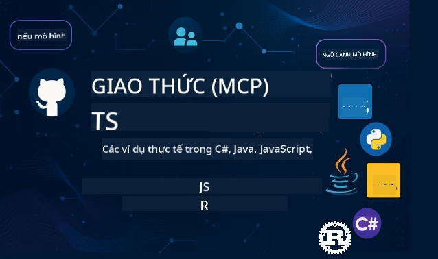

 

[](https://GitHub.com/microsoft/mcp-for-beginners/graphs/contributors)
[](https://GitHub.com/microsoft/mcp-for-beginners/issues)
[](https://GitHub.com/microsoft/mcp-for-beginners/pulls)
[](http://makeapullrequest.com)

[](https://GitHub.com/microsoft/mcp-for-beginners/watchers)
[](https://GitHub.com/microsoft/mcp-for-beginners/fork)
[](https://GitHub.com/microsoft/mcp-for-beginners/stargazers)


[](https://discord.gg/nTYy5BXMWG)

Theo dõi các bước này để bắt đầu sử dụng các tài nguyên này:
1. **Fork Repository**: Bấm vào [](https://GitHub.com/microsoft/mcp-for-beginners/fork)
2. **Clone Repository**:   `git clone https://github.com/microsoft/mcp-for-beginners.git`
3. **Tham gia The** [](https://discord.gg/nTYy5BXMWG)


### 🌐 Hỗ trợ đa ngôn ngữ

#### Hỗ trợ qua GitHub Action (Tự động & Luôn Cập nhật)

<!-- CO-OP TRANSLATOR LANGUAGES TABLE START -->
[Arabic](../ar/README.md) | [Bengali](../bn/README.md) | [Bulgarian](../bg/README.md) | [Burmese (Myanmar)](../my/README.md) | [Chinese (Simplified)](../zh-CN/README.md) | [Chinese (Traditional, Hong Kong)](../zh-HK/README.md) | [Chinese (Traditional, Macau)](../zh-MO/README.md) | [Chinese (Traditional, Taiwan)](../zh-TW/README.md) | [Croatian](../hr/README.md) | [Czech](../cs/README.md) | [Danish](../da/README.md) | [Dutch](../nl/README.md) | [Estonian](../et/README.md) | [Finnish](../fi/README.md) | [French](../fr/README.md) | [German](../de/README.md) | [Greek](../el/README.md) | [Hebrew](../he/README.md) | [Hindi](../hi/README.md) | [Hungarian](../hu/README.md) | [Indonesian](../id/README.md) | [Italian](../it/README.md) | [Japanese](../ja/README.md) | [Kannada](../kn/README.md) | [Korean](../ko/README.md) | [Lithuanian](../lt/README.md) | [Malay](../ms/README.md) | [Malayalam](../ml/README.md) | [Marathi](../mr/README.md) | [Nepali](../ne/README.md) | [Nigerian Pidgin](../pcm/README.md) | [Norwegian](../no/README.md) | [Persian (Farsi)](../fa/README.md) | [Polish](../pl/README.md) | [Portuguese (Brazil)](../pt-BR/README.md) | [Portuguese (Portugal)](../pt-PT/README.md) | [Punjabi (Gurmukhi)](../pa/README.md) | [Romanian](../ro/README.md) | [Russian](../ru/README.md) | [Serbian (Cyrillic)](../sr/README.md) | [Slovak](../sk/README.md) | [Slovenian](../sl/README.md) | [Spanish](../es/README.md) | [Swahili](../sw/README.md) | [Swedish](../sv/README.md) | [Tagalog (Filipino)](../tl/README.md) | [Tamil](../ta/README.md) | [Telugu](../te/README.md) | [Thai](../th/README.md) | [Turkish](../tr/README.md) | [Ukrainian](../uk/README.md) | [Urdu](../ur/README.md) | [Vietnamese](./README.md)

> **Ưa thích Clone cục bộ?**

> Repository này bao gồm hơn 50 bản dịch ngôn ngữ, điều này làm tăng đáng kể kích thước tải xuống. Để clone mà không có bản dịch, sử dụng sparse checkout:
> ```bash
> git clone --filter=blob:none --sparse https://github.com/microsoft/mcp-for-beginners.git
> cd mcp-for-beginners
> git sparse-checkout set --no-cone '/*' '!translations' '!translated_images'
> ```
> Điều này cung cấp cho bạn mọi thứ cần thiết để hoàn thành khóa học với tốc độ tải xuống nhanh hơn nhiều.
<!-- CO-OP TRANSLATOR LANGUAGES TABLE END -->

# 🚀 Chương trình Model Context Protocol (MCP) cho Người mới bắt đầu

## **Học MCP với các ví dụ mã trực tiếp bằng C#, Java, JavaScript, Rust, Python và TypeScript**

## 🧠 Tổng quan về Chương trình Model Context Protocol
Chào mừng bạn đến với hành trình khám phá Model Context Protocol! Nếu bạn từng thắc mắc các ứng dụng AI giao tiếp với các công cụ và dịch vụ khác nhau như thế nào, bạn sắp khám phá giải pháp tinh tế đang biến đổi cách các nhà phát triển xây dựng hệ thống thông minh.

Hãy nghĩ MCP như một bộ dịch thuật chung dành cho các ứng dụng AI - giống như cổng USB cho phép bạn kết nối bất kỳ thiết bị nào với máy tính của mình, MCP cho phép mô hình AI kết nối với bất kỳ công cụ hoặc dịch vụ nào theo cách chuẩn hóa. Dù bạn đang xây dựng chatbot đầu tiên hay làm việc với các quy trình phức tạp của AI, việc hiểu MCP sẽ trao cho bạn sức mạnh tạo ra các ứng dụng linh hoạt và mạnh mẽ hơn.

Chương trình này được thiết kế với sự kiên nhẫn và tận tâm dành cho hành trình học của bạn. Chúng ta sẽ bắt đầu với các khái niệm đơn giản mà bạn đã biết và dần dần nâng cao chuyên môn thông qua thực hành trực tiếp trong ngôn ngữ lập trình bạn yêu thích. Mỗi bước bao gồm giải thích rõ ràng, ví dụ thực tế và nhiều động viên cùng đồng hành.

Khi bạn hoàn thành hành trình này, bạn sẽ tự tin xây dựng các máy chủ MCP của riêng mình, tích hợp chúng với các nền tảng AI phổ biến và hiểu cách công nghệ này đang định hình lại tương lai phát triển AI. Hãy cùng bắt đầu chuyến phiêu lưu thú vị này!

### Tài liệu chính thức và Thông số kỹ thuật

Các tài nguyên này càng có giá trị khi bạn mở rộng kiến thức, tuy nhiên đừng cảm thấy áp lực phải đọc hết ngay lập tức. Bắt đầu với những phần bạn quan tâm nhất!
- 📘 [Tài liệu MCP](https://modelcontextprotocol.io/) – Đây là nguồn tài nguyên bạn cần để theo dõi các hướng dẫn từng bước và các hướng dẫn sử dụng. Tài liệu được viết dành cho người mới bắt đầu, cung cấp các ví dụ rõ ràng để bạn theo kịp theo tốc độ của mình.
- 📜 [Thông số MCP](https://modelcontextprotocol.io/docs/) – Hãy xem đây như cuốn sổ tay tham khảo toàn diện. Khi bạn học qua chương trình, bạn sẽ thường xuyên quay lại để tra cứu chi tiết cụ thể và khám phá các tính năng nâng cao.
- 📜 [Thông số MCP gốc](https://modelcontextprotocol.io/specification/versioning) – Chứa các chi tiết kỹ thuật bổ sung hữu ích cho những triển khai nâng cao. Nó có sẵn khi bạn cần, đừng lo lắng khi mới bắt đầu.
- 🧑‍💻 [Kho mã MCP trên GitHub](https://github.com/modelcontextprotocol) – Tại đây bạn sẽ tìm thấy SDK, công cụ và mẫu mã bằng nhiều ngôn ngữ lập trình. Đây như một kho báu chứa các ví dụ thực hành và thành phần sẵn sàng sử dụng.
- 🌐 [Cộng đồng MCP](https://github.com/orgs/modelcontextprotocol/discussions) – Tham gia cùng những người học và nhà phát triển giàu kinh nghiệm trong các cuộc thảo luận về MCP. Đây là cộng đồng hỗ trợ, nơi câu hỏi được hoan nghênh và kiến thức được chia sẻ rộng rãi.
  
## Mục tiêu học tập

Kết thúc chương trình này, bạn sẽ cảm thấy tự tin và hào hứng với khả năng mới của mình. Đây là những điều bạn sẽ đạt được:

• **Hiểu được các nguyên lý cơ bản của MCP**: Bạn sẽ nắm được Model Context Protocol là gì và lý do nó đang cách mạng hóa cách các ứng dụng AI hoạt động cùng nhau, sử dụng các phép ẩn dụ và ví dụ dễ hiểu.

• **Xây dựng máy chủ MCP đầu tiên của bạn**: Bạn sẽ tạo một máy chủ MCP hoạt động bằng ngôn ngữ lập trình ưa thích, bắt đầu với các ví dụ đơn giản và phát triển kỹ năng theo từng bước.

• **Kết nối mô hình AI với các công cụ thực tế**: Bạn sẽ học cách cầu nối giữa mô hình AI và dịch vụ thực tế, mang đến khả năng mới mạnh mẽ cho ứng dụng của bạn.

• **Triển khai các thực hành bảo mật tốt nhất**: Bạn sẽ hiểu cách giữ an toàn cho các triển khai MCP, bảo vệ cả ứng dụng và người dùng của bạn.

• **Triển khai với tự tin**: Bạn sẽ biết cách đưa dự án MCP từ phát triển đến sản xuất, với các chiến lược triển khai thực tế có hiệu quả trong môi trường thật.

• **Gia nhập cộng đồng MCP**: Bạn sẽ trở thành một phần của cộng đồng các nhà phát triển đang định hình tương lai phát triển ứng dụng AI. 

## Kiến thức nền tảng cần thiết

Trước khi đi sâu vào MCP, hãy đảm bảo bạn cảm thấy thoải mái với một số khái niệm cơ bản. Đừng lo nếu bạn chưa là chuyên gia về các lĩnh vực này - chúng tôi sẽ giải thích tất cả những gì bạn cần biết khi đi tiếp!

### Hiểu về giao thức (Nền tảng)

Hãy tưởng tượng giao thức như các quy tắc cho một cuộc trò chuyện. Khi bạn gọi cho bạn bè, cả hai đều biết phải nói "xin chào" khi nhận máy, lần lượt nói chuyện, và nói "tạm biệt" khi kết thúc. Các chương trình máy tính cũng cần những quy tắc tương tự để giao tiếp hiệu quả.

MCP là một giao thức - tập hợp các quy tắc được đồng ý giúp mô hình AI và ứng dụng có các "cuộc trò chuyện" hiệu quả với công cụ và dịch vụ. Giống như có quy tắc giao tiếp giúp con người hiểu nhau dễ dàng hơn, có MCP giúp giao tiếp giữa các ứng dụng AI trở nên đáng tin cậy và mạnh mẽ hơn nhiều.

### Mối quan hệ Client-Server (Cách các chương trình làm việc cùng nhau)

Bạn đã sử dụng mối quan hệ client-server hàng ngày rồi! Khi bạn dùng trình duyệt web (client) để truy cập một trang web, bạn đang kết nối với một máy chủ web gửi nội dung trang cho bạn. Trình duyệt biết cách yêu cầu thông tin, máy chủ biết cách phản hồi.

Trong MCP, chúng ta có mối quan hệ tương tự: các mô hình AI đóng vai trò client yêu cầu thông tin hoặc hành động, trong khi máy chủ MCP cung cấp các khả năng đó. Nó giống như có một trợ lý hữu ích (server) mà AI có thể hỏi để thực hiện các tác vụ cụ thể.

### Tại sao Chuẩn hóa lại quan trọng (Giúp mọi thứ làm việc cùng nhau)

Hãy tưởng tượng nếu mỗi hãng ô tô dùng bơm xăng có hình dạng khác nhau - bạn sẽ cần một bộ chuyển đổi khác nhau cho mỗi chiếc xe! Chuẩn hóa có nghĩa là đồng ý sử dụng cách tiếp cận chung để mọi thứ hoạt động trơn tru.

MCP cung cấp sự chuẩn hóa này cho các ứng dụng AI. Thay vì mỗi mô hình AI phải có mã tùy chỉnh để làm việc với mỗi công cụ, MCP tạo ra một cách chung để giao tiếp. Điều này nghĩa là các nhà phát triển chỉ cần xây dựng công cụ một lần và chúng sẽ hoạt động với nhiều hệ thống AI khác nhau.

## 🧭 Tổng quan Lộ trình Học tập của bạn

Hành trình MCP của bạn được cấu trúc cẩn thận để xây dựng sự tự tin và kỹ năng theo cách có tiến triển. Mỗi giai đoạn giới thiệu các khái niệm mới đồng thời củng cố những gì bạn đã học.

### 🌱 Giai đoạn nền tảng: Hiểu các kiến thức cơ bản (Modules 0-2)

Đây là nơi cuộc phiêu lưu của bạn bắt đầu! Chúng tôi sẽ giới thiệu các khái niệm MCP bằng những phép ẩn dụ quen thuộc và ví dụ đơn giản. Bạn sẽ hiểu MCP là gì, tại sao nó tồn tại, và nó phù hợp như thế nào trong thế giới phát triển AI rộng lớn hơn.

• **Module 0 - Giới thiệu về MCP**: Chúng tôi sẽ bắt đầu bằng việc khám phá MCP là gì và tại sao nó lại quan trọng với các ứng dụng AI hiện đại. Bạn sẽ thấy các ví dụ thực tế của MCP trong hoạt động và hiểu cách nó giải quyết các vấn đề phổ biến mà các nhà phát triển gặp phải.

• **Module 1 - Giải thích các khái niệm cốt lõi**: Ở đây bạn sẽ học các khối xây dựng thiết yếu của MCP. Chúng tôi sử dụng nhiều phép ẩn dụ và ví dụ hình ảnh để đảm bảo các khái niệm này trở nên tự nhiên và dễ hiểu.

• **Module 2 - Bảo mật trong MCP**: Bảo mật có thể nghe có vẻ khó khăn, nhưng chúng tôi sẽ chỉ cho bạn thấy MCP có các tính năng an toàn tích hợp và dạy bạn các thực hành tốt nhất giúp bảo vệ ứng dụng của bạn ngay từ đầu.

### 🔨 Giai đoạn xây dựng: Tạo các triển khai đầu tiên của bạn (Module 3)

Bây giờ phần thú vị thật sự bắt đầu! Bạn sẽ có trải nghiệm thực hành xây dựng các máy chủ và client MCP thực tế. Đừng lo - chúng tôi sẽ bắt đầu đơn giản và hướng dẫn bạn từng bước.

Module này bao gồm nhiều hướng dẫn thực hành cho phép bạn luyện tập trong ngôn ngữ lập trình ưa thích. Bạn sẽ tạo máy chủ đầu tiên, xây dựng client để kết nối với nó, và thậm chí tích hợp với các công cụ phát triển phổ biến như VS Code.
Mỗi hướng dẫn bao gồm các ví dụ mã hoàn chỉnh, mẹo xử lý sự cố và giải thích lý do tại sao chúng tôi đưa ra các lựa chọn thiết kế cụ thể. Vào cuối giai đoạn này, bạn sẽ có các triển khai MCP hoạt động mà bạn có thể tự hào!

### 🚀 Giai đoạn Phát triển: Các Khái niệm Nâng cao và Ứng dụng Thực tế (Module 4-5)

Khi đã nắm vững cơ bản, bạn sẵn sàng khám phá các tính năng MCP tinh vi hơn. Chúng ta sẽ bao gồm các chiến lược triển khai thực tế, kỹ thuật gỡ lỗi, và các chủ đề nâng cao như tích hợp AI đa phương thức.

Bạn cũng sẽ học cách mở rộng các triển khai MCP cho việc sử dụng trong sản xuất và tích hợp với các nền tảng đám mây như Azure. Các module này chuẩn bị cho bạn xây dựng các giải pháp MCP có thể đáp ứng các yêu cầu thực tế.

### 🌟 Giai đoạn Thành thạo: Cộng đồng và Chuyên môn hóa (Module 6-11)

Giai đoạn cuối tập trung vào việc tham gia cộng đồng MCP và chuyên môn hóa trong các lĩnh vực bạn quan tâm nhất. Bạn sẽ học cách đóng góp vào các dự án MCP mã nguồn mở, triển khai các mẫu xác thực nâng cao và xây dựng các giải pháp tích hợp cơ sở dữ liệu toàn diện.

Module 11 đặc biệt đáng chú ý - là một lộ trình học thực hành 13 phòng thí nghiệm đầy đủ dạy bạn xây dựng các máy chủ MCP sẵn sàng sản xuất với tích hợp PostgreSQL. Nó giống như một dự án tổng kết tập hợp tất cả những gì bạn đã học!

### 📚 Cấu trúc Toàn bộ Chương trình

| Module | Chủ đề | Mô tả | Liên kết |
|--------|-------|-------------|------|
| **Module 1-3: Cơ bản** | | | |
| 00 | Giới thiệu về MCP | Tổng quan về Giao thức Ngữ cảnh Mô hình và ý nghĩa của nó trong các pipeline AI | [Đọc thêm](./00-Introduction/README.md) |
| 01 | Giải thích Các Khái niệm Cốt lõi | Khám phá sâu các khái niệm cốt lõi của MCP | [Đọc thêm](./01-CoreConcepts/README.md) |
| 02 | Bảo mật trong MCP | Các mối đe dọa bảo mật và các thực hành tốt nhất | [Đọc thêm](./02-Security/README.md) |
| 03 | Bắt đầu với MCP | Thiết lập môi trường, máy chủ/khách cơ bản, tích hợp | [Đọc thêm](./03-GettingStarted/README.md) |
| **Module 3: Xây dựng Máy chủ & Khách hàng Đầu tiên của Bạn** | | | |
| 3.1 | Máy chủ Đầu tiên | Tạo máy chủ MCP đầu tiên của bạn | [Hướng dẫn](./03-GettingStarted/01-first-server/README.md) |
| 3.2 | Khách hàng Đầu tiên | Phát triển một khách MCP cơ bản | [Hướng dẫn](./03-GettingStarted/02-client/README.md) |
| 3.3 | Khách hàng với LLM | Tích hợp các mô hình ngôn ngữ lớn | [Hướng dẫn](./03-GettingStarted/03-llm-client/README.md) |
| 3.4 | Tích hợp VS Code | Sử dụng máy chủ MCP trong VS Code | [Hướng dẫn](./03-GettingStarted/04-vscode/README.md) |
| 3.5 | Máy chủ stdio | Tạo máy chủ sử dụng giao thức stdio | [Hướng dẫn](./03-GettingStarted/05-stdio-server/README.md) |
| 3.6 | Streaming HTTP | Triển khai streaming HTTP trong MCP | [Hướng dẫn](./03-GettingStarted/06-http-streaming/README.md) |
| 3.7 | Bộ công cụ AI | Sử dụng Bộ công cụ AI với MCP | [Hướng dẫn](./03-GettingStarted/07-aitk/README.md) |
| 3.8 | Kiểm thử | Kiểm thử triển khai máy chủ MCP của bạn | [Hướng dẫn](./03-GettingStarted/08-testing/README.md) |
| 3.9 | Triển khai | Triển khai máy chủ MCP lên môi trường sản xuất | [Hướng dẫn](./03-GettingStarted/09-deployment/README.md) |
| 3.10 | Sử dụng máy chủ nâng cao | Sử dụng máy chủ nâng cao cho các tính năng nâng cao và kiến trúc cải tiến | [Hướng dẫn](./03-GettingStarted/10-advanced/README.md) |
| 3.11 | Xác thực đơn giản | Một chương hướng dẫn xác thực từ đầu và RBAC | [Hướng dẫn](./03-GettingStarted/11-simple-auth/README.md) |
| **Module 4-5: Thực tiễn & Nâng cao** | | | |
| 04 | Triển khai Thực tế | SDK, gỡ lỗi, kiểm thử, mẫu prompt tái sử dụng | [Đọc thêm](./04-PracticalImplementation/README.md) |
| 05 | Chủ đề Nâng cao trong MCP | AI đa phương thức, mở rộng, sử dụng doanh nghiệp | [Đọc thêm](./05-AdvancedTopics/README.md) |
| 5.1 | Tích hợp Azure | Tích hợp MCP với Azure | [Hướng dẫn](./05-AdvancedTopics/mcp-integration/README.md) |
| 5.2 | Đa phương thức | Làm việc với nhiều phương thức | [Hướng dẫn](./05-AdvancedTopics/mcp-multi-modality/README.md) |
| 5.3 | Demo OAuth2 | Triển khai xác thực OAuth2 | [Hướng dẫn](./05-AdvancedTopics/mcp-oauth2-demo/README.md) |
| 5.4 | Ngữ cảnh Gốc | Hiểu và triển khai ngữ cảnh gốc | [Hướng dẫn](./05-AdvancedTopics/mcp-root-contexts/README.md) |
| 5.5 | Định tuyến | Chiến lược định tuyến MCP | [Hướng dẫn](./05-AdvancedTopics/mcp-routing/README.md) |
| 5.6 | Lấy mẫu | Kỹ thuật lấy mẫu trong MCP | [Hướng dẫn](./05-AdvancedTopics/mcp-sampling/README.md) |
| 5.7 | Mở rộng | Mở rộng triển khai MCP | [Hướng dẫn](./05-AdvancedTopics/mcp-scaling/README.md) |
| 5.8 | Bảo mật | Các lưu ý bảo mật nâng cao | [Hướng dẫn](./05-AdvancedTopics/mcp-security/README.md) |
| 5.9 | Tìm kiếm Web | Triển khai chức năng tìm kiếm web | [Hướng dẫn](./05-AdvancedTopics/web-search-mcp/README.md) |
| 5.10 | Streaming Thời gian Thực | Xây dựng chức năng streaming thời gian thực | [Hướng dẫn](./05-AdvancedTopics/mcp-realtimestreaming/README.md) |
| 5.11 | Tìm kiếm Thời gian Thực | Triển khai tìm kiếm thời gian thực | [Hướng dẫn](./05-AdvancedTopics/mcp-realtimesearch/README.md) |
| 5.12 | Xác thực Entra ID | Xác thực với Microsoft Entra ID | [Hướng dẫn](./05-AdvancedTopics/mcp-security-entra/README.md) |
| 5.13 | Tích hợp Foundry | Tích hợp với Azure AI Foundry | [Hướng dẫn](./05-AdvancedTopics/mcp-foundry-agent-integration/README.md) |
| 5.14 | Kỹ thuật Ngữ cảnh | Kỹ thuật cho kỹ thuật ngữ cảnh hiệu quả | [Hướng dẫn](./05-AdvancedTopics/mcp-contextengineering/README.md) |
| 5.15 | Giao thức Tùy chỉnh MCP | Triển khai Giao thức tùy chỉnh | [Hướng dẫn](./05-AdvancedTopics/mcp-transport/README.md) |
| **Module 6-10: Cộng đồng & Thực hành Tốt nhất** | | | |
| 06 | Đóng góp Cộng đồng | Cách đóng góp vào hệ sinh thái MCP | [Hướng dẫn](./06-CommunityContributions/README.md) |
| 07 | Bài học từ Người dùng Sớm | Câu chuyện triển khai thực tế | [Hướng dẫn](./07-LessonsFromEarlyAdoption/README.md) |
| 08 | Thực hành Tốt nhất cho MCP | Hiệu suất, chịu lỗi, độ bền | [Hướng dẫn](./08-BestPractices/README.md) |
| 09 | Nghiên cứu Trường hợp MCP | Ví dụ triển khai thực tế | [Hướng dẫn](./09-CaseStudy/README.md) |
| 10 | Workshop Thực hành | Xây dựng Máy chủ MCP với Bộ công cụ AI | [Phòng thí nghiệm](./10-StreamliningAIWorkflowsBuildingAnMCPServerWithAIToolkit/README.md) |
| **Module 11: Phòng thí nghiệm Thực hành Máy chủ MCP** | | | |
| 11 | Tích hợp Cơ sở dữ liệu Máy chủ MCP | Lộ trình học thực hành toàn diện 13 phòng thí nghiệm tích hợp PostgreSQL | [Phòng thí nghiệm](./11-MCPServerHandsOnLabs/README.md) |
| 11.1 | Giới thiệu | Tổng quan MCP với tích hợp cơ sở dữ liệu và trường hợp phân tích bán lẻ | [PTN 00](./11-MCPServerHandsOnLabs/00-Introduction/README.md) |
| 11.2 | Kiến trúc Cốt lõi | Hiểu kiến trúc máy chủ MCP, tầng cơ sở dữ liệu và mẫu bảo mật | [PTN 01](./11-MCPServerHandsOnLabs/01-Architecture/README.md) |
| 11.3 | Bảo mật & Đa người thuê | Bảo mật cấp hàng, xác thực và truy cập dữ liệu đa người thuê | [PTN 02](./11-MCPServerHandsOnLabs/02-Security/README.md) |
| 11.4 | Thiết lập Môi trường | Thiết lập môi trường phát triển, Docker, tài nguyên Azure | [PTN 03](./11-MCPServerHandsOnLabs/03-Setup/README.md) |
| 11.5 | Thiết kế Cơ sở dữ liệu | Cài đặt PostgreSQL, thiết kế schema bán lẻ, và dữ liệu mẫu | [PTN 04](./11-MCPServerHandsOnLabs/04-Database/README.md) |
| 11.6 | Triển khai Máy chủ MCP | Xây dựng máy chủ FastMCP với tích hợp cơ sở dữ liệu | [PTN 05](./11-MCPServerHandsOnLabs/05-MCP-Server/README.md) |
| 11.7 | Phát triển Công cụ | Tạo công cụ truy vấn cơ sở dữ liệu và khảo sát schema | [PTN 06](./11-MCPServerHandsOnLabs/06-Tools/README.md) |
| 11.8 | Tìm kiếm Ngữ nghĩa | Triển khai nhúng vector với Azure OpenAI và pgvector | [PTN 07](./11-MCPServerHandsOnLabs/07-Semantic-Search/README.md) |
| 11.9 | Kiểm thử & Gỡ lỗi | Chiến lược kiểm thử, công cụ gỡ lỗi, và phương pháp xác thực | [PTN 08](./11-MCPServerHandsOnLabs/08-Testing/README.md) |
| 11.10 | Tích hợp VS Code | Cấu hình tích hợp MCP VS Code và sử dụng AI Chat | [PTN 09](./11-MCPServerHandsOnLabs/09-VS-Code/README.md) |
| 11.11 | Chiến lược Triển khai | Triển khai Docker, Azure Container Apps, và lưu ý mở rộng | [PTN 10](./11-MCPServerHandsOnLabs/10-Deployment/README.md) |
| 11.12 | Giám sát | Application Insights, ghi nhật ký, giám sát hiệu suất | [PTN 11](./11-MCPServerHandsOnLabs/11-Monitoring/README.md) |
| 11.13 | Thực hành Tốt nhất | Tối ưu hiệu suất, tăng cường bảo mật, và mẹo sản xuất | [PTN 12](./11-MCPServerHandsOnLabs/12-Best-Practices/README.md) |

### 💻 Các Dự án Mẫu Mã Nguồn

Một trong những phần thú vị nhất khi học MCP là thấy kỹ năng mã hóa của bạn tiến bộ từng bước. Chúng tôi thiết kế các ví dụ mã của mình bắt đầu đơn giản và ngày càng tinh vi khi hiểu biết của bạn sâu hơn. Đây là cách chúng tôi giới thiệu các khái niệm - với mã dễ hiểu nhưng thể hiện rõ các nguyên tắc MCP thực tế, bạn sẽ không chỉ hiểu mã làm gì mà còn tại sao nó được cấu trúc theo cách này và nó phù hợp như thế nào trong các ứng dụng MCP lớn hơn.

#### Mẫu Máy tính MCP Cơ bản

| Ngôn ngữ | Mô tả | Liên kết |
|----------|-------------|------|
| C# | Ví dụ Máy chủ MCP | [Xem Mã](./03-GettingStarted/samples/csharp/README.md) |
| Java | Máy tính MCP | [Xem Mã](./03-GettingStarted/samples/java/calculator/README.md) |
| JavaScript | Demo MCP | [Xem Mã](./03-GettingStarted/samples/javascript/README.md) |
| Python | Máy chủ MCP | [Xem Mã](../../03-GettingStarted/samples/python/mcp_calculator_server.py) |
| TypeScript | Ví dụ MCP | [Xem Mã](./03-GettingStarted/samples/typescript/README.md) |
| Rust | Ví dụ MCP | [Xem Mã](./03-GettingStarted/samples/rust/README.md) |

#### Triển khai MCP Nâng cao

| Ngôn ngữ | Mô tả | Liên kết |
|----------|-------------|------|
| C# | Mẫu Nâng cao | [Xem Mã](./04-PracticalImplementation/samples/csharp/README.md) |
| Java với Spring | Ví dụ Ứng dụng Container | [Xem Mã](./04-PracticalImplementation/samples/java/containerapp/README.md) |
| JavaScript | Mẫu Nâng cao | [Xem Mã](./04-PracticalImplementation/samples/javascript/README.md) |
| Python | Triển khai Phức tạp | [Xem Mã](../../04-PracticalImplementation/samples/python/READMEmd) |
| TypeScript | Mẫu Container | [Xem Mã](./04-PracticalImplementation/samples/typescript/README.md) |


## 🎯 Yêu cầu Tiền quyết để Học MCP

Để tận dụng tối đa chương trình học này, bạn nên có:

- Kiến thức cơ bản về lập trình ít nhất một trong các ngôn ngữ sau: C#, Java, JavaScript, Python, hoặc TypeScript
- Hiểu biết về mô hình khách-chủ và API
- Quen thuộc với các khái niệm REST và HTTP
- (Tùy chọn) Nền tảng về các khái niệm AI/ML

- Tham gia thảo luận cộng đồng của chúng tôi để được hỗ trợ

## 📚 Hướng dẫn Học tập & Tài nguyên

Kho lưu trữ này bao gồm nhiều tài nguyên giúp bạn điều hướng và học tập hiệu quả:

### Hướng dẫn Học tập

Một [Hướng dẫn Học tập](./study_guide.md) toàn diện có sẵn để giúp bạn điều hướng kho lưu trữ này hiệu quả. Bản đồ chương trình học trực quan này cho thấy cách tất cả các chủ đề liên kết với nhau và cung cấp hướng dẫn sử dụng các dự án mẫu hiệu quả. Nó đặc biệt hữu ích nếu bạn là người học bằng hình ảnh và thích thấy bức tranh tổng thể.

Hướng dẫn bao gồm:
- Bản đồ chương trình học trực quan mô tả tất cả chủ đề được đề cập
- Phân tích chi tiết từng phần trong kho lưu trữ
- Hướng dẫn cách sử dụng các dự án mẫu
- Lộ trình học được đề xuất cho các trình độ kỹ năng khác nhau
- Tài nguyên bổ sung để hỗ trợ hành trình học tập của bạn

### Nhật ký Thay đổi

Chúng tôi duy trì một [Nhật ký Thay đổi](./changelog.md) chi tiết theo dõi tất cả các cập nhật quan trọng cho tài liệu chương trình, để bạn luôn cập nhật các cải tiến và bổ sung mới nhất.
- Thêm nội dung mới
- Thay đổi cấu trúc
- Cải thiện tính năng
- Cập nhật tài liệu

## 🛠️ Cách Sử dụng Hiệu quả Chương trình Học này

Mỗi bài học trong hướng dẫn này bao gồm:
1. Giải thích rõ ràng các khái niệm về MCP  
2. Ví dụ mã trực tiếp bằng nhiều ngôn ngữ  
3. Bài tập để xây dựng các ứng dụng MCP thực tế  
4. Tài nguyên bổ sung cho người học nâng cao

## Nội dung theo yêu cầu 

### [MCP Dev Days tháng 7 năm 2025](https://developer.microsoft.com/en-us/reactor/series/S-1563/)
#### [➡️Xem theo yêu cầu - MCP Dev Days](https://developer.microsoft.com/en-us/reactor/series/S-1563/)
Hãy sẵn sàng cho hai ngày tìm hiểu sâu về kỹ thuật, kết nối cộng đồng và học thực hành tại MCP Dev Days, một sự kiện trực tuyến dành riêng cho Model Context Protocol (MCP) — tiêu chuẩn mới nổi nối các mô hình AI và các công cụ họ dựa vào.  
Bạn có thể xem MCP Dev Days bằng cách đăng ký trên trang sự kiện của chúng tôi: https://aka.ms/mcpdevdays. 

#### [Ngày 1: Năng suất MCP, DevTools, & Cộng đồng:](https://developer.microsoft.com/en-us/reactor/series/S-1563/)

Tập trung vào việc trao quyền cho các nhà phát triển sử dụng MCP trong quy trình làm việc của họ và tôn vinh cộng đồng MCP tuyệt vời. Chúng tôi sẽ có sự góp mặt của các thành viên cộng đồng và đối tác như Arcade, Block, Okta và Neon để xem cách họ hợp tác cùng Microsoft để hình thành một hệ sinh thái MCP mở và có thể mở rộng. Các demo thực tế trải dài trên VS Code, Visual Studio, GitHub Copilot, và các công cụ cộng đồng phổ biến  
Quy trình làm việc phát triển thực tiễn, dựa trên ngữ cảnh  
Các phiên do cộng đồng dẫn dắt và chia sẻ kiến thức  
Dù bạn mới bắt đầu với MCP hay đã xây dựng với nó, Ngày 1 sẽ tạo nền tảng bằng cảm hứng và những bài học hành động.

#### [Ngày 2: Xây dựng các máy chủ MCP với sự tự tin](https://developer.microsoft.com/en-us/reactor/series/S-1563/)

Dành cho những người xây dựng MCP. Chúng tôi sẽ đi sâu vào các chiến lược triển khai và thực hành tốt nhất để tạo các máy chủ MCP và tích hợp MCP vào các quy trình AI của bạn.

#### Các chủ đề bao gồm:

- Xây dựng Máy chủ MCP và tích hợp chúng vào trải nghiệm agent  
- Phát triển dựa trên prompt  
- Thực hành tốt nhất về bảo mật  
- Sử dụng các khối xây dựng như Functions, ACA, và API Management  
- Căn chỉnh registry và công cụ (1P + 3P)  

Nếu bạn là nhà phát triển, người xây dựng công cụ hoặc chiến lược gia sản phẩm AI, ngày này sẽ đầy những hiểu biết cần thiết để xây dựng các giải pháp MCP có khả năng mở rộng, an toàn và sẵn sàng cho tương lai.

### MCP Boot Camp tháng 8 năm 2025
Học trong các phiên video chuyên sâu cách tạo máy chủ MCP, tích hợp với VS Code và triển khai chuyên nghiệp trên Azure dựa trên nội dung từ khóa MCP cho Người Mới Bắt Đầu. Đạt được kỹ năng thực tế về một công nghệ mà các công ty lớn đang sử dụng.

#### [➡️Xem theo yêu cầu MCP Bootcamp | Tiếng Anh](https://developer.microsoft.com/en-us/reactor/series/s-1568/)
#### [➡️Xem theo yêu cầu MCP Bootcamp | Brasil](https://developer.microsoft.com/en-us/reactor/series/S-1566/)
#### [➡️Xem theo yêu cầu MCP Bootcamp | Tiếng Tây Ban Nha](https://developer.microsoft.com/en-us/reactor/series/S-1567/)

### Học MCP với C# - Chuỗi Hướng dẫn
Hãy cùng tìm hiểu về Model Context Protocol (MCP), một khuôn khổ tiên tiến được thiết kế để chuẩn hóa tương tác giữa các mô hình AI và ứng dụng khách. Qua buổi học thân thiện dành cho người mới này, chúng tôi sẽ giới thiệu MCP và hướng dẫn bạn tạo máy chủ MCP đầu tiên.  
#### C#: [https://aka.ms/letslearnmcp-csharp](https://aka.ms/letslearnmcp-csharp)  
#### Java: [https://aka.ms/letslearnmcp-java](https://aka.ms/letslearnmcp-java)  
#### JavaScript: [https://aka.ms/letslearnmcp-javascript](https://aka.ms/letslearnmcp-javascript)  
#### Python: [https://aka.ms/letslearnmcp-python](https://aka.ms/letslearnmcp-python)

## 🎓 Hành trình MCP của bạn bắt đầu

Chúc mừng! Bạn vừa bước những bước đầu tiên trong một hành trình thú vị sẽ mở rộng khả năng lập trình và kết nối bạn với các tiến bộ tiên phong của phát triển AI.

### Những gì bạn đã đạt được

Bằng cách đọc qua phần giới thiệu này, bạn đã bắt đầu xây dựng nền tảng kiến thức về MCP. Bạn hiểu MCP là gì, tại sao nó quan trọng, và chương trình học này sẽ hỗ trợ hành trình học của bạn ra sao. Đó là một thành tựu lớn và là khởi đầu chuyên môn của bạn trong công nghệ quan trọng này.

### Cuộc phiêu lưu phía trước

Khi bạn tiến bộ qua các mô-đun, hãy nhớ rằng mọi chuyên gia đều từng là người mới bắt đầu. Các khái niệm có thể có vẻ phức tạp bây giờ sẽ trở nên quen thuộc khi bạn luyện tập và áp dụng chúng. Mỗi bước nhỏ xây dựng nên năng lực mạnh mẽ phục vụ bạn suốt sự nghiệp phát triển.

### Mạng lưới hỗ trợ của bạn

Bạn gia nhập một cộng đồng học tập và chuyên gia nhiệt huyết về MCP và sẵn sàng giúp đỡ người khác thành công. Dù bạn gặp khó khăn với thử thách mã hóa hay hào hứng chia sẻ một khám phá mới, cộng đồng ở đây để đồng hành với bạn.

Nếu bạn bị mắc kẹt hoặc có câu hỏi về xây dựng ứng dụng AI, hãy tham gia cùng các học viên và nhà phát triển kinh nghiệm trong các cuộc thảo luận về MCP. Đây là một cộng đồng hỗ trợ, nơi câu hỏi được hoan nghênh và kiến thức được chia sẻ tự do.

[](https://discord.gg/nTYy5BXMWG)

Nếu bạn có phản hồi về sản phẩm hoặc lỗi khi xây dựng, truy cập:

[](https://aka.ms/foundry/forum)

### Sẵn sàng bắt đầu?

Cuộc phiêu lưu MCP của bạn bắt đầu ngay bây giờ! Bắt đầu với Mô-đun 0 để khám phá các trải nghiệm thực hành MCP đầu tiên, hoặc tham khảo các dự án mẫu để xem bạn sẽ xây dựng gì. Hãy nhớ - mọi chuyên gia đều bắt đầu chính xác từ vị trí của bạn bây giờ, và với sự kiên nhẫn cũng như thực hành, bạn sẽ ngạc nhiên về những gì mình có thể đạt được.

Chào mừng bạn đến với thế giới phát triển Model Context Protocol. Hãy cùng xây dựng điều gì đó tuyệt vời!

## 🤝 Đóng góp cho cộng đồng học tập

Chương trình học này trở nên mạnh mẽ hơn nhờ những đóng góp từ những người học như bạn! Dù bạn chỉ sửa lỗi chính tả, đề xuất giải thích rõ ràng hơn hay thêm ví dụ mới, các đóng góp của bạn giúp những người mới khác thành công.

Cảm ơn Chuyên gia Đáng giá Microsoft [Shivam Goyal](https://www.linkedin.com/in/shivam2003/) đã đóng góp các mẫu mã.

Quy trình đóng góp được thiết kế thân thiện và hỗ trợ. Hầu hết các đóng góp yêu cầu Thỏa thuận Cấp phép Đóng góp (CLA), nhưng các công cụ tự động sẽ hướng dẫn bạn qua các bước một cách trơn tru.

## 📜 Học tập Mã nguồn mở

Toàn bộ chương trình học này được cấp phép theo MIT [LICENSE](../../LICENSE), nghĩa là bạn có thể sử dụng, chỉnh sửa và chia sẻ tự do. Điều này hỗ trợ sứ mệnh của chúng tôi là làm cho kiến thức MCP trở nên dễ tiếp cận với các nhà phát triển toàn cầu.

## 🤝 Hướng dẫn Đóng góp

Dự án này chào đón các đóng góp và đề xuất. Hầu hết đóng góp yêu cầu bạn đồng ý với  
Thỏa thuận Cấp phép Đóng góp (CLA) tuyên bố bạn có quyền và thực sự cấp cho chúng tôi  
quyền sử dụng đóng góp của bạn. Chi tiết tại <https://cla.opensource.microsoft.com>.  

Khi bạn gửi pull request, bot CLA sẽ tự động xác định xem bạn có cần cung cấp  
CLA và đánh dấu PR thích hợp (ví dụ: kiểm tra trạng thái, bình luận). Chỉ cần làm theo hướng dẫn  
do bot cung cấp. Bạn chỉ cần làm điều này một lần cho tất cả các kho lưu trữ sử dụng CLA của chúng tôi.

Dự án này đã áp dụng [Bộ Quy tắc Ứng xử Mã Nguồn Mở của Microsoft](https://opensource.microsoft.com/codeofconduct/).  
Để biết thêm thông tin, xem [Câu hỏi thường gặp về Quy tắc Ứng xử](https://opensource.microsoft.com/codeofconduct/faq/) hoặc  
liên hệ [opencode@microsoft.com](mailto:opencode@microsoft.com) với bất kỳ câu hỏi hoặc góp ý nào.

---

*Bạn đã sẵn sàng bắt đầu hành trình MCP của mình chưa? Bắt đầu với [Mô-đun 00 - Giới thiệu về MCP](./00-Introduction/README.md) và bước vào thế giới phát triển Model Context Protocol!*

## 🎒 Các khóa học khác  
Nhóm của chúng tôi còn sản xuất các khóa học khác! Xem thêm:

<!-- CO-OP TRANSLATOR OTHER COURSES START -->
### LangChain  
[](https://aka.ms/langchain4j-for-beginners)  
[](https://aka.ms/langchainjs-for-beginners?WT.mc_id=m365-94501-dwahlin)

---

### Azure / Edge / MCP / Agents  
[](https://github.com/microsoft/AZD-for-beginners?WT.mc_id=academic-105485-koreyst)  
[](https://github.com/microsoft/edgeai-for-beginners?WT.mc_id=academic-105485-koreyst)  
[](https://github.com/microsoft/mcp-for-beginners?WT.mc_id=academic-105485-koreyst)  
[](https://github.com/microsoft/ai-agents-for-beginners?WT.mc_id=academic-105485-koreyst)

---

### Chuỗi Generative AI  
[](https://github.com/microsoft/generative-ai-for-beginners?WT.mc_id=academic-105485-koreyst)  
[-9333EA?style=for-the-badge&labelColor=E5E7EB&color=9333EA)](https://github.com/microsoft/Generative-AI-for-beginners-dotnet?WT.mc_id=academic-105485-koreyst)  
[-C084FC?style=for-the-badge&labelColor=E5E7EB&color=C084FC)](https://github.com/microsoft/generative-ai-for-beginners-java?WT.mc_id=academic-105485-koreyst)  
[-E879F9?style=for-the-badge&labelColor=E5E7EB&color=E879F9)](https://github.com/microsoft/generative-ai-with-javascript?WT.mc_id=academic-105485-koreyst)

---

### Học tập cốt lõi  
[](https://aka.ms/ml-beginners?WT.mc_id=academic-105485-koreyst)  
[](https://aka.ms/datascience-beginners?WT.mc_id=academic-105485-koreyst)  
[](https://aka.ms/ai-beginners?WT.mc_id=academic-105485-koreyst)  
[](https://github.com/microsoft/Security-101?WT.mc_id=academic-96948-sayoung)
[](https://aka.ms/webdev-beginners?WT.mc_id=academic-105485-koreyst)
[](https://aka.ms/iot-beginners?WT.mc_id=academic-105485-koreyst)
[](https://github.com/microsoft/xr-development-for-beginners?WT.mc_id=academic-105485-koreyst)

---
 
### Series Copilot
[](https://aka.ms/GitHubCopilotAI?WT.mc_id=academic-105485-koreyst)
[](https://github.com/microsoft/mastering-github-copilot-for-dotnet-csharp-developers?WT.mc_id=academic-105485-koreyst)
[](https://github.com/microsoft/CopilotAdventures?WT.mc_id=academic-105485-koreyst)
<!-- CO-OP TRANSLATOR OTHER COURSES END -->

---

<!-- CO-OP TRANSLATOR DISCLAIMER START -->
**Tuyên bố miễn trừ trách nhiệm**:
Tài liệu này đã được dịch bằng dịch vụ dịch thuật AI [Co-op Translator](https://github.com/Azure/co-op-translator). Mặc dù chúng tôi cố gắng đảm bảo độ chính xác, vui lòng lưu ý rằng các bản dịch tự động có thể chứa lỗi hoặc không chính xác. Tài liệu gốc bằng ngôn ngữ mẹ đẻ nên được coi là nguồn tham khảo chính thức. Đối với thông tin quan trọng, nên sử dụng dịch vụ dịch thuật chuyên nghiệp bởi con người. Chúng tôi không chịu trách nhiệm đối với bất kỳ sự hiểu lầm hoặc giải thích sai nào phát sinh từ việc sử dụng bản dịch này.
<!-- CO-OP TRANSLATOR DISCLAIMER END -->