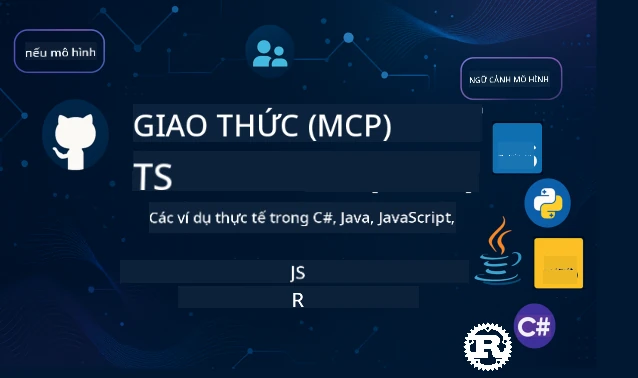

 

[](https://GitHub.com/microsoft/mcp-for-beginners/graphs/contributors)
[](https://GitHub.com/microsoft/mcp-for-beginners/issues)
[](https://GitHub.com/microsoft/mcp-for-beginners/pulls)
[](http://makeapullrequest.com)

[](https://GitHub.com/microsoft/mcp-for-beginners/watchers)
[](https://GitHub.com/microsoft/mcp-for-beginners/fork)
[](https://GitHub.com/microsoft/mcp-for-beginners/stargazers)


[](https://discord.gg/nTYy5BXMWG)

Làm theo các bước sau để bắt đầu sử dụng các tài nguyên này:
1. **Fork Kho Lưu trữ**: Nhấn vào [](https://GitHub.com/microsoft/mcp-for-beginners/fork)
2. **Clone Kho Lưu trữ**:   `git clone https://github.com/microsoft/mcp-for-beginners.git`
3. **Tham gia** [](https://discord.gg/nTYy5BXMWG)


### 🌐 Hỗ trợ Đa Ngôn Ngữ

#### Hỗ trợ qua GitHub Action (Tự động & Luôn Cập Nhật)

<!-- CO-OP TRANSLATOR LANGUAGES TABLE START -->
[Arabic](../ar/README.md) | [Bengali](../bn/README.md) | [Bulgarian](../bg/README.md) | [Burmese (Myanmar)](../my/README.md) | [Chinese (Simplified)](../zh-CN/README.md) | [Chinese (Traditional, Hong Kong)](../zh-HK/README.md) | [Chinese (Traditional, Macau)](../zh-MO/README.md) | [Chinese (Traditional, Taiwan)](../zh-TW/README.md) | [Croatian](../hr/README.md) | [Czech](../cs/README.md) | [Danish](../da/README.md) | [Dutch](../nl/README.md) | [Estonian](../et/README.md) | [Finnish](../fi/README.md) | [French](../fr/README.md) | [German](../de/README.md) | [Greek](../el/README.md) | [Hebrew](../he/README.md) | [Hindi](../hi/README.md) | [Hungarian](../hu/README.md) | [Indonesian](../id/README.md) | [Italian](../it/README.md) | [Japanese](../ja/README.md) | [Kannada](../kn/README.md) | [Korean](../ko/README.md) | [Lithuanian](../lt/README.md) | [Malay](../ms/README.md) | [Malayalam](../ml/README.md) | [Marathi](../mr/README.md) | [Nepali](../ne/README.md) | [Nigerian Pidgin](../pcm/README.md) | [Norwegian](../no/README.md) | [Persian (Farsi)](../fa/README.md) | [Polish](../pl/README.md) | [Portuguese (Brazil)](../pt-BR/README.md) | [Portuguese (Portugal)](../pt-PT/README.md) | [Punjabi (Gurmukhi)](../pa/README.md) | [Romanian](../ro/README.md) | [Russian](../ru/README.md) | [Serbian (Cyrillic)](../sr/README.md) | [Slovak](../sk/README.md) | [Slovenian](../sl/README.md) | [Spanish](../es/README.md) | [Swahili](../sw/README.md) | [Swedish](../sv/README.md) | [Tagalog (Filipino)](../tl/README.md) | [Tamil](../ta/README.md) | [Telugu](../te/README.md) | [Thai](../th/README.md) | [Turkish](../tr/README.md) | [Ukrainian](../uk/README.md) | [Urdu](../ur/README.md) | [Vietnamese](./README.md)

> **Ưu tiên Clone Tại Máy?**
>
> Kho lưu trữ này bao gồm hơn 50 bản dịch ngôn ngữ làm tăng đáng kể dung lượng tải về. Để clone mà không có các bản dịch, hãy dùng sparse checkout:
>
> **Bash / macOS / Linux:**
> ```bash
> git clone --filter=blob:none --sparse https://github.com/microsoft/mcp-for-beginners.git
> cd mcp-for-beginners
> git sparse-checkout set --no-cone '/*' '!translations' '!translated_images'
> ```
>
> **CMD (Windows):**
> ```cmd
> git clone --filter=blob:none --sparse https://github.com/microsoft/mcp-for-beginners.git
> cd mcp-for-beginners
> git sparse-checkout set --no-cone "/*" "!translations" "!translated_images"
> ```
>
> Điều này giúp bạn có mọi thứ cần thiết để hoàn thành khóa học với tốc độ tải nhanh hơn nhiều.
<!-- CO-OP TRANSLATOR LANGUAGES TABLE END -->

# 🚀 Chương Trình Học Model Context Protocol (MCP) Dành Cho Người Mới Bắt Đầu

## **Học MCP với Ví dụ Mã Thực Hành bằng C#, Java, JavaScript, Rust, Python và TypeScript**

## 🧠 Tổng Quan về Chương Trình Học Model Context Protocol
Chào mừng bạn đến với hành trình khám phá Model Context Protocol! Nếu bạn từng thắc mắc các ứng dụng AI giao tiếp với các công cụ và dịch vụ khác nhau như thế nào, thì bạn sắp khám phá giải pháp tinh tế đang thay đổi cách các nhà phát triển xây dựng hệ thống thông minh.

Hãy nghĩ MCP như một phiên dịch viên đa năng cho các ứng dụng AI - giống như cách cổng USB cho phép bạn kết nối bất kỳ thiết bị nào với máy tính của mình, MCP cho phép các mô hình AI kết nối với bất kỳ công cụ hoặc dịch vụ nào theo một chuẩn chung. Dù bạn đang xây dựng chatbot đầu tiên hay làm việc với các quy trình AI phức tạp, hiểu về MCP sẽ trao cho bạn sức mạnh tạo ra các ứng dụng linh hoạt và có khả năng hơn.

Chương trình học này được thiết kế với sự kiên nhẫn và tận tâm cho hành trình học của bạn. Chúng ta sẽ bắt đầu với những khái niệm đơn giản mà bạn đã hiểu và dần dần xây dựng chuyên môn qua thực hành trực tiếp bằng ngôn ngữ lập trình bạn yêu thích. Mỗi bước đều bao gồm các giải thích rõ ràng, ví dụ thực tế và nhiều sự khích lệ trên đường đi.

Khi hoàn thành hành trình này, bạn sẽ tự tin xây dựng máy chủ MCP của riêng mình, tích hợp chúng với các nền tảng AI phổ biến, và hiểu cách công nghệ này đang định hình lại tương lai phát triển AI. Hãy bắt đầu cuộc phiêu lưu thú vị này cùng nhau!

### Tài Liệu và Đặc Tả Chính Thức

Chương trình học này phù hợp với **Đặc Tả MCP 2025-11-25** (phiên bản ổn định mới nhất). Đặc tả MCP sử dụng phiên bản theo ngày tháng (định dạng YYYY-MM-DD) để đảm bảo việc theo dõi phiên bản giao thức rõ ràng.

Các tài nguyên này sẽ càng quý giá khi kiến thức của bạn tăng lên, nhưng đừng cảm thấy áp lực phải đọc hết ngay. Hãy bắt đầu với những phần bạn quan tâm nhất!
- 📘 [Tài Liệu MCP](https://modelcontextprotocol.io/) – Đây là nguồn tài nguyên tham khảo từng bước và hướng dẫn dành cho người dùng. Tài liệu được viết dành cho người mới bắt đầu, cung cấp các ví dụ rõ ràng để bạn thực hành theo tốc độ của mình.
- 📜 [Đặc Tả MCP](https://modelcontextprotocol.io/specification/2025-11-25) – Hãy xem đây như cuốn sổ tay tham khảo toàn diện của bạn. Khi làm việc với chương trình học, bạn sẽ thường xuyên quay lại đây để tra cứu các chi tiết cụ thể và khám phá tính năng nâng cao.
- 📜 [Quản Lý Phiên Bản Đặc Tả MCP](https://modelcontextprotocol.io/specification/versioning) – Chứa thông tin về lịch sử phiên bản của giao thức và cách MCP sử dụng định dạng phiên bản theo ngày tháng (YYYY-MM-DD).
- 🧑‍💻 [Kho Lưu Trữ MCP trên GitHub](https://github.com/modelcontextprotocol) –  Ở đây bạn sẽ tìm thấy SDK, công cụ và các mẫu mã trong nhiều ngôn ngữ lập trình. Đây như một kho báu chứa các ví dụ thực tế và các thành phần sẵn dùng.
- 🌐 [Cộng Đồng MCP](https://github.com/orgs/modelcontextprotocol/discussions) – Tham gia cùng những người học khác và các nhà phát triển có kinh nghiệm trong các cuộc thảo luận về MCP. Đây là môi trường hỗ trợ, nơi các câu hỏi được hoan nghênh và kiến thức được chia sẻ tự do.
  
## Mục Tiêu Học Tập

Kết thúc chương trình học này, bạn sẽ cảm thấy tự tin và hào hứng với những kỹ năng mới có được. Đây là những điều bạn sẽ đạt được:

• **Hiểu các nền tảng MCP**: Bạn sẽ nắm bắt được Model Context Protocol là gì và tại sao nó đang cách mạng hóa cách các ứng dụng AI làm việc cùng nhau, qua các phép ẩn dụ và ví dụ dễ hiểu.

• **Xây dựng máy chủ MCP đầu tiên của bạn**: Bạn sẽ tạo một máy chủ MCP hoạt động bằng ngôn ngữ lập trình mình chọn, bắt đầu với những ví dụ đơn giản và nâng cao kỹ năng từng bước.

• **Kết nối mô hình AI với các công cụ thực tế**: Bạn sẽ học cách tạo cầu nối giữa các mô hình AI và dịch vụ thực tế, mang lại những khả năng mới mạnh mẽ cho ứng dụng của bạn.

• **Thực hiện các nguyên tắc bảo mật tốt nhất**: Bạn sẽ hiểu cách giữ cho các triển khai MCP của mình an toàn, bảo vệ cả ứng dụng lẫn người dùng.

• **Triển khai với sự tự tin**: Bạn sẽ biết cách đưa các dự án MCP từ phát triển đến sản xuất, với các chiến lược triển khai thực tế hiệu quả.

• **Tham gia cộng đồng MCP**: Bạn sẽ trở thành một phần của cộng đồng các nhà phát triển đang định hình tương lai phát triển ứng dụng AI.

## Kiến Thức Nền Tảng Thiết Yếu

Trước khi đi sâu vào các vấn đề cụ thể của MCP, hãy đảm bảo bạn cảm thấy thoải mái với một số khái niệm nền tảng. Đừng lo nếu bạn chưa phải là chuyên gia trong các lĩnh vực này - chúng tôi sẽ giải thích đầy đủ mọi thứ bạn cần biết theo tiến độ!

### Hiểu về Giao Thức (Nền Tảng)

Hãy nghĩ giao thức như những quy tắc cho một cuộc trò chuyện. Khi bạn gọi điện cho bạn bè, cả hai đều biết phải nói "xin chào" khi bắt máy, biết đến lượt nói của mình và nói "tạm biệt" khi kết thúc. Các chương trình máy tính cũng cần các quy tắc tương tự để giao tiếp hiệu quả.

MCP là một giao thức - một tập hợp các quy tắc đã được thống nhất giúp các mô hình và ứng dụng AI có những "cuộc trò chuyện" hiệu quả với các công cụ và dịch vụ. Giống như quy tắc trò chuyện làm cho giao tiếp giữa người trở nên trôi chảy hơn, MCP giúp giao tiếp giữa các ứng dụng AI trở nên đáng tin cậy và mạnh mẽ hơn nhiều.

### Mối Quan Hệ Client-Server (Cách Các Chương Trình Kết Nối)

Bạn đã sử dụng mối quan hệ client-server mỗi ngày! Khi bạn dùng trình duyệt web (client) truy cập một trang web, bạn đang kết nối tới một máy chủ web để nhận nội dung trang. Trình duyệt biết cách yêu cầu thông tin và máy chủ biết cách phản hồi.

Trong MCP, chúng ta có mối quan hệ tương tự: các mô hình AI đóng vai trò client yêu cầu thông tin hoặc hành động, trong khi máy chủ MCP cung cấp các khả năng đó. Giống như có một trợ lý hữu ích (máy chủ) mà AI có thể nhờ làm các nhiệm vụ cụ thể.

### Tại Sao Chuẩn Hóa Quan Trọng (Giúp Các Thành Phần Hoạt Động Cùng Nhau)

Hãy tưởng tượng nếu mọi hãng xe dùng các đầu bơm xăng có hình dạng khác nhau - bạn sẽ cần một bộ chuyển đổi khác cho từng xe! Chuẩn hóa nghĩa là đồng thuận về các cách tiếp cận chung để mọi thứ hoạt động trơn tru với nhau.

MCP cung cấp sự chuẩn hóa dành cho các ứng dụng AI. Thay vì mỗi mô hình AI cần mã riêng để làm việc với từng công cụ, MCP tạo ra một cách tiếp cận chung để giao tiếp. Điều này có nghĩa nhà phát triển có thể xây dựng công cụ một lần rồi dùng được với nhiều hệ thống AI khác nhau.

## 🧭 Tổng Quan Lộ Trình Học Tập Của Bạn

Hành trình học MCP của bạn được cấu trúc cẩn thận để xây dựng sự tự tin và kỹ năng từng bước. Mỗi giai đoạn giới thiệu các khái niệm mới đồng thời củng cố những gì bạn đã học.

### 🌱 Giai Đoạn Nền Tảng: Hiểu Các Khái Niệm Cơ Bản (Module 0-2)

Đây là nơi cuộc phiêu lưu của bạn bắt đầu! Chúng tôi sẽ giới thiệu các khái niệm MCP qua các phép ẩn dụ quen thuộc và ví dụ đơn giản. Bạn sẽ hiểu MCP là gì, tại sao nó tồn tại và cách nó phù hợp với thế giới phát triển AI rộng lớn hơn.

• **Module 0 - Giới thiệu về MCP**: Chúng ta sẽ bắt đầu bằng việc khám phá MCP là gì và tại sao nó lại quan trọng với các ứng dụng AI hiện đại. Bạn sẽ thấy ví dụ thực tế về MCP đang hoạt động và hiểu cách nó giải quyết các vấn đề phổ biến mà các nhà phát triển gặp phải.

• **Module 1 - Giải thích các Khái Niệm Cốt Lõi**: Ở đây bạn sẽ học các thành phần thiết yếu của MCP. Chúng tôi sẽ dùng rất nhiều phép ẩn dụ và ví dụ trực quan để đảm bảo các khái niệm này trở nên quen thuộc và dễ hiểu.

• **Module 2 - Bảo mật trong MCP**: Bảo mật nghe có vẻ khó khăn, nhưng chúng tôi sẽ cho bạn thấy MCP bao gồm các tính năng an toàn tích hợp và hướng dẫn bạn các nguyên tắc tốt nhất để bảo vệ ứng dụng ngay từ đầu.

### 🔨 Giai Đoạn Xây Dựng: Tạo Triển Khai MCP Đầu Tiên (Module 3)

Bây giờ thì phần thú vị thật sự bắt đầu! Bạn sẽ thực hành xây dựng máy chủ và client MCP thực tế. Đừng lo - chúng tôi sẽ bắt đầu đơn giản và hướng dẫn bạn từng bước.
Mô-đun này bao gồm nhiều hướng dẫn thực hành cho phép bạn luyện tập bằng ngôn ngữ lập trình ưa thích của mình. Bạn sẽ tạo máy chủ đầu tiên, xây dựng một client để kết nối với máy chủ đó và thậm chí tích hợp với các công cụ phát triển phổ biến như VS Code.

Mỗi hướng dẫn bao gồm các ví dụ mã hoàn chỉnh, mẹo xử lý sự cố và giải thích lý do tại sao chúng ta đưa ra các lựa chọn thiết kế cụ thể. Vào cuối giai đoạn này, bạn sẽ có các triển khai MCP hoạt động mà bạn có thể tự hào!

### 🚀 Giai đoạn Phát triển: Khái niệm nâng cao và Ứng dụng Thực tế (Mô-đun 4-5)

Khi đã nắm vững cơ bản, bạn sẵn sàng khám phá các tính năng MCP phức tạp hơn. Chúng ta sẽ đề cập đến các chiến lược triển khai thực tiễn, kỹ thuật gỡ lỗi và các chủ đề nâng cao như tích hợp AI đa mô thức.

Bạn cũng sẽ học cách mở rộng triển khai MCP cho mục đích sản xuất và tích hợp với các nền tảng đám mây như Azure. Các mô-đun này chuẩn bị cho bạn xây dựng các giải pháp MCP có thể đáp ứng các yêu cầu thực tế.

### 🌟 Giai đoạn Thành thạo: Cộng đồng và Chuyên môn hóa (Mô-đun 6-11)

Giai đoạn cuối tập trung vào việc tham gia cộng đồng MCP và chuyên sâu vào những lĩnh vực bạn quan tâm nhất. Bạn sẽ học cách đóng góp vào các dự án MCP mã nguồn mở, triển khai các mẫu xác thực nâng cao và xây dựng các giải pháp tích hợp cơ sở dữ liệu toàn diện.

Mô-đun 11 xứng đáng được nhắc đến đặc biệt - đó là một lộ trình học 13 phòng thí nghiệm thực hành đầy đủ giúp bạn xây dựng các máy chủ MCP sẵn sàng cho sản xuất với tích hợp PostgreSQL. Nó giống như một dự án tổng kết gắn kết tất cả những gì bạn đã học!

### 📚 Cấu trúc Khóa học Hoàn chỉnh

| Module | Chủ đề | Mô tả | Liên kết |
|--------|--------|--------|---------|
| **Mô-đun 0-3: Cơ bản** | | | |
| 00 | Giới thiệu MCP | Tổng quan về Giao thức Ngữ cảnh Mô hình và tầm quan trọng của nó trong các pipeline AI | [Đọc thêm](./00-Introduction/README.md) |
| 01 | Giải thích các Khái niệm Cốt lõi | Khám phá sâu các khái niệm cốt lõi của MCP | [Đọc thêm](./01-CoreConcepts/README.md) |
| 02 | An ninh trong MCP | Các mối đe dọa an ninh và các thực hành tốt nhất | [Đọc thêm](./02-Security/README.md) |
| 03 | Bắt đầu với MCP | Thiết lập môi trường, máy chủ/client cơ bản, tích hợp | [Đọc thêm](./03-GettingStarted/README.md) |
| **Mô-đun 3: Xây dựng Máy chủ & Client Đầu tiên** | | | |
| 3.1 | Máy chủ Đầu tiên | Tạo máy chủ MCP đầu tiên của bạn | [Hướng dẫn](./03-GettingStarted/01-first-server/README.md) |
| 3.2 | Client Đầu tiên | Phát triển client MCP cơ bản | [Hướng dẫn](./03-GettingStarted/02-client/README.md) |
| 3.3 | Client với LLM | Tích hợp mô hình ngôn ngữ lớn | [Hướng dẫn](./03-GettingStarted/03-llm-client/README.md) |
| 3.4 | Tích hợp VS Code | Sử dụng máy chủ MCP trong VS Code | [Hướng dẫn](./03-GettingStarted/04-vscode/README.md) |
| 3.5 | Máy chủ stdio | Tạo máy chủ sử dụng giao thức truyền stdio | [Hướng dẫn](./03-GettingStarted/05-stdio-server/README.md) |
| 3.6 | Streaming HTTP | Triển khai truyền streaming HTTP trong MCP | [Hướng dẫn](./03-GettingStarted/06-http-streaming/README.md) |
| 3.7 | Bộ công cụ AI | Sử dụng Bộ công cụ AI với MCP | [Hướng dẫn](./03-GettingStarted/07-aitk/README.md) |
| 3.8 | Kiểm thử | Kiểm thử triển khai máy chủ MCP của bạn | [Hướng dẫn](./03-GettingStarted/08-testing/README.md) |
| 3.9 | Triển khai | Triển khai máy chủ MCP ra sản xuất | [Hướng dẫn](./03-GettingStarted/09-deployment/README.md) |
| 3.10 | Sử dụng máy chủ nâng cao | Sử dụng máy chủ nâng cao cho tính năng tiên tiến và kiến trúc cải tiến | [Hướng dẫn](./03-GettingStarted/10-advanced/README.md) |
| 3.11 | Xác thực đơn giản | Chương giới thiệu về xác thực từ đầu và phân quyền RBAC | [Hướng dẫn](./03-GettingStarted/11-simple-auth/README.md) |
| 3.12 | MCP Hosts | Cấu hình Claude Desktop, Cursor, Cline, và các máy chủ MCP khác | [Hướng dẫn](./03-GettingStarted/12-mcp-hosts/README.md) |
| 3.13 | MCP Inspector | Gỡ lỗi và kiểm thử máy chủ MCP với công cụ Inspector | [Hướng dẫn](./03-GettingStarted/13-mcp-inspector/README.md) |
| 3.14 | Sampling | Sử dụng sampling để cộng tác với client | [Hướng dẫn](./03-GettingStarted/14-sampling/README.md) |
| 3.15 | Ứng dụng MCP | Xây dựng ứng dụng MCP | [Hướng dẫn](./03-GettingStarted/15-mcp-apps/README.md) |
| **Mô-đun 4-5: Thực hành & Nâng cao** | | | |
| 04 | Triển khai Thực tiễn | SDK, gỡ lỗi, kiểm thử, mẫu prompt tái sử dụng | [Đọc thêm](./04-PracticalImplementation/README.md) |
| 4.1 | Phân trang | Xử lý tập kết quả lớn với phân trang dùng con trỏ | [Hướng dẫn](./04-PracticalImplementation/pagination/README.md) |
| 05 | Chủ đề Nâng cao trong MCP | AI đa mô thức, mở rộng quy mô, ứng dụng doanh nghiệp | [Đọc thêm](./05-AdvancedTopics/README.md) |
| 5.1 | Tích hợp Azure | Tích hợp MCP với Azure | [Hướng dẫn](./05-AdvancedTopics/mcp-integration/README.md) |
| 5.2 | Đa mô thức | Làm việc với nhiều mô thức | [Hướng dẫn](./05-AdvancedTopics/mcp-multi-modality/README.md) |
| 5.3 | Minh họa OAuth2 | Triển khai xác thực OAuth2 | [Hướng dẫn](./05-AdvancedTopics/mcp-oauth2-demo/README.md) |
| 5.4 | Root Contexts | Hiểu và triển khai ngữ cảnh gốc | [Hướng dẫn](./05-AdvancedTopics/mcp-root-contexts/README.md) |
| 5.5 | Định tuyến | Chiến lược định tuyến MCP | [Hướng dẫn](./05-AdvancedTopics/mcp-routing/README.md) |
| 5.6 | Sampling | Kỹ thuật sampling trong MCP | [Hướng dẫn](./05-AdvancedTopics/mcp-sampling/README.md) |
| 5.7 | Mở rộng quy mô | Mở rộng triển khai MCP | [Hướng dẫn](./05-AdvancedTopics/mcp-scaling/README.md) |
| 5.8 | Bảo mật | Các cân nhắc bảo mật nâng cao | [Hướng dẫn](./05-AdvancedTopics/mcp-security/README.md) |
| 5.9 | Tìm kiếm trên Web | Triển khai khả năng tìm kiếm trên web | [Hướng dẫn](./05-AdvancedTopics/web-search-mcp/README.md) |
| 5.10 | Streaming Thời gian thực | Xây dựng chức năng streaming thời gian thực | [Hướng dẫn](./05-AdvancedTopics/mcp-realtimestreaming/README.md) |
| 5.11 | Tìm kiếm Thời gian thực | Triển khai tìm kiếm thời gian thực | [Hướng dẫn](./05-AdvancedTopics/mcp-realtimesearch/README.md) |
| 5.12 | Xác thực Entra ID | Xác thực với Microsoft Entra ID | [Hướng dẫn](./05-AdvancedTopics/mcp-security-entra/README.md) |
| 5.13 | Tích hợp Foundry | Tích hợp với Azure AI Foundry | [Hướng dẫn](./05-AdvancedTopics/mcp-foundry-agent-integration/README.md) |
| 5.14 | Kỹ thuật Ngữ cảnh | Kỹ thuật để kỹ thuật ngữ cảnh hiệu quả | [Hướng dẫn](./05-AdvancedTopics/mcp-contextengineering/README.md) |
| 5.15 | Giao thức vận chuyển tùy chỉnh MCP | Triển khai Giao thức vận chuyển tùy chỉnh | [Hướng dẫn](./05-AdvancedTopics/mcp-transport/README.md) |
| 5.16 | Tính năng Giao thức | Thông báo tiến trình, hủy bỏ, mẫu tài nguyên | [Hướng dẫn](./05-AdvancedTopics/mcp-protocol-features/README.md) |
| **Mô-đun 6-10: Cộng đồng & Thực hành Tốt nhất** | | | |
| 06 | Đóng góp Cộng đồng | Cách đóng góp cho hệ sinh thái MCP | [Hướng dẫn](./06-CommunityContributions/README.md) |
| 07 | Hiểu biết từ Những người dùng đầu tiên | Câu chuyện triển khai thực tế | [Hướng dẫn](./07-LessonsfromEarlyAdoption/README.md) |
| 08 | Thực hành tốt nhất cho MCP | Hiệu suất, chống lỗi, độ bền bỉ | [Hướng dẫn](./08-BestPractices/README.md) |
| 09 | Nghiên cứu trường hợp MCP | Ví dụ triển khai thực tế | [Hướng dẫn](./09-CaseStudy/README.md) |
| 10 | Workshop Thực hành | Xây dựng Máy chủ MCP với Bộ công cụ AI | [Phòng thí nghiệm](./10-StreamliningAIWorkflowsBuildingAnMCPServerWithAIToolkit/README.md) |
| **Mô-đun 11: Phòng thí nghiệm Thực hành Máy chủ MCP** | | | |
| 11 | Tích hợp Máy chủ MCP với Cơ sở dữ liệu | Lộ trình học 13 phòng thí nghiệm thực hành toàn diện cho tích hợp PostgreSQL | [Phòng thí nghiệm](./11-MCPServerHandsOnLabs/README.md) |
| 11.1 | Giới thiệu | Tổng quan về MCP với tích hợp cơ sở dữ liệu và trường hợp phân tích bán lẻ | [Phòng thí nghiệm 00](./11-MCPServerHandsOnLabs/00-Introduction/README.md) |
| 11.2 | Kiến trúc Cốt lõi | Hiểu kiến trúc máy chủ MCP, các lớp cơ sở dữ liệu và mẫu bảo mật | [Phòng thí nghiệm 01](./11-MCPServerHandsOnLabs/01-Architecture/README.md) |
| 11.3 | An ninh & Đa người thuê | Bảo mật cấp hàng, xác thực và truy cập dữ liệu đa người thuê | [Phòng thí nghiệm 02](./11-MCPServerHandsOnLabs/02-Security/README.md) |
| 11.4 | Thiết lập Môi trường | Thiết lập môi trường phát triển, Docker, tài nguyên Azure | [Phòng thí nghiệm 03](./11-MCPServerHandsOnLabs/03-Setup/README.md) |
| 11.5 | Thiết kế Cơ sở dữ liệu | Thiết lập PostgreSQL, thiết kế schema bán lẻ và dữ liệu mẫu | [Phòng thí nghiệm 04](./11-MCPServerHandsOnLabs/04-Database/README.md) |
| 11.6 | Triển khai Máy chủ MCP | Xây dựng máy chủ FastMCP với tích hợp cơ sở dữ liệu | [Phòng thí nghiệm 05](./11-MCPServerHandsOnLabs/05-MCP-Server/README.md) |
| 11.7 | Phát triển Công cụ | Tạo công cụ truy vấn cơ sở dữ liệu và khám phá schema | [Phòng thí nghiệm 06](./11-MCPServerHandsOnLabs/06-Tools/README.md) |
| 11.8 | Tìm kiếm Ngữ nghĩa | Triển khai vector embeddings với Azure OpenAI và pgvector | [Phòng thí nghiệm 07](./11-MCPServerHandsOnLabs/07-Semantic-Search/README.md) |
| 11.9 | Kiểm thử & Gỡ lỗi | Chiến lược kiểm thử, công cụ gỡ lỗi và phương pháp xác thực | [Phòng thí nghiệm 08](./11-MCPServerHandsOnLabs/08-Testing/README.md) |
| 11.10 | Tích hợp VS Code | Cấu hình tích hợp MCP cho VS Code và sử dụng AI Chat | [Phòng thí nghiệm 09](./11-MCPServerHandsOnLabs/09-VS-Code/README.md) |
| 11.11 | Chiến lược Triển khai | Triển khai Docker, Azure Container Apps và xem xét mở rộng quy mô | [Phòng thí nghiệm 10](./11-MCPServerHandsOnLabs/10-Deployment/README.md) |
| 11.12 | Giám sát | Application Insights, ghi log, giám sát hiệu suất | [Phòng thí nghiệm 11](./11-MCPServerHandsOnLabs/11-Monitoring/README.md) |
| 11.13 | Thực hành Tốt nhất | Tối ưu hiệu suất, gia cố bảo mật và mẹo sản xuất | [Phòng thí nghiệm 12](./11-MCPServerHandsOnLabs/12-Best-Practices/README.md) |

### 💻 Dự án Mã mẫu

Một trong những phần thú vị nhất của việc học MCP là thấy kỹ năng mã của bạn phát triển dần. Chúng tôi thiết kế các ví dụ mã của mình bắt đầu đơn giản và trở nên phức tạp hơn khi bạn hiểu sâu hơn. Đây là cách chúng tôi giới thiệu các khái niệm - với mã dễ hiểu nhưng thể hiện các nguyên tắc MCP thật sự, bạn sẽ hiểu không chỉ mã này làm gì mà còn tại sao nó được cấu trúc như vậy và nó phù hợp thế nào trong các ứng dụng MCP lớn hơn.

#### Mẫu Máy tính MCP Cơ bản

| Ngôn ngữ | Mô tả | Liên kết |
|----------|--------|---------|
| C# | Ví dụ Máy chủ MCP | [Xem Mã](./03-GettingStarted/samples/csharp/README.md) |
| Java | Máy tính MCP | [Xem Mã](./03-GettingStarted/samples/java/calculator/README.md) |
| JavaScript | Demo MCP | [Xem Mã](./03-GettingStarted/samples/javascript/README.md) |
| Python | Máy chủ MCP | [Xem Mã](../../03-GettingStarted/samples/python/mcp_calculator_server.py) |
| TypeScript | Ví dụ MCP | [Xem Mã](./03-GettingStarted/samples/typescript/README.md) |
| Rust | Ví dụ MCP | [Xem Mã](./03-GettingStarted/samples/rust/README.md) |

#### Triển khai MCP Nâng cao

| Ngôn ngữ | Mô tả | Liên kết |
|----------|--------|---------|
| C# | Mẫu Nâng cao | [Xem Mã](./04-PracticalImplementation/samples/csharp/README.md) |
| Java với Spring | Ví dụ Container App | [Xem Mã](./04-PracticalImplementation/samples/java/containerapp/README.md) |
| JavaScript | Mẫu Nâng cao | [Xem Mã](./04-PracticalImplementation/samples/javascript/README.md) |
| Python | Triển khai Phức tạp | [Xem Mã](./04-PracticalImplementation/samples/python/README.md) |
| TypeScript | Mẫu Container | [Xem Mã](./04-PracticalImplementation/samples/typescript/README.md) |


## 🎯 Yêu cầu Tiền đề để Học MCP

Để tận dụng tối đa khóa học này, bạn nên có:
- Kiến thức cơ bản về lập trình ít nhất một trong các ngôn ngữ sau: C#, Java, JavaScript, Python, hoặc TypeScript
- Hiểu biết về mô hình client-server và API
- Quen thuộc với các khái niệm REST và HTTP
- (Tùy chọn) Kiến thức nền tảng về các khái niệm AI/ML

- Tham gia các cuộc thảo luận cộng đồng của chúng tôi để được hỗ trợ

## 📚 Hướng Dẫn Học Tập & Tài Nguyên

Kho lưu trữ này bao gồm một số tài nguyên giúp bạn điều hướng và học tập hiệu quả:

### Hướng Dẫn Học Tập

Một [Hướng Dẫn Học Tập](./study_guide.md) toàn diện được cung cấp để giúp bạn điều hướng kho lưu trữ này một cách hiệu quả. Bản đồ chương trình trực quan này thể hiện cách tất cả các chủ đề kết nối với nhau và cung cấp hướng dẫn sử dụng các dự án mẫu một cách hiệu quả. Điều này đặc biệt hữu ích nếu bạn là người học trực quan thích nhìn toàn cảnh.

Hướng dẫn bao gồm:
- Bản đồ chương trình học trực quan hiển thị tất cả các chủ đề đã học
- Phân tích chi tiết từng phần của kho lưu trữ
- Hướng dẫn cách sử dụng các dự án mẫu
- Đường dẫn học tập được đề xuất cho các cấp độ kỹ năng khác nhau
- Tài nguyên bổ sung để hỗ trợ hành trình học tập của bạn

### Nhật Ký Thay Đổi

Chúng tôi duy trì một [Nhật Ký Thay Đổi](./changelog.md) chi tiết theo dõi tất cả các cập nhật quan trọng cho tài liệu chương trình, để bạn luôn theo kịp những cải tiến và bổ sung mới nhất.
- Thêm nội dung mới
- Thay đổi cấu trúc
- Cải tiến tính năng
- Cập nhật tài liệu

## 🛠️ Cách Sử Dụng Chương Trình Học Hiệu Quả

Mỗi bài học trong hướng dẫn này bao gồm:

1. Giải thích rõ ràng về các khái niệm MCP  
2. Ví dụ mã trực tiếp bằng nhiều ngôn ngữ  
3. Bài tập xây dựng các ứng dụng MCP thực tế  
4. Tài nguyên bổ sung cho người học nâng cao

### Cùng Học MCP với C# - Chuỗi Hướng Dẫn
Hãy cùng tìm hiểu về Model Context Protocol (MCP), một khung làm việc tiên tiến thiết kế để chuẩn hóa tương tác giữa các mô hình AI và ứng dụng khách. Qua phiên học thân thiện với người mới bắt đầu này, chúng tôi sẽ giới thiệu MCP và hướng dẫn bạn tạo máy chủ MCP đầu tiên của mình.
#### C#: [https://aka.ms/letslearnmcp-csharp](https://aka.ms/letslearnmcp-csharp)
#### Java: [https://aka.ms/letslearnmcp-java](https://aka.ms/letslearnmcp-java)
#### JavaScript: [https://aka.ms/letslearnmcp-javascript](https://aka.ms/letslearnmcp-javascript)
#### Python: [https://aka.ms/letslearnmcp-python](https://aka.ms/letslearnmcp-python)

## 🎓 Hành Trình MCP Của Bạn Bắt Đầu

Chúc mừng! Bạn vừa bước vào một hành trình thú vị sẽ mở rộng khả năng lập trình và kết nối bạn với công nghệ AI tiên tiến nhất.

### Những Gì Bạn Đã Hoàn Thành

Bằng cách đọc phần giới thiệu này, bạn đã bắt đầu xây dựng nền tảng kiến thức về MCP. Bạn hiểu MCP là gì, tại sao nó quan trọng, và chương trình học này sẽ hỗ trợ bạn như thế nào trong hành trình học tập. Đó là một thành tựu đáng kể và cũng là sự khởi đầu cho chuyên môn của bạn trong công nghệ quan trọng này.

### Cuộc Phiêu Lưu Phía Trước

Khi bạn tiến bộ qua các mô-đun, hãy nhớ rằng mọi chuyên gia đều từng là người mới bắt đầu. Những khái niệm có thể hiện phức tạp lúc đầu sẽ trở nên quen thuộc khi bạn luyện tập và áp dụng. Mỗi bước nhỏ góp phần xây dựng khả năng mạnh mẽ sẽ phục vụ bạn suốt sự nghiệp phát triển.

### Mạng Lưới Hỗ Trợ Của Bạn

Bạn đang gia nhập một cộng đồng các học viên và chuyên gia đam mê MCP và luôn sẵn sàng giúp đỡ người khác thành công. Dù bạn đang mắc kẹt với một thử thách lập trình hay hào hứng chia sẻ một bước đột phá, cộng đồng luôn ở đây hỗ trợ hành trình của bạn.

Nếu bạn gặp khó khăn hoặc có câu hỏi về xây dựng ứng dụng AI, hãy tham gia cùng những người học khác và các nhà phát triển giàu kinh nghiệm trong các cuộc thảo luận về MCP. Đây là một cộng đồng hỗ trợ nơi các câu hỏi được chào đón và kiến thức được chia sẻ rộng rãi.

[](https://discord.gg/nTYy5BXMWG)

Nếu bạn có phản hồi về sản phẩm hoặc phát hiện lỗi trong quá trình xây dựng, hãy truy cập:

[](https://aka.ms/foundry/forum)

### Sẵn Sàng Bắt Đầu?

Hành trình MCP của bạn bắt đầu ngay bây giờ! Bắt đầu với Mô-đun 0 để trải nghiệm làm việc thực tế MCP đầu tiên của bạn, hoặc khám phá các dự án mẫu để xem những gì bạn sẽ xây dựng. Hãy nhớ rằng - mọi chuyên gia đều bắt đầu ngay tại điểm bạn đang đứng, và với sự kiên nhẫn cùng luyện tập, bạn sẽ ngạc nhiên về những gì mình có thể đạt được.

Chào mừng bạn đến với thế giới phát triển Model Context Protocol. Hãy cùng xây dựng điều gì đó tuyệt vời!

## 🤝 Đóng Góp Cho Cộng Đồng Học Tập

Chương trình học này ngày càng mạnh mẽ nhờ sự đóng góp từ những người học như bạn! Dù bạn sửa lỗi đánh máy, gợi ý giải thích rõ hơn, hay thêm ví dụ mới, những đóng góp của bạn giúp các người mới khác thành công.

Cảm ơn Chuyên gia Được Trân Trọng của Microsoft [Shivam Goyal](https://www.linkedin.com/in/shivam2003/) đã đóng góp các mẫu mã.

Quy trình đóng góp được thiết kế thân thiện và hỗ trợ. Hầu hết các đóng góp đều yêu cầu Thỏa Thuận Cấp Phép Người Đóng Góp (CLA), nhưng các công cụ tự động sẽ hướng dẫn bạn quy trình một cách dễ dàng.

## 📜 Học Tập Mã Nguồn Mở

Toàn bộ chương trình học này có sẵn dưới giấy phép MIT [LICENSE](../../LICENSE), có nghĩa là bạn có thể sử dụng, chỉnh sửa và chia sẻ tự do. Điều này hỗ trợ sứ mệnh làm cho kiến thức MCP tiếp cận được với các nhà phát triển trên khắp nơi.

## 🤝 Hướng Dẫn Đóng Góp

Dự án này hoan nghênh các đóng góp và đề xuất. Hầu hết các đóng góp yêu cầu bạn đồng ý với
Thỏa Thuận Cấp Phép Người Đóng Góp (CLA) xác nhận rằng bạn có quyền và thực sự
cấp cho chúng tôi quyền sử dụng đóng góp của bạn. Chi tiết, vui lòng truy cập <https://cla.opensource.microsoft.com>.

Khi bạn gửi yêu cầu kéo (pull request), bot CLA sẽ tự động xác định bạn có cần cung cấp
CLA hay không và đánh dấu PR phù hợp (ví dụ, kiểm tra trạng thái, bình luận). Bạn chỉ cần làm theo hướng dẫn
do bot cung cấp. Bạn chỉ cần thực hiện việc này một lần cho tất cả các kho lưu trữ sử dụng CLA của chúng tôi.

Dự án này đã áp dụng [Bộ Quy Tắc Ứng Xử Mã Nguồn Mở của Microsoft](https://opensource.microsoft.com/codeofconduct/).
Để biết thêm thông tin, xem [Câu hỏi thường gặp về Bộ Quy Tắc Ứng Xử](https://opensource.microsoft.com/codeofconduct/faq/) hoặc
liên hệ [opencode@microsoft.com](mailto:opencode@microsoft.com) nếu có bất kỳ câu hỏi hoặc nhận xét bổ sung.

---

*Bạn đã sẵn sàng bắt đầu hành trình MCP chưa? Bắt đầu với [Mô-đun 00 - Giới thiệu về MCP](./00-Introduction/README.md) và bước vào thế giới phát triển Model Context Protocol!*

## 🎒 Các Khóa Học Khác
Đội ngũ của chúng tôi còn sản xuất các khóa học khác! Tham khảo:

<!-- CO-OP TRANSLATOR OTHER COURSES START -->
### LangChain
[](https://aka.ms/langchain4j-for-beginners)
[](https://aka.ms/langchainjs-for-beginners?WT.mc_id=m365-94501-dwahlin)
[](https://github.com/microsoft/langchain-for-beginners?WT.mc_id=m365-94501-dwahlin)
---

### Azure / Edge / MCP / Agents
[](https://github.com/microsoft/AZD-for-beginners?WT.mc_id=academic-105485-koreyst)
[](https://github.com/microsoft/edgeai-for-beginners?WT.mc_id=academic-105485-koreyst)
[](https://github.com/microsoft/mcp-for-beginners?WT.mc_id=academic-105485-koreyst)
[](https://github.com/microsoft/ai-agents-for-beginners?WT.mc_id=academic-105485-koreyst)

---
 
### Chuỗi AI Tạo Sinh
[](https://github.com/microsoft/generative-ai-for-beginners?WT.mc_id=academic-105485-koreyst)
[-9333EA?style=for-the-badge&labelColor=E5E7EB&color=9333EA)](https://github.com/microsoft/Generative-AI-for-beginners-dotnet?WT.mc_id=academic-105485-koreyst)
[-C084FC?style=for-the-badge&labelColor=E5E7EB&color=C084FC)](https://github.com/microsoft/generative-ai-for-beginners-java?WT.mc_id=academic-105485-koreyst)
[-E879F9?style=for-the-badge&labelColor=E5E7EB&color=E879F9)](https://github.com/microsoft/generative-ai-with-javascript?WT.mc_id=academic-105485-koreyst)

---
 
### Học Tập Cốt Lõi
[](https://aka.ms/ml-beginners?WT.mc_id=academic-105485-koreyst)
[](https://aka.ms/datascience-beginners?WT.mc_id=academic-105485-koreyst)
[](https://aka.ms/ai-beginners?WT.mc_id=academic-105485-koreyst)
[](https://github.com/microsoft/Security-101?WT.mc_id=academic-96948-sayoung)
[](https://aka.ms/webdev-beginners?WT.mc_id=academic-105485-koreyst)
[](https://aka.ms/iot-beginners?WT.mc_id=academic-105485-koreyst)
[](https://github.com/microsoft/xr-development-for-beginners?WT.mc_id=academic-105485-koreyst)

---
 
### Chuỗi Copilot
[](https://aka.ms/GitHubCopilotAI?WT.mc_id=academic-105485-koreyst)
[](https://github.com/microsoft/mastering-github-copilot-for-dotnet-csharp-developers?WT.mc_id=academic-105485-koreyst)
[](https://github.com/microsoft/CopilotAdventures?WT.mc_id=academic-105485-koreyst)
<!-- CO-OP TRANSLATOR OTHER COURSES END -->

---

<!-- CO-OP TRANSLATOR DISCLAIMER START -->
**Tuyên bố từ chối trách nhiệm**:  
Tài liệu này đã được dịch bằng dịch vụ dịch thuật AI [Co-op Translator](https://github.com/Azure/co-op-translator). Mặc dù chúng tôi cố gắng đảm bảo độ chính xác, xin lưu ý rằng các bản dịch tự động có thể chứa lỗi hoặc không chính xác. Tài liệu gốc bằng ngôn ngữ gốc của nó nên được coi là nguồn đáng tin cậy nhất. Đối với thông tin quan trọng, nên sử dụng dịch thuật chuyên nghiệp bởi con người. Chúng tôi không chịu trách nhiệm về bất kỳ sự hiểu lầm hoặc diễn giải sai nào phát sinh từ việc sử dụng bản dịch này.
<!-- CO-OP TRANSLATOR DISCLAIMER END -->