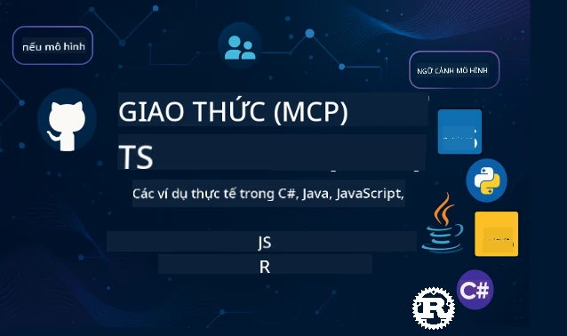

 

[](https://GitHub.com/microsoft/mcp-for-beginners/graphs/contributors)
[](https://GitHub.com/microsoft/mcp-for-beginners/issues)
[](https://GitHub.com/microsoft/mcp-for-beginners/pulls)
[](http://makeapullrequest.com)
[](https://mcptoplist.com/server/mcp.so%2Fmcp-for-beginners%2Fmicrosoft)

[](https://GitHub.com/microsoft/mcp-for-beginners/watchers)
[](https://GitHub.com/microsoft/mcp-for-beginners/fork)
[](https://GitHub.com/microsoft/mcp-for-beginners/stargazers)


[](https://discord.gg/nTYy5BXMWG)

Theo các bước sau để bắt đầu sử dụng các tài nguyên này:
1. **Sao chép kho lưu trữ**: Nhấp vào [](https://GitHub.com/microsoft/mcp-for-beginners/fork)
2. **Sao chép kho lưu trữ về máy**:   `git clone https://github.com/microsoft/mcp-for-beginners.git`
3. **Tham gia** [](https://discord.gg/nTYy5BXMWG)


### 🌐 Hỗ trợ đa ngôn ngữ

#### Hỗ trợ qua GitHub Action (Tự động và luôn cập nhật)

<!-- CO-OP TRANSLATOR LANGUAGES TABLE START -->
[Arabic](../ar/README.md) | [Bengali](../bn/README.md) | [Bulgarian](../bg/README.md) | [Burmese (Myanmar)](../my/README.md) | [Chinese (Simplified)](../zh-CN/README.md) | [Chinese (Traditional, Hong Kong)](../zh-HK/README.md) | [Chinese (Traditional, Macau)](../zh-MO/README.md) | [Chinese (Traditional, Taiwan)](../zh-TW/README.md) | [Croatian](../hr/README.md) | [Czech](../cs/README.md) | [Danish](../da/README.md) | [Dutch](../nl/README.md) | [Estonian](../et/README.md) | [Finnish](../fi/README.md) | [French](../fr/README.md) | [German](../de/README.md) | [Greek](../el/README.md) | [Hebrew](../he/README.md) | [Hindi](../hi/README.md) | [Hungarian](../hu/README.md) | [Indonesian](../id/README.md) | [Italian](../it/README.md) | [Japanese](../ja/README.md) | [Kannada](../kn/README.md) | [Khmer](../km/README.md) | [Korean](../ko/README.md) | [Lithuanian](../lt/README.md) | [Malay](../ms/README.md) | [Malayalam](../ml/README.md) | [Marathi](../mr/README.md) | [Nepali](../ne/README.md) | [Nigerian Pidgin](../pcm/README.md) | [Norwegian](../no/README.md) | [Persian (Farsi)](../fa/README.md) | [Polish](../pl/README.md) | [Portuguese (Brazil)](../pt-BR/README.md) | [Portuguese (Portugal)](../pt-PT/README.md) | [Punjabi (Gurmukhi)](../pa/README.md) | [Romanian](../ro/README.md) | [Russian](../ru/README.md) | [Serbian (Cyrillic)](../sr/README.md) | [Slovak](../sk/README.md) | [Slovenian](../sl/README.md) | [Spanish](../es/README.md) | [Swahili](../sw/README.md) | [Swedish](../sv/README.md) | [Tagalog (Filipino)](../tl/README.md) | [Tamil](../ta/README.md) | [Telugu](../te/README.md) | [Thai](../th/README.md) | [Turkish](../tr/README.md) | [Ukrainian](../uk/README.md) | [Urdu](../ur/README.md) | [Vietnamese](./README.md)

> **Ưu tiên sao chép cục bộ?**
>
> Kho lưu trữ này bao gồm hơn 50 bản dịch ngôn ngữ, điều này làm tăng đáng kể kích thước tải xuống. Để sao chép không bao gồm bản dịch, hãy sử dụng sparse checkout:
>
> **Bash / macOS / Linux:**
> ```bash
> git clone --filter=blob:none --sparse https://github.com/microsoft/mcp-for-beginners.git
> cd mcp-for-beginners
> git sparse-checkout set --no-cone '/*' '!translations' '!translated_images'
> ```
>
> **CMD (Windows):**
> ```cmd
> git clone --filter=blob:none --sparse https://github.com/microsoft/mcp-for-beginners.git
> cd mcp-for-beginners
> git sparse-checkout set --no-cone "/*" "!translations" "!translated_images"
> ```
>
> Điều này sẽ cho bạn tất cả những gì cần thiết để hoàn thành khóa học với tốc độ tải xuống nhanh hơn nhiều.
<!-- CO-OP TRANSLATOR LANGUAGES TABLE END -->

# 🚀 Chương trình học Model Context Protocol (MCP) dành cho người mới bắt đầu

## **Học MCP với ví dụ mã thực tế bằng C#, Java, JavaScript, Rust, Python và TypeScript**

## 🧠 Tổng quan về chương trình học Model Context Protocol
Chào mừng bạn đến với hành trình khám phá Model Context Protocol! Nếu bạn từng thắc mắc cách các ứng dụng AI giao tiếp với các công cụ và dịch vụ khác nhau, bạn sắp khám phá giải pháp tinh tế đang biến đổi cách các nhà phát triển xây dựng hệ thống thông minh.

Hãy nghĩ MCP như một bộ phiên dịch toàn cầu cho các ứng dụng AI - giống như các cổng USB cho phép bạn kết nối bất kỳ thiết bị nào với máy tính, MCP cho phép các mô hình AI kết nối với bất kỳ công cụ hoặc dịch vụ nào theo cách tiêu chuẩn hóa. Dù bạn đang xây dựng chatbot đầu tiên hay làm việc với các quy trình AI phức tạp, hiểu về MCP sẽ giúp bạn tạo ra những ứng dụng mạnh mẽ và linh hoạt hơn.

Chương trình học này được thiết kế đầy kiên nhẫn và tận tâm cho hành trình học tập của bạn. Chúng ta sẽ bắt đầu với các khái niệm đơn giản mà bạn đã hiểu và dần dần nâng cao chuyên môn thông qua thực hành thực tế bằng ngôn ngữ lập trình yêu thích của bạn. Mỗi bước đều có giải thích rõ ràng, ví dụ thực tế, và nhiều động viên trong suốt hành trình.

Khi bạn hoàn thành hành trình này, bạn sẽ tự tin xây dựng các máy chủ MCP riêng, tích hợp chúng với các nền tảng AI phổ biến, và hiểu cách công nghệ này đang định hình tương lai phát triển AI. Hãy cùng bắt đầu cuộc phiêu lưu thú vị này nhé!

### Tài liệu và Đặc tả chính thức

Chương trình học này được căn chỉnh với **Đặc tả MCP 2025-11-25** (phiên bản ổn định mới nhất). Đặc tả MCP sử dụng đánh số phiên bản dựa trên ngày (định dạng YYYY-MM-DD) để đảm bảo theo dõi phiên bản giao thức rõ ràng.

> **Nhìn về phía trước:** một ứng viên phát hành cho phiên bản đặc tả tiếp theo, **2026-07-28**, dự kiến được phát hành vào ngày 28 tháng 7 năm 2026. Nó làm cho giao thức không trạng thái ở lớp vận chuyển, chính thức hóa khung Extensions (MCP Apps, Tasks), tăng cường xác thực, và loại bỏ Roots, Sampling, và Logging. Xem [Những thay đổi trong MCP: Ứng viên phát hành 2026-07-28](./01-CoreConcepts/mcp-2026-07-28-release-candidate.md) để biết toàn bộ chi tiết.

Những tài nguyên này trở nên quý giá hơn khi bạn hiểu sâu hơn, nhưng đừng cảm thấy áp lực phải đọc hết ngay lập tức. Hãy bắt đầu với những phần bạn quan tâm nhất!
- 📘 [Tài liệu MCP](https://modelcontextprotocol.io/) – Đây là nguồn tài nguyên chính cho các hướng dẫn từng bước và sách hướng dẫn sử dụng. Tài liệu được viết hướng tới người mới bắt đầu, cung cấp ví dụ rõ ràng để bạn có thể theo dõi theo tốc độ của riêng mình.
- 📜 [Đặc tả MCP](https://modelcontextprotocol.io/specification/2025-11-25) – Hãy coi đây như là cuốn cẩm nang tham khảo toàn diện của bạn. Khi bạn làm việc qua chương trình học, bạn sẽ thường xuyên trở lại đây để tra cứu các chi tiết cụ thể và khám phá các tính năng nâng cao.
- 📜 [Phiên bản Đặc tả MCP](https://modelcontextprotocol.io/specification/versioning) – Chứa thông tin về lịch sử phiên bản giao thức và cách MCP sử dụng đánh số phiên bản dựa trên ngày (định dạng YYYY-MM-DD).
- 🧑‍💻 [Kho MCP trên GitHub](https://github.com/modelcontextprotocol) –  Ở đây bạn sẽ tìm thấy SDKs, công cụ, và mẫu mã bằng nhiều ngôn ngữ lập trình khác nhau. Nó như một kho tàng đầy ví dụ thực tế và các thành phần sẵn sàng sử dụng.
- 🌐 [Cộng đồng MCP](https://github.com/orgs/modelcontextprotocol/discussions) – Tham gia với những người học khác và các nhà phát triển có kinh nghiệm trong các thảo luận về MCP. Đây là một cộng đồng hỗ trợ, nơi câu hỏi được chào đón và kiến thức được chia sẻ rộng rãi.
  
## Mục tiêu học tập

Khi kết thúc chương trình học, bạn sẽ cảm thấy tự tin và hào hứng với khả năng mới của mình. Đây là những gì bạn sẽ đạt được:

• **Hiểu các khái niệm cơ bản về MCP**: Bạn sẽ nắm bắt được Model Context Protocol là gì và tại sao nó đang cách mạng hóa cách các ứng dụng AI làm việc cùng nhau, sử dụng các phép ẩn dụ và ví dụ dễ hiểu.

• **Xây dựng máy chủ MCP đầu tiên của bạn**: Bạn sẽ tạo một máy chủ MCP hoạt động bằng ngôn ngữ lập trình yêu thích, bắt đầu với các ví dụ đơn giản và dần dần phát triển kỹ năng.

• **Kết nối các mô hình AI với các công cụ thực tế**: Bạn sẽ học cách kết nối cầu nối giữa các mô hình AI và các dịch vụ thực, mang đến cho ứng dụng của bạn những khả năng mạnh mẽ mới.

• **Áp dụng các thực tiễn bảo mật tốt nhất**: Bạn sẽ hiểu cách giữ cho các triển khai MCP của mình an toàn và bảo mật, bảo vệ cả ứng dụng và người dùng.

• **Triển khai với sự tự tin**: Bạn sẽ biết cách đưa các dự án MCP từ phát triển đến sản xuất, với các chiến lược triển khai thực tế hiệu quả.

• **Tham gia cộng đồng MCP**: Bạn sẽ trở thành một phần của cộng đồng các nhà phát triển đang định hình tương lai phát triển ứng dụng AI.

## Kiến thức nền tảng cần thiết

Trước khi đi sâu vào các chi tiết về MCP, hãy đảm bảo bạn cảm thấy thoải mái với một số khái niệm cơ bản. Đừng lo nếu bạn không phải là chuyên gia trong các lĩnh vực này - chúng tôi sẽ giải thích tất cả những gì bạn cần biết khi tiến bước!

### Hiểu về giao thức (Nền tảng)

Hãy nghĩ giao thức giống như các quy tắc cho một cuộc trò chuyện. Khi bạn gọi cho bạn bè, hai bạn đều biết phải nói "xin chào" khi nghe máy, lần lượt nói chuyện, và nói "tạm biệt" khi kết thúc. Các chương trình máy tính cũng cần các quy tắc tương tự để giao tiếp hiệu quả.

MCP là một giao thức - một tập các quy tắc đã được đồng thuận giúp các mô hình và ứng dụng AI có những "cuộc trò chuyện" hiệu quả với các công cụ và dịch vụ. Giống như quy tắc giao tiếp giúp con người trò chuyện dễ dàng hơn, MCP giúp giao tiếp giữa các ứng dụng AI trở nên đáng tin cậy và mạnh mẽ hơn nhiều.

### Mối quan hệ client-server (Cách các chương trình hoạt động cùng nhau)

Bạn đã sử dụng quan hệ client-server hàng ngày rồi! Khi bạn dùng trình duyệt web (client) để truy cập trang web, bạn đang kết nối tới server web gửi nội dung trang cho bạn. Trình duyệt biết cách yêu cầu thông tin, và server biết cách phản hồi.

Trong MCP, ta có quan hệ tương tự: các mô hình AI hoạt động như client yêu cầu thông tin hoặc hành động, còn các server MCP cung cấp những khả năng đó. Nó giống như có một trợ lý giúp việc (server) mà AI có thể yêu cầu thực hiện các nhiệm vụ cụ thể.

### Tại sao tiêu chuẩn hóa lại quan trọng (Làm cho mọi thứ hoạt động cùng nhau)

Hãy tưởng tượng nếu mỗi hãng xe sử dụng bơm xăng với hình dạng khác nhau - bạn sẽ cần một bộ chuyển đổi khác nhau cho mỗi xe! Tiêu chuẩn hóa nghĩa là thống nhất các phương pháp chung để mọi thứ hoạt động mượt mà với nhau.

MCP cung cấp sự tiêu chuẩn hóa cho các ứng dụng AI. Thay vì mỗi mô hình AI phải có mã tùy chỉnh để làm việc với từng công cụ, MCP tạo ra cách chung để chúng giao tiếp. Điều này cho phép các nhà phát triển xây dựng công cụ một lần và nó hoạt động với nhiều hệ thống AI khác nhau.

## 🧭 Tổng quan lộ trình học tập của bạn

Hành trình MCP của bạn được cấu trúc cẩn thận để xây dựng sự tự tin và kỹ năng một cách có trình tự. Mỗi giai đoạn giới thiệu các khái niệm mới trong khi củng cố những gì bạn đã học.

### 🌱 Giai đoạn nền tảng: Hiểu các khái niệm cơ bản (Các mô-đun 0-2)

Đây là nơi bắt đầu cuộc phiêu lưu của bạn! Chúng tôi sẽ giới thiệu các khái niệm MCP bằng các phép ẩn dụ quen thuộc và ví dụ đơn giản. Bạn sẽ hiểu MCP là gì, tại sao nó tồn tại và cách nó phù hợp với thế giới phát triển AI rộng lớn hơn.


• **Module 0 - Giới thiệu về MCP**: Chúng ta sẽ bắt đầu bằng cách khám phá MCP là gì và tại sao nó lại quan trọng đối với các ứng dụng AI hiện đại. Bạn sẽ thấy các ví dụ thực tế về MCP trong hoạt động và hiểu cách nó giải quyết các vấn đề phổ biến mà các nhà phát triển gặp phải.

• **Module 1 - Giải thích các khái niệm cốt lõi**: Tại đây bạn sẽ học các khối xây dựng thiết yếu của MCP. Chúng tôi sẽ sử dụng nhiều phép ẩn dụ và ví dụ trực quan để đảm bảo các khái niệm này trở nên tự nhiên và dễ hiểu.

• **Module 2 - An ninh trong MCP**: An ninh có thể nghe có vẻ đáng sợ, nhưng chúng tôi sẽ cho bạn thấy cách MCP bao gồm các tính năng an toàn tích hợp và dạy bạn các thực hành tốt nhất để bảo vệ ứng dụng của bạn ngay từ đầu.

### 🔨 Giai đoạn xây dựng: Tạo các triển khai đầu tiên của bạn (Module 3)

Giờ đây phần thực sự thú vị bắt đầu! Bạn sẽ có trải nghiệm thực hành xây dựng các máy chủ và khách MCP thực tế. Đừng lo - chúng tôi sẽ bắt đầu đơn giản và hướng dẫn bạn từng bước.

Module này bao gồm nhiều hướng dẫn thực hành cho phép bạn luyện tập bằng ngôn ngữ lập trình ưa thích. Bạn sẽ tạo máy chủ đầu tiên, xây dựng một khách hàng để kết nối với nó, và thậm chí tích hợp với các công cụ phát triển phổ biến như VS Code.

Mỗi hướng dẫn bao gồm các ví dụ mã hoàn chỉnh, mẹo xử lý sự cố và giải thích lý do chúng tôi đưa ra các lựa chọn thiết kế cụ thể. Vào cuối giai đoạn này, bạn sẽ có các triển khai MCP hoạt động mà bạn có thể tự hào!

### 🚀 Giai đoạn phát triển: Các khái niệm nâng cao và ứng dụng thực tế (Modules 4-5)

Khi đã nắm vững những điều cơ bản, bạn sẵn sàng khám phá các tính năng MCP tinh vi hơn. Chúng ta sẽ đề cập đến chiến lược triển khai thực tế, kỹ thuật gỡ lỗi và các chủ đề nâng cao như tích hợp AI đa mô thức.

Bạn cũng sẽ học cách mở rộng các triển khai MCP để sử dụng trong sản xuất và tích hợp với các nền tảng đám mây như Azure. Các module này chuẩn bị cho bạn xây dựng các giải pháp MCP có thể đáp ứng các yêu cầu thực tế.

### 🌟 Giai đoạn thành thạo: Cộng đồng và chuyên môn hóa (Modules 6-11)

Giai đoạn cuối cùng tập trung vào việc tham gia cộng đồng MCP và chuyên môn hóa trong những lĩnh vực bạn quan tâm nhất. Bạn sẽ học cách đóng góp cho các dự án MCP mã nguồn mở, triển khai các mẫu xác thực nâng cao và xây dựng các giải pháp tích hợp cơ sở dữ liệu toàn diện.

Module 11 xứng đáng được nhắc đến đặc biệt - đó là một lộ trình học tập thực hành gồm 13 bài lab hoàn chỉnh dạy bạn xây dựng máy chủ MCP sẵn sàng sản xuất với tích hợp PostgreSQL. Nó giống như một dự án tổng kết tập hợp tất cả những gì bạn đã học!

### 📚 Cấu trúc chương trình học hoàn chỉnh

| Module | Chủ đề | Mô tả | Liên kết |
|--------|-------|-------------|------|
| **Module 0-3: Cơ bản** | | | |
| 00 | Giới thiệu về MCP | Tổng quan về Giao thức Ngữ cảnh Mô hình và tầm quan trọng của nó trong các pipeline AI | [Đọc thêm](./00-Introduction/README.md) |
| 01 | Giải thích các khái niệm cốt lõi | Khám phá sâu các khái niệm cốt lõi của MCP | [Đọc thêm](./01-CoreConcepts/README.md) |
| 1.1 | Những thay đổi trong MCP (2026-07-28 RC) | Giao thức không trạng thái, Khung mở rộng, và các tính năng bị ngưng trong phiên bản đặc tả tiếp theo | [Hướng dẫn](./01-CoreConcepts/mcp-2026-07-28-release-candidate.md) |
| 02 | An ninh trong MCP | Các mối đe dọa an ninh và thực hành tốt nhất | [Đọc thêm](./02-Security/README.md) |
| 03 | Bắt đầu với MCP | Thiết lập môi trường, máy chủ/khách cơ bản, tích hợp | [Đọc thêm](./03-GettingStarted/README.md) |
| **Module 3: Xây dựng máy chủ & khách đầu tiên của bạn** | | | |
| 3.1 | Máy chủ đầu tiên | Tạo máy chủ MCP đầu tiên của bạn | [Hướng dẫn](./03-GettingStarted/01-first-server/README.md) |
| 3.2 | Khách đầu tiên | Phát triển khách MCP cơ bản | [Hướng dẫn](./03-GettingStarted/02-client/README.md) |
| 3.3 | Khách với LLM | Tích hợp các mô hình ngôn ngữ lớn | [Hướng dẫn](./03-GettingStarted/03-llm-client/README.md) |
| 3.4 | Tích hợp VS Code | Sử dụng máy chủ MCP trong VS Code | [Hướng dẫn](./03-GettingStarted/04-vscode/README.md) |
| 3.5 | Máy chủ stdio | Tạo máy chủ sử dụng giao thức stdio | [Hướng dẫn](./03-GettingStarted/05-stdio-server/README.md) |
| 3.6 | HTTP Streaming | Triển khai streaming HTTP trong MCP | [Hướng dẫn](./03-GettingStarted/06-http-streaming/README.md) |
| 3.7 | Bộ công cụ Microsoft Foundry | Sử dụng Bộ công cụ Microsoft Foundry với MCP | [Hướng dẫn](./03-GettingStarted/07-aitk/README.md) |
| 3.8 | Kiểm thử | Kiểm thử triển khai máy chủ MCP của bạn | [Hướng dẫn](./03-GettingStarted/08-testing/README.md) |
| 3.9 | Triển khai | Triển khai máy chủ MCP vào môi trường sản xuất | [Hướng dẫn](./03-GettingStarted/09-deployment/README.md) |
| 3.10 | Sử dụng máy chủ nâng cao | Sử dụng máy chủ nâng cao cho các tính năng nâng cao và kiến trúc cải tiến | [Hướng dẫn](./03-GettingStarted/10-advanced/README.md) |
| 3.11 | Xác thực đơn giản | Một chương giới thiệu về xác thực từ đầu và RBAC | [Hướng dẫn](./03-GettingStarted/11-simple-auth/README.md) |
| 3.12 | Máy chủ MCP | Cấu hình Claude Desktop, Cursor, Cline, và các máy chủ MCP khác | [Hướng dẫn](./03-GettingStarted/12-mcp-hosts/README.md) |
| 3.13 | MCP Inspector | Gỡ lỗi và kiểm thử máy chủ MCP với công cụ Inspector | [Hướng dẫn](./03-GettingStarted/13-mcp-inspector/README.md) |
| 3.14 | Sampling | Sử dụng sampling để hợp tác với khách hàng | [Hướng dẫn](./03-GettingStarted/14-sampling/README.md) |
| 3.15 | Ứng dụng MCP | Xây dựng ứng dụng MCP | [Hướng dẫn](./03-GettingStarted/15-mcp-apps/README.md) |
| **Module 4-5: Thực tiễn & Nâng cao** | | | |
| 04 | Triển khai thực tế | SDK, gỡ lỗi, kiểm thử, mẫu prompt tái sử dụng | [Đọc thêm](./04-PracticalImplementation/README.md) |
| 4.1 | Phân trang | Xử lý bộ kết quả lớn với phân trang dựa trên con trỏ | [Hướng dẫn](./04-PracticalImplementation/pagination/README.md) |
| 05 | Chủ đề nâng cao trong MCP | AI đa mô thức, mở rộng, sử dụng trong doanh nghiệp | [Đọc thêm](./05-AdvancedTopics/README.md) |
| 5.1 | Tích hợp Azure | Tích hợp MCP với Azure | [Hướng dẫn](./05-AdvancedTopics/mcp-integration/README.md) |
| 5.2 | Đa mô thức | Làm việc với nhiều loại phương thức | [Hướng dẫn](./05-AdvancedTopics/mcp-multi-modality/README.md) |
| 5.3 | Demo OAuth2 | Triển khai xác thực OAuth2 | [Hướng dẫn](./05-AdvancedTopics/mcp-oauth2-demo/README.md) |
| 5.4 | Ngữ cảnh gốc | Hiểu và triển khai ngữ cảnh gốc | [Hướng dẫn](./05-AdvancedTopics/mcp-root-contexts/README.md) |
| 5.5 | Định tuyến | Chiến lược định tuyến MCP | [Hướng dẫn](./05-AdvancedTopics/mcp-routing/README.md) |
| 5.6 | Sampling | Kỹ thuật sampling trong MCP | [Hướng dẫn](./05-AdvancedTopics/mcp-sampling/README.md) |
| 5.7 | Mở rộng | Mở rộng các triển khai MCP | [Hướng dẫn](./05-AdvancedTopics/mcp-scaling/README.md) |
| 5.8 | An ninh | Các cân nhắc an ninh nâng cao | [Hướng dẫn](./05-AdvancedTopics/mcp-security/README.md) |
| 5.9 | Tìm kiếm Web | Triển khai khả năng tìm kiếm web | [Hướng dẫn](./05-AdvancedTopics/web-search-mcp/README.md) |
| 5.10 | Streaming thời gian thực | Xây dựng chức năng streaming thời gian thực | [Hướng dẫn](./05-AdvancedTopics/mcp-realtimestreaming/README.md) |
| 5.11 | Tìm kiếm thời gian thực | Triển khai tìm kiếm thời gian thực | [Hướng dẫn](./05-AdvancedTopics/mcp-realtimesearch/README.md) |
| 5.12 | Xác thực Entra ID | Xác thực với Microsoft Entra ID | [Hướng dẫn](./05-AdvancedTopics/mcp-security-entra/README.md) |
| 5.13 | Tích hợp Foundry | Tích hợp với Microsoft Foundry | [Hướng dẫn](./05-AdvancedTopics/mcp-foundry-agent-integration/README.md) |
| 5.14 | Kỹ thuật ngữ cảnh | Các kỹ thuật để kỹ thuật ngữ cảnh hiệu quả | [Hướng dẫn](./05-AdvancedTopics/mcp-contextengineering/README.md) |
| 5.15 | Giao thức truyền tùy chỉnh MCP | Các triển khai giao thức truyền tùy chỉnh | [Hướng dẫn](./05-AdvancedTopics/mcp-transport/README.md) |
| 5.16 | Tính năng giao thức | Thông báo tiến trình, hủy bỏ, mẫu tài nguyên | [Hướng dẫn](./05-AdvancedTopics/mcp-protocol-features/README.md) |
| 5.17 | Lập luận đa tác nhân đối kháng | Hai tác nhân tranh luận các quan điểm đối lập sử dụng các công cụ MCP chia sẻ, được đánh giá bởi một tác nhân thẩm phán | [Hướng dẫn](./05-AdvancedTopics/mcp-adversarial-agents/README.md) |
| **Module 6-10: Cộng đồng & Thực hành tốt nhất** | | | |
| 06 | Đóng góp cộng đồng | Cách đóng góp vào hệ sinh thái MCP | [Hướng dẫn](./06-CommunityContributions/README.md) |
| 07 | Bài học từ việc áp dụng sớm | Câu chuyện triển khai thực tế | [Hướng dẫn](./07-LessonsfromEarlyAdoption/README.md) |
| 08 | Thực hành tốt nhất cho MCP | Hiệu năng, chống lỗi, khả năng phục hồi | [Hướng dẫn](./08-BestPractices/README.md) |
| 09 | Nghiên cứu trường hợp MCP | Ví dụ triển khai thực tế | [Hướng dẫn](./09-CaseStudy/README.md) |
| 10 | Hội thảo thực hành | Xây dựng máy chủ MCP với Bộ công cụ Microsoft Foundry | [Lab](./10-StreamliningAIWorkflowsBuildingAnMCPServerWithAIToolkit/README.md) |
| **Module 11: Lab Thực hành Máy chủ MCP** | | | |
| 11 | Tích hợp cơ sở dữ liệu máy chủ MCP | Lộ trình học tập thực hành toàn diện 13 lab cho tích hợp PostgreSQL | [Lab](./11-MCPServerHandsOnLabs/README.md) |
| 11.1 | Giới thiệu | Tổng quan về MCP với tích hợp cơ sở dữ liệu và trường hợp sử dụng phân tích bán lẻ | [Lab 00](./11-MCPServerHandsOnLabs/00-Introduction/README.md) |
| 11.2 | Kiến trúc cốt lõi | Hiểu kiến trúc máy chủ MCP, các tầng cơ sở dữ liệu và mẫu bảo mật | [Lab 01](./11-MCPServerHandsOnLabs/01-Architecture/README.md) |
| 11.3 | An ninh & Đa người dùng | Bảo mật cấp hàng, xác thực và truy cập dữ liệu đa người dùng | [Lab 02](./11-MCPServerHandsOnLabs/02-Security/README.md) |
| 11.4 | Thiết lập môi trường | Thiết lập môi trường phát triển, Docker, tài nguyên Azure | [Lab 03](./11-MCPServerHandsOnLabs/03-Setup/README.md) |
| 11.5 | Thiết kế cơ sở dữ liệu | Thiết lập PostgreSQL, thiết kế sơ đồ bán lẻ, và dữ liệu mẫu | [Lab 04](./11-MCPServerHandsOnLabs/04-Database/README.md) |
| 11.6 | Triển khai máy chủ MCP | Xây dựng máy chủ FastMCP với tích hợp cơ sở dữ liệu | [Lab 05](./11-MCPServerHandsOnLabs/05-MCP-Server/README.md) |
| 11.7 | Phát triển công cụ | Tạo công cụ truy vấn cơ sở dữ liệu và khảo sát sơ đồ | [Lab 06](./11-MCPServerHandsOnLabs/06-Tools/README.md) |
| 11.8 | Tìm kiếm ngữ nghĩa | Triển khai embedding vector với Azure OpenAI và pgvector | [Lab 07](./11-MCPServerHandsOnLabs/07-Semantic-Search/README.md) |
| 11.9 | Kiểm thử & Gỡ lỗi | Chiến lược kiểm thử, công cụ gỡ lỗi và hướng tiếp cận xác thực | [Lab 08](./11-MCPServerHandsOnLabs/08-Testing/README.md) |
| 11.10 | Tích hợp VS Code | Cấu hình tích hợp VS Code MCP và sử dụng AI Chat | [Lab 09](./11-MCPServerHandsOnLabs/09-VS-Code/README.md) |
| 11.11 | Chiến lược triển khai | Triển khai Docker, ứng dụng Container Azure, và các cân nhắc mở rộng | [Lab 10](./11-MCPServerHandsOnLabs/10-Deployment/README.md) |
| 11.12 | Giám sát | Application Insights, logging, giám sát hiệu năng | [Lab 11](./11-MCPServerHandsOnLabs/11-Monitoring/README.md) |
| 11.13 | Thực hành tốt nhất | Tối ưu hiệu năng, tăng cường an ninh, và các mẹo sản xuất | [Lab 12](./11-MCPServerHandsOnLabs/12-Best-Practices/README.md) |
| **Module 12: Công cụ MCP** | | | |
| 12.1 | Công cụ | Sử dụng MCP trong Ứng dụng Copilot | [ Hướng dẫn ](./12-tooling/README.md) |

### 💻 Dự án mã nguồn mẫu

Một trong những phần thú vị nhất của việc học MCP là thấy kỹ năng mã của bạn phát triển dần dần. Chúng tôi thiết kế các ví dụ mã để bắt đầu đơn giản và phát triển tinh vi hơn khi sự hiểu biết của bạn sâu sắc hơn. Dưới đây là cách chúng tôi giới thiệu các khái niệm - với mã dễ hiểu nhưng thể hiện các nguyên tắc MCP thực thụ, bạn sẽ không chỉ hiểu phần mã này làm gì mà còn hiểu vì sao nó được cấu trúc như vậy và nó phù hợp thế nào trong các ứng dụng MCP lớn hơn.

#### Ví dụ máy tính MCP cơ bản

| Ngôn ngữ | Mô tả | Liên kết |
|----------|-------------|------|

| C# | Ví dụ máy chủ MCP | [Xem mã](./03-GettingStarted/samples/csharp/README.md) |
| Java | Máy tính MCP | [Xem mã](./03-GettingStarted/samples/java/calculator/README.md) |
| JavaScript | MCP Demo | [Xem mã](./03-GettingStarted/samples/javascript/README.md) |
| Python | Máy chủ MCP | [Xem mã](../../03-GettingStarted/samples/python/mcp_calculator_server.py) |
| TypeScript | Ví dụ MCP | [Xem mã](./03-GettingStarted/samples/typescript/README.md) |
| Rust | Ví dụ MCP | [Xem mã](./03-GettingStarted/samples/rust/README.md) |

#### Các triển khai MCP nâng cao

| Ngôn ngữ | Mô tả | Liên kết |
|----------|-------------|------|
| C# | Ví dụ nâng cao | [Xem mã](./04-PracticalImplementation/samples/csharp/README.md) |
| Java với Spring | Ví dụ ứng dụng Container | [Xem mã](./04-PracticalImplementation/samples/java/containerapp/README.md) |
| JavaScript | Ví dụ nâng cao | [Xem mã](./04-PracticalImplementation/samples/javascript/README.md) |
| Python | Triển khai phức tạp | [Xem mã](./04-PracticalImplementation/samples/python/README.md) |
| TypeScript | Ví dụ Container | [Xem mã](./04-PracticalImplementation/samples/typescript/README.md) |


## 🎯 Điều kiện tiên quyết để học MCP

Để tận dụng tối đa chương trình học này, bạn nên có:

- Kiến thức cơ bản về lập trình ít nhất một trong các ngôn ngữ sau: C#, Java, JavaScript, Python hoặc TypeScript
- Hiểu biết về mô hình client-server và APIs
- Quen thuộc với các khái niệm REST và HTTP
- (Tùy chọn) Nền tảng kiến thức về AI/ML

- Tham gia thảo luận cộng đồng để được hỗ trợ

## 📚 Hướng dẫn học & Tài nguyên

Kho lưu trữ này bao gồm nhiều tài nguyên giúp bạn điều hướng và học tập hiệu quả:

### Hướng dẫn học

Một [Hướng dẫn học](./study_guide.md) toàn diện có sẵn để giúp bạn điều hướng kho lưu trữ này một cách hiệu quả. Bản đồ chương trình học trực quan này cho thấy cách tất cả các chủ đề kết nối với nhau và cung cấp hướng dẫn cách sử dụng các dự án mẫu một cách hiệu quả. Điều này đặc biệt hữu ích nếu bạn là người học trực quan thích nhìn thấy tổng thể.

Hướng dẫn bao gồm:
- Bản đồ chương trình học trực quan hiển thị tất cả các chủ đề được đề cập
- Phân tích chi tiết từng phần trong kho lưu trữ
- Hướng dẫn cách sử dụng các dự án mẫu
- Các lộ trình học được đề xuất cho các cấp độ kỹ năng khác nhau
- Tài nguyên bổ sung để hỗ trợ hành trình học tập của bạn

### Nhật ký thay đổi

Chúng tôi duy trì một [Nhật ký thay đổi](./changelog.md) chi tiết theo dõi tất cả các cập nhật quan trọng đối với tài liệu chương trình học, giúp bạn cập nhật những cải tiến và bổ sung mới nhất.
- Thêm nội dung mới
- Thay đổi cấu trúc
- Cải tiến tính năng
- Cập nhật tài liệu

## 🛠️ Cách sử dụng chương trình học này hiệu quả

Mỗi bài học trong hướng dẫn này bao gồm:

1. Giải thích rõ ràng các khái niệm MCP  
2. Ví dụ mã trực tiếp bằng nhiều ngôn ngữ  
3. Bài tập xây dựng các ứng dụng MCP thực tế  
4. Tài nguyên bổ sung cho người học nâng cao

### Học MCP với C# - Chuỗi hướng dẫn
Hãy cùng tìm hiểu về Model Context Protocol (MCP), một khuôn khổ tiên tiến được thiết kế để chuẩn hóa tương tác giữa các mô hình AI và ứng dụng khách. Qua buổi học thân thiện với người mới này, chúng tôi sẽ giới thiệu về MCP và hướng dẫn bạn tạo máy chủ MCP đầu tiên của mình.
#### C#: [https://aka.ms/letslearnmcp-csharp](https://aka.ms/letslearnmcp-csharp)
#### Java: [https://aka.ms/letslearnmcp-java](https://aka.ms/letslearnmcp-java)
#### JavaScript: [https://aka.ms/letslearnmcp-javascript](https://aka.ms/letslearnmcp-javascript)
#### Python: [https://aka.ms/letslearnmcp-python](https://aka.ms/letslearnmcp-python)

## 🎓 Hành trình MCP của bạn bắt đầu

Chúc mừng! Bạn vừa bước bước đầu tiên trong một hành trình thú vị sẽ mở rộng khả năng lập trình và kết nối bạn với công nghệ AI tiên tiến nhất.

### Những gì bạn đã đạt được

Bằng cách đọc phần giới thiệu này, bạn đã bắt đầu xây dựng nền tảng kiến thức MCP. Bạn hiểu MCP là gì, tại sao nó quan trọng và chương trình học này sẽ hỗ trợ hành trình học của bạn như thế nào. Đây là một thành tựu đáng kể và là khởi đầu cho chuyên môn của bạn trong công nghệ quan trọng này.

### Cuộc phiêu lưu phía trước

Khi bạn tiến bộ qua các module, hãy nhớ rằng mọi chuyên gia đều từng là người mới bắt đầu. Các khái niệm có vẻ phức tạp bây giờ sẽ trở nên tự nhiên khi bạn thực hành và áp dụng. Mỗi bước nhỏ xây dựng nên năng lực mạnh mẽ sẽ phục vụ bạn trong suốt sự nghiệp phát triển.

### Mạng lưới hỗ trợ của bạn

Bạn đang gia nhập một cộng đồng những người học và chuyên gia đam mê MCP và hăng hái giúp đỡ người khác thành công. Cho dù bạn bị mắc kẹt với một thử thách mã hóa hay phấn khích chia sẻ phát hiện, cộng đồng luôn sẵn sàng hỗ trợ bạn.

Nếu bạn gặp khó khăn hoặc có câu hỏi về xây dựng ứng dụng AI, hãy tham gia cùng các học viên và nhà phát triển giàu kinh nghiệm trong các thảo luận về MCP. Đây là một cộng đồng hỗ trợ, nơi các câu hỏi được hoan nghênh và kiến thức được chia sẻ rộng rãi.

[](https://discord.gg/nTYy5BXMWG)

Nếu bạn có phản hồi về sản phẩm hoặc lỗi khi xây dựng, hãy truy cập:

[](https://aka.ms/foundry/forum)

### Sẵn sàng bắt đầu?

Cuộc phiêu lưu MCP của bạn bắt đầu ngay bây giờ! Bắt đầu với Module 0 để khám phá các trải nghiệm MCP thực hành đầu tiên của bạn, hoặc khám phá các dự án mẫu để xem bạn sẽ xây dựng gì. Hãy nhớ - mọi chuyên gia đều bắt đầu chính xác từ chỗ bạn đang đứng, và với sự kiên nhẫn cùng luyện tập, bạn sẽ ngạc nhiên về những gì mình có thể đạt được.

Chào mừng bạn đến với thế giới phát triển Model Context Protocol. Hãy cùng xây dựng điều tuyệt vời nào!

## 🤝 Đóng góp cho cộng đồng học tập

Chương trình học này trở nên mạnh mẽ hơn nhờ sự đóng góp từ những người học như bạn! Cho dù bạn sửa lỗi chính tả, đề xuất giải thích rõ hơn, hay thêm ví dụ mới, sự đóng góp của bạn giúp những người mới khác thành công.

Cảm ơn Microsoft Valued Professional [Shivam Goyal](https://www.linkedin.com/in/shivam2003/) đã đóng góp các mẫu mã.

Quy trình đóng góp được thiết kế thân thiện và hỗ trợ. Hầu hết đóng góp yêu cầu Thỏa thuận Cấp phép Người đóng góp (CLA), nhưng các công cụ tự động sẽ hướng dẫn bạn qua quá trình một cách suôn sẻ.

## 📜 Học tập mã nguồn mở

Toàn bộ chương trình học này có sẵn dưới giấy phép MIT [LICENSE](../../LICENSE), nghĩa là bạn có thể sử dụng, chỉnh sửa và chia sẻ tự do. Điều này hỗ trợ sứ mệnh của chúng tôi là làm cho kiến thức MCP tiếp cận được với các nhà phát triển trên toàn thế giới.
## 🤝 Hướng dẫn đóng góp

Dự án này hoan nghênh đóng góp và đề xuất. Hầu hết đóng góp yêu cầu bạn đồng ý với
Thỏa thuận Cấp phép Người đóng góp (CLA) tuyên bố rằng bạn có quyền, và thực sự trao cho chúng tôi
quyền sử dụng đóng góp của bạn. Chi tiết tại <https://cla.opensource.microsoft.com>.

Khi bạn gửi pull request, bot CLA sẽ tự động xác định xem bạn có cần cung cấp
CLA hay không và đánh dấu PR phù hợp (ví dụ, kiểm tra trạng thái, bình luận). Chỉ cần làm theo hướng dẫn
của bot. Bạn chỉ cần làm việc này một lần cho tất cả các kho sử dụng CLA của chúng tôi.

Dự án này đã áp dụng [Bộ Quy tắc Ứng xử Mã nguồn Mở của Microsoft](https://opensource.microsoft.com/codeofconduct/).
Để biết thêm thông tin, xem [Câu hỏi thường gặp về Quy tắc Ứng xử](https://opensource.microsoft.com/codeofconduct/faq/) hoặc
liên hệ [opencode@microsoft.com](mailto:opencode@microsoft.com) với bất kỳ câu hỏi hoặc bình luận bổ sung nào.

---

*Sẵn sàng bắt đầu hành trình MCP của bạn? Bắt đầu với [Module 00 - Giới thiệu về MCP](./00-Introduction/README.md) và bước vào thế giới phát triển Model Context Protocol!*


## 🎒 Các khóa học khác
Nhóm của chúng tôi cũng sản xuất các khóa học khác! Hãy xem:

<!-- CO-OP TRANSLATOR OTHER COURSES START -->
### LangChain
[](https://aka.ms/langchain4j-for-beginners)
[](https://aka.ms/langchainjs-for-beginners?WT.mc_id=m365-94501-dwahlin)
[](https://github.com/microsoft/langchain-for-beginners?WT.mc_id=m365-94501-dwahlin)
---

### Azure / Edge / MCP / Agents
[](https://github.com/microsoft/AZD-for-beginners?WT.mc_id=academic-105485-koreyst)
[](https://github.com/microsoft/edgeai-for-beginners?WT.mc_id=academic-105485-koreyst)
[](https://github.com/microsoft/mcp-for-beginners?WT.mc_id=academic-105485-koreyst)
[](https://github.com/microsoft/ai-agents-for-beginners?WT.mc_id=academic-105485-koreyst)

---
 
### Chuỗi AI Tạo Sinh
[](https://github.com/microsoft/generative-ai-for-beginners?WT.mc_id=academic-105485-koreyst)
[-9333EA?style=for-the-badge&labelColor=E5E7EB&color=9333EA)](https://github.com/microsoft/Generative-AI-for-beginners-dotnet?WT.mc_id=academic-105485-koreyst)
[-C084FC?style=for-the-badge&labelColor=E5E7EB&color=C084FC)](https://github.com/microsoft/generative-ai-for-beginners-java?WT.mc_id=academic-105485-koreyst)
[-E879F9?style=for-the-badge&labelColor=E5E7EB&color=E879F9)](https://github.com/microsoft/generative-ai-with-javascript?WT.mc_id=academic-105485-koreyst)

---
 
### Học tập cốt lõi
[](https://aka.ms/ml-beginners?WT.mc_id=academic-105485-koreyst)
[](https://aka.ms/datascience-beginners?WT.mc_id=academic-105485-koreyst)
[](https://aka.ms/ai-beginners?WT.mc_id=academic-105485-koreyst)

[](https://github.com/microsoft/Security-101?WT.mc_id=academic-96948-sayoung)
[](https://aka.ms/webdev-beginners?WT.mc_id=academic-105485-koreyst)
[](https://aka.ms/iot-beginners?WT.mc_id=academic-105485-koreyst)
[](https://github.com/microsoft/xr-development-for-beginners?WT.mc_id=academic-105485-koreyst)

---
 
### Chuỗi Copilot
[](https://aka.ms/GitHubCopilotAI?WT.mc_id=academic-105485-koreyst)
[](https://github.com/microsoft/mastering-github-copilot-for-dotnet-csharp-developers?WT.mc_id=academic-105485-koreyst)
[](https://github.com/microsoft/CopilotAdventures?WT.mc_id=academic-105485-koreyst)
<!-- CO-OP TRANSLATOR OTHER COURSES END -->

---

<!-- CO-OP TRANSLATOR DISCLAIMER START -->
**Tuyên bố miễn trừ trách nhiệm**:
Tài liệu này đã được dịch bằng dịch vụ dịch thuật AI [Co-op Translator](https://github.com/Azure/co-op-translator). Mặc dù chúng tôi cố gắng đảm bảo độ chính xác, xin lưu ý rằng bản dịch tự động có thể chứa lỗi hoặc sai sót. Tài liệu gốc bằng ngôn ngữ gốc nên được coi là nguồn tin chính thức. Đối với thông tin quan trọng, nên sử dụng dịch vụ dịch thuật chuyên nghiệp bởi con người. Chúng tôi không chịu trách nhiệm về bất kỳ hiểu lầm hoặc giải thích sai nào phát sinh từ việc sử dụng bản dịch này.
<!-- CO-OP TRANSLATOR DISCLAIMER END -->