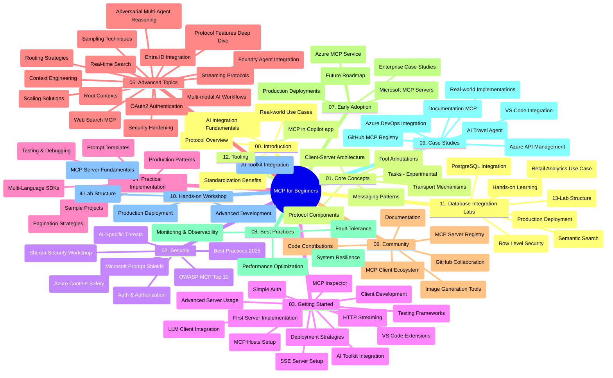

# Giao Thức Bối Cảnh Mô Hình (MCP) cho Người Mới Bắt Đầu - Hướng Dẫn Học Tập

Hướng dẫn học tập này cung cấp tổng quan về cấu trúc và nội dung kho lưu trữ cho chương trình "Giao Thức Bối Cảnh Mô Hình (MCP) cho Người Mới Bắt Đầu". Sử dụng hướng dẫn này để điều hướng kho lưu trữ một cách hiệu quả và tận dụng tối đa các tài nguyên có sẵn.

## Tổng Quan Kho Lưu Trữ

Giao Thức Bối Cảnh Mô Hình (MCP) là một khuôn khổ tiêu chuẩn hóa cho các tương tác giữa các mô hình AI và các ứng dụng khách. Ban đầu được tạo bởi Anthropic, MCP hiện được duy trì bởi cộng đồng MCP rộng hơn thông qua tổ chức chính thức trên GitHub. Kho lưu trữ này cung cấp một chương trình học tập toàn diện với các ví dụ mã thực hành bằng C#, Java, JavaScript, Python và TypeScript, dành cho các nhà phát triển AI, kiến trúc sư hệ thống và kỹ sư phần mềm.

## Bản Đồ Chương Trình Học Trực Quan

## Cấu Trúc Kho Lưu Trữ

Kho lưu trữ được tổ chức thành mười hai phần chính, mỗi phần tập trung vào các khía cạnh khác nhau của MCP:

1. **Giới Thiệu (00-Introduction/)**
   - Tổng quan về Giao Thức Bối Cảnh Mô Hình
   - Tại sao chuẩn hóa lại quan trọng trong các pipeline AI
   - Các trường hợp sử dụng thực tiễn và lợi ích

2. **Khái Niệm Cốt Lõi (01-CoreConcepts/)**
   - Kiến trúc client-server
   - Các thành phần chính của giao thức
   - Các mẫu tin nhắn trong MCP
   - Đặc tả hiện tại: [Có gì thay đổi trong MCP: Đặc tả ngày 2026-07-28](./01-CoreConcepts/mcp-2026-07-28.md) — lõi giao thức không trạng thái, khuôn khổ mở rộng, và việc loại bỏ Roots/Sampling/Logging

3. **Bảo Mật (02-Security/)**
   - Các mối đe dọa bảo mật trong hệ thống dựa trên MCP
   - Các thực hành tốt nhất để bảo vệ triển khai
   - Chiến lược xác thực và ủy quyền
   - Thực hành với [mẫu ủy quyền CIMD và DCR](./02-Security/samples/cimd-dcr-auth/README.md)
   - **Tài liệu Bảo mật Toàn diện**:
     - Thực hành bảo mật MCP tốt nhất
     - Hướng dẫn triển khai Azure Content Safety
     - Kiểm soát và kỹ thuật bảo mật MCP
     - Tóm tắt nhanh các thực hành tốt nhất MCP
   - **Các chủ đề bảo mật chính**:
     - Tấn công tiêm lệnh (prompt injection) và nhiễm độc công cụ
     - Chiếm đoạt phiên làm việc và vấn đề đại diện nhầm lẫn
     - Lỗ hổng truyền token
     - Quyền vượt mức và kiểm soát truy cập
     - Bảo mật chuỗi cung ứng cho các thành phần AI
     - Tích hợp Microsoft Prompt Shields

4. **Bắt Đầu (03-GettingStarted/)**
   - Cài đặt và cấu hình môi trường
   - Tạo máy chủ và khách MCP cơ bản
   - Tích hợp với các ứng dụng hiện có
   - Bao gồm các phần:
     - Triển khai máy chủ đầu tiên
     - Phát triển khách hàng
     - Tích hợp khách hàng LLM
     - Tích hợp VS Code
     - Máy chủ sự kiện gửi (SSE)
     - Sử dụng máy chủ nâng cao
     - Truyền tải HTTP
     - Tích hợp Bộ công cụ AI
     - Chiến lược kiểm thử
     - Hướng dẫn triển khai

5. **Triển Khai Thực Tiễn (04-PracticalImplementation/)**
   - Sử dụng SDK trên các ngôn ngữ lập trình khác nhau
   - Kỹ thuật gỡ lỗi, kiểm thử và xác thực
   - Tạo mẫu prompt và quy trình làm việc có thể tái sử dụng
   - Dự án mẫu với ví dụ triển khai

6. **Chủ Đề Nâng Cao (05-AdvancedTopics/)**
   - Kỹ thuật xây dựng bối cảnh
   - Tích hợp agent Foundry
   - Các quy trình AI đa phương thức
   - Demo xác thực OAuth2
   - Khả năng tìm kiếm thời gian thực
   - Truyền phát thời gian thực
   - Triển khai bối cảnh gốc
   - Chiến lược điều hướng
   - Kỹ thuật lấy mẫu
   - Phương pháp mở rộng
   - Các cân nhắc bảo mật
   - Tích hợp bảo mật Entra ID
   - Tích hợp tìm kiếm web
   - Lý luận đa tác nhân đối kháng (mẫu tranh luận)

7. **Đóng Góp Cộng Đồng (06-CommunityContributions/)**
   - Cách đóng góp mã và tài liệu
   - Hợp tác qua GitHub
   - Cải tiến và phản hồi do cộng đồng thúc đẩy
   - Sử dụng các khách hàng MCP khác nhau (Claude Desktop, Cline, VSCode)
   - Làm việc với các máy chủ MCP phổ biến bao gồm tạo hình ảnh

8. **Bài Học Từ Việc Áp Dụng Sớm (07-LessonsfromEarlyAdoption/)**
   - Triển khai thực tế và câu chuyện thành công
   - Xây dựng và triển khai giải pháp dựa trên MCP
   - Xu hướng và lộ trình tương lai
   - **Hướng dẫn Máy chủ MCP của Microsoft**: Hướng dẫn toàn diện cho 10 máy chủ MCP Microsoft sẵn sàng sản xuất bao gồm:
     - Máy chủ MCP tài liệu Microsoft Learn
     - Máy chủ MCP Azure (15+ kết nối chuyên biệt)
     - Máy chủ MCP GitHub
     - Máy chủ MCP Azure DevOps
     - Máy chủ MCP MarkItDown
     - Máy chủ MCP SQL Server
     - Máy chủ MCP Playwright
     - Máy chủ MCP Dev Box
     - Máy chủ MCP Microsoft Foundry
     - Máy chủ MCP Bộ công cụ Đại lý Microsoft 365

9. **Thực Hành Tốt Nhất (08-BestPractices/)**
   - Tinh chỉnh hiệu suất và tối ưu hóa
   - Thiết kế hệ thống MCP chịu lỗi
   - Chiến lược kiểm thử và độ bền

10. **Nghiên Cứu Tình Huống (09-CaseStudy/)**
    - **Bảy nghiên cứu tình huống toàn diện** thể hiện tính đa dụng của MCP trong nhiều kịch bản:
    - **Đại lý Du lịch Azure AI**: Điều phối đa tác nhân với Azure OpenAI và AI Search
    - **Tích hợp Azure DevOps**: Tự động hóa quy trình làm việc với cập nhật dữ liệu YouTube
    - **Truy xuất tài liệu thời gian thực**: Khách hàng console Python với truyền HTTP
    - **Máy phát kế hoạch học tập tương tác**: Ứng dụng web Chainlit với AI hội thoại
    - **Tài liệu trong trình chỉnh sửa**: Tích hợp VS Code với quy trình GitHub Copilot
    - **Quản lý API Azure**: Tích hợp API doanh nghiệp với tạo máy chủ MCP
    - **Đăng ký MCP GitHub**: Phát triển hệ sinh thái và nền tảng tích hợp tác nhân
    - Ví dụ triển khai trải rộng tích hợp doanh nghiệp, năng suất nhà phát triển và phát triển hệ sinh thái

11. **Hội Thảo Thực Hành (10-StreamliningAIWorkflowsBuildingAnMCPServerWithAIToolkit/)**
    - Hội thảo thực hành toàn diện kết hợp MCP với Bộ công cụ AI
    - Xây dựng ứng dụng thông minh kết nối mô hình AI với công cụ thực tế
    - Các mô-đun thực tế bao gồm nguyên tắc cơ bản, phát triển máy chủ tùy chỉnh và chiến lược triển khai sản xuất
    - **Cấu trúc phòng thí nghiệm**:
      - Phòng thí nghiệm 1: Nguyên tắc Máy chủ MCP
      - Phòng thí nghiệm 2: Phát triển Máy chủ MCP Nâng cao
      - Phòng thí nghiệm 3: Tích hợp Bộ công cụ AI
      - Phòng thí nghiệm 4: Triển khai sản xuất và mở rộng
    - Phương pháp học qua phòng thí nghiệm với hướng dẫn từng bước

12. **Phòng Thí Nghiệm Tích Hợp Cơ Sở Dữ Liệu Máy Chủ MCP (11-MCPServerHandsOnLabs/)**
    - **Lộ trình học 13 phòng thí nghiệm toàn diện** để xây dựng các máy chủ MCP sẵn sàng sản xuất với tích hợp PostgreSQL
    - **Triển khai phân tích bán lẻ thực tế** sử dụng trường hợp sử dụng Zava Retail
    - **Mẫu chuẩn cấp doanh nghiệp** bao gồm bảo mật cấp hàng (RLS), tìm kiếm ngữ nghĩa và truy cập dữ liệu đa khách thuê
    - **Cấu trúc phòng thí nghiệm hoàn chỉnh**:
      - **Phòng thí nghiệm 00-03: Nền tảng** - Giới thiệu, Kiến trúc, Bảo mật, Cài đặt môi trường
      - **Phòng thí nghiệm 04-06: Xây dựng Máy chủ MCP** - Thiết kế cơ sở dữ liệu, Triển khai Máy chủ MCP, Phát triển công cụ

      - **Thí nghiệm 07-09: Các Tính năng Nâng cao** - Tìm kiếm Ngữ nghĩa, Kiểm thử & Gỡ lỗi, Tích hợp VS Code
      - **Thí nghiệm 10-12: Sản xuất & Thực hành Tốt nhất** - Triển khai, Giám sát, Tối ưu hóa
    - **Công nghệ Bao gồm**: khung FastMCP, PostgreSQL, Azure OpenAI, Azure Container Apps, Application Insights
    - **Kết quả Học tập**: Máy chủ MCP sẵn sàng sản xuất, mẫu tích hợp cơ sở dữ liệu, phân tích hỗ trợ AI, bảo mật doanh nghiệp

13. **Công cụ (12-tooling/)**
    - Học cách sử dụng MCP trong ứng dụng Copilot và các công cụ khác

## Tài nguyên Bổ sung

Kho lưu trữ bao gồm các tài nguyên hỗ trợ:

- **Thư mục Hình ảnh**: Chứa sơ đồ và minh họa được sử dụng trong toàn bộ chương trình học
- **Dịch thuật**: Hỗ trợ đa ngôn ngữ với bản dịch tự động của tài liệu
- **Tài nguyên MCP Chính thức**:
  - [Tài liệu MCP](https://modelcontextprotocol.io/)
  - [Đặc tả MCP](https://modelcontextprotocol.io/specification/2026-07-28/)
  - [Kho lưu trữ GitHub MCP](https://github.com/modelcontextprotocol)

## Cách Sử dụng Kho lưu trữ này

1. **Học theo tuần tự**: Theo dõi các chương theo thứ tự (00 đến 11) để có trải nghiệm học tập có cấu trúc.
2. **Tập trung theo Ngôn ngữ**: Nếu bạn quan tâm đến một ngôn ngữ lập trình cụ thể, khám phá các thư mục mẫu cho các triển khai bằng ngôn ngữ bạn ưa thích.
3. **Thực hành Triển khai**: Bắt đầu với phần "Bắt đầu" để thiết lập môi trường và tạo máy chủ và khách MCP đầu tiên của bạn.
4. **Khám phá Nâng cao**: Khi đã vững cơ bản, khám phá các chủ đề nâng cao để mở rộng kiến thức.
5. **Tham gia Cộng đồng**: Tham gia cộng đồng MCP qua các thảo luận GitHub và kênh Discord để kết nối với chuyên gia và các lập trình viên đồng hành.

## Khách hàng và Công cụ MCP

Chương trình học bao gồm các khách hàng và công cụ MCP khác nhau:

1. **Khách hàng Chính thức**:
   - Visual Studio Code 
   - MCP trong Visual Studio Code
   - Claude Desktop
   - Claude trong VSCode 
   - Claude API

2. **Khách hàng Cộng đồng**:
   - Cline (dựa trên terminal)
   - Cursor (trình chỉnh sửa mã)
   - ChatMCP
   - Windsurf

3. **Công cụ Quản lý MCP**:
   - MCP CLI
   - MCP Manager
   - MCP Linker
   - MCP Router

## Máy chủ MCP Phổ biến

Kho lưu trữ giới thiệu nhiều máy chủ MCP khác nhau, bao gồm:

1. **Máy chủ MCP Chính thức của Microsoft**:
   - Microsoft Learn Docs MCP Server
   - Azure MCP Server (hơn 15 connector chuyên biệt)
   - GitHub MCP Server
   - Azure DevOps MCP Server
   - MarkItDown MCP Server
   - SQL Server MCP Server
   - Playwright MCP Server
   - Dev Box MCP Server
   - Microsoft Foundry MCP Server
   - Microsoft 365 Agents Toolkit MCP Server

2. **Máy chủ Tham khảo Chính thức**:
   - Filesystem
   - Fetch
   - Memory
   - Sequential Thinking

3. **Tạo Hình ảnh**:
   - Azure OpenAI DALL-E 3
   - Stable Diffusion WebUI
   - Replicate

4. **Công cụ Phát triển**:
   - Git MCP
   - Terminal Control
   - Code Assistant

5. **Máy chủ Chuyên biệt**:
   - Salesforce
   - Microsoft Teams
   - Jira & Confluence

## Đóng góp

Kho lưu trữ này hoan nghênh các đóng góp từ cộng đồng. Xem phần Đóng góp Cộng đồng để hướng dẫn cách đóng góp hiệu quả vào hệ sinh thái MCP.

----

*Hướng dẫn học tập này được cập nhật lần cuối vào ngày 9 tháng 9 năm 2026. Nó phản ánh đặc tả MCP
`2026-07-28`, phiên bản giao thức hiện tại. Một số ví dụ thực hành
vẫn được phiên bản rõ ràng là `2025-11-25` trong khi SDK và công cụ của chúng
áp dụng các API giao thức không trạng thái.*

---

<!-- CO-OP TRANSLATOR DISCLAIMER START -->
**Tuyên bố miễn trừ trách nhiệm**:
Tài liệu này đã được dịch bằng dịch vụ dịch thuật AI [Co-op Translator](https://github.com/Azure/co-op-translator). Mặc dù chúng tôi cố gắng đảm bảo độ chính xác, xin lưu ý rằng bản dịch tự động có thể chứa lỗi hoặc sai sót. Tài liệu gốc bằng ngôn ngữ gốc nên được coi là nguồn tin chính thức. Đối với thông tin quan trọng, nên sử dụng dịch vụ dịch thuật chuyên nghiệp bởi con người. Chúng tôi không chịu trách nhiệm về bất kỳ hiểu lầm hoặc giải thích sai nào phát sinh từ việc sử dụng bản dịch này.
<!-- CO-OP TRANSLATOR DISCLAIMER END -->