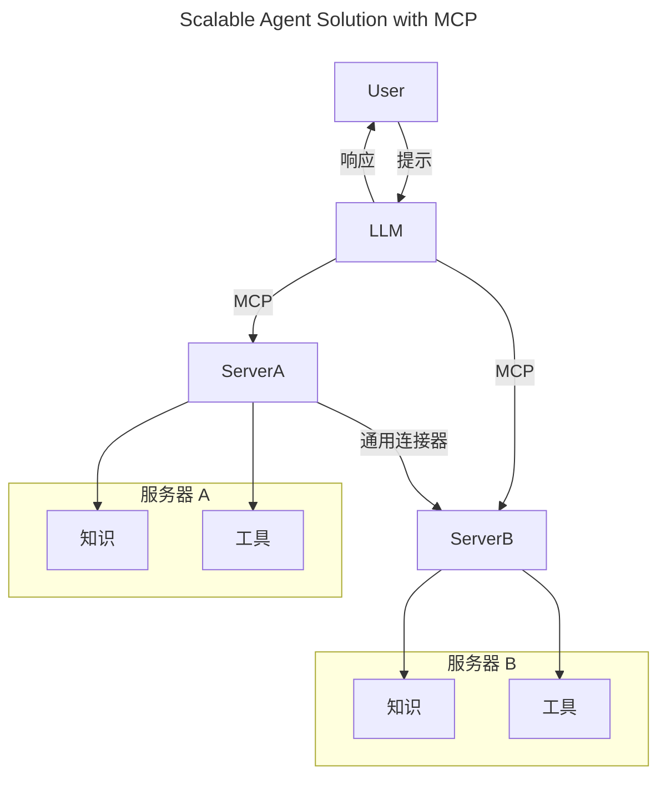
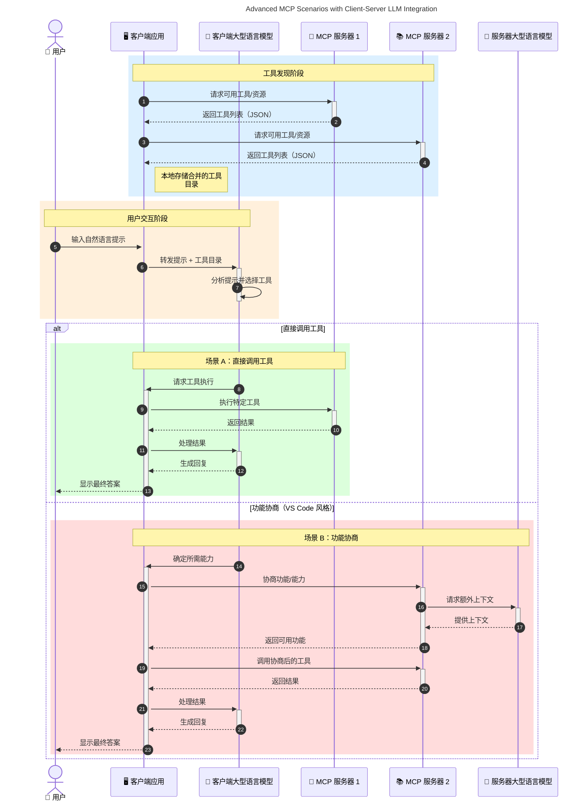

# 模型上下文协议（MCP）简介：为什么它对可扩展的 AI 应用至关重要

[](https://youtu.be/agBbdiOPLQA)

_(点击上方图片观看本课视频)_

生成式 AI 应用是一个重要的进步，因为它们通常允许用户使用自然语言提示与应用交互。然而，随着对这些应用投入更多时间和资源，您需要确保能够轻松地整合功能和资源，使其易于扩展，能够支持多个模型的使用，并处理各种模型的细节问题。简而言之，构建生成式 AI 应用起步很简单，但随着其增长和复杂化，您需要开始定义架构，并可能需要依赖一个标准以确保应用的一致构建。这就是 MCP 的作用所在，它负责组织和提供标准。

---

## **🔍 什么是模型上下文协议（MCP）？**

**模型上下文协议（MCP）** 是一个 **开放的、标准化的接口**，允许大型语言模型（LLM）无缝地与外部工具、API 及数据源交互。它提供了一致的架构，增强 AI 模型在训练数据之外的功能，使 AI 系统更智能、可扩展且响应更迅速。

---

## **🎯 为什么 AI 标准化至关重要**

随着生成式 AI 应用变得更加复杂，采用能够保证<strong>可扩展性、可扩展性、可维护性</strong>及<strong>避免供应商锁定</strong>的标准变得必不可少。MCP 通过以下方式满足这些需求：

- 统一模型与工具的集成
- 减少脆弱且孤立的定制方案
- 允许多个不同供应商的模型共存于同一生态系统中

**注意：** 虽然 MCP 自称为开放标准，但目前无计划通过如 IEEE、IETF、W3C、ISO 或任何其他标准化机构来进行标准化。

---

## **📚 学习目标**

阅读完本文后，您将能够：

- 定义 **模型上下文协议（MCP）** 及其用例
- 理解 MCP 如何标准化模型与工具的通信
- 识别 MCP 架构的核心组件
- 探索 MCP 在企业和开发场景中的实际应用

---

## **💡 为什么模型上下文协议（MCP）是一个变革者**

### **🔗 MCP 解决了 AI 交互的碎片化问题**

在 MCP 之前，模型与工具的集成需要：

- 针对每个工具与模型对编写定制代码
- 每个供应商使用非标准化 API
- 因更新频繁导致系统中断
- 难以随着更多工具增加而扩展

### **✅ MCP 标准化的好处**

| <strong>好处</strong>                  | <strong>描述</strong>                                                              |
|--------------------------|----------------------------------------------------------------------|
| 互操作性                 | LLM 能够无缝工作于不同供应商的工具之间                            |
| 一致性                   | 跨平台和工具的统一行为                                              |
| 可复用性                 | 工具构建一次可用于多个项目和系统                                   |
| 加速开发                 | 通过标准化、即插即用接口减少开发时间                              |

---

## **🧱 MCP 高层架构概述**

MCP 遵循 **客户端-服务器模型**，其中：

- **MCP 主机** 运行 AI 模型
- **MCP 客户端** 发起请求
- **MCP 服务器** 提供上下文、工具及功能

### **关键组件：**

- <strong>资源</strong> — 模型使用的静态或动态数据  
- <strong>提示</strong> — 用于引导生成的预定义工作流  
- <strong>工具</strong> — 可执行的功能，例如搜索、计算  
- <strong>采样</strong> — 通过递归交互实现的代理行为（在 MCP `2026-07-28` 中弃用；新实现应直接整合 LLM 供应商）


- <strong>引导</strong> — 服务器发起的用户输入请求
- <strong>根目录</strong> — 与服务器相关的信息文件系统位置（在 MCP `2026-07-28` 中弃用；建议使用工具参数、资源 URI 或服务器配置）


- <strong>数据层</strong>：JSON-RPC 2.0 消息、每请求元数据、发现及协议原语
- <strong>传输层</strong>：本地子进程使用 stdio，远程服务器使用可流式 HTTP。可流式 HTTP 可用 SSE 帧传输流响应，但旧的 HTTP+SSE 传输已弃用。


---

## MCP 服务器如何工作

MCP 服务器按以下方式运行：

- <strong>请求流程</strong>：
    1. 由终端用户或其代表的软件发起请求。
    2. **MCP 客户端** 将请求发送至管理 AI 模型运行时的 **MCP 主机**。
    3. **AI 模型** 接收用户提示，可能通过一个或多个工具调用请求访问外部工具或数据。
    4. 不是模型直接，而是 **MCP 主机** 使用标准化协议与相应的 **MCP 服务器** 通信。
- **MCP 主机功能**：
    - <strong>工具注册表</strong>：维护可用工具及其功能目录。
    - <strong>认证</strong>：验证工具访问权限。
    - <strong>请求处理程序</strong>：处理模型发出的工具请求。
    - <strong>响应格式化器</strong>：将工具输出结构化成模型可理解的格式。
- **MCP 服务器执行**：
    - **MCP 主机** 将工具调用路由到一个或多个提供特定功能（如搜索、计算、数据库查询）的 **MCP 服务器**。
    - **MCP 服务器** 执行操作并以一致的格式将结果返回给 **MCP 主机**。
    - **MCP 主机** 格式化并转交结果给 **AI 模型**。
- <strong>响应完成</strong>：
    - **AI 模型** 将工具输出整合进最终响应。
    - **MCP 主机** 将响应发送回 **MCP 客户端**，后者传递给终端用户或调用软件。
    

```mermaid
---
title: MCP Architecture and Component Interactions
description: A diagram showing the flows of the components in MCP.
---
graph TD
    Client[MCP 客户端/应用程序] -->|发送请求| H[MCP 主机]
    H -->|调用| A[AI 模型]
    A -->|工具调用请求| H
    H -->|MCP Protocol| T1[MCP Server Tool 01: 网络搜索]
    H -->|MCP Protocol| T2[MCP Server Tool 02: 计算器工具]
    H -->|MCP Protocol| T3[MCP Server Tool 03: 数据库访问工具]
    H -->|MCP Protocol| T4[MCP Server Tool 04: 文件系统工具]
    H -->|发送响应| Client

    subgraph “MCP 主机组件”
        H
        G[工具注册表]
        I[认证]
        J[请求处理器]
        K[响应格式化器]
    end

    H <--> G
    H <--> I
    H <--> J
    H <--> K

    style A fill:#f9d5e5,stroke:#333,stroke-width:2px
    style H fill:#eeeeee,stroke:#333,stroke-width:2px
    style Client fill:#d5e8f9,stroke:#333,stroke-width:2px
    style G fill:#fffbe6,stroke:#333,stroke-width:1px
    style I fill:#fffbe6,stroke:#333,stroke-width:1px
    style J fill:#fffbe6,stroke:#333,stroke-width:1px
    style K fill:#fffbe6,stroke:#333,stroke-width:1px
    style T1 fill:#c2f0c2,stroke:#333,stroke-width:1px
    style T2 fill:#c2f0c2,stroke:#333,stroke-width:1px
    style T3 fill:#c2f0c2,stroke:#333,stroke-width:1px
    style T4 fill:#c2f0c2,stroke:#333,stroke-width:1px
```

## 👨‍💻 如何构建 MCP 服务器（含示例）

MCP 服务器让您通过提供数据和功能扩展 LLM 能力。 

准备试一试吗？以下是不同语言/技术栈的 SDK 和创建简单 MCP 服务器的示例：

- **Python SDK**: https://github.com/modelcontextprotocol/python-sdk

- **TypeScript SDK**: https://github.com/modelcontextprotocol/typescript-sdk

- **Java SDK**: https://github.com/modelcontextprotocol/java-sdk

- **C#/.NET SDK**: https://github.com/modelcontextprotocol/csharp-sdk


## 🌍 MCP 的实际应用场景

MCP 通过扩展 AI 能力使各种应用成为可能：

| <strong>应用</strong>                  | <strong>描述</strong>                                                              |
|--------------------------|----------------------------------------------------------------------|
| 企业数据集成            | 将 LLM 连接到数据库、CRM 或内部工具                                     |
| 代理式 AI 系统          | 赋能自主代理具备访问工具和决策流程能力                                  |
| 多模态应用              | 在统一 AI 应用中结合文本、图像和音频工具                                  |
| 实时数据集成            | 将实时数据引入 AI 交互，实现更准确、时效性强的输出                        |


### 🧠 MCP = AI 交互的通用标准

模型上下文协议（MCP）是 AI 交互的通用标准，就像 USB-C 标准化了设备的物理连接一样。在 AI 领域，MCP 提供了一致的接口，使模型（客户端）能够无缝集成外部工具和数据提供者（服务器）。这消除了为每个 API 或数据源编写自定义协议的需求。

在 MCP 中，一个兼容 MCP 的工具（称为 MCP 服务器）遵循统一标准。这些服务器可以列出它们提供的工具或动作，并在 AI 代理请求时执行这些动作。支持 MCP 的 AI 代理平台能够发现服务器上可用的工具，并通过该标准协议调用它们。

### 💡 促进知识访问

除了提供工具外，MCP 还促进知识访问。它使应用能够通过链接各种数据源向大型语言模型（LLM）提供上下文。例如，一个 MCP 服务器可以代表公司的文档库，使代理能够按需检索相关信息。另一台服务器可能处理特定动作，如发送电子邮件或更新记录。从代理角度看，这些都是它可以使用的工具——一些工具返回数据（知识上下文），另一些执行动作。MCP 高效管理这些功能。

连接到 MCP 服务器的代理可以通过标准格式自动了解服务器的可用功能和可访问信息。这种标准化支持工具动态可用性。例如，将新的 MCP 服务器添加到代理系统后，其功能即可立即使用，无需进一步定制代理指令。

此简化的集成流程如下面的示意图所示，服务器既提供工具也提供知识，确保系统间的无缝协作。

### 👉 示例：可扩展的代理解决方案


 通用连接器使 MCP 服务器能够相互通信和共享能力，允许 ServerA 将任务委派给 ServerB 或访问其工具与知识。这种跨服务器的工具和数据联邦支持可扩展且模块化的代理架构。由于 MCP 标准化了工具暴露，代理可以动态发现并在服务器间路由请求，无需硬编码集成。


工具和知识联邦：跨服务器访问工具和数据，实现更具扩展性和模块化的代理架构。

### 🔄 具有客户端 LLM 集成的高级 MCP 场景

除了基本的 MCP 架构外，还有高级场景，客户端和服务器均包含 LLM，支持更复杂的交互。下图中，<strong>客户端应用</strong> 可能是一个集成了多个 MCP 工具供 LLM 使用的 IDE：



## 🔐 MCP 的实际好处

使用 MCP 的实际优势包括：

- <strong>信息新鲜度</strong>：模型可以访问训练数据之外的最新信息
- <strong>能力扩展</strong>：模型可以利用专用工具处理未训练过的任务
- <strong>减少幻觉</strong>：外部数据源提供事实依据
- <strong>隐私保护</strong>：敏感数据可保留在安全环境中，而非嵌入提示中

## 📌 关键要点

MCP 使用的关键要点包括：

- **MCP** 标准化 AI 模型与工具和数据的交互方式
- 促进<strong>可扩展性、一致性和互操作性</strong>
- MCP 有助于<strong>缩短开发时间，提高可靠性，扩展模型能力</strong>
- 客户端-服务器架构<strong>支持灵活、可扩展的 AI 应用</strong>

## 🧠 练习

思考一个您感兴趣的 AI 应用。

- 哪些 <strong>外部工具或数据</strong> 能增强其能力？
- MCP 如何使集成更<strong>简单且可靠</strong>？

## 额外资源

- [MCP GitHub 仓库](https://github.com/modelcontextprotocol)


## 接下来

下一章：[第 1 章：核心概念](../01-CoreConcepts/README.md)

---

<!-- CO-OP TRANSLATOR DISCLAIMER START -->
**免责声明**：
本文件由 AI 翻译服务 [Co-op Translator](https://github.com/Azure/co-op-translator) 翻译完成。尽管我们力求准确，但请注意，自动翻译可能包含错误或不准确之处。原始语言版文件应视为权威来源。对于重要信息，建议使用专业人工翻译。我们对因使用本翻译而产生的任何误解或误释不承担责任。
<!-- CO-OP TRANSLATOR DISCLAIMER END -->