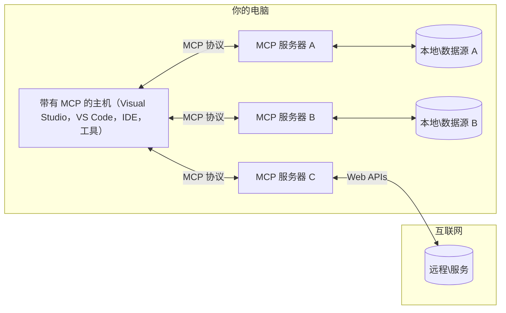

# MCP 核心概念：掌握用于 AI 集成的模型上下文协议

[](https://youtu.be/earDzWGtE84)

_(点击上方图片观看本课视频)_

[模型上下文协议 (MCP)](https://github.com/modelcontextprotocol) 是一个强大且标准化的框架，优化大型语言模型（LLM）与外部工具、应用程序和数据源之间的通信。  
本指南将带您了解 MCP 的核心概念。您将学习其客户端-服务器架构、关键组件、通信机制及实现最佳实践。

- **明确的用户同意**：所有数据访问和操作均需在执行前获得用户明确批准。用户必须清楚了解将访问哪些数据以及将执行哪些操作，并对权限和授权进行细粒度控制。

- **数据隐私保护**：用户数据仅在明确同意下暴露，并且必须在整个交互生命周期中通过强有力的访问控制加以保护。实现必须防止未经授权的数据传输并保持严格的隐私边界。

- **工具执行安全**：每次工具调用均需用户明确同意，且用户需清楚了解工具的功能、参数及潜在影响。必须建立强健的安全边界，防止意外、不安全或恶意的工具执行。

- **传输层安全**：所有通信通道应使用适当的加密和认证机制。远程连接应实现安全传输协议和妥善的凭证管理。

#### 实现指南：

- **权限管理**：实现细粒度权限系统，允许用户控制可访问的服务器、工具和资源  
- **认证与授权**：使用安全认证方法（OAuth、API 密钥），并妥善管理令牌及其过期  
- **输入验证**：根据定义的模式验证所有参数和数据输入，防止注入攻击  
- **审计日志**：维护全面的操作日志以支持安全监控和合规性

## 概述

本课探讨构成模型上下文协议（MCP）生态系统的基础架构和组件。您将了解客户端-服务器架构、关键组件及驱动 MCP 交互的通信机制。

## 关键学习目标

完成本课后，您将能够：

- 理解 MCP 的客户端-服务器架构。  
- 识别主机、客户端和服务器的角色与职责。  
- 分析使 MCP 成为灵活集成层的核心特性。  
- 学习 MCP 生态系统内信息的流动方式。  
- 通过 .NET、Java、Python 和 JavaScript 的代码示例获得实用见解。

## MCP 架构：深入解析

MCP 生态系统基于客户端-服务器模型构建。该模块化结构使 AI 应用能够高效地与工具、数据库、API 及上下文资源交互。让我们将此架构拆解为核心组件。

MCP 核心遵循客户端-服务器架构，主机应用可连接多个服务器：


- **MCP 主机**：如 VSCode、Claude Desktop、IDE 或希望通过 MCP 访问数据的 AI 工具  
- **MCP 客户端**：与服务器保持一对一连接的协议客户端  
- **MCP 服务器**：通过标准化模型上下文协议暴露特定功能的轻量级程序  
- **本地数据源**：您的计算机文件、数据库和 MCP 服务器可安全访问的服务  
- **远程服务**：通过互联网可访问的外部系统，MCP 服务器可通过 API 连接

MCP 协议是一个不断演进的标准，采用基于日期的版本控制（YYYY-MM-DD 格式）。当前协议版本为 **2025-11-25**。您可以查看最新的[协议规范](https://modelcontextprotocol.io/specification/2025-11-25/)

### 1. 主机

在模型上下文协议（MCP）中，**主机**是 AI 应用，作为用户与协议交互的主要界面。主机通过为每个服务器连接创建专用 MCP 客户端，协调和管理与多个 MCP 服务器的连接。主机示例包括：

- **AI 应用**：Claude Desktop、Visual Studio Code、Claude Code  
- **开发环境**：集成 MCP 的 IDE 和代码编辑器  
- **定制应用**：专门构建的 AI 代理和工具

**主机**是协调 AI 模型交互的应用。它们：

- **编排 AI 模型**：执行或与 LLM 交互以生成响应并协调 AI 工作流  
- **管理客户端连接**：为每个 MCP 服务器连接创建并维护一个 MCP 客户端  
- **控制用户界面**：处理对话流程、用户交互和响应展示  
- **执行安全控制**：管理权限、安全约束和认证  
- **处理用户同意**：管理用户对数据共享和工具执行的批准

### 2. 客户端

**客户端**是关键组件，维护主机与 MCP 服务器之间的专用一对一连接。每个 MCP 客户端由主机实例化以连接特定 MCP 服务器，确保通信通道有序且安全。多个客户端使主机能够同时连接多个服务器。

**客户端**是主机应用内的连接器组件。它们：

- **协议通信**：向服务器发送带有提示和指令的 JSON-RPC 2.0 请求  
- **功能协商**：在初始化时与服务器协商支持的功能和协议版本  
- **工具执行**：管理模型的工具执行请求并处理响应  
- **实时更新**：处理来自服务器的通知和实时更新  
- **响应处理**：处理并格式化服务器响应以展示给用户

### 3. 服务器

**服务器**是向 MCP 客户端提供上下文、工具和功能的程序。它们可以本地运行（与主机同一台机器）或远程运行（在外部平台），负责处理客户端请求并提供结构化响应。服务器通过标准化的模型上下文协议暴露特定功能。

**服务器**是提供上下文和功能的服务。它们：

- **功能注册**：向客户端注册并暴露可用的原语（资源、提示、工具）  
- **请求处理**：接收并执行来自客户端的工具调用、资源请求和提示请求  
- **上下文提供**：提供上下文信息和数据以增强模型响应  
- **状态管理**：维护会话状态并在需要时处理有状态交互  
- **实时通知**：向连接的客户端发送关于功能变更和更新的通知

任何人都可以开发服务器以通过专门功能扩展模型能力，且支持本地和远程部署场景。

### 4. 服务器原语

模型上下文协议（MCP）中的服务器提供三种核心**原语**，定义了客户端、主机和语言模型之间丰富交互的基本构建块。这些原语指定了协议可用的上下文信息和操作类型。

MCP 服务器可以暴露以下三种核心原语的任意组合：

#### 资源

**资源**是为 AI 应用提供上下文信息的数据源。它们代表可增强模型理解和决策的静态或动态内容：

- **上下文数据**：供 AI 模型使用的结构化信息和上下文  
- **知识库**：文档库、文章、手册和研究论文  
- **本地数据源**：文件、数据库和本地系统信息  
- **外部数据**：API 响应、网络服务和远程系统数据  
- **动态内容**：基于外部条件实时更新的数据

资源通过 URI 标识，支持通过 `resources/list` 发现和通过 `resources/read` 检索：

```text
file://documents/project-spec.md
database://production/users/schema
api://weather/current
```

#### 提示

**提示**是可重用的模板，帮助构建与语言模型的交互。它们提供标准化的交互模式和模板化工作流：

- **基于模板的交互**：预结构化的消息和对话启动器  
- **工作流模板**：常见任务和交互的标准化序列  
- **少量示例**：基于示例的模型指令模板  
- **系统提示**：定义模型行为和上下文的基础提示  
- **动态模板**：可根据特定上下文调整的参数化提示

提示支持变量替换，可通过 `prompts/list` 发现并通过 `prompts/get` 获取：

```markdown
Generate a {{task_type}} for {{product}} targeting {{audience}} with the following requirements: {{requirements}}
```

#### 工具

**工具**是 AI 模型可调用以执行特定操作的可执行函数。它们代表 MCP 生态系统中的“动词”，使模型能够与外部系统交互：

- **可执行函数**：模型可调用的带有特定参数的离散操作  
- **外部系统集成**：API 调用、数据库查询、文件操作、计算  
- **唯一标识**：每个工具具有独特名称、描述和参数模式  
- **结构化输入输出**：工具接受验证过的参数并返回结构化、类型化的响应  
- **操作能力**：使模型能够执行现实世界操作并检索实时数据

工具通过 JSON Schema 定义参数验证，支持通过 `tools/list` 发现并通过 `tools/call` 执行：

```typescript
server.tool(
  "search_products", 
  {
    query: z.string().describe("Search query for products"),
    category: z.string().optional().describe("Product category filter"),
    max_results: z.number().default(10).describe("Maximum results to return")
  }, 
  async (params) => {
    // 执行搜索并返回结构化结果
    return await productService.search(params);
  }
);
```

## 客户端原语

在模型上下文协议（MCP）中，**客户端**可以暴露原语，使服务器能够请求主机应用的额外功能。这些客户端原语允许更丰富、更交互的服务器实现，能够访问 AI 模型能力和用户交互。

### 采样

**采样**允许服务器从客户端的 AI 应用请求语言模型补全。此原语使服务器无需嵌入自身模型依赖即可访问 LLM 能力：

- **模型无关访问**：服务器可请求补全，无需包含 LLM SDK 或管理模型访问  
- **服务器发起的 AI**：使服务器能够自主使用客户端的 AI 模型生成内容  
- **递归 LLM 交互**：支持服务器需要 AI 协助处理的复杂场景  
- **动态内容生成**：允许服务器使用主机模型创建上下文响应

采样通过 `sampling/complete` 方法发起，服务器向客户端发送补全请求。

### 诱导

**诱导**使服务器能够通过客户端界面请求用户提供额外信息或确认：

- **用户输入请求**：服务器在执行工具时需要额外信息时可请求  
- **确认对话框**：请求用户批准敏感或影响较大的操作  
- **交互式工作流**：使服务器能够创建逐步用户交互  
- **动态参数收集**：在工具执行过程中收集缺失或可选参数

诱导请求通过 `elicitation/request` 方法发出，通过客户端界面收集用户输入。

### 日志记录

**日志记录**允许服务器向客户端发送结构化日志消息，用于调试、监控和操作可见性：

- **调试支持**：使服务器能够提供详细执行日志以便排查问题  
- **操作监控**：向客户端发送状态更新和性能指标  
- **错误报告**：提供详细错误上下文和诊断信息  
- **审计追踪**：创建服务器操作和决策的全面日志

日志消息发送给客户端，以提供服务器操作透明度并促进调试。

## MCP 中的信息流

模型上下文协议（MCP）定义了主机、客户端、服务器和模型之间结构化的信息流。理解此流有助于澄清用户请求的处理方式以及外部工具和数据如何集成到模型响应中。

- **主机发起连接**  
  主机应用（如 IDE 或聊天界面）建立与 MCP 服务器的连接，通常通过 STDIO、WebSocket 或其他支持的传输方式。

- **功能协商**  
  嵌入主机的客户端与服务器交换支持的功能、工具、资源和协议版本信息，确保双方了解会话可用的能力。

- **用户请求**  
  用户与主机交互（例如输入提示或命令）。主机收集输入并传递给客户端处理。

- **资源或工具使用**  
  - 客户端可能请求服务器提供额外上下文或资源（如文件、数据库条目或知识库文章）以丰富模型理解。  
  - 如果模型判断需要工具（例如获取数据、执行计算或调用 API），客户端向服务器发送工具调用请求，指定工具名称和参数。

- **服务器执行**  
  服务器接收资源或工具请求，执行必要操作（如运行函数、查询数据库或检索文件），并以结构化格式将结果返回客户端。

- **响应生成**  
  客户端将服务器响应（资源数据、工具输出等）整合到持续的模型交互中。模型利用这些信息生成全面且上下文相关的响应。

- **结果呈现**  
  主机接收客户端的最终输出并展示给用户，通常包括模型生成的文本及工具执行或资源查找的结果。

此流程使 MCP 能够通过无缝连接模型与外部工具和数据源，支持高级、交互式和上下文感知的 AI 应用。

## 协议架构与层次

MCP 由两个不同的架构层组成，共同提供完整的通信框架：

### 数据层

**数据层**使用 **JSON-RPC 2.0** 作为基础实现 MCP 核心协议。该层定义消息结构、语义和交互模式：

#### 核心组件：

- **JSON-RPC 2.0 协议**：所有通信均使用标准化的 JSON-RPC 2.0 消息格式进行方法调用、响应和通知
- **生命周期管理**：处理客户端和服务器之间的连接初始化、能力协商和会话终止
- **服务器原语**：通过工具、资源和提示使服务器提供核心功能
- **客户端原语**：使服务器能够请求LLM采样、引导用户输入和发送日志消息
- **实时通知**：支持异步通知，实现动态更新而无需轮询

#### 主要特性：

- **协议版本协商**：使用基于日期的版本控制（YYYY-MM-DD）以确保兼容性
- **能力发现**：客户端和服务器在初始化期间交换支持的功能信息
- **有状态会话**：在多次交互中维护连接状态以保持上下文连续性

### 传输层

**传输层**管理MCP参与者之间的通信通道、消息分帧和身份验证：

#### 支持的传输机制：

1. **STDIO传输**：
   - 使用标准输入/输出流进行直接进程通信
   - 适用于同一台机器上的本地进程，无网络开销
   - 常用于本地MCP服务器实现

2. **可流式HTTP传输**：
   - 使用HTTP POST进行客户端到服务器的消息传递  
   - 可选的服务器发送事件（SSE）用于服务器到客户端的流式传输
   - 支持跨网络的远程服务器通信
   - 支持标准HTTP身份验证（承载令牌、API密钥、自定义头）
   - MCP推荐使用OAuth进行安全的基于令牌的身份验证

#### 传输抽象：

传输层将通信细节从数据层抽象出来，使所有传输机制均使用相同的JSON-RPC 2.0消息格式。此抽象允许应用程序无缝切换本地和远程服务器。

### 安全考虑

MCP实现必须遵守若干关键安全原则，以确保所有协议操作中的交互安全、可信和可靠：

- **用户同意与控制**：在访问任何数据或执行操作之前，必须获得用户的明确同意。用户应清楚控制共享哪些数据和授权哪些操作，并通过直观的用户界面审查和批准活动。

- **数据隐私**：用户数据仅在明确同意下暴露，且必须通过适当的访问控制进行保护。MCP实现必须防止未经授权的数据传输，确保所有交互中的隐私得到维护。

- **工具安全**：调用任何工具前必须获得明确的用户同意。用户应清楚了解每个工具的功能，并强制执行严格的安全边界，防止意外或不安全的工具执行。

通过遵循这些安全原则，MCP确保在所有协议交互中维护用户信任、隐私和安全，同时支持强大的AI集成。

## 代码示例：关键组件

以下是几个流行编程语言的代码示例，展示如何实现关键的MCP服务器组件和工具。

### .NET示例：创建简单的MCP服务器及工具

这是一个实用的.NET代码示例，演示如何实现带有自定义工具的简单MCP服务器。示例展示了如何定义和注册工具、处理请求以及使用模型上下文协议连接服务器。

```csharp
using System;
using System.Threading.Tasks;
using ModelContextProtocol.Server;
using ModelContextProtocol.Server.Transport;
using ModelContextProtocol.Server.Tools;

public class WeatherServer
{
    public static async Task Main(string[] args)
    {
        // Create an MCP server
        var server = new McpServer(
            name: "Weather MCP Server",
            version: "1.0.0"
        );
        
        // Register our custom weather tool
        server.AddTool<string, WeatherData>("weatherTool", 
            description: "Gets current weather for a location",
            execute: async (location) => {
                // Call weather API (simplified)
                var weatherData = await GetWeatherDataAsync(location);
                return weatherData;
            });
        
        // Connect the server using stdio transport
        var transport = new StdioServerTransport();
        await server.ConnectAsync(transport);
        
        Console.WriteLine("Weather MCP Server started");
        
        // Keep the server running until process is terminated
        await Task.Delay(-1);
    }
    
    private static async Task<WeatherData> GetWeatherDataAsync(string location)
    {
        // This would normally call a weather API
        // Simplified for demonstration
        await Task.Delay(100); // Simulate API call
        return new WeatherData { 
            Temperature = 72.5,
            Conditions = "Sunny",
            Location = location
        };
    }
}

public class WeatherData
{
    public double Temperature { get; set; }
    public string Conditions { get; set; }
    public string Location { get; set; }
}
```

### Java示例：MCP服务器组件

此示例演示与上述.NET示例相同的MCP服务器和工具注册，但用Java实现。

```java
import io.modelcontextprotocol.server.McpServer;
import io.modelcontextprotocol.server.McpToolDefinition;
import io.modelcontextprotocol.server.transport.StdioServerTransport;
import io.modelcontextprotocol.server.tool.ToolExecutionContext;
import io.modelcontextprotocol.server.tool.ToolResponse;

public class WeatherMcpServer {
    public static void main(String[] args) throws Exception {
        // 创建一个MCP服务器
        McpServer server = McpServer.builder()
            .name("Weather MCP Server")
            .version("1.0.0")
            .build();
            
        // 注册一个天气工具
        server.registerTool(McpToolDefinition.builder("weatherTool")
            .description("Gets current weather for a location")
            .parameter("location", String.class)
            .execute((ToolExecutionContext ctx) -> {
                String location = ctx.getParameter("location", String.class);
                
                // 获取天气数据（简化版）
                WeatherData data = getWeatherData(location);
                
                // 返回格式化的响应
                return ToolResponse.content(
                    String.format("Temperature: %.1f°F, Conditions: %s, Location: %s", 
                    data.getTemperature(), 
                    data.getConditions(), 
                    data.getLocation())
                );
            })
            .build());
        
        // 使用stdio传输连接服务器
        try (StdioServerTransport transport = new StdioServerTransport()) {
            server.connect(transport);
            System.out.println("Weather MCP Server started");
            // 保持服务器运行直到进程终止
            Thread.currentThread().join();
        }
    }
    
    private static WeatherData getWeatherData(String location) {
        // 实现将调用天气API
        // 为示例目的简化处理
        return new WeatherData(72.5, "Sunny", location);
    }
}

class WeatherData {
    private double temperature;
    private String conditions;
    private String location;
    
    public WeatherData(double temperature, String conditions, String location) {
        this.temperature = temperature;
        this.conditions = conditions;
        this.location = location;
    }
    
    public double getTemperature() {
        return temperature;
    }
    
    public String getConditions() {
        return conditions;
    }
    
    public String getLocation() {
        return location;
    }
}
```

### Python示例：构建MCP服务器

此示例使用fastmcp，请确保先安装它：

```python
pip install fastmcp
```
代码示例：

```python
#!/usr/bin/env python3
import asyncio
from fastmcp import FastMCP
from fastmcp.transports.stdio import serve_stdio

# 创建一个 FastMCP 服务器
mcp = FastMCP(
    name="Weather MCP Server",
    version="1.0.0"
)

@mcp.tool()
def get_weather(location: str) -> dict:
    """Gets current weather for a location."""
    return {
        "temperature": 72.5,
        "conditions": "Sunny",
        "location": location
    }

# 使用类的替代方法
class WeatherTools:
    @mcp.tool()
    def forecast(self, location: str, days: int = 1) -> dict:
        """Gets weather forecast for a location for the specified number of days."""
        return {
            "location": location,
            "forecast": [
                {"day": i+1, "temperature": 70 + i, "conditions": "Partly Cloudy"}
                for i in range(days)
            ]
        }

# 注册类工具
weather_tools = WeatherTools()

# 启动服务器
if __name__ == "__main__":
    asyncio.run(serve_stdio(mcp))
```

### JavaScript示例：创建MCP服务器

此示例展示了如何用JavaScript创建MCP服务器以及如何注册两个与天气相关的工具。

```javascript
// 使用官方的模型上下文协议 SDK
import { McpServer } from "@modelcontextprotocol/sdk/server/mcp.js";
import { StdioServerTransport } from "@modelcontextprotocol/sdk/server/stdio.js";
import { z } from "zod"; // 用于参数验证

// 创建一个 MCP 服务器
const server = new McpServer({
  name: "Weather MCP Server",
  version: "1.0.0"
});

// 定义一个天气工具
server.tool(
  "weatherTool",
  {
    location: z.string().describe("The location to get weather for")
  },
  async ({ location }) => {
    // 这通常会调用天气 API
    // 为演示简化
    const weatherData = await getWeatherData(location);
    
    return {
      content: [
        { 
          type: "text", 
          text: `Temperature: ${weatherData.temperature}°F, Conditions: ${weatherData.conditions}, Location: ${weatherData.location}` 
        }
      ]
    };
  }
);

// 定义一个预报工具
server.tool(
  "forecastTool",
  {
    location: z.string(),
    days: z.number().default(3).describe("Number of days for forecast")
  },
  async ({ location, days }) => {
    // 这通常会调用天气 API
    // 为演示简化
    const forecast = await getForecastData(location, days);
    
    return {
      content: [
        { 
          type: "text", 
          text: `${days}-day forecast for ${location}: ${JSON.stringify(forecast)}` 
        }
      ]
    };
  }
);

// 辅助函数
async function getWeatherData(location) {
  // 模拟 API 调用
  return {
    temperature: 72.5,
    conditions: "Sunny",
    location: location
  };
}

async function getForecastData(location, days) {
  // 模拟 API 调用
  return Array.from({ length: days }, (_, i) => ({
    day: i + 1,
    temperature: 70 + Math.floor(Math.random() * 10),
    conditions: i % 2 === 0 ? "Sunny" : "Partly Cloudy"
  }));
}

// 使用 stdio 传输连接服务器
const transport = new StdioServerTransport();
server.connect(transport).catch(console.error);

console.log("Weather MCP Server started");
```

此JavaScript示例演示如何创建连接服务器的MCP客户端，发送提示并处理响应，包括任何调用的工具。

## 安全与授权

MCP包含若干内置概念和机制，用于管理协议中的安全和授权：

1. **工具权限控制**：  
  客户端可指定模型在会话期间允许使用的工具，确保仅访问明确授权的工具，降低意外或不安全操作的风险。权限可根据用户偏好、组织策略或交互上下文动态配置。

2. **身份验证**：  
  服务器可要求身份验证后才允许访问工具、资源或敏感操作。可能涉及API密钥、OAuth令牌或其他身份验证方案。正确的身份验证确保只有受信任的客户端和用户能调用服务器端功能。

3. **验证**：  
  对所有工具调用执行参数验证。每个工具定义其参数的预期类型、格式和约束，服务器据此验证传入请求。防止格式错误或恶意输入影响工具实现，维护操作完整性。

4. **速率限制**：  
  为防止滥用并确保服务器资源公平使用，MCP服务器可对工具调用和资源访问实施速率限制。速率限制可按用户、会话或全局应用，帮助防御拒绝服务攻击或过度资源消耗。

通过结合这些机制，MCP为将语言模型与外部工具和数据源集成提供安全基础，同时赋予用户和开发者对访问和使用的细粒度控制。

## 协议消息与通信流程

MCP通信使用结构化的**JSON-RPC 2.0**消息，促进主机、客户端和服务器之间清晰可靠的交互。协议定义了不同操作类型的特定消息模式：

### 核心消息类型：

#### **初始化消息**
- **`initialize`请求**：建立连接并协商协议版本和能力
- **`initialize`响应**：确认支持的功能和服务器信息  
- **`notifications/initialized`**：表示初始化完成，会话准备就绪

#### **发现消息**
- **`tools/list`请求**：发现服务器可用工具
- **`resources/list`请求**：列出可用资源（数据源）
- **`prompts/list`请求**：获取可用提示模板

#### **执行消息**  
- **`tools/call`请求**：执行指定工具并传入参数
- **`resources/read`请求**：检索特定资源内容
- **`prompts/get`请求**：获取提示模板及可选参数

#### **客户端消息**
- **`sampling/complete`请求**：服务器请求客户端进行LLM补全
- **`elicitation/request`**：服务器通过客户端界面请求用户输入
- **日志消息**：服务器向客户端发送结构化日志消息

#### **通知消息**
- **`notifications/tools/list_changed`**：服务器通知客户端工具列表变更
- **`notifications/resources/list_changed`**：服务器通知客户端资源列表变更  
- **`notifications/prompts/list_changed`**：服务器通知客户端提示列表变更

### 消息结构：

所有MCP消息遵循JSON-RPC 2.0格式：
- **请求消息**：包含`id`、`method`和可选`params`
- **响应消息**：包含`id`和`result`或`error`  
- **通知消息**：包含`method`和可选`params`（无`id`，不期待响应）

这种结构化通信确保可靠、可追踪且可扩展的交互，支持实时更新、工具链和健壮的错误处理等高级场景。

## 关键要点

- **架构**：MCP采用客户端-服务器架构，主机管理多个客户端与服务器的连接
- **参与者**：生态系统包括主机（AI应用）、客户端（协议连接器）和服务器（能力提供者）
- **传输机制**：支持STDIO（本地）和可流式HTTP（远程，带可选SSE）
- **核心原语**：服务器暴露工具（可执行函数）、资源（数据源）和提示（模板）
- **客户端原语**：服务器可请求采样（LLM补全）、引导（用户输入）和日志记录
- **协议基础**：基于JSON-RPC 2.0，采用基于日期的版本控制（当前：2025-11-25）
- **实时能力**：支持通知实现动态更新和实时同步
- **安全优先**：明确用户同意、数据隐私保护和安全传输为核心要求

## 练习

设计一个在你的领域中有用的简单MCP工具。定义：
1. 工具名称
2. 接受的参数
3. 返回的输出
4. 模型如何使用此工具解决用户问题


---

## 接下来

下一章：[第2章：安全](../02-Security/README.md)

---

<!-- CO-OP TRANSLATOR DISCLAIMER START -->
**免责声明**：  
本文件由 AI 翻译服务 [Co-op Translator](https://github.com/Azure/co-op-translator) 翻译而成。虽然我们力求准确，但请注意自动翻译可能存在错误或不准确之处。原始文件的母语版本应被视为权威来源。对于重要信息，建议使用专业人工翻译。因使用本翻译而产生的任何误解或误释，我们概不负责。
<!-- CO-OP TRANSLATOR DISCLAIMER END -->