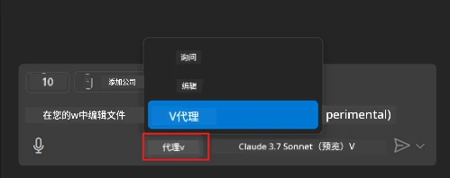
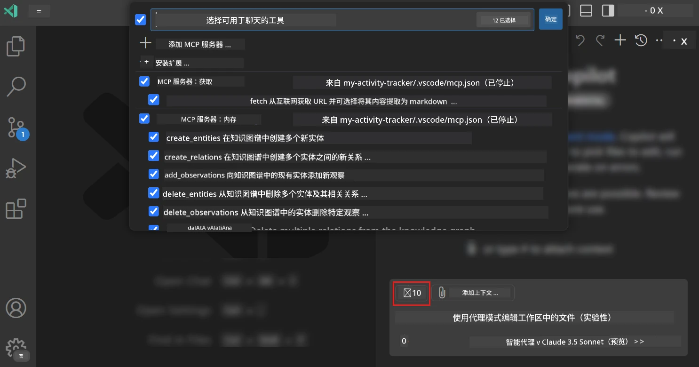
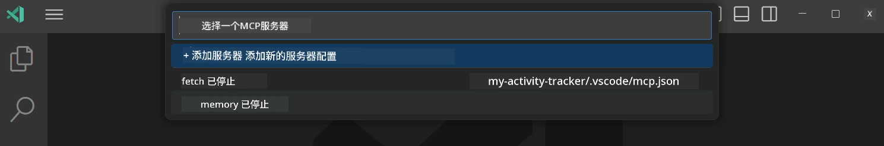
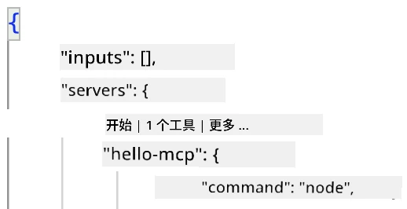
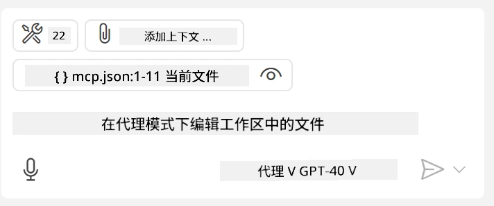
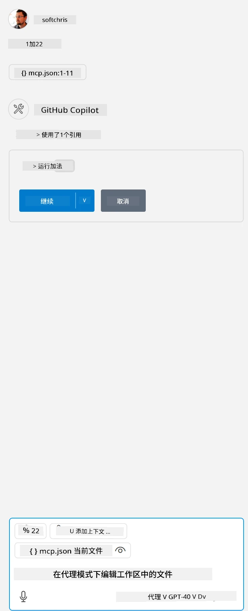

# 以 GitHub Copilot 代理模式使用服务器

Visual Studio Code 和 GitHub Copilot 可以作为客户端来使用 MCP 服务器。你可能会问为什么要这么做？这意味着 MCP 服务器的所有功能现在都可以直接在你的 IDE 中使用。比如，假如你添加了 GitHub 的 MCP 服务器，就可以通过自然语言提示来控制 GitHub，而无需在终端输入具体命令。或者想象任何通过自然语言控制、能提升开发者体验的功能。现在你应该能看出这种方式的优势了，对吧？

## 概述

本课将介绍如何使用 Visual Studio Code 和 GitHub Copilot 的代理模式作为 MCP 服务器的客户端。

## 学习目标

完成本课后，你将能：

- 通过 Visual Studio Code 使用 MCP 服务器。
- 通过 GitHub Copilot 运行工具等功能。
- 配置 Visual Studio Code 以定位和管理你的 MCP 服务器。

## 使用方法

你可以通过两种方式控制你的 MCP 服务器：

- 用户界面，后面章节将演示如何操作。
- 终端，使用 `code` 可执行文件来控制：

  通过 --add-mcp 命令行选项并提供 JSON 服务器配置（格式为 {\"name\":\"server-name\",\"command\":...}）来将 MCP 服务器添加到用户配置中。

  ```
  code --add-mcp "{\"name\":\"my-server\",\"command\": \"uvx\",\"args\": [\"mcp-server-fetch\"]}"
  ```

### 截图





接下来章节将详细讲解如何使用可视界面。

## 方法

高层次的步骤如下：

- 配置文件定位 MCP 服务器。
- 启动/连接服务器以列出其功能。
- 通过 GitHub Copilot Chat 界面使用这些功能。

理解了流程后，让我们通过一个练习来使用 Visual Studio Code 调用 MCP 服务器。

## 练习：使用服务器

本练习中，我们将配置 Visual Studio Code 以找到你的 MCP 服务器，从而能通过 GitHub Copilot Chat 界面使用它。

### -0- 事前步骤，启用 MCP 服务器发现

你可能需要启用 MCP 服务器发现。

1. 在 Visual Studio Code 中依次点击 `文件 -> 首选项 -> 设置`。

1. 搜索 “MCP”，并在 settings.json 文件中启用 `chat.mcp.discovery.enabled`。

### -1- 创建配置文件

首先在项目根目录创建配置文件，需要一个名为 MCP.json 的文件并放入 .vscode 文件夹内。其内容大致如下：

```text
.vscode
|-- mcp.json
```

接下来我们看看如何添加服务器条目。

### -2- 配置服务器

将以下内容添加到 *mcp.json* 中：

```json
{
    "inputs": [],
    "servers": {
       "hello-mcp": {
           "command": "node",
           "args": [
               "build/index.js"
           ]
       }
    }
}
```

上面是一个用 Node.js 编写的服务器启动示例，其他运行时请根据实际情况在 `command` 和 `args` 中指定启动服务器的正确命令。

### -3- 启动服务器

添加条目后，启动服务器：

1. 在 *mcp.json* 中找到你的条目，确认看到 “播放” 图标：

    

1. 点击 “播放” 图标，你将看到 GitHub Copilot Chat 中的工具图标提示可用工具数量增加。点击此工具图标，会显示已注册的工具列表。你可以根据需要勾选是否让 GitHub Copilot 使用某工具作为上下文：

  

1. 运行工具时，输入符合某个工具描述的提示语，例如 “add 22 to 1”：

  

  你应当会看到回答是 23。

## 作业

尝试向你的 *mcp.json* 文件中添加服务器条目，并确保可以启动/停止服务器。同时确认你能通过 GitHub Copilot Chat 接口与服务器上的工具通信。

## 解决方案

[解决方案](./solution/README.md)

## 关键点总结

本章关键点如下：

- Visual Studio Code 是优秀的客户端，能让你消费多个 MCP 服务器及其工具。
- GitHub Copilot Chat 界面是你与服务器交互的方式。
- 你可以提示用户输入 API 密钥等，并在 *mcp.json* 配置服务器条目时传递给 MCP 服务器。

## 示例

- [Java 计算器](../samples/java/calculator/README.md)
- [.Net 计算器](../../../../03-GettingStarted/samples/csharp)
- [JavaScript 计算器](../samples/javascript/README.md)
- [TypeScript 计算器](../samples/typescript/README.md)
- [Python 计算器](../../../../03-GettingStarted/samples/python)

## 其他资源

- [Visual Studio 文档](https://code.visualstudio.com/docs/copilot/chat/mcp-servers)

## 后续内容

- 接下来: [创建 stdio 服务器](../05-stdio-server/README.md)

---

<!-- CO-OP TRANSLATOR DISCLAIMER START -->
**免责声明**：
本文件由 AI 翻译服务 [Co-op Translator](https://github.com/Azure/co-op-translator) 翻译完成。尽管我们力求准确，但请注意，自动翻译可能包含错误或不准确之处。原始语言版文件应视为权威来源。对于重要信息，建议使用专业人工翻译。我们对因使用本翻译而产生的任何误解或误释不承担责任。
<!-- CO-OP TRANSLATOR DISCLAIMER END -->