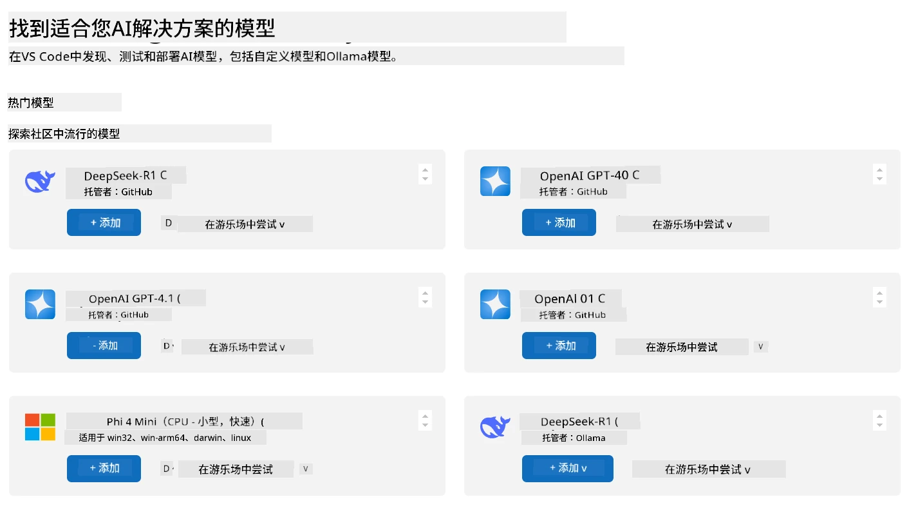
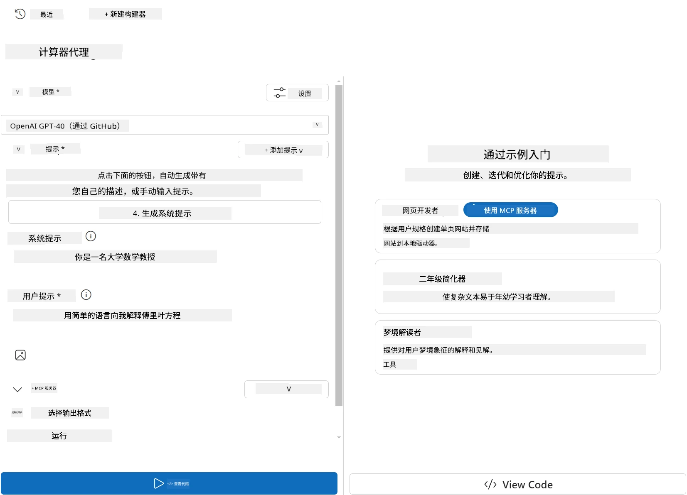
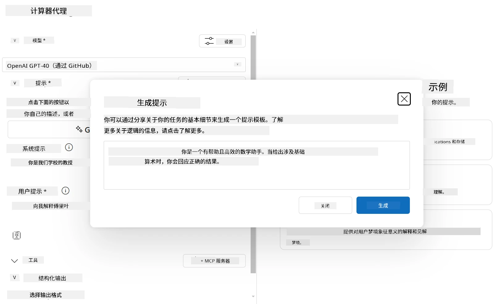
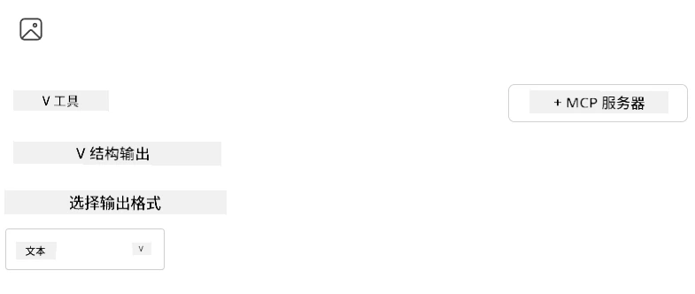

# 在 Visual Studio Code 的 AI Toolkit 扩展中使用服务器

当你构建一个 AI 代理时，不仅仅是生成智能响应；更重要的是赋予代理执行操作的能力。这就是模型上下文协议（MCP）的作用。MCP 让代理能够以一致的方式访问外部工具和服务。把它想象成把你的代理连接到一个它<em>真正</em>能用的工具箱。

比如说，你将一个代理连接到你的计算器 MCP 服务器。突然间，你的代理只需收到“47乘以89是多少？”这样的提示，就能执行数学运算——无需硬编码逻辑或构建自定义 API。

## 概述

本课介绍如何通过 Visual Studio Code 中的 [AI Toolkit](https://aka.ms/AIToolkit) 扩展将计算器 MCP 服务器连接到代理，使你的代理能够通过自然语言执行加、减、乘、除等数学运算。

AI Toolkit 是一个强大的 Visual Studio Code 扩展，简化了代理开发流程。AI 工程师可以轻松构建 AI 应用，开发和测试生成式 AI 模型——无论是在本地还是云端。该扩展支持当今大多数主流生成式模型。

<em>注意</em>：AI Toolkit 当前支持 Python 和 TypeScript。

## 学习目标

完成本课后，你将能够：

- 通过 AI Toolkit 使用 MCP 服务器。
- 配置代理，使其能够发现并使用 MCP 服务器提供的工具。
- 通过自然语言利用 MCP 工具。

## 方法

高层次的步骤如下：

- 创建一个代理并定义其系统提示。
- 创建一个带计算器工具的 MCP 服务器。
- 将 Agent Builder 连接到 MCP 服务器。
- 通过自然语言测试代理调用工具的功能。

很好，现在我们了解了流程，让我们配置一个 AI 代理，通过 MCP 利用外部工具，增强其能力！

## 先决条件

- [Visual Studio Code](https://code.visualstudio.com/)
- [AI Toolkit for Visual Studio Code](https://aka.ms/AIToolkit)

## 练习：使用服务器

> [!WARNING]
> macOS 用户注意。我们当前正在调查影响 macOS 上依赖项安装的问题。因此，macOS 用户暂时无法完成本教程。修复发布后我们将更新说明。感谢您的耐心和理解！

在本练习中，你将使用 AI Toolkit，在 Visual Studio Code 内构建、运行并增强一个带有 MCP 服务器工具的 AI 代理。

### -0- 预备步骤：将 OpenAI GPT-4o 模型添加到“我的模型”

本练习使用 **GPT-4o** 模型。创建代理之前，应先将该模型添加到 <strong>我的模型</strong>。



1. 从 <strong>活动栏</strong>中打开 **AI Toolkit** 扩展。
1. 在 <strong>目录</strong> 部分选择 <strong>模型</strong>，以打开 <strong>模型目录</strong>。选择后会在新的编辑器标签页中打开 <strong>模型目录</strong>。
1. 在 <strong>模型目录</strong> 搜索栏输入 **OpenAI GPT-4o**。
1. 点击 **+ 添加**，将模型添加到你的 <strong>我的模型</strong> 列表。确保你选择的是 **由 GitHub 托管** 的模型。
1. 在 <strong>活动栏</strong>中确认 **OpenAI GPT-4o** 模型已出现在列表中。

### -1- 创建代理

**Agent (Prompt) Builder** 使你能够创建并定制自己的 AI 代理。在本节中，你将创建一个新代理并为对话分配驱动模型。



1. 从 <strong>活动栏</strong>中打开 **AI Toolkit** 扩展。
1. 在 <strong>工具</strong> 部分选择 **Agent (Prompt) Builder**。选择后，**Agent (Prompt) Builder** 会在新编辑器标签页打开。
1. 点击 **+ 新建代理** 按钮。扩展将通过 <strong>命令面板</strong> 启动设置向导。
1. 输入名称 **Calculator Agent**，按 **Enter**。
1. 在 **Agent (Prompt) Builder** 中，为 <strong>模型</strong> 字段选择 **OpenAI GPT-4o（通过 GitHub）** 模型。

### -2- 为代理创建系统提示

代理搭建完成后，是时候定义它的个性和职责了。本节中，你将使用 <strong>生成系统提示</strong> 功能描述代理的预期行为——在这里是一台计算器代理——并让模型为你编写系统提示。



1. 在 <strong>提示</strong> 部分，点击 <strong>生成系统提示</strong> 按钮。此按钮打开提示生成器，利用 AI 为代理生成系统提示。
1. 在 <strong>生成提示</strong> 窗口中输入：`你是一个乐于助人且高效的数学助手。收到涉及基本算数的问题时，你会给出正确结果。`
1. 点击 <strong>生成</strong> 按钮。屏幕右下角会出现通知，确认系统提示正在生成。生成完成后，提示将显示在 **Agent (Prompt) Builder** 的 <strong>系统提示</strong> 字段中。
1. 审核 <strong>系统提示</strong> 并酌情修改。

### -3- 创建 MCP 服务器

既然你已经定义了代理的系统提示，指导其行为与回复，接下来是为代理配备实际功能。本节中，你将创建一个带有加、减、乘、除运算工具的计算器 MCP 服务器。此服务器将使代理能够响应自然语言提示执行实时数学运算。



AI Toolkit 配备了便捷创建 MCP 服务器的模板。这里我们将使用 Python 模板来创建计算器 MCP 服务器。

<em>注意</em>：AI Toolkit 当前支持 Python 和 TypeScript。

1. 在 **Agent (Prompt) Builder** 的 <strong>工具</strong> 部分，点击 **+ MCP Server** 按钮。扩展将通过 <strong>命令面板</strong> 启动设置向导。
1. 选择 **+ 添加服务器**。
1. 选择 **创建新 MCP 服务器**。
1. 选择模板 **python-weather**。
1. 选择 <strong>默认文件夹</strong> 保存 MCP 服务器模板。
1. 输入服务器名称：**Calculator**
1. 将打开一个新的 Visual Studio Code 窗口。选择 **是，我信任作者**。
1. 通过终端（<strong>终端</strong> > <strong>新终端</strong>）创建虚拟环境：`python -m venv .venv`
1. 通过终端激活虚拟环境：
    1. Windows - `.venv\Scripts\activate`
    1. macOS/Linux - `source .venv/bin/activate`
1. 通过终端安装依赖：`pip install -e .[dev]`
1. 在 <strong>资源管理器</strong> 视图的 <strong>活动栏</strong> 中，展开 **src** 目录，选择 **server.py** 打开文件编辑。
1. 用以下代码替换 **server.py** 文件内容并保存：

    ```python
    """
    Sample MCP Calculator Server implementation in Python.

    
    This module demonstrates how to create a simple MCP server with calculator tools
    that can perform basic arithmetic operations (add, subtract, multiply, divide).
    """
    
    from mcp.server.fastmcp import FastMCP
    
    server = FastMCP("calculator")
    
    @server.tool()
    def add(a: float, b: float) -> float:
        """Add two numbers together and return the result."""
        return a + b
    
    @server.tool()
    def subtract(a: float, b: float) -> float:
        """Subtract b from a and return the result."""
        return a - b
    
    @server.tool()
    def multiply(a: float, b: float) -> float:
        """Multiply two numbers together and return the result."""
        return a * b
    
    @server.tool()
    def divide(a: float, b: float) -> float:
        """
        Divide a by b and return the result.
        
        Raises:
            ValueError: If b is zero
        """
        if b == 0:
            raise ValueError("Cannot divide by zero")
        return a / b
    ```

### -4- 使用计算器 MCP 服务器运行代理

现在你的代理具备了工具，是时候使用它们了！本节中，你将向代理提交提示，测试并验证其是否调用了计算器 MCP 服务器中的合适工具。


你将通过 **Agent Builder** 使用 MCP 客户端在本地开发机上运行计算器 MCP 服务器。

1. 按 `F5` 开始调试 MCP 服务器。**Agent (Prompt) Builder** 会在新的编辑器标签页打开。服务器状态显示在终端。
1. 在 **Agent (Prompt) Builder** 的 <strong>用户提示</strong> 输入框中，输入：`我买了3件每件25美元的商品，然后用了20美元折扣。我总共付了多少钱？`
1. 点击 <strong>运行</strong> 按钮生成代理回复。
1. 审核代理输出。模型应得出你付了 **55美元**。
1. 以下是操作流程：
    - 代理调用了 **multiply** 和 **subtract** 工具来帮助计算。
    - 针对 **multiply** 工具，分配了相应的 `a` 和 `b` 值。
    - 针对 **subtract** 工具，分配了相应的 `a` 和 `b` 值。
    - 各工具的响应显示在对应 <strong>工具响应</strong>。
    - 最终的输出呈现在最终 <strong>模型响应</strong> 中。
1. 提交更多提示以进一步测试代理。你可以点击 <strong>用户提示</strong> 字段替换已有提示。
1. 测试完成后，可以通过终端输入 **CTRL/CMD+C** 停止服务器。

## 任务

尝试在你的 **server.py** 文件中添加额外的工具条目（例如：返回数字的平方根）。提交需要代理调用新工具（或现有工具）的提示。别忘了重启服务器以加载新增工具。

## 解决方案

[解决方案](./solution/README.md)

## 关键要点

本章的关键点如下：

- AI Toolkit 扩展是一个很好的客户端，让你能够使用 MCP 服务器及其工具。
- 你可以向 MCP 服务器添加新工具，扩展代理的能力以满足不断变化的需求。
- AI Toolkit 包含模板（例如 Python MCP 服务器模板），简化自定义工具的创建。

## 额外资源

- [AI Toolkit 文档](https://aka.ms/AIToolkit/doc)

## 下一步
- 下一节：[测试与调试](../08-testing/README.md)

---

<!-- CO-OP TRANSLATOR DISCLAIMER START -->
**免责声明**：
本文件由 AI 翻译服务 [Co-op Translator](https://github.com/Azure/co-op-translator) 翻译完成。尽管我们力求准确，但请注意，自动翻译可能包含错误或不准确之处。原始语言版文件应视为权威来源。对于重要信息，建议使用专业人工翻译。我们对因使用本翻译而产生的任何误解或误释不承担责任。
<!-- CO-OP TRANSLATOR DISCLAIMER END -->