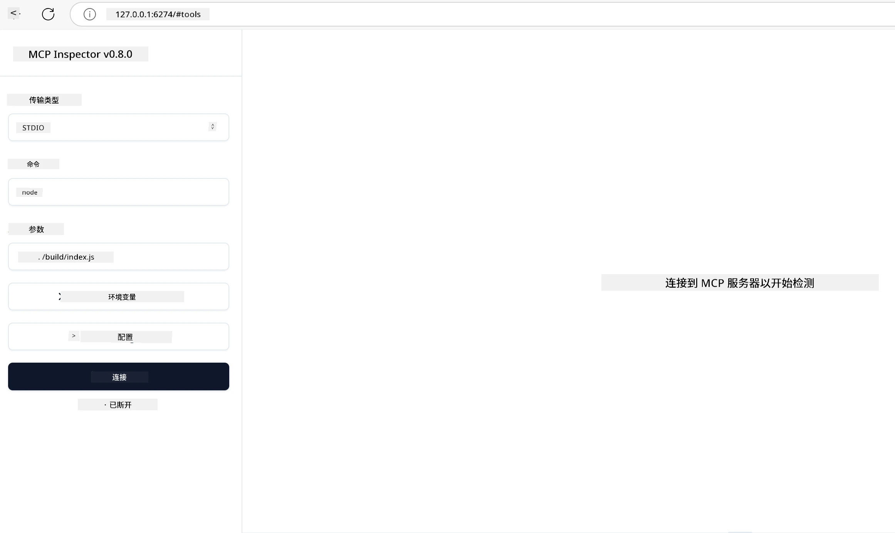

## 测试与调试

在开始测试您的 MCP 服务器之前，了解可用的工具和调试的最佳实践非常重要。有效的测试确保您的服务器按预期运行，并帮助您快速识别和解决问题。以下部分概述了验证您的 MCP 实现的推荐方法。

## 概述

本课将介绍如何选择合适的测试方法和最有效的测试工具。

## 学习目标

在本课结束时，您将能够：

- 描述各种测试方法。
- 使用不同的工具有效地测试您的代码。


## 测试 MCP 服务器

MCP 提供了帮助您测试和调试服务器的工具：

- **MCP Inspector**：一个命令行工具，可以作为 CLI 工具和可视化工具运行。
- <strong>手动测试</strong>：您可以使用 curl 之类的工具来运行网络请求，但任何能够运行 HTTP 的工具都可以。
- <strong>单元测试</strong>：可以使用您喜欢的测试框架来测试服务器和客户端的功能。

### 使用 MCP Inspector

我们在之前的课程中已经介绍过该工具的用法，但这里做一个简要的说明。它是一个基于 Node.js 构建的工具，您可以通过调用 `npx` 可执行文件来使用它，npx 会临时下载并安装该工具，运行请求完成后会自动清理。

[MCP Inspector](https://github.com/modelcontextprotocol/inspector) 可以帮助您：

- <strong>发现服务器能力</strong>：自动检测可用的资源、工具和提示
- <strong>测试工具执行</strong>：尝试不同参数并实时查看响应
- <strong>查看服务器元数据</strong>：检查服务器信息、架构和配置

该工具的典型运行如下：

```bash
npx @modelcontextprotocol/inspector node build/index.js
```

以上命令启动 MCP 及其可视化界面，并在您的浏览器中启动本地网页界面。您可以看到一个仪表板，显示您注册的 MCP 服务器、它们可用的工具、资源和提示。该界面允许您交互式测试工具执行，检查服务器元数据，并查看实时响应，使验证和调试 MCP 服务器实现更加容易。

它看起来可能是这样的： 

您也可以在 CLI 模式下运行该工具，在这种情况下添加 `--cli` 参数。以下是以“CLI”模式运行工具并列出服务器上所有工具的示例：

```sh
npx @modelcontextprotocol/inspector --cli node build/index.js --method tools/list
```

### 手动测试

除了运行 Inspector 工具以测试服务器能力外，另一种类似方法是运行一个能够使用 HTTP 的客户端，比如 curl。

使用 curl，您可以通过 HTTP 请求直接测试 MCP 服务器：

```bash
# 示例：测试服务器元数据
curl http://localhost:3000/v1/metadata

# 示例：执行一个工具
curl -X POST http://localhost:3000/v1/tools/execute \
  -H "Content-Type: application/json" \
  -d '{"name": "calculator", "parameters": {"expression": "2+2"}}'
```

如上所示，curl 用 POST 请求来调用工具，载荷包含工具的名称及其参数。请选择最适合您的方式。CLI 工具通常使用更加快捷，并且容易编写脚本，这在 CI/CD 环境中非常有用。

### 单元测试

为您的工具和资源创建单元测试，以确保它们按预期工作。以下是一些示例测试代码。

```python
import pytest

from mcp.server.fastmcp import FastMCP
from mcp.shared.memory import (
    create_connected_server_and_client_session as create_session,
)

# 标记整个模块为异步测试
pytestmark = pytest.mark.anyio


async def test_list_tools_cursor_parameter():
    """Test that the cursor parameter is accepted for list_tools.

    Note: FastMCP doesn't currently implement pagination, so this test
    only verifies that the cursor parameter is accepted by the client.
    """

 server = FastMCP("test")

    # 创建几个测试工具
    @server.tool(name="test_tool_1")
    async def test_tool_1() -> str:
        """First test tool"""
        return "Result 1"

    @server.tool(name="test_tool_2")
    async def test_tool_2() -> str:
        """Second test tool"""
        return "Result 2"

    async with create_session(server._mcp_server) as client_session:
        # 测试不带游标参数（省略）
        result1 = await client_session.list_tools()
        assert len(result1.tools) == 2

        # 测试游标为 None
        result2 = await client_session.list_tools(cursor=None)
        assert len(result2.tools) == 2

        # 测试游标为字符串
        result3 = await client_session.list_tools(cursor="some_cursor_value")
        assert len(result3.tools) == 2

        # 测试游标为空字符串
        result4 = await client_session.list_tools(cursor="")
        assert len(result4.tools) == 2
    
```

上面的代码实现了以下内容：

- 利用 pytest 框架，允许您将测试创建为函数，并使用 assert 语句。
- 创建一个包含两个不同工具的 MCP 服务器。
- 使用 `assert` 语句检查某些条件是否满足。

请查看 [完整文件](https://github.com/modelcontextprotocol/python-sdk/blob/main/tests/client/test_list_methods_cursor.py)

根据上述文件，您可以测试您自己的服务器以确保能力按预期创建。

所有主要的 SDK 都有类似的测试部分，因此您可以根据所选运行时进行调整。

## 示例 

- [Java 计算器](../samples/java/calculator/README.md)
- [.Net 计算器](../../../../03-GettingStarted/samples/csharp)
- [JavaScript 计算器](../samples/javascript/README.md)
- [TypeScript 计算器](../samples/typescript/README.md)
- [Python 计算器](../../../../03-GettingStarted/samples/python) 

## 额外资源

- [Python SDK](https://github.com/modelcontextprotocol/python-sdk)

## 接下来是什么

- 下一步：[部署](../09-deployment/README.md)

---

<!-- CO-OP TRANSLATOR DISCLAIMER START -->
**免责声明**：
本文件由 AI 翻译服务 [Co-op Translator](https://github.com/Azure/co-op-translator) 翻译完成。尽管我们力求准确，但请注意，自动翻译可能包含错误或不准确之处。原始语言版文件应视为权威来源。对于重要信息，建议使用专业人工翻译。我们对因使用本翻译而产生的任何误解或误释不承担责任。
<!-- CO-OP TRANSLATOR DISCLAIMER END -->