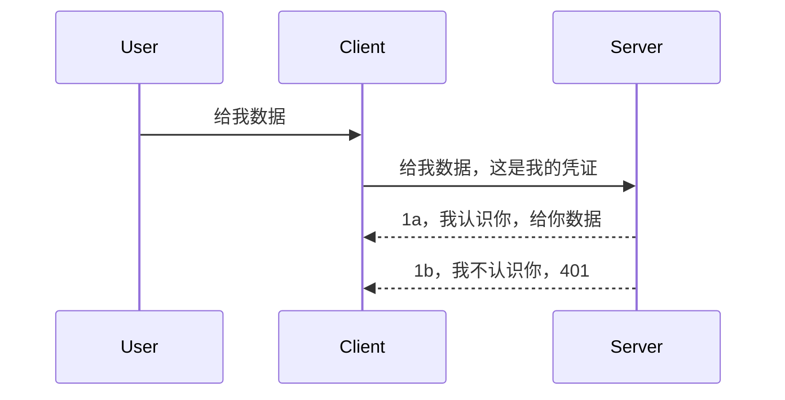

# 简单认证

MCP SDK 支持使用 OAuth 2.1，公平来说这是一个相当复杂的过程，涉及到认证服务器、资源服务器、提交凭证、获取代码、用代码换取持有者令牌，直到你最终可以获取你的资源数据。如果你不熟悉 OAuth，这是一件很棒的实现方案，建议从一些基础认证开始，逐步构建到更好更安全的认证方式。这也是本章存在的原因，带你逐步迈向更高级的认证。

## 认证，我们说的是什么？

认证是 authentication 和 authorization 的简称。我们的目标是做两件事：

- **认证（Authentication）**，就是确认我们是否允许某人进入我们的房子，他们是否有权“在这里”，即能够访问我们的资源服务器，这里托管了 MCP Server 的功能。
- **授权（Authorization）**，是确认某个用户是否应该访问他们请求的特定资源，比如这些订单或这些产品，或者他们是否被允许读取内容但不允许删除，这是另外一个例子。

## 凭证：我们如何向系统说明我们是谁

大多数 web 开发者会想到向服务器提供一个凭证，通常是一个密钥，用来说明他们是否被允许进入——也就是“认证”。这个凭证通常是 username 和 password 的 base64 加密版本，或者是唯一识别某个用户的 API key。

这通常通过一个叫做 “Authorization” 的请求头来发送：

```json
{ "Authorization": "secret123" }
```

这通常被称为基本认证（basic authentication）。整体的流程如下：


了解了流程后，我们该如何实现它呢？大多数 web 服务器都有一个概念叫中间件（middleware），它是请求的一部分代码，可以核验凭证，如果凭证有效则允许请求继续执行。如果请求没有有效凭证，则返回认证错误。来看下实现方法：

**Python**

```python
class AuthMiddleware(BaseHTTPMiddleware):
    async def dispatch(self, request, call_next):

        has_header = request.headers.get("Authorization")
        if not has_header:
            print("-> Missing Authorization header!")
            return Response(status_code=401, content="Unauthorized")

        if not valid_token(has_header):
            print("-> Invalid token!")
            return Response(status_code=403, content="Forbidden")

        print("Valid token, proceeding...")
       
        response = await call_next(request)
        # 添加任何客户头或以某种方式更改响应
        return response


starlette_app.add_middleware(CustomHeaderMiddleware)
```

这里我们：

- 创建了一个名为 `AuthMiddleware` 的中间件，它的 `dispatch` 方法会被 web 服务器调用。
- 将该中间件添加到 web 服务器：

    ```python
    starlette_app.add_middleware(AuthMiddleware)
    ```

- 编写了验证逻辑，检查 Authorization 请求头是否存在以及提交的密钥是否有效：

    ```python
    has_header = request.headers.get("Authorization")
    if not has_header:
        print("-> Missing Authorization header!")
        return Response(status_code=401, content="Unauthorized")

    if not valid_token(has_header):
        print("-> Invalid token!")
        return Response(status_code=403, content="Forbidden")
    ```

如果密钥存在且有效，就调用 `call_next` 让请求通过并返回响应：

    ```python
    response = await call_next(request)
    # 添加任何客户头或以某种方式更改响应
    return response
    ```

整个工作流程是：当有 web 请求到达服务器时，中间件会被调用，依据它的实现，它会允许请求通过，或者返回一个表示客户端无权限的错误。

**TypeScript**

这里我们使用流行的框架 Express 创建中间件，在请求到达 MCP Server 之前拦截请求。代码如下：

```typescript
function isValid(secret) {
    return secret === "secret123";
}

app.use((req, res, next) => {
    // 1. 授权头是否存在？
    if(!req.headers["Authorization"]) {
        res.status(401).send('Unauthorized');
    }
    
    let token = req.headers["Authorization"];

    // 2. 检查有效性。
    if(!isValid(token)) {
        res.status(403).send('Forbidden');
    }

   
    console.log('Middleware executed');
    // 3. 将请求传递给请求管道中的下一步。
    next();
});
```

这段代码中我们：

1. 首先检查 Authorization 请求头是否存在，如果没有则返回 401 错误。
2. 确认凭证/令牌是否有效，如果无效则返回 403 错误。
3. 最终将请求继续传递给后续处理流程返回请求的资源。

## 练习：实现认证

让我们将这些知识付诸实践。计划如下：

服务器

- 创建 web 服务器和 MCP 实例。
- 为服务器实现中间件。

客户端

- 通过请求头发送带凭证的 web 请求。

### -1- 创建 web 服务器和 MCP 实例

第一步，我们需要创建 web 服务器实例和 MCP Server。

**Python**

这里我们创建了 MCP server 实例，创建一个 starlette web 应用，并使用 uvicorn 托管它。

```python
# 创建 MCP 服务器

app = FastMCP(
    name="MCP Resource Server",
    instructions="Resource Server that validates tokens via Authorization Server introspection",
    host=settings["host"],
    port=settings["port"],
    debug=True
)

# 创建 starlette Web 应用
starlette_app = app.streamable_http_app()

# 通过 uvicorn 提供应用服务
async def run(starlette_app):
    import uvicorn
    config = uvicorn.Config(
            starlette_app,
            host=app.settings.host,
            port=app.settings.port,
            log_level=app.settings.log_level.lower(),
        )
    server = uvicorn.Server(config)
    await server.serve()

run(starlette_app)
```

这段代码完成了：

- 创建 MCP Server。
- 通过 MCP Server 生成 starlette web 应用，`app.streamable_http_app()`。
- 使用 uvicorn 托管并服务该 web 应用，`server.serve()`。

**TypeScript**

这里我们创建一个 MCP Server 实例。

```typescript
const server = new McpServer({
      name: "example-server",
      version: "1.0.0"
    });

    // ... 设置服务器资源，工具和提示 ...
```

MCP Server 的创建需要放在我们的 POST /mcp 路由定义里，因此我们把上面的代码移动到下面这样：

```typescript
import express from "express";
import { randomUUID } from "node:crypto";
import { McpServer } from "@modelcontextprotocol/sdk/server/mcp.js";
import { StreamableHTTPServerTransport } from "@modelcontextprotocol/sdk/server/streamableHttp.js";
import { isInitializeRequest } from "@modelcontextprotocol/sdk/types.js"

const app = express();
app.use(express.json());

// 用于按会话ID存储传输的映射
const transports: { [sessionId: string]: StreamableHTTPServerTransport } = {};

// 处理客户端到服务器的POST请求
app.post('/mcp', async (req, res) => {
  // 检查是否存在会话ID
  const sessionId = req.headers['mcp-session-id'] as string | undefined;
  let transport: StreamableHTTPServerTransport;

  if (sessionId && transports[sessionId]) {
    // 重用现有传输
    transport = transports[sessionId];
  } else if (!sessionId && isInitializeRequest(req.body)) {
    // 新的初始化请求
    transport = new StreamableHTTPServerTransport({
      sessionIdGenerator: () => randomUUID(),
      onsessioninitialized: (sessionId) => {
        // 按会话ID存储传输
        transports[sessionId] = transport;
      },
      // 出于向后兼容，默认禁用DNS重新绑定保护。如果您在本地运行此服务器
      // 请确保设置：
      // enableDnsRebindingProtection: true,
      // allowedHosts: ['127.0.0.1'],
    });

    // 传输关闭时清理
    transport.onclose = () => {
      if (transport.sessionId) {
        delete transports[transport.sessionId];
      }
    };
    const server = new McpServer({
      name: "example-server",
      version: "1.0.0"
    });

    // ... 设置服务器资源、工具和提示 ...

    // 连接到MCP服务器
    await server.connect(transport);
  } else {
    // 无效请求
    res.status(400).json({
      jsonrpc: '2.0',
      error: {
        code: -32000,
        message: 'Bad Request: No valid session ID provided',
      },
      id: null,
    });
    return;
  }

  // 处理请求
  await transport.handleRequest(req, res, req.body);
});

// 用于GET和DELETE请求的可重用处理器
const handleSessionRequest = async (req: express.Request, res: express.Response) => {
  const sessionId = req.headers['mcp-session-id'] as string | undefined;
  if (!sessionId || !transports[sessionId]) {
    res.status(400).send('Invalid or missing session ID');
    return;
  }
  
  const transport = transports[sessionId];
  await transport.handleRequest(req, res);
};

// 处理SSE方式的服务器到客户端的GET通知请求
app.get('/mcp', handleSessionRequest);

// 处理终止会话的DELETE请求
app.delete('/mcp', handleSessionRequest);

app.listen(3000);
```

你可以看到 MCP Server 的创建已移动到 `app.post("/mcp")` 内。

接下来创建中间件，以验证传入的凭证。

### -2- 为服务器实现中间件

进入到中间件环节。这里我们创建一个从请求头 `Authorization` 中查找凭证并验证它的中间件。如果凭证可接受，则继续执行请求完成需要做的事情（例如列出工具，读取资源，或者客户端请求的 MCP 功能）。

**Python**

创建中间件，我们需要创建一个继承自 `BaseHTTPMiddleware` 的类。这里有两个关键点：

- 请求对象 `request`，从中读取头信息。
- `call_next` 是如果客户端传递了可接受的凭证时需要调用的回调。

首先，处理没有 `Authorization` 头的情况：

```python
has_header = request.headers.get("Authorization")

# 没有头部，返回401失败，否则继续。
if not has_header:
    print("-> Missing Authorization header!")
    return Response(status_code=401, content="Unauthorized")
```

这里我们返回 401 未授权信息，表示客户端身份验证失败。

接下来，有凭证提交时，核验其有效性：

```python
 if not valid_token(has_header):
    print("-> Invalid token!")
    return Response(status_code=403, content="Forbidden")
```

注意这里返回 403 禁止访问信息。看看完整实现的中间件代码：

```python
class AuthMiddleware(BaseHTTPMiddleware):
    async def dispatch(self, request, call_next):

        has_header = request.headers.get("Authorization")
        if not has_header:
            print("-> Missing Authorization header!")
            return Response(status_code=401, content="Unauthorized")

        if not valid_token(has_header):
            print("-> Invalid token!")
            return Response(status_code=403, content="Forbidden")

        print("Valid token, proceeding...")
        print(f"-> Received {request.method} {request.url}")
        response = await call_next(request)
        response.headers['Custom'] = 'Example'
        return response

```

很好，关于 `valid_token` 函数呢？如下：

```python
# 不要用于生产环境 - 需要改进！！
def valid_token(token: str) -> bool:
    # 移除 "Bearer " 前缀
    if token.startswith("Bearer "):
        token = token[7:]
        return token == "secret-token"
    return False
```

显然，这里可以改进。

重要提示：你绝不应该在代码中包含这种明文密钥。理想情况下，应从数据源或身份服务提供商（IDP）获取对比值，或者更好的是让 IDP 直接负责验证。

**TypeScript**

用 Express 实现，我们调用 `use` 方法来挂载中间件函数。

需要：

- 读取请求中的 `Authorization` 属性来检查凭证。
- 验证凭证，如果有效则继续请求，让客户端的 MCP 请求执行它本应完成的功能（列出工具、读取资源等）。

这里我们检测 Authorization 头是否存在，如果不存在则阻止请求继续：

```typescript
if(!req.headers["authorization"]) {
    res.status(401).send('Unauthorized');
    return;
}
```

未发送该头时，返回 401。

然后我们检查凭证有效性，若无效，则停止请求并返回不同消息：

```typescript
if(!isValid(token)) {
    res.status(403).send('Forbidden');
    return;
} 
```

这里返回 403 错误。

完整代码如下：

```typescript
app.use((req, res, next) => {
    console.log('Request received:', req.method, req.url, req.headers);
    console.log('Headers:', req.headers["authorization"]);
    if(!req.headers["authorization"]) {
        res.status(401).send('Unauthorized');
        return;
    }
    
    let token = req.headers["authorization"];

    if(!isValid(token)) {
        res.status(403).send('Forbidden');
        return;
    }  

    console.log('Middleware executed');
    next();
});
```

我们已经设置好 web 服务器并加装了中间件验证客户端凭证。那么客户端该怎么做呢？

### -3- 通过请求头发送带凭证的 web 请求

我们需要确保客户端通过请求头传递凭证。由于我们要使用 MCP 客户端，需要确认如何做到这一点。

**Python**

客户端需传递一个包含凭证的请求头，如下：

```python
# 不要硬编码该值，至少应将其放在环境变量或更安全的存储中
token = "secret-token"

async with streamablehttp_client(
        url = f"http://localhost:{port}/mcp",
        headers = {"Authorization": f"Bearer {token}"}
    ) as (
        read_stream,
        write_stream,
        session_callback,
    ):
        async with ClientSession(
            read_stream,
            write_stream
        ) as session:
            await session.initialize()
      
            # 待办事项，您希望客户端完成的操作，例如列出工具、调用工具等。
```

你可以看到 `headers` 是这样赋值的，` headers = {"Authorization": f"Bearer {token}"}`。

**TypeScript**

这可以分两步完成：

1. 构造一个配置对象，内含凭证。
2. 将配置对象传递给传输层。

```typescript

// 不要像这里显示的那样硬编码值。至少将其作为环境变量，并在开发模式下使用类似 dotenv 的东西。
let token = "secret123"

// 定义一个客户端传输选项对象
let options: StreamableHTTPClientTransportOptions = {
  sessionId: sessionId,
  requestInit: {
    headers: {
      "Authorization": "secret123"
    }
  }
};

// 将选项对象传递给传输层
async function main() {
   const transport = new StreamableHTTPClientTransport(
      new URL(serverUrl),
      options
   );
```

代码中你看到了如何创建一个 `options` 对象，且将 headers 放入 `requestInit` 属性下。

重要提示：这里如何改进呢？当前方案存在风险，只有使用 HTTPS 才相对安全。但凭证仍可能被窃取，因此需要能方便地撤销令牌，并加入额外检查，如请求来源地、请求频率（防止机器人行为）等，涉及众多安全细节。

不过对于非常简单的 API，不希望任何人未认证直接调用你的 API，现有方案是个不错的开端。

说完这些，我们尝试用一个标准格式提升安全性，比如 JSON Web Token，简称 JWT 或“JOT”令牌。

## JSON Web Token，JWT

我们想改进发送非常简单凭证的机制。采纳 JWT 立即带来哪些提升？

- **安全性提升**。在基本认证中，你反复发送用户名和密码的 base64 编码（或 API key），存在风险。用 JWT，客户端发送用户名和密码后获得一个令牌，且令牌是时限型，会过期。JWT 支持基于角色、作用域和权限的细粒度访问控制。
- **无状态和可扩展性**。JWT 自包含，携带所有用户信息，无需服务端存储会话。令牌也可以本地验证。
- **互操作性和联合认证**。JWT 是 Open ID Connect 的核心，用于知名身份提供者，如 Entra ID、Google Identity 和 Auth0。它们还支持单点登录等企业级功能。
- **模块化和灵活性**。JWT 可用于 API 网关，如 Azure API Management、NGINX 等。支持多种认证情景和服务间通信，包括模拟和委托。
- **性能和缓存**。JWT 解码后可缓存，减少解析需求。对高流量应用提升吞吐和降低基础设施负载。
- **高级功能**。支持令牌自省（服务器查验有效性）和撤销（使令牌失效）。

拥有这么多优点，我们来看看如何将实现提升到更高水平。

## 将基本认证转为 JWT

需要做的高层改动是：

- **学习构造 JWT 令牌**，让客户端准备好发送给服务器。
- **验证 JWT 令牌**，如果有效则允许客户端访问资源。
- **安全存储令牌**。如何存储令牌。
- **保护路由**。保护路由和 MCP 特定功能。
- **增加刷新令牌**。生成短期令牌并配合长期刷新令牌，支持过期后续获取新令牌。确保有刷新端点和轮换策略。

### -1- 构造 JWT 令牌

首先，JWT 令牌由以下部分组成：

- **头部**，使用的算法和令牌类型。
- **载荷**，声明，比如 sub（令牌代表的用户或实体 ID，认证场景通常是用户 ID），exp（过期时间），role（角色）等。
- **签名**，用密钥或私钥签名。

我们需要构造头部、载荷并编码令牌。

**Python**

```python

import jwt
import jwt
from jwt.exceptions import ExpiredSignatureError, InvalidTokenError
import datetime

# 用于签署 JWT 的密钥
secret_key = 'your-secret-key'

header = {
    "alg": "HS256",
    "typ": "JWT"
}

# 用户信息及其声明和过期时间
payload = {
    "sub": "1234567890",               # 主体（用户ID）
    "name": "User Userson",                # 自定义声明
    "admin": True,                     # 自定义声明
    "iat": datetime.datetime.utcnow(),# 签发时间
    "exp": datetime.datetime.utcnow() + datetime.timedelta(hours=1)  # 过期时间
}

# 编码它
encoded_jwt = jwt.encode(payload, secret_key, algorithm="HS256", headers=header)
```

代码中我们：

- 定义了头部，指定算法为 HS256，类型为 JWT。
- 载荷中包含主体或用户 ID、用户名、角色、授权时间和过期时间，实现了前文提及的时限属性。

**TypeScript**

这里需要一些依赖来帮助构造 JWT 令牌。

依赖

```sh

npm install jsonwebtoken
npm install --save-dev @types/jsonwebtoken
```

依赖满足后，创建头部、载荷并生成编码令牌。

```typescript
import jwt from 'jsonwebtoken';

const secretKey = 'your-secret-key'; // 在生产环境中使用环境变量

// 定义负载
const payload = {
  sub: '1234567890',
  name: 'User usersson',
  admin: true,
  iat: Math.floor(Date.now() / 1000), // 签发时间
  exp: Math.floor(Date.now() / 1000) + 60 * 60 // 1小时后过期
};

// 定义头部（可选，jsonwebtoken 会设置默认值）
const header = {
  alg: 'HS256',
  typ: 'JWT'
};

// 创建令牌
const token = jwt.sign(payload, secretKey, {
  algorithm: 'HS256',
  header: header
});

console.log('JWT:', token);
```

该令牌：

使用 HS256 签名    
有效期 1 小时    
包含声明如 sub、name、admin、iat 和 exp。

### -2- 验证令牌

我们还需要验证令牌，服务器端必须验证客户端传来的令牌有效性。验证内容包括结构和有效性等多种检查。鼓励检查令牌是否对应系统中的用户，以及用户是否拥有其声称的权限。

验证需要解码令牌，读取后检查有效性：

**Python**

```python

# 解码并验证 JWT
try:
    decoded = jwt.decode(token, secret_key, algorithms=["HS256"])
    print("✅ Token is valid.")
    print("Decoded claims:")
    for key, value in decoded.items():
        print(f"  {key}: {value}")
except ExpiredSignatureError:
    print("❌ Token has expired.")
except InvalidTokenError as e:
    print(f"❌ Invalid token: {e}")

```

代码调用 `jwt.decode`，传入令牌、密钥和算法。用 try-catch 捕获验证失败时抛出的错误。

**TypeScript**

这里调用 `jwt.verify` 获取解码后的令牌以供进一步分析。如果失败说明令牌结构不对或已失效。

```typescript

try {
  const decoded = jwt.verify(token, secretKey);
  console.log('Decoded Payload:', decoded);
} catch (err) {
  console.error('Token verification failed:', err);
}
```

提示：如前所述，还应进行额外检查，确认令牌对应系统中的用户，确保用户具备声称的权限。

接下来，让我们了解基于角色的访问控制，也称为 RBAC。
## 添加基于角色的访问控制

我们的想法是表达不同的角色具有不同的权限。例如，我们假设管理员可以执行所有操作，普通用户可以读写，访客只能读取。因此，这里有一些可能的权限级别：

- Admin.Write 
- User.Read
- Guest.Read

让我们来看一下如何使用中间件实现这样的控制。中间件可以为每个路由添加，也可以为所有路由添加。

**Python**

```python
from starlette.middleware.base import BaseHTTPMiddleware
from starlette.responses import JSONResponse
import jwt

# 不要像这样在代码中写入密钥，这只是示范用途。请从安全的地方读取。
SECRET_KEY = "your-secret-key" # 放入环境变量中
REQUIRED_PERMISSION = "User.Read"

class JWTPermissionMiddleware(BaseHTTPMiddleware):
    async def dispatch(self, request, call_next):
        auth_header = request.headers.get("Authorization")
        if not auth_header or not auth_header.startswith("Bearer "):
            return JSONResponse({"error": "Missing or invalid Authorization header"}, status_code=401)

        token = auth_header.split(" ")[1]
        try:
            decoded = jwt.decode(token, SECRET_KEY, algorithms=["HS256"])
        except jwt.ExpiredSignatureError:
            return JSONResponse({"error": "Token expired"}, status_code=401)
        except jwt.InvalidTokenError:
            return JSONResponse({"error": "Invalid token"}, status_code=401)

        permissions = decoded.get("permissions", [])
        if REQUIRED_PERMISSION not in permissions:
            return JSONResponse({"error": "Permission denied"}, status_code=403)

        request.state.user = decoded
        return await call_next(request)


```
  
添加中间件的方法有几种，示例如下：

```python

# 方案1：在构建starlette应用时添加中间件
middleware = [
    Middleware(JWTPermissionMiddleware)
]

app = Starlette(routes=routes, middleware=middleware)

# 方案2：在starlette应用构建完成后添加中间件
starlette_app.add_middleware(JWTPermissionMiddleware)

# 方案3：为每个路由添加中间件
routes = [
    Route(
        "/mcp",
        endpoint=..., # 处理器
        middleware=[Middleware(JWTPermissionMiddleware)]
    )
]
```
  
**TypeScript**

我们可以使用 `app.use` 和一个对所有请求运行的中间件。

```typescript
app.use((req, res, next) => {
    console.log('Request received:', req.method, req.url, req.headers);
    console.log('Headers:', req.headers["authorization"]);

    // 1. 检查是否已发送授权头

    if(!req.headers["authorization"]) {
        res.status(401).send('Unauthorized');
        return;
    }
    
    let token = req.headers["authorization"];

    // 2. 检查令牌是否有效
    if(!isValid(token)) {
        res.status(403).send('Forbidden');
        return;
    }  

    // 3. 检查令牌用户是否存在于我们的系统中
    if(!isExistingUser(token)) {
        res.status(403).send('Forbidden');
        console.log("User does not exist");
        return;
    }
    console.log("User exists");

    // 4. 验证令牌是否具有正确的权限
    if(!hasScopes(token, ["User.Read"])){
        res.status(403).send('Forbidden - insufficient scopes');
    }

    console.log("User has required scopes");

    console.log('Middleware executed');
    next();
});

```
  
我们可以让中间件做很多事情，也应该做以下几点，具体包括：

1. 检查是否存在授权头  
2. 检查令牌是否有效，我们调用了一个名为 `isValid` 的方法，这个方法是我们编写的用以检查 JWT 令牌的完整性和有效性的。  
3. 验证该用户是否存在于我们的系统中，这一点我们应该检查。

   ```typescript
    // 数据库中的用户
   const users = [
     "user1",
     "User usersson",
   ]

   function isExistingUser(token) {
     let decodedToken = verifyToken(token);

     // 待办，检查用户是否存在于数据库中
     return users.includes(decodedToken?.name || "");
   }
   ```
  
   上面我们创建了一个非常简单的 `users` 列表，显然这应存放于数据库中。

4. 此外，我们还应检查令牌是否具有正确的权限。

   ```typescript
   if(!hasScopes(token, ["User.Read"])){
        res.status(403).send('Forbidden - insufficient scopes');
   }
   ```
  
   在上面中间件的代码中，我们检查令牌是否包含 User.Read 权限，如果不包含就发送 403 错误。下面是 `hasScopes` 辅助方法。

   ```typescript
   function hasScopes(scope: string, requiredScopes: string[]) {
     let decodedToken = verifyToken(scope);
    return requiredScopes.every(scope => decodedToken?.scopes.includes(scope));
  }  
   ```

Have a think which additional checks you should be doing, but these are the absolute minimum of checks you should be doing.

Using Express as a web framework is a common choice. There are helpers library when you use JWT so you can write less code.

- `express-jwt`, helper library that provides a middleware that helps decode your token.
- `express-jwt-permissions`, this provides a middleware `guard` that helps check if a certain permission is on the token.

Here's what these libraries can look like when used:

```typescript
const express = require('express');
const jwt = require('express-jwt');
const guard = require('express-jwt-permissions')();

const app = express();
const secretKey = 'your-secret-key'; // put this in env variable

// Decode JWT and attach to req.user
app.use(jwt({ secret: secretKey, algorithms: ['HS256'] }));

// Check for User.Read permission
app.use(guard.check('User.Read'));

// multiple permissions
// app.use(guard.check(['User.Read', 'Admin.Access']));

app.get('/protected', (req, res) => {
  res.json({ message: `Welcome ${req.user.name}` });
});

// Error handler
app.use((err, req, res, next) => {
  if (err.code === 'permission_denied') {
    return res.status(403).send('Forbidden');
  }
  next(err);
});

```
  
现在你已经看到了中间件如何用于身份认证和授权，那么 MCP 呢？它是否改变了我们的认证方式？让我们在下一节中探究。

### -3- 为 MCP 添加 RBAC

到目前为止你已经看到如何通过中间件添加 RBAC，但对于 MCP 来说，没有简单的方法添加每个 MCP 功能的 RBAC。那么怎么办呢？我们只能添加代码来判断客户端是否有权调用特定工具：

你有几种方式来实现基于功能的 RBAC，以下是几种选择：

- 针对每个需要检查权限级别的工具、资源、提示添加检查。

   **python**

   ```python
   @tool()
   def delete_product(id: int):
      try:
          check_permissions(role="Admin.Write", request)
      catch:
        pass # 客户端授权失败，抛出授权错误
   ```
  
   **typescript**

   ```typescript
   server.registerTool(
    "delete-product",
    {
      title: Delete a product",
      description: "Deletes a product",
      inputSchema: { id: z.number() }
    },
    async ({ id }) => {
      
      try {
        checkPermissions("Admin.Write", request);
        // 待办，发送ID到产品服务和远程入口
      } catch(Exception e) {
        console.log("Authorization error, you're not allowed");  
      }

      return {
        content: [{ type: "text", text: `Deletected product with id ${id}` }]
      };
    }
   );
   ```


- 使用高级服务器方法和请求处理程序，尽量减少需要检查权限的代码位置。

   **Python**

   ```python
   
   tool_permission = {
      "create_product": ["User.Write", "Admin.Write"],
      "delete_product": ["Admin.Write"]
   }

   def has_permission(user_permissions, required_permissions) -> bool:
      # user_permissions: 用户拥有的权限列表
      # required_permissions: 工具所需的权限列表
      return any(perm in user_permissions for perm in required_permissions)

   @server.call_tool()
   async def handle_call_tool(
     name: str, arguments: dict[str, str] | None
   ) -> list[types.TextContent]:
    # 假设 request.user.permissions 是用户的权限列表
     user_permissions = request.user.permissions
     required_permissions = tool_permission.get(name, [])
     if not has_permission(user_permissions, required_permissions):
        # 抛出错误 "您没有权限调用工具 {name}"
        raise Exception(f"You don't have permission to call tool {name}")
     # 继续并调用工具
     # ...
   ```   
   

   **TypeScript**

   ```typescript
   function hasPermission(userPermissions: string[], requiredPermissions: string[]): boolean {
       if (!Array.isArray(userPermissions) || !Array.isArray(requiredPermissions)) return false;
       // 如果用户至少拥有一个所需权限，则返回真
       
       return requiredPermissions.some(perm => userPermissions.includes(perm));
   }
  
   server.setRequestHandler(CallToolRequestSchema, async (request) => {
      const { params: { name } } = request;
  
      let permissions = request.user.permissions;
  
      if (!hasPermission(permissions, toolPermissions[name])) {
         return new Error(`You don't have permission to call ${name}`);
      }
  
      // 继续..
   });
   ```
  
   注意，你需要确保你的中间件将解码后的令牌赋值给请求的 user 属性，这样上面的代码才会更简单。

### 总结

现在我们已经讨论了如何为 RBAC（特别是 MCP 的 RBAC）添加支持，是时候尝试自己实现安全保障，确保你理解了这里介绍的概念。

## 作业 1：使用基本认证构建 mcp 服务器和 mcp 客户端

这里你将运用学习到的通过头部发送凭据的方法。

## 解决方案 1

[解决方案 1](./code/basic/README.md)

## 作业 2：将作业 1 的方案升级为使用 JWT

使用第一个方案，但这次让我们进行改进。

不再使用基本认证，而是改用 JWT。

## 解决方案 2

[解决方案 2](./solution/jwt-solution/README.md)

## 挑战

为每个工具添加我们在“为 MCP 添加 RBAC”小节中描述的 RBAC。

## 总结

希望你已经在本章学到了很多内容，从毫无安全，到基本安全，再到 JWT 以及它如何被添加到 MCP。

我们已经建立了使用自定义 JWT 的坚实基础，但随着规模扩大，我们正朝着基于标准的身份模型转变。采用像 Entra 或 Keycloak 这样的身份提供者（IdP）可以让我们将令牌的颁发、验证和生命周期管理委托给一个可信平台——从而释放我们专注于应用逻辑和用户体验。

为此，我们有一篇更为[高级的 Entra 章节](../../05-AdvancedTopics/mcp-security-entra/README.md)

## 接下来

- 下一节：[配置 MCP 主机](../12-mcp-hosts/README.md)

---

<!-- CO-OP TRANSLATOR DISCLAIMER START -->
**免责声明**：  
本文件由人工智能翻译服务[Co-op Translator](https://github.com/Azure/co-op-translator)翻译完成。尽管我们力求准确，但请注意，自动翻译可能存在错误或不准确之处。原始文件的原文版本应被视为权威来源。对于重要信息，建议使用专业人工翻译。我们不对因使用本翻译而产生的任何误解或曲解承担责任。
<!-- CO-OP TRANSLATOR DISCLAIMER END -->