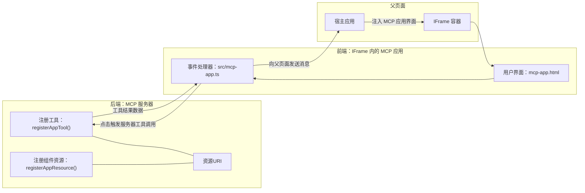
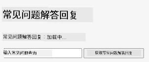
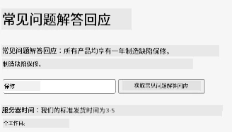
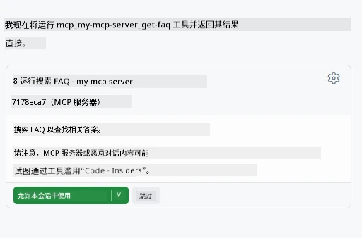

# MCP 应用程序

MCP 应用程序是 MCP 中的一种新范式。其理念不仅是你通过工具调用返回数据，还提供关于如何与这些信息交互的信息。这意味着工具结果现在可以包含 UI 信息。但为什么我们需要这样呢？考虑一下你今天是如何做的。你可能是通过在 MCP 服务器前面放置某种前端来使用结果，这些都是你需要编写和维护的代码。有时这正是你想要的，但有时如果你能引入一个自包含的片段，从数据到用户界面应有尽有，那将非常棒。

## 概述

本课提供关于 MCP 应用程序的实用指导，包括如何入门以及如何将其集成到现有 Web 应用中。MCP 应用程序是 MCP 标准中非常新的补充。

## 学习目标

通过本课，你将能够：

- 解释什么是 MCP 应用程序。
- 何时使用 MCP 应用程序。
- 构建并集成你自己的 MCP 应用程序。

## MCP 应用程序 - 它是如何工作的

MCP 应用程序的想法是提供一个本质上是可渲染组件的响应。这样的组件可以拥有视觉效果和交互性，比如按钮点击、用户输入等。我们先从服务器端和我们的 MCP 服务器开始。要创建 MCP 应用组件，你需要创建一个工具以及应用程序资源。这两个部分通过 resourceUri 连接。

这是一个例子。让我们尝试可视化涉及的内容以及哪些部分负责什么：

```text
server.ts -- responsible for registering tools and the component as a UI component
src/
  mcp-app.ts -- wiring up event handlers
mcp-app.html -- the user interface
```

该图描述了创建组件及其逻辑的架构。


接下来让我们描述后端和前端各自的职责。

### 后端

这里我们需要完成两件事：

- 注册我们想要交互的工具。
- 定义组件。

**注册工具**

```typescript
registerAppTool(
    server,
    "get-time",
    {
      title: "Get Time",
      description: "Returns the current server time.",
      inputSchema: {},
      _meta: { ui: { resourceUri } }, // 将此工具链接到其UI资源
    },
    async () => {
      const time = new Date().toISOString();
      return { content: [{ type: "text", text: time }] };
    },
  );

```

上面的代码描述了行为，暴露了一个名为 `get-time` 的工具。它不需要输入，但最终产生当前时间。对于需要接收用户输入的工具，我们可以定义 `inputSchema`。

**注册组件**

在同一个文件中，我们还需要注册组件：

```typescript
const resourceUri = "ui://get-time/mcp-app.html";

// 注册资源，返回用于用户界面的打包 HTML/JavaScript。
registerAppResource(
  server,
  resourceUri,
  resourceUri,
  { mimeType: RESOURCE_MIME_TYPE },
  async () => {
    const html = await fs.readFile(path.join(DIST_DIR, "mcp-app.html"), "utf-8");

    return {
    contents: [
        { uri: resourceUri, mimeType: RESOURCE_MIME_TYPE, text: html },
    ],
    };
  },
);
```

注意这里提到的 `resourceUri`，它将组件与其工具连接起来。还有回调函数中加载 UI 文件并返回组件的部分也值得关注。

### 组件前端

和后端一样，这里有两个部分：

- 用纯 HTML 编写的前端。
- 处理事件及其行为的代码，例如调用工具或与父窗口通信。

**用户界面**

来看一下用户界面。

```html
<!-- mcp-app.html -->
<!DOCTYPE html>
<html lang="en">
  <head>
    <meta charset="UTF-8" />
    <title>Get Time App</title>
  </head>
  <body>
    <p>
      <strong>Server Time:</strong> <code id="server-time">Loading...</code>
    </p>
    <button id="get-time-btn">Get Server Time</button>
    <script type="module" src="/src/mcp-app.ts"></script>
  </body>
</html>
```

**事件绑定**

最后一部分是事件绑定。也就是识别 UI 中需要事件处理器的部分，以及事件触发时应该做什么：

```typescript
// mcp-app.ts

import { App } from "@modelcontextprotocol/ext-apps";

// 获取元素引用
const serverTimeEl = document.getElementById("server-time")!;
const getTimeBtn = document.getElementById("get-time-btn")!;

// 创建应用实例
const app = new App({ name: "Get Time App", version: "1.0.0" });

// 处理来自服务器的工具结果。设置在 `app.connect()` 之前以避免
// 错过初始工具结果。
app.ontoolresult = (result) => {
  const time = result.content?.find((c) => c.type === "text")?.text;
  serverTimeEl.textContent = time ?? "[ERROR]";
};

// 连接按钮点击事件
getTimeBtn.addEventListener("click", async () => {
  // `app.callServerTool()` 让 UI 请求来自服务器的新数据
  const result = await app.callServerTool({ name: "get-time", arguments: {} });
  const time = result.content?.find((c) => c.type === "text")?.text;
  serverTimeEl.textContent = time ?? "[ERROR]";
});

// 连接到主机
app.connect();
```

如上所示，这是给 DOM 元素绑定事件的常规代码。值得一提的是调用了 `callServerTool`，它最终调用了后端的工具。

## 处理用户输入

到目前为止，我们已经看到一个带按钮的组件，点击时调用工具。现在我们看看是否可以添加更多 UI 元素，比如输入框，并发送参数到工具。让我们实现一个 FAQ 功能。其工作流程如下：

- 应该有一个按钮和一个输入元素，用户在输入框中键入关键词进行搜索，比如“Shipping”。这将调用后端的工具，该工具在 FAQ 数据中进行搜索。
- 一个支持上述 FAQ 搜索的工具。

我们先为后端添加所需支持：

```typescript
const faq: { [key: string]: string } = {
    "shipping": "Our standard shipping time is 3-5 business days.",
    "return policy": "You can return any item within 30 days of purchase.",
    "warranty": "All products come with a 1-year warranty covering manufacturing defects.",
  }

registerAppTool(
    server,
    "get-faq",
    {
      title: "Search FAQ",
      description: "Searches the FAQ for relevant answers.",
      inputSchema: zod.object({
        query: zod.string().default("shipping"),
      }),
      _meta: { ui: { resourceUri: faqResourceUri } }, // 将此工具链接到其用户界面资源
    },
    async ({ query }) => {
      const answer: string = faq[query.toLowerCase()] || "Sorry, I don't have an answer for that.";
      return { content: [{ type: "text", text: answer }] };
    },
  );
```

这里展示了如何填充 `inputSchema` 并赋予一个 `zod` 规则如：

```typescript
inputSchema: zod.object({
  query: zod.string().default("shipping"),
})
```

在上述规则中我们声明了有一个名为 `query` 的输入参数，它是可选的，默认值是 "shipping"。

好的，让我们继续看 *mcp-app.html*，了解需要创建什么样的 UI：

```html
<div class="faq">
    <h1>FAQ response</h1>
    <p>FAQ Response: <code id="faq-response">Loading...</code></p>
    <input type="text" id="faq-query" placeholder="Enter FAQ query" />
    <button id="get-faq-btn">Get FAQ Response</button>
  </div>
```

很好，现在我们有了输入元素和按钮。接下来到 *mcp-app.ts* 绑定这些事件：

```typescript
const getFaqBtn = document.getElementById("get-faq-btn")!;
const faqQueryInput = document.getElementById("faq-query") as HTMLInputElement;

getFaqBtn.addEventListener("click", async () => {
  const query = faqQueryInput.value;
  const result = await app.callServerTool({ name: "get-faq", arguments: { query } });
  const faq = result.content?.find((c) => c.type === "text")?.text;
  faqResponseEl.textContent = faq ?? "[ERROR]";
});
```

在上面的代码中，我们：

- 创建了对关键 UI 元素的引用。
- 处理按钮点击事件，解析输入元素的值，并调用 `app.callServerTool()`，传入 `name` 和 `arguments`，其中后者以 `query` 作为值。

调用 `callServerTool` 时实际上是向父窗口发送消息，父窗口最终调用 MCP 服务器。

### 试一试

试一试，我们现在应该看到如下界面：



这是我们输入类似“warranty”时的效果：



要运行这段代码，请访问 [代码部分](./code/README.md)

## 在 Visual Studio Code 中测试

Visual Studio Code 对 MVP 应用支持很好，可能是测试 MCP 应用最简单的方式之一。使用 Visual Studio Code，只需在 *mcp.json* 中添加一个服务器条目，如下所示：

```json
"my-mcp-server-7178eca7": {
    "url": "http://localhost:3001/mcp",
    "type": "http"
  }
```

然后启动服务器，你应该能够通过聊天窗口与 MVP 应用通信，前提是你已安装 GitHub Copilot。

通过提示触发，例如 "#get-faq"：



就像通过浏览器运行时一样，它以相同方式渲染：


## 练习任务

创建一个剪刀石头布游戏。它应包含以下内容：

UI：

- 一个带选项的下拉列表
- 一个提交选择的按钮
- 显示谁选了什么及谁获胜的标签

服务器：

- 应该有一个剪刀石头布的工具，输入为 "choice"。它还应随机生成电脑选择并决定胜者。

## 解决方案

[解决方案](./assignment/README.md)

## 总结

我们学习了这个新范式 MCP 应用。这是一个新范式，允许 MCP 服务器不仅对数据有见解，也对如何展示这些数据有见解。

此外，我们了解到这些 MCP 应用托管在 IFrame 中，与 MCP 服务器通信需要向父网页发送消息。现有多个库支持原生 JavaScript、React 等，简化了此通信过程。

## 关键要点

你学到了：

- MCP 应用是一个新标准，适合需要同时交付数据和 UI 功能的时候。
- 出于安全考虑，这类应用运行在 IFrame 中。

## 后续内容

- [第 4 章](../../04-PracticalImplementation/README.md)

---

<!-- CO-OP TRANSLATOR DISCLAIMER START -->
**免责声明**：  
本文件由人工智能翻译服务[Co-op Translator](https://github.com/Azure/co-op-translator)翻译而成。虽然我们努力确保准确性，但请注意自动翻译可能包含错误或不准确之处。原始语言版本的文件应被视为权威来源。对于关键信息，建议使用专业人工翻译。我们对因使用本翻译而产生的任何误解或误释不承担责任。
<!-- CO-OP TRANSLATOR DISCLAIMER END -->