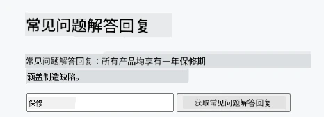
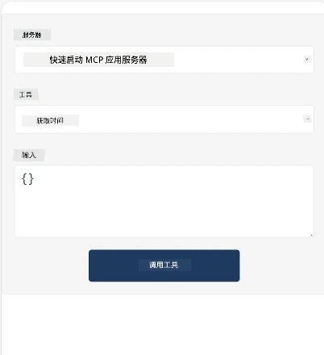
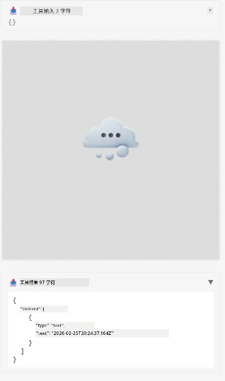

以下是演示 MCP 应用的示例

## 安装

1. 进入 *mcp-app* 文件夹  
1. 运行 `npm install`，这将安装前端和后端依赖项

通过运行以下命令验证后端是否编译成功：

```sh
npx tsc --noEmit
```
  
如果一切正常，应没有输出。

## 运行后端

> 如果你使用的是 Windows 机器，这需要额外操作，因为 MCP Apps 方案使用 `concurrently` 库来运行，你需要为此找到替代方案。以下是 MCP App 中 *package.json* 中相关的语句：

    ```json
    "start": "concurrently \"cross-env NODE_ENV=development INPUT=mcp-app.html vite build --watch\" \"tsx watch main.ts\""
    ```

该应用包含两个部分，后端部分和宿主部分。

启动后端，执行：

```sh
npm start
```
  
这应会在 `http://localhost:3001/mcp` 启动后端。

> 注意，如果你在 Codespace 中，可能需要将端口可见性设置为公共。请通过 https://<Codespace 名称>.app.github.dev/mcp 在浏览器中检查是否能访问该端点。

## 选项 -1 在 Visual Studio Code 中测试应用

在 Visual Studio Code 中测试该方案，操作如下：

- 在 `mcp.json` 中添加一个服务器条目，如下所示：

    ```json
    {
        "servers": {
            "my-mcp-server-7178eca7": {
                "url": "http://localhost:3001/mcp",
                "type": "http"
            }
        },
        "inputs": []
    }
    ```
  
1. 点击 *mcp.json* 中的“start”按钮  
1. 确保聊天窗口已打开并输入 `get-faq`，你应看到如下结果：

    

## 选项 -2- 使用宿主测试应用

仓库 <https://github.com/modelcontextprotocol/ext-apps> 包含多个可用于测试 MVP Apps 的不同宿主。

这里为你展示两种不同的选项：

### 本地机器

- 克隆仓库后，进入 *ext-apps* 文件夹。

- 安装依赖

   ```sh
   npm install
   ```
  
- 在另一个终端窗口，进入 *ext-apps/examples/basic-host*

    > 如果你使用 Codespace，需打开 serve.ts 文件的第 27 行，将 http://localhost:3001/mcp 替换为你的 Codespace 后端 URL，例如 https://psychic-xylophone-657rpjgvxpc5g64-3001.app.github.dev/mcp

- 运行宿主：

    ```sh
    npm start
    ```
  
    这应该将宿主与后端连接，你应看到应用程序正在运行，如下图所示：

    

### Codespace

要让 Codespace 环境工作，需要额外操作。通过 Codespace 使用宿主的步骤：

- 查看 *ext-apps* 目录并进入 *examples/basic-host*。  
- 运行 `npm install` 安装依赖  
- 运行 `npm start` 启动宿主。

## 测试应用

以如下方式测试该应用：

- 选择“Call Tool”按钮，你应看到如下结果：

    

太好了，一切正常工作。

---

<!-- CO-OP TRANSLATOR DISCLAIMER START -->
**免责声明**：
本文件使用人工智能翻译服务 [Co-op Translator](https://github.com/Azure/co-op-translator) 进行翻译。虽然我们力求准确，但请注意，自动翻译可能包含错误或不准确之处。请以原文文件作为权威来源。对于重要信息，建议采用专业人工翻译。对于因使用本翻译而引起的任何误解或误释，我们概不负责。
<!-- CO-OP TRANSLATOR DISCLAIMER END -->