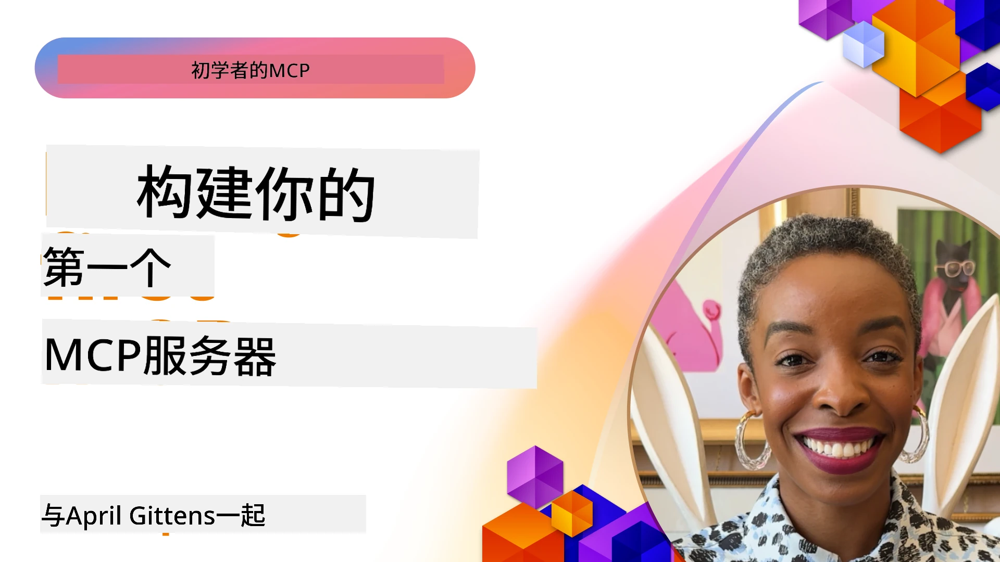

## 入门  

_(点击上图观看本课程视频)_

本节内容包含多个课程：

- **1 你的第一个服务器**，在本节课中，你将学习如何创建你的第一个服务器并使用 inspector 工具进行检查，这是测试和调试服务器的宝贵方法， [课程链接](01-first-server/README.md)

- **2 客户端**，本节课中，你将学习如何编写一个能连接服务器的客户端， [课程链接](02-client/README.md)

- **3 带 LLM 的客户端**，更好的客户端编写方式是为其添加大语言模型（LLM），使其可以与服务器“协商”应该执行的操作， [课程链接](03-llm-client/README.md)

- **4 在 Visual Studio Code 中使用服务器 GitHub Copilot Agent 模式**。本课展示如何在 Visual Studio Code 内运行 MCP 服务器， [课程链接](04-vscode/README.md)

- **5 stdio 传输服务器** stdio 传输是本地 MCP 服务器到客户端通信的推荐标准，提供基于子进程的安全通信，并内建进程隔离 [课程链接](05-stdio-server/README.md)

- **6 使用 MCP 的 HTTP 流式传输（可流式 HTTP）**。了解标准的
	远程传输，详见 [MCP 规范 2026-07-28](https://modelcontextprotocol.io/specification/2026-07-28/basic/transports/streamable-http)，
	以及课程中保留的遗留基于会话的实现。
	[课程链接](06-http-streaming/README.md)

- **7 利用 AI 工具包在 VSCode 中** 消费和测试你的 MCP 客户端和服务器 [课程链接](07-aitk/README.md)

- **8 测试**。本课重点介绍如何以不同方式测试你的服务器和客户端， [课程链接](08-testing/README.md)

- **9 部署**。本章介绍多种部署 MCP 解决方案的方法， [课程链接](09-deployment/README.md)

- **10 高级服务器使用**。本章覆盖高级服务器使用， [课程链接](./10-advanced/README.md)

- **11 认证**。本章介绍如何添加简单认证，从基本认证到使用 JWT 和 RBAC。建议你先从这里开始学习，然后查看第 5 章高级主题，同时通过第 2 章的建议进行额外的安全加固， [课程链接](./11-simple-auth/README.md)

- **12 MCP 主机**。配置和使用流行的 MCP 主机客户端包括 Claude Desktop、Cursor、Cline 和 Windsurf。了解传输类型及故障排除， [课程链接](./12-mcp-hosts/README.md)

- **13 MCP 检查器**。使用 MCP Inspector 工具交互式调试和测试 MCP 服务器。学习故障排除工具、资源和协议消息， [课程链接](./13-mcp-inspector/README.md)

- **14 采样**。学习 `2025-11-25` 版本的传统采样原语以及
	如何将新设计迁移到直接的 LLM 提供商集成。采样在 MCP `2026-07-28` 中
	已废弃。[前往课程](./14-sampling/README.md)

- **15 MCP 应用**。构建同时回复 UI 指令的 MCP 服务器，[前往课程](./15-mcp-apps/README.md)

模型上下文协议（MCP）是一种开放协议，规范了应用向 LLM 提供上下文的方式。可以把 MCP 想象成 AI 应用的 USB-C 端口——它提供了一种标准化的方法，将 AI 模型连接到不同的数据源和工具。

## 学习目标

完成本课后，你将能够：

- 设置 C#、Java、Python、TypeScript 和 JavaScript 的 MCP 开发环境
- 构建并部署具有自定义功能（资源、提示和工具）的基本 MCP 服务器
- 创建连接 MCP 服务器的主机应用
- 测试和调试 MCP 实现
- 理解常见的设置挑战及其解决方案
- 将你的 MCP 实现连接到流行的 LLM 服务

## 设置你的 MCP 环境

在开始使用 MCP 之前，准备好你的开发环境并了解基本工作流程非常重要。本节将引导你完成初始设置步骤，确保你能够顺利开始使用 MCP。

### 前提条件

在深入 MCP 开发之前，请确保你具备以下条件：

- <strong>开发环境</strong>：你所选语言（C#、Java、Python、TypeScript 或 JavaScript）对应的开发环境
- **IDE/编辑器**：Visual Studio、Visual Studio Code、IntelliJ、Eclipse、PyCharm 或任意现代代码编辑器
- <strong>包管理器</strong>：NuGet、Maven/Gradle、pip 或 npm/yarn
- **API 密钥**：对于你计划在主机应用中使用的任何 AI 服务

### 官方 SDK

在接下来的章节中，你将看到用 Python、TypeScript、
Java 和 .NET 构建的解决方案。以下是官方 SDK。

MCP `2026-07-28` 的 SDK 支持正在按语言独立推出。
在运行示例之前，请检查其包版本及 SDK 的发行说明，
以了解支持的协议修订版本。参见
[官方 SDK 列表](https://modelcontextprotocol.io/docs/sdk)：
- [C# SDK](https://github.com/modelcontextprotocol/csharp-sdk) - 与微软合作维护
- [Java SDK](https://github.com/modelcontextprotocol/java-sdk) - 与 Spring AI 合作维护
- [TypeScript SDK](https://github.com/modelcontextprotocol/typescript-sdk) - 官方 TypeScript 实现
- [Python SDK](https://github.com/modelcontextprotocol/python-sdk) - 官方 Python 实现 (FastMCP)
- [Kotlin SDK](https://github.com/modelcontextprotocol/kotlin-sdk) - 官方 Kotlin 实现
- [Swift SDK](https://github.com/modelcontextprotocol/swift-sdk) - 与 Loopwork AI 合作维护
- [Rust SDK](https://github.com/modelcontextprotocol/rust-sdk) - 官方 Rust 实现
- [Go SDK](https://github.com/modelcontextprotocol/go-sdk) - 官方 Go 实现

## 关键要点

- 使用特定语言的 SDK 设置 MCP 开发环境非常简单
- 构建 MCP 服务器需要创建并注册具有清晰架构的工具

- MCP 客户端连接到服务器和模型以利用扩展功能
- 测试和调试对于可靠的 MCP 实现至关重要
- 部署选项涵盖从本地开发到基于云的解决方案

## 练习

我们有一组示例，补充您将在本节所有章节中看到的练习。此外，每个章节也有其自己的练习和作业

- [Java 计算器](./samples/java/calculator/README.md)
- [.NET 计算器](../../../03-GettingStarted/samples/csharp)
- [JavaScript 计算器](./samples/javascript/README.md)
- [TypeScript 计算器](./samples/typescript/README.md)
- [Python 计算器](../../../03-GettingStarted/samples/python)

## 额外资源

- [在 Azure 上使用模型上下文协议构建代理](https://learn.microsoft.com/azure/developer/ai/intro-agents-mcp)
- [使用 Azure 容器应用的远程 MCP（Node.js/TypeScript/JavaScript）](https://learn.microsoft.com/samples/azure-samples/mcp-container-ts/mcp-container-ts/)
- [.NET OpenAI MCP 代理](https://learn.microsoft.com/samples/azure-samples/openai-mcp-agent-dotnet/openai-mcp-agent-dotnet/)

## 接下来

从第一课开始：[创建你的第一个 MCP 服务器](01-first-server/README.md)

完成本模块后，继续进行：[模块4：实践实现](../04-PracticalImplementation/README.md)

---

<!-- CO-OP TRANSLATOR DISCLAIMER START -->
**免责声明**：
本文件由 AI 翻译服务 [Co-op Translator](https://github.com/Azure/co-op-translator) 翻译完成。尽管我们力求准确，但请注意，自动翻译可能包含错误或不准确之处。原始语言版文件应视为权威来源。对于重要信息，建议使用专业人工翻译。我们对因使用本翻译而产生的任何误解或误释不承担责任。
<!-- CO-OP TRANSLATOR DISCLAIMER END -->