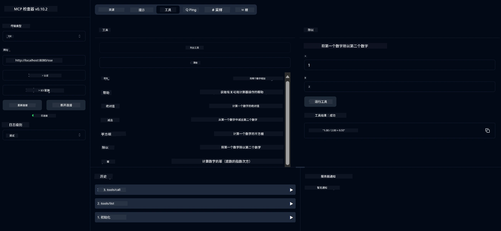

# 基础计算器 MCP 服务

> [!NOTE]
> 此示例使用传统的 HTTP+SSE 传输，并面向兼容 MCP `2025-11-25` 的 SDK。新的远程服务器应使用 `2026-07-28` 流式 HTTP 支持。
> 


## 概述

该服务展示了：
- 支持 SSE（服务器发送事件）
- 利用 Spring AI 的 `@Tool` 注解实现自动工具注册
- 基础计算器功能：
  - 加法、减法、乘法、除法
  - 幂运算和平方根
  - 取模（余数）和绝对值
  - 帮助函数，说明操作内容

## 功能

该计算器服务提供以下功能：

1. <strong>基础算术运算</strong>：
   - 两数相加
   - 一个数减去另一个数
   - 两数相乘
   - 一个数除以另一个数（包含除零检查）

2. <strong>高级运算</strong>：
   - 幂运算（底数的指数次幂）
   - 平方根计算（包含负数检查）
   - 取模（余数）计算
   - 绝对值计算

3. <strong>帮助系统</strong>：
   - 内置帮助函数，解释所有可用操作

## 使用该服务

该服务通过 MCP 协议暴露以下 API 端点：

- `add(a, b)`：加两数
- `subtract(a, b)`：从第一个数减去第二个数
- `multiply(a, b)`：两数相乘
- `divide(a, b)`：第一个数除以第二个数（含除零检测）
- `power(base, exponent)`：计算幂
- `squareRoot(number)`：计算平方根（含负数检测）
- `modulus(a, b)`：计算取模（余数）
- `absolute(number)`：计算绝对值
- `help()`：获取可用操作说明

## 测试客户端

在 `com.microsoft.mcp.sample.client` 包中包含了一个简单的测试客户端。`SampleCalculatorClient` 类演示了计算器服务的可用操作。

## 使用 LangChain4j 客户端

本项目包含一个 LangChain4j 示例客户端，位于 `com.microsoft.mcp.sample.client.LangChain4jClient`，演示如何将计算器服务与 LangChain4j 和 GitHub 模型集成：

### 前提条件

1. **GitHub Token 设置**：
   
   要使用 GitHub 的 AI 模型（如 phi-4），您需要一个 GitHub 个人访问令牌：

   a. 前往您的 GitHub 账户设置：https://github.com/settings/tokens
   
   b. 点击“生成新令牌”→“生成新令牌（经典）”
   
   c. 给令牌起一个描述性名称
   
   d. 选择以下权限范围：
      - `repo`（完全控制私有仓库）
      - `read:org`（读取组织和团队成员身份，读取组织项目）
      - `gist`（创建代码片段）

      - `user:email`（访问用户电子邮件地址（只读））
   
   e. 点击“生成令牌”并复制您的新令牌
   
   f. 将其设置为环境变量：
      
      在 Windows 上：
      ```
      set GITHUB_TOKEN=your-github-token
      ```
      
      在 macOS/Linux 上：
      ```bash
      export GITHUB_TOKEN=your-github-token
      ```

   g. 为了持久化设置，通过系统设置将其添加到环境变量中

2. 将 LangChain4j GitHub 依赖添加到您的项目中（已包含在 pom.xml 中）：
   ```xml
   <dependency>
       <groupId>dev.langchain4j</groupId>
       <artifactId>langchain4j-github</artifactId>
       <version>${langchain4j.version}</version>
   </dependency>
   ```

3. 确保计算器服务器正在 `localhost:8080` 上运行

### 运行 LangChain4j 客户端

此示例演示：
- 通过 SSE 传输连接到计算器 MCP 服务器
- 使用 LangChain4j 创建一个利用计算器操作的聊天机器人
- 集成 GitHub AI 模型（现使用 phi-4 模型）

客户端发送以下示例查询以展示功能：
1. 计算两个数字的和
2. 求一个数字的平方根
3. 获取有关可用计算器操作的帮助信息

运行示例并查看控制台输出，了解 AI 模型如何使用计算器工具响应查询。

### GitHub 模型配置

LangChain4j 客户端配置为使用 GitHub 的 phi-4 模型，设置如下：

```java
ChatLanguageModel model = GitHubChatModel.builder()
    .apiKey(System.getenv("GITHUB_TOKEN"))
    .timeout(Duration.ofSeconds(60))
    .modelName("phi-4")
    .logRequests(true)
    .logResponses(true)
    .build();
```

要使用其他 GitHub 模型，只需将 `modelName` 参数更改为另一个支持的模型（例如“claude-3-haiku-20240307”、“llama-3-70b-8192”等）。

## 依赖

该项目需要以下关键依赖：

```xml
<!-- For MCP Server -->
<dependency>
    <groupId>org.springframework.ai</groupId>
    <artifactId>spring-ai-starter-mcp-server-webflux</artifactId>
</dependency>

<!-- For LangChain4j integration -->
<dependency>
    <groupId>dev.langchain4j</groupId>
    <artifactId>langchain4j-mcp</artifactId>
    <version>${langchain4j.version}</version>
</dependency>

<!-- For GitHub models support -->
<dependency>
    <groupId>dev.langchain4j</groupId>
    <artifactId>langchain4j-github</artifactId>
    <version>${langchain4j.version}</version>
</dependency>
```

## 构建项目

使用 Maven 构建项目：
```bash
./mvnw clean install -DskipTests
```

## 运行服务器

### 使用 Java

```bash
java -jar target/calculator-server-0.0.1-SNAPSHOT.jar
```

### 使用 MCP Inspector

MCP Inspector 是一个用于与 MCP 服务交互的有用工具。要与此计算器服务一起使用：

1. **安装并运行 MCP Inspector**，在新终端窗口中：
   ```bash
   npx @modelcontextprotocol/inspector
   ```

2. **访问网页 UI**，点击应用显示的 URL（通常是 http://localhost:6274）

3. <strong>配置连接</strong>：
   - 将传输类型设置为“SSE”
   - 将 URL 设置为您正在运行的服务器的 SSE 端点：`http://localhost:8080/sse`
   - 点击“连接”

4. <strong>使用工具</strong>：
   - 点击“列出工具”查看可用的计算器操作
   - 选择一个工具并点击“运行工具”执行操作



### 使用 Docker

该项目包含用于容器化部署的 Dockerfile：

1. **构建 Docker 镜像**：
   ```bash
   docker build -t calculator-mcp-service .
   ```

2. **运行 Docker 容器**：
   ```bash
   docker run -p 8080:8080 calculator-mcp-service
   ```

这将：
- 使用 Maven 3.9.9 和 Eclipse Temurin 24 JDK 构建多阶段 Docker 镜像
- 创建优化的容器镜像
- 在端口 8080 上暴露服务
- 在容器内启动 MCP 计算器服务

容器运行后，您可以通过 `http://localhost:8080` 访问该服务。

## 故障排除

### GitHub 令牌常见问题


1. <strong>令牌权限问题</strong>：如果您收到403禁止访问错误，请检查您的令牌是否具有先决条件中概述的正确权限。

2. <strong>未找到令牌</strong>：如果您收到“未找到API密钥”错误，请确保已正确设置GITHUB_TOKEN环境变量。

3. <strong>速率限制</strong>：GitHub API有速率限制。如果遇到速率限制错误（状态码429），请等待几分钟后再试。

4. <strong>令牌过期</strong>：GitHub令牌可能会过期。如果一段时间后收到身份验证错误，请生成新令牌并更新您的环境变量。

如果您需要进一步帮助，请查看[LangChain4j文档](https://github.com/langchain4j/langchain4j)或[GitHub API文档](https://docs.github.com/en/rest)。

---

<!-- CO-OP TRANSLATOR DISCLAIMER START -->
**免责声明**：
本文件由 AI 翻译服务 [Co-op Translator](https://github.com/Azure/co-op-translator) 翻译完成。尽管我们力求准确，但请注意，自动翻译可能包含错误或不准确之处。原始语言版文件应视为权威来源。对于重要信息，建议使用专业人工翻译。我们对因使用本翻译而产生的任何误解或误释不承担责任。
<!-- CO-OP TRANSLATOR DISCLAIMER END -->