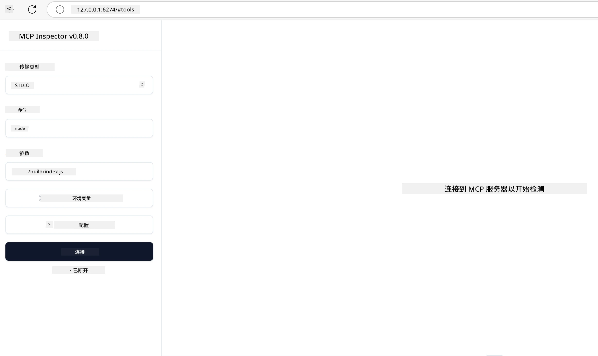

# 实践实现

[](https://youtu.be/vCN9-mKBDfQ)

_(点击上方图片查看本课的视频)_

实践实现是模型上下文协议 (MCP) 威力变得具体可感的环节。虽然理解 MCP 背后的理论和架构很重要，但当你应用这些概念来构建、测试和部署解决实际问题的方案时，才是真正体现其价值的时刻。本章旨在弥合概念知识与动手开发之间的鸿沟，引导你完成基于 MCP 应用的开发过程。

无论你是在开发智能助手、将 AI 集成到业务工作流中，还是构建用于数据处理的定制工具，MCP 都提供了一个灵活的基础。其语言无关的设计和针对流行编程语言的官方 SDK，使其可供广泛开发者使用。借助这些 SDK，你可以快速原型设计、迭代，并跨不同平台和环境扩展解决方案。

在以下章节中，你将找到实用示例、示范代码以及部署策略，展示如何在 C#、Java（Spring）、TypeScript、JavaScript 和 Python 中实现 MCP。你还将学习如何调试和测试 MCP 服务器、管理 API 以及使用 Azure 将解决方案部署到云。这些动手资源旨在加快你的学习进程，助你自信地构建健壮、适合生产环境的 MCP 应用。

## 概览

本课重点关注 MCP 在多种编程语言中的实际实现。我们将探讨如何使用 C#、Java（Spring）、TypeScript、JavaScript 和 Python 的 MCP SDK 构建健壮的应用，调试和测试 MCP 服务器，以及创建可复用的资源、提示和工具。

## 学习目标

本课结束后，你将能够：

- 使用各种官方 SDK 实现 MCP 解决方案
- 系统化调试和测试 MCP 服务器
- 创建并使用服务器功能（资源、提示和工具）
- 设计有效的 MCP 工作流以处理复杂任务
- 优化 MCP 实现的性能和可靠性

## 官方 SDK 资源

模型上下文协议提供多种语言的官方 SDK（与 [MCP 规范 2025-11-25](https://spec.modelcontextprotocol.io/specification/2025-11-25/) 对齐）：

- [C# SDK](https://github.com/modelcontextprotocol/csharp-sdk)
- [Java （Spring） SDK](https://github.com/modelcontextprotocol/java-sdk) **注意：** 需要依赖 [Project Reactor](https://projectreactor.io)。（详见[讨论话题 246](https://github.com/orgs/modelcontextprotocol/discussions/246)。）
- [TypeScript SDK](https://github.com/modelcontextprotocol/typescript-sdk)
- [Python SDK](https://github.com/modelcontextprotocol/python-sdk)
- [Kotlin SDK](https://github.com/modelcontextprotocol/kotlin-sdk)
- [Go SDK](https://github.com/modelcontextprotocol/go-sdk)

## 使用 MCP SDK

本节提供跨多种编程语言实现 MCP 的实用示例。你可以在 `samples` 目录中根据语言找到示例代码。

### 可用示例

代码仓库包含以下语言的[示例实现](../../../04-PracticalImplementation/samples)：

- [C#](./samples/csharp/README.md)
- [Java（Spring）](./samples/java/containerapp/README.md)
- [TypeScript](./samples/typescript/README.md)
- [JavaScript](./samples/javascript/README.md)
- [Python](./samples/python/README.md)

每个示例演示该语言及生态系统中的关键 MCP 概念和实现模式。

### 实用指南

附加的 MCP 实践实现指南：

- [分页和大结果集](./pagination/README.md) - 处理基于游标的分页，适用于工具、资源和大数据集

## 核心服务器功能

MCP 服务器可组合实现以下功能：

### 资源

资源为用户或 AI 模型提供上下文和数据：

- 文档仓库
- 知识库
- 结构化数据源
- 文件系统

### 提示

提示是用户用的模板化消息和工作流：

- 预定义对话模板
- 引导式交互模式
- 专门化对话结构

### 工具

工具是 AI 模型可执行的函数：

- 数据处理工具
- 外部 API 集成
- 计算功能
- 搜索功能

## 示例实现：C# 实现

官方 C# SDK 仓库包含多个示例实现，展示 MCP 的不同方面：

- **基础 MCP 客户端**：展示如何创建 MCP 客户端和调用工具的简单示例
- **基础 MCP 服务器**：具备基础工具注册的最简服务器实现
- **高级 MCP 服务器**：具备工具注册、身份验证和错误处理的完整服务器
- **ASP.NET 集成**：演示与 ASP.NET Core 集成的示例
- **工具实现模式**：展示不同复杂度下的工具实现多种模式

MCP C# SDK 处于预览状态，API 可能变化。我们将持续更新本博客，跟进 SDK 的发展。

### 关键功能

- [C# MCP Nuget ModelContextProtocol](https://www.nuget.org/packages/ModelContextProtocol)
- 构建你的[首个 MCP 服务器](https://devblogs.microsoft.com/dotnet/build-a-model-context-protocol-mcp-server-in-csharp/)。

完整 C# 实现示例，请访问[官方 C# SDK 示例仓库](https://github.com/modelcontextprotocol/csharp-sdk)

## 示例实现：Java（Spring）实现

Java（Spring）SDK 提供了具备企业级特性的强大 MCP 实现方案。

### 关键功能

- Spring 框架集成
- 强类型安全
- 响应式编程支持
- 全面错误处理

完整的 Java（Spring）实现示例，请参见示例目录中的 [Java（Spring）示例](samples/java/containerapp/README.md)。

## 示例实现：JavaScript 实现

JavaScript SDK 提供了轻量灵活的 MCP 实现方法。

### 关键功能

- 支持 Node.js 和浏览器
- 基于 Promise 的 API
- 易于与 Express 等框架集成
- 支持 WebSocket 流处理

完整的 JavaScript 实现示例，请参见示例目录中的 [JavaScript 示例](samples/javascript/README.md)。

## 示例实现：Python 实现

Python SDK 提供了符合 Python 习惯的 MCP 实现方式，并与主流机器学习框架有优良集成。

### 关键功能

- 支持 asyncio 的异步/等待
- FastAPI 集成``
- 简单的工具注册
- 与流行机器学习库的原生集成

完整的 Python 实现示例，请参见示例目录中的 [Python 示例](samples/python/README.md)。

## API 管理

Azure API 管理是保护 MCP 服务器的绝佳方案。思路是在你的 MCP 服务器前放置一个 Azure API 管理实例，它可处理你可能需要的功能，如：

- 限流
- 令牌管理
- 监控
- 负载均衡
- 安全性

### Azure 示例

这里有一个 Azure 示例，正是在做这件事，即[创建 MCP 服务器并用 Azure API 管理保护它](https://github.com/Azure-Samples/remote-mcp-apim-functions-python)。

下面图片展示了授权流程：


图片中发生了以下步骤：

- 使用 Microsoft Entra 进行身份验证/授权。
- Azure API 管理作为网关，使用策略来引导和管理流量。
- Azure Monitor 记录所有请求以便后续分析。

#### 授权流程

我们来详细看一下授权流程：


#### MCP 授权规范

了解更多关于[MCP 授权规范](https://spec.modelcontextprotocol.io/specification/2025-11-25/basic/authorization/)

## 将远程 MCP 服务器部署到 Azure

我们来看是否能部署前面提到的示例：

1. 克隆仓库

    ```bash
    git clone https://github.com/Azure-Samples/remote-mcp-apim-functions-python.git
    cd remote-mcp-apim-functions-python
    ```

1. 注册 `Microsoft.App` 资源提供者。

   - 如果使用 Azure CLI，运行 `az provider register --namespace Microsoft.App --wait`。
   - 如果使用 Azure PowerShell，运行 `Register-AzResourceProvider -ProviderNamespace Microsoft.App`。稍等片刻后运行`(Get-AzResourceProvider -ProviderNamespace Microsoft.App).RegistrationState`确认注册完成。

1. 运行此 [azd](https://aka.ms/azd) 命令预配 API 管理服务、函数应用（含代码）以及所有其它所需的 Azure 资源

    ```shell
    azd up
    ```

    该命令应在 Azure 上部署所有云资源

### 使用 MCP Inspector 测试你的服务器

1. 在**新终端窗口**中，安装并运行 MCP Inspector

    ```shell
    npx @modelcontextprotocol/inspector
    ```

    你应会看到类似界面：

    

1. 按住 CTRL 点击，加载应用显示的 MCP Inspector 网页（例如 [http://127.0.0.1:6274/#resources](http://127.0.0.1:6274/#resources)）
1. 将传输类型设置为 `SSE`
1. 将 URL 设置为 `azd up` 后显示的运行中 API 管理 SSE 端点并**连接**：

    ```shell
    https://<apim-servicename-from-azd-output>.azure-api.net/mcp/sse
    ```

1. **列出工具**。点击其中一个工具，然后**运行工具**。  

如果所有步骤都成功，则应已连接到 MCP 服务器，并能调用工具。

## Azure 的 MCP 服务器

[Remote-mcp-functions](https://github.com/Azure-Samples/remote-mcp-functions-dotnet)：该系列仓库是基于 Azure Functions 使用 Python、C# .NET 或 Node/TypeScript 快速构建和部署定制远程 MCP（模型上下文协议）服务器的模板。

该示例提供完整解决方案，使开发者能够：

- 本地构建和运行：在本地机器上开发和调试 MCP 服务器
- 部署到 Azure：通过简单的 azd up 命令轻松部署到云
- 从客户端连接：支持 VS Code 的 Copilot 代理模式以及 MCP Inspector 工具等多种客户端连接

### 关键功能

- 设计安全：MCP 服务器使用密钥和 HTTPS 保障安全
- 认证选项：支持内置认证和/或 API 管理的 OAuth
- 网络隔离：支持使用 Azure 虚拟网络（VNET）实现网络隔离
- 无服务器架构：利用 Azure Functions 实现可扩展、事件驱动执行
- 本地开发：提供全面的本地开发和调试支持
- 简单部署：简化的 Azure 部署流程

仓库包含所有必要的配置文件、源代码和基础设施定义，助你快速启动生产级 MCP 服务器实现。

- [Azure 远程 MCP Functions Python](https://github.com/Azure-Samples/remote-mcp-functions-python) - 使用 Azure Functions 和 Python 实现 MCP 的示例

- [Azure 远程 MCP Functions .NET](https://github.com/Azure-Samples/remote-mcp-functions-dotnet) - 使用 Azure Functions 和 C# .NET 实现 MCP 的示例

- [Azure 远程 MCP Functions Node/Typescript](https://github.com/Azure-Samples/remote-mcp-functions-typescript) - 使用 Azure Functions 和 Node/TypeScript 实现 MCP 的示例

## 关键要点

- MCP SDK 提供面向语言的工具以实现健壮的 MCP 解决方案
- 调试和测试过程是确保 MCP 应用可靠性的关键
- 可复用的提示模板支持一致的 AI 交互
- 精心设计的工作流可利用多个工具协调复杂任务
- 实现 MCP 解决方案需考虑安全性、性能和错误处理

## 练习

设计一个实用的 MCP 工作流，解决你领域中的实际问题：

1. 确定 3-4 个对解决此问题有用的工具
2. 创建一个工作流图，展示这些工具如何交互
3. 使用你喜欢的语言实现其中一个工具的基础版本
4. 创建一个提示模板，帮助模型有效使用你的工具

## 其它资源

---

## 接下来

下一章节: [高级主题](../05-AdvancedTopics/README.md)

---

<!-- CO-OP TRANSLATOR DISCLAIMER START -->
**免责声明**：
本文件使用 AI 翻译服务 [Co-op Translator](https://github.com/Azure/co-op-translator) 进行翻译。尽管我们致力于确保准确性，但请注意自动翻译可能包含错误或不准确之处。原始语言的文件应被视为权威来源。对于重要信息，建议采用专业人工翻译。对于因使用本翻译而产生的任何误解或误读，我们不承担任何责任。
<!-- CO-OP TRANSLATOR DISCLAIMER END -->