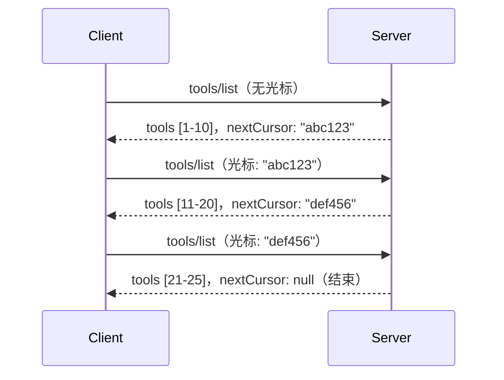

# MCP 中的分页和大型结果集

当您的 MCP 服务器处理大型数据集时——无论是列出数千个文件、数据库记录还是搜索结果——都需要分页来高效管理内存并提供响应式的用户体验。本指南介绍如何在 MCP 中实现和使用分页。

## 分页的重要性

如果没有分页，庞大的响应可能导致：

- <strong>内存耗尽</strong> —— 一次加载数百万条记录
- <strong>响应时间缓慢</strong> —— 用户须等待所有数据加载完成
- <strong>超时错误</strong> —— 请求超出超时限制
- **AI 性能差** —— 大型语言模型在庞大的上下文中表现不佳

MCP 使用<strong>基于游标的分页</strong>来可靠且一致地分页浏览结果集。

---

## MCP 分页工作原理

### 游标概念

<strong>游标</strong> 是一个不透明的字符串，用于标记您在结果集中的位置。可以把它想象成长篇书籍中的书签。



### MCP 方法中的分页

以下 MCP 方法支持分页：

| 方法 | 返回值 | 是否支持游标 |
|--------|---------|----------------|
| `tools/list` | 工具定义 | ✅ |
| `resources/list` | 资源定义 | ✅ |
| `prompts/list` | 提示定义 | ✅ |
| `resources/templates/list` | 资源模板 | ✅ |

---

## 服务器端实现

### Python（FastMCP）

```python
from mcp.server import Server
from mcp.types import Tool, ListToolsResult
import math

app = Server("paginated-server")

# 模拟大型数据集
ALL_TOOLS = [
    Tool(name=f"tool_{i}", description=f"Tool number {i}", inputSchema={})
    for i in range(100)
]

PAGE_SIZE = 10

@app.list_tools()
async def list_tools(cursor: str | None = None) -> ListToolsResult:
    """List tools with pagination support."""
    
    # 解码游标以获取起始索引
    start_index = 0
    if cursor:
        try:
            start_index = int(cursor)
        except ValueError:
            start_index = 0
    
    # 获取当前页结果
    end_index = min(start_index + PAGE_SIZE, len(ALL_TOOLS))
    page_tools = ALL_TOOLS[start_index:end_index]
    
    # 计算下一个游标
    next_cursor = None
    if end_index < len(ALL_TOOLS):
        next_cursor = str(end_index)
    
    return ListToolsResult(
        tools=page_tools,
        nextCursor=next_cursor
    )
```

### TypeScript

```typescript
import { Server } from "@modelcontextprotocol/sdk/server/index.js";
import { ListToolsResultSchema } from "@modelcontextprotocol/sdk/types.js";

const server = new Server({
  name: "paginated-server",
  version: "1.0.0"
});

// 模拟大型数据集
const ALL_TOOLS = Array.from({ length: 100 }, (_, i) => ({
  name: `tool_${i}`,
  description: `Tool number ${i}`,
  inputSchema: { type: "object", properties: {} }
}));

const PAGE_SIZE = 10;

server.setRequestHandler(ListToolsResultSchema, async (request) => {
  // 解码游标
  let startIndex = 0;
  if (request.params?.cursor) {
    startIndex = parseInt(request.params.cursor, 10) || 0;
  }
  
  // 获取结果页
  const endIndex = Math.min(startIndex + PAGE_SIZE, ALL_TOOLS.length);
  const pageTools = ALL_TOOLS.slice(startIndex, endIndex);
  
  // 计算下一个游标
  const nextCursor = endIndex < ALL_TOOLS.length ? String(endIndex) : undefined;
  
  return {
    tools: pageTools,
    nextCursor
  };
});
```

### Java（Spring MCP）

```java
@Service
public class PaginatedToolService {
    
    private static final int PAGE_SIZE = 10;
    private final List<Tool> allTools;
    
    public PaginatedToolService() {
        // 初始化大型数据集
        this.allTools = IntStream.range(0, 100)
            .mapToObj(i -> new Tool("tool_" + i, "Tool number " + i, Map.of()))
            .collect(Collectors.toList());
    }
    
    @McpMethod("tools/list")
    public ListToolsResult listTools(@Param("cursor") String cursor) {
        // 解码游标
        int startIndex = 0;
        if (cursor != null && !cursor.isEmpty()) {
            try {
                startIndex = Integer.parseInt(cursor);
            } catch (NumberFormatException e) {
                startIndex = 0;
            }
        }
        
        // 获取结果页面
        int endIndex = Math.min(startIndex + PAGE_SIZE, allTools.size());
        List<Tool> pageTools = allTools.subList(startIndex, endIndex);
        
        // 计算下一个游标
        String nextCursor = endIndex < allTools.size() ? String.valueOf(endIndex) : null;
        
        return new ListToolsResult(pageTools, nextCursor);
    }
}
```

---

## 客户端实现

### Python 客户端

```python
from mcp import ClientSession

async def get_all_tools(session: ClientSession) -> list:
    """Fetch all tools using pagination."""
    all_tools = []
    cursor = None
    
    while True:
        result = await session.list_tools(cursor=cursor)
        all_tools.extend(result.tools)
        
        if result.nextCursor is None:
            break
        cursor = result.nextCursor
    
    return all_tools

# 用法
async with client_session as session:
    tools = await get_all_tools(session)
    print(f"Found {len(tools)} tools")
```

### TypeScript 客户端

```typescript
import { Client } from "@modelcontextprotocol/sdk/client/index.js";

async function getAllTools(client: Client): Promise<Tool[]> {
  const allTools: Tool[] = [];
  let cursor: string | undefined = undefined;
  
  do {
    const result = await client.listTools({ cursor });
    allTools.push(...result.tools);
    cursor = result.nextCursor;
  } while (cursor);
  
  return allTools;
}

// 用法
const tools = await getAllTools(client);
console.log(`Found ${tools.length} tools`);
```

### 延迟加载模式

对于非常大的数据集，可按需加载页面：

```python
class PaginatedToolIterator:
    """Lazily iterate through paginated tools."""
    
    def __init__(self, session: ClientSession):
        self.session = session
        self.cursor = None
        self.buffer = []
        self.exhausted = False
    
    async def __anext__(self):
        # 如果可用，从缓冲区返回
        if self.buffer:
            return self.buffer.pop(0)
        
        # 检查是否已用尽所有页面
        if self.exhausted:
            raise StopAsyncIteration
        
        # 获取下一页
        result = await self.session.list_tools(cursor=self.cursor)
        self.buffer = list(result.tools)
        self.cursor = result.nextCursor
        
        if self.cursor is None:
            self.exhausted = True
        
        if not self.buffer:
            raise StopAsyncIteration
        
        return self.buffer.pop(0)
    
    def __aiter__(self):
        return self

# 用法 - 对大数据集内存高效
async for tool in PaginatedToolIterator(session):
    process_tool(tool)
```

---

## 资源分页

资源通常需要对目录或大型数据集进行分页：

```python
from mcp.server import Server
from mcp.types import Resource, ListResourcesResult
import os

app = Server("file-server")

@app.list_resources()
async def list_resources(cursor: str | None = None) -> ListResourcesResult:
    """List files in directory with pagination."""
    
    directory = "/data/files"
    all_files = sorted(os.listdir(directory))
    
    # 解码游标（文件索引）
    start_index = int(cursor) if cursor else 0
    page_size = 20
    end_index = min(start_index + page_size, len(all_files))
    
    # 为此页面创建资源列表
    resources = []
    for filename in all_files[start_index:end_index]:
        filepath = os.path.join(directory, filename)
        resources.append(Resource(
            uri=f"file://{filepath}",
            name=filename,
            mimeType="application/octet-stream"
        ))
    
    # 计算下一个游标
    next_cursor = str(end_index) if end_index < len(all_files) else None
    
    return ListResourcesResult(
        resources=resources,
        nextCursor=next_cursor
    )
```

---

## 游标设计策略

### 策略 1：基于索引（简单）

```python
# 光标只是索引
cursor = "50"  # 从第50项开始
```

**优点：** 简单，无状态
**缺点：** 如果有条目添加或移除，结果可能发生偏移

### 策略 2：基于 ID（稳定）

```python
# 光标是上次看到的ID
cursor = "item_abc123"  # 从此项之后开始
```

**优点：** 即使条目变化也稳定
**缺点：** 需要有序的 ID

### 策略 3：编码状态（复杂）

```python
import base64
import json

def encode_cursor(state: dict) -> str:
    return base64.b64encode(json.dumps(state).encode()).decode()

def decode_cursor(cursor: str) -> dict:
    return json.loads(base64.b64decode(cursor).decode())

# 光标包含多个状态字段
cursor = encode_cursor({
    "offset": 50,
    "filter": "active",
    "sort": "name"
})
```

**优点：** 能编码复杂的状态
**缺点：** 更复杂，游标字符串较大

---

## 最佳实践

### 1. 选择合适的页面大小

```python
# 考虑数据大小
PAGE_SIZE_SMALL_ITEMS = 100   # 简单元数据
PAGE_SIZE_MEDIUM_ITEMS = 20   # 更丰富的对象
PAGE_SIZE_LARGE_ITEMS = 5     # 复杂内容
```

### 2. 优雅处理无效游标

```python
@app.list_tools()
async def list_tools(cursor: str | None = None) -> ListToolsResult:
    try:
        start_index = int(cursor) if cursor else 0
        if start_index < 0 or start_index >= len(ALL_TOOLS):
            start_index = 0  # 重置到开始
    except (ValueError, TypeError):
        start_index = 0  # 无效的游标，重新开始
    # ...
```

### 3. 包含总计数（可选）

```python
return ListToolsResult(
    tools=page_tools,
    nextCursor=next_cursor,
    # 一些实现包括用于界面进度的总数
    _meta={"total": len(ALL_TOOLS)}
)
```

### 4. 测试边缘情况

```python
async def test_pagination():
    # 空结果集
    result = await session.list_tools()
    assert result.tools == []
    assert result.nextCursor is None
    
    # 单页
    result = await session.list_tools()
    assert len(result.tools) <= PAGE_SIZE
    
    # 无效的游标
    result = await session.list_tools(cursor="invalid")
    assert result.tools  # 应该返回第一页
```

---

## 常见陷阱

### ❌ 返回所有结果后再客户端分页

```python
# 不好：将所有内容加载到内存中
@app.list_tools()
async def list_tools() -> ListToolsResult:
    all_tools = load_all_tools()  # 一百万个工具！
    return ListToolsResult(tools=all_tools)
```

### ✅ 在数据源处分页

```python
# 好的：只加载所需的内容
@app.list_tools()
async def list_tools(cursor: str | None = None) -> ListToolsResult:
    offset = int(cursor) if cursor else 0
    tools = await db.query_tools(offset=offset, limit=PAGE_SIZE)
    return ListToolsResult(tools=tools, nextCursor=...)
```

---

## 下一步

- [模块 5.14 - 上下文工程](../../05-AdvancedTopics/mcp-contextengineering/README.md)
- [模块 8 - 最佳实践](../../08-BestPractices/README.md)
- [3.8 - 测试您的 MCP 服务器](../../03-GettingStarted/08-testing/README.md)

---

## 额外资源

- [MCP 规范 - 分页](https://modelcontextprotocol.io/specification/2026-07-28/)
- [基于游标的分页详解](https://slack.engineering/evolving-api-pagination-at-slack/)
- [Python SDK 分页测试](https://github.com/modelcontextprotocol/python-sdk/blob/main/tests/client/test_list_methods_cursor.py)

---

<!-- CO-OP TRANSLATOR DISCLAIMER START -->
**免责声明**：
本文件由 AI 翻译服务 [Co-op Translator](https://github.com/Azure/co-op-translator) 翻译完成。尽管我们力求准确，但请注意，自动翻译可能包含错误或不准确之处。原始语言版文件应视为权威来源。对于重要信息，建议使用专业人工翻译。我们对因使用本翻译而产生的任何误解或误释不承担责任。
<!-- CO-OP TRANSLATOR DISCLAIMER END -->