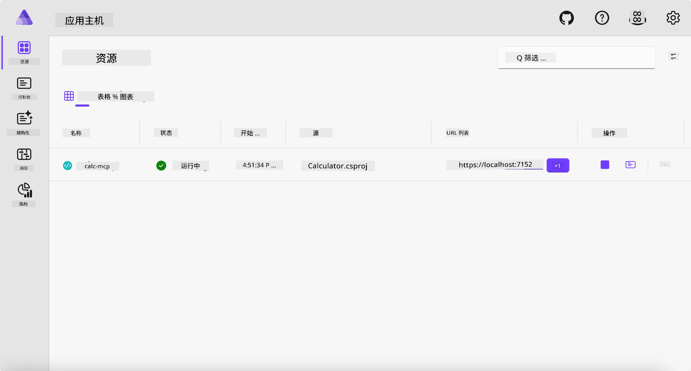
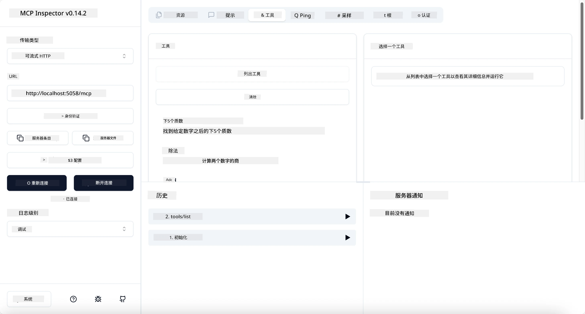
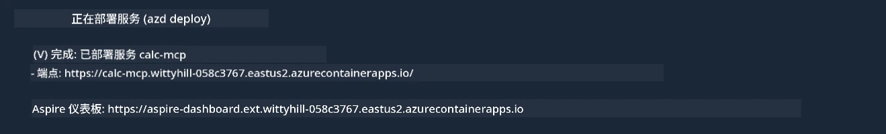

# 示例

上一个示例展示了如何使用本地的 .NET 项目搭配 `stdio` 类型，以及如何在容器中本地运行服务器。这在很多场景下是一个很好的解决方案。然而，有时让服务器远程运行，比如在云环境中，也是非常有用的。这时就用到了 `http` 类型。

看看 `04-PracticalImplementation` 文件夹中的解决方案，可能看起来比之前复杂得多。但实际上并非如此。如果仔细观察项目 `src/Calculator`，你会发现它大部分代码和之前示例相同。唯一的区别是我们使用了不同的库 `ModelContextProtocol.AspNetCore` 来处理 HTTP 请求。还有我们将方法 `IsPrime` 改为私有方法，仅仅是为了展示代码中也可以有私有方法。其余代码和之前一样。

其他项目来自 [Aspire](https://aspire.dev/get-started/what-is-aspire/)。在解决方案中引入 Aspire 可以提升开发者在开发和测试时的体验，并有助于可观测性。它不是运行服务器的必需，但在解决方案中包含它是一个好习惯。

## 本地启动服务器

1. 从 VS Code（安装了 C# DevKit 扩展）进入 `04-PracticalImplementation/samples/csharp` 目录。
1. 执行以下命令启动服务器：

   ```bash
    dotnet watch run --project ./src/AppHost
   ```

1. 当网页浏览器打开 Aspire 仪表盘时，注意 `http` URL。它应类似于 `http://localhost:5058/`。

   

## 使用 MCP Inspector 测试可流式传输的 HTTP

如果你有 Node.js 22.7.5 及以上版本，可以使用 MCP Inspector 测试你的服务器。

启动服务器，在终端运行以下命令：

```bash
npx @modelcontextprotocol/inspector http://localhost:5058
```



- 选择传输类型 `Streamable HTTP`。
- 在 Url 字段中输入之前记录的服务器 URL，并在后面追加 `/mcp`。它应为 `http`（非 `https`），类似 `http://localhost:5058/mcp`。
- 点击连接按钮。

Inspector 的一个好处是它提供了对发生事件的良好可视化。

- 尝试列出可用工具。
- 试用其中一些工具，应该和之前一样正常工作。

## 使用 VS Code 中的 GitHub Copilot Chat 测试 MCP 服务器

要使用 GitHub Copilot Chat 的 Streamable HTTP 传输，将之前创建的 `calc-mcp` 服务器配置更改为如下形式：

```jsonc
// .vscode/mcp.json
{
  "servers": {
    "calc-mcp": {
      "type": "http",
      "url": "http://localhost:5058/mcp"
    }
  }
}
```

做一些测试：

- 询问 “6780 后的 3 个素数”。注意 Copilot 会使用新工具 `NextFivePrimeNumbers`，只返回前 3 个素数。
- 询问 “111 后的 7 个素数”，看会发生什么。
- 询问 “约翰有 24 颗棒棒糖，想把它们全部分给他的 3 个孩子。每个孩子有多少颗？”，看看结果。

## 将服务器部署到 Azure

让我们把服务器部署到 Azure，以便更多人可以使用。

在终端进入文件夹 `04-PracticalImplementation/samples/csharp`，运行以下命令：

```bash
azd up
```

部署完成后，你应会看到如下消息：



复制 URL，用于 MCP Inspector 和 GitHub Copilot Chat。

```jsonc
// .vscode/mcp.json
{
  "servers": {
    "calc-mcp": {
      "type": "http",
      "url": "https://calc-mcp.gentleriver-3977fbcf.australiaeast.azurecontainerapps.io/mcp"
    }
  }
}
```

## 接下来是什么？

我们尝试了不同的传输类型和测试工具，也将 MCP 服务器部署到了 Azure。但如果我们的服务器需要访问私有资源怎么办？例如数据库或私有 API？下一章我们将看到如何提升服务器的安全性。

---

<!-- CO-OP TRANSLATOR DISCLAIMER START -->
**免责声明**：
本文件由 AI 翻译服务 [Co-op Translator](https://github.com/Azure/co-op-translator) 翻译完成。尽管我们力求准确，但请注意，自动翻译可能包含错误或不准确之处。原始语言版文件应视为权威来源。对于重要信息，建议使用专业人工翻译。我们对因使用本翻译而产生的任何误解或误释不承担责任。
<!-- CO-OP TRANSLATOR DISCLAIMER END -->