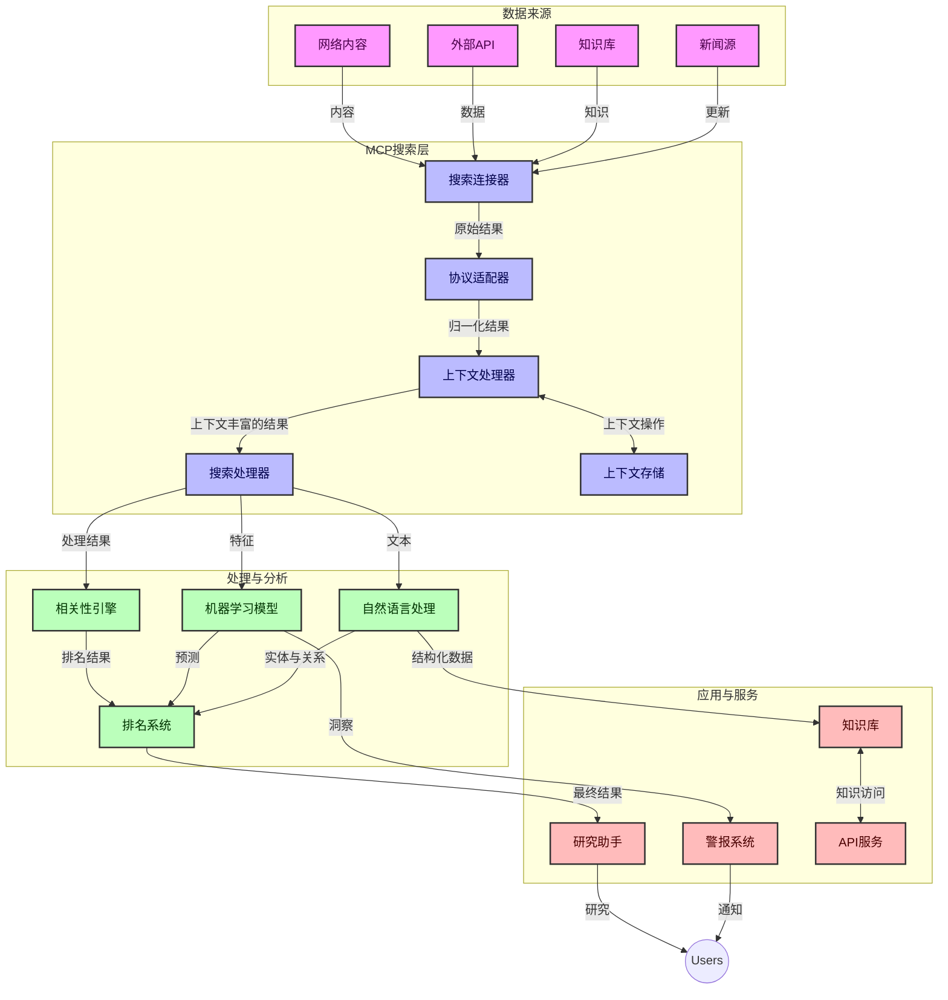
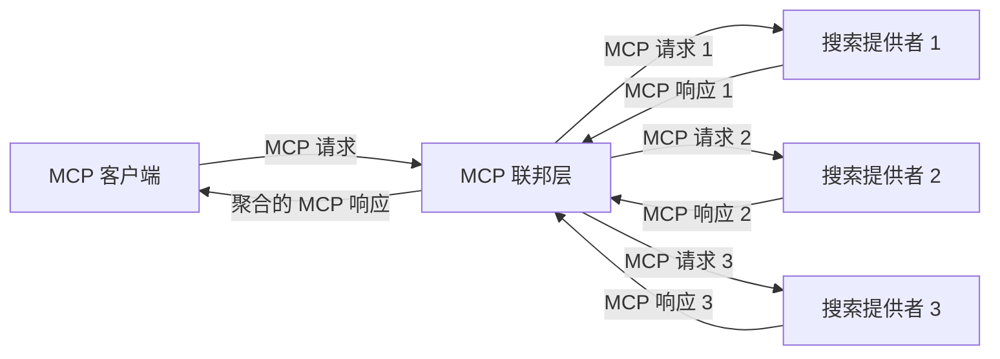
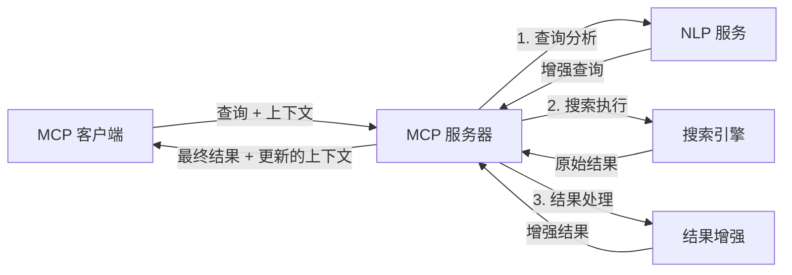

# 实时网络搜索的模型上下文协议

## 概述

在当今以信息为驱动的环境中，实时网络搜索变得至关重要，应用程序需要即时访问互联网中最新的信息，以提供相关且及时的响应。模型上下文协议（MCP）代表了优化这些实时搜索流程的显著进步，提升了搜索效率，维护上下文完整性，并改善整体系统性能。

本模块探讨了MCP如何通过为AI模型、搜索引擎和应用程序之间的上下文管理提供标准化方法，变革实时网络搜索。

### 你将学到的内容

在本综合指南中，你将发现：

- MCP如何创建AI模型与实时网络搜索能力之间的无缝桥梁
- 使用MCP实现高效且可扩展搜索解决方案的架构模式
- 在多次查询和交互中保持搜索上下文的技术
- Python和JavaScript中适用于各种搜索场景的实用代码实现
- 平衡MCP驱动搜索系统中的相关性、新鲜度和性能的方法

## 实时网络搜索简介

实时网络搜索是一种技术方法，允许对网络信息进行连续查询、处理和分析，随着信息的发布或更新，系统能以最小延迟提供新鲜且相关的信息。不同于传统搜索系统依赖可能已经过时数小时或数天的已索引数据，实时搜索处理来自网络的实时数据，提供反映在线内容当前状态的洞察和信息。

### 实时网络搜索的核心概念：

- <strong>连续查询处理</strong>：针对不断更新的数据源处理搜索查询
- <strong>新鲜度优先</strong>：系统设计为优先处理最新信息
- <strong>相关性平衡</strong>：在相关性和新鲜度之间保持平衡
- <strong>可扩展架构</strong>：系统必须应对可变的查询负载和数据量
- <strong>上下文理解</strong>：跨搜索迭代维护用户上下文对于获得有意义结果至关重要
- <strong>动态查询重构</strong>：根据上下文和先前结果自适应调整查询
- <strong>多源整合</strong>：合并来自多个搜索提供商和网络资源的结果
- <strong>语义理解</strong>：基于含义而非仅限关键词处理查询和内容
- <strong>实时排名</strong>：随着新信息的到达持续调整结果排名

### 模型上下文协议与实时网络搜索

模型上下文协议（MCP）解决了实时网络搜索环境中的几个关键挑战：

1. <strong>搜索上下文保留</strong>：MCP标准化了跨分布式搜索组件的上下文维护，确保AI模型和处理节点能够访问相关查询历史和用户偏好。

2. <strong>高效的查询管理</strong>：通过提供结构化的上下文传输机制，MCP减少了在每次搜索迭代中重复传递上下文的开销。

3. <strong>互操作性</strong>：MCP为多样搜索技术与AI模型之间的上下文共享创建了通用语言，支持更灵活和可扩展的架构。

4. <strong>搜索优化上下文</strong>：MCP实现可以优先考虑最相关的上下文元素，以优化性能和准确性。

5. <strong>自适应搜索处理</strong>：通过MCP的适当上下文管理，搜索系统能够基于不断变化的用户需求和信息环境动态调整处理。

在从新闻聚合到研究助理的现代应用中，将MCP与网络搜索技术集成，可实现更加智能、上下文感知的搜索，随着用户交互的继续提供越来越相关的结果。

## 学习目标

本课程结束时，你将能够：

- 了解实时网络搜索的基本原理及其在现代应用中的挑战
- 解释模型上下文协议（MCP）如何增强实时网络搜索能力
- 使用流行框架和API实现基于MCP的搜索解决方案
- 设计与部署具有MCP的可扩展高性能搜索架构
- 将MCP概念应用于语义搜索、研究辅助和AI增强浏览等多种用例
- 评估基于MCP搜索技术的新兴趋势和未来创新
- 开发从用户交互中学习的上下文感知搜索系统
- 使用标准化MCP协议将网络搜索功能集成入AI助手
- 创建多阶段搜索管道，基于上下文逐步优化结果
- 在保持全面上下文感知的同时优化搜索性能

### 定义与重要性

实时网络搜索涉及以最小延迟持续查询、检索和传递基于网络的信息。不同于周期性爬取和索引网络的传统搜索引擎，实时搜索旨在即时呈现信息，使用户能够获得最新内容的即时访问。

实时网络搜索的关键特性包括：

- <strong>新鲜度</strong>：优先展示最新内容和更新
- <strong>持续处理</strong>：不断监控新信息
- <strong>查询适应</strong>：基于上下文及反馈细化搜索查询
- <strong>即时交付</strong>：以最小延迟提供搜索结果
- <strong>上下文保留</strong>：基于先前查询持续改进相关性

### 传统网络搜索的挑战

传统网络搜索方法在应用到实时场景时面临若干限制：

1. <strong>上下文碎片化</strong>：跨多个查询难以维持搜索上下文
2. <strong>信息新鲜度</strong>：难以访问及优先最新信息
3. <strong>集成复杂性</strong>：搜索系统与应用间的互操作问题
4. <strong>延迟问题</strong>：在全面搜索和响应时间要求之间平衡
5. <strong>相关性调优</strong>：在优先新鲜度的同时确保准确和相关

## 理解搜索中的模型上下文协议（MCP）

### MCP在搜索语境中是什么？

模型上下文协议（MCP）是一种标准化通信协议，旨在促进AI模型与应用之间的高效交互。在实时网络搜索场景中，MCP提供了一个框架，用于：

- 在查询序列中保留搜索上下文
- 标准化搜索查询与结果格式
- 优化搜索参数与结果传输
- 加强模型与搜索引擎间的通信

### 核心组件与架构

MCP针对实时网络搜索的架构包含几个关键组件：

1. <strong>查询上下文处理器</strong>：管理并维持多次查询中的搜索上下文
2. <strong>搜索处理器</strong>：利用上下文感知技术处理传入的搜索请求
3. <strong>协议适配器</strong>：在不同搜索API间转换同时保留上下文
4. <strong>上下文存储</strong>：高效存储与检索搜索历史和偏好
5. <strong>搜索连接器</strong>：连接各种搜索引擎和网络API



### MCP如何提升实时网络搜索

MCP通过以下方式解决传统网络搜索面临的挑战：

- <strong>上下文连续性</strong>：维护整个搜索会话中查询之间的关系
- <strong>优化传输</strong>：通过智能上下文管理减少搜索参数冗余
- <strong>标准化接口</strong>：为搜索组件提供一致的API
- <strong>降低延迟</strong>：通过高效上下文处理减少处理开销
- <strong>增强相关性</strong>：通过保留用户意图提升多次查询中的搜索相关度

## 集成与实现

实时网络搜索系统需要精心的架构设计和实现，以保持性能和上下文完整性。模型上下文协议提供了一个标准化方法来集成AI模型与搜索技术，支持更复杂的上下文感知搜索管道。

### MCP在搜索架构中的集成概述

在实时网络搜索环境中实现MCP时需考虑若干关键点：

1. <strong>搜索上下文序列化</strong>：MCP提供高效机制，将上下文信息编码进搜索请求，确保核心上下文随着查询在处理管道中传递，包括针对搜索相关元数据优化的标准化序列化格式。

2. <strong>有状态搜索处理</strong>：MCP通过跨搜索迭代保持一致的上下文表示，实现更智能的有状态处理。这在多阶段搜索管道中尤为重要，因上下文细化能提升结果质量。

3. <strong>查询扩展与细化</strong>：基于累积上下文，MCP实现可支持复杂的查询扩展和细化，使搜索会话进展中结果更相关。

4. <strong>结果缓存与优先级调整</strong>：通过标准化上下文处理，MCP有助于管理结果缓存与优先级，使组件能基于不断变化的搜索上下文进行调整。

5. <strong>搜索联盟与聚合</strong>：MCP通过提供结构化的搜索上下文表示，促进多个后端的高级搜索联盟，实现多源结果的有意义聚合。

在各种搜索技术中实施MCP创造了统一的上下文管理方法，减少了定制集成代码的需求，同时增强系统在查询演进中保持有效上下文的能力。

### MCP在各种网络搜索实现中的应用

这些示例遵循当前MCP规范，核心为基于JSON-RPC的协议及区别运输机制。代码展示了如何实现自定义搜索集成，同时保持与MCP协议的完全兼容。


<details>
<summary>使用通用搜索API的Python实现</summary>

```python
import asyncio
import json
import aiohttp
from typing import Dict, Any, Optional, List
from contextlib import asynccontextmanager
from collections.abc import AsyncIterator

# 导入标准MCP库
from mcp.client.session import ClientSession
from mcp.client.streamable_http import streamablehttp_client
from mcp.types import TextContent, CreateMessageRequestParams, CreateMessageResult
from mcp.server.fastmcp import FastMCP

# 创建一个用于网页搜索的FastMCP服务器
search_server = FastMCP("WebSearch")

# 处理网页搜索操作的类
class WebSearchHandler:
    def __init__(self, api_endpoint: str, api_key: str):
        self.api_endpoint = api_endpoint
        self.api_key = api_key
        self.session = None
        
    async def initialize(self):
        """Initialize the HTTP session"""
        self.session = aiohttp.ClientSession(
            headers={"Authorization": f"Bearer {self.api_key}"}
        )
    
    async def close(self):
        """Close the HTTP session"""
        if self.session:
            await self.session.close()
            
    async def perform_search(self, query: str, max_results: int = 5, 
                           include_domains: List[str] = None, 
                           exclude_domains: List[str] = None,
                           time_period: str = "any") -> Dict[str, Any]:
        """Perform web search using the search API"""
        # 构建搜索参数
        search_params = {
            "q": query,
            "limit": max_results,
            "time": time_period
        }
        
        if include_domains:
            search_params["site"] = ",".join(include_domains)
            
        if exclude_domains:
            search_params["exclude_site"] = ",".join(exclude_domains)
        
        # 执行搜索请求
        try:
            async with self.session.get(
                self.api_endpoint,
                params=search_params
            ) as response:
                if response.status != 200:
                    error_text = await response.text()
                    raise Exception(f"Search API error: {response.status} - {error_text}")
                
                search_data = await response.json()
                
                # 将特定API的响应转换为标准格式
                results = []
                for item in search_data.get("results", []):
                    results.append({
                        "title": item.get("title", ""),
                        "url": item.get("url", ""),
                        "snippet": item.get("snippet", ""),
                        "date": item.get("published_date", ""),
                        "source": item.get("source", "")
                    })
                
                return {
                    "query": query,
                    "totalResults": len(results),
                    "results": results
                }
        except Exception as e:
            print(f"Search API request error: {e}")
            raise

# 初始化搜索处理器
search_handler = WebSearchHandler(
    api_endpoint="https://api.search-service.example/search",
    api_key="your-api-key-here"
)

# 设置生命周期以管理搜索处理器
@asyncio.asynccontextmanager
async def app_lifespan(server: FastMCP):
    """Manage application lifecycle"""
    await search_handler.initialize()
    try:
        yield {"search_handler": search_handler}
    finally:
        await search_handler.close()

# 设置服务器的生命周期
search_server = FastMCP("WebSearch", lifespan=app_lifespan)

# 注册一个网页搜索工具
@search_server.tool()
async def web_search(query: str, max_results: int = 5, 
                   include_domains: List[str] = None,
                   exclude_domains: List[str] = None,
                   time_period: str = "any") -> Dict[str, Any]:
    """
    Search the web for information
    
    Args:
        query: The search query
        max_results: Maximum number of results to return (default: 5)
        include_domains: List of domains to include in search results
        exclude_domains: List of domains to exclude from search results
        time_period: Time period for results ("day", "week", "month", "any")
        
    Returns:
        Dictionary containing search results
    """
    ctx = search_server.get_context()
    search_handler = ctx.request_context.lifespan_context["search_handler"]
    
    results = await search_handler.perform_search(
        query=query,
        max_results=max_results,
        include_domains=include_domains,
        exclude_domains=exclude_domains,
        time_period=time_period
    )
    
    return results

# 示例客户端用法
async def client_example():
    # 使用可流式HTTP传输连接到搜索服务器
    async with streamablehttp_client("http://localhost:8000/mcp") as (read, write, _):
        async with ClientSession(read, write) as session:
            # 初始化连接
            await session.initialize()
            
            # 调用web_search工具
            search_results = await session.call_tool(
                "web_search", 
                {
                    "query": "latest developments in AI and Model Context Protocol",
                    "max_results": 5,
                    "time_period": "day",
                    "include_domains": ["github.com", "microsoft.com"]
                }
            )
            
            print(f"Search results: {search_results}")

# 服务器执行示例
if __name__ == "__main__":
    # 使用可流式HTTP传输运行服务器
    search_server.run(transport="streamable-http")
```
</details> 

<details>
<summary>基于浏览器搜索的JavaScript实现</summary>


```javascript
// 用于网络搜索的MCP服务器实现
import { McpServer, ResourceTemplate } from '@modelcontextprotocol/sdk/server/mcp.js';
import { StreamableHTTPServerTransport } from '@modelcontextprotocol/sdk/server/streamableHttp.js';
import { z } from 'zod';

// 创建一个用于网络搜索的MCP服务器
const searchServer = new McpServer({
    name: "BrowserSearch",
    description: "A server that provides web search capabilities"
});

// 搜索服务类
class SearchService {
    constructor(searchApiUrl, apiKey) {
        this.searchApiUrl = searchApiUrl;
        this.apiKey = apiKey;
    }

    async performSearch(parameters) {
        const {
            query = '',
            maxResults = 5,
            includeDomains = [],
            excludeDomains = [],
            timePeriod = 'any'
        } = parameters;
        
        // 使用参数构建搜索URL
        const url = new URL(this.searchApiUrl);
        url.searchParams.append('q', query);
        url.searchParams.append('limit', maxResults);
        url.searchParams.append('time', timePeriod);
        
        if (includeDomains.length > 0) {
            url.searchParams.append('site', includeDomains.join(','));
        }
        
        if (excludeDomains.length > 0) {
            url.searchParams.append('exclude_site', excludeDomains.join(','));
        }
        
        try {
            const response = await fetch(url.toString(), {
                method: 'GET',
                headers: {
                    'Authorization': `Bearer ${this.apiKey}`,
                    'Content-Type': 'application/json'
                }
            });
            
            if (!response.ok) {
                const errorText = await response.text();
                throw new Error(`Search API error: ${response.status} - ${errorText}`);
            }
            
            const searchData = await response.json();
            
            // 将特定API的响应转换为标准格式
            const results = searchData.results?.map(item => ({
                title: item.title || '',
                url: item.url || '',
                snippet: item.snippet || '',
                date: item.published_date || '',
                source: item.source || ''
            })) || [];
            
            return {
                query,
                totalResults: results.length,
                results
            };
        } catch (error) {
            console.error('Search API request error:', error);
            throw error;
        }
    }
}

// 初始化搜索服务
const searchService = new SearchService(
    'https://api.search-service.example/search',
    'your-api-key-here'
);

// 为服务器设置上下文提供者
searchServer.setContextProvider(() => {
    return {
        searchService
    };
});

// 注册网络搜索工具
searchServer.tool({
    name: 'web_search',
    description: 'Search the web for information',
    parameters: {
        type: 'object',
        properties: {
            query: {
                type: 'string',
                description: 'The search query'
            },
            maxResults: {
                type: 'integer',
                description: 'Maximum number of results to return',
                default: 5
            },
            includeDomains: {
                type: 'array',
                items: { type: 'string' },
                description: 'List of domains to include in search results'
            },
            excludeDomains: {
                type: 'array',
                items: { type: 'string' },
                description: 'List of domains to exclude from search results'
            },
            timePeriod: {
                type: 'string',
                description: 'Time period for results',
                enum: ['day', 'week', 'month', 'any'],
                default: 'any'
            }
        },
        required: ['query']
    },
    handler: async (params, context) => {
        const { searchService } = context;
        return await searchService.performSearch(params);
    }
});

// 连接搜索服务器的示例客户端代码
import { Client } from '@modelcontextprotocol/sdk/client/index.js';
import { StreamableHTTPClientTransport } from '@modelcontextprotocol/sdk/client/streamableHttp.js';

async function connectToSearchServer() {
    // 连接搜索服务器
    const transport = new StreamableHTTPClientTransport(
        new URL('http://localhost:8000/mcp')
    );
    
    const client = new Client({
        name: 'search-client',
        version: '1.0.0'
    });
    
    await client.connect(transport);
    
    // 执行搜索工具
    const searchResults = await client.callTool({
        name: 'web_search',
        arguments: {
            query: 'Model Context Protocol implementation examples',
            maxResults: 10,
            timePeriod: 'week',
            includeDomains: ['github.com', 'docs.microsoft.com']
        }
    });
    
    console.log('Search results:', searchResults);
    
    // 清理
    await client.disconnect();
}

// 启动服务器
const transport = new StreamableHTTPServerTransport();
await searchServer.connect(transport);
console.log('Search server running at http://localhost:8000/mcp');

// 在单独的进程中或服务器启动后
// connectToSearchServer().catch(console.error);
```
</details> 


## 代码示例免责声明

> <strong>重要提示</strong>：下述代码示例展示了模型上下文协议（MCP）与网络搜索功能的集成。尽管它们遵循官方MCP SDK的模式和结构，但为了教学目的进行了简化。
> 
> 这些示例展示：
> 
> 1. **Python实现**：FastMCP服务器实现了一个网络搜索工具并连接外部搜索API。示例展示了正确的生命周期管理、上下文处理和工具实现，遵循[官方MCP Python SDK](https://github.com/modelcontextprotocol/python-sdk)模式。服务器采用建议的Streamable HTTP传输，该方式已取代生产环境中旧的SSE传输。
> 
> 2. **JavaScript实现**：基于TypeScript/JavaScript，使用[官方MCP TypeScript SDK](https://github.com/modelcontextprotocol/typescript-sdk)的FastMCP模式创建搜索服务器，包含适当的工具定义与客户端连接。遵循最新推荐的会话管理和上下文保持模式。
> 
> 这些示例在生产环境中需要添加额外的错误处理、认证和具体API集成代码。示例中的搜索API端点（`https://api.search-service.example/search`）为占位符，需替换为实际搜索服务端点。
> 
> 有关完整实现细节和最新方法，请参阅[官方MCP规范](https://spec.modelcontextprotocol.io/)及SDK文档。

## 核心概念

### 模型上下文协议（MCP）框架

MCP的基础是为AI模型、应用和服务之间交换上下文提供标准化方式。在实时网络搜索中，这一框架对创建连贯的多轮搜索体验至关重要。关键组件包括：

1. **客户端-服务器架构**：MCP建立了搜索客户端（请求者）与搜索服务器（提供者）之间的明确分离，支持灵活的部署模式。

2. **JSON-RPC通信**：协议采用JSON-RPC进行消息交换，兼容网络技术，便于跨平台实现。

3. <strong>上下文管理</strong>：MCP定义了结构化方法，维护、更新并利用多个交互中的搜索上下文。

4. <strong>工具定义</strong>：搜索能力以标准化工具形式暴露，具有明确定义的参数和返回值。

5. <strong>流媒体支持</strong>：协议支持流式结果，对于可能逐步到达结果的实时搜索尤为关键。

### 网络搜索集成模式

集成MCP和网络搜索时，产生了几种典型模式：

#### 1. 直接搜索提供商集成


在此模式中，MCP服务器直接与一个或多个搜索API接口，将MCP请求转换为特定API调用，并格式化结果为MCP响应。

#### 2. 保持上下文的联合搜索



该模式将搜索查询分发至多个兼容MCP的搜索提供商，可能各自专注不同内容类型或搜索能力，同时保持统一上下文。

#### 3. 上下文增强的搜索链



该模式将搜索过程分为多个阶段，每个步骤中增强上下文，逐步获得更相关结果。

### 搜索上下文组件

在基于MCP的网络搜索中，上下文通常包含：

- <strong>查询历史</strong>：会话内先前的搜索查询
- <strong>用户偏好</strong>：语言、地区、安全搜索设置
- <strong>交互历史</strong>：点击过哪些结果，在结果上停留时间
- <strong>搜索参数</strong>：过滤条件、排序规则及其他搜索修饰
- <strong>领域知识</strong>：与搜索相关的特定主题上下文
- <strong>时间上下文</strong>：基于时间的相关性因素
- <strong>来源偏好</strong>：可信或偏好的信息来源

## 用例与应用

### 研究与信息收集

MCP通过以下方式增强研究工作流程：

- 在搜索会话中保留研究上下文
- 支持更复杂且具上下文相关性的查询
- 支持多源搜索联合
- 促进从搜索结果中提取知识

### 实时新闻与趋势监测

MCP驱动的搜索为新闻监测带来优势：

- 接近实时地发现新兴新闻事件
- 根据上下文筛选相关信息
- 跨多源跟踪话题和实体
- 基于用户上下文的个性化新闻提醒

### AI增强的浏览与研究

MCP为AI增强浏览创造了新可能：

- 基于当前浏览活动的上下文搜索建议
- 将网络搜索与基于大型语言模型的助手无缝集成
- 多轮搜索细化并维护上下文
- 增强事实核查与信息验证

## 未来趋势与创新

### MCP在网络搜索中的演进

展望未来，我们预计MCP将不断发展以应对：


- <strong>多模态搜索</strong>：整合文本、图像、音频和视频搜索并保持上下文  
- <strong>去中心化搜索</strong>：支持分布式和联合搜索生态系统  
- <strong>搜索隐私</strong>：上下文感知的隐私保护搜索机制  
- <strong>查询理解</strong>：对自然语言搜索查询进行深度语义解析  

### 技术潜在进展  

将塑造MCP搜索未来的新兴技术：  

1. <strong>神经搜索架构</strong>：面向MCP优化的基于嵌入的搜索系统  
2. <strong>个性化搜索上下文</strong>：随着时间推移学习个体用户的搜索模式  
3. <strong>知识图谱集成</strong>：由领域特定知识图谱增强的上下文搜索  
4. <strong>跨模态上下文</strong>：保持不同搜索模态间的上下文  

## 实操练习  

### 练习 1：搭建基础MCP搜索管道  

在本练习中，你将学习如何：  
- 配置基础的MCP搜索环境  
- 实现网页搜索的上下文处理程序  
- 测试并验证搜索迭代过程中的上下文保持  

### 练习 2：使用MCP搜索构建研究助手  

创建一个完整的应用，能够：  
- 处理自然语言研究问题  
- 执行上下文感知的网页搜索  
- 综合多个来源的信息  
- 展示有条理的研究成果  

### 练习 3：用MCP实现多源搜索联合  

进阶练习内容包括：  
- 上下文感知的多搜索引擎查询分发  
- 结果排名与聚合  
- 搜索结果的上下文去重  
- 处理特定来源的元数据  

## 额外资源  

- [Model Context Protocol 规范](https://spec.modelcontextprotocol.io/) - 官方MCP规范及详细协议文档  
- [Model Context Protocol 文档](https://modelcontextprotocol.io/) - 详细教程及实现指南  
- [MCP Python SDK](https://github.com/modelcontextprotocol/python-sdk) - MCP协议官方Python实现  
- [MCP TypeScript SDK](https://github.com/modelcontextprotocol/typescript-sdk) - MCP协议官方TypeScript实现  
- [MCP参考服务器](https://github.com/modelcontextprotocol/servers) - MCP服务器参考实现  
- [Bing Web Search API 文档](https://learn.microsoft.com/en-us/bing/search-apis/bing-web-search/overview) - 微软网页搜索API  
- [Google定制搜索JSON API](https://developers.google.com/custom-search/v1/overview) - 谷歌可编程搜索引擎  
- [SerpAPI 文档](https://serpapi.com/search-api) - 搜索引擎结果页面API  
- [Meilisearch 文档](https://www.meilisearch.com/docs) - 开源搜索引擎  
- [Elasticsearch 文档](https://www.elastic.co/guide/index.html) - 分布式搜索与分析引擎  
- [LangChain 文档](https://python.langchain.com/docs/get_started/introduction) - 使用LLM构建应用  

## 学习成果  

通过完成本模块，你将能够：  

- 理解实时网页搜索的基础和挑战  
- 说明Model Context Protocol (MCP) 如何增强实时网页搜索能力  
- 使用流行框架和API实现基于MCP的搜索解决方案  
- 设计并部署可扩展的高性能MCP搜索架构  
- 将MCP概念应用于语义搜索、研究助手和AI增强浏览等多种用例  
- 评估基于MCP搜索技术的新兴趋势和未来创新  


### 信任与安全考量  

在实现基于MCP的网页搜索解决方案时，请牢记MCP规范中的以下重要原则：  

1. <strong>用户同意与控制</strong>：用户必须明确同意并理解所有数据访问和操作。这一点对于可能访问外部数据源的网页搜索实现尤为重要。  

2. <strong>数据隐私</strong>：确保妥善处理搜索查询和结果，尤其当其可能包含敏感信息时。实施适当的访问控制以保护用户数据。  

3. <strong>工具安全</strong>：对搜索工具实施适当的授权和验证，因为它们可能通过任意代码执行引发安全风险。除非从可信服务器获取，否则应将工具行为描述视为不可信。  

4. <strong>清晰文档</strong>：提供关于MCP搜索实现的功能、限制和安全考量的清晰文档，遵循MCP规范中的实现指南。  

5. <strong>稳健的同意流程</strong>：构建稳健的同意和授权流程，明确说明每个工具的功能，尤其是与外部网页资源交互的工具，在授权前进行解释说明。  

有关MCP安全与信任考量的完整细节，请参阅[官方文档](https://modelcontextprotocol.io/specification/2025-11-25/basic/security_best_practices)。  

## 接下来是什么  

- [5.12 Model Context Protocol 服务器的 Entra ID 身份验证](../mcp-security-entra/README.md)  

---

<!-- CO-OP TRANSLATOR DISCLAIMER START -->
**免责声明**：
本文件由 AI 翻译服务 [Co-op Translator](https://github.com/Azure/co-op-translator) 翻译完成。尽管我们力求准确，但请注意，自动翻译可能包含错误或不准确之处。原始语言版文件应视为权威来源。对于重要信息，建议使用专业人工翻译。我们对因使用本翻译而产生的任何误解或误释不承担责任。
<!-- CO-OP TRANSLATOR DISCLAIMER END -->