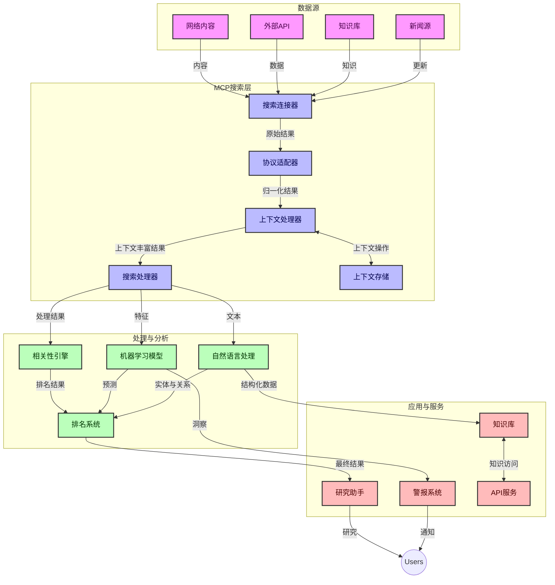
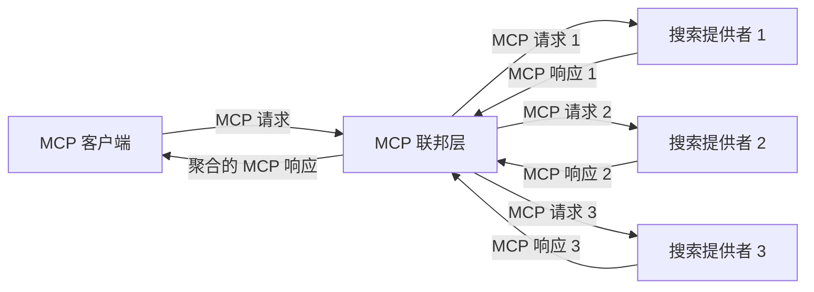
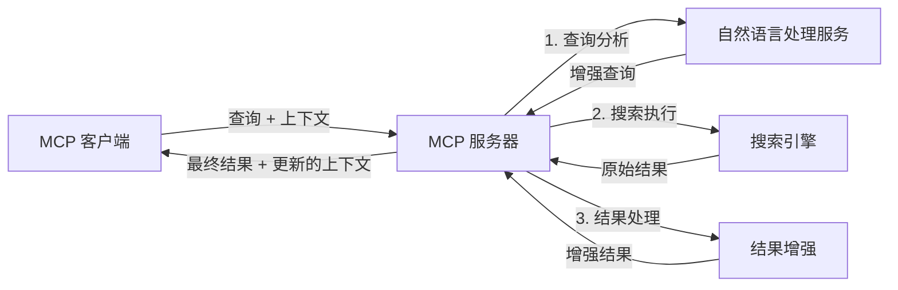

# 实时网络搜索的模型上下文协议

## 概述

实时网络搜索在当今信息驱动的环境中已变得必不可少，应用程序需要即时访问互联网上的最新信息，以提供相关且及时的响应。模型上下文协议 (MCP) 代表了优化这些实时搜索过程的重要进展，提升搜索效率，保持上下文完整性，并改善整体系统性能。

本模块探讨了 MCP 如何通过为 AI 模型、搜索引擎和应用程序提供上下文管理的标准化方法，改造实时网络搜索。

### 您将学到的内容

在这份全面指南中，您将发现：

- MCP 如何在 AI 模型和实时网络搜索能力之间建立无缝桥梁
- 使用 MCP 实现高效且可扩展搜索解决方案的架构模式
- 保持跨多次查询和交互的搜索上下文的技术
- 针对各种搜索场景的 Python 和 JavaScript 实际代码实现
- 在 MCP 支持的搜索系统中平衡相关性、新鲜度和性能的方法

## 实时网络搜索介绍

实时网络搜索是一种技术方法，使系统能够连续查询、处理和分析发布或更新的网络信息，从而以极低延迟提供新鲜相关的信息。与操作基于可能已有数小时或数天的索引数据的传统搜索系统不同，实时搜索处理来自网络的实时数据，传递反映当前在线内容状态的洞察和信息。

### 实时网络搜索的核心概念：

- <strong>连续查询处理</strong>：针对不断更新的数据源处理搜索查询
- <strong>新鲜度优先</strong>：系统设计优先展示最新信息
- <strong>相关性平衡</strong>：保持相关性和新鲜度之间的平衡
- <strong>可扩展架构</strong>：系统必须处理可变的查询负载和数据量
- <strong>上下文理解</strong>：跨搜索迭代保持用户上下文对生成有意义的结果至关重要
- <strong>动态查询重构</strong>：基于上下文和之前结果自适应修改查询
- <strong>多源整合</strong>：结合来自多个搜索提供者和网络来源的结果
- <strong>语义理解</strong>：根据含义而非仅凭关键词处理查询和内容
- <strong>实时排名</strong>：随着新信息的到来持续调整结果排名

### 模型上下文协议与实时网络搜索

模型上下文协议（MCP）解决了实时网络搜索环境中的若干关键挑战：

1. <strong>搜索上下文保持</strong>：MCP 标准化了分布式搜索组件中上下文的维护方式，确保 AI 模型和处理节点能够访问相关的查询历史和用户偏好。

2. <strong>高效查询管理</strong>：通过提供结构化的上下文传输机制，MCP 减少了在每次搜索迭代中重复上下文的开销。

3. <strong>互操作性</strong>：MCP 为不同搜索技术和 AI 模型之间的上下文共享创建通用语言，实现更灵活和可扩展的架构。

4. <strong>搜索优化上下文</strong>：MCP 实现能优先考虑最有效搜索的相关上下文元素，优化性能与准确性。

5. <strong>自适应搜索处理</strong>：通过 MCP 的恰当上下文管理，搜索系统可以根据不断变化的用户需求和信息环境动态调整处理。

在从新闻聚合到研究助手等现代应用中，MCP 与网络搜索技术的集成实现了更智能、上下文感知的搜索，能够在用户交互推进过程中提供日益相关的结果。

## 学习目标

本课结束时，您将能够：

- 理解实时网络搜索及其在现代应用中的挑战基础
- 解释模型上下文协议（MCP）如何增强实时网络搜索能力
- 使用流行框架和 API 实现基于 MCP 的搜索解决方案
- 设计和部署具备可扩展性和高性能的 MCP 搜索架构
- 应用 MCP 概念于语义搜索、研究协助和 AI 辅助浏览等多种用例
- 评估 MCP 搜索技术的新兴趋势与未来创新
- 开发能从用户交互中学习的上下文感知搜索系统
- 使用标准化 MCP 协议将网络搜索能力集成到 AI 助手中
- 创建基于上下文逐步精炼结果的多阶段搜索管道
- 在保持全面上下文感知的同时优化搜索性能

### 定义与重要性

实时网络搜索涉及对网络信息的连续查询、检索和交付，延迟极低。与周期性爬取和索引网络的传统搜索引擎不同，实时搜索旨在即时呈现信息，实现对最新内容的即时访问。

实时网络搜索的关键特性包括：

- <strong>新鲜度</strong>：优先展示近期内容和更新
- <strong>连续处理</strong>：持续监控新信息
- <strong>查询适应</strong>：基于上下文和反馈完善搜索查询
- <strong>即时交付</strong>：以最小延迟提供搜索结果
- <strong>上下文保留</strong>：基于之前查询提升相关性

### 传统网络搜索中的挑战

传统网络搜索方法在应用于实时场景时面临若干限制：

1. <strong>上下文碎片化</strong>：难以跨多次查询维护搜索上下文
2. <strong>信息新鲜度</strong>：难以访问及优先显示最新信息
3. <strong>集成复杂性</strong>：搜索系统与应用间互操作性问题
4. <strong>延迟问题</strong>：在综合搜索与响应时间要求间的平衡
5. <strong>相关性调优</strong>：在优先新鲜度的同时确保准确性与相关性

## 理解模型上下文协议 (MCP) 在搜索中的应用

### MCP 在搜索场景中是什么？

模型上下文协议 (MCP) 是一种标准化通信协议，旨在促进 AI 模型与应用程序之间的高效交互。在实时网络搜索场景中，MCP 提供了以下框架：

- 在查询序列中保持搜索上下文
- 标准化搜索查询和结果格式
- 优化搜索参数和结果的传输
- 增强模型与搜索引擎之间的通信

### 核心组件与架构

MCP 架构用于实时网络搜索，包含若干关键组件：

1. <strong>查询上下文处理器</strong>：管理并保持跨多次查询的搜索上下文
2. <strong>搜索处理器</strong>：使用上下文感知技术处理传入的搜索请求
3. <strong>协议适配器</strong>：在保持上下文的同时转换不同搜索 API
4. <strong>上下文存储</strong>：高效存取搜索历史和偏好
5. <strong>搜索连接器</strong>：连接多种搜索引擎和网络 API



### MCP 如何改进实时网络搜索

MCP 通过以下方式解决传统网络搜索的挑战：

- <strong>上下文连续性</strong>：维持整个搜索会话中查询之间的关系
- <strong>优化传输</strong>：通过智能上下文管理减少搜索参数冗余
- <strong>标准化接口</strong>：为搜索组件提供一致的 API
- <strong>降低延迟</strong>：通过高效上下文处理减少处理开销
- <strong>增强相关性</strong>：通过保持用户意图在多次查询中提升搜索相关性

## 集成与实现

实时网络搜索系统需要精心的架构设计和实现，以维护性能和上下文完整性。模型上下文协议为集成 AI 模型和搜索技术提供了标准化方法，实现更复杂、上下文感知的搜索流水线。

### MCP 在搜索架构中的集成概览

在实时网络搜索环境中实施 MCP 需要考虑以下关键点：

1. <strong>搜索上下文序列化</strong>：MCP 提供高效的机制对搜索请求中的上下文信息进行编码，确保关键上下文随查询贯穿整个处理管线。这包括针对搜索相关元数据优化的标准序列化格式。

2. <strong>有状态搜索处理</strong>：MCP 通过维护搜索迭代中一致的上下文表示，支持更智能的有状态处理。这在分阶段搜索流水线中尤为重要，可通过上下文细化提升结果。

3. <strong>查询扩展与细化</strong>：搜索系统中的 MCP 实现可基于积累的上下文实现复杂的查询扩展与细化，随着会话推进实现更相关的结果。

4. <strong>结果缓存与优先级</strong>：通过标准化上下文处理，MCP 有助于结果缓存和优先级管理，使组件能够基于变化的搜索上下文自适应调整。

5. <strong>搜索联合与聚合</strong>：MCP 通过提供结构化的搜索上下文表示，支持更复杂的多后端搜索联合，促进来自多样来源结果的有意义聚合。

MCP 在各种搜索技术中的实现，创建了统一的上下文管理方法，减少了定制集成代码的需求，同时增强系统在搜索查询演变时保持上下文关联的能力。

### MCP 在各种网络搜索实现中的应用

以下示例遵循当前 MCP 规范，侧重于基于 JSON-RPC 的协议和不同传输机制。代码展示了如何在保持与 MCP 协议完全兼容的情况下实现定制搜索集成。


<details>
<summary>带通用搜索 API 的 Python 实现</summary>

```python
import asyncio
import json
import aiohttp
from typing import Dict, Any, Optional, List
from contextlib import asynccontextmanager
from collections.abc import AsyncIterator

# 导入标准的 MCP 库
from mcp.client.session import ClientSession
from mcp.client.streamable_http import streamablehttp_client
from mcp.types import TextContent, CreateMessageRequestParams, CreateMessageResult
from mcp.server.fastmcp import FastMCP

# 创建一个用于网络搜索的 FastMCP 服务器
search_server = FastMCP("WebSearch")

# 用于处理网络搜索操作的类
class WebSearchHandler:
    def __init__(self, api_endpoint: str, api_key: str):
        self.api_endpoint = api_endpoint
        self.api_key = api_key
        self.session = None
        
    async def initialize(self):
        """Initialize the HTTP session"""
        self.session = aiohttp.ClientSession(
            headers={"Authorization": f"Bearer {self.api_key}"}
        )
    
    async def close(self):
        """Close the HTTP session"""
        if self.session:
            await self.session.close()
            
    async def perform_search(self, query: str, max_results: int = 5, 
                           include_domains: List[str] = None, 
                           exclude_domains: List[str] = None,
                           time_period: str = "any") -> Dict[str, Any]:
        """Perform web search using the search API"""
        # 构造搜索参数
        search_params = {
            "q": query,
            "limit": max_results,
            "time": time_period
        }
        
        if include_domains:
            search_params["site"] = ",".join(include_domains)
            
        if exclude_domains:
            search_params["exclude_site"] = ",".join(exclude_domains)
        
        # 执行搜索请求
        try:
            async with self.session.get(
                self.api_endpoint,
                params=search_params
            ) as response:
                if response.status != 200:
                    error_text = await response.text()
                    raise Exception(f"Search API error: {response.status} - {error_text}")
                
                search_data = await response.json()
                
                # 将特定于 API 的响应转换为标准格式
                results = []
                for item in search_data.get("results", []):
                    results.append({
                        "title": item.get("title", ""),
                        "url": item.get("url", ""),
                        "snippet": item.get("snippet", ""),
                        "date": item.get("published_date", ""),
                        "source": item.get("source", "")
                    })
                
                return {
                    "query": query,
                    "totalResults": len(results),
                    "results": results
                }
        except Exception as e:
            print(f"Search API request error: {e}")
            raise

# 初始化搜索处理器
search_handler = WebSearchHandler(
    api_endpoint="https://api.search-service.example/search",
    api_key="your-api-key-here"
)

# 设置生命周期以管理搜索处理器
@asyncio.asynccontextmanager
async def app_lifespan(server: FastMCP):
    """Manage application lifecycle"""
    await search_handler.initialize()
    try:
        yield {"search_handler": search_handler}
    finally:
        await search_handler.close()

# 设置服务器的生命周期
search_server = FastMCP("WebSearch", lifespan=app_lifespan)

# 注册网络搜索工具
@search_server.tool()
async def web_search(query: str, max_results: int = 5, 
                   include_domains: List[str] = None,
                   exclude_domains: List[str] = None,
                   time_period: str = "any") -> Dict[str, Any]:
    """
    Search the web for information
    
    Args:
        query: The search query
        max_results: Maximum number of results to return (default: 5)
        include_domains: List of domains to include in search results
        exclude_domains: List of domains to exclude from search results
        time_period: Time period for results ("day", "week", "month", "any")
        
    Returns:
        Dictionary containing search results
    """
    ctx = search_server.get_context()
    search_handler = ctx.request_context.lifespan_context["search_handler"]
    
    results = await search_handler.perform_search(
        query=query,
        max_results=max_results,
        include_domains=include_domains,
        exclude_domains=exclude_domains,
        time_period=time_period
    )
    
    return results

# 客户端使用示例
async def client_example():
    # 使用可流式 HTTP 传输连接到搜索服务器
    async with streamablehttp_client("http://localhost:8000/mcp") as (read, write, _):
        async with ClientSession(read, write) as session:
            # 初始化连接
            await session.initialize()
            
            # 调用 web_search 工具
            search_results = await session.call_tool(
                "web_search", 
                {
                    "query": "latest developments in AI and Model Context Protocol",
                    "max_results": 5,
                    "time_period": "day",
                    "include_domains": ["github.com", "microsoft.com"]
                }
            )
            
            print(f"Search results: {search_results}")

# 服务器执行示例
if __name__ == "__main__":
    # 使用可流式 HTTP 传输运行服务器
    search_server.run(transport="streamable-http")
```
</details> 

<details>
<summary>基于浏览器搜索的 JavaScript 实现</summary>


```javascript
// 用于网络搜索的MCP服务器实现
import { McpServer, ResourceTemplate } from '@modelcontextprotocol/sdk/server/mcp.js';
import { StreamableHTTPServerTransport } from '@modelcontextprotocol/sdk/server/streamableHttp.js';
import { z } from 'zod';

// 创建一个用于网络搜索的MCP服务器
const searchServer = new McpServer({
    name: "BrowserSearch",
    description: "A server that provides web search capabilities"
});

// 搜索服务类
class SearchService {
    constructor(searchApiUrl, apiKey) {
        this.searchApiUrl = searchApiUrl;
        this.apiKey = apiKey;
    }

    async performSearch(parameters) {
        const {
            query = '',
            maxResults = 5,
            includeDomains = [],
            excludeDomains = [],
            timePeriod = 'any'
        } = parameters;
        
        // 使用参数构建搜索URL
        const url = new URL(this.searchApiUrl);
        url.searchParams.append('q', query);
        url.searchParams.append('limit', maxResults);
        url.searchParams.append('time', timePeriod);
        
        if (includeDomains.length > 0) {
            url.searchParams.append('site', includeDomains.join(','));
        }
        
        if (excludeDomains.length > 0) {
            url.searchParams.append('exclude_site', excludeDomains.join(','));
        }
        
        try {
            const response = await fetch(url.toString(), {
                method: 'GET',
                headers: {
                    'Authorization': `Bearer ${this.apiKey}`,
                    'Content-Type': 'application/json'
                }
            });
            
            if (!response.ok) {
                const errorText = await response.text();
                throw new Error(`Search API error: ${response.status} - ${errorText}`);
            }
            
            const searchData = await response.json();
            
            // 将特定API响应转换为标准格式
            const results = searchData.results?.map(item => ({
                title: item.title || '',
                url: item.url || '',
                snippet: item.snippet || '',
                date: item.published_date || '',
                source: item.source || ''
            })) || [];
            
            return {
                query,
                totalResults: results.length,
                results
            };
        } catch (error) {
            console.error('Search API request error:', error);
            throw error;
        }
    }
}

// 初始化搜索服务
const searchService = new SearchService(
    'https://api.search-service.example/search',
    'your-api-key-here'
);

// 设置服务器的上下文提供器
searchServer.setContextProvider(() => {
    return {
        searchService
    };
});

// 注册网络搜索工具
searchServer.tool({
    name: 'web_search',
    description: 'Search the web for information',
    parameters: {
        type: 'object',
        properties: {
            query: {
                type: 'string',
                description: 'The search query'
            },
            maxResults: {
                type: 'integer',
                description: 'Maximum number of results to return',
                default: 5
            },
            includeDomains: {
                type: 'array',
                items: { type: 'string' },
                description: 'List of domains to include in search results'
            },
            excludeDomains: {
                type: 'array',
                items: { type: 'string' },
                description: 'List of domains to exclude from search results'
            },
            timePeriod: {
                type: 'string',
                description: 'Time period for results',
                enum: ['day', 'week', 'month', 'any'],
                default: 'any'
            }
        },
        required: ['query']
    },
    handler: async (params, context) => {
        const { searchService } = context;
        return await searchService.performSearch(params);
    }
});

// 连接搜索服务器的示例客户端代码
import { Client } from '@modelcontextprotocol/sdk/client/index.js';
import { StreamableHTTPClientTransport } from '@modelcontextprotocol/sdk/client/streamableHttp.js';

async function connectToSearchServer() {
    // 连接搜索服务器
    const transport = new StreamableHTTPClientTransport(
        new URL('http://localhost:8000/mcp')
    );
    
    const client = new Client({
        name: 'search-client',
        version: '1.0.0'
    });
    
    await client.connect(transport);
    
    // 执行搜索工具
    const searchResults = await client.callTool({
        name: 'web_search',
        arguments: {
            query: 'Model Context Protocol implementation examples',
            maxResults: 10,
            timePeriod: 'week',
            includeDomains: ['github.com', 'docs.microsoft.com']
        }
    });
    
    console.log('Search results:', searchResults);
    
    // 清理
    await client.disconnect();
}

// 启动服务器
const transport = new StreamableHTTPServerTransport();
await searchServer.connect(transport);
console.log('Search server running at http://localhost:8000/mcp');

// 在单独的进程中或服务器启动后
// connectToSearchServer().catch(console.error);
```
</details> 


## 代码示例免责声明

> <strong>重要提示</strong>：以下代码示例展示了模型上下文协议 (MCP) 与网络搜索功能的集成。尽管它们遵循官方 MCP SDK 的模式和结构，但为了教学目的已简化。
> 
> 这些示例涵盖：
> 
> 1. **Python 实现**：一个 FastMCP 服务器实现，提供网络搜索工具并连接外部搜索 API。该示例演示了按官方 MCP Python SDK（https://github.com/modelcontextprotocol/python-sdk）模式进行的生命周期管理、上下文处理和工具实现。服务器使用推荐的可流传输 HTTP 传输机制，取代了旧的 SSE 传输以用于生产部署。
> 
> 2. **JavaScript 实现**：基于官方 MCP TypeScript SDK（https://github.com/modelcontextprotocol/typescript-sdk）中的 FastMCP 模式，使用 TypeScript/JavaScript 创建搜索服务器，具备正确的工具定义和客户端连接。它遵循最新推荐的会话管理和上下文保留的模式。
> 
> 这些示例在生产环境中需要额外的错误处理、认证及具体 API 集成代码。示例中的搜索 API 端点（https://api.search-service.example/search）为占位符，需替换为实际搜索服务端点。
> 
> 有关完整实现细节和最新方法，参见
> 官方 MCP 规范（https://modelcontextprotocol.io/specification/2026-07-28/）
> 及 SDK 文档。

## 核心概念

### 模型上下文协议（MCP）框架

模型上下文协议的基础是为 AI 模型、应用程序和服务之间交换上下文提供标准化方式。在实时网络搜索中，该框架对于创建连贯的多轮搜索体验至关重要。主要组件包括：

1. **客户端-服务器架构**：MCP 建立了搜索客户端（请求者）和搜索服务器（提供者）之间的清晰分离，支持灵活的部署模型。

2. **JSON-RPC 通信**：协议使用 JSON-RPC 进行消息交换，使其兼容网络技术且易于跨平台实现。

3. <strong>上下文管理</strong>：MCP 定义了维护、更新和利用跨多次交互搜索上下文的结构化方法。

4. <strong>工具定义</strong>：将搜索能力作为标准化工具暴露，具有明确的参数和返回值。

5. <strong>流支持</strong>：协议支持流式传输结果，这对结果可能逐步到达的实时搜索至关重要。

### 网络搜索集成模式

将 MCP 集成到网络搜索时，出现了若干典型模式：

#### 1. 直接搜索提供者集成


该模式中，MCP 服务器直接与一个或多个搜索 API 接口交互，将 MCP 请求转换为特定 API 调用，并将结果格式化为 MCP 响应。

#### 2. 带上下文保持的联合搜索



此模式将搜索查询分配给多个兼容 MCP 的搜索提供者，各个提供者可能专注于不同类型的内容或搜索能力，同时维持统一的上下文。

#### 3. 上下文增强的搜索链



该模式将搜索过程划分为多个阶段，每一步丰富上下文，实现渐进式更相关的结果。

### 搜索上下文组件

MCP 基础的网络搜索中，上下文通常包括：

- <strong>查询历史</strong>：会话中的前几次搜索查询
- <strong>用户偏好</strong>：语言、地区、安全搜索设置
- <strong>交互历史</strong>：点击哪些结果、在结果上停留的时间
- <strong>搜索参数</strong>：过滤器、排序方式及其他搜索修饰符
- <strong>领域知识</strong>：与搜索相关的特定主题上下文
- <strong>时间上下文</strong>：基于时间的相关性因素
- <strong>来源偏好</strong>：可信赖或偏好的信息来源

## 使用案例和应用

### 研究与信息收集

MCP 通过以下方式增强研究工作流程：

- 在搜索会话中保持研究上下文
- 支持更复杂且符合上下文的查询
- 支持多源搜索联合
- 促进从搜索结果中提取知识

### 实时新闻及趋势监控

MCP 支持的搜索为新闻监控带来优势：

- 近实时发现新兴新闻故事
- 对相关信息进行上下文过滤
- 跨多个来源的主题和实体跟踪
- 基于用户上下文的个性化新闻提醒

### AI 辅助浏览与研究

MCP 为 AI 辅助浏览创造了新可能：

- 基于当前浏览活动的上下文搜索建议
- 与大型语言模型驱动助手无缝集成的网络搜索
- 保持上下文的多轮搜索细化
- 增强事实核查和信息验证

## 未来趋势与创新

### MCP 在网络搜索中的演进

展望未来，我们预计 MCP 将继续发展以应对：


- <strong>多模态搜索</strong>：集成文本、图像、音频和视频搜索并保留上下文
- <strong>去中心化搜索</strong>：支持分布式和联合搜索生态系统
- <strong>搜索隐私</strong>：上下文感知的隐私保护搜索机制
- <strong>查询理解</strong>：对自然语言搜索查询进行深度语义解析

### 技术潜在进展

即将塑造MCP搜索未来的新兴技术：

1. <strong>神经搜索架构</strong>：为MCP优化的基于嵌入的搜索系统
2. <strong>个性化搜索上下文</strong>：随时间学习用户个体搜索模式
3. <strong>知识图谱集成</strong>：通过领域特定知识图谱增强上下文搜索
4. <strong>跨模态上下文</strong>：跨不同搜索模态维护上下文

## 实践练习

### 练习 1：设置基本的MCP搜索流水线

在本练习中，您将学习如何：
- 配置基本的MCP搜索环境
- 实现网络搜索的上下文处理器
- 测试和验证搜索迭代中的上下文保留

### 练习 2：使用MCP搜索构建研究助理

创建一个完整的应用程序，能够：
- 处理自然语言研究问题
- 执行上下文感知的网页搜索
- 综合多来源信息
- 展示有组织的研究结果

### 练习 3：用MCP实现多源搜索联合

高级练习涵盖：
- 面向多个搜索引擎的上下文感知查询分发
- 结果排序与聚合
- 搜索结果的上下文去重
- 处理特定源元数据

## 附加资源

- [模型上下文协议规范](https://modelcontextprotocol.io/specification/2026-07-28/) - 官方MCP规范及详细协议文档
- [模型上下文协议文档](https://modelcontextprotocol.io/) - 详细教程与实现指南
- [MCP Python SDK](https://github.com/modelcontextprotocol/python-sdk) - MCP协议官方Python实现
- [MCP TypeScript SDK](https://github.com/modelcontextprotocol/typescript-sdk) - MCP协议官方TypeScript实现
- [MCP参考服务器](https://github.com/modelcontextprotocol/servers) - MCP服务器的参考实现
- [Bing网络搜索API文档](https://learn.microsoft.com/en-us/bing/search-apis/bing-web-search/overview) - 微软网络搜索API
- [Google自定义搜索JSON API](https://developers.google.com/custom-search/v1/overview) - 谷歌可编程搜索引擎
- [SerpAPI文档](https://serpapi.com/search-api) - 搜索引擎结果页面API
- [Meilisearch文档](https://www.meilisearch.com/docs) - 开源搜索引擎
- [Elasticsearch文档](https://www.elastic.co/guide/index.html) - 分布式搜索与分析引擎
- [LangChain文档](https://python.langchain.com/docs/get_started/introduction) - 使用LLM构建应用

## 学习成果

完成本模块后，您将能够：

- 理解实时网页搜索的基本原理及其挑战
- 解释模型上下文协议（MCP）如何增强实时网页搜索能力
- 使用流行框架和API实现基于MCP的搜索解决方案
- 设计并部署基于MCP的可扩展高性能搜索架构
- 将MCP概念应用于语义搜索、研究助理及AI增强浏览等多种用例
- 评估MCP搜索技术的新趋势和未来创新


### 信任和安全注意事项

在实现基于MCP的网页搜索解决方案时，请牢记MCP规范中的以下重要原则：

1. <strong>用户同意与控制</strong>：用户必须明确同意并理解所有数据访问和操作。对于可能访问外部数据源的网页搜索实现尤为重要。

2. <strong>数据隐私</strong>：确保适当处理搜索查询和结果，尤其是可能包含敏感信息时。实施适当的访问控制来保护用户数据。

3. <strong>工具安全</strong>：对搜索工具实施适当授权与验证，因为它们可能通过任意代码执行带来安全风险。除非工具行为描述来自可信服务器，否则应视为不可信。

4. <strong>清晰文档</strong>：按照MCP规范的实现指导，提供关于您的基于MCP搜索实现的功能、限制和安全注意事项的清晰文档。

5. <strong>稳健的同意流程</strong>：建立稳健的同意与授权流程，在授权工具使用前清楚解释其功能，尤其是那些与外部网页资源交互的工具。

有关MCP安全和信任注意事项的完整详情，请参阅
[官方文档](https://modelcontextprotocol.io/specification/2026-07-28/basic/security_best_practices)。

## 下一步

- [5.12 Entra ID身份验证用于模型上下文协议服务器](../mcp-security-entra/README.md)

---

<!-- CO-OP TRANSLATOR DISCLAIMER START -->
**免责声明**：
本文件由 AI 翻译服务 [Co-op Translator](https://github.com/Azure/co-op-translator) 翻译完成。尽管我们力求准确，但请注意，自动翻译可能包含错误或不准确之处。原始语言版文件应视为权威来源。对于重要信息，建议使用专业人工翻译。我们对因使用本翻译而产生的任何误解或误释不承担责任。
<!-- CO-OP TRANSLATOR DISCLAIMER END -->