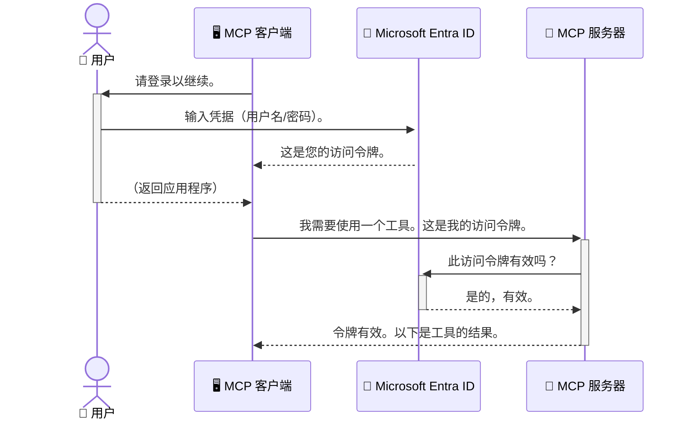

# 保障 AI 工作流安全：Model Context Protocol 服务器的 Entra ID 认证

> [!NOTE]
> 本课中的远程服务器代码保护了传统的 `/sse` 和 `/message` 端点，并针对 MCP `2025-11-25` 版本。请保持其身份和令牌验证实践，但对于新实现应使用兼容 `2026-07-28` 的 Streamable HTTP 传输。


## 介绍
保护您的 Model Context Protocol (MCP) 服务器就像锁好家门一样重要。若让MCP服务器暴露无防护，就会使您的工具和数据面临未授权访问的风险，进而导致安全漏洞。Microsoft Entra ID 提供强大的基于云的身份和访问管理解决方案，帮助确保只有授权的用户和应用程序能够与您的 MCP 服务器交互。本节将教您如何使用 Entra ID 认证保护您的 AI 工作流。

## 学习目标
完成本节后，您将能够：

- 了解保护 MCP 服务器的重要性。
- 解释 Microsoft Entra ID 和 OAuth 2.0 认证的基本知识。
- 认识公共客户端和机密客户端之间的区别。
- 在本地（公共客户端）和远程（机密客户端）MCP 服务器场景中实现 Entra ID 认证。
- 开发 AI 工作流时应用安全最佳实践。

## 安全性与 MCP

就像您不会让家门随意敞开一样，您也不应让 MCP 服务器对任何人开放访问。保障您的 AI 工作流安全对于构建稳健、可信赖且安全的应用至关重要。本章将介绍如何使用 Microsoft Entra ID 保护 MCP 服务器，确保只有授权用户和应用能够操作您的工具和数据。

## MCP 服务器为何需要安全保障

想象您的 MCP 服务器拥有发送电子邮件或访问客户数据库的功能。若服务器未加保护，任何人都有可能使用这些工具，导致未经授权访问数据、垃圾邮件或其他恶意活动。

通过实现认证，您可以确保每个发送到服务器的请求都经过验证，确认请求发起的用户或应用身份。这是保障 AI 工作流安全的第一步，也是最关键的一步。

## Microsoft Entra ID 介绍

[**Microsoft Entra ID**](https://adoption.microsoft.com/microsoft-security/entra/) 是一项基于云的身份和访问管理服务。可以将它视为应用程序的通用安全守卫。它处理复杂的用户身份验证（authentication）和权限授权（authorization）过程。

通过使用 Entra ID，您可以：

- 启用用户的安全登录。
- 保护 API 和服务。
- 从中央位置管理访问策略。

对于 MCP 服务器，Entra ID 提供稳健且广泛信赖的解决方案来管理谁可以访问服务器功能。

---

## 了解核心原理：Entra ID 认证如何工作

Entra ID 使用诸如 **OAuth 2.0** 等开放标准来处理认证。虽然细节较复杂，但核心概念简单，可以用比喻来理解。

### OAuth 2.0 简介：代客钥匙

将 OAuth 2.0 想象成代客泊车服务。当您到餐厅时，不会把您的主钥匙交给代客，而是给出一把<strong>代客钥匙</strong>，该钥匙权限有限——它能启动车辆并锁门，却不能打开后备箱或手套箱。

在这个比喻中：

- <strong>您</strong> 是 <strong>用户</strong>。
- <strong>您的车</strong> 是拥有宝贵工具和数据的 **MCP 服务器**。
- <strong>代客</strong> 是 **Microsoft Entra ID**。
- <strong>停车员</strong> 是尝试访问服务器的 **MCP 客户端**（应用程序）。
- <strong>代客钥匙</strong> 是 <strong>访问令牌</strong>。

访问令牌是一串安全的文本，MCP 客户端在您登录后从 Entra ID 获取。随后，客户端在每次请求中都会向 MCP 服务器出示该令牌。服务器通过验证令牌，确保请求合法且客户端具备必要权限，而无需接触您的实际凭据（比如密码）。

### 认证流程

该过程的实际运作如下：



### 认识 Microsoft 认证库 (MSAL)

在介绍代码之前，有一个关键组件需要了解：**Microsoft 认证库 (MSAL)**。

MSAL 是微软开发的库，让开发者更容易处理认证。它帮助你免去编写处理安全令牌、管理登录和刷新会话复杂代码的烦恼。

使用 MSAL 库的好处：

- **安全性强：** 遵循行业标准协议及安全最佳实践，降低代码漏洞风险。
- **简化开发：** 抽象了 OAuth 2.0 和 OpenID Connect 协议复杂性，让您只需几行代码即可添加强大的认证功能。
- **持续维护：** 微软积极维护家更新 MSAL，应对新安全威胁和平台变更。

MSAL 支持多种语言和应用框架，包括 .NET、JavaScript/TypeScript、Python、Java、Go，以及 iOS 和 Android 等移动平台。意味着您可以在整个技术栈中使用一致的认证模式。

想了解更多 MSAL 详情，可访问官方 [MSAL 总览文档](https://learn.microsoft.com/entra/identity-platform/msal-overview)。

---

## 使用 Entra ID 保护您的 MCP 服务器：分步骤指南

现在，让我们演示如何使用 Entra ID 保护本地 MCP 服务器（通过 `stdio` 通信）。此示例采用<strong>公共客户端</strong>，适合运行在用户设备上的应用，比如桌面应用或本地开发服务器。

### 场景 1：保护本地 MCP 服务器（公共客户端）

本场景展示一个本地运行、通过 `stdio` 交互的 MCP 服务器，它使用 Entra ID 来认证用户后才允许访问其工具。服务器仅提供一个获取用户 Microsoft Graph API 个人信息的工具。

#### 1. 在 Entra ID 中设置应用程序

编写代码前，需在 Microsoft Entra ID 中注册您的应用程序。这表明应用身份并赋予认证权限。

1. 访问 **[Microsoft Entra 门户](https://entra.microsoft.com/)**。
2. 前往 <strong>应用注册</strong>，点击 <strong>新注册</strong>。
3. 为应用命名（如 “My Local MCP Server”）。
4. 在 <strong>支持的账户类型</strong> 选择 <strong>仅限此组织目录中的账户</strong>。
5. 本示例中可将 **重定向 URI** 留空。
6. 点击 <strong>注册</strong>。

注册完成后，记录下 **应用（客户端）ID** 和 **目录（租户）ID**，代码中需要用到。

#### 2. 代码解析

让我们看下核心认证处理代码。完整示例代码见 [mcp-auth-servers GitHub 仓库](https://github.com/Azure-Samples/mcp-auth-servers) 的 [Entra ID - Local - WAM](https://github.com/Azure-Samples/mcp-auth-servers/tree/main/src/entra-id-local-wam) 文件夹。

**`AuthenticationService.cs`**

该类负责与 Entra ID 的交互。

- **`CreateAsync`**：初始化 MSAL 的 `PublicClientApplication`，配置有您的应用的 `clientId` 和 `tenantId`。
- **`WithBroker`**：启用使用中介（如 Windows Web 账户管理器），提供更安全和流畅的单点登录体验。
- **`AcquireTokenAsync`**：核心方法。它先尝试静默获取令牌（用户已有有效会话时无需重新登录），若失败则提示用户交互式登录。

```csharp
// Simplified for clarity
public static async Task<AuthenticationService> CreateAsync(ILogger<AuthenticationService> logger)
{
    var msalClient = PublicClientApplicationBuilder
        .Create(_clientId) // Your Application (client) ID
        .WithAuthority(AadAuthorityAudience.AzureAdMyOrg)
        .WithTenantId(_tenantId) // Your Directory (tenant) ID
        .WithBroker(new BrokerOptions(BrokerOptions.OperatingSystems.Windows))
        .Build();

    // ... cache registration ...

    return new AuthenticationService(logger, msalClient);
}

public async Task<string> AcquireTokenAsync()
{
    try
    {
        // Try silent authentication first
        var accounts = await _msalClient.GetAccountsAsync();
        var account = accounts.FirstOrDefault();

        AuthenticationResult? result = null;

        if (account != null)
        {
            result = await _msalClient.AcquireTokenSilent(_scopes, account).ExecuteAsync();
        }
        else
        {
            // If no account, or silent fails, go interactive
            result = await _msalClient.AcquireTokenInteractive(_scopes).ExecuteAsync();
        }

        return result.AccessToken;
    }
    catch (Exception ex)
    {
        _logger.LogError(ex, "An error occurred while acquiring the token.");
        throw; // Optionally rethrow the exception for higher-level handling
    }
}
```

**`Program.cs`**

这里搭建了 MCP 服务器并集成了认证服务。

- **`AddSingleton<AuthenticationService>`**：将 `AuthenticationService` 注册到依赖注入容器，供应用其它部分使用（如工具）。
- **`GetUserDetailsFromGraph` 工具**：此工具需要 `AuthenticationService` 实例。执行前调用 `authService.AcquireTokenAsync()` 获取有效访问令牌。认证成功后，使用令牌调用 Microsoft Graph API 获取用户信息。

```csharp
// Simplified for clarity
[McpServerTool(Name = "GetUserDetailsFromGraph")]
public static async Task<string> GetUserDetailsFromGraph(
    AuthenticationService authService)
{
    try
    {
        // This will trigger the authentication flow
        var accessToken = await authService.AcquireTokenAsync();

        // Use the token to create a GraphServiceClient
        var graphClient = new GraphServiceClient(
            new BaseBearerTokenAuthenticationProvider(new TokenProvider(authService)));

        var user = await graphClient.Me.GetAsync();

        return System.Text.Json.JsonSerializer.Serialize(user);
    }
    catch (Exception ex)
    {
        return $"Error: {ex.Message}";
    }
}
```

#### 3. 整体工作流程

1. MCP 客户端尝试使用 `GetUserDetailsFromGraph` 工具时，该工具先调用 `AcquireTokenAsync`。
2. `AcquireTokenAsync` 触发 MSAL 检查有效令牌。
3. 若无有效令牌，MSAL 通过中介提示用户用 Entra ID 账号登录。
4. 用户登录成功后，Entra ID 授权访问令牌。
5. 工具接收令牌并用其安全调用 Microsoft Graph API。
6. 用户信息返回给 MCP 客户端。

此流程确保仅认证用户可以使用该工具，有效保障了您的本地 MCP 服务器安全。

### 场景 2：保护远程 MCP 服务器（机密客户端）

当 MCP 服务器运行在远程机器（如云服务器）并通过 HTTP Streaming 协议通信时，安全要求有所不同。这种情况应使用<strong>机密客户端</strong>和<strong>授权码流程（Authorization Code Flow）</strong>。此方式更安全，因为应用密钥不会暴露给浏览器。

本示例使用基于 TypeScript 的 MCP 服务器并借助 Express.js 处理 HTTP 请求。

#### 1. 在 Entra ID 中设置应用程序

与公共客户端类似，但需要创建<strong>客户端密码（client secret）</strong>。

1. 访问 **[Microsoft Entra 门户](https://entra.microsoft.com/)**。
2. 在您的应用注册中切换到 **证书 & 密钥** 选项卡。
3. 点击 <strong>新建客户端密码</strong>，填入描述后添加。
4. **重要：** 立即复制密码值，之后无法再次查看。
5. 还需配置<strong>重定向 URI</strong>。转至 <strong>认证</strong> 选项卡，点击 <strong>添加平台</strong>，选择 **Web**，输入应用重定向 URI（如 `http://localhost:3001/auth/callback`）。

> **⚠️ 重要安全提示：** 对于生产环境应用，微软强烈建议使用<strong>无密钥认证</strong>方案，如<strong>托管身份（Managed Identity）</strong>或<strong>工作负载身份联合（Workload Identity Federation）</strong>，而非客户端密码。客户端密码存在暴露或泄露风险，托管身份通过消除代码或配置中的凭据存储提供更安全方案。
>
> 更多有关托管身份及实现方法的信息，请参见[Azure 资源的托管身份概述](https://learn.microsoft.com/entra/identity/managed-identities-azure-resources/overview)。

#### 2. 代码解析

本示例采用基于 session 的方法。用户认证后，服务器将访问令牌和刷新令牌存入会话，并向用户发放会话令牌，随后请求均使用该会话令牌。完整示例存放于 [mcp-auth-servers GitHub 仓库](https://github.com/Azure-Samples/mcp-auth-servers) 的 [Entra ID - Confidential client](https://github.com/Azure-Samples/mcp-auth-servers/tree/main/src/entra-id-cca-session) 文件夹。

**`Server.ts`**

该文件搭建 Express 服务器及 MCP 传输层。

- **`requireBearerAuth`**：中间件，用于保护 `/sse` 和 `/message` 端点。检查请求头 `Authorization` 中的有效 Bearer 令牌。
- **`EntraIdServerAuthProvider`**：自定义类，实现了 `McpServerAuthorizationProvider` 接口，负责处理 OAuth 2.0 流程。
- **`/auth/callback`**：处理用户通过 Entra ID 认证后的重定向。负责用授权码交换访问令牌和刷新令牌。

```typescript
// 为了简化理解
const app = express();
const { server } = createServer();
const provider = new EntraIdServerAuthProvider();

// 保护 SSE 端点
app.get("/sse", requireBearerAuth({
  provider,
  requiredScopes: ["User.Read"]
}), async (req, res) => {
  // ... 连接到传输层 ...
});

// 保护消息端点
app.post("/message", requireBearerAuth({
  provider,
  requiredScopes: ["User.Read"]
}), async (req, res) => {
  // ... 处理消息 ...
});

// 处理 OAuth 2.0 回调
app.get("/auth/callback", (req, res) => {
  provider.handleCallback(req.query.code, req.query.state)
    .then(result => {
      // ... 处理成功或失败 ...
    });
});
```

**`Tools.ts`**

定义 MCP 服务器提供的工具。`getUserDetails` 工具类似于前例，但从会话中获取访问令牌。

```typescript
// 为了清晰简化
server.setRequestHandler(CallToolRequestSchema, async (request) => {
  const { name } = request.params;
  const context = request.params?.context as { token?: string } | undefined;
  const sessionToken = context?.token;

  if (name === ToolName.GET_USER_DETAILS) {
    if (!sessionToken) {
      throw new AuthenticationError("Authentication token is missing or invalid. Ensure the token is provided in the request context.");
    }

    // 从会话存储中获取 Entra ID 令牌
    const tokenData = tokenStore.getToken(sessionToken);
    const entraIdToken = tokenData.accessToken;

    const graphClient = Client.init({
      authProvider: (done) => {
        done(null, entraIdToken);
      }
    });

    const user = await graphClient.api('/me').get();

    // ... 返回用户详细信息 ...
  }
});
```

**`auth/EntraIdServerAuthProvider.ts`**

该类处理以下逻辑：

- 重定向用户至 Entra ID 登录页面。
- 用授权码交换访问令牌。
- 将令牌存储于 `tokenStore`。
- 访问令牌过期后刷新。


#### 3. 全部如何协同工作

1. 当用户首次尝试连接到 MCP 服务器时，`requireBearerAuth` 中间件会发现他们没有有效的会话，并将其重定向到 Entra ID 登录页面。
2. 用户使用他们的 Entra ID 账户登录。
3. Entra ID 将用户重定向回带有授权代码的 `/auth/callback` 端点。
4. 服务器用该代码交换访问令牌和刷新令牌，存储它们，并创建一个会话令牌发送给客户端。
5. 客户端现在可以在对 MCP 服务器的所有后续请求中使用此会话令牌作为 `Authorization` 头。
6. 当调用 `getUserDetails` 工具时，它使用会话令牌查找 Entra ID 访问令牌，然后利用该访问令牌调用 Microsoft Graph API。

此流程比公共客户端流程更复杂，但对于面向互联网的端点是必需的。由于远程 MCP 服务器可通过公共互联网访问，因此它们需要更强的安全措施以防止未授权访问和潜在攻击。


## 安全最佳实践

- **始终使用 HTTPS**：加密客户端和服务器之间的通信，以防止令牌被拦截。
- **实施基于角色的访问控制（RBAC）**：不只是检查用户是否经过身份验证，还要检查他们被授权执行什么操作。您可以在 Entra ID 中定义角色，并在 MCP 服务器中进行检查。
- <strong>监控和审计</strong>：记录所有身份验证事件，以便检测并响应可疑活动。
- <strong>处理速率限制和节流</strong>：Microsoft Graph 和其他 API 实施速率限制以防止滥用。在您的 MCP 服务器中实现指数后退和重试逻辑，以优雅处理 HTTP 429（请求过多）响应。考虑缓存常访问的数据以减少 API 调用。
- <strong>安全存储令牌</strong>：安全地存储访问令牌和刷新令牌。对于本地应用程序，使用系统的安全存储机制。对于服务器应用程序，考虑使用加密存储或安全密钥管理服务如 Azure Key Vault。
- <strong>令牌过期处理</strong>：访问令牌有有限的有效期。使用刷新令牌实现自动令牌刷新，以维持无缝的用户体验，无需重新认证。
- **考虑使用 Azure API 管理**：虽然直接在 MCP 服务器中实现安全性可以提供细粒度控制，但像 Azure API 管理这样的 API 网关可以自动处理许多安全问题，包括身份验证、授权、速率限制和监控。它们提供了位于客户端和 MCP 服务器之间的集中安全层。有关在 MCP 中使用 API 网关的详细信息，请参阅我们的[Azure API Management Your Auth Gateway For MCP Servers](https://techcommunity.microsoft.com/blog/integrationsonazureblog/azure-api-management-your-auth-gateway-for-mcp-servers/4402690)。


## 关键要点

- 保护您的 MCP 服务器对于保护您的数据和工具至关重要。
- Microsoft Entra ID 提供强大且可扩展的身份验证和授权解决方案。
- 本地应用使用<strong>公共客户端</strong>，远程服务器使用<strong>机密客户端</strong>。
- <strong>授权代码流程</strong>是 Web 应用中最安全的选项。


## 练习

1. 思考您可能构建的 MCP 服务器。它会是本地服务器还是远程服务器？
2. 根据您的答案，您会使用公共客户端还是机密客户端？
3. 您的 MCP 服务器会请求哪些权限来调用 Microsoft Graph 执行操作？


## 实操练习

### 练习 1：在 Entra ID 注册应用程序
访问 Microsoft Entra 门户。
为您的 MCP 服务器注册一个新应用。
记录应用程序（客户端）ID 和目录（租户）ID。

### 练习 2：保护本地 MCP 服务器（公共客户端）
- 按照示例代码集成 MSAL（Microsoft Authentication Library）实现用户身份验证。
- 通过调用从 Microsoft Graph 获取用户详细信息的 MCP 工具测试身份验证流程。

### 练习 3：保护远程 MCP 服务器（机密客户端）
- 在 Entra ID 中注册机密客户端并创建客户端密钥。
- 配置您的 Express.js MCP 服务器使用授权代码流程。
- 测试受保护的端点，确认基于令牌的访问。

### 练习 4：应用安全最佳实践
- 为您的本地或远程服务器启用 HTTPS。
- 在服务器逻辑中实施基于角色的访问控制（RBAC）。
- 添加令牌过期处理和安全的令牌存储。

## 资源

1. **MSAL 概述文档**  
   了解 Microsoft Authentication Library (MSAL) 如何在跨平台环境中实现安全的令牌获取：  
   [Microsoft Learn 上的 MSAL 概述](https://learn.microsoft.com/en-gb/entra/msal/overview)

2. **Azure-Samples/mcp-auth-servers GitHub 仓库**  
   MCP 服务器身份验证流程的参考实现：  
   [GitHub 上的 Azure-Samples/mcp-auth-servers](https://github.com/Azure-Samples/mcp-auth-servers)

3. **Azure 资源托管身份概述**  
   了解如何通过使用系统分配或用户分配的托管身份来消除密钥管理：  
   [Microsoft Learn 上的托管身份概述](https://learn.microsoft.com/en-us/entra/identity/managed-identities-azure-resources/)

4. **Azure API 管理：您的 MCP 服务器身份验证网关**  
   深入解析如何使用 APIM 作为 MCP 服务器的安全 OAuth2 网关：  
   [Azure API Management Your Auth Gateway For MCP Servers](https://techcommunity.microsoft.com/blog/integrationsonazureblog/azure-api-management-your-auth-gateway-for-mcp-servers/4402690)

5. **Microsoft Graph 权限参考**  
   Microsoft Graph 授权的委托权限和应用权限的完整列表：  
   [Microsoft Graph 权限参考](https://learn.microsoft.com/zh-tw/graph/permissions-reference)


## 学习成果
完成本节内容后，您将能够：

- 阐述为什么身份验证对 MCP 服务器和 AI 工作流程至关重要。
- 为本地和远程 MCP 服务器场景设置和配置 Entra ID 身份验证。
- 根据服务器部署选择合适的客户端类型（公共或机密）。
- 实施安全编码实践，包括令牌存储和基于角色的授权。
- 有信心地保护您的 MCP 服务器及其工具免受未授权访问。

## 接下来

- [5.13 与 Microsoft Foundry 的模型上下文协议 (MCP) 集成](../mcp-foundry-agent-integration/README.md)

---

<!-- CO-OP TRANSLATOR DISCLAIMER START -->
**免责声明**：
本文件由 AI 翻译服务 [Co-op Translator](https://github.com/Azure/co-op-translator) 翻译完成。尽管我们力求准确，但请注意，自动翻译可能包含错误或不准确之处。原始语言版文件应视为权威来源。对于重要信息，建议使用专业人工翻译。我们对因使用本翻译而产生的任何误解或误释不承担责任。
<!-- CO-OP TRANSLATOR DISCLAIMER END -->