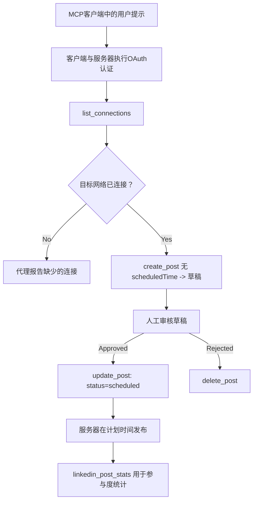

# 案例研究：通过带远程 MCP 服务器的代理发布到社交网络

> **免责声明：** 有许多服务和开源项目可以发布到社交网络，团队也可以直接集成每个网络的 API。以下场景作为一个示范示例，展示了如何设计和使用一个<strong>具有写权限的远程 MCP 服务器</strong>。Publora 是一个提供免费套餐的商业服务；这里描述的模式适用于任何代表用户执行不可逆操作的 MCP 服务器。

## 概述

代理擅长起草内容，但不善于发布。模型可以在几秒钟内写出发布公告，然后工作停滞：发布需要针对每个网络使用不同的 API、OAuth 应用以及各异的媒体规则。大多数团队通过手动将文本复制到浏览器来解决这个问题。

本案例研究探讨了如何使用单个远程 MCP 服务器完成最后一步，更有用的是，为任何构建此类服务器的人提供了<strong>具备写权限</strong>服务器必须做出正确设计决策的指导。读取数据相对宽容，而发布则不然：错误的工具调用会被观众看到，且不可撤销。

## 场景

一个小型开发者关系团队在代理中起草帖子（Claude、VS Code、Cursor —— 客户端无关紧要）。他们希望代理能够：

- 查看团队连接了哪些社交账户，
- 起草帖子并保留为草稿以供人工审核，
- 附加图片，
- 计划在选定时间发布到多个网络，
- 之后报告表现情况。

关键是，他们希望代理在仍然实验阶段时<strong>无法</strong>意外发布内容。

## 使用工具

- [Publora MCP 服务器](https://github.com/publora/mcp-server) —— 一个远程 MCP 服务器（`streamable-http`），提供发布、调度、媒体和 LinkedIn 分析工具。在官方 MCP 注册表中注册为 `com.publora/mcp-server`。

## 逐步工作流程

1. **连接服务器。** 支持 OAuth 的客户端完成对服务器自身同意页面的授权码流程并使用 PKCE；不支持的客户端例如无头 CLI，使用 Publora API 密钥作为请求头。两种方式均支持，使用哪种取决于客户端，而非服务器。
2. **列出连接。** 代理调用 `list_connections`，获取已连接账号及其标识符。
3. **起草。** 代理调用 `create_post` <em>不带</em>计划发布时间，帖子被存为草稿——不会发布。
4. **附加媒体。** 公共图片 URL 在同一次调用中传入，服务器下载并验证。
5. **调度。** 经人工批准后，调用 `update_post`，将状态设置为已调度，并附上 ISO 8601 时间。
6. **测量。** 对于 LinkedIn，帖子上线后调用 `linkedin_post_stats` 获取互动数据。

## 示例提示

```text
Which social accounts do I have connected?
Draft a post announcing our new changelog page, attach the screenshot at
https://example.com/changelog.png, and keep it as a draft — do not publish it.
Once I approve, schedule it to LinkedIn and Bluesky for tomorrow at 09:00 UTC.
```

## Mermaid 流程图



## 技术实现

以下经验是此案例研究中可迁移的部分。

### 公开发现，认证执行

`tools/list` 无需凭证即可访问；每个 `tools/call` 都需要令牌，否则返回带有指向受保护资源元数据的 `WWW-Authenticate` 头的 `401`。服务器也响应未经认证的 `initialize`，但仅对协议版本早于 `2026-07-28` 的客户端相关；该版本修订完全移除了握手。

这种划分在实践中很重要。注册表、目录和客户端可以无密钥地检查工具表面 —— 名称、模式、注解 — 但无法匿名<em>执行</em>任何操作。一个要求初始化也需令牌的服务器对工具来说实际上是隐形的；允许匿名 `tools/call` 的服务器则极具风险。

### 注册：动态客户端注册及其替代方案

服务器发布 `/.well-known/oauth-protected-resource` 和 `/.well-known/oauth-authorization-server`，支持带 PKCE（`S256`）的授权码流程、刷新令牌及<strong>动态客户端注册</strong>。

动态注册消除了手动步骤：没有它，每个客户端都需要一个预先发放的 `client_id`，这意味着每新增客户端都要向供应商发送带外请求。

将其视为兼容性行为，而非设计示范。`2026-07-28` 版规范弃用动态客户端注册，改用客户端 ID 元数据文档，客户端在稳定的 HTTPS URL 托管元数据文档，该 URL 就是 `client_id`。动态客户端注册目前仍可用，但新服务器应计划支持 CIMD，仅为旧客户端保留动态注册。

### 工具注解非装饰

每个工具都带有 `title` 及适用提示：`readOnlyHint`、`destructiveHint`、`idempotentHint`、`openWorldHint`。

两个理由值得重视它们。首先，客户端利用提示决定向用户确认什么 —— 一个客户端可以自动运行只读查询，并在删除前停止等待批准。规范明确，注解是非信任提示，不是授权机制：它们塑造客户端可执行的操作，但不阻止服务器操作，服务器必须仍强制自身规则。其次，主要连接器目录<strong>要求</strong>它们用于审查；无标题和提示的服务器无论多好用都会被拒。

### 让标识符不可被发明

平台标识符是不透明字符串，由 `list_connections` 返回，模式说明明确要求字面复制，绝不可猜测。服务器拒绝其他情况。

模型喜欢猜测。任何具写能力服务器应假设标识符终将被幻觉产生，且应使这种路径尽早高声失败，而非使用看似合理的值执行操作。

### 发布前失败，带可操作消息

一些网络拒绝纯文本帖，要求必须有图像或视频。调度时进行验证，错误中指出平台和缺失需求。

代理能从“Instagram 需要媒体 —— 请附加图片或视频”中恢复，无需再次往返，但无法从泛用 `400` 恢复。

### 保证重试安全

两个创建内容的工具，`create_post` 和 `update_post`，接受幂等键：重复使用相同键和请求返回原始响应，避免生成重复帖子。代理运行时在超时重试；无幂等键，慢响应会产生重复发布。其他写入工具 - 删除、媒体步骤、LinkedIn 点赞和评论 - 不接受此键，重试不自动安全。了解你的变更哪些受保护哪些不受保护很重要。

### 提供一个不发布的测试方式

服务器接受保留目标 `publora-playground`，该目标经过验证并确认如同真实目标，随后丢弃 —— 无内容到达真实账户。其定义在工具模式中，任何客户端无需凭证即可读取：`create_post` 的 `platforms` 字段将其描述为“连接测试目标，不需真实连接——帖子确认后丢弃，无任何发布行为”。调用时传入唯一条目：`platforms: ["publora-playground"]`。

这成为整套工具中最有用的细节之一。连接器目录审查者、贡献者和 CI 能在不影响真实观众情况下端到端测试整个写路径。任何具不可逆操作的 MCP 服务器均受益于有记录的无操作目标。

## 结果与影响

- 发布步骤由浏览器转移到内容编写同一对话中，草稿优先习惯确保人工介入。明确区分：草稿是约定，不是边界。相同凭据可调度或发布，因此需要真正审批关卡的应在工具表面之外强制执行 —— 例如分开凭据，或服务器前端的策略层。
- 各网络差异 —— 媒体要求、线程、回复控制 —— 在服务器中处理一次，而非每个调用代理重复处理。
- 同一服务器支持多个 MCP 客户端，无需为每客户端单独开发，因为发现是开放的，注册是动态的。
- 以上设计约束受到连接器目录审查以及用户反馈共同塑造：注解、OAuth 与安全测试目标均是至少一个目录要求的。

## 参考资料

- [Publora MCP 服务器（源码）](https://github.com/publora/mcp-server)
- [Publora API 及 MCP 文档](https://docs.publora.com)
- [MCP 注册表条目：`com.publora/mcp-server`](https://registry.modelcontextprotocol.io/v0/servers?search=com.publora/mcp-server)
- [MCP 规范 — 授权](https://modelcontextprotocol.io/specification/draft/basic/authorization)
- [MCP 规范 — 工具注解](https://modelcontextprotocol.io/docs/concepts/tools)

## 后续步骤

- 查看你构建的 MCP 服务器，在这里完成三项最廉价的改进：每个工具支持注解，每个写操作支持幂等键，文档化无操作目标。
- 试验公开发现分离：对公共远程服务器无凭证调用 `tools/list`，再调用工具并检查 `401` 挑战。
- 考虑“撤销”在你的领域意味着什么。发布有草稿和删除；如果你的操作无对应功能，确认应当在工具设计中而非提示中。

---

<!-- CO-OP TRANSLATOR DISCLAIMER START -->
**免责声明**：
本文件由 AI 翻译服务 [Co-op Translator](https://github.com/Azure/co-op-translator) 翻译完成。尽管我们力求准确，但请注意，自动翻译可能包含错误或不准确之处。原始语言版文件应视为权威来源。对于重要信息，建议使用专业人工翻译。我们对因使用本翻译而产生的任何误解或误释不承担责任。
<!-- CO-OP TRANSLATOR DISCLAIMER END -->