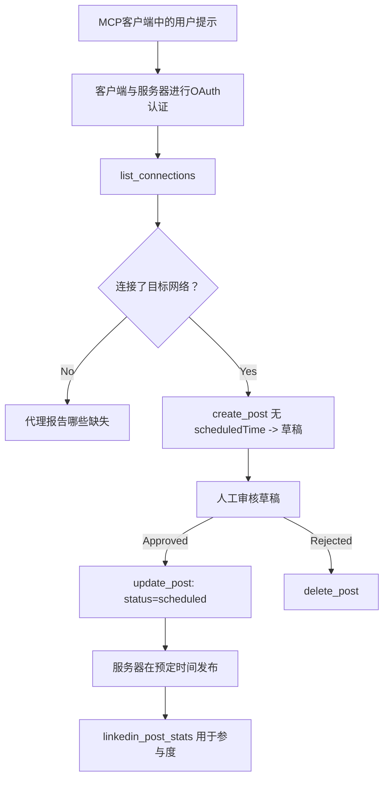

# 案例研究：从具有远程 MCP 服务器的代理发布到社交网络

> **免责声明：** 有多种服务和开源项目可以发布到社交网络，团队也可以直接集成各个网络的 API。下面的场景作为如何设计和使用<strong>具备写能力的远程 MCP 服务器</strong>的一个实际示例提供。Publora 是一个具有免费层的商业服务；此处描述的模式适用于任何代表用户执行不可逆操作的 MCP 服务器。

## 概述

代理擅长起草内容，但不善于发布。模型可以在几秒钟内写出发布公告，然后工作停止：发布意味着针对每个网络的 API，每个网络的 OAuth 应用，以及不同的媒体规则。大多数团队通过手动将文本复制到浏览器来解决这个问题。

本案例研究探讨如何通过单个远程 MCP 服务器完成最后一步，更重要的是，为任何构建此类服务器的人提供必须正确处理的设计决策。读取数据相对宽容，而发布则不然：错误的工具调用会被观众看到，且无法撤销。

## 场景

一个小型开发者关系团队在代理中起草帖子（Claude、VS Code、Cursor —— 客户端并不重要）。他们希望代理能够：

- 查看团队连接了哪些社交账户，
- 起草帖子并将其保留为草稿等待人工批准，
- 附加图片，
- 在选定时间安排多个网络发布，
- 之后报告表现。

关键是，他们希望代理在仍处于试验阶段时<em>无法</em>意外发布。

## 使用工具

- [Publora MCP 服务器](https://github.com/publora/mcp-server) —— 一个远程 MCP 服务器（`streamable-http`），提供发布、调度、媒体及 LinkedIn 分析工具。在官方 MCP 注册表中注册名为 `com.publora/mcp-server`。

## 逐步工作流程

1. **连接服务器。** 支持 OAuth 的客户端完成带 PKCE 的授权码流程，通过服务器自己的同意界面；不支持的客户端，如无头 CLI，使用 Publora API 密钥放在请求头中。两种方式均被支持，取决于客户端而非服务器。
2. **列出连接。** 代理调用 `list_connections`，接收带标识符的连接账户。
3. **起草。** 代理调用 `create_post` <em>不带</em>计划时间。帖子设为草稿，未发布。
4. **附加媒体。** 公开图片 URL 与之前同一调用传入；服务器下载并验证。
5. **调度。** 人工批准后，`update_post` 设置状态为已调度并给出 ISO 8601 时间。
6. **测量。** 对 LinkedIn，帖子上线后调用 `linkedin_post_stats` 返回互动数据。

## 示例提示

```text
Which social accounts do I have connected?
Draft a post announcing our new changelog page, attach the screenshot at
https://example.com/changelog.png, and keep it as a draft — do not publish it.
Once I approve, schedule it to LinkedIn and Bluesky for tomorrow at 09:00 UTC.
```

## Mermaid 流程图



## 技术实现

以下经验是本案例研究中具有可迁移性的部分。

### 公开发现，认证执行

`tools/list` 无需凭证即可访问；所有 `tools/call` 请求必须带令牌，
否则返回 `401` 以及指向受保护资源元数据的 `WWW-Authenticate` 头。服务器的旧端点亦响应
对协议版本早于 `2026-07-28` 的客户端的未认证 `initialize`；
当前客户端不使用该握手。


同时阻止匿名执行。公开发现是部署选择，不是 MCP 的硬性要求；
受保护部署也可能要求 `tools/list` 授权。

### 注册：动态客户端注册及其替代方案

服务器广播 `/.well-known/oauth-protected-resource` 和 `/.well-known/oauth-authorization-server`，


每个客户端都需从供应商处预先获取 `client_id`。


采用客户端 ID 元数据文档（CIMD），客户端在稳定 HTTPS URL 上托管元数据文档，且该 URL 即为 `client_id`。


服务器接受一个保留目标 `publora-playground`，它像真实目标一样被验证和确认，然后被丢弃——没有任何东西会到达真实账户。它在工具模式本身中被描述，任何客户端无需凭证即可读取：`create_post` 的 `platforms` 字段将其描述为“一个不需要真实连接的连接测试目标——帖子被确认并丢弃，什么都不会发布”。通过将其作为唯一条目传递来调用它：`platforms: ["publora-playground"]`。

这被证明是整个界面中最有用的细节之一。连接目录的审查者、贡献者和 CI 可以在不影响真实受众的情况下全程执行完整的写入路径。任何具有不可逆操作的 MCP 服务器都会从一个有文档说明的无操作目标中受益。

## 结果和影响

- 发布步骤从浏览器移至内容撰写的同一对话框，草稿优先的习惯让人工始终参与其中。明确这点：草稿是一种约定，不是边界。相同的凭证可以用于安排发布或直接发布，因此任何需要真实审批门控的，都必须在工具界面之外强制执行——使用独立凭证，或在服务器前设置策略层。
- 每个网络的差异——媒体要求、线程、回复控制——服务器只需处理一次，而不必在每个与之通信的代理中重复处理。
- 同一服务器支持多个 MCP 客户端，无需预先发放凭证。
    当前客户端可以使用客户端 ID 元数据文档；DCR 仍作为旧客户端的备用方案
   。
- 上述设计约束既受连接目录审查影响，也受用户需求影响：注解、OAuth 和安全的测试目标均为至少其中一方所必需。

## 参考资料

- [Publora MCP 服务器（源码）](https://github.com/publora/mcp-server)
- [Publora API 和 MCP 文档](https://docs.publora.com)
- [MCP 注册表条目：`com.publora/mcp-server`](https://registry.modelcontextprotocol.io/v0/servers?search=com.publora/mcp-server)
- [MCP 规范 —— 授权](https://modelcontextprotocol.io/specification/2026-07-28/basic/authorization)
- [MCP 规范 —— 工具注解](https://modelcontextprotocol.io/docs/concepts/tools)

## 后续步骤

- 以你正在构建的 MCP 服务器为例，检查这里的三项最简易提升：对每个工具的注释，每次写入的幂等键，以及有文档的无操作目标。
- 尝试开放发现分离：在公共远程服务器上无凭证调用 `tools/list`，然后调用某个工具并检查 `401` 授权挑战。
- 考虑在你的领域中“撤销”意味着什么。发布有草稿和删除；如果你的操作没有等价项，确认应属于工具设计，而非提示中。

---

<!-- CO-OP TRANSLATOR DISCLAIMER START -->
**免责声明**：
本文件由 AI 翻译服务 [Co-op Translator](https://github.com/Azure/co-op-translator) 翻译完成。尽管我们力求准确，但请注意，自动翻译可能包含错误或不准确之处。原始语言版文件应视为权威来源。对于重要信息，建议使用专业人工翻译。我们对因使用本翻译而产生的任何误解或误释不承担责任。
<!-- CO-OP TRANSLATOR DISCLAIMER END -->