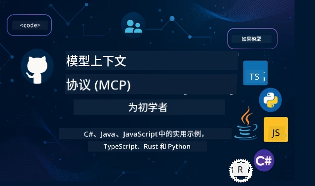

 

[](https://GitHub.com/microsoft/mcp-for-beginners/graphs/contributors)
[](https://GitHub.com/microsoft/mcp-for-beginners/issues)
[](https://GitHub.com/microsoft/mcp-for-beginners/pulls)
[](http://makeapullrequest.com)

[](https://GitHub.com/microsoft/mcp-for-beginners/watchers)
[](https://GitHub.com/microsoft/mcp-for-beginners/fork)
[](https://GitHub.com/microsoft/mcp-for-beginners/stargazers)


[](https://discord.gg/nTYy5BXMWG)

按照以下步骤开始使用这些资源：
1. **Fork 仓库**：点击 [](https://GitHub.com/microsoft/mcp-for-beginners/fork)
2. **克隆仓库**：   `git clone https://github.com/microsoft/mcp-for-beginners.git`
3. **加入** [](https://discord.gg/nTYy5BXMWG)


### 🌐 多语言支持

#### 通过 GitHub Action 支持（自动化且始终保持最新）

<!-- CO-OP TRANSLATOR LANGUAGES TABLE START -->
[Arabic](../ar/README.md) | [Bengali](../bn/README.md) | [Bulgarian](../bg/README.md) | [Burmese (Myanmar)](../my/README.md) | [Chinese (Simplified)](./README.md) | [Chinese (Traditional, Hong Kong)](../zh-HK/README.md) | [Chinese (Traditional, Macau)](../zh-MO/README.md) | [Chinese (Traditional, Taiwan)](../zh-TW/README.md) | [Croatian](../hr/README.md) | [Czech](../cs/README.md) | [Danish](../da/README.md) | [Dutch](../nl/README.md) | [Estonian](../et/README.md) | [Finnish](../fi/README.md) | [French](../fr/README.md) | [German](../de/README.md) | [Greek](../el/README.md) | [Hebrew](../he/README.md) | [Hindi](../hi/README.md) | [Hungarian](../hu/README.md) | [Indonesian](../id/README.md) | [Italian](../it/README.md) | [Japanese](../ja/README.md) | [Kannada](../kn/README.md) | [Korean](../ko/README.md) | [Lithuanian](../lt/README.md) | [Malay](../ms/README.md) | [Malayalam](../ml/README.md) | [Marathi](../mr/README.md) | [Nepali](../ne/README.md) | [Nigerian Pidgin](../pcm/README.md) | [Norwegian](../no/README.md) | [Persian (Farsi)](../fa/README.md) | [Polish](../pl/README.md) | [Portuguese (Brazil)](../pt-BR/README.md) | [Portuguese (Portugal)](../pt-PT/README.md) | [Punjabi (Gurmukhi)](../pa/README.md) | [Romanian](../ro/README.md) | [Russian](../ru/README.md) | [Serbian (Cyrillic)](../sr/README.md) | [Slovak](../sk/README.md) | [Slovenian](../sl/README.md) | [Spanish](../es/README.md) | [Swahili](../sw/README.md) | [Swedish](../sv/README.md) | [Tagalog (Filipino)](../tl/README.md) | [Tamil](../ta/README.md) | [Telugu](../te/README.md) | [Thai](../th/README.md) | [Turkish](../tr/README.md) | [Ukrainian](../uk/README.md) | [Urdu](../ur/README.md) | [Vietnamese](../vi/README.md)

> **更倾向于本地克隆？**
>
> 该仓库包含50多种语言的翻译，大大增加了下载大小。若要克隆不带翻译的版本，请使用稀疏检出：
>
> **Bash / macOS / Linux:**
> ```bash
> git clone --filter=blob:none --sparse https://github.com/microsoft/mcp-for-beginners.git
> cd mcp-for-beginners
> git sparse-checkout set --no-cone '/*' '!translations' '!translated_images'
> ```
>
> **CMD (Windows):**
> ```cmd
> git clone --filter=blob:none --sparse https://github.com/microsoft/mcp-for-beginners.git
> cd mcp-for-beginners
> git sparse-checkout set --no-cone "/*" "!translations" "!translated_images"
> ```
>
> 这样您可以用更快的下载速度获取完成课程所需的所有内容。
<!-- CO-OP TRANSLATOR LANGUAGES TABLE END -->

# 🚀 面向初学者的模型上下文协议 (MCP) 课程

## **通过 C#、Java、JavaScript、Rust、Python 和 TypeScript 的实操代码示例学习 MCP**

## 🧠 模型上下文协议课程概述
欢迎踏上模型上下文协议之旅！如果你曾好奇 AI 应用程序如何与各种工具和服务沟通，现在你将发现这一优雅的解决方案，它正在改变开发者构建智能系统的方式。

把 MCP 想象成 AI 应用的通用翻译器——就像 USB 端口让你可以连接任何设备到电脑一样，MCP 让 AI 模型能以标准化方式连接到任何工具或服务。无论你是构建第一个聊天机器人还是处理复杂的 AI 工作流，了解 MCP 都会赋予你创造更强大、更灵活应用的能力。

本课程设计细致耐心，伴随你的学习之旅。我们将从你熟悉的简单概念开始，通过你喜爱的编程语言进行实操练习，逐步提升你的专业能力。每一步都包括清晰解释、实用示例，以及充足的鼓励。

完成此课程后，你将有信心构建自己的 MCP 服务器，集成流行的 AI 平台，并理解该技术如何重塑 AI 开发的未来。让我们一起开始这段激动人心的冒险吧！

### 官方文档和规格说明

本课程与 **MCP 规格 2025-11-25**（最新稳定版本）保持一致。MCP 规格采用基于日期的版本控制（YYYY-MM-DD 格式），以确保协议版本的清晰追踪。

随着你理解的深入，这些资源将越发有价值，但不必急于一时阅读全部内容。从你最感兴趣的部分开始吧！
- 📘 [MCP 文档](https://modelcontextprotocol.io/) – 这是你的首选资源，包含分步教程和用户指南。文档编写时考虑到了初学者，提供清晰的示例，便于你自主学习。
- 📜 [MCP 规范](https://modelcontextprotocol.io/specification/2025-11-25) – 视作你的全面参考手册。随着课程推进，你会不断回来看具体细节并探索高级功能。
- 📜 [MCP 规格版本控制](https://modelcontextprotocol.io/specification/versioning) – 包含协议版本历史信息及 MCP 如何采用基于日期的版本控制（YYYY-MM-DD 格式）。
- 🧑‍💻 [MCP GitHub 仓库](https://github.com/modelcontextprotocol) – 在这里你可以找到多种编程语言的 SDK、工具和代码示例，就像一个实用示例和可用组件的宝库。
- 🌐 [MCP 社区](https://github.com/orgs/modelcontextprotocol/discussions) – 加入学习者和经验丰富开发者的讨论，共同探讨 MCP。这里是一个支持性社区，欢迎提问，分享知识无私交流。

## 学习目标

完成本课程后，你将充满信心和热情，获得以下能力：

• **理解 MCP 基础**：你会掌握模型上下文协议的含义及其为何正在革新 AI 应用的协作方式，通过形象的比喻和实例让概念浅显易懂。

• **构建你的第一个 MCP 服务器**：你将用偏好的编程语言亲手创建一个能工作的 MCP 服务器，从简单示例开始，逐步提升技能。

• **连接 AI 模型与真实工具**：学习如何架起 AI 模型与实际服务之间的桥梁，赋予应用强大的新能力。

• **实施安全最佳实践**：你将理解如何保障 MCP 实现的安全，保护你的应用和用户。

• **自信进行部署**：了解如何将 MCP 项目从开发带到生产环境，掌握实用的部署策略，应用于真实场景。

• **加入 MCP 社区**：成为不断壮大的开发者社区一员，共同塑造 AI 应用开发的未来。

## 基础知识

在深入 MCP 细节前，让我们先确保你对一些基础概念感到舒适。即使不是专家也没关系——我们会边讲边解释所有必需知识！

### 理解协议（基础）

把协议想象成对话规则。打电话给朋友，你们都知道接听时说“你好”，轮流讲话，结束时说“再见”。计算机程序需要类似规则来有效通信。

MCP 是一种协议——一组达成一致的规则，帮助 AI 模型和应用与工具及服务进行有效“对话”。就像人类交流需要规则一样，MCP 让 AI 应用通信更可靠、更强大。

### 客户端-服务器关系（程序如何协作）

你每天都在使用客户端-服务器关系！用浏览器（客户端）访问网站时，就是连接到提供页面内容的网络服务器。浏览器知道如何请求信息，服务器知道如何响应。

MCP 中也有类似关系：AI 模型作为客户端请求信息或操作，而 MCP 服务器提供这些功能。就像有一个贴心助手（服务器），AI 可以请求它执行指定任务。

### 标准化为何重要（让事物协同工作）

想象如果每个汽车制造商的加油枪形状都不一样——你每辆车都需要不同的适配器！标准化意味着达成共识，使事物无缝协作。

MCP 为 AI 应用提供这份标准化。不是每个 AI 模型都需要针对每个工具写定制代码，MCP 创造了一个通用沟通方式。这样开发者只需构建一次工具，就可以让众多 AI 系统通用。

## 🧭 你的学习路径概览

你的 MCP 旅程精心规划，逐步建立信心和能力。每个阶段引入新概念，同时巩固已有知识。

### 🌱 基础阶段：理解基础（第0-2模块）

冒险从这里启程！我们将用熟悉的比喻和简单示例介绍 MCP 概念。你会明白 MCP 是什么、为何存在，以及它在 AI 开发大环境中的角色。

• **第0模块 - MCP 入门**：探索 MCP 的定义及其对现代 AI 应用的重要意义。你会看到 MCP 的真实应用案例，理解它如何解决开发者常见问题。

• **第1模块 - 核心概念详解**：学习 MCP 的基本构件。大量比喻和形象示例帮助你轻松理解这些关键概念。

• **第2模块 - MCP 安全性**：安全听来可能令人望而生畏，但我们会展示 MCP 内建的安全功能，并教你从一开始就保护应用的最佳实践。

### 🔨 构建阶段：创建你的第一个实现（第3模块）

真正的乐趣开始了！你将亲自动手构建实际 MCP 服务器和客户端。别担心——我们会从简单开始，逐步指导你完成每一步。
该模块包含多个动手指南，让您可以使用首选的编程语言进行练习。您将创建第一个服务器，构建连接该服务器的客户端，甚至还可以集成 VS Code 等流行开发工具。

每个指南都包含完整的代码示例、故障排除技巧以及我们为何做出特定设计选择的解释。完成此阶段后，您将拥有可以自豪使用的 MCP 工作实现！

### 🚀 成长阶段：高级概念与实际应用（模块 4-5）

掌握基础后，您已准备好探索更复杂的 MCP 功能。我们将涵盖实用的实现策略、调试技巧以及多模态 AI 集成等高级主题。

您还将学习如何将 MCP 实现扩展到生产环境，并与 Azure 等云平台集成。这些模块会帮助您构建能够应对现实需求的 MCP 解决方案。

### 🌟 精通阶段：社区与专业化（模块 6-11）

最后阶段聚焦于加入 MCP 社区，专攻您最感兴趣的领域。您将学习如何为开源 MCP 项目贡献代码，实现高级认证模式，以及构建全面的数据库集成解决方案。

模块 11 值得特别提及——这是一个包含 13 个实验的完整动手学习路径，教您构建具备 PostgreSQL 集成的生产级 MCP 服务器。它就像一个汇聚您所有所学的总结项目！

### 📚 完整课程结构

| 模块 | 主题 | 描述 | 链接 |
|--------|-------|-------------|------|
| **模块 0-3：基础知识** | | | |
| 00 | MCP 介绍 | 介绍模型上下文协议及其在 AI 管道中的重要性 | [阅读更多](./00-Introduction/README.md) |
| 01 | 核心概念详解 | 深入探讨 MCP 核心概念 | [阅读更多](./01-CoreConcepts/README.md) |
| 02 | MCP 安全 | 安全威胁与最佳实践 | [阅读更多](./02-Security/README.md) |
| 03 | MCP 入门 | 环境搭建、基本服务器/客户端、集成 | [阅读更多](./03-GettingStarted/README.md) |
| **模块 3：构建您的第一个服务器和客户端** | | | |
| 3.1 | 第一个服务器 | 创建您的第一个 MCP 服务器 | [指南](./03-GettingStarted/01-first-server/README.md) |
| 3.2 | 第一个客户端 | 开发基础 MCP 客户端 | [指南](./03-GettingStarted/02-client/README.md) |
| 3.3 | 带 LLM 的客户端 | 集成大型语言模型 | [指南](./03-GettingStarted/03-llm-client/README.md) |
| 3.4 | VS Code 集成 | 在 VS Code 中使用 MCP 服务器 | [指南](./03-GettingStarted/04-vscode/README.md) |
| 3.5 | stdio 服务器 | 使用 stdio 传输创建服务器 | [指南](./03-GettingStarted/05-stdio-server/README.md) |
| 3.6 | HTTP 流式传输 | 实现 MCP 中的 HTTP 流式传输 | [指南](./03-GettingStarted/06-http-streaming/README.md) |
| 3.7 | AI 工具包 | 在 MCP 中使用 AI 工具包 | [指南](./03-GettingStarted/07-aitk/README.md) |
| 3.8 | 测试 | 测试您的 MCP 服务器实现 | [指南](./03-GettingStarted/08-testing/README.md) |
| 3.9 | 部署 | 将 MCP 服务器部署到生产环境 | [指南](./03-GettingStarted/09-deployment/README.md) |
| 3.10 | 高级服务器用法 | 使用高级服务器功能，提升架构和高级特性使用 | [指南](./03-GettingStarted/10-advanced/README.md) |
| 3.11 | 简单身份验证 | 从基础展示身份验证及 RBAC | [指南](./03-GettingStarted/11-simple-auth/README.md) |
| 3.12 | MCP 主机 | 配置 Claude Desktop、Cursor、Cline 等 MCP 主机 | [指南](./03-GettingStarted/12-mcp-hosts/README.md) |
| 3.13 | MCP Inspector | 使用 Inspector 工具调试和测试 MCP 服务器 | [指南](./03-GettingStarted/13-mcp-inspector/README.md) |
| 3.14 | 采样 | 使用采样与客户端协作 | [指南](./03-GettingStarted/14-sampling/README.md) |
| 3.15 | MCP 应用 | 构建 MCP 应用 | [指南](./03-GettingStarted/15-mcp-apps/README.md) |

| **模块 4-5：实用与高级** | | | |
| 04 | 实用实现 | SDK、调试、测试、可复用提示模板 | [阅读更多](./04-PracticalImplementation/README.md) |
| 4.1 | 分页 | 使用基于游标的分页处理大量结果集 | [指南](./04-PracticalImplementation/pagination/README.md) |
| 05 | MCP 高级主题 | 多模态 AI、扩展、企业应用 | [阅读更多](./05-AdvancedTopics/README.md) |
| 5.1 | Azure 集成 | MCP 与 Azure 的集成 | [指南](./05-AdvancedTopics/mcp-integration/README.md) |
| 5.2 | 多模态 | 多模态处理 | [指南](./05-AdvancedTopics/mcp-multi-modality/README.md) |
| 5.3 | OAuth2 演示 | 实现 OAuth2 身份验证 | [指南](./05-AdvancedTopics/mcp-oauth2-demo/README.md) |
| 5.4 | 根上下文 | 理解和实现根上下文 | [指南](./05-AdvancedTopics/mcp-root-contexts/README.md) |
| 5.5 | 路由 | MCP 路由策略 | [指南](./05-AdvancedTopics/mcp-routing/README.md) |
| 5.6 | 采样 | MCP 中的采样技术 | [指南](./05-AdvancedTopics/mcp-sampling/README.md) |
| 5.7 | 扩展 | MCP 实现扩展 | [指南](./05-AdvancedTopics/mcp-scaling/README.md) |
| 5.8 | 安全 | 高级安全考量 | [指南](./05-AdvancedTopics/mcp-security/README.md) |
| 5.9 | 网页搜索 | 实现网页搜索功能 | [指南](./05-AdvancedTopics/web-search-mcp/README.md) |
| 5.10 | 实时流 | 构建实时流功能 | [指南](./05-AdvancedTopics/mcp-realtimestreaming/README.md) |
| 5.11 | 实时搜索 | 实现实时搜索 | [指南](./05-AdvancedTopics/mcp-realtimesearch/README.md) |
| 5.12 | Entra ID 认证 | 使用 Microsoft Entra ID 认证 | [指南](./05-AdvancedTopics/mcp-security-entra/README.md) |
| 5.13 | Foundry 集成 | 与 Azure AI Foundry 集成 | [指南](./05-AdvancedTopics/mcp-foundry-agent-integration/README.md) |
| 5.14 | 上下文工程 | 高效上下文工程技术 | [指南](./05-AdvancedTopics/mcp-contextengineering/README.md) |
| 5.15 | MCP 自定义传输 | 自定义传输实现 | [指南](./05-AdvancedTopics/mcp-transport/README.md) |
| 5.16 | 协议特性 | 进度通知、取消、资源模板 | [指南](./05-AdvancedTopics/mcp-protocol-features/README.md) |
| **模块 6-10：社区与最佳实践** | | | |
| 06 | 社区贡献 | 如何为 MCP 生态做贡献 | [指南](./06-CommunityContributions/README.md) |
| 07 | 早期采用见解 | 现实世界实施故事 | [指南](./07-LessonsfromEarlyAdoption/README.md) |
| 08 | MCP 最佳实践 | 性能、容错、韧性 | [指南](./08-BestPractices/README.md) |
| 09 | MCP 案例研究 | 实际实现示例 | [指南](./09-CaseStudy/README.md) |
| 10 | 动手研讨会 | 使用 AI 工具包构建 MCP 服务器 | [实验](./10-StreamliningAIWorkflowsBuildingAnMCPServerWithAIToolkit/README.md) |
| **模块 11：MCP 服务器动手实验室** | | | |
| 11 | MCP 服务器数据库集成 | 13 个实验的完整 PostgreSQL 集成动手学习路径 | [实验](./11-MCPServerHandsOnLabs/README.md) |
| 11.1 | 介绍 | MCP 与数据库集成及零售分析用例概述 | [实验 00](./11-MCPServerHandsOnLabs/00-Introduction/README.md) |
| 11.2 | 核心架构 | 理解 MCP 服务器架构、数据库层及安全模式 | [实验 01](./11-MCPServerHandsOnLabs/01-Architecture/README.md) |
| 11.3 | 安全与多租户 | 行级安全、认证及多租户数据访问 | [实验 02](./11-MCPServerHandsOnLabs/02-Security/README.md) |
| 11.4 | 环境搭建 | 开发环境搭建、Docker、Azure 资源 | [实验 03](./11-MCPServerHandsOnLabs/03-Setup/README.md) |
| 11.5 | 数据库设计 | PostgreSQL 配置、零售架构设计及示例数据 | [实验 04](./11-MCPServerHandsOnLabs/04-Database/README.md) |
| 11.6 | MCP 服务器实现 | 使用数据库集成构建 FastMCP 服务器 | [实验 05](./11-MCPServerHandsOnLabs/05-MCP-Server/README.md) |
| 11.7 | 工具开发 | 创建数据库查询工具与架构检测 | [实验 06](./11-MCPServerHandsOnLabs/06-Tools/README.md) |
| 11.8 | 语义搜索 | 使用 Azure OpenAI 和 pgvector 实现向量嵌入 | [实验 07](./11-MCPServerHandsOnLabs/07-Semantic-Search/README.md) |
| 11.9 | 测试与调试 | 测试策略、调试工具及验证方法 | [实验 08](./11-MCPServerHandsOnLabs/08-Testing/README.md) |
| 11.10 | VS Code 集成 | 配置 VS Code MCP 集成和 AI 聊天功能 | [实验 09](./11-MCPServerHandsOnLabs/09-VS-Code/README.md) |
| 11.11 | 部署策略 | Docker 部署、Azure 容器应用及扩展考量 | [实验 10](./11-MCPServerHandsOnLabs/10-Deployment/README.md) |
| 11.12 | 监控 | 应用洞察、日志记录、性能监控 | [实验 11](./11-MCPServerHandsOnLabs/11-Monitoring/README.md) |
| 11.13 | 最佳实践 | 性能优化、安全加固及生产建议 | [实验 12](./11-MCPServerHandsOnLabs/12-Best-Practices/README.md) |

### 💻 示例代码项目

学习 MCP 中最令人兴奋的部分之一是看到您的代码技能逐步提升。我们设计的代码示例由浅入深，随着理解加深，示例逐渐复杂。下面展示我们是如何介绍概念——代码易于理解，同时展示了真正的 MCP 原理，您不仅会知道代码做了什么，还会理解其结构背后的原因及其在更大 MCP 应用中的作用。

#### 基础 MCP 计算器示例

| 语言 | 描述 | 链接 |
|----------|-------------|------|
| C# | MCP 服务器示例 | [查看代码](./03-GettingStarted/samples/csharp/README.md) |
| Java | MCP 计算器 | [查看代码](./03-GettingStarted/samples/java/calculator/README.md) |
| JavaScript | MCP 演示 | [查看代码](./03-GettingStarted/samples/javascript/README.md) |
| Python | MCP 服务器 | [查看代码](../../03-GettingStarted/samples/python/mcp_calculator_server.py) |
| TypeScript | MCP 示例 | [查看代码](./03-GettingStarted/samples/typescript/README.md) |
| Rust | MCP 示例 | [查看代码](./03-GettingStarted/samples/rust/README.md) |

#### 高级 MCP 实现

| 语言 | 描述 | 链接 |
|----------|-------------|------|
| C# | 高级示例 | [查看代码](./04-PracticalImplementation/samples/csharp/README.md) |
| Java 和 Spring | 容器应用示例 | [查看代码](./04-PracticalImplementation/samples/java/containerapp/README.md) |
| JavaScript | 高级示例 | [查看代码](./04-PracticalImplementation/samples/javascript/README.md) |
| Python | 复杂实现 | [查看代码](./04-PracticalImplementation/samples/python/README.md) |
| TypeScript | 容器示例 | [查看代码](./04-PracticalImplementation/samples/typescript/README.md) |


## 🎯 学习 MCP 的先决条件

为了最大程度地受益于此课程，您应该具备：
- 至少掌握以下一种语言的基础编程知识：C#、Java、JavaScript、Python 或 TypeScript  
- 理解客户端-服务器模型和 API  
- 熟悉 REST 和 HTTP 概念  
- （可选）具备 AI/ML 概念背景  

- 参与我们的社区讨论以获取支持  

## 📚 学习指南与资源  

本仓库包含多种资源，帮助您高效导航和学习：  

### 学习指南  

提供了全面的[学习指南](./study_guide.md)，帮助您有效使用本仓库。该视觉课程图展示了所有主题的关联关系，并指导您如何有效使用示例项目。特别适合喜欢从整体上理解内容的视觉型学习者。  

指南包括：  
- 展示所有覆盖主题的视觉课程地图  
- 每个仓库部分的详细拆解  
- 示例项目的使用指南  
- 针对不同技能水平的推荐学习路径  
- 补充学习旅程的额外资源  

### 更新日志  

我们维护了详细的[更新日志](./changelog.md)，记录课程材料的所有重大更新，让您及时了解最新改进与新增内容。  
- 新内容添加  
- 结构变更  
- 功能改进  
- 文档更新  

## 🛠️ 如何高效使用本课程  

本课程中的每节课都包含：  

1. 清晰的 MCP 概念讲解  
2. 多语言实时代码示例  
3. 构建真实 MCP 应用的练习  
4. 进阶学习的额外资源  

### 使用 C# 学习 MCP - 教程系列  
让我们一起学习模型上下文协议（Model Context Protocol，MCP），这是一个前沿框架，旨在标准化 AI 模型与客户端应用之间的互动。通过本入门课程，我们将介绍 MCP 并引导您创建第一个 MCP 服务器。  
#### C#: [https://aka.ms/letslearnmcp-csharp](https://aka.ms/letslearnmcp-csharp)  
#### Java: [https://aka.ms/letslearnmcp-java](https://aka.ms/letslearnmcp-java)  
#### JavaScript: [https://aka.ms/letslearnmcp-javascript](https://aka.ms/letslearnmcp-javascript)  
#### Python: [https://aka.ms/letslearnmcp-python](https://aka.ms/letslearnmcp-python)  

## 🎓 您的 MCP 之旅起航  

恭喜！您刚刚迈出了激动人心的第一步，这将扩展您的编程能力，并让您接触 AI 开发的前沿技术。  

### 您已经完成的部分  

通过阅读本介绍，您已经开始构建 MCP 知识基础。您了解 MCP 是什么、为何重要，以及本课程将如何支持您的学习旅程。这是一个重要成果，也是深入掌握该关键技术的开端。  

### 未来的冒险  

随着您逐步学习各模块，请记住，每位专家曾经都是初学者。现在看似复杂的概念，经过反复练习和应用，将变得驾轻就熟。每一步小进步都将助力您建立强大的能力，服务于您的整个开发生涯。  

### 您的支持网络  

您正在加入一个热情学习 MCP 的社区，这里有经验丰富的专家乐于帮助他人成功。不论是遇到编码难题，还是想分享突破，社区都会支持您的旅程。  

如果您遇到阻碍或对构建 AI 应用有任何疑问，请加入 MCP 学习者与开发者的讨论。这里是一个欢迎提问、共同分享知识的支持性社区。  

[](https://discord.gg/nTYy5BXMWG)  

如果您在构建产品时遇到反馈或错误，请访问：  

[](https://aka.ms/foundry/forum)  

### 准备好开始了吗？  

您的 MCP 冒险即刻启程！从模块 0 开始，体验首次动手 MCP 实践，或者浏览示例项目，了解您将构建的内容。请记住，每位专家都从您现在的位置起步，通过耐心与实践，您会惊讶于自己的成就。  

欢迎加入模型上下文协议开发的世界。让我们一起打造卓越项目！  

## 🤝 参与学习社区贡献  

本课程因您的贡献而日益强大！无论是修正错字、建议更清晰的解释，还是添加新示例，您的付出都帮助更多初学者成功。  

感谢微软价值专家 [Shivam Goyal](https://www.linkedin.com/in/shivam2003/) 贡献代码示例。  

贡献流程友好支持。大多数贡献需要签署贡献者许可协议（CLA），但自动工具将顺利引导您完成此过程。  

## 📜 开源学习  

本课程全部内容均在 MIT [许可证](../../LICENSE) 下发布，您可以自由使用、修改和共享。此举支持我们将 MCP 知识惠及全球开发者的使命。  

## 🤝 贡献指南  

欢迎为本项目贡献建议和代码。大多数贡献需您同意贡献者许可协议（CLA），声明您拥有并授予我们使用他人贡献的权利。详情请访问 <https://cla.opensource.microsoft.com>。  

提交拉取请求时，CLA 机器人将自动判断您是否需要提供 CLA 并做出相应标记（如状态检查、评论）。请按照机器人指示操作。您只需对使用本 CLA 的所有仓库执行一次此操作。  

本项目采用了 [微软开源行为准则](https://opensource.microsoft.com/codeofconduct/)。更多信息请参见[行为准则常见问题](https://opensource.microsoft.com/codeofconduct/faq/)或联系 [opencode@microsoft.com](mailto:opencode@microsoft.com) 提问。  

---  

*准备好开启您的 MCP 旅程了吗？从[模块 00 - MCP 介绍](./00-Introduction/README.md)开始，迈出模型上下文协议开发的第一步！*  


## 🎒 其他课程  
我们的团队还制作了其他课程！敬请查看：  

<!-- CO-OP TRANSLATOR OTHER COURSES START -->  
### LangChain  
[](https://aka.ms/langchain4j-for-beginners)  
[](https://aka.ms/langchainjs-for-beginners?WT.mc_id=m365-94501-dwahlin)  
[](https://github.com/microsoft/langchain-for-beginners?WT.mc_id=m365-94501-dwahlin)  
---  

### Azure / Edge / MCP / Agents  
[](https://github.com/microsoft/AZD-for-beginners?WT.mc_id=academic-105485-koreyst)  
[](https://github.com/microsoft/edgeai-for-beginners?WT.mc_id=academic-105485-koreyst)  
[](https://github.com/microsoft/mcp-for-beginners?WT.mc_id=academic-105485-koreyst)  
[](https://github.com/microsoft/ai-agents-for-beginners?WT.mc_id=academic-105485-koreyst)  

---  

### 生成式 AI 系列  
[](https://github.com/microsoft/generative-ai-for-beginners?WT.mc_id=academic-105485-koreyst)  
[-9333EA?style=for-the-badge&labelColor=E5E7EB&color=9333EA)](https://github.com/microsoft/Generative-AI-for-beginners-dotnet?WT.mc_id=academic-105485-koreyst)  
[-C084FC?style=for-the-badge&labelColor=E5E7EB&color=C084FC)](https://github.com/microsoft/generative-ai-for-beginners-java?WT.mc_id=academic-105485-koreyst)  
[-E879F9?style=for-the-badge&labelColor=E5E7EB&color=E879F9)](https://github.com/microsoft/generative-ai-with-javascript?WT.mc_id=academic-105485-koreyst)  

---  

### 核心学习  
[](https://aka.ms/ml-beginners?WT.mc_id=academic-105485-koreyst)  
[](https://aka.ms/datascience-beginners?WT.mc_id=academic-105485-koreyst)  
[](https://aka.ms/ai-beginners?WT.mc_id=academic-105485-koreyst)  
[](https://github.com/microsoft/Security-101?WT.mc_id=academic-96948-sayoung)  
[](https://aka.ms/webdev-beginners?WT.mc_id=academic-105485-koreyst)  
[](https://aka.ms/iot-beginners?WT.mc_id=academic-105485-koreyst)  
[](https://github.com/microsoft/xr-development-for-beginners?WT.mc_id=academic-105485-koreyst)  

---  

### Copilot 系列  
[](https://aka.ms/GitHubCopilotAI?WT.mc_id=academic-105485-koreyst)
[](https://github.com/microsoft/mastering-github-copilot-for-dotnet-csharp-developers?WT.mc_id=academic-105485-koreyst)
[](https://github.com/microsoft/CopilotAdventures?WT.mc_id=academic-105485-koreyst)
<!-- CO-OP TRANSLATOR OTHER COURSES END -->

---

<!-- CO-OP TRANSLATOR DISCLAIMER START -->
**免责声明**：
本文件由人工智能翻译服务[Co-op Translator](https://github.com/Azure/co-op-translator)翻译而成。虽然我们力求准确，但请注意自动翻译可能存在错误或不准确之处。原始语言的文档应被视为权威来源。对于重要信息，建议使用专业人工翻译。对于因使用本翻译而产生的任何误解或误译，我们概不负责。
<!-- CO-OP TRANSLATOR DISCLAIMER END -->