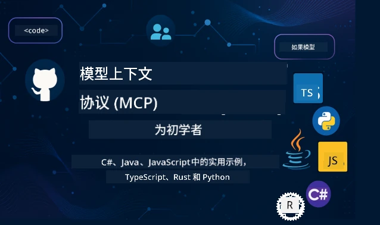

 

[](https://GitHub.com/microsoft/mcp-for-beginners/graphs/contributors)
[](https://GitHub.com/microsoft/mcp-for-beginners/issues)
[](https://GitHub.com/microsoft/mcp-for-beginners/pulls)
[](http://makeapullrequest.com)
[](https://mcptoplist.com/server/mcp.so%2Fmcp-for-beginners%2Fmicrosoft)

[](https://GitHub.com/microsoft/mcp-for-beginners/watchers)
[](https://GitHub.com/microsoft/mcp-for-beginners/fork)
[](https://GitHub.com/microsoft/mcp-for-beginners/stargazers)


[](https://discord.gg/nTYy5BXMWG)

按照以下步骤开始使用这些资源：
1. <strong>叉出仓库</strong>：点击 [](https://GitHub.com/microsoft/mcp-for-beginners/fork)
2. <strong>克隆仓库</strong>： `git clone https://github.com/microsoft/mcp-for-beginners.git`
3. <strong>加入</strong> [](https://discord.gg/nTYy5BXMWG)


### 🌐 多语言支持

#### 通过 GitHub Action 支持（自动且始终最新）

<!-- CO-OP TRANSLATOR LANGUAGES TABLE START -->
[Arabic](../ar/README.md) | [Bengali](../bn/README.md) | [Bulgarian](../bg/README.md) | [Burmese (Myanmar)](../my/README.md) | [Chinese (Simplified)](./README.md) | [Chinese (Traditional, Hong Kong)](../zh-HK/README.md) | [Chinese (Traditional, Macau)](../zh-MO/README.md) | [Chinese (Traditional, Taiwan)](../zh-TW/README.md) | [Croatian](../hr/README.md) | [Czech](../cs/README.md) | [Danish](../da/README.md) | [Dutch](../nl/README.md) | [Estonian](../et/README.md) | [Finnish](../fi/README.md) | [French](../fr/README.md) | [German](../de/README.md) | [Greek](../el/README.md) | [Hebrew](../he/README.md) | [Hindi](../hi/README.md) | [Hungarian](../hu/README.md) | [Indonesian](../id/README.md) | [Italian](../it/README.md) | [Japanese](../ja/README.md) | [Kannada](../kn/README.md) | [Khmer](../km/README.md) | [Korean](../ko/README.md) | [Lithuanian](../lt/README.md) | [Malay](../ms/README.md) | [Malayalam](../ml/README.md) | [Marathi](../mr/README.md) | [Nepali](../ne/README.md) | [Nigerian Pidgin](../pcm/README.md) | [Norwegian](../no/README.md) | [Persian (Farsi)](../fa/README.md) | [Polish](../pl/README.md) | [Portuguese (Brazil)](../pt-BR/README.md) | [Portuguese (Portugal)](../pt-PT/README.md) | [Punjabi (Gurmukhi)](../pa/README.md) | [Romanian](../ro/README.md) | [Russian](../ru/README.md) | [Serbian (Cyrillic)](../sr/README.md) | [Slovak](../sk/README.md) | [Slovenian](../sl/README.md) | [Spanish](../es/README.md) | [Swahili](../sw/README.md) | [Swedish](../sv/README.md) | [Tagalog (Filipino)](../tl/README.md) | [Tamil](../ta/README.md) | [Telugu](../te/README.md) | [Thai](../th/README.md) | [Turkish](../tr/README.md) | [Ukrainian](../uk/README.md) | [Urdu](../ur/README.md) | [Vietnamese](../vi/README.md)

> **喜欢本地克隆吗？**
>
> 本仓库包含 50 多种语言版本，显著增大了下载体积。若要克隆不含翻译的版本，请使用稀疏检出：
>
> **Bash / macOS / Linux:**
> ```bash
> git clone --filter=blob:none --sparse https://github.com/microsoft/mcp-for-beginners.git
> cd mcp-for-beginners
> git sparse-checkout set --no-cone '/*' '!translations' '!translated_images'
> ```
>
> **CMD（Windows）：**
> ```cmd
> git clone --filter=blob:none --sparse https://github.com/microsoft/mcp-for-beginners.git
> cd mcp-for-beginners
> git sparse-checkout set --no-cone "/*" "!translations" "!translated_images"
> ```
>
> 这样你将获得完成课程所需的全部内容，且下载速度更快。
<!-- CO-OP TRANSLATOR LANGUAGES TABLE END -->

# 🚀 面向初学者的模型上下文协议（MCP）课程

## **通过 C#、Java、JavaScript、Rust、Python 和 TypeScript 的实操代码学习 MCP**

## 🧠 模型上下文协议课程概览
欢迎开启你的模型上下文协议之旅！如果你曾好奇 AI 应用程序如何与不同工具和服务通信，你即将发现这项优雅的解决方案，它正在改变开发者构建智能系统的方式。

把 MCP 想象成 AI 应用的通用翻译器——就像 USB 端口让你能连接任何设备到电脑一样，MCP 让 AI 模型以标准化方式连接到任何工具或服务。无论你是在构建第一个聊天机器人，还是开发复杂的 AI 工作流程，理解 MCP 都将赋能你创造更强大、更灵活的应用。

本课程设计细致，耐心伴随你的学习旅程。我们将从你已理解的简单概念开始，逐步通过你喜欢的编程语言的实操练习提升你的专业技能。每一步都包含清晰的解释、实用示例以及大量鼓励。

完成本课程后，你将有信心构建自己的 MCP 服务器，将其集成到流行的 AI 平台，并理解这项技术如何重塑 AI 开发的未来。让我们一起开始这段激动人心的冒险吧！

### 官方文档与规范

本课程与 **MCP 规范 2025-11-25**（最新稳定版）保持一致。MCP 规范采用基于日期的版本控制（YYYY-MM-DD 格式），以确保协议版本的清晰追踪。

> **展望未来：** 下一版规范的候选版本为 **2026-07-28**，计划于 2026 年 7 月 28 日发布。它使协议在传输层实现无状态，规范了扩展框架（MCP 应用、任务），强化授权，并废弃 Roots、采样和日志功能。详细内容请参阅 [MCP 变更概览：2026-07-28 候选版本](./01-CoreConcepts/mcp-2026-07-28-release-candidate.md)。

随着理解的加深，这些资源会愈发宝贵，但不必急于一时全部阅读。请从你最感兴趣的部分开始！
- 📘 [MCP 文档](https://modelcontextprotocol.io/) – 这是你的必备资源，包含逐步教程和用户指南。文档专为初学者编写，提供清晰示例，你可以按自己的节奏跟随学习。
- 📜 [MCP 规范](https://modelcontextprotocol.io/specification/2025-11-25) – 视作全面参考手册。你在学习课程过程中，会经常回来看具体细节和探索高级功能。
- 📜 [MCP 规范版本控制](https://modelcontextprotocol.io/specification/versioning) – 包含协议版本历史及 MCP 如何使用基于日期的版本控制（YYYY-MM-DD 格式）的信息。
- 🧑‍💻 [MCP GitHub 仓库](https://github.com/modelcontextprotocol) – 这里汇集了多个编程语言的 SDK、工具和代码示例。就像实用示例和即用组件的宝藏库。
- 🌐 [MCP 社区](https://github.com/orgs/modelcontextprotocol/discussions) – 加入学习者和资深开发者的讨论。这里是一个支持性社区，欢迎提问并自由分享知识。
  
## 学习目标

完成本课程后，你将充满信心和激情，掌握以下能力：

• **理解 MCP 基础**：你会掌握模型上下文协议是什么及其如何革新 AI 应用协作，通过类比和例子加深理解。

• **构建你的第一个 MCP 服务器**：你将用所选编程语言创建一个运行中的 MCP 服务器，从简单示例起步，逐步提升技能。

• **将 AI 模型连接到真实工具**：你会学习如何架起 AI 模型和实际服务之间的桥梁，赋予应用强大新功能。

• <strong>实现安全最佳实践</strong>：你将理解如何保障 MCP 实现的安全，保护应用和用户。

• <strong>自信部署</strong>：你会知晓如何将 MCP 项目从开发推进至生产环境，掌握实用的部署策略。

• **加入 MCP 社区**：你将成为一个不断壮大的开发者社区一员，共同塑造 AI 应用开发的未来。

## 必备背景知识

在深入 MCP 细节之前，让我们确保你对一些基础概念感到自如。放心，如果你不是这些领域的专家，我们会在学习中解释你需要知道的一切！

### 理解协议（基础）

把协议想象成对话的规则。你打电话给朋友时，双方都知道接听时要说“你好”，轮流说话，结束时说“再见”。计算机程序也需要类似规则来有效沟通。

MCP 是一种协议——一套约定的规则，帮助 AI 模型和应用与工具及服务进行高效“对话”。就像对话规则让人类交流更顺畅一样，MCP 让 AI 应用通信更可靠、更强大。

### 客户端-服务器关系（程序如何协作）

你每天都在使用客户端-服务器模式！当你用网页浏览器（客户端）访问网站时，你连接到提供页面内容的 web 服务器。浏览器知道如何请求信息，服务器知道如何响应。

在 MCP 中，也有类似关系：AI 模型充当请求信息或动作的客户端，MCP 服务器提供这些能力。就像一个乐于助人的助手（服务器），AI 可以请求执行特定任务。

### 标准化为何重要（让一切协同工作）

想象每个汽车制造商都用不同形状的加油枪——你就需要每辆车不同的适配器！标准化就是达成共识，让一切无阻协同。

MCP 为 AI 应用提供了这种标准化。不是每个 AI 模型都需要为每个工具实现定制代码，MCP 创造了通用通信方式。开发者只需构建一次工具，便能让不同 AI 系统一通用。

## 🧭 你的学习路径概览

你的 MCP 学习之旅被精心设计，逐步建立你的信心和技能。每个阶段介绍新概念，同时巩固已学内容。

### 🌱 基础阶段：理解基础 (模块 0-2)

这里是你冒险的起点！我们将用熟悉的类比和简单示例向你介绍 MCP 概念。你将理解 MCP 是什么，为什么它存在，以及它如何融入 AI 开发的大环境。


• **模块 0 - MCP 介绍**：我们将首先探讨 MCP 是什么，以及它为何对现代 AI 应用如此重要。你将看到 MCP 在实际中的示例，并理解它如何解决开发者常见的问题。

• **模块 1 - 核心概念解析**：这里你将学习 MCP 的基本构件。我们会使用大量比喻和视觉示例，确保这些概念自然且易懂。

• **模块 2 - MCP 安全**：安全听起来可能令人生畏，但我们会向你展示 MCP 内置的安全特性，并教授保护你的应用的最佳实践。

### 🔨 构建阶段：创建你的第一个实现（模块 3）

现在真正有趣的部分开始了！你将获得动手经验，构建实际的 MCP 服务器和客户端。别担心——我们会从简单开始，指导你完成每一步。

本模块包含多个动手指南，让你用喜欢的编程语言练习。你将创建第一个服务器，构建连接它的客户端，甚至与 VS Code 等流行开发工具集成。

每个指南都包含完整的代码示例、故障排除技巧，以及我们为何做出特定设计选择的解释。在此阶段结束时，你将拥有可自豪的 MCP 实现！

### 🚀 成长阶段：高级概念和真实应用（模块 4-5）

掌握基础后，你准备探索更复杂的 MCP 特性。我们将涵盖实用的实现策略、调试技巧和多模态 AI 集成等高级主题。

你还将学习如何将 MCP 实现扩展到生产环境，并与 Azure 等云平台集成。这些模块为你构建能应对真实需求的 MCP 解决方案做好准备。

### 🌟 精通阶段：社区与专精（模块 6-11）

最后阶段聚焦加入 MCP 社区和专注你最感兴趣的领域。你将学习如何为开源 MCP 项目做贡献，实现高级身份验证模式，并构建集成数据库的全面解决方案。

模块 11 值得特别提及——这是一个包含 13 个实验的完整动手学习路径，教你构建带有 PostgreSQL 集成的生产级 MCP 服务器。它像一个综合项目，融合了你所学的一切！

### 📚 完整课程结构

| 模块 | 主题 | 描述 | 链接 |
|--------|-------|-------------|------|
| **模块 0-3：基础** | | | |
| 00 | MCP 介绍 | 模型上下文协议概述及其在 AI 流水线中的重要性 | [阅读更多](./00-Introduction/README.md) |
| 01 | 核心概念解析 | 深入探索 MCP 核心概念 | [阅读更多](./01-CoreConcepts/README.md) |
| 1.1 | MCP 的变更（2026-07-28 RC） | 无状态协议、扩展框架及下一版本规范的功能弃用 | [指南](./01-CoreConcepts/mcp-2026-07-28-release-candidate.md) |
| 02 | MCP 安全 | 安全威胁与最佳实践 | [阅读更多](./02-Security/README.md) |
| 03 | MCP 入门 | 环境设置，基础服务器/客户端，集成 | [阅读更多](./03-GettingStarted/README.md) |
| **模块 3：构建你的第一个服务器和客户端** | | | |
| 3.1 | 第一个服务器 | 创建你的第一个 MCP 服务器 | [指南](./03-GettingStarted/01-first-server/README.md) |
| 3.2 | 第一个客户端 | 开发基础的 MCP 客户端 | [指南](./03-GettingStarted/02-client/README.md) |
| 3.3 | 集成大型语言模型客户端 | 集成大型语言模型 | [指南](./03-GettingStarted/03-llm-client/README.md) |
| 3.4 | VS Code 集成 | 在 VS Code 中使用 MCP 服务器 | [指南](./03-GettingStarted/04-vscode/README.md) |
| 3.5 | stdio 服务器 | 使用 stdio 传输创建服务器 | [指南](./03-GettingStarted/05-stdio-server/README.md) |
| 3.6 | HTTP 流式传输 | 实现 MCP 中的 HTTP 流式传输 | [指南](./03-GettingStarted/06-http-streaming/README.md) |
| 3.7 | Microsoft Foundry 工具包 | 在 MCP 中使用 Microsoft Foundry 工具包 | [指南](./03-GettingStarted/07-aitk/README.md) |
| 3.8 | 测试 | 测试你的 MCP 服务器实现 | [指南](./03-GettingStarted/08-testing/README.md) |
| 3.9 | 部署 | 将 MCP 服务器部署到生产环境 | [指南](./03-GettingStarted/09-deployment/README.md) |
| 3.10 | 高级服务器用法 | 使用高级服务器实现高级功能和改进架构 | [指南](./03-GettingStarted/10-advanced/README.md) |
| 3.11 | 简单认证 | 从头讲解认证和基于角色的访问控制 | [指南](./03-GettingStarted/11-simple-auth/README.md) |
| 3.12 | MCP 主机 | 配置 Claude Desktop、Cursor、Cline 及其他 MCP 主机 | [指南](./03-GettingStarted/12-mcp-hosts/README.md) |
| 3.13 | MCP Inspector | 使用 Inspector 工具调试和测试 MCP 服务器 | [指南](./03-GettingStarted/13-mcp-inspector/README.md) |
| 3.14 | 采样 | 使用采样与客户端协作 | [指南](./03-GettingStarted/14-sampling/README.md) |
| 3.15 | MCP 应用 | 构建 MCP 应用 | [指南](./03-GettingStarted/15-mcp-apps/README.md) |
| **模块 4-5：实用与高级** | | | |
| 04 | 实用实现 | SDK、调试、测试、可重用提示模板 | [阅读更多](./04-PracticalImplementation/README.md) |
| 4.1 | 分页 | 使用基于游标的分页处理大结果集 | [指南](./04-PracticalImplementation/pagination/README.md) |
| 05 | MCP 高级主题 | 多模态 AI，扩展，企业应用 | [阅读更多](./05-AdvancedTopics/README.md) |
| 5.1 | Azure 集成 | MCP 与 Azure 的集成 | [指南](./05-AdvancedTopics/mcp-integration/README.md) |
| 5.2 | 多模态 | 多模态操作 | [指南](./05-AdvancedTopics/mcp-multi-modality/README.md) |
| 5.3 | OAuth2 演示 | 实现 OAuth2 身份验证 | [指南](./05-AdvancedTopics/mcp-oauth2-demo/README.md) |
| 5.4 | 根上下文 | 理解并实现根上下文 | [指南](./05-AdvancedTopics/mcp-root-contexts/README.md) |
| 5.5 | 路由 | MCP 路由策略 | [指南](./05-AdvancedTopics/mcp-routing/README.md) |
| 5.6 | 采样 | MCP 中的采样技术 | [指南](./05-AdvancedTopics/mcp-sampling/README.md) |
| 5.7 | 扩展 | 扩展 MCP 实现 | [指南](./05-AdvancedTopics/mcp-scaling/README.md) |
| 5.8 | 安全 | 高级安全考虑事项 | [指南](./05-AdvancedTopics/mcp-security/README.md) |
| 5.9 | 网络搜索 | 实现网络搜索功能 | [指南](./05-AdvancedTopics/web-search-mcp/README.md) |
| 5.10 | 实时流式传输 | 构建实时流传输功能 | [指南](./05-AdvancedTopics/mcp-realtimestreaming/README.md) |
| 5.11 | 实时搜索 | 实现实时搜索 | [指南](./05-AdvancedTopics/mcp-realtimesearch/README.md) |
| 5.12 | Entra ID 认证 | 使用 Microsoft Entra ID 认证 | [指南](./05-AdvancedTopics/mcp-security-entra/README.md) |
| 5.13 | Foundry 集成 | 与 Microsoft Foundry 集成 | [指南](./05-AdvancedTopics/mcp-foundry-agent-integration/README.md) |
| 5.14 | 上下文工程 | 高效上下文工程技术 | [指南](./05-AdvancedTopics/mcp-contextengineering/README.md) |
| 5.15 | MCP 自定义传输 | 自定义传输实现 | [指南](./05-AdvancedTopics/mcp-transport/README.md) |
| 5.16 | 协议特性 | 进度通知、取消、资源模板 | [指南](./05-AdvancedTopics/mcp-protocol-features/README.md) |
| 5.17 | 对抗多智能体推理 | 两个智能体使用共享 MCP 工具辩论，由裁判智能体评估 | [指南](./05-AdvancedTopics/mcp-adversarial-agents/README.md) |
| **模块 6-10：社区与最佳实践** | | | |
| 06 | 社区贡献 | 如何为 MCP 生态系统贡献力量 | [指南](./06-CommunityContributions/README.md) |
| 07 | 早期采用经验 | 真实实现故事 | [指南](./07-LessonsfromEarlyAdoption/README.md) |
| 08 | MCP 最佳实践 | 性能、容错性、恢复力 | [指南](./08-BestPractices/README.md) |
| 09 | MCP 案例研究 | 实际实现示例 | [指南](./09-CaseStudy/README.md) |
| 10 | 实操工作坊 | 使用 Microsoft Foundry 工具包构建 MCP 服务器 | [实验](./10-StreamliningAIWorkflowsBuildingAnMCPServerWithAIToolkit/README.md) |
| **模块 11：MCP 服务器动手实验** | | | |
| 11 | MCP 服务器数据库集成 | 13 个实验的综合动手课程路径，包含 PostgreSQL 集成 | [实验](./11-MCPServerHandsOnLabs/README.md) |
| 11.1 | 介绍 | 带有数据库集成和零售分析案例的 MCP 概述 | [实验 00](./11-MCPServerHandsOnLabs/00-Introduction/README.md) |
| 11.2 | 核心架构 | 理解 MCP 服务器架构、数据库层和安全模式 | [实验 01](./11-MCPServerHandsOnLabs/01-Architecture/README.md) |
| 11.3 | 安全与多租户 | 行级安全、认证和多租户数据访问 | [实验 02](./11-MCPServerHandsOnLabs/02-Security/README.md) |
| 11.4 | 环境设置 | 搭建开发环境、Docker、Azure 资源 | [实验 03](./11-MCPServerHandsOnLabs/03-Setup/README.md) |
| 11.5 | 数据库设计 | PostgreSQL 设置、零售模式设计和示例数据 | [实验 04](./11-MCPServerHandsOnLabs/04-Database/README.md) |
| 11.6 | MCP 服务器实现 | 构建带数据库集成的 FastMCP 服务器 | [实验 05](./11-MCPServerHandsOnLabs/05-MCP-Server/README.md) |
| 11.7 | 工具开发 | 创建数据库查询工具和模式检测 | [实验 06](./11-MCPServerHandsOnLabs/06-Tools/README.md) |
| 11.8 | 语义搜索 | 使用 Azure OpenAI 和 pgvector 实现向量嵌入 | [实验 07](./11-MCPServerHandsOnLabs/07-Semantic-Search/README.md) |
| 11.9 | 测试与调试 | 测试策略、调试工具和验证方法 | [实验 08](./11-MCPServerHandsOnLabs/08-Testing/README.md) |
| 11.10 | VS Code 集成 | 配置 VS Code MCP 集成和 AI 聊天使用 | [实验 09](./11-MCPServerHandsOnLabs/09-VS-Code/README.md) |
| 11.11 | 部署策略 | Docker 部署，Azure Container Apps 和扩展考虑 | [实验 10](./11-MCPServerHandsOnLabs/10-Deployment/README.md) |
| 11.12 | 监控 | 应用洞察、日志记录、性能监控 | [实验 11](./11-MCPServerHandsOnLabs/11-Monitoring/README.md) |
| 11.13 | 最佳实践 | 性能优化、安全强化和生产建议 | [实验 12](./11-MCPServerHandsOnLabs/12-Best-Practices/README.md) |
| **模块 12：MCP 工具链** | | | |
| 12.1 | 工具链 | MCP 在 Copilot 应用中的使用 | [ 指南 ](./12-tooling/README.md) |

### 💻 示例代码项目

学习 MCP 最激动人心的部分之一是你代码技能的逐步发展。我们的代码示例设计从简单开始，随着你的理解加深，逐渐变得更复杂。以下是我们介绍概念的方式——使用易懂但展示真实 MCP 原则的代码，你不仅能理解代码做了什么，还能理解它为何这样结构化以及它如何融入更大的 MCP 应用中。

#### 基础 MCP 计算器示例

| 语言 | 描述 | 链接 |
|----------|-------------|------|

| C# | MCP 服务器示例 | [查看代码](./03-GettingStarted/samples/csharp/README.md) |
| Java | MCP 计算器 | [查看代码](./03-GettingStarted/samples/java/calculator/README.md) |
| JavaScript | MCP 演示 | [查看代码](./03-GettingStarted/samples/javascript/README.md) |
| Python | MCP 服务器 | [查看代码](../../03-GettingStarted/samples/python/mcp_calculator_server.py) |
| TypeScript | MCP 示例 | [查看代码](./03-GettingStarted/samples/typescript/README.md) |
| Rust | MCP 示例 | [查看代码](./03-GettingStarted/samples/rust/README.md) |

#### 高级 MCP 实现

| 语言 | 描述 | 链接 |
|----------|-------------|------|
| C# | 高级示例 | [查看代码](./04-PracticalImplementation/samples/csharp/README.md) |
| 使用 Spring 的 Java | 容器应用示例 | [查看代码](./04-PracticalImplementation/samples/java/containerapp/README.md) |
| JavaScript | 高级示例 | [查看代码](./04-PracticalImplementation/samples/javascript/README.md) |
| Python | 复杂实现 | [查看代码](./04-PracticalImplementation/samples/python/README.md) |
| TypeScript | 容器示例 | [查看代码](./04-PracticalImplementation/samples/typescript/README.md) |


## 🎯 学习 MCP 的前提条件

为了最大程度地受益于本课程，您应该具备：

- 至少掌握以下一门语言的基本编程知识：C#、Java、JavaScript、Python 或 TypeScript
- 理解客户端-服务器模型和 API
- 熟悉 REST 和 HTTP 概念
- （可选）具备 AI/ML 概念背景

- 加入我们的社区讨论以获得支持

## 📚 学习指南与资源

本仓库包含多个资源，帮助您有效导航和学习：

### 学习指南

有一份全面的[学习指南](./study_guide.md)，帮助您有效浏览本仓库。该视觉课程地图展示了所有主题的联系，并指导您如何有效使用示例项目。对于喜欢整体观的视觉学习者特别有帮助。

该指南包括：
- 展示所有覆盖主题的视觉课程地图
- 每个仓库部分的详细解析
- 使用示例项目的指导
- 针对不同技能水平的推荐学习路径
- 补充学习旅程的附加资源

### 更新日志

我们维护有详细的[更新日志](./changelog.md)，记录课程材料的所有重大更新，帮助您掌握最新改进和新增内容。
- 新内容添加
- 结构性变更
- 功能改进
- 文档更新

## 🛠️ 如何有效使用本课程

本指南中的每个课程包含：

1. 清晰的 MCP 概念解释  
2. 多语言的实时代码示例  
3. 构建真实 MCP 应用的练习  
4. 针对高级学习者的额外资源

### 让我们用 C# 学习 MCP - 教程系列
让我们了解 Model Context Protocol (MCP)，这是一个旨在标准化 AI 模型与客户端应用之间交互的前沿框架。通过这个适合初学者的课程，我们将介绍 MCP，并指导你创建第一个 MCP 服务器。
#### C#：[https://aka.ms/letslearnmcp-csharp](https://aka.ms/letslearnmcp-csharp)
#### Java：[https://aka.ms/letslearnmcp-java](https://aka.ms/letslearnmcp-java)
#### JavaScript：[https://aka.ms/letslearnmcp-javascript](https://aka.ms/letslearnmcp-javascript)
#### Python：[https://aka.ms/letslearnmcp-python](https://aka.ms/letslearnmcp-python)

## 🎓 你的 MCP 旅程开始了

恭喜！你刚迈出了令人激动的第一步，这将拓展你的编程能力，并让你接触到 AI 开发的前沿。

### 你已经完成了什么

通过阅读本介绍，你已经开始构建 MCP 知识基础。你理解了 MCP 是什么、为什么重要，以及本课程如何支持你的学习旅程。这是一项重要成就，也是你在该重要技术领域建立专业知识的起点。

### 前方的冒险

随着模块的推进，请记住每位专家曾经也是初学者。当前可能觉得复杂的概念，随着你的练习与应用，将变成第二天性。每一个小步都构建成强大能力，助你在开发生涯中受用无穷。

### 你的支持网络

你正加入一个热衷于 MCP 的学习者和专家社区，他们渴望帮助他人成功。无论你卡在编码难题，还是兴奋分享突破，社区都会支撑你的旅程。

如果你遇到困难或对构建 AI 应用有任何疑问，加入与其他学习者及经验开发者的 MCP 讨论。这是一个欢迎提问、知识自由共享的支持社区。

[](https://discord.gg/nTYy5BXMWG)

如果你对产品有反馈或在构建过程中遇到错误，请访问：

[](https://aka.ms/foundry/forum)

### 准备开始了吗？

你的 MCP 冒险现在开始！从模块0开始，深入你的第一个 MCP 实践体验，或者探索示例项目，看看你将构建什么。记住——每位专家都是从你现在的位置开始，通过耐心和练习，你会惊讶于自己能达到的成就。

欢迎来到 Model Context Protocol 开发的世界。让我们一起构建惊人项目吧！

## 🤝 为学习社区贡献力量

本课程因有你这样的学习者贡献而不断壮大！无论是修正错字、建议更清晰解释或添加新示例，你的贡献帮助其他初学者取得成功。

感谢微软杰出专家 [Shivam Goyal](https://www.linkedin.com/in/shivam2003/) 贡献代码样本。

贡献流程设计得友好支持。大多贡献需要签署贡献者许可协议（CLA），但自动工具会顺利指导你完成流程。

## 📜 开源学习

本课程完全采用 MIT [许可证](../../LICENSE)，意味着你可以自由使用、修改和分享。支持我们让 MCP 知识惠及全球开发者的使命。
## 🤝 贡献指南

本项目欢迎贡献和建议。 大多数贡献需要你同意一份
贡献者许可协议（CLA），声明你有权利且实际授予我们
使用你贡献内容的权利。详情请访问 <https://cla.opensource.microsoft.com>。

提交拉取请求时，CLA 机器人会自动判断你是否需要提供
CLA 并相应标注 PR（例如状态检查、评论）。只需按照
机器人提供的指导操作。你在使用我们 CLA 的所有仓库中只需执行一次。

本项目采用了 [微软开源行为准则](https://opensource.microsoft.com/codeofconduct/)。
更多信息请参阅 [行为准则常见问题](https://opensource.microsoft.com/codeofconduct/faq/) 或
联系 [opencode@microsoft.com](mailto:opencode@microsoft.com) 了解更多。

---

*准备好开始你的 MCP 之旅了吗？从[模块 00 - MCP 介绍](./00-Introduction/README.md)开始，迈出进入 Model Context Protocol 开发世界的第一步！*


## 🎒 其他课程
我们团队还制作了其他课程！看看：

<!-- CO-OP TRANSLATOR OTHER COURSES START -->
### LangChain
[](https://aka.ms/langchain4j-for-beginners)
[](https://aka.ms/langchainjs-for-beginners?WT.mc_id=m365-94501-dwahlin)
[](https://github.com/microsoft/langchain-for-beginners?WT.mc_id=m365-94501-dwahlin)
---

### Azure / Edge / MCP / 代理
[](https://github.com/microsoft/AZD-for-beginners?WT.mc_id=academic-105485-koreyst)
[](https://github.com/microsoft/edgeai-for-beginners?WT.mc_id=academic-105485-koreyst)
[](https://github.com/microsoft/mcp-for-beginners?WT.mc_id=academic-105485-koreyst)
[](https://github.com/microsoft/ai-agents-for-beginners?WT.mc_id=academic-105485-koreyst)

---
 
### 生成式 AI 系列
[](https://github.com/microsoft/generative-ai-for-beginners?WT.mc_id=academic-105485-koreyst)
[-9333EA?style=for-the-badge&labelColor=E5E7EB&color=9333EA)](https://github.com/microsoft/Generative-AI-for-beginners-dotnet?WT.mc_id=academic-105485-koreyst)
[-C084FC?style=for-the-badge&labelColor=E5E7EB&color=C084FC)](https://github.com/microsoft/generative-ai-for-beginners-java?WT.mc_id=academic-105485-koreyst)
[-E879F9?style=for-the-badge&labelColor=E5E7EB&color=E879F9)](https://github.com/microsoft/generative-ai-with-javascript?WT.mc_id=academic-105485-koreyst)

---
 
### 核心学习
[](https://aka.ms/ml-beginners?WT.mc_id=academic-105485-koreyst)
[](https://aka.ms/datascience-beginners?WT.mc_id=academic-105485-koreyst)
[](https://aka.ms/ai-beginners?WT.mc_id=academic-105485-koreyst)

[](https://github.com/microsoft/Security-101?WT.mc_id=academic-96948-sayoung)
[](https://aka.ms/webdev-beginners?WT.mc_id=academic-105485-koreyst)
[](https://aka.ms/iot-beginners?WT.mc_id=academic-105485-koreyst)
[](https://github.com/microsoft/xr-development-for-beginners?WT.mc_id=academic-105485-koreyst)

---
 
### Copilot 系列
[](https://aka.ms/GitHubCopilotAI?WT.mc_id=academic-105485-koreyst)
[](https://github.com/microsoft/mastering-github-copilot-for-dotnet-csharp-developers?WT.mc_id=academic-105485-koreyst)
[](https://github.com/microsoft/CopilotAdventures?WT.mc_id=academic-105485-koreyst)
<!-- CO-OP TRANSLATOR OTHER COURSES END -->

---

<!-- CO-OP TRANSLATOR DISCLAIMER START -->
**免责声明**：
本文件由 AI 翻译服务 [Co-op Translator](https://github.com/Azure/co-op-translator) 翻译完成。尽管我们力求准确，但请注意，自动翻译可能包含错误或不准确之处。原始语言版文件应视为权威来源。对于重要信息，建议使用专业人工翻译。我们对因使用本翻译而产生的任何误解或误释不承担责任。
<!-- CO-OP TRANSLATOR DISCLAIMER END -->