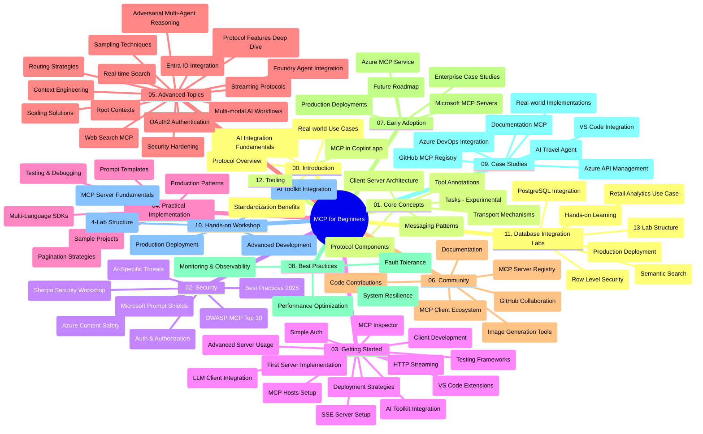

# 面向初学者的模型上下文协议（MCP）- 学习指南

本学习指南概述了“面向初学者的模型上下文协议（MCP）”课程的代码库结构和内容。使用本指南可高效导航代码库，充分利用现有资源。

## 代码库概览

模型上下文协议（MCP）是 AI 模型与客户端应用之间交互的标准化框架。最初由 Anthropic 创建，现由官方 GitHub 组织下的更广泛 MCP 社区维护。本代码库提供全面课程，包含 C#、Java、JavaScript、Python 和 TypeScript 的动手代码示例，面向 AI 开发者、系统架构师和软件工程师。

## 可视化课程地图

## 代码库结构

代码库分为十二个主要部分，每部分聚焦 MCP 不同方面：

1. **介绍 (00-Introduction/)**
   - 模型上下文协议概述
   - AI 流水线中标准化的重要性
   - 实际应用案例和优势

2. **核心概念 (01-CoreConcepts/)**
   - 客户端-服务器架构
   - 协议关键组件
   - MCP 中的消息传递模式
   - 当前规范：[MCP 变更内容：2026-07-28 规范](./01-CoreConcepts/mcp-2026-07-28.md) — 无状态协议核心、扩展框架，Roots/Sampling/Logging 弃用

3. **安全 (02-Security/)**
   - 基于 MCP 系统的安全威胁
   - 保护实现的最佳实践
   - 认证与授权策略
   - 动手操作 [CIMD 和 DCR 授权示例](./02-Security/samples/cimd-dcr-auth/README.md)
   - <strong>全面安全文档</strong>：
     - MCP 安全最佳实践
     - Azure 内容安全实施指南
     - MCP 安全控制与技术
     - MCP 最佳实践速查
   - <strong>关键安全主题</strong>：
     - 提示注入和工具中毒攻击
     - 会话劫持和混淆代理问题
     - 令牌透传漏洞
     - 权限过度和访问控制
     - AI 组件的供应链安全
     - 微软提示防护集成

4. **入门 (03-GettingStarted/)**
   - 环境搭建与配置
   - 创建基本的 MCP 服务器和客户端
   - 与现有应用集成
   - 包含章节：
     - 第一个服务器实现
     - 客户端开发
     - 大型语言模型客户端集成
     - VS Code 集成
     - 服务器推送事件（SSE）服务器
     - 高级服务器使用
     - HTTP 流式传输
     - AI 工具包集成
     - 测试策略
     - 部署指南

5. **实用实现 (04-PracticalImplementation/)**
   - 使用不同编程语言的 SDK
   - 调试、测试及验证技术
   - 编写可复用的提示模板和工作流程
   - 含实现示例的示范项目

6. **高级主题 (05-AdvancedTopics/)**
   - 上下文工程技术
   - Foundry 代理集成
   - 多模态 AI 工作流
   - OAuth2 认证演示
   - 实时搜索能力
   - 实时流式传输
   - 根上下文实现
   - 路由策略
   - 采样技术
   - 扩展方法
   - 安全考虑
   - Entra ID 安全集成
   - 网络搜索集成
   - 对抗式多代理推理（辩论模式）

7. **社区贡献 (06-CommunityContributions/)**
   - 如何贡献代码及文档
   - 通过 GitHub 协作
   - 社区驱动的改进与反馈
   - 使用多种 MCP 客户端（Claude Desktop、Cline、VSCode）
   - 使用流行 MCP 服务器，包括图像生成

8. **早期采用经验 (07-LessonsfromEarlyAdoption/)**
   - 真实案例和成功故事
   - MCP 基础解决方案的构建与部署
   - 趋势与未来路线图
   - **微软 MCP 服务器指南**：包含 10 个生产就绪微软 MCP 服务器的综合指南，包括：
     - Microsoft Learn Docs MCP Server
     - Azure MCP Server（15+ 专用连接器）
     - GitHub MCP Server
     - Azure DevOps MCP Server
     - MarkItDown MCP Server
     - SQL Server MCP Server
     - Playwright MCP Server
     - Dev Box MCP Server
     - Microsoft Foundry MCP Server
     - Microsoft 365 Agents Toolkit MCP Server

9. **最佳实践 (08-BestPractices/)**
   - 性能调优与优化
   - 设计容错 MCP 系统
   - 测试与弹性策略

10. **案例研究 (09-CaseStudy/)**
    - <strong>七个综合案例研究</strong>展示 MCP 在多种场景的多样应用：
    - **Azure AI 旅行代理**：基于 Azure OpenAI 与 AI 搜索的多代理编排
    - **Azure DevOps 集成**：利用 YouTube 数据更新自动化工作流
    - <strong>实时文档检索</strong>：Python 控制台客户端配合流式 HTTP
    - <strong>互动学习计划生成器</strong>：基于 Chainlit 的对话式 AI Web 应用
    - <strong>编辑器内文档</strong>：VS Code 集成 GitHub Copilot 工作流
    - **Azure API 管理**：企业级 API 集成与 MCP 服务器创建
    - **GitHub MCP 注册表**：生态系统开发与代理集成平台
    - 涉及企业集成、开发者生产力、生态发展等实现示例

11. **动手研讨会 (10-StreamliningAIWorkflowsBuildingAnMCPServerWithAIToolkit/)**
    - 结合 MCP 与 AI 工具包的全面动手研讨会
    - 构建连接 AI 模型与现实工具的智能应用
    - 涵盖基础知识、自定义服务器开发及生产部署策略的实用模块
    - <strong>实验结构</strong>：
      - 实验 1：MCP 服务器基础
      - 实验 2：高级 MCP 服务器开发
      - 实验 3：AI 工具包集成
      - 实验 4：生产部署与扩展
    - 基于实验的分步骤学习方法

12. **MCP 服务器数据库集成实验室 (11-MCPServerHandsOnLabs/)**
    - **包含 13 个实验的全面学习路径**，用于构建生产就绪 MCP 服务器并集成 PostgreSQL
    - <strong>真实零售分析实现</strong>，基于 Zava Retail 用例
    - <strong>企业级模式</strong>，包括行级安全（RLS）、语义搜索、多租户数据访问
    - <strong>完整实验结构</strong>：
      - **实验 00-03：基础** - 介绍、架构、安全、环境搭建
      - **实验 04-06：构建 MCP 服务器** - 数据库设计、MCP 服务器实现、工具开发

      - **实验 07-09：高级功能** - 语义搜索、测试与调试、VS Code 集成
      - **实验 10-12：生产与最佳实践** - 部署、监控、优化
    - <strong>涵盖技术</strong>：FastMCP 框架、PostgreSQL、Azure OpenAI、Azure 容器应用、应用洞察
    - <strong>学习成果</strong>：生产就绪的 MCP 服务器、数据库集成模式、AI 驱动的分析、企业级安全

13. **工具链 (12-tooling/)**
    - 学习如何在 Copilot 应用和其他工具中使用 MCP

## 额外资源

代码库包括支持资源：

- <strong>图片文件夹</strong>：包含课程中使用的图表和插图
- <strong>翻译</strong>：多语言支持，文档自动翻译
- **官方 MCP 资源**：
  - [MCP 文档](https://modelcontextprotocol.io/)
  - [MCP 规范](https://modelcontextprotocol.io/specification/2026-07-28/)
  - [MCP GitHub 仓库](https://github.com/modelcontextprotocol)

## 如何使用此代码库

1. <strong>按顺序学习</strong>：按章节顺序（00 至 11）学习，获得结构化学习体验。
2. <strong>语言专注</strong>：如果你关注特定编程语言，请浏览样例目录中你偏好的语言实现。
3. <strong>实践操作</strong>：从“快速开始”部分入手，搭建环境并创建第一个 MCP 服务器和客户端。
4. <strong>深度探索</strong>：掌握基础后，深入高级主题，扩展知识面。
5. <strong>社区参与</strong>：通过 GitHub 讨论和 Discord 频道加入 MCP 社区，与专家和开发者交流。

## MCP 客户端与工具

课程涵盖多种 MCP 客户端和工具：

1. <strong>官方客户端</strong>：
   - Visual Studio Code 
   - Visual Studio Code 中的 MCP
   - Claude 桌面版
   - VSCode 中的 Claude 
   - Claude API

2. <strong>社区客户端</strong>：
   - Cline（终端版）
   - Cursor（代码编辑器）
   - ChatMCP
   - Windsurf

3. **MCP 管理工具**：
   - MCP CLI
   - MCP 管理器
   - MCP 连接器
   - MCP 路由器

## 流行的 MCP 服务器

代码库介绍了多种 MCP 服务器，包括：

1. **官方微软 MCP 服务器**：
   - Microsoft Learn 文档 MCP 服务器
   - Azure MCP 服务器（15+ 专用连接器）
   - GitHub MCP 服务器
   - Azure DevOps MCP 服务器
   - MarkItDown MCP 服务器
   - SQL Server MCP 服务器
   - Playwright MCP 服务器
   - Dev Box MCP 服务器
   - Microsoft Foundry MCP 服务器
   - Microsoft 365 Agents Toolkit MCP 服务器

2. <strong>官方参考服务器</strong>：
   - 文件系统
   - Fetch
   - 内存
   - 顺序思考

3. <strong>图像生成</strong>：
   - Azure OpenAI DALL-E 3
   - Stable Diffusion WebUI
   - Replicate

4. <strong>开发工具</strong>：
   - Git MCP
   - 终端控制
   - 代码助手

5. <strong>专用服务器</strong>：
   - Salesforce
   - Microsoft Teams
   - Jira 与 Confluence

## 贡献指南

此代码库欢迎社区贡献。请参阅社区贡献部分，了解如何有效为 MCP 生态系统贡献代码。

----

*本学习指南最后更新时间为 2026 年 9 月 9 日。内容依据 MCP
规范 `2026-07-28`，即当前协议版本。部分实践
示例仍明确指定使用版本 `2025-11-25`，而其 SDK 和工具
采用无状态协议 API。*

---

<!-- CO-OP TRANSLATOR DISCLAIMER START -->
**免责声明**：
本文件由 AI 翻译服务 [Co-op Translator](https://github.com/Azure/co-op-translator) 翻译完成。尽管我们力求准确，但请注意，自动翻译可能包含错误或不准确之处。原始语言版文件应视为权威来源。对于重要信息，建议使用专业人工翻译。我们对因使用本翻译而产生的任何误解或误释不承担责任。
<!-- CO-OP TRANSLATOR DISCLAIMER END -->