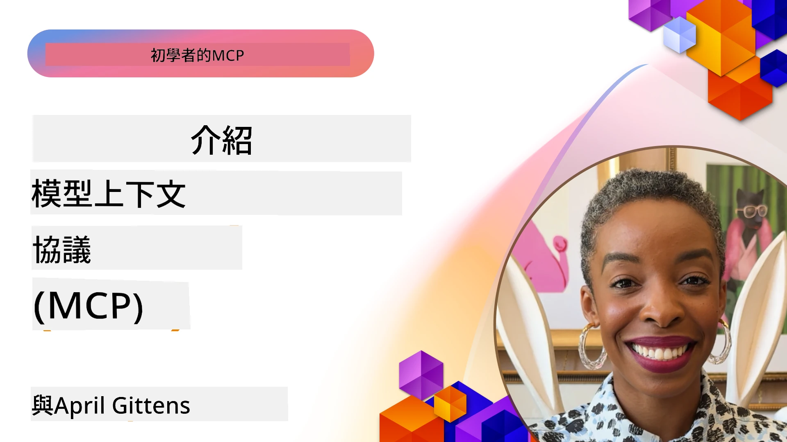
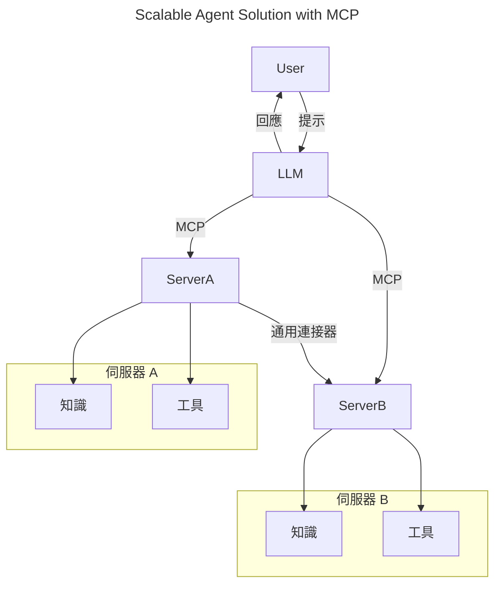
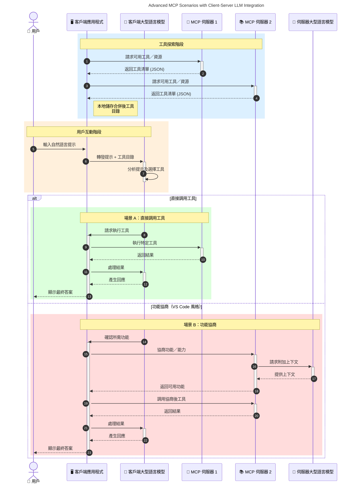

# 模型上下文協議（MCP）入門：為何它對可擴展的 AI 應用程式至關重要

[](https://youtu.be/agBbdiOPLQA)

_(點擊上方圖片觀看本課程影片)_

生成式 AI 應用程式是一大進步，因為它們通常允許使用者用自然語言提示與應用程式互動。然而，當在開發這類應用程式投入更多時間和資源時，你會希望確保可以輕鬆整合功能和資源，使其容易擴展、支援多個模型並處理各種模型細節。簡言之，建立生成式 AI 應用程式起步簡易，但隨著規模增大和愈加複雜，你需要開始定義架構，並且很可能需要依靠標準來確保應用程式能以一致的方式構建。這正是 MCP 的作用：組織各項事務並提供標準。

---

## **🔍 什麼是模型上下文協議（MCP）？**

<strong>模型上下文協議（MCP）</strong>是一個<strong>開放、標準化的介面</strong>，允許大型語言模型（LLMs）無縫地與外部工具、API 和資料源互動。它提供一致的架構，強化 AI 模型功能，使其超越訓練資料，打造更智能、可擴展且更有回應性的 AI 系統。

---

## **🎯 為何 AI 須要標準化**

隨著生成式 AI 應用程式日益複雜，採用標準來確保<strong>可擴展性、可延伸性、可維護性</strong>及<strong>避免供應商鎖定</strong>變得至關重要。MCP 解決了這些需求：

- 統一模型與工具的整合
- 減少脆弱且一次性的自訂解決方案
- 允許來自不同供應商的多種模型共存於同一生態系統

**注意：** 儘管 MCP 自稱為開放標準，但目前並無計劃透過 IEEE、IETF、W3C、ISO 或任何其他標準組織來標準化 MCP。

---

## **📚 學習目標**

閱讀完本文後，你將能夠：

- 定義 **模型上下文協議（MCP）** 及其應用場景
- 瞭解 MCP 如何標準化模型與工具之間的通信
- 識別 MCP 架構的核心組件
- 探索 MCP 在企業及開發環境中的實際應用

---

## **💡 為何模型上下文協議（MCP）是改變遊戲規則的技術**

### **🔗 MCP 解決 AI 互動的碎片化問題**

在 MCP 出現之前，整合模型與工具需要：

- 為每個工具與模型組合撰寫自訂程式碼
- 各供應商使用非標準 API
- 更新時常常導致中斷
- 工具越多，擴展性越差

### **✅ MCP 標準化的好處**

| <strong>好處</strong>                  | <strong>說明</strong>                                                                       |
|--------------------------|--------------------------------------------------------------------------------|
| 互通性                   | LLM 能無縫合作於不同供應商提供的工具                                          |
| 一致性                   | 在平台和工具間行為一致                                                          |
| 可重用性                 | 工具可一次建置，多處使用                                                        |
| 加速開發                 | 使用標準化即插即用介面，減少開發時間                                            |

---

## **🧱 MCP 高階架構概述**

MCP 採用<strong>用戶端-伺服器模型</strong>，其中：

- <strong>MCP 主機</strong>執行 AI 模型
- <strong>MCP 用戶端</strong>發起請求
- <strong>MCP 伺服器</strong>提供上下文、工具及功能

### **主要組件：**

- <strong>資源</strong> – 靜態或動態模型資料  
- <strong>提示</strong> – 預先定義的工作流程用於引導生成  
- <strong>工具</strong> – 可執行函數如搜尋、計算  
- <strong>採樣</strong> – 透過遞迴互動的代理行為（於 MCP `2026-07-28` 廢棄；新實作應直接與 LLM 供應商整合）  


- <strong>引導</strong> – 伺服器主動請求使用者輸入
- <strong>根目錄</strong> – 與伺服器相關的資訊檔案系統位置（於 MCP `2026-07-28` 廢棄；建議使用工具參數、資源 URI 或伺服器配置）


### **協議架構：**

MCP 採用雙層架構：
- <strong>數據層</strong>：JSON-RPC 2.0 訊息、每請求元資料、服務發現和協議原語
- <strong>傳輸層</strong>：本地子程序使用 stdio，遠端伺服器使用可串流 HTTP。可串流 HTTP 可利用 SSE 封包進行串流回應，但舊的 HTTP+SSE 傳輸已被廢棄。


---

## MCP 伺服器的運作方式

MCP 伺服器的運作方式如下：

- <strong>請求流程</strong>：
    1. 請求由最終使用者或代其行動的軟體發起。
    2. **MCP 用戶端** 將請求傳送至管理 AI 模型執行時環境的 **MCP 主機**。
    3. **AI 模型** 接收使用者提示，並可能透過一個或多個工具調用請求存取外部工具或資料。
    4. 非模型直接，而由 **MCP 主機** 使用標準協議與適當的 **MCP 伺服器** 通訊。
- **MCP 主機功能**：
    - <strong>工具註冊表</strong>：維護可用工具及其功能目錄。
    - <strong>驗證</strong>：確認工具存取權限。
    - <strong>請求處理器</strong>：處理模型發出的工具請求。
    - <strong>回應格式化</strong>：將工具輸出結構化為模型可理解格式。
- **MCP 伺服器執行**：
    - **MCP 主機** 將工具呼叫導向一個或多個暴露特化功能（例如搜尋、計算、資料庫查詢）的 **MCP 伺服器**。
    - **MCP 伺服器** 執行對應操作並將結果以一致格式回傳給 **MCP 主機**。
    - **MCP 主機** 整理格式並轉送結果給 **AI 模型**。
- <strong>回應完成</strong>：
    - **AI 模型** 將工具輸入整合成最終回應。
    - **MCP 主機** 將該回應發送回 **MCP 用戶端**，由其傳送至最終使用者或呼叫軟體。
    

```mermaid
---
title: MCP Architecture and Component Interactions
description: A diagram showing the flows of the components in MCP.
---
graph TD
    Client[MCP 客戶端/應用程式] -->|發送請求| H[MCP 主機]
    H -->|調用| A[AI 模型]
    A -->|工具呼叫請求| H
    H -->|MCP Protocol| T1[MCP Server Tool 01: 網絡搜尋
    H -->|MCP Protocol| T2[MCP Server Tool 02: 計算機工具
    H -->|MCP Protocol| T3[MCP Server Tool 03: 資料庫存取工具
    H -->|MCP Protocol| T4[MCP Server Tool 04: 檔案系統工具
    H -->|發送回應| Client

    subgraph 「MCP 主機組件」
        H
        G[工具註冊表]
        I[認證]
        J[請求處理器]
        K[回應格式化器]
    end

    H <--> G
    H <--> I
    H <--> J
    H <--> K

    style A fill:#f9d5e5,stroke:#333,stroke-width:2px
    style H fill:#eeeeee,stroke:#333,stroke-width:2px
    style Client fill:#d5e8f9,stroke:#333,stroke-width:2px
    style G fill:#fffbe6,stroke:#333,stroke-width:1px
    style I fill:#fffbe6,stroke:#333,stroke-width:1px
    style J fill:#fffbe6,stroke:#333,stroke-width:1px
    style K fill:#fffbe6,stroke:#333,stroke-width:1px
    style T1 fill:#c2f0c2,stroke:#333,stroke-width:1px
    style T2 fill:#c2f0c2,stroke:#333,stroke-width:1px
    style T3 fill:#c2f0c2,stroke:#333,stroke-width:1px
    style T4 fill:#c2f0c2,stroke:#333,stroke-width:1px
```

## 👨‍💻 如何建立 MCP 伺服器（附範例）

MCP 伺服器允許你透過提供資料與功能來擴展 LLM 的能力。 

準備好試試嗎？以下是針對不同語言與技術棧的 SDK 及簡易 MCP 伺服器建立範例：

- **Python SDK**: https://github.com/modelcontextprotocol/python-sdk

- **TypeScript SDK**: https://github.com/modelcontextprotocol/typescript-sdk

- **Java SDK**: https://github.com/modelcontextprotocol/java-sdk

- **C#/.NET SDK**: https://github.com/modelcontextprotocol/csharp-sdk


## 🌍 MCP 的實際應用場景

MCP 透過擴展 AI 功能，支持多種應用：

| <strong>應用</strong>                   | <strong>說明</strong>                                                                       |
|------------------------------|--------------------------------------------------------------------------------|
| 企業資料整合               | 將 LLM 連接至資料庫、CRM 或內部工具                                          |
| 代理式 AI 系統             | 為自動代理提供工具存取與決策工作流程                                          |
| 多模態應用                 | 將文字、影像與音訊工具整合於單一統一 AI 應用                                 |
| 即時資料整合               | 將即時數據帶入 AI 互動，產出更準確及最新結果                                  |


### 🧠 MCP = 通用 AI 互動標準

模型上下文協議（MCP）就像 USB-C 為設備提供標準化的物理連接一樣，在 AI 世界中扮演通用標準的角色。MCP 提供一致介面，使模型（用戶端）能無縫與外部工具及資料提供者（伺服器）整合。這避免了針對每個 API 或資料來源開發多樣、專屬的通訊協定。

根據 MCP，兼容 MCP 的工具（稱為 MCP 伺服器）遵循統一標準。這些伺服器能列出其提供的工具或動作，並在 AI 代理請求時執行這些動作。支援 MCP 的 AI 代理平台能夠發現伺服器可用工具，並透過此標準協議調用它們。

### 💡 促進知識獲取

除了提供工具外，MCP 還促進知識存取。它使應用程式能將上下文提供給大型語言模型，將它們連結至各種資料來源。例如，某 MCP 伺服器可能代表公司的文件庫，允許代理按需求檢索相關資訊。另一伺服器可處理特定動作，如發送電子郵件或更新記錄。對代理而言，這些都是可用工具——部分工具返回資料（知識上下文），另一些則執行操作。MCP 有效管理這兩者。

代理連接 MCP 伺服器時，會通過標準格式自動學習伺服器可用能力與可存取資料。此標準化實現動態工具可用性。例如，在代理系統中新增 MCP 伺服器，其功能即刻可用，而無需進一步自訂代理指令。

這種流暢整合符合如下圖所示的流程，伺服器同時提供工具與知識，確保跨系統的無縫協作。

### 👉 範例：可擴展代理解決方案


通用連接器使 MCP 伺服器之間能溝通並共享功能，允許 ServerA 委派任務給 ServerB 或存取其工具與知識。這實現工具與資料在多伺服器間的聯合，支持可擴展且模組化的代理架構。由於 MCP 標準化了工具暴露，代理能動態探索並在伺服器間路由請求，無需硬編碼整合。


工具與知識聯合：工具和資料可跨伺服器存取，支援更具擴展性與模組化的代理式架構。

### 🔄 支援客戶端 LLM 整合的進階 MCP 場景

除基本 MCP 架構外，存在更進階場景，客戶端與伺服器均包含 LLM，允許更複雜的互動。下圖中，<strong>客戶端應用程式</strong>可為集成多個 MCP 工具的 IDE，供 LLM 使用：



## 🔐 MCP 的實務好處

使用 MCP 的實務好處包括：

- <strong>即時性</strong>：模型能存取訓練資料外的最新資訊
- <strong>能力擴展</strong>：模型可利用專門工具完成未訓練的任務
- <strong>減少幻覺</strong>：外部資料源提供事實依據
- <strong>隱私保護</strong>：敏感資料可維持在安全環境，不必內嵌於提示

## 📌 主要重點

使用 MCP 的主要重點如下：

- **MCP** 標準化 AI 模型與工具及資料的互動方式
- 促進<strong>可延伸性、一致性與互通性</strong>
- MCP 有助於<strong>縮短開發時間、提升可靠性並擴展模型能力</strong>
- 用戶端-伺服器架構<strong>支援靈活且可延伸的 AI 應用程式</strong>

## 🧠 練習

想想你有興趣開發的 AI 應用程式。

- 哪些<strong>外部工具或資料</strong>可以增強其功能？
- MCP 如何讓整合變得<strong>更簡單且更可靠</strong>？

## 附加資源

- [MCP GitHub 儲存庫](https://github.com/modelcontextprotocol)


## 下一步

下一篇：[第 1 章：核心概念](../01-CoreConcepts/README.md)

---

<!-- CO-OP TRANSLATOR DISCLAIMER START -->
**免責聲明**：
本文件由 AI 翻譯服務 [Co-op Translator](https://github.com/Azure/co-op-translator) 翻譯而成。雖然我們致力於確保準確性，但請注意，機器自動翻譯可能包含錯誤或不準確之處。原始文件的母語版本應被視為權威來源。對於重要資訊，建議進行專業人工翻譯。我們不對因使用本翻譯而產生的任何誤解或誤釋承擔責任。
<!-- CO-OP TRANSLATOR DISCLAIMER END -->