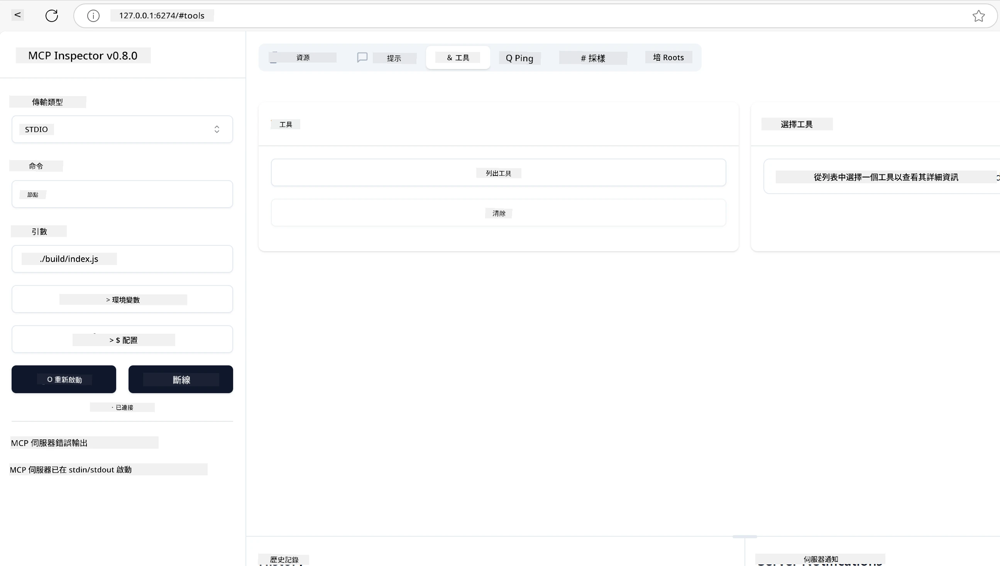
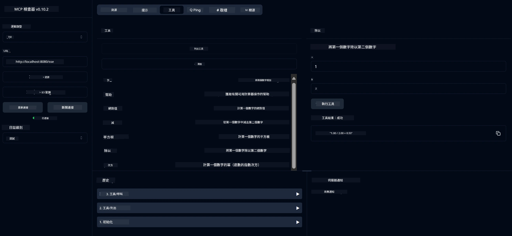
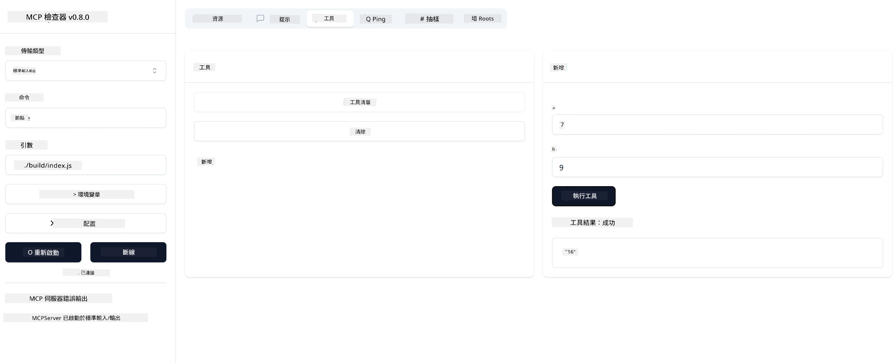

# MCP 入門指南

> [!NOTE]
> 本課程中的 Java HTTP 範例使用舊版 HTTP+SSE 傳輸，並針對與 MCP `2025-11-25` 相容的 SDK。對於新的遠端伺服器，請使用 `2026-07-28` 可串流 HTTP 傳輸，並確認您的 SDK 支援。
>
> 


## 概覽

本課程將實務指導您如何設定 MCP 環境並構建首個 MCP 應用。您將學會如何安裝必要的工具和框架，構建基礎 MCP 伺服器，創建主機應用並測試您的實作。

Model Context Protocol（MCP）是一個開放協定，標準化應用程式如何向大型語言模型提供上下文。可以把 MCP 想像成 AI 應用的 USB-C 埠——它提供一個標準化方式，將 AI 模型連接到不同資料來源和工具。

## 學習目標

完成本課程後，您將能夠：

- 為 C#、Java、Python、TypeScript 及 Rust 設定 MCP 的開發環境
- 建立並部署具有自訂功能（資源、提示與工具）的基本 MCP 伺服器
- 創建與 MCP 伺服器連接的主機應用
- 測試與除錯 MCP 實作

## 設定您的 MCP 環境

在開始 MCP 工作之前，準備開發環境並瞭解基本工作流程非常重要。本節將指導您完成初始設定步驟，確保能順利開始 MCP。

### 前置需求

開始 MCP 開發之前，請確認您已具備：

- <strong>開發環境</strong>：根據您選擇的語言（C#、Java、Python、TypeScript 或 Rust）
- **IDE/編輯器**：Visual Studio、Visual Studio Code、IntelliJ、Eclipse、PyCharm 或任一現代程式編輯器
- <strong>套件管理器</strong>：NuGet、Maven/Gradle、pip、npm/yarn 或 Cargo
- **API 金鑰**：任何您計畫在主機應用中使用的 AI 服務金鑰

## 基本 MCP 伺服器架構

MCP 伺服器通常包含：

- <strong>伺服器設定</strong>：設定連接埠、認證與其他設定
- <strong>資源</strong>：提供給 LLM 使用的資料與上下文
- <strong>工具</strong>：模型可呼叫的功能
- <strong>提示語</strong>：用於生成或結構化文字的範本

以下是 TypeScript 的簡化範例：

```typescript
import { McpServer, ResourceTemplate } from "@modelcontextprotocol/sdk/server/mcp.js";
import { StdioServerTransport } from "@modelcontextprotocol/sdk/server/stdio.js";
import { z } from "zod";

// 建立一個 MCP 伺服器
const server = new McpServer({
  name: "Demo",
  version: "1.0.0"
});

// 新增一個加法工具
server.tool("add",
  { a: z.number(), b: z.number() },
  async ({ a, b }) => ({
    content: [{ type: "text", text: String(a + b) }]
  })
);

// 新增一個動態問候資源
server.resource(
  "file",
  // 'list' 參數控制資源如何列出可用檔案。設定為 undefined 則禁止此資源的列出功能。
  new ResourceTemplate("file://{path}", { list: undefined }),
  async (uri, { path }) => ({
    contents: [{
      uri: uri.href,
      text: `File, ${path}!`
    }]
  })
);

// 新增一個讀取檔案內容的檔案資源
server.resource(
  "file",
  new ResourceTemplate("file://{path}", { list: undefined }),
  async (uri, { path }) => {
    let text;
    try {
      text = await fs.readFile(path, "utf8");
    } catch (err) {
      text = `Error reading file: ${err.message}`;
    }
    return {
      contents: [{
        uri: uri.href,
        text
      }]
    };
  }
);

server.prompt(
  "review-code",
  { code: z.string() },
  ({ code }) => ({
    messages: [{
      role: "user",
      content: {
        type: "text",
        text: `Please review this code:\n\n${code}`
      }
    }]
  })
);

// 開始從 stdin 接收訊息及向 stdout 發送訊息
const transport = new StdioServerTransport();
await server.connect(transport);
```

上述程式碼中，我們：

- 從 MCP TypeScript SDK 匯入必要類別。
- 創建並設定新的 MCP 伺服器實例。
- 註冊自訂工具（`calculator`）並設定處理函數。
- 啟動伺服器監聽傳入的 MCP 請求。

## 測試與除錯

在開始測試 MCP 伺服器前，理解可用工具及除錯最佳實踐非常重要。有效測試可確保伺服器行為符合預期，並協助您快速找出與解決問題。以下章節列出建議的 MCP 驗證方法。

MCP 提供多種工具幫助您測試與除錯伺服器：

- **Inspector 工具**，此圖形介面允許您連接至伺服器，測試工具、提示與資源。
- **curl**，您也可以使用 curl 或其他可執行 HTTP 命令的客戶端命令列工具連接至伺服器。

### 使用 MCP Inspector

[MCP Inspector](https://github.com/modelcontextprotocol/inspector) 是一個視覺化測試工具，可幫助您：

1. <strong>探索伺服器功能</strong>：自動偵測可用資源、工具與提示語
2. <strong>測試工具執行</strong>：嘗試不同參數並即時查看回應
3. <strong>檢視伺服器元資料</strong>：查看伺服器資訊、結構與設定

```bash
# 例如 TypeScript，安裝及運行 MCP Inspector
npx @modelcontextprotocol/inspector node build/index.js
```

執行上述命令後，MCP Inspector 將在瀏覽器啟動本地網頁介面。您可看到顯示已註冊 MCP 伺服器、其可用工具、資源和提示的儀表板。該介面支持互動測試工具執行、檢視伺服器元資料及即時回應，方便您驗證和除錯 MCP 伺服器實作。

以下是介面截圖示意：



## 常見設定問題與解決方案

| 問題 | 可能解決方法 |
|------|--------------|
| 連線被拒絕 | 確認伺服器是否運行且埠口正確 |
| 工具執行錯誤 | 檢查參數驗證與錯誤處理 |
| 認證失敗 | 驗證 API 金鑰與權限 |
| 結構驗證錯誤 | 確保參數符合定義結構 |
| 伺服器無法啟動 | 檢查埠口衝突或缺少相依性 |
| CORS 錯誤 | 設定正確的 CORS 標頭以允許跨源請求 |
| 認證問題 | 驗證權杖的有效性與權限 |

## 本地開發

對於本地開發和測試，您可以直接在電腦上執行 MCP 伺服器：

1. <strong>啟動伺服器程式</strong>：執行 MCP 伺服器應用程式
2. <strong>設定網路</strong>：確保伺服器在預期埠口可訪問
3. <strong>連接用戶端</strong>：使用 `http://localhost:3000` 類型的本地連結網址

```bash
# 範例：在本地運行 TypeScript MCP 伺服器
npm run start
# 伺服器運行於 http://localhost:3000
```

## 建立您的首個 MCP 伺服器

我們在先前課程中已介紹[核心概念](../../01-CoreConcepts/README.md)，現在開始應用所學知識。

### 伺服器能做什麼

在動手寫程式碼前，先來回顧伺服器能做的事情：

MCP 伺服器可以：

- 存取本地檔案和資料庫
- 連接遠端 API
- 進行運算
- 整合其他工具與服務
- 提供使用者介面供互動

很好，既然知道它可以做什麼，就開始寫程式吧。

## 練習：建立伺服器

建立伺服器需要遵循以下步驟：

- 安裝 MCP SDK。
- 建立專案並設定專案結構。
- 編寫伺服器程式碼。
- 測試伺服器。

### -1- 建立專案

#### TypeScript

```sh
# 建立項目目錄並初始化 npm 項目
mkdir calculator-server
cd calculator-server
npm init -y
```

#### Python

```sh
# 建立項目資料夾
mkdir calculator-server
cd calculator-server
# 在 Visual Studio Code 開啟該資料夾 - 如果你使用其他 IDE，請跳過此步驟
code .
```

#### .NET

```sh
dotnet new console -n McpCalculatorServer
cd McpCalculatorServer
```

#### Java

Java 使用 Spring Boot 建立專案：

```bash
curl https://start.spring.io/starter.zip \
  -d dependencies=web \
  -d javaVersion=21 \
  -d type=maven-project \
  -d groupId=com.example \
  -d artifactId=calculator-server \
  -d name=McpServer \
  -d packageName=com.microsoft.mcp.sample.server \
  -o calculator-server.zip
```

解壓縮 zip 檔案：

```bash
unzip calculator-server.zip -d calculator-server
cd calculator-server
# 可選擇移除未使用的測試
rm -rf src/test/java
```

將以下完整設定加入您的 *pom.xml* 檔案：

```xml
<?xml version="1.0" encoding="UTF-8"?>
<project xmlns="http://maven.apache.org/POM/4.0.0"
    xmlns:xsi="http://www.w3.org/2001/XMLSchema-instance"
    xsi:schemaLocation="http://maven.apache.org/POM/4.0.0 http://maven.apache.org/xsd/maven-4.0.0.xsd">
    <modelVersion>4.0.0</modelVersion>
    
    <!-- Spring Boot parent for dependency management -->
    <parent>
        <groupId>org.springframework.boot</groupId>
        <artifactId>spring-boot-starter-parent</artifactId>
        <version>3.5.0</version>
        <relativePath />
    </parent>

    <!-- Project coordinates -->
    <groupId>com.example</groupId>
    <artifactId>calculator-server</artifactId>
    <version>0.0.1-SNAPSHOT</version>
    <name>Calculator Server</name>
    <description>Basic calculator MCP service for beginners</description>

    <!-- Properties -->
    <properties>
        <java.version>21</java.version>
        <maven.compiler.source>21</maven.compiler.source>
        <maven.compiler.target>21</maven.compiler.target>
    </properties>

    <!-- Spring AI BOM for version management -->
    <dependencyManagement>
        <dependencies>
            <dependency>
                <groupId>org.springframework.ai</groupId>
                <artifactId>spring-ai-bom</artifactId>
                <version>1.0.0-SNAPSHOT</version>
                <type>pom</type>
                <scope>import</scope>
            </dependency>
        </dependencies>
    </dependencyManagement>

    <!-- Dependencies -->
    <dependencies>
        <dependency>
            <groupId>org.springframework.ai</groupId>
            <artifactId>spring-ai-starter-mcp-server-webflux</artifactId>
        </dependency>
        <dependency>
            <groupId>org.springframework.boot</groupId>
            <artifactId>spring-boot-starter-actuator</artifactId>
        </dependency>
        <dependency>
         <groupId>org.springframework.boot</groupId>
         <artifactId>spring-boot-starter-test</artifactId>
         <scope>test</scope>
      </dependency>
    </dependencies>

    <!-- Build configuration -->
    <build>
        <plugins>
            <plugin>
                <groupId>org.springframework.boot</groupId>
                <artifactId>spring-boot-maven-plugin</artifactId>
            </plugin>
            <plugin>
                <groupId>org.apache.maven.plugins</groupId>
                <artifactId>maven-compiler-plugin</artifactId>
                <configuration>
                    <release>21</release>
                </configuration>
            </plugin>
        </plugins>
    </build>

    <!-- Repositories for Spring AI snapshots -->
    <repositories>
        <repository>
            <id>spring-milestones</id>
            <name>Spring Milestones</name>
            <url>https://repo.spring.io/milestone</url>
            <snapshots>
                <enabled>false</enabled>
            </snapshots>
        </repository>
        <repository>
            <id>spring-snapshots</id>
            <name>Spring Snapshots</name>
            <url>https://repo.spring.io/snapshot</url>
            <releases>
                <enabled>false</enabled>
            </releases>
        </repository>
    </repositories>
</project>
```

#### Rust

```sh
mkdir calculator-server
cd calculator-server
cargo init
```

### -2- 加入相依套件

專案建立完成後，接著加入相依套件：

#### TypeScript

```sh
# 如果尚未安裝，請全局安裝 TypeScript
npm install typescript -g

# 安裝 MCP SDK 和 Zod 進行 schema 驗證
npm install @modelcontextprotocol/sdk zod
npm install -D @types/node typescript
```

#### Python

```sh
# 創建虛擬環境並安裝依賴項
python -m venv venv
venv\Scripts\activate
pip install "mcp[cli]"
```

#### Java

```bash
cd calculator-server
./mvnw clean install -DskipTests
```

#### Rust

```sh
cargo add rmcp --features server,transport-io
cargo add serde
cargo add tokio --features rt-multi-thread
```

### -3- 創建專案檔案

#### TypeScript

打開 *package.json* 檔案，將內容替換為以下內容，確保能成功建置與執行伺服器：

```json
{
  "name": "calculator-server",
  "version": "1.0.0",
  "main": "index.js",
  "type": "module",
  "scripts": {
    "build": "tsc",
    "start": "npm run build && node ./build/index.js",
  },
  "keywords": [],
  "author": "",
  "license": "ISC",
  "description": "A simple calculator server using Model Context Protocol",
  "dependencies": {
    "@modelcontextprotocol/sdk": "^1.16.0",
    "zod": "^3.25.76"
  },
  "devDependencies": {
    "@types/node": "^24.0.14",
    "typescript": "^5.8.3"
  }
}
```

建立 *tsconfig.json*，內容如下：

```json
{
  "compilerOptions": {
    "target": "ES2022",
    "module": "Node16",
    "moduleResolution": "Node16",
    "outDir": "./build",
    "rootDir": "./src",
    "strict": true,
    "esModuleInterop": true,
    "skipLibCheck": true,
    "forceConsistentCasingInFileNames": true
  },
  "include": ["src/**/*"],
  "exclude": ["node_modules"]
}
```

建立一個目錄來存放您的原始碼：

```sh
mkdir src
touch src/index.ts
```

#### Python

建立檔案 *server.py*

```sh
touch server.py
```

#### .NET

安裝所需的 NuGet 套件：

```sh
dotnet add package ModelContextProtocol --prerelease
dotnet add package Microsoft.Extensions.Hosting
```

#### Java

Java Spring Boot 專案的結構會自動建立。

#### Rust

Rust 使用 `cargo init` 命令時會預設建立 *src/main.rs*，打開該檔案並刪除預設程式碼。

### -4- 撰寫伺服器程式碼

#### TypeScript

建立 *index.ts* 檔案並新增以下程式碼：

```typescript
import { McpServer, ResourceTemplate } from "@modelcontextprotocol/sdk/server/mcp.js";
import { StdioServerTransport } from "@modelcontextprotocol/sdk/server/stdio.js";
import { z } from "zod";
 
// 建立一個 MCP 伺服器
const server = new McpServer({
  name: "Calculator MCP Server",
  version: "1.0.0"
});
```

現在您有一個伺服器了，但它還很簡單，我們來加強它。

#### Python

```python
# server.py
from mcp.server.fastmcp import FastMCP

# 建立一個 MCP 伺服器
mcp = FastMCP("Demo")
```

#### .NET

```csharp
using Microsoft.Extensions.DependencyInjection;
using Microsoft.Extensions.Hosting;
using Microsoft.Extensions.Logging;
using ModelContextProtocol.Server;
using System.ComponentModel;

var builder = Host.CreateApplicationBuilder(args);
builder.Logging.AddConsole(consoleLogOptions =>
{
    // Configure all logs to go to stderr
    consoleLogOptions.LogToStandardErrorThreshold = LogLevel.Trace;
});

builder.Services
    .AddMcpServer()
    .WithStdioServerTransport()
    .WithToolsFromAssembly();
await builder.Build().RunAsync();

// add features
```

#### Java

為 Java 建立核心伺服器組件。首先修改主要應用類別：

*src/main/java/com/microsoft/mcp/sample/server/McpServerApplication.java*：

```java
package com.microsoft.mcp.sample.server;

import org.springframework.ai.tool.ToolCallbackProvider;
import org.springframework.ai.tool.method.MethodToolCallbackProvider;
import org.springframework.boot.SpringApplication;
import org.springframework.boot.autoconfigure.SpringBootApplication;
import org.springframework.context.annotation.Bean;
import com.microsoft.mcp.sample.server.service.CalculatorService;

@SpringBootApplication
public class McpServerApplication {

    public static void main(String[] args) {
        SpringApplication.run(McpServerApplication.class, args);
    }
    
    @Bean
    public ToolCallbackProvider calculatorTools(CalculatorService calculator) {
        return MethodToolCallbackProvider.builder().toolObjects(calculator).build();
    }
}
```

建立計算器服務 *src/main/java/com/microsoft/mcp/sample/server/service/CalculatorService.java*：

```java
package com.microsoft.mcp.sample.server.service;

import org.springframework.ai.tool.annotation.Tool;
import org.springframework.stereotype.Service;

/**
 * Service for basic calculator operations.
 * This service provides simple calculator functionality through MCP.
 */
@Service
public class CalculatorService {

    /**
     * Add two numbers
     * @param a The first number
     * @param b The second number
     * @return The sum of the two numbers
     */
    @Tool(description = "Add two numbers together")
    public String add(double a, double b) {
        double result = a + b;
        return formatResult(a, "+", b, result);
    }

    /**
     * Subtract one number from another
     * @param a The number to subtract from
     * @param b The number to subtract
     * @return The result of the subtraction
     */
    @Tool(description = "Subtract the second number from the first number")
    public String subtract(double a, double b) {
        double result = a - b;
        return formatResult(a, "-", b, result);
    }

    /**
     * Multiply two numbers
     * @param a The first number
     * @param b The second number
     * @return The product of the two numbers
     */
    @Tool(description = "Multiply two numbers together")
    public String multiply(double a, double b) {
        double result = a * b;
        return formatResult(a, "*", b, result);
    }

    /**
     * Divide one number by another
     * @param a The numerator
     * @param b The denominator
     * @return The result of the division
     */
    @Tool(description = "Divide the first number by the second number")
    public String divide(double a, double b) {
        if (b == 0) {
            return "Error: Cannot divide by zero";
        }
        double result = a / b;
        return formatResult(a, "/", b, result);
    }

    /**
     * Calculate the power of a number
     * @param base The base number
     * @param exponent The exponent
     * @return The result of raising the base to the exponent
     */
    @Tool(description = "Calculate the power of a number (base raised to an exponent)")
    public String power(double base, double exponent) {
        double result = Math.pow(base, exponent);
        return formatResult(base, "^", exponent, result);
    }

    /**
     * Calculate the square root of a number
     * @param number The number to find the square root of
     * @return The square root of the number
     */
    @Tool(description = "Calculate the square root of a number")
    public String squareRoot(double number) {
        if (number < 0) {
            return "Error: Cannot calculate square root of a negative number";
        }
        double result = Math.sqrt(number);
        return String.format("√%.2f = %.2f", number, result);
    }

    /**
     * Calculate the modulus (remainder) of division
     * @param a The dividend
     * @param b The divisor
     * @return The remainder of the division
     */
    @Tool(description = "Calculate the remainder when one number is divided by another")
    public String modulus(double a, double b) {
        if (b == 0) {
            return "Error: Cannot divide by zero";
        }
        double result = a % b;
        return formatResult(a, "%", b, result);
    }

    /**
     * Calculate the absolute value of a number
     * @param number The number to find the absolute value of
     * @return The absolute value of the number
     */
    @Tool(description = "Calculate the absolute value of a number")
    public String absolute(double number) {
        double result = Math.abs(number);
        return String.format("|%.2f| = %.2f", number, result);
    }

    /**
     * Get help about available calculator operations
     * @return Information about available operations
     */
    @Tool(description = "Get help about available calculator operations")
    public String help() {
        return "Basic Calculator MCP Service\n\n" +
               "Available operations:\n" +
               "1. add(a, b) - Adds two numbers\n" +
               "2. subtract(a, b) - Subtracts the second number from the first\n" +
               "3. multiply(a, b) - Multiplies two numbers\n" +
               "4. divide(a, b) - Divides the first number by the second\n" +
               "5. power(base, exponent) - Raises a number to a power\n" +
               "6. squareRoot(number) - Calculates the square root\n" + 
               "7. modulus(a, b) - Calculates the remainder of division\n" +
               "8. absolute(number) - Calculates the absolute value\n\n" +
               "Example usage: add(5, 3) will return 5 + 3 = 8";
    }

    /**
     * Format the result of a calculation
     */
    private String formatResult(double a, String operator, double b, double result) {
        return String.format("%.2f %s %.2f = %.2f", a, operator, b, result);
    }
}
```

**生產環境服務的可選組件：**

建立啟動設定 *src/main/java/com/microsoft/mcp/sample/server/config/StartupConfig.java*：

```java
package com.microsoft.mcp.sample.server.config;

import org.springframework.boot.CommandLineRunner;
import org.springframework.context.annotation.Bean;
import org.springframework.context.annotation.Configuration;

@Configuration
public class StartupConfig {
    
    @Bean
    public CommandLineRunner startupInfo() {
        return args -> {
            System.out.println("\n" + "=".repeat(60));
            System.out.println("Calculator MCP Server is starting...");
            System.out.println("SSE endpoint: http://localhost:8080/sse");
            System.out.println("Health check: http://localhost:8080/actuator/health");
            System.out.println("=".repeat(60) + "\n");
        };
    }
}
```

建立健康檢查控制器 *src/main/java/com/microsoft/mcp/sample/server/controller/HealthController.java*：

```java
package com.microsoft.mcp.sample.server.controller;

import org.springframework.http.ResponseEntity;
import org.springframework.web.bind.annotation.GetMapping;
import org.springframework.web.bind.annotation.RestController;
import java.time.LocalDateTime;
import java.util.HashMap;
import java.util.Map;

@RestController
public class HealthController {
    
    @GetMapping("/health")
    public ResponseEntity<Map<String, Object>> healthCheck() {
        Map<String, Object> response = new HashMap<>();
        response.put("status", "UP");
        response.put("timestamp", LocalDateTime.now().toString());
        response.put("service", "Calculator MCP Server");
        return ResponseEntity.ok(response);
    }
}
```

建立例外處理器 *src/main/java/com/microsoft/mcp/sample/server/exception/GlobalExceptionHandler.java*：

```java
package com.microsoft.mcp.sample.server.exception;

import org.springframework.http.HttpStatus;
import org.springframework.http.ResponseEntity;
import org.springframework.web.bind.annotation.ExceptionHandler;
import org.springframework.web.bind.annotation.RestControllerAdvice;

@RestControllerAdvice
public class GlobalExceptionHandler {

    @ExceptionHandler(IllegalArgumentException.class)
    public ResponseEntity<ErrorResponse> handleIllegalArgumentException(IllegalArgumentException ex) {
        ErrorResponse error = new ErrorResponse(
            "Invalid_Input", 
            "Invalid input parameter: " + ex.getMessage());
        return new ResponseEntity<>(error, HttpStatus.BAD_REQUEST);
    }

    public static class ErrorResponse {
        private String code;
        private String message;

        public ErrorResponse(String code, String message) {
            this.code = code;
            this.message = message;
        }

        // 取值器
        public String getCode() { return code; }
        public String getMessage() { return message; }
    }
}
```

建立自訂開機橫幅 *src/main/resources/banner.txt*：

```text
_____      _            _       _             
 / ____|    | |          | |     | |            
| |     __ _| | ___ _   _| | __ _| |_ ___  _ __ 
| |    / _` | |/ __| | | | |/ _` | __/ _ \| '__|
| |___| (_| | | (__| |_| | | (_| | || (_) | |   
 \_____\__,_|_|\___|\__,_|_|\__,_|\__\___/|_|   
                                                
Calculator MCP Server v1.0
Spring Boot MCP Application
```

</details>

#### Rust

在 *src/main.rs* 頂部加入以下程式碼，匯入 MCP 伺服器需要的函式庫與模組。

```rust
use rmcp::{
    handler::server::{router::tool::ToolRouter, tool::Parameters},
    model::{ServerCapabilities, ServerInfo},
    schemars, tool, tool_handler, tool_router,
    transport::stdio,
    ServerHandler, ServiceExt,
};
use std::error::Error;
```

計算器伺服器將會是一個簡單可以加總兩個數字的伺服器，先建立一個結構體表示計算器請求。

```rust
#[derive(Debug, serde::Deserialize, schemars::JsonSchema)]
pub struct CalculatorRequest {
    pub a: f64,
    pub b: f64,
}
```

接著建立一個結構體代表計算器伺服器，用來保存工具路由器（用於註冊工具）。

```rust
#[derive(Debug, Clone)]
pub struct Calculator {
    tool_router: ToolRouter<Self>,
}
```

接著實作 `Calculator` 結構體，建立新的伺服器實例並實作伺服器處理程序以提供伺服器資訊。

```rust
#[tool_router]
impl Calculator {
    pub fn new() -> Self {
        Self {
            tool_router: Self::tool_router(),
        }
    }
}

#[tool_handler]
impl ServerHandler for Calculator {
    fn get_info(&self) -> ServerInfo {
        ServerInfo {
            instructions: Some("A simple calculator tool".into()),
            capabilities: ServerCapabilities::builder().enable_tools().build(),
            ..Default::default()
        }
    }
}
```

最後實作主函式啟動伺服器。此功能會建立 `Calculator` 實例，並透過標準輸入/輸出對外提供服務。

```rust
#[tokio::main]
async fn main() -> Result<(), Box<dyn Error>> {
    let service = Calculator::new().serve(stdio()).await?;
    service.waiting().await?;
    Ok(())
}
```

伺服器現已可以提供基本資訊，接著我們會加入一個執行加法的工具。

### -5- 新增工具與資源

新增工具和資源可以參考以下程式碼：

#### TypeScript

```typescript
server.tool(
  "add",
  { a: z.number(), b: z.number() },
  async ({ a, b }) => ({
    content: [{ type: "text", text: String(a + b) }]
  })
);

server.resource(
  "greeting",
  new ResourceTemplate("greeting://{name}", { list: undefined }),
  async (uri, { name }) => ({
    contents: [{
      uri: uri.href,
      text: `Hello, ${name}!`
    }]
  })
);
```

您的工具接受參數 `a` 與 `b`，並執行產生以下形式回應的函式：

```typescript
{
  contents: [{
    type: "text", content: "some content"
  }]
}
```

您的資源以字串「greeting」存取，接受參數 `name`，回傳形式類似工具呼叫：

```typescript
{
  uri: "<href>",
  text: "a text"
}
```

#### Python

```python
# 新增一個加法工具
@mcp.tool()
def add(a: int, b: int) -> int:
    """Add two numbers"""
    return a + b


# 新增一個動態問候資源
@mcp.resource("greeting://{name}")
def get_greeting(name: str) -> str:
    """Get a personalized greeting"""
    return f"Hello, {name}!"
```

在上述程式碼中，我們：

- 定義了一個名為 `add` 的工具，接受兩個整數參數 `a` 和 `b`。
- 創建了一個名為 `greeting` 的資源，接受參數 `name`。

#### .NET

將以下程式碼加入您的 Program.cs 文件：

```csharp
[McpServerToolType]
public static class CalculatorTool
{
    [McpServerTool, Description("Adds two numbers")]
    public static string Add(int a, int b) => $"Sum {a + b}";
}
```

#### Java

工具已在先前步驟中建立。

#### Rust

在 `impl Calculator` 區塊中新加一個工具：

```rust
#[tool(description = "Adds a and b")]
async fn add(
    &self,
    Parameters(CalculatorRequest { a, b }): Parameters<CalculatorRequest>,
) -> String {
    (a + b).to_string()
}
```

### -6- 最終程式碼

讓我們加上啟動伺服器需要的最後程式碼：

#### TypeScript

```typescript
// 開始從標準輸入接收訊息並向標準輸出發送訊息
const transport = new StdioServerTransport();
await server.connect(transport);
```

完整程式碼如下：

```typescript
// index.ts
import { McpServer, ResourceTemplate } from "@modelcontextprotocol/sdk/server/mcp.js";
import { StdioServerTransport } from "@modelcontextprotocol/sdk/server/stdio.js";
import { z } from "zod";

// 建立 MCP 伺服器
const server = new McpServer({
  name: "Calculator MCP Server",
  version: "1.0.0"
});

// 新增加法工具
server.tool(
  "add",
  { a: z.number(), b: z.number() },
  async ({ a, b }) => ({
    content: [{ type: "text", text: String(a + b) }]
  })
);

// 新增動態問候語資源
server.resource(
  "greeting",
  new ResourceTemplate("greeting://{name}", { list: undefined }),
  async (uri, { name }) => ({
    contents: [{
      uri: uri.href,
      text: `Hello, ${name}!`
    }]
  })
);

// 開始從 stdin 接收訊息及向 stdout 發送訊息
const transport = new StdioServerTransport();
server.connect(transport);
```

#### Python

```python
# server.py
from mcp.server.fastmcp import FastMCP

# 建立一個 MCP 伺服器
mcp = FastMCP("Demo")


# 新增一個加法工具
@mcp.tool()
def add(a: int, b: int) -> int:
    """Add two numbers"""
    return a + b


# 新增一個動態問候資源
@mcp.resource("greeting://{name}")
def get_greeting(name: str) -> str:
    """Get a personalized greeting"""
    return f"Hello, {name}!"

# 主執行區塊 - 這是運行伺服器所必需的
if __name__ == "__main__":
    mcp.run()
```

#### .NET

建立 Program.cs，內容如下：

```csharp
using Microsoft.Extensions.DependencyInjection;
using Microsoft.Extensions.Hosting;
using Microsoft.Extensions.Logging;
using ModelContextProtocol.Server;
using System.ComponentModel;

var builder = Host.CreateApplicationBuilder(args);
builder.Logging.AddConsole(consoleLogOptions =>
{
    // Configure all logs to go to stderr
    consoleLogOptions.LogToStandardErrorThreshold = LogLevel.Trace;
});

builder.Services
    .AddMcpServer()
    .WithStdioServerTransport()
    .WithToolsFromAssembly();
await builder.Build().RunAsync();

[McpServerToolType]
public static class CalculatorTool
{
    [McpServerTool, Description("Adds two numbers")]
    public static string Add(int a, int b) => $"Sum {a + b}";
}
```

#### Java

您的完整主應用類別應該長這樣：

```java
// McpServerApplication.java
package com.microsoft.mcp.sample.server;

import org.springframework.ai.tool.ToolCallbackProvider;
import org.springframework.ai.tool.method.MethodToolCallbackProvider;
import org.springframework.boot.SpringApplication;
import org.springframework.boot.autoconfigure.SpringBootApplication;
import org.springframework.context.annotation.Bean;
import com.microsoft.mcp.sample.server.service.CalculatorService;

@SpringBootApplication
public class McpServerApplication {

    public static void main(String[] args) {
        SpringApplication.run(McpServerApplication.class, args);
    }
    
    @Bean
    public ToolCallbackProvider calculatorTools(CalculatorService calculator) {
        return MethodToolCallbackProvider.builder().toolObjects(calculator).build();
    }
}
```

#### Rust

Rust 伺服器的最終程式碼應如下：

```rust
use rmcp::{
    ServerHandler, ServiceExt,
    handler::server::{router::tool::ToolRouter, tool::Parameters},
    model::{ServerCapabilities, ServerInfo},
    schemars, tool, tool_handler, tool_router,
    transport::stdio,
};
use std::error::Error;

#[derive(Debug, serde::Deserialize, schemars::JsonSchema)]
pub struct CalculatorRequest {
    pub a: f64,
    pub b: f64,
}

#[derive(Debug, Clone)]
pub struct Calculator {
    tool_router: ToolRouter<Self>,
}

#[tool_router]
impl Calculator {
    pub fn new() -> Self {
        Self {
            tool_router: Self::tool_router(),
        }
    }
    
    #[tool(description = "Adds a and b")]
    async fn add(
        &self,
        Parameters(CalculatorRequest { a, b }): Parameters<CalculatorRequest>,
    ) -> String {
        (a + b).to_string()
    }
}

#[tool_handler]
impl ServerHandler for Calculator {
    fn get_info(&self) -> ServerInfo {
        ServerInfo {
            instructions: Some("A simple calculator tool".into()),
            capabilities: ServerCapabilities::builder().enable_tools().build(),
            ..Default::default()
        }
    }
}

#[tokio::main]
async fn main() -> Result<(), Box<dyn Error>> {
    let service = Calculator::new().serve(stdio()).await?;
    service.waiting().await?;
    Ok(())
}
```

### -7- 測試伺服器

使用以下命令啟動伺服器：

#### TypeScript

```sh
npm run build
```

#### Python

```sh
mcp run server.py
```

> 使用 MCP Inspector，請使用 `mcp dev server.py`，系統會自動啟動 Inspector 並提供所需代理會話權杖；如果用 `mcp run server.py`，則須手動啟動 Inspector 並設定連線。

#### .NET

請確認您位於專案目錄中：

```sh
cd McpCalculatorServer
dotnet run
```

#### Java

```bash
./mvnw clean install -DskipTests
java -jar target/calculator-server-0.0.1-SNAPSHOT.jar
```

#### Rust

執行以下命令來格式化及運行伺服器：

```sh
cargo fmt
cargo run
```

### -8- 使用 Inspector 運行

Inspector 是個很棒的工具，能啟動您的伺服器，並讓您與它互動以確認功能正常。讓我們啟動它：

> [!NOTE]
> 「命令」欄位中的內容可能會不同，因為它包含您環境中使用的運行命令。

#### TypeScript

```sh
npx @modelcontextprotocol/inspector node build/index.js
```

或將其加入 *package.json* 如下：`"inspector": "npx @modelcontextprotocol/inspector node build/index.js"`，接著執行 `npm run inspector`

#### Python

Python 封裝了一個 Node.js 工具 inspector，可透過以下指令調用：

```sh
mcp dev server.py
```


不過，它並沒有實現工具上所有可用的方法，因此建議直接像下面這樣運行 Node.js 工具：

```sh
npx @modelcontextprotocol/inspector mcp run server.py
```

如果你使用的工具或 IDE 允許你配置執行腳本的命令和參數，
請確保在「Command」欄位設為 `python`，並將 `server.py` 設為「Arguments」。這樣確保腳本能正確執行。

#### .NET

請確保你位於你的專案目錄中：

```sh
cd McpCalculatorServer
npx @modelcontextprotocol/inspector dotnet run
```

#### Java

確保你的計算器伺服器正在運行
然後執行檢查工具：

```cmd
npx @modelcontextprotocol/inspector
```

在檢查工具的網頁介面中：

1. 選擇 "SSE" 作為傳輸類型
2. 將 URL 設為：`http://localhost:8080/sse`
3. 點擊「Connect」



<strong>你已經成功連接至伺服器</strong>
**Java 伺服器測試部分現在完成**

接下來的部分是與伺服器互動。

你應該會看到以下的用戶介面：


1. 點選連接按鈕連接伺服器
  連接成功後，你會看到以下畫面：

  

1. 選擇「Tools」和「listTools」，應會看到「Add」出現，點選「Add」並填寫參數值。

  你應該會看到以下回應，也就是「add」工具的結果：

  

恭喜，你成功建立並執行了你的第一個伺服器！

#### Rust

使用 MCP Inspector CLI 執行 Rust 伺服器的指令如下：

```sh
npx @modelcontextprotocol/inspector cargo run --cli --method tools/call --tool-name add --tool-arg a=1 b=2
```

### 官方 SDK

MCP 提供多種語言的官方 SDK：

- [C# SDK](https://github.com/modelcontextprotocol/csharp-sdk) - 與 Microsoft 合作維護
- [Java SDK](https://github.com/modelcontextprotocol/java-sdk) - 與 Spring AI 合作維護
- [TypeScript SDK](https://github.com/modelcontextprotocol/typescript-sdk) - 官方 TypeScript 實作
- [Python SDK](https://github.com/modelcontextprotocol/python-sdk) - 官方 Python 實作
- [Kotlin SDK](https://github.com/modelcontextprotocol/kotlin-sdk) - 官方 Kotlin 實作
- [Swift SDK](https://github.com/modelcontextprotocol/swift-sdk) - 與 Loopwork AI 合作維護
- [Rust SDK](https://github.com/modelcontextprotocol/rust-sdk) - 官方 Rust 實作

## 重要重點

- 使用特定語言的 SDK，設定 MCP 開發環境非常簡單
- 建立 MCP 伺服器需撰寫並註冊具明確 schema 的工具
- 測試與除錯對於可靠的 MCP 實作非常重要

## 範例

- [Java 計算器](../samples/java/calculator/README.md)
- [.NET 計算器](../../../../03-GettingStarted/samples/csharp)
- [JavaScript 計算器](../samples/javascript/README.md)
- [TypeScript 計算器](../samples/typescript/README.md)
- [Python 計算器](../../../../03-GettingStarted/samples/python)
- [Rust 計算器](../../../../03-GettingStarted/samples/rust)

## 作業

使用你選擇的工具建立一個簡單的 MCP 伺服器：

1. 使用你的偏好語言 (.NET、Java、Python、TypeScript 或 Rust) 實作此工具。
2. 定義輸入參數和返回值。
3. 執行檢查工具，確保伺服器能正常運行。
4. 使用不同輸入測試實作結果。

## 解答

[解答](./solution/README.md)

## 附加資源

- [在 Azure 上使用 Model Context Protocol 建立代理](https://learn.microsoft.com/azure/developer/ai/intro-agents-mcp)
- [使用 Azure Container Apps 遠端運行 MCP (Node.js/TypeScript/JavaScript)](https://learn.microsoft.com/samples/azure-samples/mcp-container-ts/mcp-container-ts/)
- [.NET OpenAI MCP 代理](https://learn.microsoft.com/samples/azure-samples/openai-mcp-agent-dotnet/openai-mcp-agent-dotnet/)

## 下一步

下一步：[MCP 客戶端入門](../02-client/README.md)

---

<!-- CO-OP TRANSLATOR DISCLAIMER START -->
**免責聲明**：
本文件由 AI 翻譯服務 [Co-op Translator](https://github.com/Azure/co-op-translator) 翻譯而成。雖然我們致力於確保準確性，但請注意，機器自動翻譯可能包含錯誤或不準確之處。原始文件的母語版本應被視為權威來源。對於重要資訊，建議進行專業人工翻譯。我們不對因使用本翻譯而產生的任何誤解或誤釋承擔責任。
<!-- CO-OP TRANSLATOR DISCLAIMER END -->