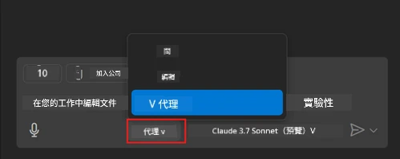
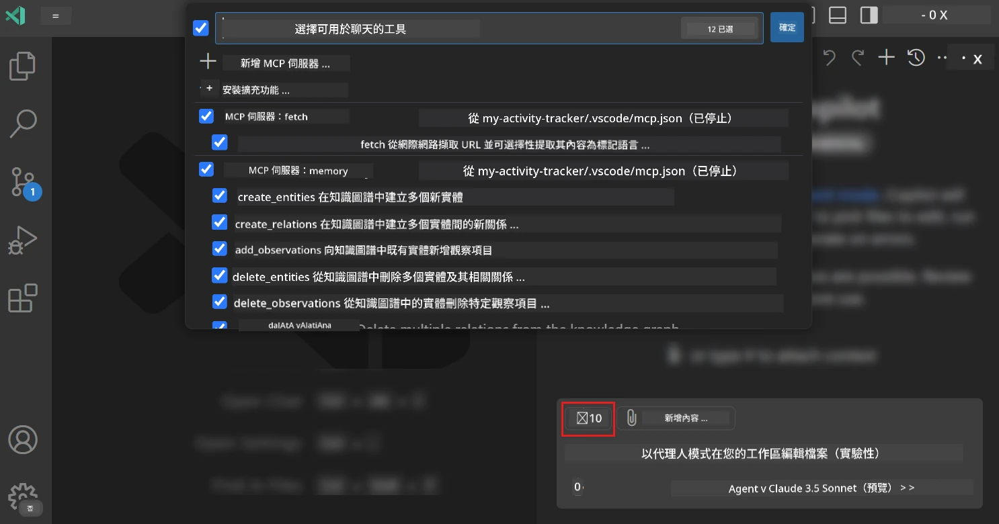
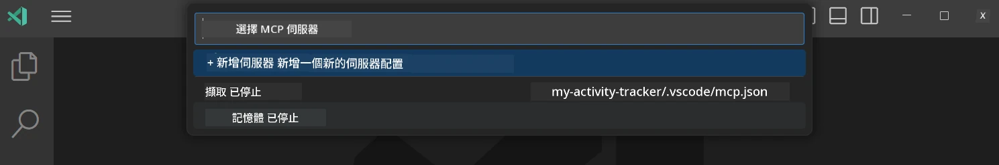
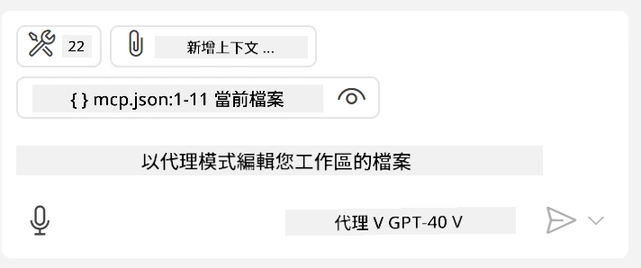
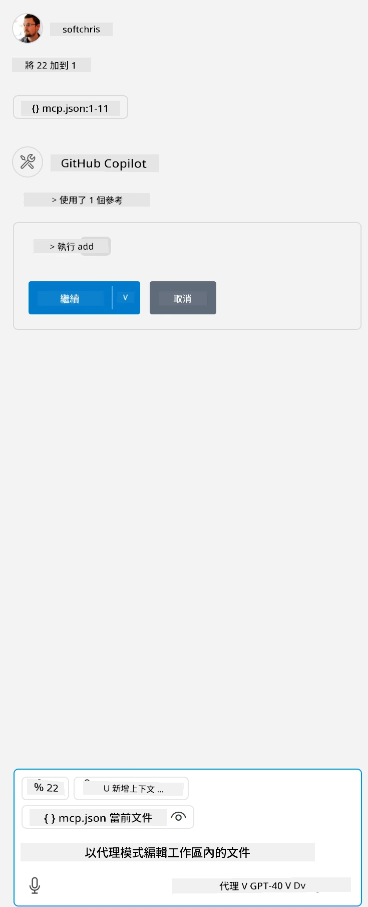

# 從 GitHub Copilot Agent 模式使用伺服器

Visual Studio Code 與 GitHub Copilot 可以作為客戶端，使用 MCP Server。你可能會問為什麼我們會這麼做？這意味著 MCP Server 擁有的任何功能現在都可以在你的 IDE 中使用。想像一下，例如加入 GitHub 的 MCP 伺服器，這將允許通過提示控制 GitHub，而不需要在終端機中輸入特定命令。或者想像任何能提升你開發者體驗、全部透過自然語言控制的功能。現在你開始看到其中的好處了，對吧？

## 概述

本課程說明如何使用 Visual Studio Code 及 GitHub Copilot 的 Agent 模式作為你的 MCP Server 客戶端。

## 學習目標

在本課程結束時，你將能夠：

- 透過 Visual Studio Code 使用 MCP Server。
- 透過 GitHub Copilot 執行類似工具的功能。
- 配置 Visual Studio Code 以尋找並管理你的 MCP Server。

## 使用方法

你可以用兩種不同的方式控制你的 MCP 伺服器：

- 使用介面，本章節稍後會示範如何操作。
- 終端機，可以用 `code` 執行檔從終端機控制：

  要新增 MCP 伺服器到你的使用者設定，請使用 --add-mcp 命令行選項，並以 {\"name\":\"server-name\",\"command\":...} 形式提供 JSON 伺服器設定。

  ```
  code --add-mcp "{\"name\":\"my-server\",\"command\": \"uvx\",\"args\": [\"mcp-server-fetch\"]}"
  ```

### 螢幕截圖





接下來我們會在後續章節詳細說明如何使用視覺介面。

## 方法

我們在高層次上的操作方式如下：

- 配置檔案以尋找 MCP 伺服器。
- 啟動或連接該伺服器以列出其功能。
- 通過 GitHub Copilot Chat 介面使用該功能。

好的，現在我們了解流程，接下來嘗試透過 Visual Studio Code 使用 MCP Server 實作練習。

## 練習：使用伺服器

在此練習中，我們將配置 Visual Studio Code 以尋找你的 MCP 伺服器，使其能從 GitHub Copilot Chat 介面使用。

### -0- 預備步驟，啟用 MCP Server 探測

你可能需要啟用 MCP Server 的自動探測。

1. 進入 Visual Studio Code 的 `檔案 -> 偏好設定 -> 設定`。

1. 搜尋「MCP」並在 settings.json 中啟用 `chat.mcp.discovery.enabled`。

### -1- 建立配置檔案

先在你的專案根目錄建立一個配置檔，你需要一個名為 MCP.json 的檔案，放在名為 .vscode 的資料夾中。檔案內容應該如下：

```text
.vscode
|-- mcp.json
```

接下來，讓我們看看如何新增伺服器條目。

### -2- 配置伺服器

將以下內容加入 *mcp.json*：

```json
{
    "inputs": [],
    "servers": {
       "hello-mcp": {
           "command": "node",
           "args": [
               "build/index.js"
           ]
       }
    }
}
```

上面是一個如何啟動用 Node.js 編寫的伺服器的簡單範例，其他執行環境請利用 `command` 與 `args` 指定正確的啟動指令。

### -3- 啟動伺服器

新增條目後，我們開始啟動伺服器：

1. 在 *mcp.json* 中找到你的伺服器條目，確保你看到「播放」圖示：

    

1. 點擊「播放」圖示，你會看到 GitHub Copilot Chat 內的工具圖示顯示可用工具數量增加。點擊該工具圖示，會顯示已註冊工具清單。你可以勾選/取消每個工具，決定是否讓 GitHub Copilot 使用它們作為上下文：

  

1. 若要執行工具，輸入你知道會匹配某個工具描述的提示，例如「add 22 to 1」：

  

  你應該會看到回傳結果為 23。

## 作業

嘗試將伺服器條目新增至你的 *mcp.json* 檔案，並確認你能啟動/停止伺服器。也確保你能通過 GitHub Copilot Chat 介面與伺服器上的工具溝通。

## 解答

[解答](./solution/README.md)

## 重要摘要

本章節重點如下：

- Visual Studio Code 是極佳的客戶端，能讓你使用多個 MCP Server 及其工具。
- GitHub Copilot Chat 介面是你與伺服器互動的主要方式。
- 你可以提示使用者輸入像 API 金鑰這類資訊，這些資訊可在 *mcp.json* 檔案配置伺服器條目時傳遞給 MCP Server。

## 範例

- [Java 計算器](../samples/java/calculator/README.md)
- [.Net 計算器](../../../../03-GettingStarted/samples/csharp)
- [JavaScript 計算器](../samples/javascript/README.md)
- [TypeScript 計算器](../samples/typescript/README.md)
- [Python 計算器](../../../../03-GettingStarted/samples/python)

## 額外資源

- [Visual Studio 文件](https://code.visualstudio.com/docs/copilot/chat/mcp-servers)

## 下一步

- 下一步：[建立 stdio 伺服器](../05-stdio-server/README.md)

---

<!-- CO-OP TRANSLATOR DISCLAIMER START -->
**免責聲明**：
本文件由 AI 翻譯服務 [Co-op Translator](https://github.com/Azure/co-op-translator) 翻譯而成。雖然我們致力於確保準確性，但請注意，機器自動翻譯可能包含錯誤或不準確之處。原始文件的母語版本應被視為權威來源。對於重要資訊，建議進行專業人工翻譯。我們不對因使用本翻譯而產生的任何誤解或誤釋承擔責任。
<!-- CO-OP TRANSLATOR DISCLAIMER END -->