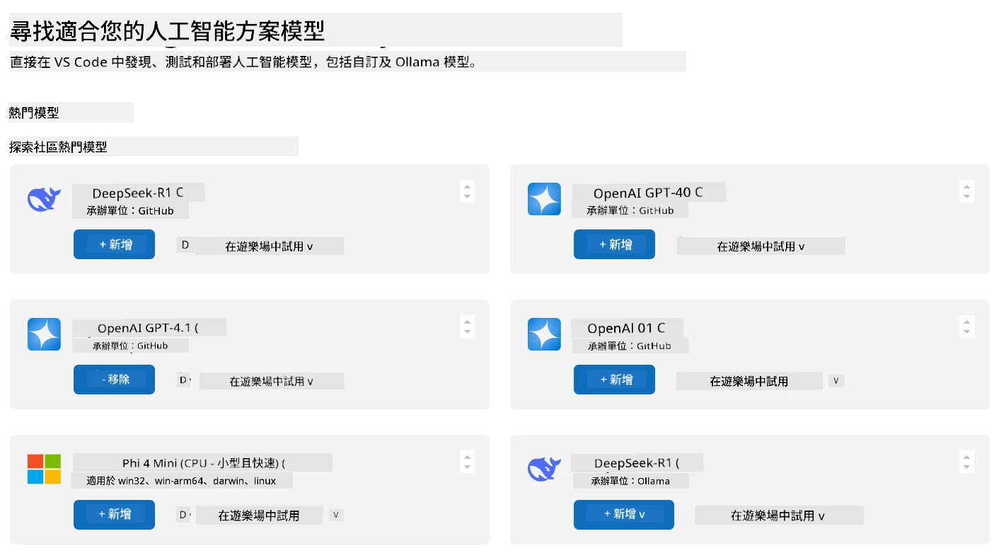
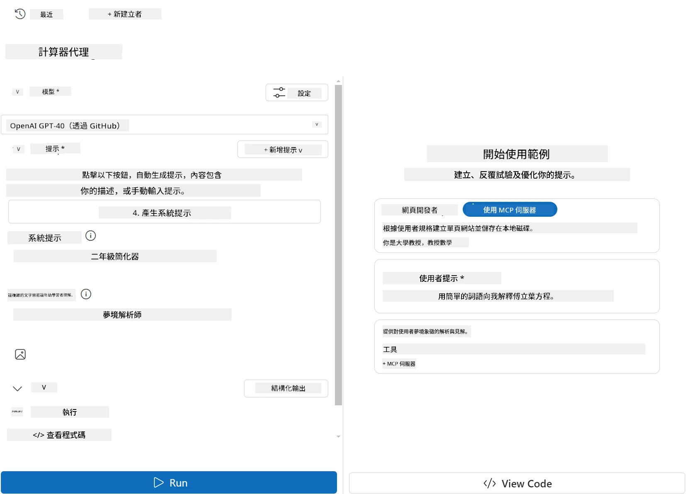
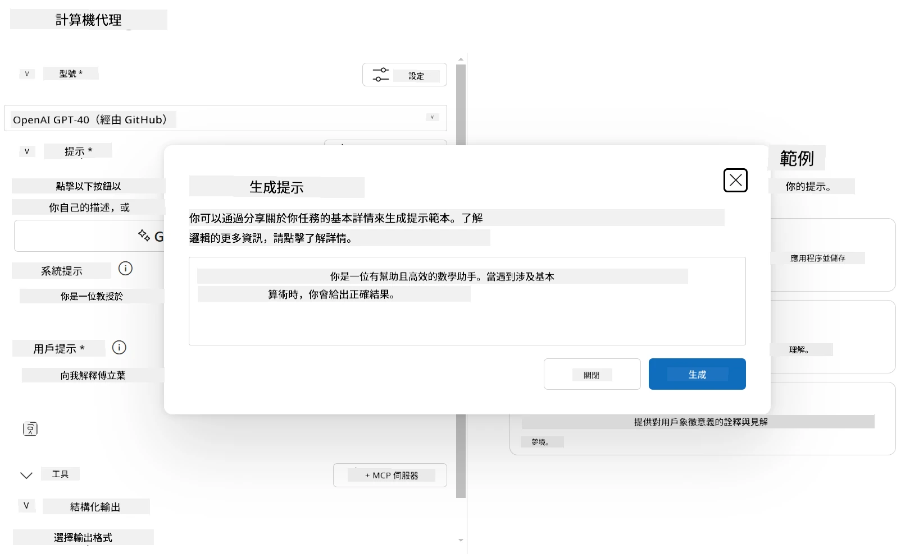

# 從 Visual Studio Code 的 AI Toolkit 擴充套件使用伺服器

當你在構建 AI 代理時，不只是生成智能回應；還要賦予代理採取行動的能力。這就是模型上下文協定（MCP）的用武之地。MCP 使代理能夠以一致的方式訪問外部工具和服務。可以把它想像成將你的代理連接到一個它 <em>真正能用</em> 的工具箱。

假設你將代理連接到計算器 MCP 伺服器，突然間你的代理只需接收到「47 乘以 89 是多少？」這樣的提示，就能執行數學運算 —— 無需硬編碼邏輯或構建自訂 API。

## 概覽

本課程涵蓋如何使用 Visual Studio Code 中的 [AI Toolkit](https://aka.ms/AIToolkit) 擴充套件，將計算器 MCP 伺服器連接到代理，讓代理能夠通過自然語言進行加、減、乘、除等數學運算。

AI Toolkit 是 Visual Studio Code 的強大擴充套件，簡化代理開發流程。AI 工程師可以輕鬆建構 AI 應用，開發並測試生成式 AI 模型 — 支援在本地或雲端執行。該擴充套件支援當前大多數主流生成模型。

<em>注意</em>: AI Toolkit 目前支援 Python 和 TypeScript。

## 學習目標

完成本課程後，你將能夠：

- 通過 AI Toolkit 消費 MCP 伺服器。
- 配置代理設定，使其能發現並使用 MCP 伺服器提供的工具。
- 通過自然語言使用 MCP 工具。

## 方法

我們在高層次上的方法如下：

- 創建代理並定義其系統提示。
- 創建包含計算工具的 MCP 伺服器。
- 將代理構建器連接至 MCP 伺服器。
- 通過自然語言測試代理對工具的調用。

很好，了解流程後，讓我們配置 AI 代理透過 MCP 利用外部工具，強化它的功能！

## 先決條件

- [Visual Studio Code](https://code.visualstudio.com/)
- [AI Toolkit for Visual Studio Code](https://aka.ms/AIToolkit)

## 練習：使用伺服器

> [!WARNING]
> macOS 使用者注意。我們目前正在調查影響 macOS 上依賴項安裝的問題。因而 macOS 使用者暫時無法完成本教程。我們會在修正發布後更新說明。感謝你的耐心與理解！

在本次練習中，你將使用 AI Toolkit 在 Visual Studio Code 內建立、運行並增強具備 MCP 伺服器工具的 AI 代理。

### -0- 預備步驟，將 OpenAI GPT-4o 模型加入「我的模型」

本練習使用 **GPT-4o** 模型。創建代理前，需將此模型加入 <strong>我的模型</strong>。



1. 從 <strong>活動列</strong> 開啟 **AI Toolkit** 擴充套件。
1. 在 <strong>目錄</strong> 區段選擇 <strong>模型</strong>，打開 <strong>模型目錄</strong>。選擇「模型」會在新編輯器分頁開啟「模型目錄」。
1. 在 <strong>模型目錄</strong> 搜尋欄輸入 **OpenAI GPT-4o**。
1. 點擊 **+ 新增**，將模型加入你的 <strong>我的模型</strong> 清單。確認你選擇的是 **GitHub 托管** 的模型。
1. 在 <strong>活動列</strong> 確認 **OpenAI GPT-4o** 模型出現在清單中。

### -1- 創建代理

**代理（提示）構建器** 讓你可以創建並自訂自己的 AI 代理。本節將建立一個新代理，並分配一個模型以驅動對話。



1. 從 <strong>活動列</strong> 開啟 **AI Toolkit**。
1. 在 <strong>工具</strong> 區段選擇 **代理（提示）構建器**，此操作會在新編輯器分頁啟動該工具。
1. 點擊 **+ 新增代理** 按鈕。擴充套件會透過 <strong>指令面板</strong> 啟動設定嚮導。
1. 輸入名稱 <strong>計算器代理</strong> 並按下 **Enter**。
1. 在 **代理（提示）構建器** 裡的 <strong>模型</strong> 欄位，選擇 **OpenAI GPT-4o (via GitHub)** 模型。

### -2- 創建代理系統提示

代理搭建好後，該定義它的個性與用途。本節中，你將使用 <strong>生成系統提示</strong> 功能描述代理預期行為（本例為計算器代理），並讓模型幫你寫出系統提示。



1. 在 <strong>提示</strong> 區段，點擊 <strong>生成系統提示</strong> 按鈕。此按鈕會開啟提示構建器並利用 AI 生成代理的系統提示。
1. 在 <strong>生成提示</strong> 窗口中，輸入以下內容：`你是一位樂於助人且效率高的數學助理。當面對基本算術問題時，請回應正確結果。`
1. 點擊 <strong>生成</strong> 按鈕。右下角會顯示通知確認系統提示正在生成。生成完成後，系統提示會出現在 **代理（提示）構建器** 的 <strong>系統提示</strong> 欄。
1. 查看 <strong>系統提示</strong> 並根據需要修改。

### -3- 創建 MCP 伺服器

當你定義好代理的系統提示以引導其行為和回應後，現在是時候為代理裝備實用功能。本節將創建計算器 MCP 伺服器，內建加、減、乘、除運算工具。該伺服器讓你的代理能夠根據自然語言提示執行即時數學運算。


AI Toolkit 提供模板方便你創建 MCP 伺服器。我們將使用 Python 模板來建立計算器 MCP 伺服器。

<em>注意</em>: AI Toolkit 目前支援 Python 和 TypeScript。

1. 在 **代理（提示）構建器** 的 <strong>工具</strong> 區段，點擊 **+ MCP 伺服器** 按鈕。擴充套件會透過 <strong>指令面板</strong> 啟動設定嚮導。
1. 選擇 **+ 新增伺服器**。
1. 選擇 **建立新的 MCP 伺服器**。
1. 選擇範本 **python-weather**。
1. 選擇 <strong>預設資料夾</strong> 保存 MCP 伺服器範本。
1. 輸入伺服器名稱：**Calculator**
1. 將開啟新的 Visual Studio Code 視窗。選擇 **是，我信任作者**。
1. 使用終端機（<strong>終端機</strong> > <strong>新終端機</strong>），創建虛擬環境：`python -m venv .venv`
1. 使用終端機，啟動虛擬環境：
    1. Windows - `.venv\Scripts\activate`
    1. macOS/Linux - `source .venv/bin/activate`
1. 使用終端機安裝依賴：`pip install -e .[dev]`
1. 在 <strong>活動列</strong> 的 <strong>檔案總管</strong> 視圖，展開 **src** 目錄並選擇 **server.py** 打開檔案。
1. 用以下程式碼取代 **server.py** 內容並保存：

    ```python
    """
    Sample MCP Calculator Server implementation in Python.

    
    This module demonstrates how to create a simple MCP server with calculator tools
    that can perform basic arithmetic operations (add, subtract, multiply, divide).
    """
    
    from mcp.server.fastmcp import FastMCP
    
    server = FastMCP("calculator")
    
    @server.tool()
    def add(a: float, b: float) -> float:
        """Add two numbers together and return the result."""
        return a + b
    
    @server.tool()
    def subtract(a: float, b: float) -> float:
        """Subtract b from a and return the result."""
        return a - b
    
    @server.tool()
    def multiply(a: float, b: float) -> float:
        """Multiply two numbers together and return the result."""
        return a * b
    
    @server.tool()
    def divide(a: float, b: float) -> float:
        """
        Divide a by b and return the result.
        
        Raises:
            ValueError: If b is zero
        """
        if b == 0:
            raise ValueError("Cannot divide by zero")
        return a / b
    ```

### -4- 使用計算器 MCP 伺服器運行代理

現在你的代理擁有工具，是時候使用它們了！本節你將向代理提交提示，以測試並驗證代理是否調用計算器 MCP 伺服器中的合適工具。


你會在本地開發機器上通過 <strong>代理構建器</strong> 作為 MCP 用戶端運行計算器 MCP 伺服器。

1. 按 `F5` 開始除錯 MCP 伺服器。**代理（提示）構建器** 將在新編輯器分頁開啟。終端機可見伺服器狀態。
1. 在 **代理（提示）構建器** 的 <strong>用戶提示</strong> 欄輸入：`我買了3件單價25美元的商品，然後使用了20美元的折扣。我實際付了多少錢？`
1. 點擊 <strong>執行</strong> 按鈕生成代理回應。
1. 查看代理輸出。模型應計算出你付了 **55 美元**。
1. 以下為預期流程：
    - 代理選擇使用 <strong>乘法</strong> 和 <strong>減法</strong> 工具協助計算。
    - 為 <strong>乘法</strong> 工具分配對應的 `a` 和 `b` 值。
    - 為 <strong>減法</strong> 工具分配對應的 `a` 和 `b` 值。
    - 各工具回應顯示在相應的 <strong>工具回應</strong> 裡。
    - 模型的最終輸出顯示於最終 <strong>模型回應</strong>。
1. 提交更多提示以進一步測試代理。你可以點擊 <strong>用戶提示</strong> 欄修改現有提示文字。
1. 測試完成後，可以在 <strong>終端機</strong> 使用 **CTRL/CMD+C** 中止伺服器。

## 作業

嘗試向你的 **server.py** 檔案新增工具項（例如：回傳一個數字的平方根）。提交會引導代理利用新工具（或已有工具）的額外提示。記得重新啟動伺服器以載入新增的工具。

## 解答

[解答](./solution/README.md)

## 重要收穫

本章節帶來的收穫如下：

- AI Toolkit 擴充套件是很棒的用戶端，讓你能消費 MCP 伺服器及其工具。
- 你可以為 MCP 伺服器新增工具，擴展代理功能以滿足不斷變化的需求。
- AI Toolkit 包含模板（如 Python MCP 伺服器模板），簡化自訂工具的建立。

## 額外資源

- [AI Toolkit 文件](https://aka.ms/AIToolkit/doc)

## 下一步
- 下一步: [測試與除錯](../08-testing/README.md)

---

<!-- CO-OP TRANSLATOR DISCLAIMER START -->
**免責聲明**：
本文件由 AI 翻譯服務 [Co-op Translator](https://github.com/Azure/co-op-translator) 翻譯而成。雖然我們致力於確保準確性，但請注意，機器自動翻譯可能包含錯誤或不準確之處。原始文件的母語版本應被視為權威來源。對於重要資訊，建議進行專業人工翻譯。我們不對因使用本翻譯而產生的任何誤解或誤釋承擔責任。
<!-- CO-OP TRANSLATOR DISCLAIMER END -->