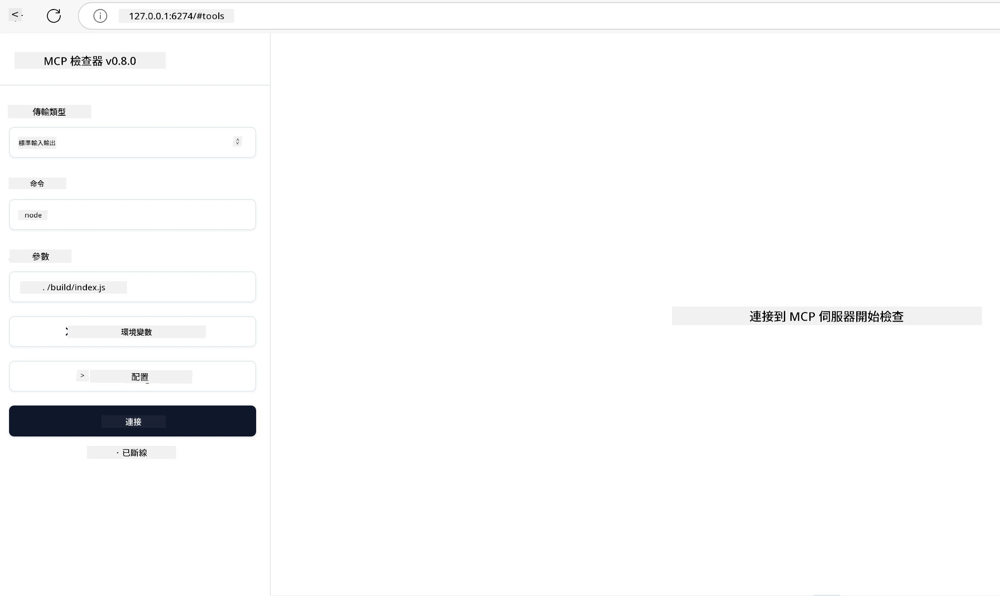

## 測試與除錯

在開始測試您的 MCP 伺服器之前，了解可用的工具與除錯最佳實踐非常重要。有效的測試能確保您的伺服器表現如預期，並幫助您快速識別和解決問題。以下章節概述了驗證 MCP 實作的建議方法。

## 概覽

本課程涵蓋如何選擇合適的測試方法及最有效的測試工具。

## 學習目標

到本課結束時，您將能夠：

- 描述各種測試方法。
- 使用不同工具有效測試您的程式碼。


## 測試 MCP 伺服器

MCP 提供工具來幫助您測試及除錯伺服器：

- **MCP Inspector**：一個可作為命令列工具及視覺化工具使用的指令列工具。
- <strong>手動測試</strong>：您可以使用類似 curl 的工具執行 Web 請求，但任何能執行 HTTP 的工具皆可。
- <strong>單元測試</strong>：您可使用自己偏好的測試框架測試伺服器與客戶端的功能。

### 使用 MCP Inspector

我們在之前的課程中已描述此工具的使用法，這裡簡單介紹一下。這是建立於 Node.js 平台的工具，您可透過執行 `npx` 程式呼叫使用，該命令會暫時下載並安裝工具，執行完請求後自動清除。

[MCP Inspector](https://github.com/modelcontextprotocol/inspector) 幫助您：

- <strong>發現伺服器功能</strong>：自動偵測可用的資源、工具及提示
- <strong>測試工具執行</strong>：嘗試不同參數並即時查看回應
- <strong>檢視伺服器元資料</strong>：檢查伺服器資訊、架構與設定

該工具的典型執行方式如下：

```bash
npx @modelcontextprotocol/inspector node build/index.js
```

上述指令啟動 MCP 及其視覺介面，並在瀏覽器中啟動本地 Web 介面。您將看到顯示已註冊 MCP 伺服器、其可用工具、資源和提示的儀表板。該介面允許您互動式測試工具執行、檢視伺服器元資料與即時回應，使驗證與除錯 MCP 伺服器實作更加容易。

介面可能長這樣： 

也可以在 CLI 模式下執行此工具，這時只要添加 `--cli` 屬性。例如以下以 CLI 模式執行工具，列出伺服器上所有工具的範例：

```sh
npx @modelcontextprotocol/inspector --cli node build/index.js --method tools/list
```

### 手動測試

除了使用 inspector 工具測試伺服器功能外，還可以使用具備 HTTP 功能的客戶端工具，如 curl 來執行類似的測試。

使用 curl，您可以直接以 HTTP 請求測試 MCP 伺服器：

```bash
# 例子：測試伺服器元數據
curl http://localhost:3000/v1/metadata

# 例子：執行工具
curl -X POST http://localhost:3000/v1/tools/execute \
  -H "Content-Type: application/json" \
  -d '{"name": "calculator", "parameters": {"expression": "2+2"}}'
```

如上所示，curl 的用法是使用 POST 請求，並以包含工具名稱及其參數的 payload 呼叫該工具。選擇最適合您的方式。一般而言，CLI 工具較操作快速且易於腳本化，非常適合 CI/CD 環境使用。

### 單元測試

為您的工具和資源建立單元測試以確保其正常運作。以下是一些示範測試程式碼。

```python
import pytest

from mcp.server.fastmcp import FastMCP
from mcp.shared.memory import (
    create_connected_server_and_client_session as create_session,
)

# 標記整個模組作為非同步測試
pytestmark = pytest.mark.anyio


async def test_list_tools_cursor_parameter():
    """Test that the cursor parameter is accepted for list_tools.

    Note: FastMCP doesn't currently implement pagination, so this test
    only verifies that the cursor parameter is accepted by the client.
    """

 server = FastMCP("test")

    # 創建幾個測試工具
    @server.tool(name="test_tool_1")
    async def test_tool_1() -> str:
        """First test tool"""
        return "Result 1"

    @server.tool(name="test_tool_2")
    async def test_tool_2() -> str:
        """Second test tool"""
        return "Result 2"

    async with create_session(server._mcp_server) as client_session:
        # 測試無游標參數（省略）
        result1 = await client_session.list_tools()
        assert len(result1.tools) == 2

        # 測試游標為 None
        result2 = await client_session.list_tools(cursor=None)
        assert len(result2.tools) == 2

        # 測試游標為字串
        result3 = await client_session.list_tools(cursor="some_cursor_value")
        assert len(result3.tools) == 2

        # 測試游標為空字串
        result4 = await client_session.list_tools(cursor="")
        assert len(result4.tools) == 2
    
```

上述程式碼做了以下事情：

- 利用 pytest 框架，讓您可以將測試建構為函式並使用 assert 陳述式。
- 建立一個擁有兩個不同工具的 MCP 伺服器。
- 使用 `assert` 陳述式來檢查特定條件是否成立。

請參考完整檔案：[full file here](https://github.com/modelcontextprotocol/python-sdk/blob/main/tests/client/test_list_methods_cursor.py)

根據上述檔案，您可以測試自己的伺服器以確保所建立的功能符合預期。

各大 SDK 均有類似的測試章節，您可根據選擇的執行環境做調整。

## 範例 

- [Java 計算機](../samples/java/calculator/README.md)
- [.Net 計算機](../../../../03-GettingStarted/samples/csharp)
- [JavaScript 計算機](../samples/javascript/README.md)
- [TypeScript 計算機](../samples/typescript/README.md)
- [Python 計算機](../../../../03-GettingStarted/samples/python) 

## 其他資源

- [Python SDK](https://github.com/modelcontextprotocol/python-sdk)

## 下一步

- 下一步: [部署](../09-deployment/README.md)

---

<!-- CO-OP TRANSLATOR DISCLAIMER START -->
**免責聲明**：
本文件由 AI 翻譯服務 [Co-op Translator](https://github.com/Azure/co-op-translator) 翻譯而成。雖然我們致力於確保準確性，但請注意，機器自動翻譯可能包含錯誤或不準確之處。原始文件的母語版本應被視為權威來源。對於重要資訊，建議進行專業人工翻譯。我們不對因使用本翻譯而產生的任何誤解或誤釋承擔責任。
<!-- CO-OP TRANSLATOR DISCLAIMER END -->