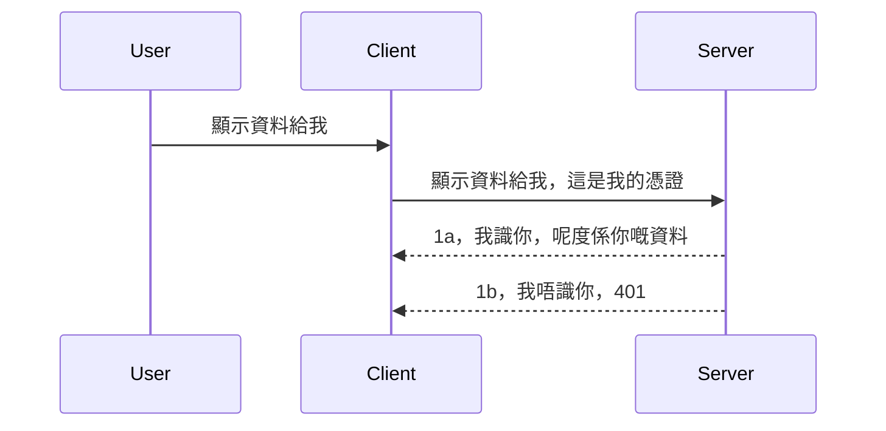

# Simple auth

MCP SDKs 支援使用 OAuth 2.1 ，說實話這是一個相當複雜的過程，涉及認證伺服器、資源伺服器、提交憑證、獲取代碼、交換代碼換取 Bearer 令牌，直到您最終能獲取資源資料。如果您不熟悉 OAuth（這是一個很棒的實作方式），建議先從一些基本的認證開始，逐步建立起更好更安全的機制。因此這章存在，就是要一步步帶你進入較進階的認證領域。

## Auth，我們指的是什麼？

Auth 是 authentication 和 authorization 的縮寫。其理念是我們需要完成兩件事情：

- **Authentication**，即辨識過程，判斷是否允許一位使用者進入我們的房子，確認他們是否有權「在這裡」，也就是有權限存取我們的資源伺服器，其中 MCP Server 的功能會運作於此。
- **Authorization**，是判斷用戶是否應當能存取他們請求的特定資源，例如訂單、產品，又或是判斷他們可否閱讀內容但不能刪除等。

## 憑證：我們如何告訴系統我們是誰

大部分的網頁開發者一般會想到提供一組憑證給伺服器，通常是一組 secret，表示他們是否被允許「Authentication」通過。此憑證通常是以 base64 編碼的使用者名稱和密碼，或者是一個獨特識別特定使用者的 API 金鑰。

這會透過名為 "Authorization" 的標頭傳送，如下：

```json
{ "Authorization": "secret123" }
```

這通常稱為基本認證 (basic authentication)。整個流程運作方式如下：


既然我們從流程層面了解它如何運作，接下來如何實作？大多數的網頁伺服器都有一種稱為 middleware（中介軟體）的概念，它是執行於請求過程中的一段程式碼，可以驗證憑證，若憑證有效則允許請求繼續。如果請求沒有有效憑證，則會收到認證錯誤。讓我們看看怎麼實作：

**Python**

```python
class AuthMiddleware(BaseHTTPMiddleware):
    async def dispatch(self, request, call_next):

        has_header = request.headers.get("Authorization")
        if not has_header:
            print("-> Missing Authorization header!")
            return Response(status_code=401, content="Unauthorized")

        if not valid_token(has_header):
            print("-> Invalid token!")
            return Response(status_code=403, content="Forbidden")

        print("Valid token, proceeding...")
       
        response = await call_next(request)
        # 新增任何客戶端標頭或以某種方式更改回應內容
        return response


starlette_app.add_middleware(CustomHeaderMiddleware)
```

我們這裡有：

- 建立一個名為 `AuthMiddleware` 的中介軟體，其 `dispatch` 方法由網頁伺服器呼叫。
- 將中介軟體加到網頁伺服器：

    ```python
    starlette_app.add_middleware(AuthMiddleware)
    ```

- 撰寫檢驗邏輯，檢查是否帶有 Authorization 標頭，且傳送的 secret 是否有效：

    ```python
    has_header = request.headers.get("Authorization")
    if not has_header:
        print("-> Missing Authorization header!")
        return Response(status_code=401, content="Unauthorized")

    if not valid_token(has_header):
        print("-> Invalid token!")
        return Response(status_code=403, content="Forbidden")
    ```

如果 secret 存在且有效，則會呼叫 `call_next` 讓請求繼續並回傳回應。

    ```python
    response = await call_next(request)
    # 添加任何用戶自定義標頭或以某種方式更改回應內容
    return response
    ```

工作方式是，當有網路請求向伺服器發起時，中介軟體會被調用，根據它的實作，會決定放行請求繼續，或回傳一個錯誤，表示用戶端不被允許繼續執行。

**TypeScript**

此處我們使用流行框架 Express 建立一個中介軟體，攔截請求在抵達 MCP Server 前進行處理。程式碼如下：

```typescript
function isValid(secret) {
    return secret === "secret123";
}

app.use((req, res, next) => {
    // 1. 授權標頭是否存在？
    if(!req.headers["Authorization"]) {
        res.status(401).send('Unauthorized');
    }
    
    let token = req.headers["Authorization"];

    // 2. 檢查有效性。
    if(!isValid(token)) {
        res.status(403).send('Forbidden');
    }

   
    console.log('Middleware executed');
    // 3. 將請求傳遞到請求流程的下一步。
    next();
});
```

在這段程式碼中，我們：

1. 檢查是否有 Authorization 標頭，若無，回傳 401 錯誤。
2. 驗證憑證/令牌是否有效，若無效，回傳 403 錯誤。
3. 最後，把請求傳遞下去，並回應要求的資源。

## 練習：實作認證功能

讓我們把學到的知識實作一次。計畫如下：

伺服器端

- 建立一個網頁伺服器以及 MCP 實例。
- 為伺服器實作中介軟體。

客戶端

- 透過標頭帶憑證送出網路請求。

### -1- 建立網頁伺服器與 MCP 實例

第一步，我們需要建立網頁伺服器實例及 MCP Server。

**Python**

這裡建立一個 MCP Server 實例，接著創建一個 starlette 網頁應用並使用 uvicorn 部屬。

```python
# 建立 MCP 伺服器

app = FastMCP(
    name="MCP Resource Server",
    instructions="Resource Server that validates tokens via Authorization Server introspection",
    host=settings["host"],
    port=settings["port"],
    debug=True
)

# 建立 starlette 網頁應用程式
starlette_app = app.streamable_http_app()

# 透過 uvicorn 提供應用程式服務
async def run(starlette_app):
    import uvicorn
    config = uvicorn.Config(
            starlette_app,
            host=app.settings.host,
            port=app.settings.port,
            log_level=app.settings.log_level.lower(),
        )
    server = uvicorn.Server(config)
    await server.serve()

run(starlette_app)
```

程式碼作用如下：

- 建立 MCP Server。
- 從 MCP Server 建立 starlette 網頁應用 `app.streamable_http_app()`。
- 使用 uvicorn 主持並啟動該網頁應用 `server.serve()`。

**TypeScript**

這裡創建 MCP Server 實例。

```typescript
const server = new McpServer({
      name: "example-server",
      version: "1.0.0"
    });

    // ... 設置伺服器資源、工具及提示 ...
```

這個 MCP Server 實例建立需寫在 POST /mcp 路由內，將上述程式碼移動如下：

```typescript
import express from "express";
import { randomUUID } from "node:crypto";
import { McpServer } from "@modelcontextprotocol/sdk/server/mcp.js";
import { StreamableHTTPServerTransport } from "@modelcontextprotocol/sdk/server/streamableHttp.js";
import { isInitializeRequest } from "@modelcontextprotocol/sdk/types.js"

const app = express();
app.use(express.json());

// 用會話 ID 儲存傳輸映射
const transports: { [sessionId: string]: StreamableHTTPServerTransport } = {};

// 處理用戶端到伺服器的 POST 請求
app.post('/mcp', async (req, res) => {
  // 檢查是否有現有的會話 ID
  const sessionId = req.headers['mcp-session-id'] as string | undefined;
  let transport: StreamableHTTPServerTransport;

  if (sessionId && transports[sessionId]) {
    // 重用現有的傳輸
    transport = transports[sessionId];
  } else if (!sessionId && isInitializeRequest(req.body)) {
    // 新的初始化請求
    transport = new StreamableHTTPServerTransport({
      sessionIdGenerator: () => randomUUID(),
      onsessioninitialized: (sessionId) => {
        // 用會話 ID 儲存傳輸
        transports[sessionId] = transport;
      },
      // DNS 重新綁定保護預設為關閉以保持向下相容。如你在本地運行此伺服器
      // 請確保設置：
      // enableDnsRebindingProtection: true,
      // allowedHosts: ['127.0.0.1'],
    });

    // 傳輸關閉時清理
    transport.onclose = () => {
      if (transport.sessionId) {
        delete transports[transport.sessionId];
      }
    };
    const server = new McpServer({
      name: "example-server",
      version: "1.0.0"
    });

    // ... 設定伺服器資源、工具及提示 ...

    // 連接 MCP 伺服器
    await server.connect(transport);
  } else {
    // 請求無效
    res.status(400).json({
      jsonrpc: '2.0',
      error: {
        code: -32000,
        message: 'Bad Request: No valid session ID provided',
      },
      id: null,
    });
    return;
  }

  // 處理請求
  await transport.handleRequest(req, res, req.body);
});

// 用於處理 GET 和 DELETE 請求的可重用處理器
const handleSessionRequest = async (req: express.Request, res: express.Response) => {
  const sessionId = req.headers['mcp-session-id'] as string | undefined;
  if (!sessionId || !transports[sessionId]) {
    res.status(400).send('Invalid or missing session ID');
    return;
  }
  
  const transport = transports[sessionId];
  await transport.handleRequest(req, res);
};

// 處理透過 SSE 的伺服器到用戶端通知之 GET 請求
app.get('/mcp', handleSessionRequest);

// 處理會話終止的 DELETE 請求
app.delete('/mcp', handleSessionRequest);

app.listen(3000);
```

現在你看到 MCP Server 的建立在 `app.post("/mcp")` 內部。

接著進入下一步，建立中介軟體用來驗證收到的憑證。

### -2- 實作伺服器的中介軟體

接著進入中介軟體階段。我們建立一個中介軟體會在 `Authorization` 標頭尋找憑證並驗證。如符合條件，請求便會繼續做它該做的事情（例如列出工具、讀取資源或使用 MCP 的功能）。

**Python**

建立中介軟體需要繼承 `BaseHTTPMiddleware` 類別。有兩個重點：

- `request`，我們會從中讀取標頭資訊。
- `call_next`，如果客戶端帶來可接受的憑證，我們要呼叫這個 callback。

先處理缺少 `Authorization` 標頭的情況：

```python
has_header = request.headers.get("Authorization")

# 沒有標頭，返回 401 失敗，否則繼續。
if not has_header:
    print("-> Missing Authorization header!")
    return Response(status_code=401, content="Unauthorized")
```

這裡回覆 401 未授權訊息，因為客戶端認證失敗。

接著若有憑證送出，需驗證它是否有效：

```python
 if not valid_token(has_header):
    print("-> Invalid token!")
    return Response(status_code=403, content="Forbidden")
```

請注意這裡傳回的是 403 禁止存取訊息。以下是完整的中介軟體程式碼，包含上述實作：

```python
class AuthMiddleware(BaseHTTPMiddleware):
    async def dispatch(self, request, call_next):

        has_header = request.headers.get("Authorization")
        if not has_header:
            print("-> Missing Authorization header!")
            return Response(status_code=401, content="Unauthorized")

        if not valid_token(has_header):
            print("-> Invalid token!")
            return Response(status_code=403, content="Forbidden")

        print("Valid token, proceeding...")
        print(f"-> Received {request.method} {request.url}")
        response = await call_next(request)
        response.headers['Custom'] = 'Example'
        return response

```

很好，那麼 `valid_token` 函式呢？程式碼如下：

```python
# 不要用於生產環境 - 改進它 !!
def valid_token(token: str) -> bool:
    # 移除 "Bearer " 前綴
    if token.startswith("Bearer "):
        token = token[7:]
        return token == "secret-token"
    return False
```

此處顯然還有改進空間。

重要提醒：請勿把像這樣的 secret 寫死在程式碼中。理想做法是從資料來源或 IDP（身份識別服務提供者）取得這個比對值，甚至更好的是由 IDP 完成驗證。

**TypeScript**

Express 必須呼叫 `use` 方法去使用中介軟體函式。

我們需要：

- 操作請求變數以讀取 `Authorization` 欄位的憑證。
- 驗證此憑證，若有效則讓請求繼續並讓客戶端的 MCP 請求照常執行（如列工具、讀資源等 MCP 功能）。

此處會檢查是否有 `Authorization` 標頭，若沒有，請求會被阻擋：

```typescript
if(!req.headers["authorization"]) {
    res.status(401).send('Unauthorized');
    return;
}
```

未帶標頭的請求會收到 401。

接著檢查憑證有效性，若無效，再次阻擋但回傳不同訊息：

```typescript
if(!isValid(token)) {
    res.status(403).send('Forbidden');
    return;
} 
```

此時會收到 403 錯誤。

完整程式碼如下：

```typescript
app.use((req, res, next) => {
    console.log('Request received:', req.method, req.url, req.headers);
    console.log('Headers:', req.headers["authorization"]);
    if(!req.headers["authorization"]) {
        res.status(401).send('Unauthorized');
        return;
    }
    
    let token = req.headers["authorization"];

    if(!isValid(token)) {
        res.status(403).send('Forbidden');
        return;
    }  

    console.log('Middleware executed');
    next();
});
```

我們設定了中介軟體以驗證客戶端憑證。那麼客戶端本身呢？

### -3- 透過標頭帶憑證發出網路請求

我們得確保客戶端通過標頭把憑證傳過來。因為我們接著要用 MCP 客戶端，所以需確認怎麼做。

**Python**

客戶端程式碼需透過標頭帶入憑證，如下示範：

```python
# 唔好硬編碼數值，最少應該放喺環境變量或者更安全嘅存儲位置
token = "secret-token"

async with streamablehttp_client(
        url = f"http://localhost:{port}/mcp",
        headers = {"Authorization": f"Bearer {token}"}
    ) as (
        read_stream,
        write_stream,
        session_callback,
    ):
        async with ClientSession(
            read_stream,
            write_stream
        ) as session:
            await session.initialize()
      
            # 待辦事項，你想喺客戶端完成嘅嘢，例如列出工具、調用工具等等。
```

注意我們如何設定 `headers` 為 `{"Authorization": f"Bearer {token}"}`。

**TypeScript**

可分兩步驟進行：

1. 建立一個設定物件，把憑證放入。
2. 把設定物件傳給傳輸層。

```typescript

// 切勿像這裡顯示的那樣硬編碼該值。至少應該將其設為環境變量，並在開發模式中使用諸如 dotenv 之類的工具。
let token = "secret123"

// 定義一個客戶端傳輸選項對象
let options: StreamableHTTPClientTransportOptions = {
  sessionId: sessionId,
  requestInit: {
    headers: {
      "Authorization": "secret123"
    }
  }
};

// 將選項對象傳遞給傳輸層
async function main() {
   const transport = new StreamableHTTPClientTransport(
      new URL(serverUrl),
      options
   );
```

上面顯示我們先建了一個 `options` 物件，並將標頭放到 `requestInit` 屬性裡。

重要提醒：那麼該如何改進呢？目前的實作有些風險，尤其透過明文憑證傳遞，如果沒有 HTTPS 保護，憑證易被竊取。即使使用 HTTPS，也需要一套機制方便撤銷令牌，與加入其他額外檢查，例如判斷請求來自何處、是否請求頻率異常（類似機器人行為）等等。總之這其中隱含很多考量。

不過說實話，對於非常簡單的 API，不想讓沒認證的人呼叫，是一個不錯的入門方案。

說完，接著讓我們嘗試加強安全性，改用一種標準格式 JSON Web Token，也就是著名的 JWT 或稱作 JOT。

## JSON Web Tokens, JWT

我們想強化認證，而非直接傳送簡單明文憑證。採用 JWT 有什麼立刻可見的優點？

- **安全性提升**。基本認證中每次都傳送 base64 編碼的帳號密碼 (或 API key)，風險較高。使用 JWT，初次送帳號密碼取得一個令牌，且令牌有有效期限。JWT 可輕鬆實作細緻存取控制，例如角色、範圍與權限。
- **無狀態與可擴充性**。JWT 是自包含的，攜帶所有使用者資訊，消除伺服器端需要儲存 session 的需求。令牌驗證可本地完成。
- **跨系統整合與聯合認證**。JWT 是 Open ID Connect 的核心，可與知名身份提供商結合，如 Entra ID、Google Identity、Auth0。支持單一登入與更多功能，達到企業級水準。
- **模組化與彈性**。JWT 也能整合 API 閘道，如 Azure API Management、NGINX 等。它支援認證場景與伺服器間溝通，包括冒用 (Impersonation) 與代理 (delegation)。
- **效能與快取**。JWT 解碼後可快取，減少每次解析負擔，對流量大的應用提升吞吐量並降低基礎架構壓力。
- **進階功能**。支援內省 (introspection，伺服器端驗證) 與撤銷 (revocation，使令牌失效)。

具備上述優勢，來看看如何將我們的實作提升到下一層次。

## 將基本認證轉換成 JWT

我們要做的里程碑改動是：

- **學會組成 JWT 令牌**，令牌可從客戶端送往伺服器。
- **JWT 令牌驗證**，令牌有效則讓客戶端存取資源。
- **安全儲存令牌**。如何安全保管此令牌。
- **保護路由**。需保護路由與特定 MCP 功能。
- **加入刷新令牌**。建置短期存活令牌與長期刷新令牌機制。並且設置刷新端點與輪替策略。

### -1- 組成 JWT 令牌

首先，JWT 令牌擁有以下部分：

- **header**，所用演算法與令牌種類。
- **payload**，聲明，如 sub（令牌代表的使用者或實體，通常是使用者 ID）、exp（過期時間）、role（角色）。
- **signature**，用秘密或私鑰簽章。

為此，我們需組成 header、payload 並編碼成令牌。

**Python**

```python

import jwt
import jwt
from jwt.exceptions import ExpiredSignatureError, InvalidTokenError
import datetime

# 用於簽署 JWT 的秘密金鑰
secret_key = 'your-secret-key'

header = {
    "alg": "HS256",
    "typ": "JWT"
}

# 用戶資訊及其聲明和到期時間
payload = {
    "sub": "1234567890",               # 主題（用戶 ID）
    "name": "User Userson",                # 自訂聲明
    "admin": True,                     # 自訂聲明
    "iat": datetime.datetime.utcnow(),# 發行時間
    "exp": datetime.datetime.utcnow() + datetime.timedelta(hours=1)  # 到期時間
}

# 編碼它
encoded_jwt = jwt.encode(payload, secret_key, algorithm="HS256", headers=header)
```

上述程式碼我們：

- 定義 header，使用 HS256 演算法，token 類型為 JWT。
- 組成 payload，包含 subject（使用者 ID）、username、role、簽發時間 iat 與過期時間 exp，實作時間限制功能。

**TypeScript**

此處需要一些依賴協助建構 JWT 令牌。

依賴

```sh

npm install jsonwebtoken
npm install --save-dev @types/jsonwebtoken
```

有依賴在後，我們來建立 header、payload 並依此形成編碼令牌。

```typescript
import jwt from 'jsonwebtoken';

const secretKey = 'your-secret-key'; // 在生產環境中使用環境變量

// 定義負載
const payload = {
  sub: '1234567890',
  name: 'User usersson',
  admin: true,
  iat: Math.floor(Date.now() / 1000), // 發行時間
  exp: Math.floor(Date.now() / 1000) + 60 * 60 // 1小時後過期
};

// 定義標頭（可選，jsonwebtoken 設置默認值）
const header = {
  alg: 'HS256',
  typ: 'JWT'
};

// 創建令牌
const token = jwt.sign(payload, secretKey, {
  algorithm: 'HS256',
  header: header
});

console.log('JWT:', token);
```

此令牌：

使用 HS256 簽章  
有效期間 1 小時  
包含 sub、name、admin、iat、exp 等聲明。

### -2- 驗證令牌

我們還需驗證令牌，伺服器端應驗證客戶端送來的令牌是否有效。此處可做多項檢查，從結構到有效性皆可。建議進一步檢查使用者是否在系統內，以及使用者是否擁有所聲稱的權限。

驗證令牌即解碼以便讀取，並開始檢查其有效性：

**Python**

```python

# 解碼並驗證 JWT
try:
    decoded = jwt.decode(token, secret_key, algorithms=["HS256"])
    print("✅ Token is valid.")
    print("Decoded claims:")
    for key, value in decoded.items():
        print(f"  {key}: {value}")
except ExpiredSignatureError:
    print("❌ Token has expired.")
except InvalidTokenError as e:
    print(f"❌ Invalid token: {e}")

```

以上呼叫 `jwt.decode`，輸入令牌、秘密金鑰與演算法，使用 try-catch 以捕捉驗證失敗造成的異常。

**TypeScript**

這裡呼叫 `jwt.verify`，得到已解碼的令牌以供後續分析。若呼叫失敗，表示令牌結構錯誤或不再有效。

```typescript

try {
  const decoded = jwt.verify(token, secretKey);
  console.log('Decoded Payload:', decoded);
} catch (err) {
  console.error('Token verification failed:', err);
}
```

注意：如前所述，應該做額外檢查，確保令牌所指向的使用者存在於系統，並確保該使用者擁有所宣稱的權限。

接著，我們來看看基於角色的存取控制，也就是所謂的 RBAC。
## 添加基於角色的存取控制

這個想法是我們希望表達不同的角色擁有不同的權限。例如，我們假設管理員(admin)可以執行所有操作，普通用戶(user)可以讀取/寫入，而訪客(guest)只能讀取。因此，這裡是一些可能的權限層級：

- Admin.Write 
- User.Read
- Guest.Read

讓我們來看看如何使用中介軟件(middleware)實現這種控制。中介軟件可以按路由添加，也可以為所有路由添加。

**Python**

```python
from starlette.middleware.base import BaseHTTPMiddleware
from starlette.responses import JSONResponse
import jwt

# 唔好將密鑰寫喺程式碼入面，呢個淨係示範用。請由安全嘅地方讀取。
SECRET_KEY = "your-secret-key" # 將呢個放喺環境變數度
REQUIRED_PERMISSION = "User.Read"

class JWTPermissionMiddleware(BaseHTTPMiddleware):
    async def dispatch(self, request, call_next):
        auth_header = request.headers.get("Authorization")
        if not auth_header or not auth_header.startswith("Bearer "):
            return JSONResponse({"error": "Missing or invalid Authorization header"}, status_code=401)

        token = auth_header.split(" ")[1]
        try:
            decoded = jwt.decode(token, SECRET_KEY, algorithms=["HS256"])
        except jwt.ExpiredSignatureError:
            return JSONResponse({"error": "Token expired"}, status_code=401)
        except jwt.InvalidTokenError:
            return JSONResponse({"error": "Invalid token"}, status_code=401)

        permissions = decoded.get("permissions", [])
        if REQUIRED_PERMISSION not in permissions:
            return JSONResponse({"error": "Permission denied"}, status_code=403)

        request.state.user = decoded
        return await call_next(request)


```

添加中介軟件有幾種不同的方法，如下所示：

```python

# 方案 1：在建立 starlette 應用程式時加入中介軟體
middleware = [
    Middleware(JWTPermissionMiddleware)
]

app = Starlette(routes=routes, middleware=middleware)

# 方案 2：在 starlette 應用程式已建立後加入中介軟體
starlette_app.add_middleware(JWTPermissionMiddleware)

# 方案 3：針對每個路由加入中介軟體
routes = [
    Route(
        "/mcp",
        endpoint=..., # 處理程序
        middleware=[Middleware(JWTPermissionMiddleware)]
    )
]
```

**TypeScript**

我們可以使用 `app.use` 和一個會對所有請求執行的中介軟件。

```typescript
app.use((req, res, next) => {
    console.log('Request received:', req.method, req.url, req.headers);
    console.log('Headers:', req.headers["authorization"]);

    // 1. 檢查是否已經發送授權標頭

    if(!req.headers["authorization"]) {
        res.status(401).send('Unauthorized');
        return;
    }
    
    let token = req.headers["authorization"];

    // 2. 檢查令牌是否有效
    if(!isValid(token)) {
        res.status(403).send('Forbidden');
        return;
    }  

    // 3. 檢查令牌用戶是否存在於我們系統中
    if(!isExistingUser(token)) {
        res.status(403).send('Forbidden');
        console.log("User does not exist");
        return;
    }
    console.log("User exists");

    // 4. 驗證令牌是否具有正確的權限
    if(!hasScopes(token, ["User.Read"])){
        res.status(403).send('Forbidden - insufficient scopes');
    }

    console.log("User has required scopes");

    console.log('Middleware executed');
    next();
});

```

我們可以讓中介軟件完成並且中介軟件應該完成的事情有很多，具體包括：

1. 檢查是否存在授權標頭(authorization header)
2. 檢查令牌(token)是否有效，我們調用 `isValid`，這是我們自己寫的方法，用來檢查 JWT 令牌的完整性和有效性。
3. 驗證用戶是否存在於我們的系統中，我們應該進行這個檢查。

   ```typescript
    // 數據庫中的用戶
   const users = [
     "user1",
     "User usersson",
   ]

   function isExistingUser(token) {
     let decodedToken = verifyToken(token);

     // 待辦事項，檢查用戶是否存在於數據庫中
     return users.includes(decodedToken?.name || "");
   }
   ```

   上面，我們創建了一個非常簡單的 `users` 列表，當然，這個列表應該存放在數據庫中。

4. 此外，我們還應該檢查令牌是否擁有正確的權限。

   ```typescript
   if(!hasScopes(token, ["User.Read"])){
        res.status(403).send('Forbidden - insufficient scopes');
   }
   ```

   在中介軟件中的以上代碼裡，我們檢查令牌是否包含 User.Read 權限，如果沒有，我們返回 403 錯誤。下面是 `hasScopes` 輔助方法。

   ```typescript
   function hasScopes(scope: string, requiredScopes: string[]) {
     let decodedToken = verifyToken(scope);
    return requiredScopes.every(scope => decodedToken?.scopes.includes(scope));
  }
   ```

Have a think which additional checks you should be doing, but these are the absolute minimum of checks you should be doing.

Using Express as a web framework is a common choice. There are helpers library when you use JWT so you can write less code.

- `express-jwt`, helper library that provides a middleware that helps decode your token.
- `express-jwt-permissions`, this provides a middleware `guard` that helps check if a certain permission is on the token.

Here's what these libraries can look like when used:

```typescript
const express = require('express');
const jwt = require('express-jwt');
const guard = require('express-jwt-permissions')();

const app = express();
const secretKey = 'your-secret-key'; // put this in env variable

// Decode JWT and attach to req.user
app.use(jwt({ secret: secretKey, algorithms: ['HS256'] }));

// Check for User.Read permission
app.use(guard.check('User.Read'));

// multiple permissions
// app.use(guard.check(['User.Read', 'Admin.Access']));

app.get('/protected', (req, res) => {
  res.json({ message: `Welcome ${req.user.name}` });
});

// Error handler
app.use((err, req, res, next) => {
  if (err.code === 'permission_denied') {
    return res.status(403).send('Forbidden');
  }
  next(err);
});

```

現在你已經看到中介軟件如何用於身份驗證和授權，那 MCP 呢？它會改變我們做身份驗證的方式嗎？讓我們在下一節中探討。

### -3- 為 MCP 添加 RBAC

到目前為止，你已經看到如何透過中介軟件添加 RBAC，但對於 MCP，沒有簡單的方式來針對每個 MCP 功能添加 RBAC，那我們該怎麼辦呢？我們只需添加如下代碼，檢查客戶端是否有權調用特定工具：

你有幾種不同的選擇來實現每個功能的 RBAC，這裡列出一些：

- 為你需要檢查權限等級的每個工具、資源、提示(prompt)添加檢查。

   **python**

   ```python
   @tool()
   def delete_product(id: int):
      try:
          check_permissions(role="Admin.Write", request)
      catch:
        pass # 客戶端授權失敗，拋出授權錯誤
   ```

   **typescript**

   ```typescript
   server.registerTool(
    "delete-product",
    {
      title: Delete a product",
      description: "Deletes a product",
      inputSchema: { id: z.number() }
    },
    async ({ id }) => {
      
      try {
        checkPermissions("Admin.Write", request);
        // 待辦，將 id 傳送到 productService 和遠端入口
      } catch(Exception e) {
        console.log("Authorization error, you're not allowed");  
      }

      return {
        content: [{ type: "text", text: `Deletected product with id ${id}` }]
      };
    }
   );
   ```


- 使用進階的伺服器方案和請求處理程序(request handlers)，從而最小化你需要進行權限檢查的地方數量。

   **Python**

   ```python
   
   tool_permission = {
      "create_product": ["User.Write", "Admin.Write"],
      "delete_product": ["Admin.Write"]
   }

   def has_permission(user_permissions, required_permissions) -> bool:
      # user_permissions: 用戶擁有的權限列表
      # required_permissions: 工具所需的權限列表
      return any(perm in user_permissions for perm in required_permissions)

   @server.call_tool()
   async def handle_call_tool(
     name: str, arguments: dict[str, str] | None
   ) -> list[types.TextContent]:
    # 假設 request.user.permissions 是用戶的權限列表
     user_permissions = request.user.permissions
     required_permissions = tool_permission.get(name, [])
     if not has_permission(user_permissions, required_permissions):
        # 引發錯誤 "你沒有權限調用工具 {name}"
        raise Exception(f"You don't have permission to call tool {name}")
     # 繼續執行並調用工具
     # ...
   ```   
   

   **TypeScript**

   ```typescript
   function hasPermission(userPermissions: string[], requiredPermissions: string[]): boolean {
       if (!Array.isArray(userPermissions) || !Array.isArray(requiredPermissions)) return false;
       // 如果用戶至少擁有一個所需權限則返回 true
       
       return requiredPermissions.some(perm => userPermissions.includes(perm));
   }
  
   server.setRequestHandler(CallToolRequestSchema, async (request) => {
      const { params: { name } } = request;
  
      let permissions = request.user.permissions;
  
      if (!hasPermission(permissions, toolPermissions[name])) {
         return new Error(`You don't have permission to call ${name}`);
      }
  
      // 繼續..
   });
   ```

   注意，你需要確保中介軟件將解碼後的令牌賦值給請求的 user 屬性，這樣上面的代碼才容易實現。

### 總結

現在我們討論了如何一般性地添加 RBAC 支援以及如何特別為 MCP 添加 RBAC，是時候自己動手實作安全性，確保你理解了本章所介紹的概念。

## 作業 1：使用基本身份驗證建立 MCP 伺服器和 MCP 用戶端

這裡你將使用你學到的如何透過標頭(header)傳送認證資訊。

## 解答 1

[解答 1](./code/basic/README.md)

## 作業 2：升級作業 1 的方案，使用 JWT

採用第一個方案，但這次我們要改進它。

不用 Basic Auth，改用 JWT。

## 解答 2

[解答 2](./solution/jwt-solution/README.md)

## 挑戰

如同「為 MCP 添加 RBAC」一節中描述的，為每個工具新增 RBAC。

## 摘要

希望你在本章學到了很多，從完全沒有安全性，到基本安全性，再到 JWT 以及如何將它加到 MCP。

我們已經用自定義的 JWT 建立了堅實的基礎，但隨著系統規模擴大，我們正朝向基於標準的身份模型邁進。採用像 Entra 或 Keycloak 這樣的身份提供者(IdP)，讓我們能將代幣的發行、驗證和生命週期管理委託給一個受信任的平台——釋放我們專注於應用邏輯和用戶體驗。

有關此主題，我們有更[進階的 Entra 章節](../../05-AdvancedTopics/mcp-security-entra/README.md)

## 接下來是

- 下一步：[設定 MCP 主機](../12-mcp-hosts/README.md)

---

<!-- CO-OP TRANSLATOR DISCLAIMER START -->
**免責聲明**：  
本文件已使用 AI 翻譯服務 [Co-op Translator](https://github.com/Azure/co-op-translator) 進行翻譯。雖然我們致力於確保準確性，但請注意，自動翻譯可能包含錯誤或不準確之處。原始語言文件應視為權威來源。對於重要資訊，建議採用專業人工翻譯。本公司不對因使用本翻譯而引起的任何誤解或誤譯承擔責任。
<!-- CO-OP TRANSLATOR DISCLAIMER END -->