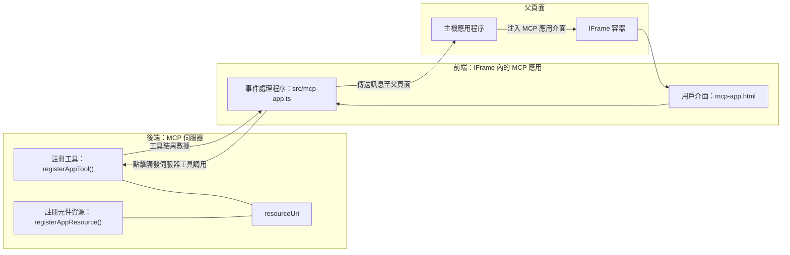
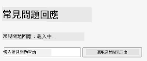
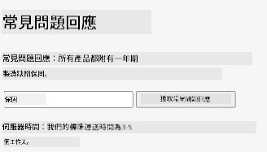
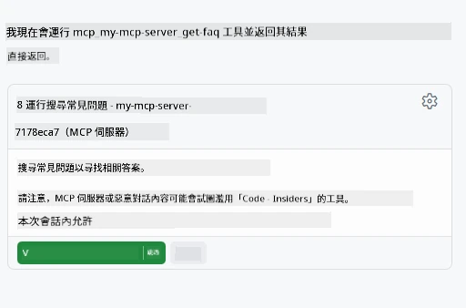

# MCP 應用程式

MCP 應用程式是 MCP 中的一個新範式。這個概念不只是從工具調用回應資料，還會提供如何與該資訊互動的相關資訊。這代表工具結果現在可以包含 UI 資訊。那為什麼我們會想要這樣呢？想想你今天是怎麼做的。你可能會透過放置一些前端來消費 MCP 伺服器的結果，這是你必須撰寫和維護的程式碼。有時這正是你想要的，但有時如果你可以直接帶入一段自包含的資訊，從資料到使用者介面全都備齊，那會很方便。

## 概覽

本課程提供 MCP 應用程式的實務指導，如何開始使用它以及如何整合到你現有的 Web 應用程式中。MCP 應用程式是 MCP 標準中的一個非常新穎的新增項目。

## 學習目標

在本課程結束時，你將能夠：

- 解釋什麼是 MCP 應用程式。
- 何時使用 MCP 應用程式。
- 建立並整合你自己的 MCP 應用程式。

## MCP 應用程式 - 它是如何運作的

MCP 應用程式的理念是提供一個本質上可渲染的元件作為回應。這個元件可以同時擁有視覺呈現與互動性，例如按鈕點擊、使用者輸入等等。讓我們先從伺服器端和 MCP 伺服器談起。要建立一個 MCP 應用程式元件，你需要建立工具，而且還要建立應用程式資源。這兩部分是透過 resourceUri 連接的。

舉個例子。讓我們嘗試視覺化涉及哪些部分以及各部分負責什麼：

```text
server.ts -- responsible for registering tools and the component as a UI component
src/
  mcp-app.ts -- wiring up event handlers
mcp-app.html -- the user interface
```

這個視覺圖描述建立元件及其邏輯的架構。


讓我們接著描述後端和前端的責任。

### 後端

我們需要完成兩件事：

- 註冊我們希望互動的工具。
- 定義元件。

**註冊工具**

```typescript
registerAppTool(
    server,
    "get-time",
    {
      title: "Get Time",
      description: "Returns the current server time.",
      inputSchema: {},
      _meta: { ui: { resourceUri } }, // 將此工具連結至其用戶界面資源
    },
    async () => {
      const time = new Date().toISOString();
      return { content: [{ type: "text", text: time }] };
    },
  );

```

上面程式碼描述了行為，它暴露了一個名為 `get-time` 的工具。它沒有輸入，但最終會產生目前時間。我們確實有能力為需要接受使用者輸入的工具定義 `inputSchema`。

**註冊元件**

在同一個檔案中，我們也必須註冊元件：

```typescript
const resourceUri = "ui://get-time/mcp-app.html";

// 註冊資源，並返回用於 UI 的打包 HTML/JavaScript。
registerAppResource(
  server,
  resourceUri,
  resourceUri,
  { mimeType: RESOURCE_MIME_TYPE },
  async () => {
    const html = await fs.readFile(path.join(DIST_DIR, "mcp-app.html"), "utf-8");

    return {
    contents: [
        { uri: resourceUri, mimeType: RESOURCE_MIME_TYPE, text: html },
    ],
    };
  },
);
```

注意我們如何提及 `resourceUri` 來連結元件與其工具。另一個有趣的是回呼函式，我們在這裡載入 UI 檔案並返回元件。

### 元件前端

就像後端，有兩個部分：

- 使用純 HTML 撰寫的前端。
- 處理事件及行為的程式碼，例如呼叫工具或與父視窗溝通。

**使用者介面**

讓我們看看使用者介面。

```html
<!-- mcp-app.html -->
<!DOCTYPE html>
<html lang="en">
  <head>
    <meta charset="UTF-8" />
    <title>Get Time App</title>
  </head>
  <body>
    <p>
      <strong>Server Time:</strong> <code id="server-time">Loading...</code>
    </p>
    <button id="get-time-btn">Get Server Time</button>
    <script type="module" src="/src/mcp-app.ts"></script>
  </body>
</html>
```

**事件綁定**

最後一塊是事件綁定。這是識別 UI 中哪個部分需要事件處理器，以及事件觸發後要執行什麼操作：

```typescript
// mcp-app.ts

import { App } from "@modelcontextprotocol/ext-apps";

// 獲取元素參考
const serverTimeEl = document.getElementById("server-time")!;
const getTimeBtn = document.getElementById("get-time-btn")!;

// 建立應用程式實例
const app = new App({ name: "Get Time App", version: "1.0.0" });

// 處理來自伺服器的工具結果。於 `app.connect()` 之前設置以避免
// 遺漏初始工具結果。
app.ontoolresult = (result) => {
  const time = result.content?.find((c) => c.type === "text")?.text;
  serverTimeEl.textContent = time ?? "[ERROR]";
};

// 連接按鈕點擊事件
getTimeBtn.addEventListener("click", async () => {
  // `app.callServerTool()` 讓 UI 向伺服器請求新鮮數據
  const result = await app.callServerTool({ name: "get-time", arguments: {} });
  const time = result.content?.find((c) => c.type === "text")?.text;
  serverTimeEl.textContent = time ?? "[ERROR]";
});

// 連接至主機
app.connect();
```

如上所示，這是將 DOM 元素綁定事件的常規程式碼。值得一提的是呼叫 `callServerTool`，它會呼叫後端的工具。

## 處理使用者輸入

到目前為止，我們已看到一個元件，當按鈕被點擊時會呼叫工具。讓我們看看是否能加入更多 UI 元件，例如輸入欄位，並且將參數傳送給工具。讓我們實作一個 FAQ 功能。它的運作方式應該是：

- 有一個按鈕和一個輸入元件，使用者在輸入欄位中輸入要搜尋的關鍵字，例如「Shipping」。這會呼叫後端的工具，在 FAQ 資料中搜尋。
- 一個支援上述 FAQ 搜尋的工具。

讓我們先在後端加入所需支援：

```typescript
const faq: { [key: string]: string } = {
    "shipping": "Our standard shipping time is 3-5 business days.",
    "return policy": "You can return any item within 30 days of purchase.",
    "warranty": "All products come with a 1-year warranty covering manufacturing defects.",
  }

registerAppTool(
    server,
    "get-faq",
    {
      title: "Search FAQ",
      description: "Searches the FAQ for relevant answers.",
      inputSchema: zod.object({
        query: zod.string().default("shipping"),
      }),
      _meta: { ui: { resourceUri: faqResourceUri } }, // 將此工具連結至其用戶介面資源
    },
    async ({ query }) => {
      const answer: string = faq[query.toLowerCase()] || "Sorry, I don't have an answer for that.";
      return { content: [{ type: "text", text: answer }] };
    },
  );
```

這裡我們看到如何填充 `inputSchema`，並給它一個 `zod` schema，如下：

```typescript
inputSchema: zod.object({
  query: zod.string().default("shipping"),
})
```

在上述 schema 中，我們宣告有一個名為 `query` 的輸入參數，且它是可選的，預設值為「shipping」。

好的，現在轉到 *mcp-app.html* 看看我們需要建立什麼 UI：

```html
<div class="faq">
    <h1>FAQ response</h1>
    <p>FAQ Response: <code id="faq-response">Loading...</code></p>
    <input type="text" id="faq-query" placeholder="Enter FAQ query" />
    <button id="get-faq-btn">Get FAQ Response</button>
  </div>
```

很好，現在有一個輸入欄位和一個按鈕。接下來到 *mcp-app.ts* 綁定事件：

```typescript
const getFaqBtn = document.getElementById("get-faq-btn")!;
const faqQueryInput = document.getElementById("faq-query") as HTMLInputElement;

getFaqBtn.addEventListener("click", async () => {
  const query = faqQueryInput.value;
  const result = await app.callServerTool({ name: "get-faq", arguments: { query } });
  const faq = result.content?.find((c) => c.type === "text")?.text;
  faqResponseEl.textContent = faq ?? "[ERROR]";
});
```

在上面的程式碼中，我們：

- 建立對重要 UI 元素的參考。
- 處理按鈕點擊事件，解析輸入欄位的值，並呼叫 `app.callServerTool()`，以 `name` 和 `arguments` 傳參數，其中後者傳送 `query` 的值。

你呼叫 `callServerTool` 時，實際上是送出訊息給父視窗，該視窗最終會呼叫 MCP 伺服器。

### 試試看

試用後，我們應該會看到如下介面：



下面是輸入「warranty」的測試：



要執行此程式碼，請前往 [程式碼部分](./code/README.md)

## 在 Visual Studio Code 測試

Visual Studio Code 對 MVP 應用程式有很好的支援，也可能是測試你的 MCP 應用程式最簡單的方法。使用 Visual Studio Code，請在 *mcp.json* 中加入伺服器條目，如下：

```json
"my-mcp-server-7178eca7": {
    "url": "http://localhost:3001/mcp",
    "type": "http"
  }
```

然後啟動伺服器，你應該可以透過聊天視窗與你的 MVP 應用程式溝通，前提是你已安裝 GitHub Copilot。

觸發指令，例如 "#get-faq"：



就跟你在瀏覽器執行一樣，畫面呈現也是一樣的：


## 任務

建立一個猜拳遊戲。它應該包含以下：

使用者介面：

- 一個下拉選單選項
- 一個送出選擇的按鈕
- 一個標籤顯示誰出什麼拳和誰獲勝

伺服器端：

- 需要有一個猜拳工具，接受「choice」作為輸入，並且隨機產生電腦的選擇，判定勝負

## 解答

[解答](./assignment/README.md)

## 總結

我們學到了 MCP 應用程式這個新範式。這是讓 MCP 伺服器不只能管理資料，還能決定資料如何呈現的新範式。

此外，我們也知道這些 MCP 應用程式是被載入到 IFrame 中，並且必須透過傳送訊息給父網頁應用程式與 MCP 伺服器溝通。目前有多個空純 JavaScript、React 等函式庫支援這種溝通方式，讓開發更容易。

## 主要重點

你學到：

- MCP 應用程式是一個新標準，適合同時傳送資料和 UI 功能。
- 這類應用程式為了安全性會跑在 IFrame 中。

## 下一步

- [第 4 章](../../04-PracticalImplementation/README.md)

---

<!-- CO-OP TRANSLATOR DISCLAIMER START -->
**免責聲明**：  
本文件是使用 AI 翻譯服務 [Co-op Translator](https://github.com/Azure/co-op-translator) 進行翻譯。儘管我們致力於確保準確性，但請注意，自動翻譯可能包含錯誤或不準確之處。原始語言的文件應視為權威來源。對於重要資訊，建議諮詢專業人工翻譯。我們不對因使用本翻譯而引起的任何誤解或誤譯承擔責任。
<!-- CO-OP TRANSLATOR DISCLAIMER END -->