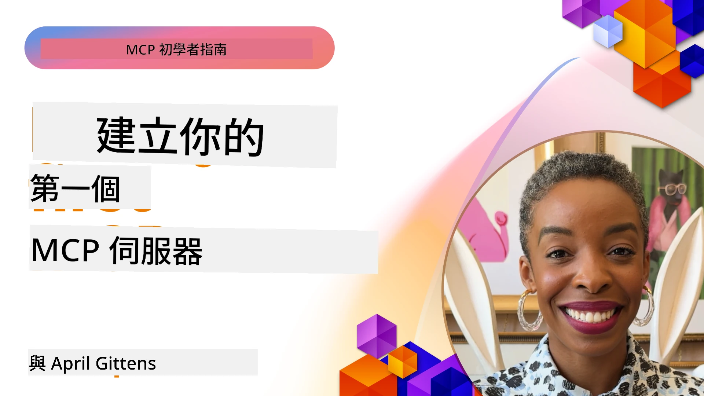

## 開始使用  

_(點擊上圖觀看本課程影片)_

本章節包含多個課程：

- **1 你的第一個伺服器**，在第一堂課中，你將學會如何建立你的第一個伺服器並使用檢查器工具檢視它，這是測試和除錯伺服器的寶貴方法，[觀看課程](01-first-server/README.md)

- **2 用戶端**，在本課程中，你將學習如何編寫可以連接到伺服器的用戶端，[觀看課程](02-client/README.md)

- **3 搭配 LLM 的用戶端**，更好的用戶端寫法是加入 LLM，使其能與伺服器「協商」要執行的操作，[觀看課程](03-llm-client/README.md)

- **4 在 Visual Studio Code 中使用 GitHub Copilot Agent 模式來消費伺服器**。這裡示範如何在 Visual Studio Code 內運行我們的 MCP 伺服器，[觀看課程](04-vscode/README.md)

- **5 stdio 傳輸伺服器**，stdio 傳輸是本地 MCP 伺服器至用戶端通訊的推薦標準，提供安全的子程序通訊與內建的進程隔離，[觀看課程](05-stdio-server/README.md)

- **6 MCP 的 HTTP 串流（可串流 HTTP）**。學習標準的
	遠端傳輸，詳見[MCP 規範 2026-07-28](https://modelcontextprotocol.io/specification/2026-07-28/basic/transports/streamable-http)，
	並保留課程中的傳統基於 session 的實作。
	[觀看課程](06-http-streaming/README.md)

- **7 利用 AI Toolkit for VSCode** 來使用和測試你的 MCP 客戶端和伺服器，[觀看課程](07-aitk/README.md)

- **8 測試**。這裡我們將重點介紹如何以不同方式測試伺服器與用戶端，[觀看課程](08-testing/README.md)

- **9 部署**。本章節將介紹部署你的 MCP 解決方案的不同方式，[觀看課程](09-deployment/README.md)

- **10 進階伺服器使用**。本章節講述進階伺服器的用法，[觀看課程](./10-advanced/README.md)

- **11 認證**。本章節介紹如何新增簡易認證，從基本認證到使用 JWT 與 RBAC。建議你先從這裡開始，然後參考第 5 章的進階主題，並依第 2 章的建議進行額外的安全強化，[觀看課程](./11-simple-auth/README.md)

- **12 MCP 主機**。設定與使用熱門 MCP 主機用戶端，包括 Claude Desktop、Cursor、Cline 和 Windsurf。了解傳輸類型與除錯，[觀看課程](./12-mcp-hosts/README.md)

- **13 MCP 檢查器**。使用 MCP 檢查器工具互動式除錯與測試你的 MCP 伺服器。學習除錯工具、資源和協議訊息，[觀看課程](./13-mcp-inspector/README.md)

- **14 取樣**。學習 `2025-11-25` 的傳統取樣原語，
	以及如何將新設計遷移到直接整合 LLM 供應商。取樣在 MCP `2026-07-28` 中已
	被棄用。[觀看課程](./14-sampling/README.md)

- **15 MCP 應用**。建立同時回覆 UI 指令的 MCP 伺服器，[觀看課程](./15-mcp-apps/README.md)

Model Context Protocol (MCP) 是一個開放協議，標準化應用程式如何向大型語言模型（LLMs）提供上下文。將 MCP 想像成 AI 應用的 USB-C 端口——它提供一個標準化方法，將 AI 模型連接到不同的資料來源和工具。

## 學習目標

完成本課程後，你將能夠：

- 建立適合 C#、Java、Python、TypeScript 及 JavaScript 的 MCP 開發環境
- 建置及部署帶有自訂功能（資源、提示詞、工具）的基本 MCP 伺服器
- 建立可連接 MCP 伺服器的主機應用程式
- 測試與除錯 MCP 實作
- 理解常見設置挑戰及其解決方案
- 將你的 MCP 實作連接到熱門的 LLM 服務

## 設定你的 MCP 開發環境

在開始使用 MCP 之前，準備好你的開發環境並了解基本工作流程非常重要。本節將引導你完成初始設置步驟，確保順利開始使用 MCP。

### 先決條件

在深入 MCP 開發前，請確保你已具備以下條件：

- <strong>開發環境</strong>：適合你所選語言（C#、Java、Python、TypeScript 或 JavaScript）
- **IDE/編輯器**：Visual Studio、Visual Studio Code、IntelliJ、Eclipse、PyCharm，或任何現代程式碼編輯器
- <strong>封包管理工具</strong>：NuGet、Maven/Gradle、pip 或 npm/yarn
- **API 金鑰**：用於你計畫在主機應用中使用的任何 AI 服務

### 官方 SDK

接下來的章節中你將看到使用 Python、TypeScript、
Java 和 .NET 建立的解決方案。以下是官方 SDK。

MCP `2026-07-28` 的 SDK 支援正由各語言獨立推出。
在執行範例前，請查看其封包版本和 SDK 發佈說明，
了解所支援的協議版本。詳見
[官方 SDK 列表](https://modelcontextprotocol.io/docs/sdk)：
- [C# SDK](https://github.com/modelcontextprotocol/csharp-sdk) - 與 Microsoft 合作維護
- [Java SDK](https://github.com/modelcontextprotocol/java-sdk) - 與 Spring AI 合作維護
- [TypeScript SDK](https://github.com/modelcontextprotocol/typescript-sdk) - 官方 TypeScript 實作
- [Python SDK](https://github.com/modelcontextprotocol/python-sdk) - 官方 Python 實作（FastMCP）
- [Kotlin SDK](https://github.com/modelcontextprotocol/kotlin-sdk) - 官方 Kotlin 實作
- [Swift SDK](https://github.com/modelcontextprotocol/swift-sdk) - 與 Loopwork AI 合作維護
- [Rust SDK](https://github.com/modelcontextprotocol/rust-sdk) - 官方 Rust 實作
- [Go SDK](https://github.com/modelcontextprotocol/go-sdk) - 官方 Go 實作

## 主要重點

- 建立 MCP 開發環境透過語言專用 SDK 非常簡單
- 建立 MCP 伺服器包含創建及註冊具明確架構的工具
- MCP 用戶端連接伺服器與模型以利用擴展功能
- 測試與除錯是可靠實作 MCP 的關鍵
- 部署選項涵蓋本地開發到雲端解決方案

## 練習

我們提供一組範例，搭配本節各章所呈現的練習。此外，每章亦有自己的練習與作業

- [Java 計算機](./samples/java/calculator/README.md)
- [.NET 計算機](../../../03-GettingStarted/samples/csharp)
- [JavaScript 計算機](./samples/javascript/README.md)
- [TypeScript 計算機](./samples/typescript/README.md)
- [Python 計算機](../../../03-GettingStarted/samples/python)

## 額外資源

- [使用 Model Context Protocol 在 Azure 上建立代理](https://learn.microsoft.com/azure/developer/ai/intro-agents-mcp)
- [使用 Azure Container Apps 的遠端 MCP（Node.js/TypeScript/JavaScript）](https://learn.microsoft.com/samples/azure-samples/mcp-container-ts/mcp-container-ts/)
- [.NET OpenAI MCP 代理](https://learn.microsoft.com/samples/azure-samples/openai-mcp-agent-dotnet/openai-mcp-agent-dotnet/)

## 下一步

從第一課開始：[建立你的第一個 MCP 伺服器](01-first-server/README.md)

完成本模組後，繼續進入：[模組 4：實作練習](../04-PracticalImplementation/README.md)

---

<!-- CO-OP TRANSLATOR DISCLAIMER START -->
**免責聲明**：
本文件由 AI 翻譯服務 [Co-op Translator](https://github.com/Azure/co-op-translator) 翻譯而成。雖然我們致力於確保準確性，但請注意，機器自動翻譯可能包含錯誤或不準確之處。原始文件的母語版本應被視為權威來源。對於重要資訊，建議進行專業人工翻譯。我們不對因使用本翻譯而產生的任何誤解或誤釋承擔責任。
<!-- CO-OP TRANSLATOR DISCLAIMER END -->