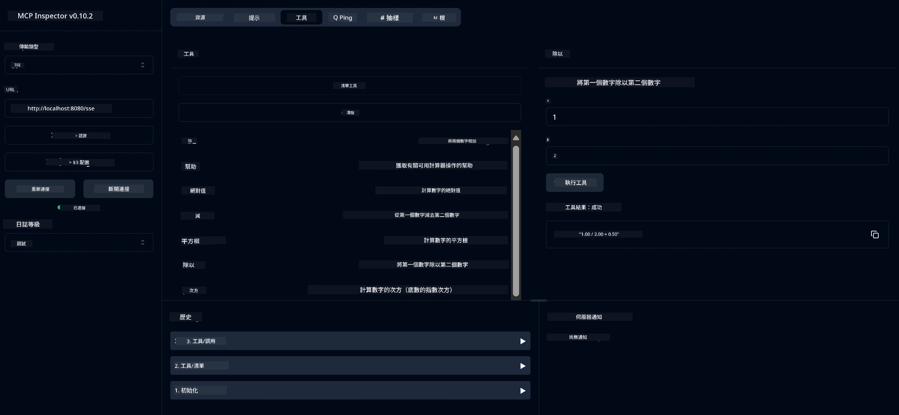

# 基本計算機 MCP 服務

> [!NOTE]
> 此範例使用舊版 HTTP+SSE 傳輸並針對 MCP `2025-11-25` 相容的 SDK。
> 新的遠端伺服器應使用 `2026-07-28` Streamable HTTP 支援。


- 支援 SSE（伺服器傳送事件）
- 使用 Spring AI 的 `@Tool` 註解自動註冊工具
- 基本計算機功能：
  - 加法、減法、乘法、除法
  - 次方計算與平方根
  - 取模（餘數）與絕對值
  - 用於操作說明的說明函數


   - 兩數相加
   - 一數減另一數
   - 兩數相乘
   - 一數除另一數（含除以零檢查）


   - 次方計算（底數的冪次方）
   - 平方根計算（含負數檢查）
   - 取模（餘數）計算
   - 絕對值計算


   - 內建說明函數解釋所有可用操作


- `subtract(a, b)`：將第二個數從第一個數中相減
- `multiply(a, b)`：將兩數相乘
- `divide(a, b)`：將第一個數除以第二個數（含零檢查）
- `power(base, exponent)`：計算次方
- `squareRoot(number)`：計算平方根（含負數檢查）
- `modulus(a, b)`：計算除法餘數
- `absolute(number)`：計算絕對值
- `help()`：取得可用操作資訊


   
   使用 GitHub 的 AI 模型（如 phi-4）需具備 GitHub 個人存取權杖：


   
   b. 點選「Generate new token」→「Generate new token (classic)」
   
   c. 為你的 token 命名描述
   
   d. 選取以下權限範圍：
      - `repo`（完全控制私人倉庫）
      - `read:org`（查看組織與團隊成員，以及組織專案）
      - `gist`（建立 gists）
      - `gist`（建立 gists）

      - `user:email`（存取用戶電郵地址（唯讀））
   
   e. 點擊「Generate token」並複製你的新憑證
   
   f. 將它設為環境變數：
      
      在 Windows：
      ```
      set GITHUB_TOKEN=your-github-token
      ```
      
      在 macOS/Linux：
      ```bash
      export GITHUB_TOKEN=your-github-token
      ```

   g. 若要永久設置，請透過系統設定將其添加至環境變數

2. 將 LangChain4j GitHub 依賴新增至你的專案（pom.xml 中已包含）：
   ```xml
   <dependency>
       <groupId>dev.langchain4j</groupId>
       <artifactId>langchain4j-github</artifactId>
       <version>${langchain4j.version}</version>
   </dependency>
   ```

3. 確保計算機服務器正在 `localhost:8080` 運行

### 運行 LangChain4j 客戶端

此範例展示：
- 通過 SSE 傳輸連接計算機 MCP 伺服器
- 使用 LangChain4j 創建一個利用計算機操作的聊天機械人
- 整合 GitHub AI 模型（現在使用 phi-4 模型）

客戶端發送以下範例查詢以展示功能：
1. 計算兩個數字的總和
2. 求一個數字的平方根
3. 獲取有關可用計算機操作的幫助資訊

運行範例並檢查控制台輸出，以查看 AI 模型如何利用計算工具回應查詢。

### GitHub 模型配置

LangChain4j 客戶端配置為使用 GitHub 的 phi-4 模型，設定如下：

```java
ChatLanguageModel model = GitHubChatModel.builder()
    .apiKey(System.getenv("GITHUB_TOKEN"))
    .timeout(Duration.ofSeconds(60))
    .modelName("phi-4")
    .logRequests(true)
    .logResponses(true)
    .build();
```

若要使用其他 GitHub 模型，只需將 `modelName` 參數更改為其他支援的模型（例如 "claude-3-haiku-20240307"、"llama-3-70b-8192" 等）。

## 依賴項

專案需要以下主要依賴：

```xml
<!-- For MCP Server -->
<dependency>
    <groupId>org.springframework.ai</groupId>
    <artifactId>spring-ai-starter-mcp-server-webflux</artifactId>
</dependency>

<!-- For LangChain4j integration -->
<dependency>
    <groupId>dev.langchain4j</groupId>
    <artifactId>langchain4j-mcp</artifactId>
    <version>${langchain4j.version}</version>
</dependency>

<!-- For GitHub models support -->
<dependency>
    <groupId>dev.langchain4j</groupId>
    <artifactId>langchain4j-github</artifactId>
    <version>${langchain4j.version}</version>
</dependency>
```

## 建置專案

使用 Maven 建置專案：
```bash
./mvnw clean install -DskipTests
```

## 運行伺服器

### 使用 Java

```bash
java -jar target/calculator-server-0.0.1-SNAPSHOT.jar
```

### 使用 MCP Inspector

MCP Inspector 是與 MCP 服務互動的有用工具。若要搭配此計算服務使用：

1. **安裝並運行 MCP Inspector** 於新終端機視窗：
   ```bash
   npx @modelcontextprotocol/inspector
   ```

2. **透過應用程式顯示的 URL（通常是 http://localhost:6274）訪問網頁介面**

3. <strong>配置連接</strong>：
   - 將傳輸類型設為「SSE」
   - 將 URL 設為正在運行服務器的 SSE 端點：`http://localhost:8080/sse`
   - 點擊「Connect」

4. <strong>使用工具</strong>：
   - 點擊「List Tools」來查看可用的計算機操作
   - 選擇一個工具並點擊「Run Tool」來執行操作



### 使用 Docker

專案包含 Dockerfile 方便容器化部署：

1. **建置 Docker 映像檔**：
   ```bash
   docker build -t calculator-mcp-service .
   ```

2. **運行 Docker 容器**：
   ```bash
   docker run -p 8080:8080 calculator-mcp-service
   ```

這將會：
- 使用 Maven 3.9.9 和 Eclipse Temurin 24 JDK 建置多階段 Docker 映像檔
- 建立優化的容器映像檔
- 在 8080 埠對外開放服務
- 在容器內啟動 MCP 計算服務

容器運行後，你可透過 `http://localhost:8080` 存取此服務。

## 疑難排解

### GitHub 憑證常見問題


1. <strong>權杖權限問題</strong>：如果您收到 403 Forbidden 錯誤，請檢查您的權杖是否具有前置條件中列出的正確權限。

2. <strong>找不到權杖</strong>：如果您收到「找不到 API 金鑰」錯誤，請確保已正確設定 GITHUB_TOKEN 環境變數。

3. <strong>速率限制</strong>：GitHub API 有速率限制。如果您遇到速率限制錯誤（狀態碼 429），請等待幾分鐘後再嘗試。

4. <strong>權杖過期</strong>：GitHub 權杖可能會過期。如果您在一段時間後收到驗證錯誤，請生成新權杖並更新您的環境變數。

如果您需要進一步協助，請查看 [LangChain4j 文件](https://github.com/langchain4j/langchain4j) 或 [GitHub API 文件](https://docs.github.com/en/rest)。

---

<!-- CO-OP TRANSLATOR DISCLAIMER START -->
**免責聲明**：
本文件由 AI 翻譯服務 [Co-op Translator](https://github.com/Azure/co-op-translator) 翻譯而成。雖然我們致力於確保準確性，但請注意，機器自動翻譯可能包含錯誤或不準確之處。原始文件的母語版本應被視為權威來源。對於重要資訊，建議進行專業人工翻譯。我們不對因使用本翻譯而產生的任何誤解或誤釋承擔責任。
<!-- CO-OP TRANSLATOR DISCLAIMER END -->