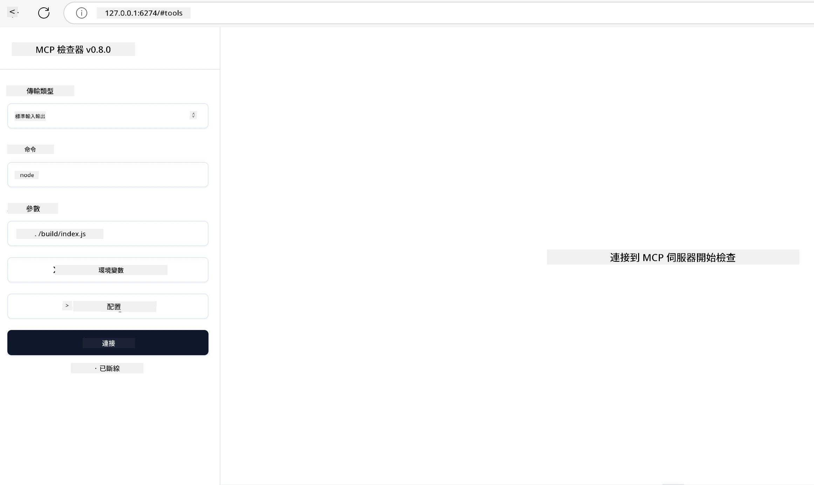

# 實務應用

[](https://youtu.be/vCN9-mKBDfQ)

_(點擊上方圖片觀看本課程影片)_

實務應用是模型上下文協定（MCP）威力具體展現的地方。雖然理解 MCP 的理論及架構很重要，但真正的價值來自於你應用這些概念來建置、測試及部署解決真實世界問題的解決方案。本章節彌合了概念知識與實務開發的落差，引導你將基於 MCP 的應用帶入生命。

無論你是在開發智能助理、整合 AI 入企業工作流程，或建置客製化資料處理工具，MCP 都提供彈性的基礎。它的語言無關設計與官方支援熱門程式語言的 SDK，使其對廣泛的開發者都易於接觸。透過利用這些 SDK，你可以快速原型、反覆試驗，並在不同平台及環境中擴展你的解決方案。

接下來的章節你會找到實務範例、範例程式碼以及部署策略，演示如何在 C#、Java 與 Spring、TypeScript、JavaScript 和 Python 實作 MCP。你也將學習如何除錯與測試 MCP 伺服器、管理 API，以及使用 Azure 進行雲端部署。這些實作資源設計來加速你的學習，幫助你自信地建構堅固且可用於生產的 MCP 應用程式。

## 概述

本課程聚焦於 MCP 在多種程式語言中的實務實作面向。我們將探討如何利用 C#、Java (Spring)、TypeScript、JavaScript 和 Python 的 MCP SDK 撰寫堅固應用程式、除錯與測試 MCP 伺服器，以及創建可重複使用的資源、提示與工具。

## 學習目標

完成本課程後，你將能：

- 使用官方 SDK 在不同程式語言中實作 MCP 解決方案
- 系統性地除錯與測試 MCP 伺服器
- 建立及使用伺服器功能（資源、提示及工具）
- 設計適合複雜工作的有效 MCP 工作流程
- 優化 MCP 實作的效能及可靠度

## 官方 SDK 資源

模型上下文協定提供多語言的官方 SDK（符合 [MCP 規範 2025-11-25](https://spec.modelcontextprotocol.io/specification/2025-11-25/) ）：

- [C# SDK](https://github.com/modelcontextprotocol/csharp-sdk)
- [Java 與 Spring SDK](https://github.com/modelcontextprotocol/java-sdk) **注意：**需依賴 [Project Reactor](https://projectreactor.io) 。 (參見 [討論議題 246](https://github.com/orgs/modelcontextprotocol/discussions/246) )
- [TypeScript SDK](https://github.com/modelcontextprotocol/typescript-sdk)
- [Python SDK](https://github.com/modelcontextprotocol/python-sdk)
- [Kotlin SDK](https://github.com/modelcontextprotocol/kotlin-sdk)
- [Go SDK](https://github.com/modelcontextprotocol/go-sdk)

## 使用 MCP SDK

本節提供跨多種程式語言實作 MCP 的實務範例。你可於 `samples` 目錄中根據程式語言組織的範例程式碼。

### 可用範例

本儲存庫包含以下語言的 [範例實作](../../../04-PracticalImplementation/samples)：

- [C#](./samples/csharp/README.md)
- [Java 與 Spring](./samples/java/containerapp/README.md)
- [TypeScript](./samples/typescript/README.md)
- [JavaScript](./samples/javascript/README.md)
- [Python](./samples/python/README.md)

每個範例示範對應語言生態系中 MCP 的核心概念及實作模式。

### 實務指南

其他 MCP 實務實作指南：

- [分頁與大量結果集處理](./pagination/README.md) - 為工具、資源與大型資料集處理基於游標的分頁

## 核心伺服器功能

MCP 伺服器可實作下列任意組合的功能：

### 資源

資源提供使用者或 AI 模型可用的上下文與資料：

- 文件庫
- 知識庫
- 結構化資料源
- 檔案系統

### 提示

提示是為使用者準備的模板訊息及工作流程：

- 預先定義的對話模板
- 指引式互動模式
- 專用的對話結構

### 工具

工具是供 AI 模型執行的函式：

- 資料處理工具
- 外部 API 整合
- 運算能力
- 搜尋功能

## 範例實作：C# 實作

官方 C# SDK 儲存庫包含多個示範 MCP 不同面向的範例實作：

- **基本 MCP 用戶端**：簡單示範如何建立 MCP 用戶端並呼叫工具
- **基本 MCP 伺服器**：最小伺服器實作與基本工具註冊
- **進階 MCP 伺服器**：具完整功能的伺服器，包含工具註冊、驗證及錯誤處理
- **ASP.NET 整合**：示範與 ASP.NET Core 的整合範例
- **工具實作模式**：多種工具實作樣式，涵蓋不同複雜度

MCP C# SDK 仍在預覽階段，API 可能變動。我們將持續更新本部落格以反映 SDK 的發展情況。

### 主要功能

- [C# MCP Nuget ModelContextProtocol](https://www.nuget.org/packages/ModelContextProtocol)
- 建立你的 [第一個 MCP 伺服器](https://devblogs.microsoft.com/dotnet/build-a-model-context-protocol-mcp-server-in-csharp/)。

完整的 C# 實作範例，請參考 [官方 C# SDK 範例儲存庫](https://github.com/modelcontextprotocol/csharp-sdk)

## 範例實作：Java 與 Spring 實作

Java 與 Spring SDK 提供強大且企業級的 MCP 實作選項。

### 主要功能

- Spring Framework 整合
- 強型別安全
- 支援反應式程式設計
- 完整的錯誤處理

完整 Java 與 Spring 實作範例，請見 samples 目錄中 [Java 與 Spring 範例](samples/java/containerapp/README.md)。

## 範例實作：JavaScript 實作

JavaScript SDK 提供輕量且靈活的 MCP 實作方式。

### 主要功能

- 支援 Node.js 與瀏覽器
- 基於 Promise 的 API
- 容易整合 Express 及其他框架
- WebSocket 支援串流

完整 JavaScript 實作範例，請見 samples 目錄中的 [JavaScript 範例](samples/javascript/README.md)。

## 範例實作：Python 實作

Python SDK 為 MCP 實作提供符合 Python 風格的架構，並具備優秀的機器學習框架整合。

### 主要功能

- 支援基於 asyncio 的 async/await
- FastAPI 整合
- 簡單的工具註冊
- 與流行機器學習函式庫原生整合

完整 Python 實作範例，請見 samples 目錄中的 [Python 範例](samples/python/README.md)。

## API 管理

Azure API 管理是確保 MCP 伺服器安全性的絕佳方案。概念是在 MCP 伺服器前面置放一個 Azure API 管理實例，讓它負責你可能需要的功能，如：

- 限速控制
- 令牌管理
- 監控
- 負載平衡
- 安全性

### Azure 範例

這裡有一個 Azure 範例，展示如何操作，也就是[建立 MCP 伺服器並利用 Azure API 管理保護它](https://github.com/Azure-Samples/remote-mcp-apim-functions-python)。

下方圖片顯示授權流程：


圖片中發生的流程：

- 使用 Microsoft Entra 進行驗證／授權。
- Azure API 管理作為閘道，運用政策導向並管理流量。
- Azure 監控記錄所有請求以供進一步分析。

#### 授權流程

讓我們更詳細看看授權流程：


#### MCP 授權規範

了解更多關於 [MCP 授權規範](https://spec.modelcontextprotocol.io/specification/2025-11-25/basic/authorization/)

## 部署遠端 MCP 伺服器至 Azure

讓我們試著部署之前提到的範例：

1. 複製儲存庫

    ```bash
    git clone https://github.com/Azure-Samples/remote-mcp-apim-functions-python.git
    cd remote-mcp-apim-functions-python
    ```

1. 註冊 `Microsoft.App` 資源提供者。

   - 使用 Azure CLI 時，執行 `az provider register --namespace Microsoft.App --wait`。
   - 使用 Azure PowerShell 時，執行 `Register-AzResourceProvider -ProviderNamespace Microsoft.App`，稍後跑 `(Get-AzResourceProvider -ProviderNamespace Microsoft.App).RegistrationState` 查看是否註冊完成。

1. 執行此 [azd](https://aka.ms/azd) 指令，來佈建 API 管理服務、函式應用程式（含程式碼）及其它所有所需 Azure 資源

    ```shell
    azd up
    ```

    此指令會在 Azure 上部署所有雲端資源

### 使用 MCP Inspector 測試你的伺服器

1. 在 **新終端視窗** 中安裝並啟動 MCP Inspector

    ```shell
    npx @modelcontextprotocol/inspector
    ```

    你會看到類似介面：

    

1. 同時按 CTRL 點擊載入 MCP Inspector 網頁應用（網址由應用顯示，例如 [http://127.0.0.1:6274/#resources](http://127.0.0.1:6274/#resources)）
1. 設定傳輸類型為 `SSE`
1. 設定 URL 為你在執行 `azd up` 後得到的 API 管理 SSE 端點，並 **連線**：

    ```shell
    https://<apim-servicename-from-azd-output>.azure-api.net/mcp/sse
    ```

1. **清單工具**。點選某工具並 **運行工具**。  

若上面步驟都成功，你應該已連接 MCP 伺服器並成功呼叫工具。

## 針對 Azure 的 MCP 伺服器

[Remote-mcp-functions](https://github.com/Azure-Samples/remote-mcp-functions-dotnet)：一系列快速啟動範本，用於利用 Azure Functions 以 Python、C# .NET 或 Node/TypeScript 建置及部署客製化遠端 MCP（模型上下文協定）伺服器。

此範例提供完整解決方案，讓開發者能：

- 本機建置與執行：在本地開發與除錯 MCP 伺服器
- 部署到 Azure：使用簡單的 azd up 指令簡便部署到雲端
- 從用戶端連接：可從多種用戶端連線 MCP 伺服器，包括 VS Code 的 Copilot 代理模式及 MCP Inspector 工具

### 主要功能

- 安全設計：MCP 伺服器透過金鑰及 HTTPS 保障安全
- 驗證選項：支援內建授權及／或 API 管理的 OAuth
- 網路隔離：使用 Azure 虛擬網路(VNET)：提供網絡隔離
- 伺服器無需管理架構：利用 Azure Functions 進行可擴展、事件驅動執行
- 本機開發：完善的本地開發與除錯支援
- 簡化部署：流暢的 Azure 部署流程

儲存庫包含所有必要的配置檔、原始碼及基礎建設定義，讓你能快速開始生產級 MCP 伺服器實作。

- [Azure 遠端 MCP Functions Python](https://github.com/Azure-Samples/remote-mcp-functions-python) - 使用 Azure Functions 與 Python 的 MCP 範例實作

- [Azure 遠端 MCP Functions .NET](https://github.com/Azure-Samples/remote-mcp-functions-dotnet) - 使用 Azure Functions 與 C# .NET 的 MCP 範例實作

- [Azure 遠端 MCP Functions Node/Typescript](https://github.com/Azure-Samples/remote-mcp-functions-typescript) - 使用 Azure Functions 與 Node/TypeScript 的 MCP 範例實作。

## 主要重點總結

- MCP SDK 提供語言特化工具來實作強大的 MCP 解決方案
- 除錯及測試流程對 MCP 應用可靠度至關重要
- 可重複使用的提示模板有助於一致的 AI 互動
- 良好設計的工作流程可協調多工具執行複雜任務
- 實作 MCP 解決方案需考慮安全性、性能及錯誤處理

## 練習

設計一個實務性的 MCP 工作流程解決你領域中的真實問題：

1. 確認3-4個對解題有幫助的工具
2. 建立工具交互流程圖
3. 使用你喜歡的程式語言實作其中一個工具的基本版本
4. 建立一個提示模板，幫助模型有效使用你的工具

## 補充資源

---

## 接下來

下一節：[進階主題](../05-AdvancedTopics/README.md)

---

<!-- CO-OP TRANSLATOR DISCLAIMER START -->
**免責聲明**：  
本文件乃使用 AI 翻譯服務 [Co-op Translator](https://github.com/Azure/co-op-translator) 進行翻譯。雖然我們致力於確保準確性，但請注意，自動翻譯可能包含錯誤或不準確之處。原始文件之母語版本應被視為權威資料。對於重要資訊，建議採用專業人工翻譯。我們對使用本翻譯而引起的任何誤解或誤譯概不負責。
<!-- CO-OP TRANSLATOR DISCLAIMER END -->