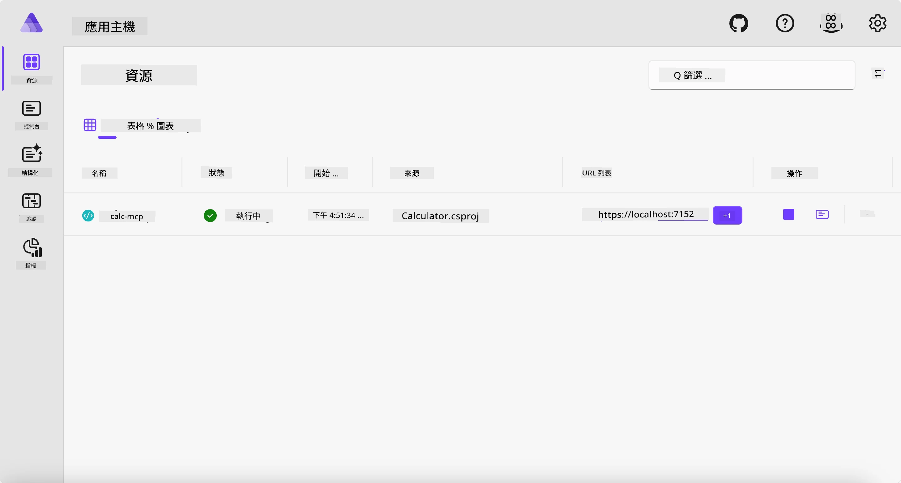
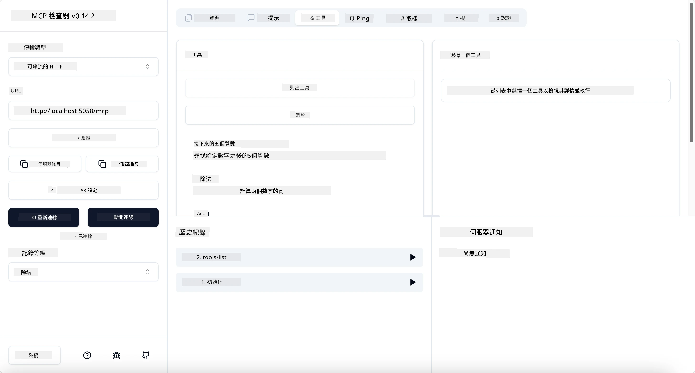
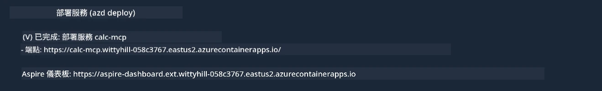

# 範例

之前的範例展示了如何使用本地的 .NET 專案及 `stdio` 類型，並且如何在容器中本地運行伺服器。這在很多情況下都是一個不錯的方案。然而，有時伺服器在遠端運行會更有用，比如在雲端環境中，這時就會用到 `http` 類型。

看看 `04-PracticalImplementation` 資料夾中的方案，可能看起來比前一個複雜許多，但實際上並不然。如果仔細查看 `src/Calculator` 專案，你會發現大部分代碼和之前的範例相同。唯一的差別是我們用不同的函式庫 `ModelContextProtocol.AspNetCore` 來處理 HTTP 請求。並且我們將 `IsPrime` 方法改成私有方法，僅是為了展示代碼中可以擁有私有方法。其他部分代碼和之前相同。

其他專案均來自 [Aspire](https://aspire.dev/get-started/what-is-aspire/)。在方案中加入 Aspire 能提升開發與測試過程的體驗，並有助於可觀察性。它並非運行伺服器的必要項，但將其納入方案是好的實踐。

## 在本地啟動伺服器

1. 從 VS Code（搭配 C# DevKit 擴充套件）導覽至 `04-PracticalImplementation/samples/csharp` 目錄。
1. 執行以下命令啟動伺服器：

   ```bash
    dotnet watch run --project ./src/AppHost
   ```

1. 當瀏覽器開啟 Aspire 儀表板時，注意 `http` URL，應該類似 `http://localhost:5058/`。

   

## 使用 MCP Inspector 測試 Streamable HTTP

若你有 Node.js 22.7.5 或以上版本，可以使用 MCP Inspector 測試你的伺服器。

啟動伺服器並在終端機執行以下命令：

```bash
npx @modelcontextprotocol/inspector http://localhost:5058
```



- 選擇傳輸類型為 `Streamable HTTP`。
- 在 Url 欄位輸入先前記下的伺服器 URL，並在後面加上 `/mcp`。應該是 `http`（非 `https`），例如 `http://localhost:5058/mcp`。
- 選擇 Connect 按鈕。

Inspector 很棒的一點是它能清楚顯示正在發生的狀況。

- 試著列出可用工具
- 試用其中一些，應該和之前一樣可以運作。

## 在 VS Code 中使用 GitHub Copilot Chat 測試 MCP 伺服器

要在 GitHub Copilot Chat 中使用 Streamable HTTP 傳輸，修改先前建立的 `calc-mcp` 伺服器配置如下：

```jsonc
// .vscode/mcp.json
{
  "servers": {
    "calc-mcp": {
      "type": "http",
      "url": "http://localhost:5058/mcp"
    }
  }
}
```

進行一些測試：

- 詢問 "3 個介於 6780 之後的質數"。注意 Copilot 會使用新工具 `NextFivePrimeNumbers` 並只回傳前三個質數。
- 詢問 "111 之後的 7 個質數"，看看會發生什麼。
- 詢問 "John 有 24 顆棒棒糖，要分給他的 3 個孩子。每個孩子有多少顆？"，看看會發生什麼。

## 部署伺服器到 Azure

現在我們來部署伺服器到 Azure，讓更多人能使用它。

從終端機導覽到 `04-PracticalImplementation/samples/csharp` 目錄，執行以下命令：

```bash
azd up
```

部署完成後，你應該會看到如下訊息：



拿到此 URL 並用於 MCP Inspector 及 GitHub Copilot Chat。

```jsonc
// .vscode/mcp.json
{
  "servers": {
    "calc-mcp": {
      "type": "http",
      "url": "https://calc-mcp.gentleriver-3977fbcf.australiaeast.azurecontainerapps.io/mcp"
    }
  }
}
```

## 下一步？

我們嘗試了不同的傳輸類型與測試工具，也將 MCP 伺服器部署到 Azure。但如果我們的伺服器需要存取私人資源呢？例如資料庫或私有 API？下一章我們將探討如何提升伺服器的安全性。

---

<!-- CO-OP TRANSLATOR DISCLAIMER START -->
**免責聲明**：
本文件由 AI 翻譯服務 [Co-op Translator](https://github.com/Azure/co-op-translator) 翻譯而成。雖然我們致力於確保準確性，但請注意，機器自動翻譯可能包含錯誤或不準確之處。原始文件的母語版本應被視為權威來源。對於重要資訊，建議進行專業人工翻譯。我們不對因使用本翻譯而產生的任何誤解或誤釋承擔責任。
<!-- CO-OP TRANSLATOR DISCLAIMER END -->